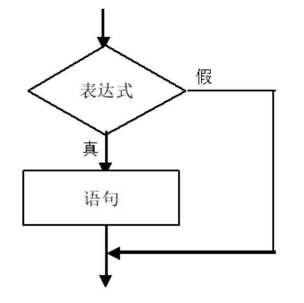
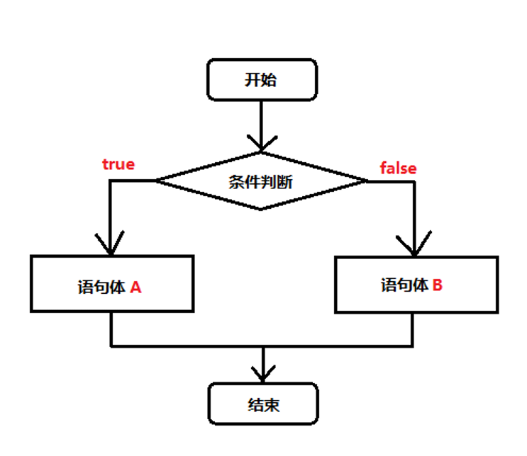
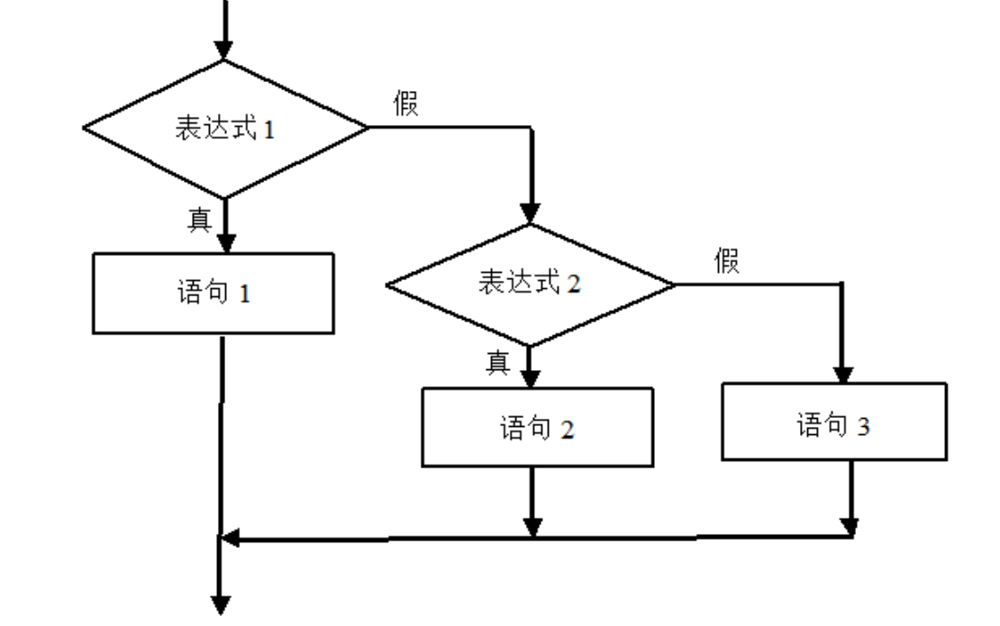

# 第二章：流程控制之分支结构/选择结构

## 本章目标

- 了解程序的三种结构


- 熟悉顺序结构的程序执行过程


- 熟练使用if语句实现分支的条件判断


- 熟练使用switch语句进行多重分支判断

## 一、流程控制

注释，变量，数据类型，运算符，流程控制，对象

程序：

想吃番茄炒蛋：

​		1.先购买食材

​		2.处理食材

​		3.起锅烧油

​		4.油热倒入食材

​		5.翻炒均匀

​		6.放入调料

​		7.再次翻炒均匀

​		8.out锅

### 1.1 什么是流程控制

程序中：程序的执行顺序。我们的程序  从上往下，从右到左 （如果右边是表达式 （左到右））。  

控制代码何时执行，是否执行，控制代码执行多少次。

### 1.2 三种程序结构

1. 顺序结构：从上往下，（等式）从右到左 （如果右边是表达式 （左到右））
2. 分支结构：控制代码何时执行，是否执行。
3. 循环结构：控制代码执行多少次。

## 二、分支结构 

### 2.1 单if分支 



语法格式：

```
if(条件表达式){
	代码块;
}
```

执行流程：

当条件表达式成立时，执行大括号中的代码块，否则，跳过代码块;

### 2.2 if else 分支判断



语法格式：

```
if(条件表达式){
	代码块①;
}else{
	代码块②;
}
```

执行流程：

当条件表达式成立时，执行大括号中的代码块①，否则，执行else后边的代码块②;

**案例1：**输入一个数据，输出这个数是奇数还是偶数？

```
//需求：输入一个数据，输出这个数是奇数还是偶数？
			/**
			 * 分析问题：
			 * 		变量				var a = prompt("请输入一个整数");
			 * 		条件表达式
			 * 			判断这个输入的数据能否被2整除
			 * 			对2取余数 是否为0   a%2==0
			 * 				如果为0  就是 偶数
			 * 				如果不为0  就是奇数
			 * 		具体执行的代码块
			 * 			满足条件执行的代码块
			 * 			不满足条件执行的代码块	
			 */
			/**
			 * 你们现在要学习的是：
			 * 		1.记住固定的语法格式。
			 * 		2.提升自己分析问题的能力。
			 */
			//prompt输入的数据是一个字符串类型
			/* var a = prompt("请输入一个整数");
			//alert(typeof a);
			if(a%2==0){
				alert(a+"是偶数");
			}else{
				alert(a+"是奇数");
			} */
```

**案例2：**开学了，体温检测，如果发烧，就进行核酸检测，看是否感染肺炎，如果是感染肺炎，立即隔离。否则，正常上课。

```
//开学了，体温检测，
			//如果发烧，就进行核酸检测，看是否感染肺炎，
			//如果是感染肺炎，立即隔离。否则，正常上课。
			/**
			 *分析问题：
			 * 		① 抽取变量  外界输出体温   隐含判断  37度
			 * 		② 判断条件  tiwen >= 37
			 * 			是：进行核酸检测
			 * 				是：立即隔离
			 * 				否：正常上课
			 * 			否：正常上课
			 */
			var tiwen = prompt("请输入你的体温：");
			if(tiwen>=37){
				//进行核酸检测
				alert("请进行核酸检测：");
				var result = prompt("请输入检测结果是或者否：");
				if(result=='是'){
					alert("立即隔离！");
				}else{
					alert("正常上课！");
				}
			}else{
				alert("正常上课!");
			}
```

### 2.3 多重 if 分支



语法格式：

```
if(条件表达式①){
	代码块①;
}else if(条件表达式②){
	代码块②;
}else if(条件表达式③){
	代码块③;
}else if(条件表达式④){
	代码块④;
}else if(条件表达式⑤){
	代码块⑤;
}。。。
else{
	最终代码块;
}
最终的结尾代码可以使用else{}  也可以使用else if(){}。
```

执行流程：

当条件表达式①成立时，执行大括号中的代码块①，否则，判断条件表达式②是否成立，如果成立执行代码块② 否则，判断条件表达式③是否成立，如果成立执行代码块③ 否则。。。。。。;

**案例1：**如果 你的java分数大于 90，输出   秀儿！ 如果在 80 -- 90之间  输出  有点秀儿，
			如果  70--80之间  输出 一般秀儿 ， 60--70 之间  勉强秀儿   60以下   陈独秀。

```
/**
			 * 如果 你的java分数大于 90，输出   秀儿！ 如果在 80 -- 90之间  输出  有点秀儿，
			如果  70--80之间  输出 一般秀儿 ， 60--70 之间  勉强秀儿   60以下   陈独秀儿。
			 */
			/**
			 * 分析问题;
			 * 		变量  java分数
			 * 		
			 */
			//常规写法：
			/* var javaScore = prompt("请输入你的java分数：");
			if(javaScore>=90){
				alert("秀儿！");
			}else if(javaScore>=80 && javaScore < 90){
				alert("有点秀儿！");
			}else if(javaScore>=70 && javaScore < 80){
				alert("一般秀儿！");
			}else if(javaScore>=60 && javaScore < 70){
				alert("勉强秀儿！");
			}else {
				alert("陈独秀儿");
			} */
			
			//简化写法：
			var javaScore = prompt("请输入你的java分数：");
			if(javaScore>=90){
				alert("秀儿！");
			}else if(javaScore>=80){
				alert("有点秀儿！");
			}else if(javaScore>=70){
				alert("一般秀儿！");
			}else if(javaScore>=60){
				alert("勉强秀儿！");
			}else {
				alert("陈独秀儿");
			}
			
			//这种错误不是语法错误，浏览器不会报错，但是运行的结果是错误的，这是逻辑错误！！！
			/* if(javaScore>=60){
				alert("秀儿！");
			}else if(javaScore>=70){
				alert("有点秀儿！");
			}else if(javaScore>=80){
				alert("一般秀儿！");
			}else if(javaScore>=90){
				alert("勉强秀儿！");
			}else {
				alert("陈独秀儿");
			} */
```

### 2.4 注意事项if(true/false) 

```
避免if(true) 或者 if(false)
```

## 三、switch case分支 

语法格式：

```
switch(参数){
	case 值1:
		代码块1;
		break;
	case 值2:
		代码块2;
		break;
	case 值3:
		代码块3;
		break;
	case 值4:
		代码块4;
		break;
	....
	default:
		代码块;
		break;
}
```

执行流程：

```
使用swith后边的参数跟下边case后边的值 做比较=== 比较，先跟 值1比较，如果相同，执行代码块1，直接结束程序！如果值1不同，接着比较值2.。。。。。。一直倒  defatult为止。
```

**案例1**：根据每天是周几使用switch语句输出不同语句

- 周一输出---新的一周开始了
- 周二到周四输出---努力工作
- 周五输出---明天就是周末了
- 周六日输出---放松的休息

**案例2**：假设这个月1号是星期三，提示用户输入本月的日期（即1日-31日），返回用户输入的那一天是星期几。

```
/**
			 * 假设这个月1号是星期三，提示用户输入本月的日期（即1日-31日）
			 * ，返回用户输入的那一天是星期几
			 * 1  8  15 星期三
			 * 2  9  16	星期四
			 * 3  10 17	星期五
			 * 4  11 18	星期六
			 * 5	星期日
			 * 6	星期一
			 * 7	星期二
			 */
			var day = Number(prompt("请输入今天几号："));
			if(day%7==1){
				alert("星期三");
			}else if(day%7==2){
				alert("星期四");
			}else if(day%7==3){
				alert("星期五");
			}else if(day%7==4){
				alert("星期六");
			}else if(day%7==5){
				alert("星期日");
			}else if(day%7==6){
				alert("星期一");
			}else if(day%7==0){
				alert("星期二");
			}
```

**案例3**：输入年份  输入月份  判断该年的该月  有多少天？

## 四、总结与作业 

### 练习：

1. 如果你是男的，就该挣钱，否则就该花钱。

2. 做学院评奖系统

​        如果数学成绩大于80分并且语文成绩大于80分，获奖学金500元。

​		如果数学小于30并且语文小于30分，输出重修。    

3. 两个数a、b，如果a能被b整除或a加b大于1000，则输出a，否则输出b  
4. 对学员的结业考试成绩评测 成绩>=90 ：优秀 成绩>=80 ：良好    成绩>=60 ：中等 成绩<60   ：差 。
5. 输入考试成绩，显示所获奖励。成绩==100分，爸爸给他买辆车。成绩>=90分，妈妈给他买MP4。90分>成绩>=60分，妈妈给他买本参考书。成绩<60分，什么都不买  。
6. 用户输入几点弹出问候信息；
    如果用户输入12点 弹出中午好；
    用户输入18点 弹出傍晚好；
    用户输入23点弹出深夜好；
7. 打印某年某月有多少天。
8. 张三为他的手机设定了自动拨号按1：拨爸爸的号按2：拨妈妈的号按3：拨爷爷的号      按4：拨奶奶的号 
9. 输入一个数，判断它是否能被3、5、7整除，注意考虑同时整除的情况。
10. 根据工资计算个人所得税。
11. 需求：已知公式：标准体重 = 身高 - 105； 上下浮动5公斤。请实现一个计算器，用户输入身高体重，输出偏胖，偏瘦，标准。