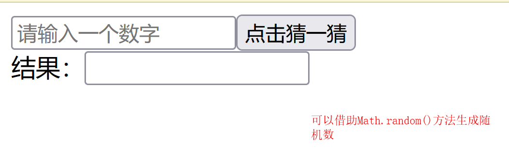
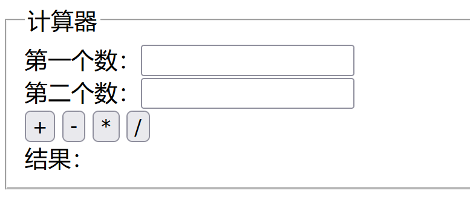

# 第五章：函数(重点)

## 课前测试 5分钟：

99乘法表 

## 回顾：

双重循环  

break;

continue:

对象：属性/行为(方法)

## 本章目标 

- 掌握函数的概念
- 库函数/系统函数  
- 自定义函数
- 自执行函数 
- 函数的调用方式
- 函数的参数和返回值
- 变量的作用域

## 一、函数  

### 1.1 什么是函数 

​		**函数是指一段可以直接被另一段程序或代码引用的程序或代码。**也叫做子程序、（OOP中）方法。

一个较大的[程序](https://baike.baidu.com/item/程序/13831935)一般应分为若干个程序块，每一个模块用来实现一个特定的功能。所有的高级语言中都有子程序这个概念，用子程序实现模块的功能。在[C语言](https://baike.baidu.com/item/C语言)中，子程序是由一个主函数和若干个函数构成的。由主函数调用其他函数，其他函数也可以互相调用。同一个函数可以被一个或多个函数调用任意多次。

在程序设计中，常将一些常用的功能模块编写成函数，放在函数库中供公共选用。要**善于利用函数**，以减少重复编写程序段的工作量。

**概念：一段封装好的具有特定功能的代码块。函数本身不会执行，需要去调用才能执行。** 可以被重复调用多次。

### 1.2 为什么要使用函数 

if(){} : 控制代码执行的分支

for(){}:控制代码执行的次数

function(){} : 减少我们编码的工作量。

### 1.3 函数的分类

对象：如何在程序中描述一个对象，一个具体的事物，特征和行为。

人(种类)：属性（身高，体重，姓名。。。。）  行为：吃 喝 睡  唱  跳  rap  打篮球。。。

焦彦岭(对象)： 

万物皆对象。

< p>< /p> 每一个标签都是一个对象--》标签对象

- 系统函数/库函数/内置函数 

  window.alert(); 

  alert()  parseInt()  Number()  .... 属于内置对象的行为。

- 自定义函数(重点 难点(按照我们自己的需求))

  根据我们自己的需求去自己封装一些具有特定功能的代码块。

### 1.4 函数的定义和使用

语法格式：

```
function 函数名(){
	代码块;
}
```

### 1.5 函数的应用场景

案例1：点击按钮改变页面的背景颜色

案例2：点击按钮切换图片

### 1.6 函数的参数和返回值

案例：封装一个函数，输入5个数，求5个数中的最大值。

### 1.7 自执行函数

函数声明完以后，需要调用才能够使用

但是一些情况下，我们需要函数声明后无需调用，就可以自己来执行

此时，就需要了自执行函数，无需调用自己执行

定义：

```javascript
( function("参数"){ 
     //JavaScript语句;
})();
( function("参数"){ 
    //JavaScript语句;
}("给参数传的值" ));
```

## 二、作用域问题

全局变量：在 < script>标签中声明的变量。

局部变量：函数内部声明的变量。

作用域就是变量与函数的可访问范围，即作用域控制着变量与函数的可见性和生命周期

作用域就是变量起作用的区域，生效的范围。

作用域分为全局作用域和局部（函数）作用域

#### 1. 全局作用域 

函数以外声明的变量拥有全局作用域，整个文档都可以进行调用

所有末定义（么有使用var）直接赋值的变量自动声明为拥有全局作用域

所有**window对象** 的属性拥有全局作用域

- window对象的内置属性都拥有全局作用域，例如window.name、window.location、window.top等等

代码示例：

```
//全局作用域
var num = 8;
alert(num);
```

此时可以调用，因为变量是在函数外声明的，全局整个文件都可以调用。

#### 2. 函数作用域（局部作用域）

​	在函数内声明的变量，只能在函数内调用。和全局作用域相反，局部作用域一般只在固定的代码片段内可访问到

​	 代码示例：

```
function fn() {
   var num = 9;
}
alert(num);
```

此时，alert不出来东西，我们看控制台的console,可以看到：‘num is not defined’，告诉我们num未被定义，这是因为，num是在函数内声明的，它的作用域只在该函数内，外边调用不了这个函数，这就是局部作用域。

##### **2-1、如果我们在函数内调用该num,然后调用该函数，是可以的。**

​	代码示例：

```js
function fn() {
  var num = 9;
  alert(num); //9
}
console.log(num); //error
fn();
```

因为是在函数内调用的

##### **2-2、 如果我们在函数外声明一个全局变量，然后在函数内进行调用：**

```javascript
var num = 9;
function fn() {
  alert(num);
}
fn();
```

  因为，此时调用的num是全局变量，全局都可以使用，不论函数内还是函数外。

##### **2-3、如果全局声明一个变量，函数内声明一个变量，变量名同名**

​	代码示例：

```javascript
var num = 9; //全局变量
function fn() {
   console.log(num);//undefined
  var num = 10; //局部变量
  alert(num); //10
}
fn()
console.log(num);//9
```

此时的fn 弹出的是10，console.log(num)弹出的9,因为fn调用的是函数内的变量，console.log访问不了函数内部的num,函数内部num作用域只在函数内，还是获取的全局变量，函数外的那个，所以弹出10,9.

##### 2-4、 如果全局声明一个变量，函数内声明一个变量不加var，变量名同名

​	代码示例：

```javascript
var num = 9; //全局变量
function fn() {
  num = 10; //全局变量
  alert(num); //10
}
fn()
alert(num); //10
```

此时，弹出的是10，10,因为函数内num没有声明var变量，访问的是全局的变量var num,函数从上往下执行，被函数内的num赋值了10,覆盖了上面的var num9. 

如果上述的代码fn和alert(num)交换位置，那么弹出的是9,10.因为函数不被调用的时候是不执行的，所以第一次访问的全局变量还没有被覆盖。

总结：

​	1、不加var 当变量名重名的时候，很容易把上面同名的变量名的值给覆盖掉进行修改。

​	2、函数内的变量不加var的时候，执行完该函数后，会自动提升作用域，提升为全局作用域。

```javascript
function fn() {
  num = 10;
}
fn();
alert(num);//10 函数内的变量不加var的时候，执行完该函数后，会自动提升作用域，提升为全局作用域。
```

## 作用域链

一般情况下，变量取值是到创建这个变量的作用域中取值。

但是如果在当前作用域中没有查到值，就会向上级作用域去查，直到查到全局作用域

这么一个查找过程形成的链条就叫做作用域链。	

```javascript
 <script>
        var x = 10;
        function f1() {
            var x = 11;
            function f2() {
                var x = 12;
                function f3() {
                    console.log(x);
                }
                f3()
            }
            f2()
        }
        f1(); //12
    </script>

```

## 三、总结与作业

### 3.1 自己总结笔记知识点

< div>你好哈哈< /div>

document.getElementById("div").innerText = "你好喝喝";

表单元素取值和赋值：

< input id="aaa" type="text" value="">

document.getElementById("aaa").value = "123";

### 3.2 练习作业

- 所有课堂案例

- 猜数字小游戏 1-100 以内的数字 

  

- 计算器作业 点击按钮把相应的结果显示到结果框中 

  

- 页面设置5个文本框，设置4个按钮分别是 最大，最小，平均，求和，点击按钮将结果显示到一个结果框中。