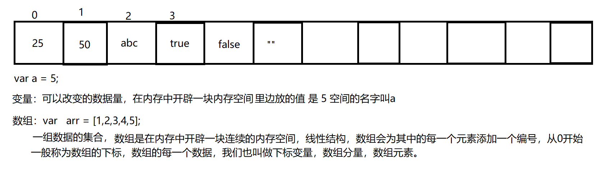
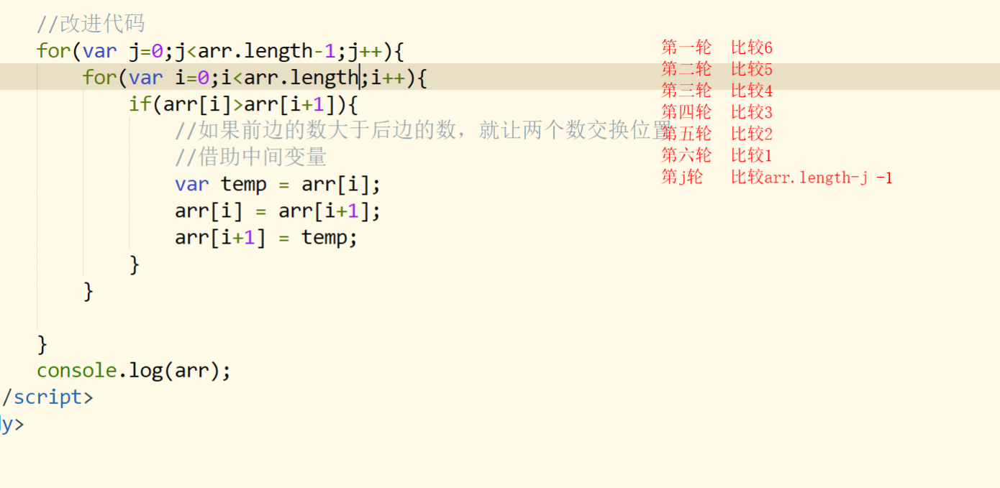
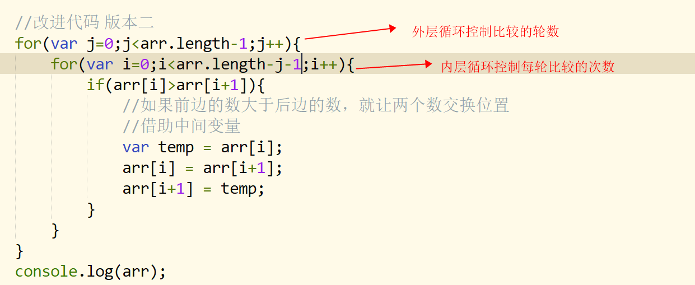

# 第六章：内置对象01

## 课前测试 5分钟：

封装一个函数，比较三个数的最大值。

封装函数/方法的三要素：

​		1.确定函数名====》命名要英文有意义

​		2.参数列表

​		3.返回值 ： 根据自己的需求来确定

## 回顾： 

函数：一段封装好的具有**特定功能**的代码块，本身不会执行，调用的时候才会执行，多次执行。

自执行函数

函数的调用方式：

​		函数名(参数列表);

​		跟页面中的标签绑定 

​				1.直接标签  事件类型onclick = 函数名(); 

​				2.绑定匿名函数

​						获取标签对象.事件类型 = function(){};

作用域：

​		全局作用域====》window 所有的全局属性，自动成为  window的成员。

​		全局变量

​		局部变量

​		变量的查找规则：先查找当前作用域是否存在该变量，如果存在直接使用，如果不存在，找上一级作用域，一直到 全局作用域。

var  a = 5; 定义变量  开辟一块内存空间

## 本章目标 

- 自定义对象
- Array数组
- 掌握数组的常用方法

## 一、对象简介

### 1.1 对象 

类与对象：

​		类是对象的模板  对象是类的实例化/具现化

确确实实，具体，看得见摸得着的对象。

对象：属性，行为

内置对象：本身会包含一些属性和方法，我们还可以给它设置新的属性和方法。

学习内置对象：其实就是学习 这个内置对象上 具有什么属性和方法，记住它。

### 1.2 自定义对象 

自定义对象：属性和方法

​		属性和方法都是有我们去设置的。

```html
<!DOCTYPE html>
<html>
	<head>
		<meta charset="utf-8" />
		<title></title>
	</head>
	<body>
		<script type="text/javascript">
			/**
			 * 自定义对象的两种方式：
			 * 		1.字面量形式定义
			 * 		2.常规方法
			 */
			// 1.通过 new关键字创建对象
			var wxb = new Object();
			// 定义属性和函数
			wxb.h = 180;
			wxb.w = 130;
			wxb.name = "王相博";
			//定义吃的行为
			wxb.eat = function(food){
				alert(this.name+"喜欢吃"+food);
			}
			//this关键字  这  这个
			//当前所在区域的对象
			//调用属性和行为
			console.log(wxb.name);
			wxb.eat("面包");
			
			//2.简单形式 对象的数据形式  key:value;键值对形式
			var guo = {
				name:"郭梦月",
				age:21,
				height:168,
				introduce:function(){
					alert("我叫"+this.name+"，我今年"+this.age+"岁了！");
				}
			};
			//调用
			console.log(guo.name);
			guo.introduce();
			
			//对象中属性和方法的调用
			//对象名.属性名  对象名.方法名
		</script>
	</body>
</html>
```

## 二、内置对象之数组 Array

### 2.1 什么是数组 

**数组**（Array）是**有序的元素序列**。 [1] 若将有限个类型相同的变量的[集合](https://baike.baidu.com/item/集合/2908117)命名，那么这个名称为数组名。组成数组的各个变量称为数组的分量，也称为数组的元素，有时也称为[下标变量](https://baike.baidu.com/item/下标变量/12713827)。用于区分数组的各个元素的数字编号称为下标。数组是在[程序设计](https://baike.baidu.com/item/程序设计/223952)中，为了处理方便， 把**具有相同类型的**若干元素按有序的形式组织起来的一种形式。 [1] 这些有序排列的同类数据元素的集合称为数组。

数组是用于储存多个相同类型数据的集合。



java: 数组定容，定类型。

js的数组：可以存放任意数据类型，js数组可以自动扩容。

js的数组为什么可以存放任意数据类型，弱类型语言，底层对数组做了二次封装，对象数组。

**js数组底层分为两类：** 

​			快数组：就是一块连续的内存空间。				查找快，效率高

​			慢数组：Hash散列结构  分散空间。     	  	 查找慢，效率低


变量：一个变量只能存放一个数据。

对象：一系列**有关联**的数据。

数组：存储多个数据。

​		它们的存在是为了什么？**存放数据。** 

数组，二叉树 Tree， B+tree，红黑树，链表，队列  。。。	数据结构

### 2.2 为什么使用数组

为了我们更好的存储数据，操作数据。

### 2.3 数组的定义

```
<script type="text/javascript">
			//数组：属于对象类型
			//1.方式一
			//创建一个空的数组
			//var arr = new Array();//构造函数
			//创建一个具有初始容量的数组 ,初始容量
			//var arr = new Array(5);
			//创建一个具有初始数据的数组
			//var arr = new Array(1,2,3,4,5);
			
			
			//2.方式二
			//创建一个空的数组
			//var arr = [];
			//创建一个具有初始数据的数组
			var arr = [1,2,3,4,5];
		</script>
```

### 2.4 数组的取值和赋值

```
//创建一个具有初始数据的数组
			var arr = ["a","b","c","d","e"];
			
			//跟数组 添加一个我们自己定义的属性
			arr.aaa = "你好哈哈哈";
			
			
			//数组中数据的存取  i
			//取值 根据下标  数组名[index]  /数组名[下标编号]
			//如果下标超出了 范围，取出的数据是 undefined
			console.log(arr[5]);
			
			//数组的属性  ====》  length长度
			/* console.log(arr.length);
			console.log(arr.aaa); */
			
			//赋值 其实就是修改
			//arr[5] = "123";
			arr[3] = "true";
			alert(arr);
```

### 2.5 数组的遍历  

```html
<script type="text/javascript">
			var arr = [34,21,56,98,33,55];
			//普通for循环
			/* for(var i=0;i<arr.length;i++){
				console.log(arr[i]);
			}
			console.log("=======================");
			for(var i=arr.length-1;i>=0;i--){
				console.log(arr[i]);
			} */
			/* for (var i = 0; i < arr.length; i++) {
				arr[i]
			} */
		
			/**
			 * for in循环
			 * 可以遍历数组
			 * 		i 表示下标
			 * 
			 */
			for (var i in arr) {
				console.log(i+"=="+arr[i]);
			}
			//可以遍历对象
			var obj = {
				name:"张三",
				age:18,
				address:"AAA牛顿国际"
			}

			/**
			 * k表示属性名 
			  *对象中属性访问：
			  * 	1. 对象名.属性名
			  * 	2. 对象名[属性名]
			  */
			for(var k in obj){
				console.log(obj[k]);
			}
		</script>
```

基础知识没有记。

讲课

1. 知识脉络 

### 2.6 数组的常用操作 

- 查询
- 新增
- 删除

```html
<script type="text/javascript">
			//数组的查询操作
			var arr = [34,56,21,32,77,54,13];
			//找出指定 32 数据在数组中第一次的位置，把for循环倒着就是指定数据最后一次出现的位置
			
			//封装一个函数  查找指定数据在数组中第一次出现的位置。
			/**
			 * 函数封装三要素：
			 * 		1.函数名     firstIndex
			 * 		2.参数列表   
			 * 				参数1：指定的数据
			 * 				参数2：指定的数组
			 * 		3.返回值
			 * 				第一次出现的下标 i;
			 */
			function firstIndex(first,array){
				for(var i=0;i<array.length;i++){
					if(array[i]==first){
						return i;
					}
				}
			}
		
			/* var index = firstIndex(32,arr);
			alert(index); */
			//数组的新增操作 插入 把指定数据插入到数组的指定位置
			// 在 77的前边插入一个 88
			/**
			 * 经过分析可得：
			 * 		想在数组中插入一个数据，需要把插入位置 以后的数据，挨个向后移动一位。
			 * 		还必须要倒着挪，正着挪会把数据覆盖掉。
			 */
			/* for(var i=arr.length-1;i>=4;i--){
				//移位操作
				arr[i+1] = arr[i];
			}
			//对原本的下标4的位置  做重新赋值
			arr[4] = 88;
			alert(arr); */
			
			//删除  需求把 77删除掉
			for(var i=4;i<arr.length-1;i++){
				arr[i] = arr[i+1];
			}
			//移位后把数组的长度 -1
			arr.length = arr.length-1;
			alert(arr);
		</script>
```

### 2.7 冒泡排序(选作)   

- 普通写法：  

  

  版本一：



最终版本：

第一轮比较已将可以把最小的数字挪到最后一位，第二轮比较将第二小的数字移动到倒数第二位，下边依次。。。。

所以第一轮只需要比较6次，第二轮只需要比较5次，第三轮只需要比较4次，第四轮需要比较3次，第五轮需要比较2次，第六轮需要比较1次。

所以内层循环每次只需要比较arr.length-j-i次！

得出代码：



扩展：**选择排序**，**二分法**   了解。

### 2.8 获取页面标签对象的常用方法  

```html
document.getElementById("id值")//根据id获取标签对象  获取到的是1个
document.getElementsByClassName("类名")//根据类名获取相应的标签  多个
document.getElementsByName("")// 根据name属性 获取相应的标签   多个
Tag 标签
document.getElementsByTagName("")//根据标签名字 获取相应的标签  多个

query查询  
document.querySelector(".aaa");//根据选择器获取标签  1个
document.querySelectorAll(".aaa");//根据选择器获取标签 全部
```

案例1：点击按钮改变页面背景颜色，使用数组作为数据源 

案例2：点击p标签时，改变p标签的背景颜色 

### 2.9 数组的常用方法 (内置函数)

| 名称                       | 描述                                        |
| -------------------------- | ------------------------------------------- |
| join('-')                  | 将数组转换为使用符号连接的字符串            |
| concat(arr1,arr2)          | 与另一个数组合并为一个新数组                |
| reverse()                  | 将数组反转                                  |
| sort(function(){排序规则}) | 对数组进行排序                              |
| push(ele1,ele2)            | 向数组末尾添加新元素                        |
| unshift(ele1,ele2)         | 向数组的开头添加新元素                      |
| pop()                      | 删除数组中末尾的值 返回删除的值             |
| shift()                    | 删除数组中开头的值 返回删除的值 与pop()相反 |
| splice(1,2,3,4)            | 删除、替换、插入数组元素                    |
| indexOf(ele)               | 查找元素的下标位置                          |


## 三、总结与作业

- 课堂案例
- 自己封装插入和删除的函数（选作）
- 写五个文本框，对五个文本框中的内容进行排序——把排序后的内容重新放入五个框。

