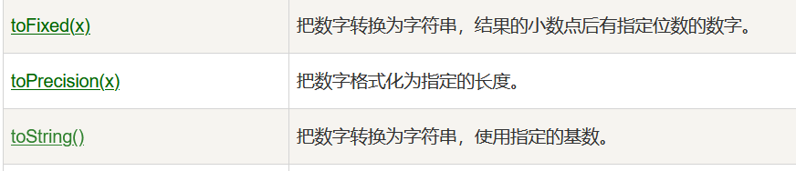

# 第七章：内置对象02

## 课前测试 10分钟：

页面上创建三个button按钮，封装一个函数，点击按钮，弹出相对应的提示"您点的是第1个按钮，第2个按钮，第3个按钮"。

## 回顾：

脉络体系：数组

1.什么是数组

2.为啥用数组 

3.数组怎么用 

4.数组的一些常见用法 

5.数组中含有的一些内置函数 


数组的sort()方法  排序是按照unicode码表来排的。

字符集：

​		ascii 128

​		ISO-8859-1   256

​		GBK 

​		GB2312 专门解析中文

​		UTF-8 万国码 

## 本章目标 

- Date对象
- String对象  
- Math对象 
- Number对象  

Number对象的方法: 



## 一、Date对象   

方法：

| 方法名            | 解释                                                         |
| ----------------- | ------------------------------------------------------------ |
| getFullYear()     | 返回 Date 对象的年份，其值为4位数                            |
| getMonth()        | 返回 Date 对象的月份，其值介于0～11之间（注：0-1月份  11代表12月） |
| getDate()         | 返回 Date 对象的日，其值介于1～31之间                        |
| getHours()        | 返回 Date 对象的小时数，其值介于0～23之间                    |
| getMinutes()      | 返回 Date 对象的分钟数，其值介于0～59之间                    |
| getSeconds()      | 返回 Date 对象的秒数，其值介于0～59之间                      |
| getDay()          | 返回 Date 对象的星期中的每一天，其值介于0～6之间（注：0-周日） |
| getMilliseconds() | 返回 Date 对象的毫秒(0 ~ 999)。                              |
| getTime()         | 返回 1970 年 1 月 1 日至今的毫秒数。                         |

| setDate()     | 设置 Date 对象中月的某一天 (1 ~ 31)。 |
| ------------- | ------------------------------------- |
| setMonth()    | 设置 Date 对象中月份 (0 ~ 11)。       |
| setFullYear() | 设置 Date 对象中的年份（四位数字）。  |
| setHours()    | 设置 Date 对象中的小时 (0 ~ 23)。     |
| setMinutes()  | 设置 Date 对象中的分钟 (0 ~ 59)。     |
| setSeconds()  | 设置 Date 对象中的秒钟 (0 ~ 59)       |

案例：书写代码，输出3天以后是星期几 

## 二、String对象 

案例1： str = "2c3dfcdgjcsec",查看c在字符中所有的下标，并放入数组中。

```js
// str = "2c3dfcdgjcsec", 查看c在字符中所有的下标，并放入数组中。
			//可以把字符串 认为是一个  字符数组 ['2','c','3'.........]
			var str = "2c3dfcdgjcsec";
			var indexArr = [];
			for (var i = 0; i < str.length; i++) {
				if(str[i]=='c'){
					indexArr.push(i);
				}
			}
			alert(indexArr);
```

案例2：找出数组arr ['America' , 'Greece' , 'Britain' , 'Canada' , 'China' , 'Egypt'] 中包含a或者A 字符串的个数。

=====》改变 ：字符a在数组arr中一共有几个？

案例3：var str='border-left-color';  改为： BorderLeftColor

## 三、Math对象

   工具对象：用来操作数字的各种方法。

| abs(x)           | 返回 x 的绝对值。             |
| ---------------- | ----------------------------- |
| ceil(x)          | 对数进行上舍入。              |
| floor(x)         | 对 x 进行下舍入。             |
| max(x,y,z,...,n) | 返回 x,y,z,...,n 中的最高值。 |
| min(x,y,z,...,n) | 返回 x,y,z,...,n中的最低值。  |
| random()         | 返回 0 ~ 1 之间的随机数。     |
| round(x)         | 四舍五入。                    |

案例：生成随机数

案例：页面中生成50个div标签，设置每一个div标签的宽高都是100px,并且设置每一个div元素的随机产生背景颜色。

## 四、全局函数

| eval()       | 计算 JavaScript 字符串，并把它作为脚本代码来执行。 |
| ------------ | -------------------------------------------------- |
| isFinite()   | 检查某个值是否为有穷大的数。                       |
| isNaN()      | 检查某个值是否是非数字。                           |
| Number()     | 把对象的值转换为数字。                             |
| parseFloat() | 解析一个字符串并返回一个浮点数。                   |
| parseInt()   | 解析一个字符串并返回一个整数。                     |
| String()     | 把对象的值转换为字符串。                           |

## 五、作业与总结

总结今日所讲解知识点

作业：见作业素材