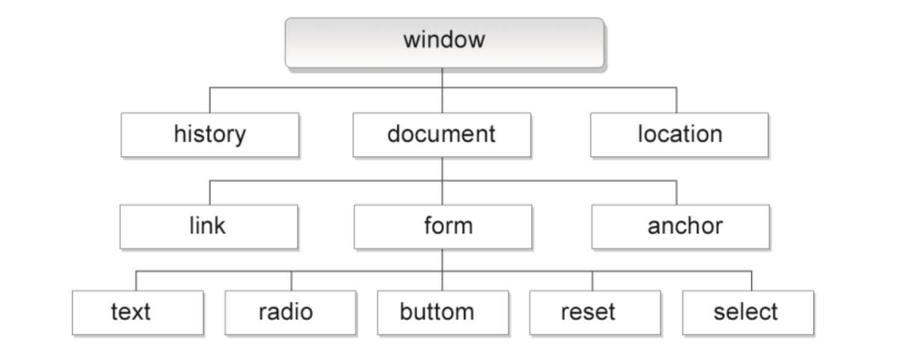

# 第十章：BOM编程

## 课前测试 10分钟：

复选框的全选反选效果。

## 回顾：

style  获取和设置行内样式

document.defaultview.getComputedStyle();获取  内部样式表的属性

## 本章目标 

- 什么是BOM
- BOM中的对象
- BOM中的常用方法和属性

## 一、BOM编程 

### 1.1 什么是BOM 

js的三大组成部分：ECMA的基本语法   DOM   BOM

browser  object model 浏览器对象模型

DOM对页面中的标签和样式 增删改查的操作

BOM主要用来操作浏览器。

浏览器对象模型 (BOM) 使 JavaScript 有能力与浏览器"对话"。

------

## 浏览器对象模型 (BOM)

浏览器对象模型（**B**rowser **O**bject **M**odel (BOM)）尚无正式标准。

由于现代浏览器已经（几乎）实现了 JavaScript 交互性方面的相同方法和属性，因此常被认为是 BOM 的方法和属性。

------

## Window 对象 

所有浏览器都支持 window 对象。它表示浏览器窗口。

所有 JavaScript 全局对象、函数以及变量均自动成为 window 对象的成员。

全局变量是 window 对象的属性。

全局函数是 window 对象的方法。

甚至 HTML DOM 的 document 也是 window 对象的属性之一：



### 1.2 为什么学习BOM编程

BOM主要用来操作浏览器窗口。

### 1.3 BOM的组成部分

#### 浏览器对象模型

| 对象名称                    | **说明**                                                     |
| --------------------------- | ------------------------------------------------------------ |
| window                      | 窗口对象, 可以用来控制当前窗口, 或打开新的窗口               |
| screen                      | 屏幕对象, 获取屏幕相关信息                                   |
| navigator                   | 浏览器对象, 通过这个对象可以判定用户所使用的浏览器           |
| history                     | 历史对象, 可以用来前进或后退一个页面                         |
| location                    | 地址对象, 可以用来获取当前页面URL的信息                      |
| JavaScript 计时事件         | 在一个设定的时间间隔之后来执行代码，而不是在函数被调用后立即执行 |
| localStorage SessionStorage | 存储对象, 可以用来存储数据, 和cookie相似, 区别是它是为了更大容量存储设计的, 在使用上也更加方便 |

### window对象：

window对象：

​		1.js中的全局对象

​		2.浏览器的窗口

```
window.open("路径地址")打开新窗口
window.close()关闭窗口
innerHeight
innerWidth  文档的宽和高
outerHeight
outerWdith  文档的高度+工具栏的高度
```

### screen对象：

跟客户端屏幕相关的信息

```
availHeight   屏幕的高度
availWidth    屏幕的宽度  不包含  底部工具条
```

### navigator对象：

```
User-Agent：用户机的客户端信息
Mozilla/5.0 (Windows NT 10.0; Win64; x64; rv:93.0) Gecko/20100101 Firefox/93.0
场景：
	可以判断  使用的客户端是什么？
	可做统计分析：使用我们网站的用户 ，是浏览器多，移动端多   安卓/ios  
indexof("Firfox") != -1
```

### history对象：

历史对象 

```
window.history.forward();
window.history.back();
//go() 括号中可以写整数  正数 代表前进  1   负数代表后退
window.history.go(整数);
```

### location对象：

```html
<!DOCTYPE html>
<html>
	<head>
		<meta charset="utf-8">
		<title></title>
	</head>
	<body>
		<button onclick="bbb()">刷新</button>
		<form action="" method="get">
			<input type="text" name="user" id="" value="" />
			<input type="submit" value=""/>
		</form>
		<button onclick="aaa()">点我</button>
		<a href="#bbb">点我11111</a>
		<script type="text/javascript">
		/**
		 * url ：代表路径
		 * http://127.0.0.1:80/day01/demo01?username=张三&password=123#锚点名称
		 * http://  网络传输协议  超文本传输协议
		 * IP地址+端口号====域名
		 * 127.0.0.1(域名) （本机的ip） IP地址   作用：在网络环境中 定位主机
		 * 80        端口号      作用：通过IP地址定位主机后，通过端口号定位  服务(应用程序)
		 * /day01/demo01       	资源路径(确定要访问 服务器的哪个程序)
		 * ？  					路径与 数据(从前台发送到后台的数据 get请求才有)的分隔符
		 * <input type="text" name='username'>
		 * username=张三&password=123 要发送到后台的数据
		 * #aaa					锚点部分
		 */
			function aaa(){
				/* console.log(window.location.href);
				//window.location.href;
				console.log(window.location.port);
				
				console.log(window.location.search);
				console.log(window.location.host); */
				
				//有历史的  跳转指定页面
				//window.location.href = "http://www.baidu.com";
				//跳转指定页面   没有历史记录
				//window.location.replace("http://www.jd.com");
				//有历史 跳转指定页面 
				window.location.assign("http://www.jd.com");
			}
			
			function bbb(){
				//刷新页面
				window.location.reload();
			}
		</script>
	</body>
</html>
```

### JavaScript 计时事件： 

| [setInterval()](https://www.runoob.com/jsref/met-win-setinterval.html) | 按照指定的周期（以毫秒计）来调用函数或计算表达式。 |
| ------------------------------------------------------------ | -------------------------------------------------- |
| [clearInterval()](https://www.runoob.com/jsref/met-win-clearinterval.html) | 取消由 setInterval() 设置的 timeout。              |
| setTimeout()                                                 | 在指定的毫秒数后调用函数或计算表达式。             |
| [clearTimeout()](https://www.runoob.com/jsref/met-win-cleartimeout.html) | 取消由 setTimeout() 方法设置的 timeout。           |

setTimeout() 延迟一定的时间调用函数，调用一次。


案例1：动画播放。

案例2：定时器广告弹出

案例3：实时获取当前系统时间

案例4：短信验证码倒计时

## 二、总结与作业

1.总结今日内容

2.作业：

​		所有课堂案例搞懂  3遍以上		

​		制作一个倒计时，现在距离过年还有 多少月，多少天，多少时，分，秒