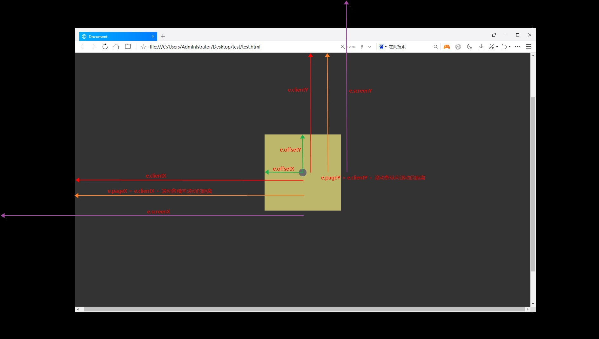
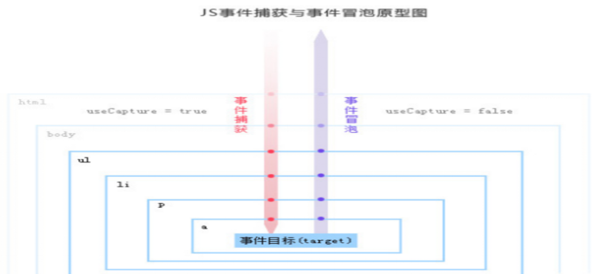
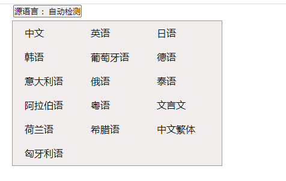
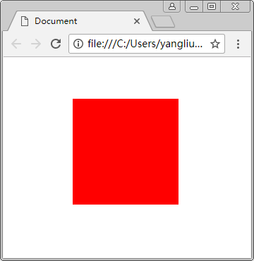

# 第十二章：事件02

## 课前测试(15分钟)：

默写：(方法要指明参数和参数含义 以及注意事项)

​		1.绑定事件的方式有哪些

​		2.常用的事件类型以及说明 

## 回顾：

绑定事件的三种方式：

  		1. < p  onclick = 函数名()>
  		2. DOM对象.addEventListener( 事件类型 ,  函数名  , useCapture  );  false冒泡   true捕获阶段
  		3. DOM对象.removeEv.....(); 

事件类型：

​		鼠标事件

​		表单事件

​				onreset

​				onsubmit 

​		键盘事件

​		窗口事件

## 本章目标 

- 了解什么是event (事件)对象
- 掌握什么是事件流&阻止事件冒泡的方法 
- 掌握阻止默认行为的方法 

## 一、event对象(事件对象) 

事件对象  

```
var e = e || window.event;
```

## event对象属性  

| 属性          | 描述                                                         |
| ------------- | ------------------------------------------------------------ |
| altKey        | 返回当事件被触发时，"ALT”是否被按下。                        |
| button        | 返回当事件被触发时，哪个鼠标按钮被点击。                     |
| clientX       | 返回当事件被触发时鼠标指针相对于浏览器页面(或客户区〉的水平坐标客户区指的览器的有效区域 |
| clientY       | 返回当事件被触发时鼠标指针向对于浏览器页面(或客户区）的垂直坐标客户区指的览器的有效区域 |
| ctrlKey       | 返回当事件被触发时，"CTRL”键是否被按下。                     |
| metakey       | 返回当事件被触发时，"meta”键是否被按下。                     |
| relatedTarget | 返回与事件的目标节点相关的节点。                             |
| screenX       | 返回当某个事件被触发时，鼠标指针的水平坐标。鼠标相对于显示器屏幕x轴的位置 |
| screenY       | 返回当某个事件被触发时，鼠标指针的垂直坐标。鼠标相对于显示器屏幕Y轴的位置 |
| shiftKey      | 返回当事件被触发时，"SHIFT”键是否被按下。                    |

如图所示，假设页面中灰色圆点是鼠标点击处，黄色区域是鼠标触发事件对象

 

### 鼠标位置

 1、screenX 和screenY

参照点：电脑屏幕左上角
screenX：鼠标点击位置相对于电脑屏幕左上角的水平偏移量
screenY：鼠标点击位置相对于电脑屏幕左上角的垂直偏移量
2、clientX和clientY

参照点：浏览器内容区域左上角
clientX：鼠标点击位置相对于浏览器可视区域的水平偏移量（不会计算水平滚动的距离）
clientY：鼠标点击位置相对于浏览器可视区域的垂直偏移量（不会计算垂直滚动条的距离）
3、pageX和pageY

参照点：网页的左上角
pageX：鼠标点击位置相对于网页左上角的水平偏移量，也就是clientX加上水平滚动条的距离
pageY：鼠标点击位置相对于网页左上角的垂直平偏移量，也就是clientY加上垂直滚动条的距离
4、offsetX和offsetY

offsetX：鼠标点击位置相对于触发事件对象的水平距离
offsetY：鼠标点击位置相对于触发事件对象的垂直距离

### 键盘键码

获取键盘输入的情况

| 属性    | 说明                                              |
| ------- | ------------------------------------------------- |
| key     | 键盘按下的键  类似于输入的值。如按下0 ，显示key:0 |
| keycode | 按键对应的Unicode编码                             |

unicode码表  ===》 utf-8  万国码

前256位====》欧码  ISO-8859-1

前128位====》美码  ASCII

## 二、事件流(阻止事件冒泡)

从页面中接收事件的顺序 


**冒泡型和捕获型事件传播**：

> 如上图页面结构，若所有的元素全部绑定了事件，冒泡型事件传播即从最底层的点击事件开始，逐级向上全部触发事件。
>
> 如果是捕获型事件传播，若点击的是最后的div事件，则时间是从最外层的document开始逐级向下开始触发事件。

**事件捕获**：

>**定义：** 事件从被点击元素是层级最高的祖先元素（设置捕获-true）开始，一直渗透到其下所有的子元素 
>
>***形象比喻：*** 老板一声令下，所有员工开始干活 。
>
>**语法：**
>
>-  dom.addEventListener('eventName', fn, true)

**事件流的弊端：**

牵一发而动全身

一个元素会把他接收到的事件传递给他的父级元素，一直到window

**所以，我们需要阻止事件冒泡** 

>IE的事件流叫做事件冒泡。即事件开始时由最具体的元素接收，然后逐级向上传播到较不为具体的节点(文档)。
>
>所有现代浏览器都支持事件冒泡，但是具体由差异，ie9、谷歌、火狐都会将事件一直冒泡到window对象。
>网景团队提出的另一种事件流叫做事件捕获。事件捕获的思想是不太具体的节点应该更早接收到事件，而具体的节点应该最后接收事件。
>
>虽然事件捕获是网景团队唯一支持的事件流模型。但是ie9、谷歌、火狐等也都支持。但是这些浏览器是从window开始的。
>
>由于老版本的浏览器不支持，因此很少有人使用事件捕获。我们也建议大家放心的使用事件冒泡，在有特殊需要的时候再使用事件捕获。

**js事件捕获原型图：**



​                                                                               

事件触发时，所经历的三个阶段：捕获阶段  、 处于目标对象阶段、 冒泡阶段

### 阻止事件冒泡

#### 语法：

```js
非IE下：event.stopPropagation();
IE下：event.cancelBubble=true;
```

#### 案例：仿百度翻译下拉框

需求说明：制作百度翻译下拉框，当点击“源语言：自动检测按钮”时，下拉框出现，点击页面时，下拉框消失

技能要求：要使用阻止冒泡知识点 

 

```html
<!DOCTYPE html>
<html>
	<head>
		<meta charset="utf-8">
		<title></title>
		<style type="text/css">
			.box{
				width: 500px;
				height: 500px;
				background-color: red;
			}
		</style>
	</head>
	<body>
		<button onclick="aaa()">点我</button>
		<div class="box" hidden></div>
		<script type="text/javascript">
			var divEle = document.getElementsByTagName("div")[0];
			//1.给按钮绑定事件  点击按钮让div框显示
			document.getElementsByTagName("button")[0].onclick = function(e){
				
				e = e || window.event;
				divEle.style.display = 'block';
				console.log("按钮触发");
				//此时要阻止按钮的事件冒泡
				//兼容写法 
				//e.cancelBubble = true;
				if(window.event){
					//兼容IE8以及下的版本
					e.cancelBubble = true;
				}else{
					e.stopPropagation();
				}
			}
			
			//2.点击文档的空白部分  让div框再次隐藏 
			document.onclick = function(){
				divEle.style.display = 'none';
				console.log("文档触发");
			}
		</script>
	</body>
</html>
```

## 三、阻止默认行为  

> oncontextmenu 鼠标右键 

所有学员可以打开浏览器，然后单击鼠标右键就会弹出菜单 

如果我们不想让弹出该内容，如何解决上述问题呢？

语法：

```js
1.  e.preventDefault();//兼容非ie
2.  e.returnValue = false; //兼容ie
3.  return false;//必须放在函数代码的末尾
```

案例1：DIY个性菜单 

点击鼠标右键，阻止掉默认菜单，出现自定义菜单，且鼠标点击哪里，自定义菜单就在哪里

案例2：拖拽案例

需求说明：使用鼠标事件对象以及DOM属性完成拖拽案例 
步骤：
		鼠标按在红色方块上可以随意的在浏览器内拖拽红色方块
		红色方块不可以超出上下左右浏览器的边界
		鼠标松开红色方块时，红色方块被拖拽到了哪里便停在哪里即可



## 四、总结与作业

把当天的课堂案例搞懂。

1.返回顶部

2.图片放大