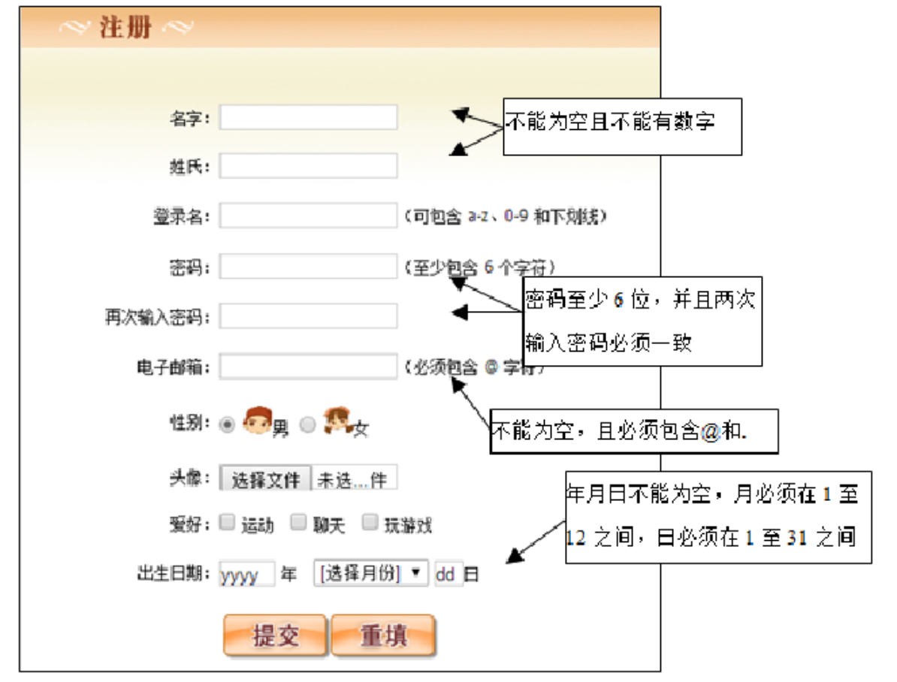
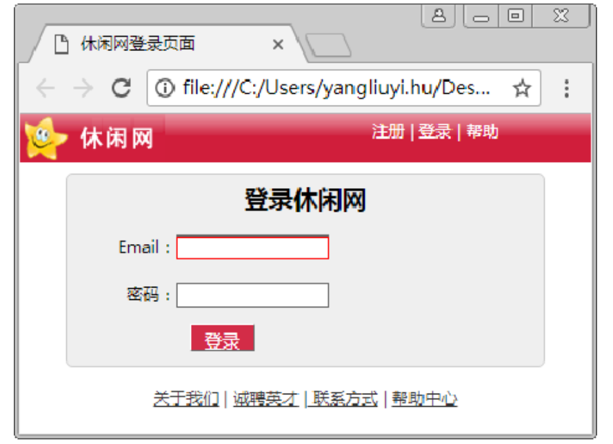
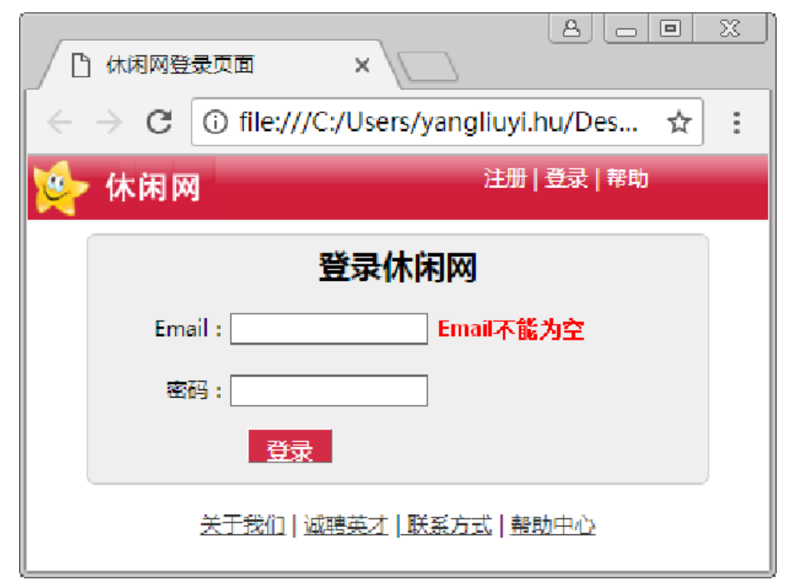
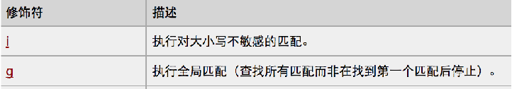

# 第十三章：正则表达式和表单验证

## 课前测试(15分钟)：

拖拽案例。

## 回顾：


## 本章目标    

- 了解什么是表单验证  
- 掌握表单验证的特效实现
- 掌握正则表达式的使用  
- 会写简单的正则表达式   
- 能看懂正则表达式

## 一、表单验证  

表单：收集用户信息，并且将信息发送给指定的服务器程序进行处理。

表单验证的目的是为了数据的合法性。能够发送到后端服务器的数据一定是 合法数据。

如果数据不合法？不能向服务器端提交。



### 1.1 什么是表单验证

我们需要在客户端输入信息(手机号，用户名，密码，。。。。，调查问卷。。)，然后点击提交按钮把数据发送到后台服务器。

思考问题：数据是随意发送的吗？

​		在发送数据之前我们要进行数据格式的校验，看数据是否符合要求的格式，如果符合了，就可以提交，否则就不能提交。

**在发送数据之前对数据进行格式校验。** 

### 1.2 为什么用表单验证

没有这个技术会发生什么事情？

所有数据校验都由服务器完成。

软件架构：

​		B/S : browser  server  浏览器/服务器

​		C/S: client server         客户端/服务器

客户端对服务器  是  多对一！！！

1. 降低  服务器  的压力。

 	2. 校验数据的格式。

**确保能够发送到后台的数据一定是格式正确的数据。** 

### 1.3 表单验证的思路分析

当输入表单的数据不符合要求时如何编写js脚本进行验证？

**三步走：**

1. 首先获取到输入框中的值。

2. 为输入框添加各种合适的(得到焦点，失去焦点)事件，编写函数，对数据进行校验。

    这些只是一些特效展示，让客户能够清楚的看到，输入的数据是否正确。

   3. 在提交表单时，对整个表单进行验证，决定是否能够提交！	

### 1.4 表单验证的具体实现

案例1：对邮箱和密码进行验证。

案例2：判断输入的内容是否有数字。





## 二、正则表达式 

### 2.1 什么是正则表达式 

正则表达式（英语：Regular Expression，在代码中常简写为regex、regexp或RE）使用单个字符串来描述、匹配一系列符合某个句法规则的字符串搜索模式。

搜索模式可用于文本搜索和文本替换。

正则表达式是由一个字符序列形成的搜索模式。

当你在文本中搜索数据时，你可以用搜索模式来描述你要查询的内容。

正则表达式可以是一个简单的字符，或一个更复杂的模式。

正则表达式可用于所有文本搜索和文本替换的操作。

### 2.2 为什么要用正则表达式

因为普通的String对象只能做一些简单的校验，稍微复杂的校验都无法实现。或者说能实现但是需要大量的代码。

特别麻烦。

它能让数据校验变得**非常简单**。 

### 2.3 正则表达式如何使用

#### 语法：

```
构造函数：var reg = new RegExp(pattern,modifiers);
字面量：var reg = /pattern/modifiers;
              /正则表达式主体/修饰符(可选)

/ab+c/i; //字面量形式
new RegExp('ab+c', 'i'); // 首个参数为字符串模式的构造函数
new RegExp(/ab+c/, 'i'); // 首个参数为常规字面量的构造函数
```

#### 正则表达式方法

检测一个字符串是否与正则相匹配

| reg.test(string) | 返回值为布尔值 true匹配，false不匹配                         |
| ---------------- | ------------------------------------------------------------ |
| reg.exec(string) | 匹配成功返回数组，并确定其（符合正则要求的字符）位置，否则返回null |

#### 修饰符：

 

#### 常用的表达式

| **表达式** | **描述**                                             |
| ---------- | ---------------------------------------------------- |
| [a-z]      | 查找任何从小写 a 到小写 z 的字符   - 表示区间  [a-d] |
| [A-Z]      | 查找任何从大写 A 到大写 Z 的字符  [a-Z]              |
| [0-9]      | 查找任何从 0 至 9 的数字                             |
| [abc]      | 查找括号内的任意一个字符                             |
| [^abc]     | 查找除了括号内的任意字符                             |

#### 常用的元字符（特殊字符）

| **字符** | **描述**                   |
| -------- | -------------------------- |
| \W       | 匹配非数字、字母、下划线   |
| \d       | 匹配数字===[0-9]           |
| \w       | 匹配数字、字母、下划线     |
| \D       | 匹配非数字===[ ^0-9]       |
| \s       | 匹配空白字符（空格、换行） |
| \S       | 匹配非空白字符             |
| \n       | 匹配换行符                 |

#### 常用的限定符(量词)

| **字符**     | **描述**                                     |
| ------------ | -------------------------------------------- |
| *            | 匹配前面的子表达式零次或多次===任意次        |
| +            | 匹配前面的子表达式一次或多次  +   ==    {1,} |
| ?            | 匹配前面的子表达式零次或一次                 |
| {n},{2}      | 匹配确定的 n 次                              |
| {n,} {10,}   | 至少匹配n 次                                 |
| {n,m} {5,12} | 最少匹配 n 次且最多匹配 m 次                 |
| ^            | 以某某开头                                   |
| $            | 以某某结尾                                   |
| \            | 转义字符                                     |

### 2.4 String对象中支持正则的方法  

| search  | 检索与正则表达式相匹配的值，查找不到返回-1  查到返回下标     |
| ------- | ------------------------------------------------------------ |
| match   | 找到一个或多个正则表达式的匹配 如果没有找到任何匹配的文本， 返回 null。否则，它将返回一个数组（依赖于是否具有全局标志 g） |
| replace | 替换与正则表达式匹配的子串 返回一个新的字符串                |
| split   | 把字符串分割为字符串数组，返回一个字符串数组                 |

### 2.5 练习 

1. 把字符串 sdfs124fd3x中的数字两边加上[] ===> sdfs\[1][2]....
   2. 首尾有空格的字符串（分别验证清除前面、后面、前后以及所有空格的方法）
3. 验证手机号码
4. 验证邮箱

安装Fehelper插件

## 三、总结与作业

- 模拟百度的注册页面 