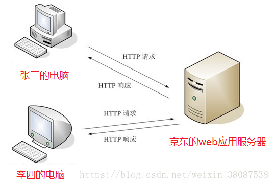
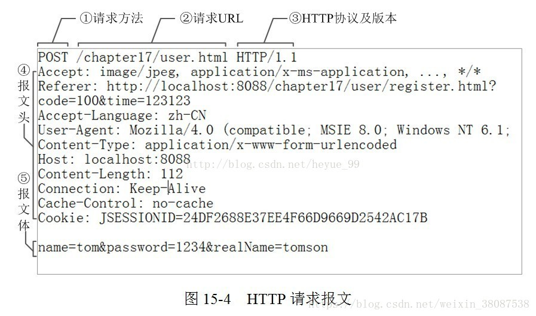
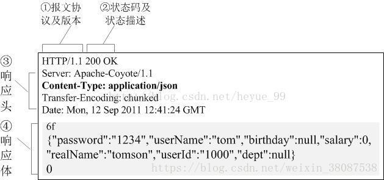
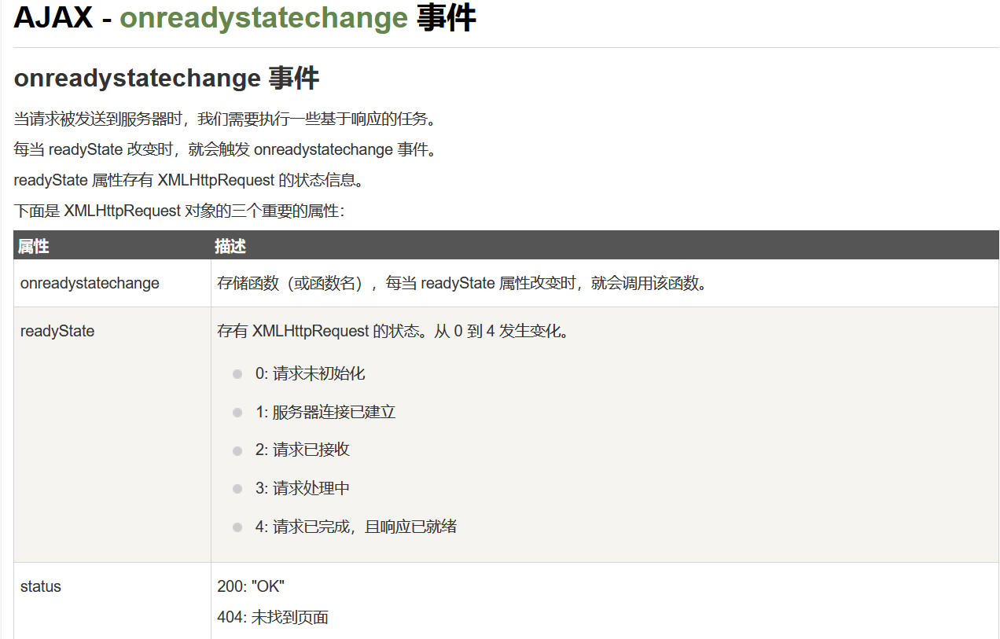
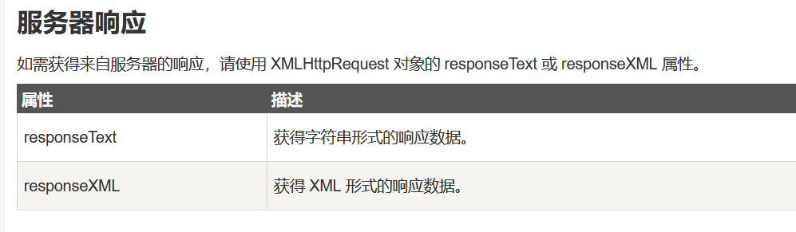
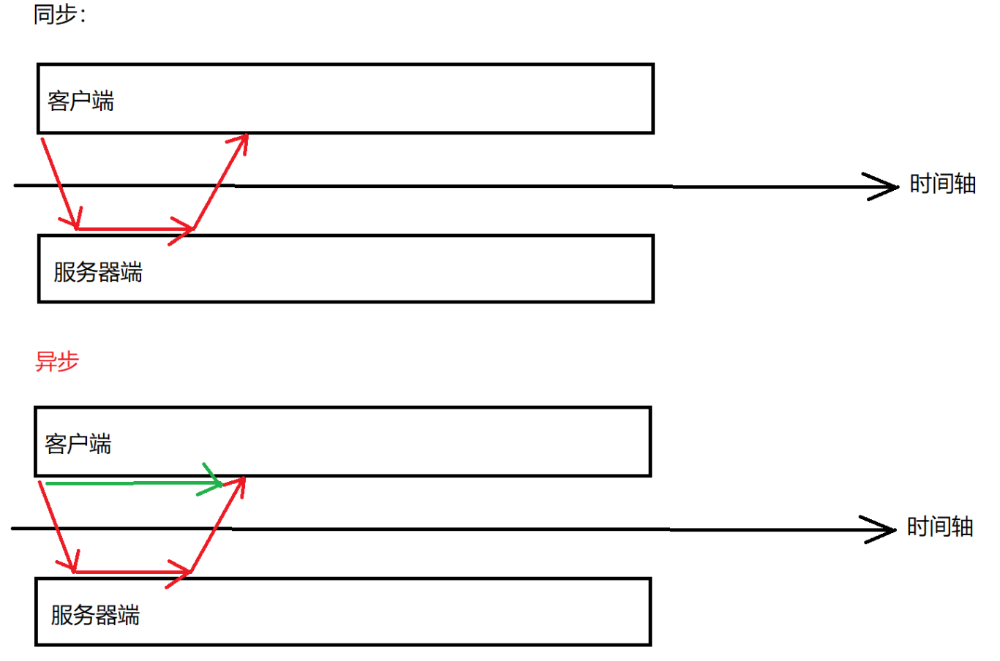
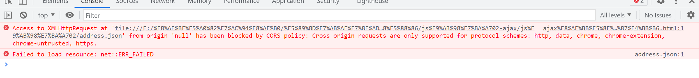

# 第二章：http协议,ajax,json

## 课前测试：

## 回顾：

## 本章目标 

- 了解http协议
- ajax异步请求 (网络请求) 
- Json 

## 一、http协议 (了解) 

服务器：提供计算服务的设备。

​		硬件服务器：电脑。。。。

​		软件服务器 (依托于硬件服务器) 

​		互联网(局域网，广域网)  

​	[超文本传输协议](https://baike.baidu.com/item/超文本传输协议/8535513)（HTTP，HyperText Transfer Protocol)是[互联网](https://baike.baidu.com/item/互联网)上应用最为广泛的一种[网络协议](https://baike.baidu.com/item/网络协议/328636)。所有的[WWW](https://baike.baidu.com/item/WWW)文件都必须遵守这个标准。设计HTTP最初的目的是为了提供一种发布和接收[HTML](https://baike.baidu.com/item/HTML)页面的方法。1960年美国人[Ted Nelson](https://baike.baidu.com/item/Ted Nelson)构思了一种通过[计算机](https://baike.baidu.com/item/计算机/140338)处理文本信息的方法，并称之为超文本（hypertext）,这成为了HTTP超文本传输协议标准架构的发展根基。Ted Nelson组织协调万维网协会（World Wide Web Consortium）和[互联网工程工作小组](https://baike.baidu.com/item/互联网工程工作小组/6992977)（Internet Engineering Task Force ）共同合作研究，最终发布了一系列的[RFC](https://baike.baidu.com/item/RFC)，其中著名的RFC 2616定义了HTTP 1.1。

#### 1.http协议的作用及特点  

HTTP是一个[客户端](https://baike.baidu.com/item/客户端)和[服务器](https://baike.baidu.com/item/服务器)端**请求和应答的标准**（TCP，IP）。客户端是终端用户，服务器端是网站。通过使用[Web浏览器](https://baike.baidu.com/item/Web浏览器)、[网络爬虫](https://baike.baidu.com/item/网络爬虫)或者其它的工具，客户端发起一个到服务器上指定端口（默认[端口](https://baike.baidu.com/item/端口)为80）的HTTP请求。（我们称这个客户端）叫用户代理（user agent）。应答的服务器上存储着（一些）资源，比如HTML文件和图像。（我们称）这个应答服务器为源服务器（origin server）。在用户代理和源服务器中间可能存在多个中间层，比如代理，网关，或者隧道（tunnels）。尽管[TCP/IP协议](https://baike.baidu.com/item/TCP%2FIP协议)是互联网上最流行的应用，HTTP协议并没有规定必须使用它和（基于）它支持的层。 事实上，HTTP可以在任何其他互联网协议上，或者在其他网络上实现。HTTP只假定（其下层协议提供）可靠的传输，任何能够提供这种保证的协议都可以被其使用。

通常，由HTTP客户端发起一个请求，建立一个到服务器指定端口（默认是[80端口](https://baike.baidu.com/item/80端口)）的TCP连接。HTTP服务器则在那个端口监听客户端发送过来的请求。一旦收到请求，服务器（向客户端）发回一个状态行，比如"HTTP/1.1 200 OK"，和（响应的）消息，消息的消息体可能是请求的文件、错误消息、或者其它一些信息。HTTP使用TCP而不是UDP的原因在于（打开）一个网页必须传送很多数据，而TCP协议提供传输控制，按顺序组织数据，和错误纠正。

通过HTTP或者HTTPS协议请求的资源由统一资源标示符（Uniform Resource Identifiers）（或者，更准确一些，URLs）来标识。

**特点：**

1.基于请求/响应模型的协议。**请求和响应必须成对，先有请求后有响应** 

2.http协议默认端口:80

3.简单快速：客户向服务器请求服务时，只需传送请求方法和路径。请求方法常用的有GET、HEAD、POST。每种方法规定了客户与服务器联系的类型不同。由于HTTP协议简单，使得HTTP服务器的程序规模小，因而通信速度很快。

4.灵活：HTTP允许传输任意类型的数据对象。正在传输的类型由Content-Type加以标记。

5.**无连接**：无连接的含义是限制每次连接只处理一个请求。服务器处理完客户的请求，并收到客户的应答后，即断开连接。采用这种方式可以节省传输时间。

6.**无状态**：HTTP协议是无状态协议。 **无状态是指协议对于事务处理没有记忆能力**。缺少状态意味着如果后续处理需要前面的信息，则它必须重传，这样可能导致每次连接传送的数据量增大。另一方面，在服务器不需要先前信息时它的应答就较快。

每一次的请求之间都是相互独立，互不干扰的。

#### 2.协议功能  

##### 2.1简介 

HTTP协议（HyperText Transfer Protocol，超文本传输协议）是用于从WWW服务器传输超文本到本地浏览器的传输协议。它可以使浏览器更加高效，使网络传输减少。它不仅保证计算机正确快速地传输超文本文档，还确定传输文档中的哪一部分，以及哪部分内容首先显示(如文本先于图形)等。

HTTP是客户端浏览器或其他程序与[Web服务](https://baike.baidu.com/item/Web服务)器之间的应用层通信协议。在Internet上的Web服务器上存放的都是超文本信息，客户机需要通过HTTP协议传输所要访问的超文本信息。HTTP包含命令和传输信息，不仅可用于Web访问，也可以用于其他因特网/内联网应用系统之间的通信，从而实现各类应用资源超媒体访问的集成。

##### 2.2 基本的工作原理

一次HTTP操作称为一个事务，其工作过程可分为四步：

原子性。隔离性。

1）首先客户机与服务器需要建立连接。只要单击某个超级链接/表单的提交/ajax，HTTP的工作开始。

2）建立连接后，客户机发送一个请求给服务器，请求方式的格式为：统一资源标识符（URL）、协议版本号，后边是MIME信息包括请求修饰符、客户机信息和可能的内容。

3）服务器接到请求后，给予相应的响应信息，其格式为一个状态行，包括信息的协议版本号、一个成功或错误的代码，后边是MIME信息包括服务器信息、实体信息和可能的内容。

4）客户端接收服务器所返回的信息通过浏览器显示在用户的显示屏上，然后客户机与服务器断开连接。

如果在以上过程中的某一步出现错误，那么产生错误的信息将返回到客户端，有显示屏输出。对于用户来说，这些过程是由HTTP自己完成的，用户只要用鼠标点击，等待信息显示就可以了

特点：

短连接、 无状态（无记忆）

##### 2.3 URL解析

我们在浏览器的地址栏里输入的网站地址叫做URL (Uniform Resource Locator，[统一资源定位符](https://baike.baidu.com/item/统一资源定位符))。就像每家每户都有一个门牌地址一样，每个网页也都有一个Internet地址。当你在浏览器的地址框中输入一个URL或是单击一个[超级链接](https://baike.baidu.com/item/超级链接)时，URL就确定了要浏览的地址。浏览器通过超文本传输协议(HTTP)，将Web服务器上站点的网页代码提取出来，并翻译成漂亮的网页。

URL,全称是UniformResourceLocator, 中文叫统一资源定位器,是互联网上用来标识某一处资源的地址。以下面这个URL为例，介绍下普通URL的各部分组成：

http://www.aspxfans.com:8080/news/index.jsp?boardID=5&ID=24618&page=1#name

从上面的URL可以看出，一个完整的URL包括以下几部分：
**1.协议部分：**该URL的协议部分为“http：”，这代表网页使用的是HTTP协议。在Internet中可以使用多种协议，如HTTP，FTP等等本例中使用的是HTTP协议。在"HTTP"后面的“//”为分隔符

**2.域名部分：**该URL的域名部分为“www.aspxfans.com”。一个URL中，也可以使用IP地址作为域名使用

**3.端口部分：**跟在域名后面的是端口，域名和端口之间使用“:”作为分隔符。端口不是一个URL必须的部分，如果省略端口部分，将采用默认端口

**4.虚拟目录部分：**从域名后的第一个“/”开始到最后一个“/”为止，是虚拟目录部分。虚拟目录也不是一个URL必须的部分。本例中的虚拟目录是“/news/”

**5.文件名部分(资源路径)：**从域名后的最后一个“/”开始到“？”为止，是文件名部分，如果没有“?”,则是从域名后的最后一个“/”开始到“#”为止，是文件部分，如果没有“？”和“#”，那么从域名后的最后一个“/”开始到结束，都是文件名部分。本例中的文件名是“index.asp”。文件名部分也不是一个URL必须的部分，如果省略该部分，则使用默认的文件名

**6.锚部分：**从“#”开始到最后，都是锚部分。本例中的锚部分是“name”。锚部分也不是一个URL必须的部分

**7.参数部分：**从“？”开始到“#”为止之间的部分为参数部分，又称搜索部分、查询部分。本例中的参数部分为“boardID=5&ID=24618&page=1”。参数可以允许有多个参数，参数与参数之间用“&”作为分隔符

#### 3.http协议的版本

HTTP/1.0,发送请求，创建一次连接，获得一个web资源，连接断开

HTTP/1.1，发送请求，创建一次连接，获得多个web资源，连接断开

#### 4.Http协议的组成

request   response

Http协议由**Http请求**和**Http响应**组成，当在浏览器中输入网址访问某个网站时， 你的浏览器会将你的请求封装成一个Http请求(HttpServletRequest)发送给服务器站点，服务器接收到请求后会组织响应数据封装成一个Http响应(HttpServletResPonse)返回给浏览器。即**没有请求就没有响应**。



**http请求包括:请求行、请求头、请求体**

**http响应包括:响应行、响应头、响应体** 

#### 5.HTTP请求报文

**HTTP请求报文由3部分组成（请求行+请求头+请求体）：**



**请求行：** 

**例如：POST /chapter17/user.html HTTP/1.1**

**格式：请求方式 资源路径 协议/版本** 

**请求行必须在http请求格式的第一行。**

**get请求:** 

将请求参数追加在url后面，不安全

url长度限制get请求方式数据的大小

没有请求体

一般的HTTP请求大多都是GET。

常见get请求:地址栏直接访问、< a href="">、< img src="">等 

**post请求：** 

请求参数在请求体处，较安全。

请求数据大小没有限制

只有表单设置为method=“post”才是post请求，其他都是get请求

**HEAD请求:**

HEAD跟GET相似，不过服务端接收到HEAD请求时只返回响应头，不发送响应内容。所以，如果只需要查看某个页面的状态时，用HEAD更高效，因为省去了传输页面内容的时间。

**DELETE请求：**

删除某一个资源。

**OPTIONS请求：**

用于获取当前URL所支持的方法。若请求成功，会在HTTP头中包含一个名为“Allow”的头，值是所支持的方法，如“GET, POST”。

**PUT请求：** 

把一个资源存放在指定的位置上。

本质上来讲， PUT和POST极为相似，都是向服务器发送数据，但它们之间有一个重要区别，PUT通常指定了资源的存放位置，而POST则没有，POST的数据存放位置由服务器自己决定。

**TRACE请求：**

回显服务器收到的请求，主要用于测试或诊断。

**CONNECT请求：**

CONNECT方法是HTTP/1.1协议预留的，能够将连接改为管道方式的代理服务器。通常用于[SSL](https://link.jianshu.com/?t=http%3A%2F%2Fitbilu.com%2Fother%2Frelate%2FN16Uaoyp.html)加密服务器的链接与非加密的HTTP代理服务器的通信。

**请求头:**

**例如：****Host: 39.108.107.149:8080**

**请求头从第二行开始，到第一个空格结束。请求头和请求体之间存在一个空格(如下)**

```html
POST http://39.108.107.149:8080/vk/app/rest/ddp/iModelServiceImpl/findModelByType HTTP/1.1
User-Agent: Fiddler
Host: 39.108.107.149:8080
Content-Length: 11
name=城市
```

请求头通常以键值对{key:value}方式传递数据。

key为规范的固定值

value为key对应的取值，通常是一个值，可能是一组。

#### 6.HTTP请求报文头属性

**常见请求头**

**Referer:表示这个请求是从哪个url跳过来的,通过百度来搜索淘宝网,那么在进入淘宝网的请求报文中,Referer的值就是:www.baidu.com。如果是直接访问就不会有这个头。**

常用于 : 防盗链。爬虫。

```html
Referrer Policy: no-referrer-when-downgrade
```

**Accept:告诉服务端,该请求所能支持的响应数据类型,专业术语称为MIME 类型(文件类型的一种描述方式)**

```html
Accept: text/html,application/xhtml+xml,application/xml;q=0.9,image/webp,image/apng,*/*;q=0.8
```

MIME格式：大类型/小类型[;参数]

Accept : text/html,application/xhtml+xml,application/xml;q=0.9,image/webp,image/apng,*/*;q=0.8

例如:

text/html,html文件

text/css,css文件

text/javascript.js文件

image/*，所有图片文件

**if-Modified-Sincce:浏览器通知服务器，本地缓存的最后变更时间。与另一个响应头组合控制浏览器页面的缓存**

**Cookie：客户端的Cookie就是通过这个报文头属性传给服务端的**

```html
Cookie: JSESSIONID=15982C27F7507C7FDAF0F97161F634B5
```

**User-Agent:浏览器通知服务器，客户端浏览器与操作系统相关信息**

```html
User-Agent: Mozilla/5.0 (Windows NT 10.0; Win64; x64) AppleWebKit/537.36 (KHTML, like Gecko) Chrome/69.0.3497.100 Safari/537.36
```

**Connection:表示客户端与服务连接类型；Keep-Alive表示持久连接，close已关闭**

```java
Connection: keep-alive
```

**Host:请求的服务器主机名**

```java
Host: sczpkj.f3322.net:3000
```

**Content-Length:请求体的长度**

```html
POST http://39.108.107.149:8080/vk/app/rest/ddp/iModelServiceImpl/findModelByType HTTP/1.1
User-Agent: Fiddler
Host: 39.108.107.149:8080
Content-Length: 11
name=城市
```

**Content-Type:请求的与实体对应的MIME信息。如果是post请求,会有这个头,默认值为application/x-www-form-urlencoded，表示请求体内容使用url编码** 

```html
Content-Type: application/x-www-form-urlencoded  /  application/json  / multipart/form-data
```

**Accept-Encoding：浏览器通知服务器，浏览器支持的数据压缩格式。如GZIP压缩**

```html
Accept-Encoding: gzip, deflate
```

**Accept-Language：浏览器通知服务器，浏览器支持的语言。各国语言(国际化i18n)**

```html
Accept-Language: zh-CN,zh;q=0.9
```

**Cache-Control：指定请求和响应遵循的缓存机制**

对缓存进行控制，如一个请求希望响应返回的内容在客户端要被缓存一年，或不希望被缓存就可以通过这个报文头达到目的。

```html
Cache-Control: no-cache
```

**请求体**

当请求方式是post的时，请求体会有请求的参数，格式如下：

username=zhangsan&password=123

```html
POST http://39.108.107.149:8080/vk/app/rest/ddp/iModelServiceImpl/findModelByType HTTP/1.1
User-Agent: Fiddler
Host: 39.108.107.149:8080
Content-Length: 20

name=城市&status=1
```

#### 7.HTTP响应报文

**HTTP的响应报文也由三部分组成（响应行+响应头+响应体）**



 **示例：**

```javascript
HTTP/1.1 200 OK
Server: Apache-Coyote/1.1
Set-Cookie: JSESSIONID=E1352C5CCEAD7EA9A6F8DA253395781C; Path=/vk
Content-Type: application/json;charset=UTF-8
Transfer-Encoding: chunked
Date: Wed, 26 Sep 2018 03:24:59 GMT
//此处有空格
1dd0
```

**响应行：**

①报文协议及版本；

例如：

```html
HTTP/1.1 200 OK
```

②**状态码及状态描述；** 

**状态码：由3位数字组成，第一个数字定义了响应的类别**

1xx：指示信息，表示请求已接收，继续处理

2xx：成功，表示请求已被成功接受，处理。

- **200** OK：客户端请求成功
- 204 No Content：无内容。服务器成功处理，但未返回内容。一般用在只是客户端向服务器发送信息，而服务器不用向客户端返回什么信息的情况。不会刷新页面。
- 206 Partial Content：服务器已经完成了部分GET请求（客户端进行了范围请求）。响应报文中包含Content-Range指定范围的实体内容

3xx：重定向

- 301 Moved Permanently：永久重定向，表示请求的资源已经永久的搬到了其他位置。
- 302 Found：临时重定向，表示请求的资源临时搬到了其他位置
- 303 See Other：临时重定向，应使用GET定向获取请求资源。303功能与302一样，区别只是303明确客户端应该使用GET访问
- 307 Temporary Redirect：临时重定向，和302有着相同含义。POST不会变成GET
- 304 Not Modified：表示客户端发送附带条件的请求（GET方法请求报文中的IF…）时，条件不满足。返回304时，不包含任何响应主体。虽然304被划分在3XX，但和重定向一毛钱关系都没有

4xx：客户端错误

- **400** Bad Request：客户端请求有语法错误，服务器无法理解。
- 401 Unauthorized：请求未经授权，这个状态代码必须和WWW-Authenticate报头域一起使用。
- 403 Forbidden：服务器收到请求，但是拒绝提供服务
- **404** Not Found：请求资源不存在。比如，输入了错误的url
- **405** 表示servlet请求的服务方法没有找到。请求方式跟后端提供的接口不对应
- **415** Unsupported media type：不支持的媒体类型

5xx：服务器端错误，服务器未能实现合法的请求。

- **500** Internal Server Error：服务器发生不可预期的错误。

  不仅要去看那个500错误，还要去看浏览器或者服务器给我们提供的别的错误信息，通过这些信息共同去确定错误的位置。

- 503 Server Unavailable：服务器当前不能处理客户端的请求，一段时间后可能恢复正常，

200  请求成功  程序正常执行

404  路径错误

500  请联系后端人员解决

**响应头：**

③响应报文头，也是由多个属性组成；

响应头也是用键值对k:v；

服务器通过响应头来控制浏览器的行为，不同的头浏览器操作不同

| 常见请求头                    | 描述                                                         |
| ----------------------------- | ------------------------------------------------------------ |
| ***\*Location\****            | 指定响应的路径，需要与状态码302配合使用，完成跳转。          |
| Content-Type                  | 响应正文的类型（MIME类型）取值：text/html;charset=UTF-8      |
| ***\*Content-Disposition\**** | 通过浏览器以下载方式解析正文取值：attachment;filename=xx.zip |
| ***\*Set-Cookie\****          | 与会话相关技术。服务器向浏览器写入cookie                     |
| Content-Encoding              | 服务器使用的压缩格式取值：gzip                               |
| Content-length                | 响应正文的长度                                               |
| Refresh                       | 定时刷新，格式：秒数;url=路径。url可省略，默认值为当前页。取值：3;url=www.itcast.cn  //三秒刷新页面到www.itcast.cn |
| Server                        | 指的是服务器名称，默认值：Apache-Coyote/1.1。可以通过conf/server.xml配置进行修改。<Connector port="8080" ... server="itcast"/> |
| Last-Modified                 | 服务器通知浏览器，文件的最后修改时间。与If-Modified-Since一起使用。 |
| Cache-Control                 | 响应输出到客户端后，服务端通过该报文头属告诉客户端如何控制响应内容的缓存。常见的取值有常见的取值有private、public、no-cache、max-age，no-store，默认为private。缓存时间为31536000秒（365天） |

**响应体：** 

④响应报文体，服务器发送给浏览器的正文，即我们真正要的“干货” ；

 响应体，响应体是服务器回写给客户端的页面正文，浏览器将正文加载到内存，然后解析渲染   显示页面内容。

#### 小结

HTTP协议：

​		1.什么是协议   超文本传输协议

​		2.作用：在网络环境中传输 数据(html文档  也包括  一些静态资源  图片，视频，音频。。。)

​		3.组成：请求  request    响应  response

​		4.请求报文：。。。。

​		5.响应报文：。。。。

http协议的三次握手，四次挥手：

https://blog.csdn.net/charking_gg/article/details/81663768?spm=1001.2101.3001.6650.12&utm_medium=distribute.pc_relevant.none-task-blog-2%7Edefault%7ECTRLIST%7Edefault-12-81663768-blog-119606514.pc_relevant_blogantidownloadv1&depth_1-utm_source=distribute.pc_relevant.none-task-blog-2%7Edefault%7ECTRLIST%7Edefault-12-81663768-blog-119606514.pc_relevant_blogantidownloadv1&utm_relevant_index=16

## 二、Ajax  

### 2.1 什么是Ajax

js:同步任务 异步任务

ajax：网络请求的发送。

AJAX = Asynchronous JavaScript and XML（异步的 JavaScript 和 XML）。

AJAX 不是新的编程语言，而是一种使用现有标准的新方法。

**AJAX 最大的优点是在不重新加载整个页面的情况下，可以与服务器交换数据并更新部分网页内容。** 

AJAX 不需要任何浏览器插件，但需要用户允许JavaScript在浏览器上执行。

### 2.2 为什么用Ajax 

**AJAX 最大的优点是在不重新加载整个页面的情况下，可以与服务器交换数据并更新部分网页内容。** 

### 2.3 Ajax的使用步骤 

1. 创建ajax对象 

   ```javascript
   //兼容  IE7以上  以及别的浏览器 chorme  firfox
   var ajax_obj = new XMLHttpRequest() ;
   //兼容 IE7一下浏览器
   var ajax_obj = new ActiveXObject(Microsoft.XMLHTTP);
   
   var ajax_obj = new XMLHttpRequest() || new ActiveXObject(Mircrosoft.XMLHTTP);
   ```

2. 创建连接到服务器 

   ```javascript
   //跟服务器创建连接
   ajax_obj.open(请求的方式,请求的路径+参数,同步/异步);
   ```

   #### get和post请求的区别：

   |                      | **GET**                                                      | **POST**                                                     |
   | -------------------- | ------------------------------------------------------------ | ------------------------------------------------------------ |
   | **缓存**             | **能被缓存**                                                 | **不能缓存**                                                 |
   | **历史**             | **参数保留在浏览器历史中**                                   | **参数不会保存在浏览器历史中**                               |
   | **对数据长度的限制** | **当发送数据时，GET 方法向 URL 添加数据；URL 的长度是受限制的（URL 的最大长度IE是 2048 个字符,chrome 最大长度8182个字符）** | **无限制**                                                   |
   | **对数据类型的限制** | **只允许 ASCII 字符**                                        | **没有限制，也允许二进制数据**                               |
   | **安全性**           | **与 POST 相比，GET 的安全性较差，因为所发送的数据是 URL 的一部分** | **POST 比 GET 更安全，因为参数不会被保存在浏览器历史或 web 服务器日志中** |
   | **可见性**           | **数据在 URL 中对所有人都是可见的**                          | **数据不会显示在 URL 中**                                    |

3. 发送请求

   

   ```javascript
   //发送请求
   ajax_obj.send();
   ```

4. 接收响应  readyState参数  status参数 

   

   ```javascript
   //接收响应
   if(ajax_obj.readyState == 4 && ajax_obj.status == 200){
   	//responseText 接收文本内容
       console.log(ajax_obj.responseText);
       //responseXML  接收XML格式的文档内容
       console.log(ajax_obj.responseXML);
   }
   ```

5. 同步请求和异步请求   

   **异步**：客户端发出请求之后可以做别的操作了，不用等服务器响应后再接着操作。

   **同步**：客户端发出请求之后就不能在做别的操作了，必须等服务器响应后才可以接着操作。

   

## 三、JSON （狠重要）

### 3.1 什么是 JSON 

JSON: **J**ava**S**cript **O**bject **N**otation(JavaScript 对象表示法)

JSON 是存储和交换文本信息的语法，类似 XML。 html  html5  xhtml  xml

JSON 比 XML 更小、更快，更易解析。

- JSON 指的是 JavaScript 对象表示法（**J**ava**S**cript **O**bject **N**otation）
- JSON 是轻量级的文本数据交换格式  ====》常用于 前端和后台服务器的数据交换。
- JSON 独立于语言：**JSON 使用 Javascript语法来描述数据对象**，但是 JSON 仍然独立于语言和平台。JSON 解析器和 JSON 库支持许多不同的编程语言。 目前非常多的动态（PHP，JSP，.NET，java,python,...）编程语言都支持JSON。
- JSON 具有自我描述性，更易理解

### 3.2 为什么使用JSON 

读取速度快，做前后端的数据交互。

#### JSON 语法规则

JSON 语法是 JavaScript 对象表示语法的子集。

- 数据在键/值对中
- 数据由逗号分隔
- 大括号 {} 保存对象
- 中括号 [] 保存数组，数组可以包含多个对象

#### JSON 值

JSON 值可以是：

- 数字（整数或浮点数）
- 字符串（在双引号中）
- 逻辑值（true 或 false）
- 数组（在中括号中）
- 对象（在大括号中）
- null 

### 3.3 JSON的使用

JSON 语法是 JavaScript 语法的子集。

json的使用跟 js对象的使用方式一样的。

```html
<!DOCTYPE html>
<html lang="en">
<head>
    <meta charset="UTF-8">
    <meta http-equiv="X-UA-Compatible" content="IE=edge">
    <meta name="viewport" content="width=device-width, initial-scale=1.0">
    <title>Document</title>
</head>
<body>
    <script>
        //json: javaScript object  notation   js对象表示法
        //var obj = new Object();
        //普通的js对象中可以存储任意的数据类型  键值对 key  value
        /*
            变量：是程序运行的最小的存储单元  只能存储一个数据
            数组：数组用于存储多个数据，数据之间可以不关联
            对象: 用于存储一系列有关联的数据。
            json的作用：
                1.用于前后端的数据交互
                2.json的语法跟 js对象的语法类似
                3.json独立于语言和平台。
                4.json主要用于存储数据（文本信息）。
                5.json中的key值必须是字符串。
        */
        /* var obj = {
            name:"张三",
            age:18,
            address:"郑州",
            class:'qy147',
            introduce:function(){
                
            },
            aaa:null,
            bbb:undefined,
            ccc:[1,2,3],
            clothes:{
                color:"red",
                size:'XL'
            },
            aaa:[{},{},{}]
        }; */

        var str = {"name":"张三","age":18,"address":"火星"};
        console.log(str);
        //JSON.stringify()  把 正二八经的json对象转换成 具有json格式的字符串
        console.log(JSON.stringify(str));
        //for in 既可以遍历数组   又可以遍历对象中的属性
        //json对象的遍历
        //通过JSON.parse(str)  把 具有json格式的字符串转换成  正儿八经的json对象 
        /* var jsonObj =  JSON.parse(str);
        for (var key in jsonObj) {
            console.log(key+"=="+jsonObj[key]);
        } */
        //json中数据的取值 跟 js对象一致   对象名.属性名/对象名[属性名]
        //console.log(jsonObj["address"]);

        /*
        在做前后端的数据传输时，
            如果是前---》后   要使用JSON.Stringify把json对象先转换成  json字符串 才可以在网络中传输。
            如果是接收从后台到前台的数据，要先把接收到的数据(json字符串) 通过  JSON.parse()方法转成json对象才可以使用。 
        */
    </script>
</body>
</html>
```

JSON案例：市区联动 二级联动

```html
<!DOCTYPE html>
<html lang="en">
<head>
    <meta charset="UTF-8">
    <meta http-equiv="X-UA-Compatible" content="IE=edge">
    <meta name="viewport" content="width=device-width, initial-scale=1.0">
    <title>Document</title>
</head>
<body>
    市<select name="" id="shi"></select>
    区<select name="" id="qu"></select>
    
    <script>
        var addObj = {
            "北京市":['朝阳区','东城区','西城区','丰台区'],
            "郑州市":['管城区','金水区','二七区','高新区','郑东新区'],
            "洛阳市":['涧西区','老城区','洛龙区']
        };
        var val = Object.values(addObj);
        console.log(val);
        //1.取出json对象中所有的 key 
        // Object.keys();  可以直接取出 json对象中所有的key值
        var shiEle  = document.getElementById("shi");
        var quEle  = document.getElementById("qu");
        window.onload = function(){
            
            //方式一：直接遍历json对象
            /* for (var key in addObj) {
                //创建
                var opEle = document.createElement("option");
                //美化
                opEle.innerText = key;
                //添加
                shiEle.appendChild(opEle);
            } */
            //方式二：Object.keys(对象名) 直接从对象中获取所有的key值  得到一个数组
            //       Object.values(addObj); 直接从对象中取出所有 value值 得到一个数组
            var keyArr = Object.keys(addObj);
            for (var i in keyArr) {
                //创建
                var opEle = document.createElement("option");
                //美化
                opEle.innerText = keyArr[i];
                //添加
                shiEle.appendChild(opEle);
            }

            //当市加载完后，会显示当前json对象中的第一个市  那对应的 区中的数据也得是 第一个市对应的区
            var quArr = addObj[keyArr[0]];
            //console.log(quArr);
            //遍历区数组  添加到区的下拉框中
            for (var i in quArr) {
                //创建
                var opEle = document.createElement("option");
                //美化
                opEle.innerText = quArr[i];
                //添加
                quEle.appendChild(opEle);
            }
        }

        /*
            联动：
                分析：需求：当市下拉框中的值 发生改变时 让区的下拉框也随之发生改变
            1.绑定什么事件？
                onchange 事件 当内容发生改变时触发
            2.只要我们能取出 市的下拉框改变后的值  我们就可以取出  市对应的区 的数组
                问题：如何取出 市 呢？
        */
        document.getElementById("shi").onchange = function(){
            //此时  this.value就是我们需要的 市 的值 
            // addObj[this.value] 这个就是我们需要的区的数组
            //console.log( addObj[this.value]);
            var quArr = addObj[this.value];
            //在添加区之前  需要先把老的 内容给清空掉
            quEle.innerHTML = "";
            //干掉老的内容后，添加了新的内容(区)
            for (var i in quArr) {
                //创建
                var opEle = document.createElement("option");
                //美化
                opEle.innerText = quArr[i];
                //添加
                quEle.appendChild(opEle);
            }
        }
    </script>
</body>
</html>
```

### 3.5 json数据格式的转换

```
JSON.stringify();//把json对象转化为 具有json格式的字符串

JSON.parse();//把具有json格式的字符串 转化为 json对象
```


### 3.4 使用ajax读取本地的 json文件数据



ajax请求访问存在跨域问题

## 四、总结与作业

1. 使用ajax读取本地的json文件 

2. json案例  市区联动  

3. 自己区网上找免费的接口访问测试

   https://www.jianshu.com/p/d421c0baee97

