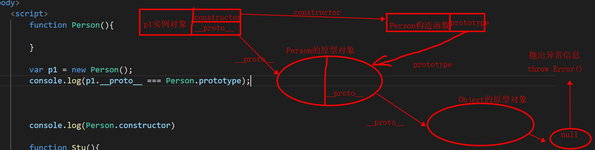

# 第六章：面向对象继承

## 课前测试 10分钟：

通过原型方法完成对数组的从大到小排序。

## 回顾：

1.内存

2.面向对象/过程

3.封装(搞对象) 是把属性和方法变成一个整体。不需要关心内部的实现细节		

​		1.标准方法  new  Object()  {}

​		2.工厂模式

​		3.构造函数

​		4.原型 

构造函数指向的一个  原型对象 父===类

实例对象：通过构造函数生成的对象 

constructor ===》指向构造函数

prototype

__ proto__ 

原型链 

## 本章目标    

- 原型链继承（prototype 属性/直接继承prototype）
- 空对象作为中介
- 构造函数绑定-apply/call方法
- 组合继承
- 拷贝继承 
- 原型链

## 一、继承 

三大特征其中之一：封装，继承，多态  

### 1.1 什么是继承  

封装：隐藏对象中属性和实现细节 仅仅对外公开接口 控制对象中属性和方法的访问。

继承：让子对象继承父对象的属性和行为。

**js的封装和继承 其实只是函数的使用方法而已！！！  通过各种函数的使用方式最终完成 继承的效果。**  

**重点：通过各种函数的使用方式，来完成让子对象拥有父对象属性和行为的 方法。** 

### 1.2 为什么要用继承  

通过各种函数的使用方式，来完成让子对象拥有父对象属性和行为的 方法。

### 1.3 继承的实现方式 

- **原型链继承1：让子级构造函数的原型对象指向父级构造函数的实例对象** 

  ```js
  <script type="text/javascript">
  			function Class_obj(){
  				this.address = '郑州';
  				this.c = 'qy147';
  			}
  			
  			function Stu_obj(name,age){
  				this.name = name;
  				this.age = age;
  			}
  			
  			//让Stu_obj继承  Class_obj的内容
  			Stu_obj.prototype = new Class_obj();
  			
  			var stu1 = new Stu_obj('张三',18);
  			console.log(stu1.address);
  			
  			//此时存在一个问题,继承紊乱问题，Stu_obj指向了Class_obj构造函数
  			//需要手动修改 Stu_obj的指向
  			Stu_obj.prototype.constructor = Stu_obj;
  			console.log(stu1.constructor);
  		</script>
  ```

  

  存在问题：

  - 子级的constructor没有指向子级的构造函数 而是指向了父级的构造函数。需要手动修改继承链
  - 每一次创建子类对象还要实例化父级对象，浪费内存，效率低  解决  使用方式2

- **原型链继承2：不变的属性都挂载到父级构造的原型对象上，子级构造函数的原型对象指向父级构造函数的原型对象**

  ```js
  <script>
          //父级构造函数
          function Person(){
              //this.class_ = 'qy147';
          }
          //不变的属性都挂载到父级构造的原型对象上
          Person.prototype.class_ = 'qy147';
         
          //子级构造函数
          function Student(n,a){
              this.name = n;
              this.age = a;
          }
          //不变的属性都挂载到父级构造的原型对象上，子级构造函数的原型对象指向父级构造函数的原型对象 
          Student.prototype = Person.prototype;
          
          var stu = new Student('张三',18);
          console.log(stu.class_);
  
          //constuctor 实例对象的这个属性会指向该对象的构造函数
          //就是一个指针 
          //此时存在问题：原型链紊乱。
          //解决：问题 强行改变一波  把Student构造函数中的constructor指向自己的构造函数
          //任何对象都有constructor属性 
          Student.prototype.constructor = Student;
          //console.log(stu.class_);
          console.log(stu.constructor);
          Student.prototype.class_ = 'qy148';
          console.log(Person.prototype.class_);
      </script>
  ```

  

  优点：效率比较高（不用执行和建立Person的实例了）

  缺点：1、依然会产型继承链紊乱，需要修改继承链 

  ​			2、因为子级构造函数的原型对象指向了父级构造函数的原型对象，所以子级构造函数修改原型对象的值，父级构造函数原型对象的值也被修改了，这样就等于继承了别人的东西，还要随意的更改别人的内容，太霸道，不合理

- **利用空对象做为中介**   

  - 利用空对象作为中介
  - 空对象，几乎不占内存 
  - 修改Student的prototype对象，不会影响到Person的prototype对象

  ```js
  <script type="text/javascript">
  			function Person(){} 
  			Person.prototype.address = "郑州";
  			var p1 = new Person();
  			function Student(name,age){
  				this.name = name;
  				this.age = age;
  			}
  			
  			function extend(parent,child){
  				//通过一个空的构造函数的实例对象作为中转
  				var Fn = function(){}
  				Fn.prototype = parent.prototype;
  				//让Student的原型指向 Fn的实例对象
  				child.prototype = new Fn();
  				//再次修改Student的constructor属性指向自己
  				child.prototype.constructor = child;
  			}
  			
  			extend(Person,Student);
  			
  			var stu1 = new Student('张力',18);
  			Student.prototype.address = '北京';
  			
  			console.log(stu1.address);
  			console.log(p1.address);
  			console.log(stu1.constructor);
  		</script>
  ```

- **使用构造函数的apply()和call()方法完成继承**    常用 

  Function函数运行时存在内部指针对象this,根据函数的调用情况不同，this的指向也不同。

  ```js
  #function函数中
  1.作为Dom对象的事件处理函数，使用this时，this指向当前Dom对象
  2.作为对象的方法使用时，this指向当前对象
  	var obj = {
          introduce:function(){
              this; 此时的this表示 obj这个对象
          }
      }
  3.作为构造函数使用时，this指向当前构造函数所实例化出来的对象
  	function Person(name,age){
          this.name = name;
          this.age = age;
      }
  	此时this指向谁？构造函数实例化的对象  
  4.在函数嵌套时，内层函数不会继承外城函数this的指向。 
  	function aaa(){
          var this = 222;
          var that = this;
          function bbb(){
              var this = 111;
              that;
              
          }
      }
  	
    -- 如果想让内层函数，使用外层函数this指向时，可以在外层函数中用一个变量（that）保存this。  
    --由于作用域链的原因，that对于内层函数是可见的
  5.作为全局函数使用this时，this指向window;
  6.当函数被addEventListener绑定时  此时的this不在是 window  而是  addEventListenr绑定的那个对象
  	<h1 id="h1"></h1>
   	function aaa(){}   ====>这里  this还是window
  	h1.addEventListener('click',aaa()) ===>这里this就变成了h1标签对象
  7.通过call()和apply()方法 也可以更改函数中this的指向问题。
  ```

  当然Function函数的this也是可以改变的。而call,apply等函数，就是为了改变函数this指向而存在的。

  每个javaScript函数都是一个对象，而这个对象的构造函数是Function，它有prototype属性指向原型对象，原型对象上挂有call、apply等方法；

  - apply()和call()和bind()方法简介：

    ```js
    <script type="text/javascript">
    			function aaa(a,b){
    				console.log(this);
    				console.log(a,b);
    			}
    			//call(参数1,arg1,arg2,arg3.... );函数中  
    			//call方法中的第一个参数就是改变函数作用域中的this 
    			//本来指向window 改过后 this就指向当前传入的对象。
    			aaa.call({name:'张三',age:'18'},2,3);
    			//apply方法 后续的参数传入需要以数组的形式传入
    			aaa.apply({name:'李四',age:'19'},[2,3]);
    
    		//bind()方法 不会直接执行函数  而是返回一个新的函数
            //这个新的函数 调用 就改变了this指向。
            //第一个参数obj就是this的新的指向  其余的参数  直接传递即可。
            var bbb = aaa.bind(obj);
            bbb(1, 2, 3);
    		</script>
    ```

  - 实现继承

    即在子类型构造函数的内部调用父类型构造函数，通过call()或apply()方法，

    ```js
    <script type="text/javascript">
    			function Person(addr,hob){
    				this.address = addr;
    				this.hobby = hob;
    				/* this.aaa = function(){
    					console.log(aaa);
    				} */
    			}
    			
    			function Student(n,a,arr){
    				//Person.call(this,'郑州','吃喝玩乐');
    				Person.apply(this,arr);
    				this.name = n;
    				this.age = a;
    			}
    			
    			var arr = ['郑州','吃喝玩乐'];
    			var stu1 = new Student('张三',18,arr);
    			stu1.aaa();
    			
    			console.log(stu1.address);
    		</script>
    ```

    问题：构造函数实现对实例属性的继承，完成不了对父类原型对象的继承 

- **组合继承(推荐)**    

  - 将原型链继承和构造函数继承组合在一块  
  - 原型链实现对原型属性和方法的继承
  - 借用构造函数实现对实例属性的继承

  ```js
  <script type="text/javascript">
  			function Person(addr,hob){
  				this.address = addr;
  				this.hobby = hob;
  				/* this.aaa = function(){
  					console.log(aaa);
  				} */
  			}
  			//把原型方法和属性挂载在原型对象上
  			Person.prototype.aaa = function(){
  				console.log(this.name);
  			}
  			function Student(n,a,arr){
  				//Person.call(this,'郑州','吃喝玩乐');
  				Person.apply(this,arr);
  				this.name = n;
  				this.age = a;
  			}
  			
  			//设置子级构造的原型对象指向
  			Student.prototype = new Person();
  			//设置子级构造的constructor指向自己本身
  			Student.prototype.constructor = Student;
  			var arr = ['郑州','吃喝玩乐'];
  			var stu1 = new Student('张三',18,arr);
  			//stu1.aaa();
  			
  			console.log(stu1);
  		</script>
  ```

- **拷贝继承**   

  把父对象的所有属性和方法，拷贝进子对象
  将父对象的prototype对象中的属性，一一拷贝给Child对象的prototype对象

  ```js
function Person(){}
  Person.prototype.foot = 2;
  Person.prototype.head = 1;
  Person.prototype.saySelf=function(){
          alert("Hello,我有："+this.foot+"只脚和"+this.head+"个头");
  }
  function Student(name,no){
          this.name = name;
          this.no = no;
  }
  function extend2(Child,Parent){
          var p = Parent.prototype;
          var c = Child.prototype;
          //对父原型对象中所有的属性和方法做遍历
          for(var i in p){
              c[i] = p[i];
          }
  }
  extend2(Student,Person);
  var stu1 = new Student("张三","s001");
  stu1.saySelf();
  ```

prototype的主要作用：当前构造函数的所有实例对象共享 它的原型对象中所有的属性和方法。

## 二、原型链

参考博客：https://blog.csdn.net/cc18868876837/article/details/81211729

构造函数的原型对象也是由构造函数创建出来的。

原型链是链接继承关系的链条。任何构造函数都拥有原型对象。


```
 <script>
        function Person(){

        }

        Person.prototype.sayname=function(){
            console.log('我是person原型对象的sayname')
        } 
        Object.prototype.sayname = function(){
            console.log('我是object原型对象的sayname')
        } 

        var p1 = new Person();
        p1.sayname = function(){
            console.log('我是person实例对象对象的sayname')
        }
        p1.sayname();
    </script>
```





简单理解就是原型组成的链，对象的 __ proto __ 指向的是它的原型，而原型也是一个对象，也有__ proto __属性，原型的__proto__又是原型的原型，就这样可以一直通过 __ proto__向上找，这就是原型链，当向上找找到Object的原型的时候，这条原型链就算到头了。

①__ proto __和constructor属性是对象所独有的； 

② prototype属性是函数所独有的，因为函数也是一种对象，所以函数也拥有__ proto  __ 和constructor属性。
③__ proto  __ 属性的作用就是当访问一个对象的属性时，如果该对象内部不存在这个属性，那么就会去它的__ proto  __ 属性所指向的那个对象（父对象）里找，一直找，直到__proto__属性的终点null，再往上找就相当于在null上取值，会报错。通过__ proto  __ 属性将对象连接起来的这条链路即我们所谓的原型链。
prototype属性的作用就是让该函数所实例化的对象们都可以找到公用的属性和方法，即f1.__ proto  __ === Foo.prototype。
constructor属性的含义就是指向该对象的构造函数，所有函数（此时看成对象了）最终的构造函数都指向Function。

### new命令干了啥 (面试题) 

```
使用new命令时，它后面的函数依次执行下面的步骤。

	var Person = function(){
		this.name = name;
	};
	var p1 = new Person();
	p1 instanceof Person === true
	
1.创建一个空对象，作为将要返回的对象实例。
	var p1 = {}，也就是说，初始化一个对象p1
2.将这个空对象的原型，指向构造函数的prototype属性。
	p1.__proto__ = Person.prototype;
3.将这个空对象赋值给函数内部的this关键字。   确定this的指向
	Person.call(p1); 也就是构造 p1，也可以称之为初始化
4.开始执行构造函数内部的代码。
	this系列的赋值代码
	this.name=name ....
5.返回一个新的对象把创建好的对象的地址值  赋给 p
验证第二步
	var Person = function(){};
	var p = new Person();
	alert(p.__proto__ === Person.prototype);
```


## 三、总结与作业

1.总结

2.作业：

​		案例。 

3.轮播图案例   

