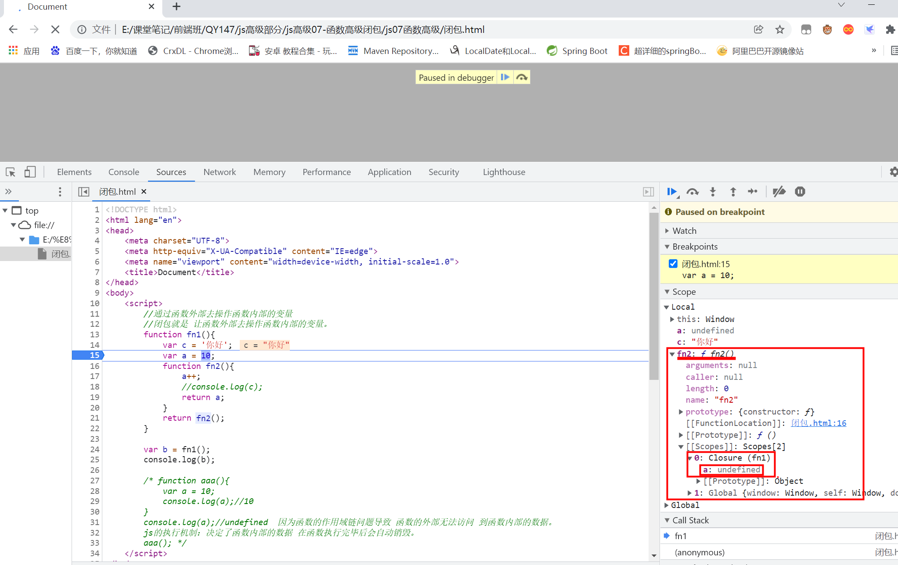

# 第七章：函数高级 

## 课前测试 10 分钟：

按照知识体系，总结昨日继承的知识点。

## 回顾：

var  aa = new  Array();    

原型链

​		prototype     __ proto __   constructor

​		Object()     null     Function 

## 本章目标    

- 变量相关
- 作用域
- 作用域链
- 闭包 
- 内存溢出/内存泄漏  

## 一、变量相关问题 

经典面试题：

```
var a = 10;
function fn(){
	console.log(a);
	var a = 4;
	console.log(a);
}
fn();
执行结果是？ 
function fn(){
	var a;
	console.log(a);
	a = 4;
	console.log(a);
}

```

```
变量提升：
	通过var关键字声明的变量再定义语句之前就可以访问到
	值是 undefined
函数声明提升：
	通过function声明的函数在函数之前就可以调用
	值是 函数定义的对象
	function fn1(){};
	fn1();
	fn2();
	var fn2 = function(){};
	
	此时fn1可以调用，遵循函数提升
	fn2不能调用，遵循变量提升
```

作用域：

- 作用域就是变量与函数的可访问范围，即作用域控制着变量与函数的可见性和生命周期


- 作用域就是变量起作用的区域，生效的范围。


- 作用域分为全局作用域和局部（函数）作用域

作用域链：

一般情况下，变量取值是到创建这个变量的作用域中取值。但是如果在当前作用域中没有查到值，就会向上级作用域去查，直到查到全局作用域这么一个查找过程形成的链条就叫做作用域链。	

```javascript
 <script>
        var x = 10;
        function f1() {
            var x = 11;
            function f2() {
                var x = 12;
                function f3() {
                    console.log(x);
                }
                f3()
            }
            f2()
        }
        f1(); //12
    </script>

```

面试题：

```
//题目1
  var x = 10;
  function fn() {
    console.log(x);
  }
  function show(f) {
    var x = 20;
    f();
  }
  show(fn);

//题目2
  var fn = function () {
    console.log(fn)
  }
  fn()

  var obj = {
    fn2: function () {
     console.log(fn2)
    }
  }
  obj.fn2()
```


## 二、分号问题 

```
1.js代码的结尾要不要加分号？
	没有应该不应该，只有你自己喜欢不喜欢
	推荐加。
2.两种情况不加分号 会出现问题：
	* 小括号开头的前一条语句
	* 中括号开头的前一条语句
行首可以加分号
3.vue.js 不加分号案例

在js引擎 中会把 ;和换行解析成代码的开始和结尾，如果上边两种情况 会出现语法错误。
```


## 三、闭包 

### 3.1 什么是闭包 

1. 如何产生闭包?
  
  * 当一个嵌套的内部(子)函数引用了嵌套的外部(父)函数的变量(函数)时, 就产生了闭包
  
    function fn(){
  
    ​	var a = 10;
  
    ​	var c = 20; 
  
    ​		return function(){
  
    ​				return {
  
    ​						
  
    ​				};
  
    ​		}	
  
    }
  
     var b = fn()()
2. 闭包到底是什么?
  * 使用chrome调试查看
  
  * 理解一: 闭包是嵌套的内部函数
  
  * 理解二: 包含被引用变量(函数)的对象
  
  * 注意: 闭包存在于嵌套的内部函数中 
    闭包就是能够读取其他函数内部变量的函数。闭包就是将函数内部和函数外部连接起来的一座桥梁。
  
    
3. 产生闭包的条件? 
  * 函数嵌套
  * 内部函数引用了外部函数的数据(变量/函数) 

```
<script>
        //通过函数外部去操作函数内部的变量
        //闭包就是 让函数外部去操作函数内部的变量。
        function fn1(){
            var c = '你好';
            var a = 10;
            function fn2(){
                a++;
                //console.log(c);
                return a;
            }
            return fn2();
        }

        var b = fn1();
        console.log(b);

        /* function aaa(){
            var a = 10;
            console.log(a);//10
        }
        console.log(a);//undefined  因为函数的作用域链问题导致 函数的外部无法访问 到函数内部的数据。
        js的执行机制：决定了函数内部的数据 在函数执行完毕后会自动销毁。
        aaa(); */
    </script>
    
    GC垃圾回收机制：
    	标记算法。
```



### 3.2 常见的闭包

- 将函数作为另一个函数的返回值

  ```
  <script type="text/javascript">
    // 1. 将函数作为另一个函数的返回值
    function fn1() {
      var a = 2
      function fn2() {
        a++
        console.log(a)
      }
      return fn2
    }
    var f = fn1()
    f() // 3
    f() // 4
  </script>
  ```

- 将函数作为实参传递给另一个函数调用

  ```
    // 2. 将函数作为实参传递给另一个函数调用
    function show(msg, time,cb) {
      setTimeout(function () {
        cb(msg);
      }, time)
    }
  
    function aaa(m){
    	console.log(m);
    }
    
    show('你好',2000,aaa);
  ```

### 3.3 闭包的作用 

-  使用函数内部的变量在函数执行完后, 仍然存活在内存中(延长了局部变量的生命周期)

-  让函数外部可以操作(读写)到函数内部的数据(变量/函数)

问题:

- 函数执行完后, 函数内部声明的局部变量是否还存在?  

- 在函数外部能直接访问函数内部的局部变量吗? 

### 3.4 闭包的生命周期  

1. 产生: 在嵌套内部函数定义执行完时就产生了(不是在调用) 

2. 死亡: 在嵌套的内部函数成为垃圾对象时

   当这个对象没有任何变量去使用它时，js的GC(垃圾回收机制)会自动的把它作为垃圾对象清理掉。

   当关闭浏览器页面时，会释放所有空间。

```
<script type="text/javascript">
  function fn1() {
    //此时闭包就已经产生了(函数提升, 内部函数对象已经创建了)
    var a = 2
    function fn2 () {
      a++
      console.log(a)
    }
    return fn2
  }
  var f = fn1()
  f() // 3
  f() // 4
  f = null //闭包死亡(包含闭包的函数对象成为垃圾对象)
</script>
```

### 3.5 闭包的应用 

闭包的应用 : 定义JS模块

 \* 具有特定功能的js文件 

 \* 将所有的数据和功能都封装在一个函数内部(私有的)

 \* 只向外暴露一个包函n个方法的对象或函数 

 \* 模块的使用者, 只需要通过模块暴露的对象调用方法来实现对应的功能

案例：封装js 完成把字符串变成大写或者小写。 

### 3.6 闭包的缺点与解决  

1. 缺点
  * 函数执行完后, 函数内的局部变量没有释放, 占用内存时间会变长
  * 容易造成内存泄露
2. 解决 
  * 能不用闭包就不用
  * 及时释放,用过记得关闭  f = null;

### 3.7 内存溢出与内存泄漏     

1. 内存溢出  
  * 一种程序运行出现的错误   
  * 当程序运行需要的内存超过了剩余的内存时, 就出抛出内存溢出的错误
2. 内存泄露  
  * 占用的内存没有及时释放   
  * 内存泄露积累多了就容易导致内存溢出  
  * 常见的内存泄露: 
    * 意外的全局变量 
    * 没有及时清理的计时器或回调函数
    * 闭包  

```html
<!DOCTYPE html>
<html lang="en">
<head>
  <meta charset="UTF-8">
  <title>02_内存溢出与内存泄露</title>
</head>
<body>
<script type="text/javascript">
  // 1. 内存溢出
  var obj = {}
  for (var i = 0; i < 10000; i++) {
    obj[i] = new Array(10000000)
    console.log('-----')
  }

  // 2. 内存泄露
    // 意外的全局变量
  function fn() {
    a = new Array(10000000)
    console.log(a)
  }
  fn()

   // 没有及时清理的计时器或回调函数
  var intervalId = setInterval(function () { //启动循环定时器后不清理
    console.log('----')
  }, 1000)

  // clearInterval(intervalId)

    // 闭包
  function fn1() {
    var a = 4
    function fn2() {
      console.log(++a)
    }
    return fn2
  }
  var f = fn1()
  f()

  // f = null

</script>
</body>
</html>
```

面试题案例：

```
<script type="text/javascript">
  //代码片段一
  var name = "你好哈啊哈";
  var object = {
    name : "你好黑黑黑",
    getNameFunc : function(){
      return function(){
        return this.name;
      };
    }
  };
  alert(object.getNameFunc()()); //你好哈啊哈

  //代码片段二
  var name2 = "你好哈啊哈";
  var object2 = {
    name2 : "你好黑黑黑",
    getNameFunc : function(){
      var that = this;
      return function(){
        return that.name2;
      };
    }
  };
  alert(object2.getNameFunc()());//你好黑黑黑黑嘿嘿
</script>
```

## 四、总结与作业

总结今日知识点，主要是面试用