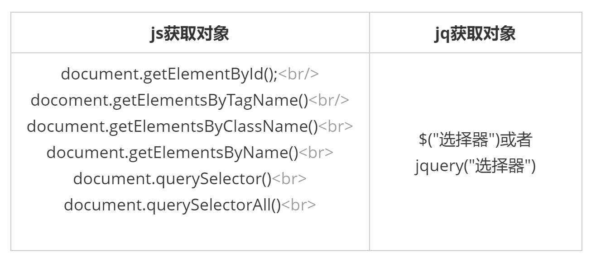
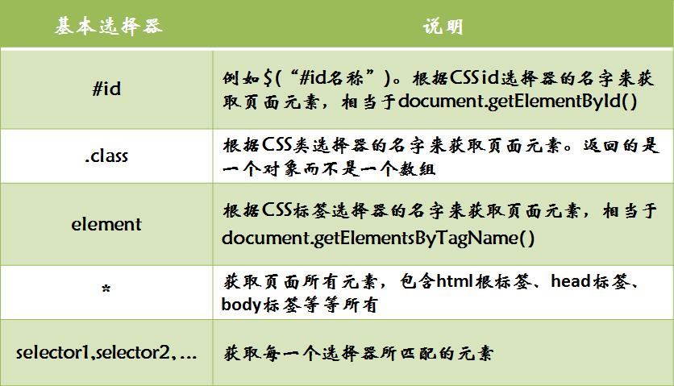
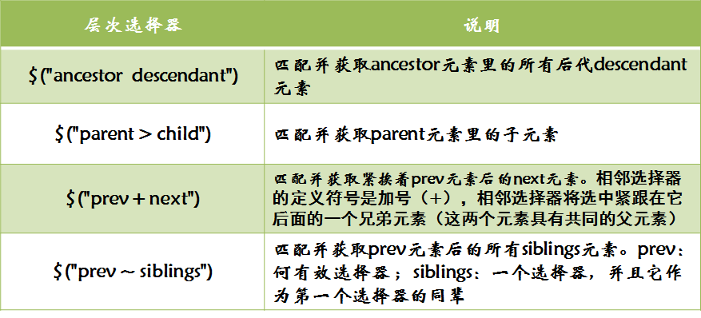
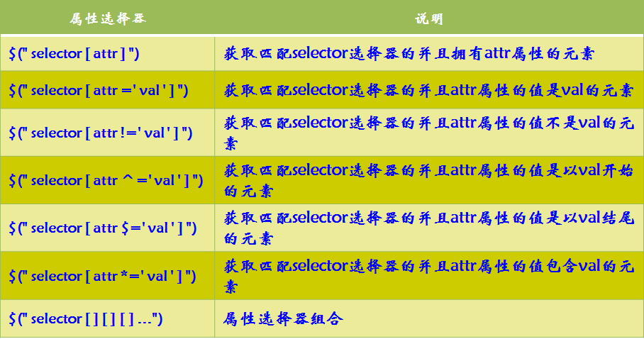
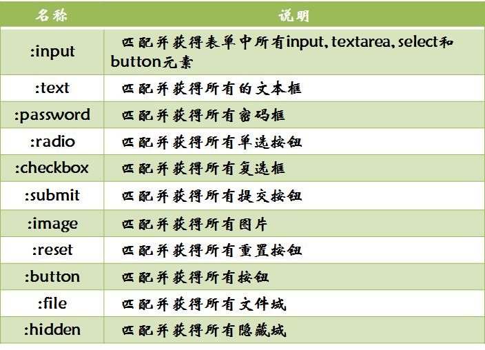
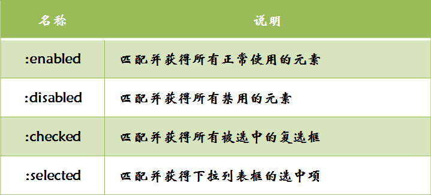
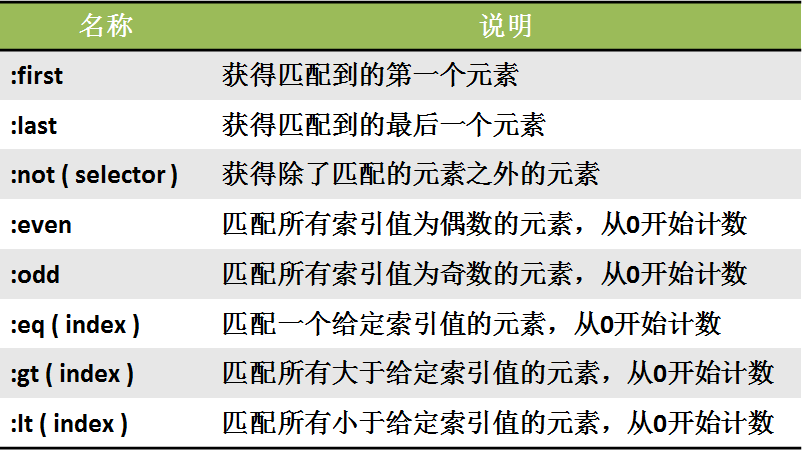
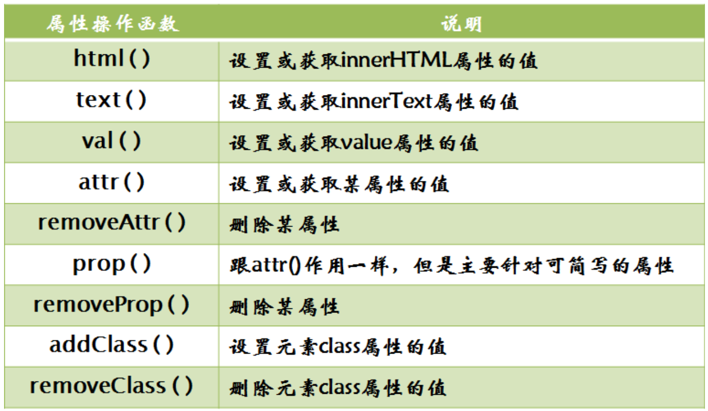
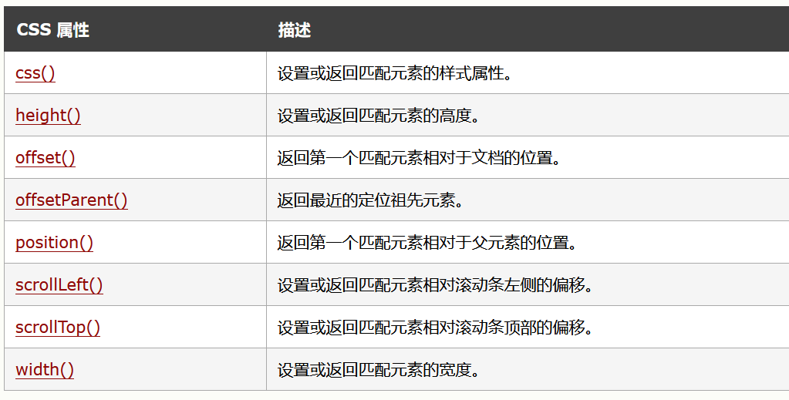
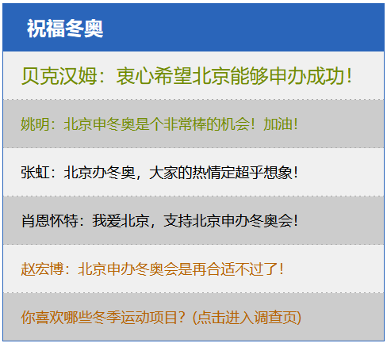

# 第一章：jQuery基础

## 课前测试 10分钟：

三个按钮 点击弹出点的是几个按钮。

两种方式完成。

1.闭包

2.属性方式 

## 回顾：

闭包。

## 本章目标 

- 明白什么叫jquery 
- 掌握jquery基本语法
- 掌握jquery选择器的使用
- 掌握jquery对象和js对象的区别与转换

## 一、jQuery简介  

### 1.1 什么是 jQuery  

jQuery是一个快速、简洁的[JavaScript](https://baike.baidu.com/item/JavaScript/321142)**框架**，是继[Prototype](https://baike.baidu.com/item/Prototype/14335188)之后又一个优秀的JavaScript代码库（框架）于2006年1月由[John Resig](https://baike.baidu.com/item/John Resig/6336344)发布。jQuery设计的宗旨是“**write Less，Do More**”，即倡导写更少的代码，做更多的事情。它封装JavaScript常用的功能代码 jquery.js，提供一种简便的JavaScript[设计模式](https://baike.baidu.com/item/设计模式/1212549)，优化[HTML](https://baike.baidu.com/item/HTML/97049)文档操作、事件处理、动画设计和[Ajax](https://baike.baidu.com/item/Ajax/8425)交互。

jQuery的核心特性可以总结为：具有独特的链式语法和短小清晰的多功能接口；具有高效灵活的[CSS选择器](https://baike.baidu.com/item/CSS选择器/2819686)，并且可对[CSS](https://baike.baidu.com/item/CSS/5457)选择器进行扩展；拥有便捷的插件扩展机制和丰富的插件。jQuery兼容各种主流浏览器，如[IE](https://baike.baidu.com/item/IE/69103) 6.0+、FF 1.5+、[Safari](https://baike.baidu.com/item/Safari/597) 2.0+、Opera 9.0+等。 [1] 

什么是框架？

一些具有特定功能的代码块 ====》比较大的函数集。

jquery的本质===》 xxx.js 

### 1.2 jQuery 的优点  

**快速获取文档元素** 

jQuery的选择机制构建于Css的选择器，它提供了快速查询DOM文档中元素的能力，而且大大强化了JavaScript中获取页面元素的方式。$("选择器")

**提供漂亮的页面动态效果** 

jQuery中内置了一系列的动画效果，可以开发出非常漂亮的网页，许多网站都使用jQuery的内置的效果，比如淡入淡出、元素移除等动态特效。 

**创建AJAX无刷新网页** 

AJAX是异步的JavaScript和XML的简称，可以开发出非常灵敏无刷新的网页，特别是开发服务器端网页时，比如PHP网站，需要往返地与服务器通信，如果不使用AJAX，每次数据更新不得不重新刷新网页，而使用AJAX特效后，可以对页面进行局部刷新，提供动态的效果。

ajax     axios==>vue      fetch 

**提供对JavaScript语言的增强** 

jQuery提供了对基本JavaScript结构的增强，比如元素迭代和数组处理等操作。

**增强的事件处理** 

jQuery提供了各种页面事件，它可以避免程序员在HTML中添加太多事件处理代码，最重要的是，它的事件处理器消除了各种浏览器兼容性问题。

**更改网页内容**

jQuery可以修改网页中的内容，比如更改网页的文本、插入或者翻转网页图像，jQuery简化了原本使用JavaScript代码需要处理的方式。 [6-7] 

**链式编程**  


概念：一个封装好的具有各种功能的一个js文件。

**核心**： 学习jquery中封装好的各种方法，记住方法的名字和功能，参数。

jQuery已经被淘汰了。----》ajax    vue  

## 二、jQuery的使用 

### 2.1 jQuery 的下载

jquery下载网址：https://www.jq22.com/jquery-info122 

jQuery的官网地址： https://jquery.com/，官网即可下载最新版本。

​	版本介绍：

> 1x ：兼容 IE 678 等低版本浏览器， 官网不再更新
>
> 2x ：不兼容 IE 678 等低版本浏览器， 官网不再更新
>
> 3x ：不兼容 IE 678 等低版本浏览器， 是官方主要更新维护的版本

### 2.2 jQuery基本语法 $(顶级对象)

语法格式：

```
$("选择器")/jquery("选择器").action();
- 美元符号定义 jQuery 
- 选择符（selector）"查询"和"查找" HTML 元素
- jQuery 的 action() 执行对元素的操作
```

1.  \$是 jQuery 的别称，在代码中可以使用 jQuery 代替，但一般为了方便，通常都直接使用 $ 。
2.  \$是jQuery的顶级对象，相当于原生JavaScript中的 window。把元素利用$包装成jQuery对象，就可以调用jQuery 的方法。

**获取元素对象：**  



### 2.3  jQuery 对象和 DOM 对象  

​	使用 jQuery 方法和原生JS获取的元素是不一样的，总结如下 : 

1. 用原生 JS 获取来的对象就是 DOM 对象
2. jQuery 方法获取的元素就是 jQuery 对象。
3. jQuery 对象本质是： 利用$对DOM 对象包装后产生的对象（伪数组形式存储）。

> 注意：
>
> 只有 jQuery 对象才能使用 jQuery 方法，DOM 对象则使用原生的 JavaScirpt 方法。


### 2.4  jQuery 对象和 DOM 对象转换

​	DOM 对象与 jQuery 对象之间是可以相互转换的。因为原生js 比 jQuery 更大，原生的一些属性和方法 jQuery没有给我们封装. 要想使用这些属性和方法需要把jQuery对象转换为DOM对象才能使用。

```javascript
<script>
        /*
            $("选择器") 获取的是多个元素对象 伪数组 但是  在jquery内部封装的有遍历
                */
        //alert($("div").get(3));
        //alert($("div")[3]);//[object HTMLDivElement] === >标准的原生js DOM对象
        //alert($("div"));   //[object Object] =======》 jquery的对象模式
       /*
            原生的js对象和jquery对象的区别：
                js对象只能使用原生js的属性和方法。
                jq对象只能使用jq的属性和方法。
            js对象和jquery对象的转换：
                把js对象使用  $(js对象)包起来，就是jq对象
                把jq对象使用  $("选择器")[下标]/$("选择器").get(下标) 就是 js对象
         */
        //js对象
        var divEle = document.getElementsByTagName("div")[0];
        alert(divEle);//[object HTMLDivElement]
        alert( $(divEle));//[object Object]伪数组
    </script>
```

总结：实际开发比较常用的是把DOM对象转换为jQuery对象，这样能够调用功能更加强大的jQuery中的方法。

### 2.5 jQuery的入口函数  

  jQuery中常见的两种入口函数：

```javascript
//js入口函数
window.onload = function(){
    页面加载完成时 自动执行
}

// 第一种: 简单易用。
$(function () {   
    ...  // 此处是页面 DOM 加载完成的入口
}); 

// 第二种: 繁琐，但是也可以实现
$(document).ready(function(){
   ...  //  此处是页面DOM加载完成的入口
});
```

​	总结：

1. 等着 DOM 结构渲染完毕即可执行内部代码，不必等到所有外部资源加载完成，jQuery 帮我们完成了封装。
2. 相当于原生 js 中的 DOMContentLoaded。
3. 不同于原生 js 中的 load 事件是等页面文档、外部的 js 文件、css文件、图片加载完毕才执行内部代码。
4. 更推荐使用第一种方式。

### 2.6 jQuery 选择器   

- **基本选择器** 

 

- **层次选择器**  

 

- **属性选择器**   

 


- **表单选择器** 

 


- **表单属性选择器** 




- **过滤选择器**   




## 三、jQuery 属性操作 

常用的属性操作：

括号里边写数据代表修改值，括号里边不写 代表获取值



attr()主要针对  元素的自定义属性 

prop()主要针对  元素的固有属性  

常见样式操作：



## 四、总结与作业  

熟练掌握jquery的基本语法，jquery选择器的使用。 

使用jquery设置如图所示样式

把html和css的作业找几个 使用jquery去做。



