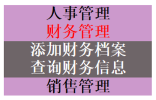
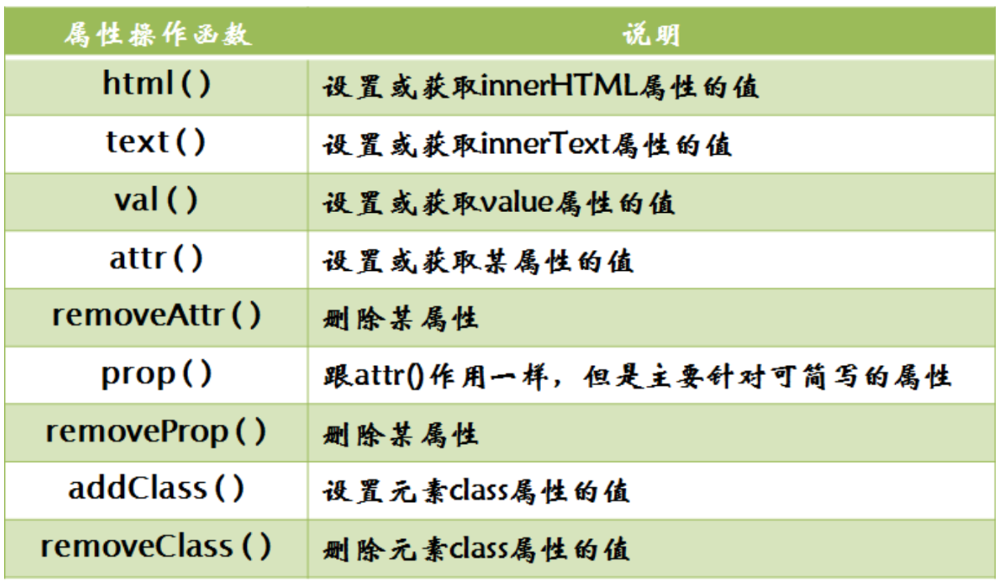

# 第二章：jQuery属性操作，DOM操作

## 课前测试 10分钟：

鼠标事件  mouseover  mouseout

$().mouseover(function(){})



## 回顾：


## 本章目标 

- jQueryDOM操作
- 对象遍历方法

## 一、jQuery 属性操作




addClass();添加一个类 在原有的类的基础上追加新的类名。并不是覆盖。

## 二、jQuery 遍历

```js
<!DOCTYPE html>
<html lang="en">

<head>
    <meta charset="UTF-8">
    <meta http-equiv="X-UA-Compatible" content="IE=edge">
    <meta name="viewport" content="width=device-width, initial-scale=1.0">
    <title>Document</title>
    <script src="./js/jquery-3.4.1.js"></script>
</head>

<body>
    <p>你好哈哈哈1</p>
    <p>你好哈哈哈2</p>
    <p>你好哈哈哈3</p>
    <p>你好哈哈哈4</p>
    <p>你好哈哈哈5</p>

    <script>
        //$("p") 获取的是伪数组  页面中所有跟选择器匹配的元素。 ===》 js的query系列
        //$("p").css('color','red');//内部包含循环遍历的操作
        // $("p").text();
        //需求：挨个把p标签中的文本内容控制台输出
        //循环操作方式1 ：普通的for循环
        /* for(var i=0;i<$("p").length;i++){
            //js对象
            //console.log( $('p')[i].innerText );
            //console.log( $('p').get(i).innerText );

            //jq对象
            //console.log( $("p").eq(i).text() );
            console.log( $("p:eq("+ i +")").text() );
        } */

        //for in 可以用来遍历对象的属性  会把对象中的所有的属性和方法都遍历出来，不推荐使用。
        /* for (var i in $("p")) {
            if(i<5){
                console.log($('p')[i].innerText);
            }
        } */
        //方式三 each()
        //function函数后的括号内  
        //两个参数  第一个表示 当前遍历到的那个 下标 
        // 第二个参数表示当前下标对应的对象。
        //对象数组.each(function(i,o){})
        $('p').each(function(i,o){
            //console.log($(this).text());
            console.log(i+"=="+o.innerText);
        })

        //方式四：跟方式三 一样。 杂项方法/工具方法
        /*
            $.each( 参数一  , 回调函数 )
            参数一：就是你要遍历的数组或对象
            $.each()
                遍历数组
                    $.each( 要遍历的数组 ,function(i,v){ i是下标 v是对应的值})
                遍历对象
                    $.each( 要遍历的对象 ,function(k,v){ k是 对象的属性名  v是对应的属性值})
        */
       var arr = [1,2,3,4,5];
        $.each( arr ,function(i,v){
            console.log(i+"==="+v);
        })
        var obj = {
            'name':'张三',
            'age':18,
            'address':'郑州'
        }
        $.each( obj ,function(k,v){
            console.log(k+"==="+v);
        })
    </script>
</body>

</html>
```


## 三、jQuery 的DOM操作 

增删改查 

#### 2.1 创建节点  

| 方法           | 含义     |
| -------------- | -------- |
| $(“<标签名>”); | 创建节点 |

对比：document.createElement("div");   

#### 2.2 添加节点 

| 方法              | 含义                     |
| ----------------- | ------------------------ |
| 父.append(子)     | 在父元素的结尾追加子元素 |
| 子.appendTo( 父 ) | 把子元素添加到父元素中   |
| 父.prepend(子)    | 在被选元素的开头插入内容 |
| 子.prependTo(父)  | 把子元素加到父元素的开头 |
| after()           | 在被选元素之后插入内容   |
| before()          | 在被选元素之前插入内容   |

after()跟before()用来操作同级元素。目标对象.after/before(  插入的对象 )

append()和appendTo()方法  都是用于把子元素加到父元素中，如果子元素在页面中已经存在，此时就是 移动子元素的位置，如果子元素不存在，就是新增了一个新的元素。

#### 2.3 删除节点 

| 方法     | 含义                       |
| -------- | -------------------------- |
| remove() | 删除被选元素（及其子元素） |
| empty()  | 从被选元素删除子元素       |

#### 2.4 复制节点

| 方法                   | 含义                                         |
| ---------------------- | -------------------------------------------- |
| clone(*includeEvents*) | 生成被选元素的副本，包含子节点、文本和属性。 |

*includeEvents：*可选。布尔值。规定是否复制元素的所有事件处理。默认地，副本中不包含事件处理器。 

如果值为true可以把目标元素的事件也复制，如果值为false  表示不复制 事件只复制 元素本身。

##  四、常用文档操作方法(节点相关)  

| 方法名     | 含义                                                         |
| ---------- | ------------------------------------------------------------ |
| parent()   | 返回被选元素的直接父元素。====parentNode                     |
| parents()  | 返回被选元素的所有祖先元素，它一路向上直到文档的根元素 (<html>) |
| children() | 返回被选元素的所有直接子元素 ==== children                   |
| find()     | 方法返回被选元素的后代元素，一路向下直到最后一个后代         |
| contents() | 返回被选元素的所有直接子元素（包含文本和注释节点）====childNode |
| next()     | 返回被选元素的下一个同胞元素。==== nextElementSibling        |
| nextAll()  | 返回被选元素的所有跟随的同胞元素。                           |
| prev()     | 返回被选元素的上一个同胞元素                                 |
| prevAll()  | 返回被选元素的所有上边的同胞元素                             |
| siblings() | 返回被选元素的所有同胞元素。                                 |
| first()    | 返回被选元素的首个元素。                                     |
| last()     | 返回被选元素的最后一个元素。                                 |
| eq()       | 返回被选元素中带有指定索引号的元素。                         |
| index()    | 返回被选元素的下标位置                                       |

## 五、案例 

1.制作tab切换

2.论坛发帖

3.去左边去右边  

4.把json数据填充到表格(商品列表)中，从这个表格（商品列表）里选择商品做添加 到购物车

5.jQ完成购物车  

## 六、总结与作业