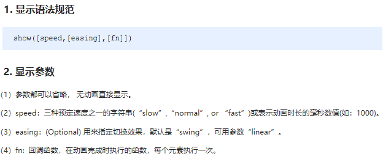
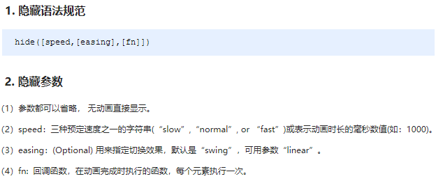
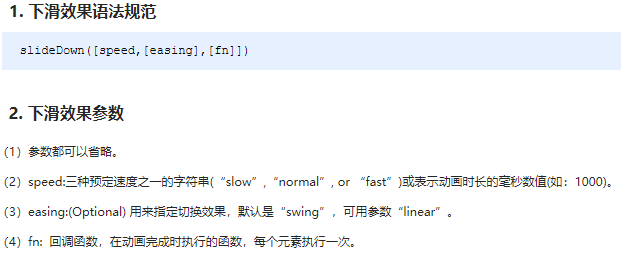

# 第三章：事件处理，动画

## 课前测试 10分钟：

jquery实现全选反选效果。

## 回顾：

## 本章目标  

- 事件注册
- 事件委派
- 事件对象  event/e    
- 元素位置操作  
- 动画 

## 一、jQuery 事件   

### 1.1 事件的绑定/添加/注册    

jQuery 为我们提供了方便的事件注册机制，操作优缺点如下：

- 优点: 操作简单，且不用担心事件覆盖等问题。
- 缺点: 普通的事件注册不能做**事件委托**，且无法实现事件解绑，需要借助其他方法。

### 1.2 事件处理  

事件的注册方法一：普通的方式    

$("p").click(funtion(){})

mouseover  out  down  enter  leave ....

普通的事件绑定没有问题，但是如果是动态添加的元素无法绑定事件。

api较少，有一些方法无法直接绑定 contextmenu  copy  cut .... 

#### jQuery 事件处理

​	因为普通注册事件方法的不足，jQuery又开发了多个处理方法，重点如下：

- on(): 用于事件绑定，目前最好用的事件绑定方法 addEventListener
- off(): 事件解绑   remove...
- trigger() / triggerHandler(): 事件触发 ===== click();

#### 1.2.1 事件处理 on() 绑定事件

​	因为普通注册事件方法的不足，jQuery又创建了多个新的事件绑定方法bind() / live() / delegate() / on()等，其中最好用的是: on()方法

**语法**


##### 事件委派 

* 将多个子元素(li)的事件监听委托给父辈元素(ul)处理
* 监听回调是加在了父辈元素上,当操作任何一个子元素(li)时, 事件会冒泡到父辈元素(ul)父辈元素不会直接处理事件,
* 根据event.target得到发生事件的子元素(li), 通过这个子元素调用事件回调函数 
* 就像是委托方(li)与被委托方(ul)的关系。 

优点：

```txt
- 添加新的子元素, 自动有事件响应处理 
- 减少事件监听的数量: n(后代元素绑定监听的次数)==>1(祖先元素绑定监听的次数) 
- 利用了冒泡，通过委派可以减少事件绑定的次数，提高程序的性能
缺点：如果层级较多，会浪费时间。
```

案例：动态添加的元素的事件绑定。 

```html
<!DOCTYPE html>
<html lang="en">

<head>
    <meta charset="UTF-8">
    <meta http-equiv="X-UA-Compatible" content="IE=edge">
    <meta name="viewport" content="width=device-width, initial-scale=1.0">
    <title>Document</title>
</head>

<body>
    <ul id="max">
        <li>第1个li</li>
        <li>第2个li</li>
        <li>第3个li</li>
    </ul>
    <button onclick="addLi()">点我添加li</button>
    <script>
        /* function aaa() {
            console.log(1111);
        }
        var liArr = document.getElementsByTagName("li");
        for (var i = 0; i < liArr.length; i++) {
            liArr[i].onclick = aaa;
        }
         */
        var a = 1;
        function addLi() {
            var li_ = document.createElement("li");
            li_.innerText = "你好哈哈哈" + a;
            a++;
            max.appendChild(li_);

        }


        //使用事件委派 来解决新增的标签上 没有绑定事件的问题
        //把事件绑定给li的父元素,触发事件时 是采用的冒泡机制
        //由父元素把事件传递给子元素 然后再触发事件

        //点击哪个li就让哪个li变成红色
        max.onclick = function () {
            var e = window.event || e;
            //target
            //console.log(e.target);
            e.target.style.backgroundColor = "red";
        }
    </script>
</body>

</html>
```

#### 1.2.3. 事件处理 off() 解绑事件

​	当某个事件上面的逻辑，在特定需求下不需要的时候，可以把该事件上的逻辑移除，这个过程我们称为事件解绑。jQuery 为我们提供 了多种事件解绑方法：die() / undelegate() / off() 等，甚至还有只触发一次的事件绑定方法 one()，重点off() ;

**语法**


#### 1.2.4. 事件处理 trigger() 自动触发事件

​	有些时候，在某些特定的条件下，我们希望某些事件能够自动触发, 比如轮播图自动播放功能跟点击右侧按钮一致。可以利用定时器自动触发右侧按钮点击事件，不必鼠标点击触发。由此 jQuery 为我们提供了两个自动触发事件 trigger() 和 triggerHandler() ; 

**语法**


### 1.3 事件对象 event 

​	jQuery 对DOM中的事件对象 event 进行了封装，兼容性更好，获取更方便，使用变化不大。事件被触发，就会有事件对象的产生。

**语法**


案例：阻止默认行为

```
//阻止鼠标右键默认行为
$(document).on('contextmenu',function(event){
	event.preventDefault();
})
//阻止拷贝行为
$("#max").on('copy',function(){
	event.preventDefault();
})
```

位置信息：


#### jQuery 尺寸操作

​	 jQuery 尺寸操作包括元素宽高的获取和设置，且不一样的API对应不一样的盒子模型。

**语法**

width()如果是 border-box 获取的也是内容部分 width-padding-border


####  jQuery 位置操作

​	jQuery的位置操作主要有三个： offset()、position()、scrollTop()/scrollLeft() , 具体介绍如下: 

**语法**


案例：使用jquery完成模块的固定定位效果，并且点击模块回到顶部。

```js
<!DOCTYPE html>
<html>

<head>
    <meta charset="UTF-8">
    <meta http-equiv="X-UA-Compatible" content="IE=edge">
    <meta name="viewport" content="width=device-width, initial-scale=1.0">
    <title>Document</title>
    <script src="./js/jquery-3.4.1.js"></script>
    <style>
        .box {
            width: 200px;
            height: 4000px;
            background-color: red;
        }

        .aaa {
            width: 100px;
            height: 100px;
            background-color: blue;
            position: absolute;
            top: 600px;
            left: 1200px;
        }
    </style>
</head>

<body>
    <div class="box"></div>
    <div class="aaa">回到顶部</div>
</body>
<script>
    //1.先以绝对定位实现 固定定位的效果
    //元素距离 文档顶部的top距离 = 样式表设置的初始top值 + 文档滚动的scrollTop()值
    var t = $('.aaa').position().top;
    $(window).scroll(function () {
        var len = $(window).scrollTop() + t;
        console.log(len);
        $('.aaa').offset({ top: len });
    })

    //2.点击div回到顶部
    $(".aaa").click(function () {
        //瞬间到顶
        //$(window).scrollTop(0);

        //参数分析
        /*
            总距离
            间隔时间
            总时间 
        间隔的距离：
            总距离/（总时间/间隔时间）

            一次定时器后的剩余距离 = 总距离-=间隔距离

            条件：定时器什么时候停止？
            剩余距离<=0时 停止
        */
        //总距离  文档滚动的距离 $(window)===$(document)
        var distance = $(window).scrollTop();
        //间隔时间 50ms
        var step_time = 50;
        //总时间  3000ms
        var total_time = 500;

        //间隔距离
        var step_px = distance / (total_time / step_time);

        //定时器
        var timer = setInterval(function () {
            //每一次定时器 减少 scrollTop的值 
            distance -= step_px;
            //停止定时器
            if (distance <= 0) {
                //纠正距离为0
                distance = 0;
                clearInterval(timer);
            }
            //改变滚动条的距离
            $(window).scrollTop(distance);
        }, step_time);
    })
</script>
</html> 
```

## 二、动画效果  

###  jQuery 效果 

​	jQuery 给我们封装了很多动画效果，最为常见的如下：

- 显示隐藏：show() / hide() / toggle() ;
- 滑入滑出：slideDown() / slideUp() / slideToggle() ; 
- 淡入淡出：fadeIn() / fadeOut() / fadeToggle() / fadeTo() ; 
- 自定义动画：animate() ; 

> 注意：
>
> 动画或者效果一旦触发就会执行，如果多次触发，就造成多个动画或者效果排队执行。
>
> jQuery为我们提供另一个方法，可以停止动画排队：stop() ;

### 2.1. 显示隐藏

​	显示隐藏动画，常见有三个方法：show() / hide() / toggle() ;

​	语法规范如下:






600ms slow   400ms noraml    200ms fast 

jQuery只包含了两个缓动方法：swing和linear。linear方法提供了一个稳定的动画，以使得动画的每个步骤都是相同的(例如，如果要让一个元素以逐渐变化的方式穿过屏幕，每一步的距离和前一步都是相同的)。swing要更加动态一些，随着动画的开始变得更加快一些，然后再慢下来。swing是一个常用设置，因此，如果没有指定任何缓动，jQuery会使用swing方法。

### 2.2. 滑入滑出

​	滑入滑出动画，常见有三个方法：slideDown() / slideUp() / slideToggle() ; 

​	语法规范如下:




案例：下拉菜单

### 2.3 淡入淡出

​	淡入淡出动画，常见有四个方法：fadeIn() / fadeOut() / fadeToggle() / fadeTo() 操作透明度; 

​	语法规范如下:


### 2.4 自定义动画

​	自定义动画非常强大，通过参数的传递可以模拟以上所有动画，方法为：animate() ;

​	语法规范如下:


案例：导航菜单的显示与隐藏。

### 2.5 停止动画排队 

​	动画或者效果一旦触发就会执行，如果多次触发，就造成多个动画或者效果排队执行。

​	停止动画排队的方法为：stop() ; 

- stop() 方法用于停止动画或效果。
- stop() 写到动画或者效果的前面， 相当于停止结束上一次的动画。

​        总结: 每次使用动画之前，先调用 stop() ,在调用动画。

### 2.6. 事件切换

​	jQuery中为我们添加了一个新事件 hover() ; 功能类似 css 中的伪类 :hover 。介绍如下

**语法** 

```javascript
hover([over,]out)     // 其中over和out为两个函数
hover(mouseenter,mouseleave)
```

- over:鼠标移到元素上要触发的函数（相当于mouseenter）
- out:鼠标移出元素要触发的函数（相当于mouseleave）
- 如果只写一个函数，则鼠标经过和离开都会触发它

## 三、总结与作业

总结今日知识点

练习。