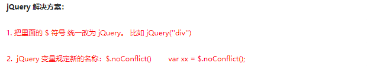

# 第四章：ajax

## 课前测试 10分钟：

JQuery完成拖拽。

## 回顾：

## 本章目标 

- 多库共存
- jQuery扩展 
- jQuery插件
- ajax

## 一、jQuery 多库共存问题 

实际开发中，很多项目连续开发十多年，jQuery版本不断更新，最初的 jQuery 版本无法满足需求，这时就需要保证在旧有版本正常运行的情况下，新的功能使用新的jQuery版本实现，这种情况被称为，jQuery 多库共存。

**语法**



 \$.noConflict()解除jquery对$符的占用

**演示代码**

## 二、jQuery 插件机制

\$在 代码中有两个含义：

$. 工具方法。

$('选择器') 实例对象

### 2.1 扩展jQuery 工具方法

语法：

```
//添加工具方法
$.extend({
  min: function(a, b) { return a < b ? a : b; },
  max: function(a, b) { return a > b ? a : b; }
});
//调用
$.min(3,5);
$.max(6,9)
```

案例：需求：给Jquery添加工具方法

1. 去除字符串左侧空格
2. 去除字符串右侧空格
3. 去除字符串中所有空格

### 2.2 扩展jQuery对象方法

jQuery.fn其实就是jquery的原型对象。其extend()方法用于为jQuery的原型添加新的属性和方法。这些方法可以在jQuery实例对象上调用。

语法：

```
//扩展jquery对象方法
$.fn.extend({
	allCheck:function(){
		this.prop('checked',true);
	},
	unAllCheck:function(){
		this.prop('checked',false);
	}
})
//调用
$("input[type=checkbox]").allCheck();
$("input[type=radio]").unAllCheck();
```

案例：给jquery对象封装全选和全不选方法。

### 2.3 jQuery插件扩展：

jQuery 功能比较有限，想要更复杂的特效效果，可以借助于 jQuery 插件完成。 这些插件也是依赖于jQuery来完成的，所以必须要先引入jQuery文件，因此也称为 jQuery 插件。

​	jQuery 插件常用的网站：

1. jQuery 插件库  http://www.jq22.com/     

2. jQuery 之家   http://www.htmleaf.com/ 

   jQuery 插件使用步骤：

3. 引入相关文件。（jQuery 文件 和 插件文件）    

4. 复制相关html、css、js (调用插件)。 

瀑布流插件  

轮播图插件  

放大镜插件 

全屏滚动插件  

​		全屏滚动插件比较大，所以，一般大型插件都会有帮助文档，或者网站。全屏滚动插件介绍比较详细的网站为：

​		http://www.dowebok.com/demo/2014/77/ 

BootStrap框架：半成品软件。

插件只是框架中的一个组成部分(组件)

插件的使用步骤：

1.下载

2.导入js,css

3.导入基本的 html 结构

4.初始化插件(并配置相应的参数) 

## 三、Ajax和跨域 

概念：异步的 javascript 和xml   async...  javaScript and  XML

作用：在不重载整个网页的情况下 刷新页面中的数据。

步骤：原生的ajax请求步骤

```
1.创建ajax对象
	var ajax_obj = new XMLHttpRquest()|| ActiveXObject(Microsoft.XMLHTTP);
2.建立连接
	ajax_obj.open( 请求方式 , url , true/false );
3.发送请求
	ajax_obj.send();
4.接收响应
	ajax_obj.onreadstatechange = function(){
		if(readyState==4){
			if(status==200){
				ajax_obj.responseXML/Text
			}
		}
	}
```

JQuery的ajax:

```json
<!DOCTYPE html>
<html lang="en">

<head>
    <meta charset="UTF-8">
    <meta http-equiv="X-UA-Compatible" content="IE=edge">
    <meta name="viewport" content="width=device-width, initial-scale=1.0">
    <title>Document</title>
    <script src="../js/jquery-3.4.1.js"></script>
</head>

<body>
    用户<input type="text" id="username"><br>
    密码<input type="text" id="pword"><br>
    <button>提交ajax</button>
    <button>提交get</button>
    <button>提交post</button>
</body>
<script>
    $('button:eq(1)').click(function () {
       // $.get(URL,callback);
        $.get('http://127.0.0.1:3001/user?act=reg',function(result){
            console.log(result);
        },'json')
    })

    
    $('button:eq(2)').click(function () {
       // $.post(URL,data,callback); 
        $.post('http://127.0.0.1:3001/user',{'act':'reg','user':username.value,'pass':pword.value},function(result){
            console.log(result);
        },'json')
    })
    
    $('button:eq(0)').click(function () {
        //jquery方式请求
        /*
            标准形式
            $.ajax({

            })

            简写形式
            $.get()

            $.post()
        */
        $.ajax({
            type: 'post',//请求的方式
            url: 'http://127.0.0.1:3001/user',//请求的路径
            //要往后台服务器发送的数据
            data:{'act':'reg','user':username.value,'pass':pword.value},
            dataType:'json',//预期的返回的数据的格式
            success: function (result) {//当请求成功时会调用这个函数  回调函数
                //此时的result==== 原生ajax的 reponse.Text 是字符串类型
                //var obj = JSON.parse(result);
                console.log(result.msg);
            },
            error:function(){//请求失败的回调函数
                console.log('请求失败');
            },
            async:true// async专门用来控制请求是同步还是异步  默认为true 异步  false 同步
        })
        
    })
</script>

</html>
```

作业：自定义json文件 使用jquery的形式 去读取。

把我们js中ajax的作用在做一遍。