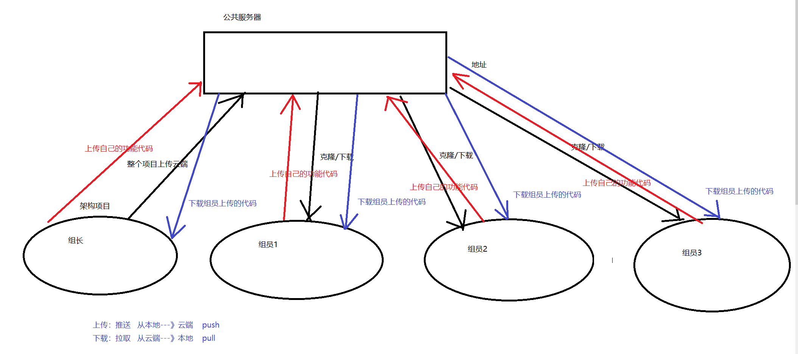

# 1. 目标

- 了解Git基本概念
- 能够概述git工作流程
- 能够使用Git常用命令【会】必会
- 熟悉Git代码托管服务
- 能够使用idea操作git 【会】必会

回顾：

git：版本控制器 

工作区--add--》暂存区--commit--》本地仓库《----push  pull  clone----》远程仓库

git remote origin url 

git status

git log 

# 2. 概述  

## 2.0 如果你用Microsoft Word写过长篇大论，那你一定有这样的经历：

想删除一个段落，又怕将来想恢复找不回来怎么办？有办法，先把当前文件“另存为……”一个新的Word文件，再接着改，改到一定程度，再“另存为……”一个新文件，这样一直改下去，最后你的Word文档变成了这样：


过了一周，你想找回被删除的文字，但是已经记不清删除前保存在哪个文件里了，只好一个一个文件去找，真麻烦。

看着一堆乱七八糟的文件，想保留最新的一个，然后把其他的删掉，又怕哪天会用上，还不敢删，真郁闷。

更要命的是，有些部分需要你的财务同事帮助填写，于是你把文件Copy到U盘里给她（也可能通过Email发送一份给她），然后，你继续修改Word文件。一天后，同事再把Word文件传给你，此时，你必须想想，发给她之后到你收到她的文件期间，你作了哪些改动，得把你的改动和她的部分合并，真困难。

于是你想，如果有一个软件，不但能==自动帮我记录每次文件的改动==，==还可以让同事协作编辑==，这样就不用自己管理一堆类似的文件了，也不需要把文件传来传去。如果想查看某次改动，只需要在软件里瞄一眼就可以，岂不是很方便？

这个软件用起来就应该像这个样子，能记录每次文件的改动：

| 版本 | 文件名      | 用户 | 说明                   | 日期       |
| :--- | :---------- | :--- | :--------------------- | :--------- |
| 1    | service.doc | 张三 | 删除了软件服务条款5    | 7/12 10:38 |
| 2    | service.doc | 张三 | 增加了License人数限制  | 7/12 18:09 |
| 3    | service.doc | 李四 | 财务部门调整了合同金额 | 7/13 9:51  |
| 4    | service.doc | 张三 | 延长了免费升级周期     | 7/14 15:17 |

这样，你就结束了手动管理多个“版本”的史前时代，进入到版本控制的20世纪。

版本控制软件

svn  集中式管理   

​		中央仓库的作用：

​				1.存储所有的版本信息 方便我们 回退 查找历史版本

​				2.作为中央仓库 链接  组内每一个成员。

git   分布式管理 

​				1.作为中央仓库 链接  组内每一个成员。


中央仓库

本地仓库

## 2.1、开发中的实际场景 

```
场景一：备份 小明负责的模块就要完成了，就在即将Release之前的一瞬间，电脑突然蓝屏，硬盘光荣牺牲！几个月 来的努力付之东流 

场景二：代码还原 这个项目中需要一个很复杂的功能，老王摸索了一个星期终于有眉目了，可是这被改得面目全非的 代码已经回不到从前了。什么地方能买到哆啦A梦的时光机啊？

场景三：追溯问题代码的编写人和编写时间！ 老王是另一位项目经理，每次因为项目进度挨骂之后，他都不知道该扣哪个程序员的工资！就拿这 次来说吧，有个Bug调试了30多个小时才知道是因为相关属性没有在应用初始化时赋值！可是二胖、王东、刘 流和正经牛都不承认是自己干的！
```

## 2.2、什么是版本控制器

```
版本控制（Revision control）是一种在开发的过程中用于管理我们对文件、目录或工程等内容的修改历史，方便查看更改历史记录，备份以便恢复以前的版本的软件工程技术。
1.实现跨区域多人协同开发. 
2.追踪和记载一个或者多个文件的历史记录
3.组织和保护你的源代码和文档
4.统计工作量
5.并行开发、提高开发效率.
6.跟踪记录整个软件的开发过程
7.减轻开发人员的负担，节省时间，同时降低人为错误

简单说就是用于[管理多人协同开发项目]的技术。
```

### 什么是版本控制 ？

版本控制是指对软件开发过程中各种程序代码、说明文档等文件的变更进行管理，它将追踪文件变化，记录文件的变更时间、变更内容、甚至变更执行人等进行记录，同时对每一个阶段性变更（不仅仅只是一个文件的变化）添加版本编号，方便将来进行查阅特定阶段的变更信息，甚至是回滚。

### **svn （集中式）** 

集中式版本控制系统，版本库是集中存放在中央服务器的，而干活的时候，用的都是自己的电脑，所以要先从中央服务器取得最新的版本，然后开始干活，干完活了，再把自己的活推送给中央服务器。中央服务器就好比是一个图书馆，你要改一本书，必须先从图书馆借出来，然后回到家自己改，改完了，再放回图书馆。


集中式版本控制系统最大的毛病就是必须联网才能工作，如果在局域网内还好，带宽够大，速度够快，可如果在互联网上，遇到网速慢的话，可能提交一个10M的文件就需要5分钟，这还不得把人给憋死啊。

### **git(分布式)** 

分布式版本控制系统有“中央服务器”，每个人的电脑上都是一个完整的版本库，这样，你工作的时候，就不需要联网了，因为版本库就在你自己的电脑上。

和集中式版本控制系统相比，分布式版本控制系统的安全性要高很多，因为每个人电脑里都有完整的版本库，某一个人的电脑坏掉了不要紧，随便从其他人那里复制一个就可以了。而集中式版本控制系统的中央服务器要是出了问题，所有人都没法干活了。

在实际使用分布式版本控制系统的时候，其实很少在两人之间的电脑上推送版本库的修改，因为可能你们俩不在一个局域网内，两台电脑互相访问不了，也可能今天你的同事病了，他的电脑压根没有开机。因此，分布式版本控制系统通常也有一台充当“中央服务器”的电脑，但这个服务器的作用仅仅是用来方便“交换”大家的修改，没有它大家也一样干活，只是交换修改不方便而已。


下图是git开发过程。




## 2.3、版本控制器的方式

```
a、集中式版本控制工具 集中式版本控制工具，版本库是集中存放在中央服务器的，team里每个人work时从中央服务器下载代码，是必须联网才能工作，局域网或互联网。个人修改后然后提交到中央版本库。 举例：SVN---典型的集中式版本控制器。

b、分布式版本控制工具 分布式版本控制系统没有“中央服务器”，每个人的电脑上都是一个完整的版本库，这样工作的时候，无需要联网了，因为版本库就在你自己的电脑上。多人协作只需要各自的修改推送给对方，就能互相看到对方的 修改了。git----典型的分布式版本控制器。

本地有一个版本记录  远程服务器也有一个版本记录

```

## 2.4、GIT

```
Git是分布式的,Git不需要有中心服务器，我们每台电脑拥有的东西都是一样的。我们使用Git并且有个中心服务器，仅仅是为了方便交换大家的修改，但是这个服务器的地位和我们每个人的PC是一样的。我们可以 把它当做一个开发者的pc就可以就是为了大家代码容易交流不关机用的。没有它大家一样可以工作，只不 过“交换”修改不方便而已。
```


## 2.5、Git工作流程图 


命令如下：

\1. clone（克隆）: 从远程仓库中克隆代码到本地仓库

\2. checkout （检出）:从本地仓库中检出一个仓库分支然后进行修订

\3. add（添加）: 在提交前先将代码提交到暂存区

\4. commit（提交）: 提交到本地仓库。本地仓库中保存修改的各个历史版本

\5. fetch (抓取) ： 从远程库，抓取到本地仓库，不进行任何的合并动作，一般操作比较少。

\6. pull (拉取) ： 从远程库拉到本地库，自动进行合并(merge)，然后放到到工作区，

\7. push（推送） : 修改完成后，需要和团队成员共享代码时，将代码推送到远程仓库

# 3.Git安装与常用命令

## 3.1、Git环境配置

### 3.1.1 下载与安装

下载地址： 

https://git-scm.com/download


下载完成后可以得到如下安装文件：

双击下载的安装文件来安装Git。安装完成后在电脑桌面（也可以是其他目录）点击右键，如果能够看到如下两个菜单则说明Git安装成功。


安装完成后，还需要最后一步设置，在命令行输入：

```
$ git config --global user.name "Your Name"
$ git config --global user.email "email@example.com"    
```

因为Git是分布式版本控制系统，所以，每个机器都必须自报家门：你的名字和Email地址。你也许会担心，如果有人故意冒充别人怎么办？这个不必担心，首先我们相信大家都是善良无知的群众，其次，真的有冒充的也是有办法可查的。

注意`git config`命令的`--global`参数，用了这个参数，表示你这台机器上所有的Git仓库都会使用这个配置，当然也可以对某个仓库指定不同的用户名和Email地址。

查看配置信息

git config --global user.name

git config --global user.email

## 3.2、获取本地仓库

要使用Git对我们的代码进行版本控制，首先需要获得本地仓库；本地仓库你可以简单理解成一个目录，这个目录里面的所有文件都可以被Git管理起来，每个文件的修改、删除，Git都能跟踪，以便任何时刻都可以追踪历史，或者在将来某个时刻可以“还原”。

1）在电脑的任意位置创建一个空目录（例如test）作 为我们的本地Git仓库

2）进入这个目录中，点击右键打开Git bash窗口 

3）执行命令`git init `

4）如果创建成功后可在文件夹下看到隐藏的.git目录。


瞬间Git就把仓库建好了，而且告诉你是一个空的仓库（empty Git repository），可以发现当前目录下多了一个`.git`的目录，这个目录是Git来跟踪管理版本库的，没事千万不要手动修改这个目录里面的文件，不然改乱了，就把Git仓库给破坏了。

## 3.3、基础操作指令 

Git工作目录下对于文件的修改(增加、删除、更新)会存在几个状态，这些修改的状态会随着我们执行Git的命令而发生变化。

#### 状态介绍：

git 提供了四种不同的记录状态 

- 已修改（modified）
- 已暂存（staged）
- 已提交（committed）

有一个特殊的状态

- 未追踪（Untracked）


本章节主要讲解如何使用命令来控制这些状态之间的转换：

1. git add (工作区 --> 暂存区) 

2. git commit (暂存区 --> 本地仓库)

### 3.3.1、查看修改的状态（status）

作用：查看的修改的状态（暂存区、工作区）

```
命令形式：git status
```

### 3.3.2、添加工作区到暂存区(add)

作用：添加工作区一个或多个文件的修改到暂存区

```
# 添加一个文件到暂存区
git add 1.txt
# 添加多个文件
git add 2.txt 3.txt
# 添加整个目录
git add ./a
# 添加多个目录
git add ./b ./c
# 添加所有文件
git add .
```

### 3.3.3、提交暂存区到本地仓库(commit)

作用：提交暂存区内容到本地仓库的当前分支

```
命令： git  commit -m  '提交日志'
```

### 3.3.4、查看提交日志(log)

作用:查看提交记录

命令形式：git log [option]

options

--all 显示所有分支

--pretty=oneline 将提交信息显示为一行

--abbrev-commit 使得输出的commitId更简短

```
注意: 
有些常用的指令参数非常多，每次都要输入好多参数，我们可以使用别名。
1. 打开用户目录，创建 .bashrc 文件
部分windows系统不允许用户创建点号开头的文件，可以打开gitBash,执行 touch ~/.bashrc
```


```
在 .bashrc 文件中输入如下内容：
#用于输出git提交日志 
alias git-log='git log --pretty=oneline --all --graph --abbrev-commit'
```

总结:

```
1. git init: 初始化某个目录为本地仓库.
2. git status: 查看git的文件状态
3. git add 文件名|通配符: 把工作区的文件添加到暂存区.
4. git commit -m '描述': 把暂存区中文件提交到本地仓库。
5. git log: 查看提交本地仓库的历史记录。
```

### 3.3.5、版本回退

##### **版本回退**


你不断对文件进行修改，然后不断提交修改到版本库里，就好比玩RPG游戏时，每通过一关就会自动把游戏状态存盘，如果某一关没过去，你还可以选择读取前一关的状态。有些时候，在打Boss之前，你会手动存盘，以便万一打Boss失败了，可以从最近的地方重新开始。Git也是一样，每当你觉得文件修改到一定程度的时候，就可以“保存一个快照”，这个快照在Git中被称为commit。一旦你把文件改乱了，或者误删了文件，还可以从最近的一个commit恢复，然后继续工作，而不是把几个月的工作成果全部丢失。

在Git中，我们用git log命令查看，提交的历史记录


##### **回退**


##### **后悔药**  

回退的过分了，后悔了。只要上面的命令行窗口还没有被关掉，你就可以顺着往上找啊找啊，找到那个某个版本的commit id是33d9d598d123bb1327ba2abd9b73b725000abd9c，于是就可以指定回到未来/过去的某个版本：

```
git reset --hard 33d9d598d
```

版本号没必要写全，前几位就可以了，Git会自动去找。当然也不能只写前一两位，因为Git可能会找到多个版本号，就无法确定是哪一个了。

##### **Git提供了一个命令**git reflog用来记录你的每一次命令：


### 3.3.6、添加文件至忽略列表 

一般我们总会有些文件无需纳入Git 的管理，也不希望它们总出现在未跟踪文件列表。 通常都是些自动生成的文件，比如日志文件，或者编译过程中创建的临时文件等。 在这种情况下，我们可以在工作目录中创建一个名为 .gitignore 的文件（文件名称固定），列出要忽略的文件模式。

```
*.xml   忽略所有的以.xml结尾的文件
aaa     忽略整个aaa文件夹
111.txt 忽略确定的文件
```

**练习:基础操作**  

```
#####################仓库初始化###################### 
# 创建目录（git_test01）并在目录下打开gitbash 

# 初始化git仓库
#####################创建文件并提交##################### 
# 目录下创建文件 file01.txt 
略
# 将修改加入暂存区 
# 将修改提交到本地仓库，提交记录内容为：commit 001
 
# 查看日志  
####################修改文件并提交###################### 
# 修改file01的内容为：count=1 
略
# 将修改加入暂存区 
# # 将修改提交到本地仓库，提交记录内容为：update file01
git commit -m 'update file01' 
# 查看日志 git log 
####################将最后一次修改还原################## 
# 找到倒数第2次提交的commitID 
略
# 版本回退 
git reset  --hard commitID
```

回退---设置某些文件为忽略文件。

## 3.4、分支(重要+核心) 

在项目开发中，分模块开发，每一个模块可能都需要好几天的开发，那么如果我们每天提交功能没有完成的代码，有可能会对整个项目造成影响，也会对别人的代码可能产生影响，所以我们可以在本地创建一个dev开发分支,自己的代码可以先在dev分支上开发，每天使用master分支会pull别的人提交的代码，这样可以保证自己的master分支代码一直是最新的，然后当自己的功能开发完成后，将自己的dev分支跟自己的Master分支合并，再进行总体代码的push，这样也可以保证云端的代码也是最新的，也不会影响别人的更新。

几乎所有的版本控制系统都以某种形式支持分支。 使用分支意味着你可以把你的工作从开发主线上分离开来进行重大的Bug修改、开发新的功能，以免影响开发主线.


### 3.4.1、查看本地分支

```
命令：git branch
```

### 3.4.2、创建本地分支

```
命令：git branch 分支名
```

### 3.4.4、切换分支(checkout)

```
命令：git checkout 分支名
我们还可以直接切换到一个不存在的分支（创建并切换）
命令：git checkout -b 分支名
```

### 3.4.6、合并分支(merge)

一个分支上的提交可以合并到另一个分支

```
命令：git merge 分支名称
```

注意：要把代码合并到哪个分支就要在哪个分支上执行命令操作！！！

例如：现有master 分支和dev分支  需要把dev合并到master中，此时需要切换到master主分支 执行合并命令操作

### 3.4.7、删除分支

不能删除当前分支，只能删除其他分支

```
git branch -d '分支名'     删除分支时，需要做各种检查。 查看当前分支有没有没合并的内容
git branch -D b1          不做任何检查，强制删除.
```

```
1. git branch 查看本地分支
2. git branch '分支名'  常见分支
3. git checkout '分支名' 切换分支
4. git merge 分支名:   当前分支合并指定分支。
5. git branch -d 分支名  删除分支
```

### 3.4.8、解决冲突

当两个分支上对文件的修改可能会存在冲突，例如同时修改了同一个文件的同一行，这时就需要手动解决冲突，解决冲突步骤如下：

1. 处理文件中冲突的地方。

2. 将解决完冲突的文件加入暂存区(add)。

3. 提交到仓库(commit)。

冲突部分的内容处理如下所示：


### 3.4.9、开发中分支使用原则与流程 

几乎所有的版本控制系统都以某种形式支持分支。 使用分支意味着你可以把你的工作从开发主线上分离开来进行重大的Bug修改、开发新的功能，以免影响开发主线。

在开发中，一般有如下分支使用原则与流程： git常用的分支由那些以及作用：

- master （生产） 分支

  线上分支，主分支，中小规模项目作为线上运行的应用对应的分支；

- develop（开发）分支

  是从master创建的分支，一般作为开发部门的主要开发分支，如果没有其他并行开发不同期上线要求，都可以在此版本进行开发，阶段开发完成后，需要是合并到master分支,准备上线。

- feature/xxxx分支---增加新的功能

  从develop创建的分支，一般是同期并行开发，但不同期上线时创建的分支，分支上的研发任务完成后合并到develop分支。

- hotfix/xxxx分支

  从master派生的分支，一般作为线上bug修复使用，修复完成后需要合并到master、test、develop分支。

  

```
master: 线上运行的
developer:开发分支
feature: 增加新功能。---合并后可以删除
hotflix: bug时 新增的分支。---可以删除
```

但是我们写项目时可以这样。

练习:分支操作

```
###########################创建并切换到dev01分支，在dev01分支提交 
# [master]创建分支dev01 
git branch dev01 
# [master]切换到dev01 
git checkout dev01 
# [dev01]创建文件file02.txt 
略
# [dev01]将修改加入暂存区并提交到仓库,提交记录内容为：add file02 on dev 
git add . 
git commit -m 'add file02 on dev' 
# [dev01]以精简的方式显示提交记录 
git-log 
###########################切换到master分支，将dev01合并到master分支 
# [dev01]切换到master分支
git checkout master 
# [master]合并dev01到master分支 
git merge dev01 
# [master]以精简的方式显示提交记录 
git-log 
# [master]查看文件变化(目录下也出现了file02.txt) 
略
##########################删除dev01分支
# [master]删除dev01分支 
git branch -d dev01 
# [master]以精简的方式显示提交记录 
git-log
```

# 4、Git远程仓库 

## 4.1、 常用的托管服务[远程仓库] 

Git是分布式版本控制系统，同一个Git仓库，可以分布到不同的机器上。怎么分布呢？最早，肯定只有一台机器有一个原始版本库，此后，别的机器可以“克隆”这个原始版本库，而且每台机器的版本库其实都是一样的，并没有主次之分。

你肯定会想，至少需要两台机器才能玩远程库不是？但是我只有一台电脑，怎么玩？

实际情况往往是这样，找一台电脑充当服务器的角色，每天24小时开机，其他每个人都从这个“服务器”仓库克隆一份到自己的电脑上，并且各自把各自的提交推送到服务器仓库里，也从服务器仓库中拉取别人的提交。

完全可以自己搭建一台运行Git的服务器，不过现阶段，为了学Git先搭个服务器绝对是小题大作。好在这个世界上有个叫[GitHub](https://github.com/)的神奇的网站，从名字就可以看出，这个网站就是提供Git仓库托管服务的，所以，只要注册一个GitHub账号，就可以免费获得Git远程仓库。因为在国内我们这里可以使用码云。网速快。操作方便，没有延迟

```
前面我们已经知道了Git中存在两种类型的仓库，即本地仓库和远程仓库。那么我们如何搭建Git远程仓库 呢？我们可以借助互联网上提供的一些代码托管服务来实现，其中比较常用的有GitHub、码云（gitee）、GitLab等。
gitee  码云
gitHub（ 地址：https://github.com/ ）是一个面向开源及私有软件项目的托管平台，因为只支持 Git 作为唯一的版本库格式进行托管，故名gitHub 

码云（地址： https://gitee.com/ ）是国内的一个代码托管平台，由于服务器在国内，所以相比于 GitHub，码云速度会更快 

GitLab （地址： https://about.gitlab.com/ ）是一个用于仓库管理系统的开源项目，使用Git作 为代码管理工具，并在此基础上搭建起来的web服务,一般用于在企业、学校等内部网络搭建git私服。 安全性高 银行项目 16G以上。 自己搭建的远程仓库，内存必须在16G以上【空出】

gitlib
```

## 4.2、 注册码云

要想使用码云的相关服务，需要注册账号（地址： https://gitee.com/signup ）


## 4.3、 创建远程仓库


仓库创建完成后可以看到仓库地址，如下图所示:


#### 添加仓库成员，开发者


## 4.4、配置SSH公钥---

- 生成SSH公钥 

- [ ] ssh-keygen -t rsa

- [ ] 不断回车

​             如果公钥已经存在，则自动覆盖

- Gitee设置账户共公钥

- [ ] 获取公钥

​              cat ~/.ssh/id_rsa.pub


- 验证是否配置成功

  ​	ssh -T git@gitee.com


## 4.5、操作远程仓库 

### 4.5.1、添加远程仓库 

此操作是先初始化本地库，然后与已创建的远程库进行对接。

- 命令： git remote add <远端名称> <仓库路径>

  远端名称，默认是origin，取决于远端服务器设置 

  仓库路径，从远端服务器获取此URL   

  例如: git remote add origin git@gitee.com:ykqgdl/git-test.git

  

### 4.5.2、查看远程仓库   

命令：git remote


### 4.5.3、推送到远程仓库

- 命令：

  ```
git push [-f] [--set-upstream] [远端名称 本地分支名 ]
  ```

  如果远程分支名和本地分支名称相同，则可以只写本地分支

  ```
git push origin master
  ```

  -f 表示强制覆盖 

  --set-upstream 推送到远端的同时并且建立起和远端分支的关联关系。
  
  ```
  git push --set-upstream origin master
  ```
  
  如果当前分支已经和远端分支关联，则可以省略分支名和远端名。
  
  ```
  git push 
  ```
  
  将master分支推送到已关联的远端分支。


查询远程仓库


```
总结：
1. 创建远程仓库:
2. 把你的密钥添加到远程仓库。
    cat ~/.ssh/id_rsa.pub
3. 本地仓库管理远程仓库.
    git remote add [名称] [远程仓库的地址]
4. 把本地仓库的版本信息提交到远程仓库
    git push [名称] [分支名:远程仓库的分支名]
```


### 4.5.4、从远程仓库克隆(Git多人协作流程)

如果已经有一个远端仓库，我们可以直接clone到本地。

```
命令: git clone <仓库路径> [本地目录]
```

本地目录可以省略，会自动生成一个目录 仓库的名称


```
1. 两人合伙
   （1）张三创建远程仓库并把代码上传到远程仓库.
    (2) 李四克隆张三远程仓库的代码到本地。
```


### 4.5.5、从远程仓库中拉取

远程分支和本地的分支一样，我们可以进行merge操作，只是需要先把远端仓库里的更新都下载到本地，再进行操作。

```
拉取 命令：git pull [remote name] [branch name]
```

拉取指令就是将远端仓库的修改拉到本地并自动进行合并，等同于fetch+merge

如果不指定远端名称和分支名，则抓取所有并更新当前分支。

1. 在git_test这个本地仓库进行一次提交并推送到远程仓库


2. 在另一个仓库将远程提交的代码拉取到本地仓库


### 4.5.6、解决合并冲突

在一段时间，A、B用户修改了同一个文件，且修改了同一行位置的代码，此时会发生合并冲突。

A用户在本地修改代码后优先推送到远程仓库，此时B用户在本地修订代码，提交到本地仓库后，也需要推送到远程仓库，此时B用户晚于A用户，故需要先拉取远程仓库的提交，经过合并后才能推送到远端分支,如下图所示。


在B用户拉取代码时，因为A、B用户同一段时间修改了同一个文件的相同位置代码，故会发生合并冲突。

远程分支也是分支，所以合并时冲突的解决方式也和解决本地分支冲突相同相同，在此不再赘述，需要员自己练习。

### 4.5.7 推送分支

#### **推送到指定分支**

推送分支，就是把该分支上的所有本地提交推送到远程库。推送时，要指定本地分支，这样，Git就会把该分支推送到远程库对应的远程分支上：

```
git push origin master 
```

如果要推送其他分支，比如dev，就改成：

```
git push origin dev 
```

如果是从本地分支向远程分支提交的代码 并且本地分支跟远程分支的名字不同时需要指定分支的名字。

```
git push origin [master/本地分支名]:[dev/远端分支名]
```

但是，并不是一定要把本地分支往远程推送，那么，哪些分支需要推送，哪些不需要呢？

- master分支是主分支，因此要时刻与远程同步；
- dev分支是开发分支，团队所有成员都需要在上面工作，所以也需要与远程同步；
- bug分支只用于在本地修复bug，就没必要推到远程了，除非老板要看看你每周到底修复了几个bug；
- feature分支是否推到远程，取决于你是否和你的小伙伴合作在上面开发。

你的小伙伴已经向origin/dev分支推送了他的提交，而碰巧你也对同样的文件作了修改，并试图推送：


解决办法也很简单，Git已经提示我们，先用git pull把最新的提交从origin/dev抓下来，然后，在本地合并，解决冲突，再推送：

#### 冲突的文件：


手动解决冲突：再次提交 


git pull成功，但是合并有冲突，需要手动解决，解决的方法和分支管理中的[解决冲突](http://www.liaoxuefeng.com/wiki/896043488029600/900004111093344)完全一样。解决后，提交，再push

如果 git pull失败了，原因可能是没有指定本地dev分支与远程origin/dev分支的链接，根据提示，设置dev和origin/dev的链接：

 git branch --set-upstream-to=origin/dev dev

因此，多人协作的工作模式通常是这样： 

1. 从远程克隆仓库到本地
2. 拉取建立本地开发dev分支并常规开发
3. 用git push origin <branch-name>推送自己的修改；
4. 如果推送失败，则因为远程分支比你的本地更新，需要先用git pull试图合并；
5. 如果合并有冲突，则解决冲突，并在本地提交；
6. 没有冲突或者解决掉冲突后，再用git push origin <branch-name>推送就能成功！

如果git pull提示no tracking information，则说明本地分支和远程分支的链接关系没有创建，用命令git branch --set-upstream-to <branch-name> origin/<branch-name>。

练习:远程仓库操作

```bash
##########################1-将本地仓库推送到远程仓库 
# 完成4.1、4.2、4.3、4.4的操作 
略
# [git_test01]添加远程仓库 
git remote add origin git@gitee.com//.git 

# [git_test01]将master分支推送到远程仓库,并与远程仓库的master分支绑定关联关系 
git push --set-upstream origin master 

###########################2-将远程仓库克隆到本地 
# 将远程仓库克隆到本地git_test02目录下 
git clone git@gitee.com//.git git_test02 
# [git_test02]以精简的方式显示提交记录 
git-log 
###########################3-将本地修改推送到远程仓库 
# [git_test01]创建文件file03.txt 
略
# [git_test01]将修改加入暂存区并提交到仓库,提交记录内容为：
add file03 git add . 
git commit -m 'add file03' 
# [git_test01]将master分支的修改推送到远程仓库 
git push origin master 
###########################4-将远程仓库的修改更新到本地 
# [git_test02]将远程仓库修改再拉取到本地 
git pull 
# 以精简的方式显示提交记录 
git-log 
# 查看文件变化(目录下也出现了file03.txt) 
略
```

都是基于命令走；

## 5.4、场景分析

基于我们后面的实战模式，我们做一个综合练习

当前的开发环境如下，我们每个人都对这个项目已经开发一段时间，接下来我们要切换成团队开发模式。

也就是我们由一个团队来完成这个项目实战的内容。团队有组长和若干组员组成（组长就是开发中的项目经理）。

所有操作都在idea中完成。

练习场景如下：

1、由组长，基于本项目创建本地仓库；创建远程仓库，推送项目到远程仓库。


2、每一位组员从远程仓库克隆项目到idea中,这样每位同学在自己电脑上就有了一个工作副本，可以正式的开始开发了。我们模拟两个组员(组员A、组员B)，克隆两个工作区。


3、组员A修改工作区,提交到本地仓库，再推送到远程仓库。组员B可以直接从远程仓库获取最新的代码。


4、组员A和组员B修改了同一个文件的同一行，提交到本地没有问题，但是推送到远程仓库时，后一个推送操作就会失败。

解决方法：需要先获取远程仓库的代码到本地仓库，编辑冲突，提交并推送代码。


**附:几条铁令**

1. 切换分支前先提交本地的修改-----
2. 代码及时提交，提交过了就不会丢----及时提交
3. 遇到任何问题都不要删除文件目录，第1时间找备份
4. 备份 推送代码前 必须 先拉取再推送。

webStorm 

dreamweaver 

sublime

uni-app 

两个合伙使用idea---完成配合。

```
1. 张三负责添加用户  李四负责删除用户。
```

在vscode中使用git版本控制工具：

https://blog.csdn.net/weixin_38023551/article/details/105785223?spm=1001.2101.3001.6650.6&utm_medium=distribute.pc_relevant.none-task-blog-2%7Edefault%7EBlogCommendFromBaidu%7Edefault-6-105785223-blog-123683875.pc_relevant_multi_platform_whitelistv2&depth_1-utm_source=distribute.pc_relevant.none-task-blog-2%7Edefault%7EBlogCommendFromBaidu%7Edefault-6-105785223-blog-123683875.pc_relevant_multi_platform_whitelistv2&utm_relevant_index=9

