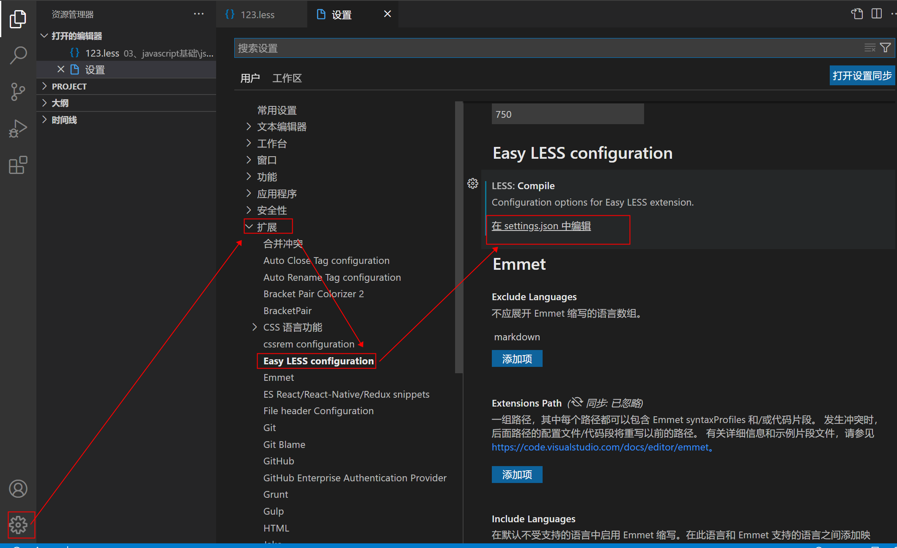

# Less/(sass/scss) -- css预处理器 （预编译）


css代码运行之前需要先编译一下。

**思考**：为什么需要编译？  编译后的格式是什么样的 ？

我们本来写出的文件跟 标准的css文件不同，无法直接运行，所以需要编译-----》得到 标准的css格式的文件。 

### 一、Less简介 

CSS（层叠样式表）是一门历史悠久的标记性语言，同 HTML 一道，被广泛应用于万维网（World Wide Web）中。HTML 主要负责文档结构的定义，CSS 负责文档表现形式或样式的定义。结构html，表现css，行为js

作为一门标记性语言，CSS 的语法相对简单，对使用者的要求较低，但同时也带来一些问题：CSS 需要书写大量看似没有逻辑的代码，**不方便维护及扩展，不利于复用**，尤其对于非前端开发工程师来讲，往往会因为缺少 CSS 编写经验而很难写出组织良好且易于维护的 CSS 代码，造成这些困难的很大原因源于 CSS 是一门非程序式语言，没有变量、函数、SCOPE（作用域）等概念。LESS 为 Web 开发者带来了福音，它在 CSS 的语法基础之上，为CSS赋予了动态语言的特性，如变量、继承、运算、函数等，更方便CSS的编写和维护。大大简化了 CSS 的编写，并且降低了 CSS 的维护成本。

css的预处理器：less (最多) /sass/stylues

优点：增强css代码的可维护性，可扩展性，可复用性。

### 二、Less的编译工具  

- vsCode 
  
  - easy less 
  
  - 客户端使用 Less 的原理是，先通过插件，将 Less 样式表编译成对应的 Css 样式表。然后在 html 文件中引用对应的 css 文件
  
    首先需要安装 Easy LESS 插件
  
    编辑 settings.json 文件，对 Easy Less 进行设置
  
    
  
    在 settings.json 的末尾添加如下语句
  
    ```json
    "less.compile": {
         "compress": false,  //是否压缩
         "sourceMap": true,  //是否生成map文件，有了这个可以在调试台看到less行数
         "out": "../css/", //自动编译成的css文件保存在哪个目录
         "outExt": ".css"    //输出文件的后缀，小程序可以写'wxss'
    }
    随便打开一个 less 文件，然后使用 Ctrl+S 保存，之后便会自动创建 settings.json 的 less.compile.out 参数指定的文件夹，然后在该文件夹中创建同名的，编译好的 css 文件。如设置 less.compile.sourceMap: true 的话，就会额外生成一个 map文件，用于调试
    ```
  
    在html文件中直接引用less编译成的.css文件 
- Koala编译  (考拉)  
  - 国人开发的LESS\SASS编译工具 
  - 下载地址：[http://koala-app.com/index-zh.html](https://link.jianshu.com?t=http://koala-app.com/index-zh.html)
- 文件后缀  .less ==编译===》.css

### 三、Less的语法

### **3.1 Less中的注释**

- 以//开头的注释，不会被编译到css文件中
- 以/**/包裹的注释会被编译到css文件中 


### **3.2 Less中的变量**和嵌套规则

Less中声明变量一定要用@开头，比如：@变量名:值

```
使用@来申明一个变量：@pink：pink;
1.作为普通属性值来使用：直接使用@pink
2.作为选择器和属性名：#@{selector的值}的形式
3.作为URL：@{url}
4.变量的延迟加载
```

less基于node    sass/scss 基于ruby

#### Less中的嵌套规则：

1.基本嵌套规则
2.&的使用

```less
//当作属性值使用
@w:100px;
@aaa:.box;
@h:height;
@c:color;
@url:'../images/';
@m:100px;
//当作选择器使用
.box{
    @m:50px;
    width: @w;
    @{h}: @m;
    border: 1px solid red;
    background-color: blue;
    //当作属性名使用
    @{c}:red;
    /* background-image:  url('@{url}5.gif'); */
    #son{
        @m:200px;
        width: @m;
        @m:300px;
        &:hover{
            background-color: yellow;
        }
    }
    &:hover{ 
        background-color: yellow;
    }
}
```


### **3.4 混合 - （Mixin）** 重点 

**混合就是将一系列属性从一个规则集引入到另一个规则集的方式** 

```less
混合就是将一系列属性从一个规则集引入到另一个规则集的方式
把一组样式混合到另外一组样式中。（类似于函数的调用）
1.普通混合
	会被编译到css文件中。
	.juzhong{
    border: 1px solid red;
    text-align: center;
    line-height: 100px;
    background-color: blue;
    width: 100px;
    height: 100px;
2.不带输出的混合（不会把公共的抽取出的规则集编译到css文件中）
	在混合的名字后边加上()就不会被编译到css文件中。
3.带参数的混合
	.juzhong(@w,@h,@co){
        border: 1px solid red;
        text-align: center;
        line-height: @h;
        background-color: @co;
        width: @w;
        height: @h;
	}
    .a1{
        .juzhong(100px,100px,red);
    }
    .a2{
        .juzhong(200px,200px,blue);
    }
        
4.带参数并且有默认值的混合
    如果传递参数就按照传递的参数使用，如果没有传递参数，就按照默认的值来使用。
    .juzhong(@w:50px,@h:50px,@co:yellow){
        border: 1px solid red;
        text-align: center;
        line-height: @h;
        background-color: @co;
        width: @w;
        height: @h;
	}
        
5.命名参数
    直接按照定义的变量的名字进行传递。
    .a2{
    	.juzhong(@co:green);//指定实参要传递给哪个形参
	}
   
 重点
6.匹配模式
        /* 匹配模式三角形 */
    .trigle(@_,@w,@co){
        position:absolute;
        width: 0;
        height: 0;
        border-style: dashed;
    }
    .trigle(B,@w,@co){
        border-width:@w ;
        border-color: @co transparent transparent transparent;
    }
    .trigle(L,@w,@co){
        border-width:@w ;
        border-color:  transparent @co transparent transparent;
    }

    .trigle(T,@w,@co){
        border-width:@w ;
        border-color:  transparent  transparent @co transparent;
    }
    .trigle(R,@w,@co){
        border-width:@w ;
        border-color:  transparent  transparent  transparent @co;
    }
    .span1{
        //.trigle();
        .trigle(L, 200px, red);
    }
        
7.导入（Importing）
	“导入”的工作方式和你预期的一样。你可以导入一个 .less 文件，此文件中的所有变量就可以全部使用了。如果导入的文件是 .less 扩展名，则可以将扩展名省略掉：

    @import "library"; // library.less
    @import "typo.css";

8.arguments变量 
    .border(@a,@b,@c){
        border:@arguments;//使用arguments来表示所有参数
    }
        
    span{
        .border(5px ,solid , green)
    }
```

### **3.5 运算**

在Less中，任何数组、颜色或者变量都可以参与运算，运算应该被包裹在括号中。例如：+ - * /

运算的符号的左右必须空出 空格

给宽度增加20px然后在乘以5个像素，Less：

```less
@test_01:300px;

.box_02{
 width: (@test_01 + 20) * 5;
}
```

### 3.5 less使用if

```css
 //if(表达式,满足时的变量,不满足时的变量)
    background-color: if((2 < 1), blue, green);
```


### 3.6 避免 less 编译

可以把less中定义的代码原封不动的放在css文件中。

###### **避免编译**

- 有时候我们不需要输出一些不正确的CSS语法或使用一些Less不认识的专有语法。
- 要输出这样的值，我们可以在字符串前加一个~，例如：width:~'clac(100% - 35)'
- 在 Less 3.5+ 版本中，许多以前需要“引号转义”的情况就不再需要了。

Less：

```less
.test_03 {
    width: calc(200px - 30px);
}
```

这样的话，编译后的CSS就自动帮你计算了

CSS：

```css
.test_03 {
    width: calc(170px);
}
```

但我们并不想它在编译时被计算，而是想让浏览器去计算，这时候我们就需要添加~符号了：

```
.test_03{
     width: ~'calc(200px - 30px)';
}
```

这样，就可以避免编译，输出的CSS就是这样（原样输出）

```less
.test_03 {
      width: calc(200px - 30px);
}
```

## 四、总结与作业 

什么是less  

作用：优点：

怎么用?

​	1 @

 2. 注释

 3. 变量

 4. 嵌套规则

    & 代表当前元素

	5. 混合

    普通混合    带参混合   默认值的混合   匹配模式    导入  @import 'less文件'   计算   避免less编译;   

