# 第一章：移动端基础 

## 课程目标 

- 了解移动端产品分类及现状
- 调试移动端项目
- 会搭建移动端的页面
- **能够搭建兼容各种移动端的页面**   

## 本章目标  

- 了解移动端产品分类及现状 

- 了解像素，分辨率，屏幕等相关的知识点

- 会调试移动端项目

- 会使用viewport视口标签定义理想视口 

- 会使用em布局网页

- 会使用rem布局网页

  px (pc端)  rpx(小程序)  rem  vw  vh (移动端)

## 一、移动端简介 

### 1.1 什么是移动Web  

**运行在移动设备上的产品**  配平台：安卓    IOS    

cpu芯片：联发科，高通骁龙，麒麟，A系列   

移动设备包括：手机，平板，广告牌，商场展示栏等手持触摸设备

手机：

### 1.2 移动端产品分类  

- app（手机应用）
  现在流行的app大部分都是原生app开发者开发
  	安卓开发工程师
  	IOS开发工程师
  使用JavaScript来开发原生的app
  	phone Gap、React native、...
- H5 （webapp）
  就是HTML页面，基本都是运行在浏览器中
      PC浏览器：chrome、safari、火狐....
      移动端浏览器：后续专门介绍

### 1.3 app的页面与H5的页面的优劣

- app
  - 优势
    功能完善、体验好、可以离线使用
  - 劣势	
    开发成本高、迭代不可控、内容限制
- H5 
  - 优势
    跨平台、开发成本低、更容易迭代  
  - 劣势	
    功能有限、操作体验欠佳、无法离线使用

### 1.4 H5运行环境的分类 

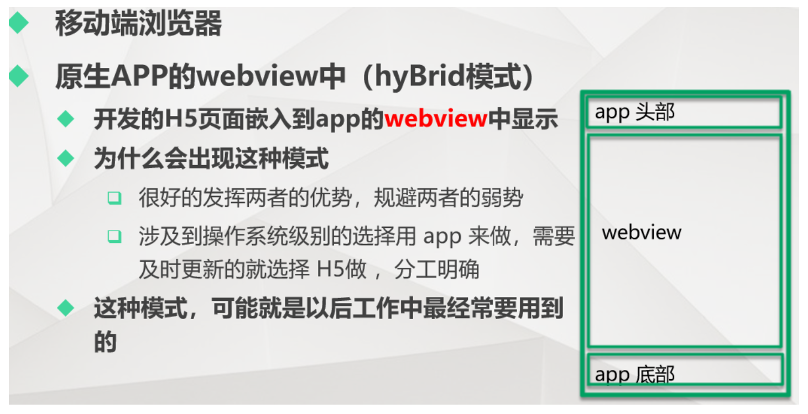

p站pc端网页  m站手机端

#### 移动端页面与PC端页面的区别：

- 终端设备不同

- 输入特性：

  - PC：键盘输入
  - 移动端：软键盘，语音

- 分辨率

  - PC:分辨率差别不大，一般都需要**版心** 
  - 移动端：设备分辨率层出不穷，需要做兼容处理

- 浏览器

  差别不大都是使用同样的内核，谷歌，IE

  -webkit-   -moz-  -ms-   -o-

- 开发调试

- 视口

- 布局

  PC端使用的布局方式，移动端同样适用，浮动，定位等(弹性布局)

### 1.5 移动端页面相关介绍

#### 1.5.1 移动端开发调试

谷歌模拟器：

使用Chrome浏览器作为移动开发测试浏览器的原因
很多的手机浏览器都用Webkit作为渲染引擎
学习成本
Chrome浏览器移动测试  上线   下线

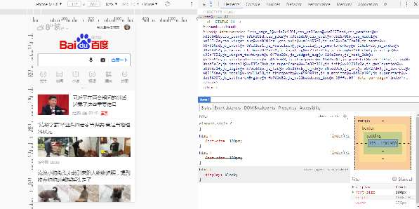

- 常用面板

  - Device：可以选择要测试的设备及型号

  - Resolution：设备像素

  - 屏幕显示比例，可以自行选择

  - Device pixel ratio：设备像素比

  - 模拟网速情况

  - 手持设备的横屏竖屏

  - 可以点开这里进行查看隐藏的选项

    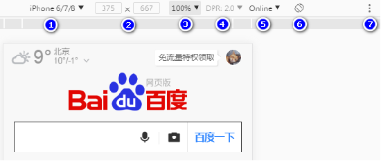

### 

#### 1.5.2 屏幕相关基础知识  

参考博客1：https://blog.csdn.net/u014465934/article/details/97040694?spm=1001.2101.3001.6650.6&utm_medium=distribute.pc_relevant.none-task-blog-2%7Edefault%7EBlogCommendFromBaidu%7Edefault-6.no_search_link&depth_1-utm_source=distribute.pc_relevant.none-task-blog-2%7Edefault%7EBlogCommendFromBaidu%7Edefault-6.no_search_link

参考博客2：https://blog.csdn.net/qq_33834489/article/details/79247119 

- PPI  

  每英寸像素(物理像素)取值，更确切的说法应该是**像素密度**，也就是衡量单位物理面积内拥有像素值的情况。
  高PPI屏幕显示的元素会比较精细（看起来会比较小），低PPI屏幕显示的元素相对来说就比较粗糙（看起来会比较大）

  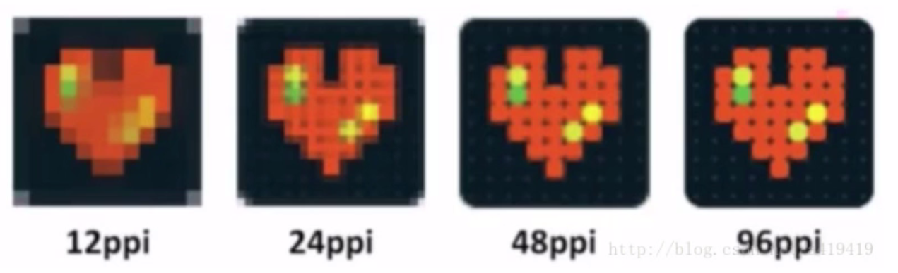

- 屏幕尺寸：指的是屏幕对角线的长度一般使用英寸来度量

  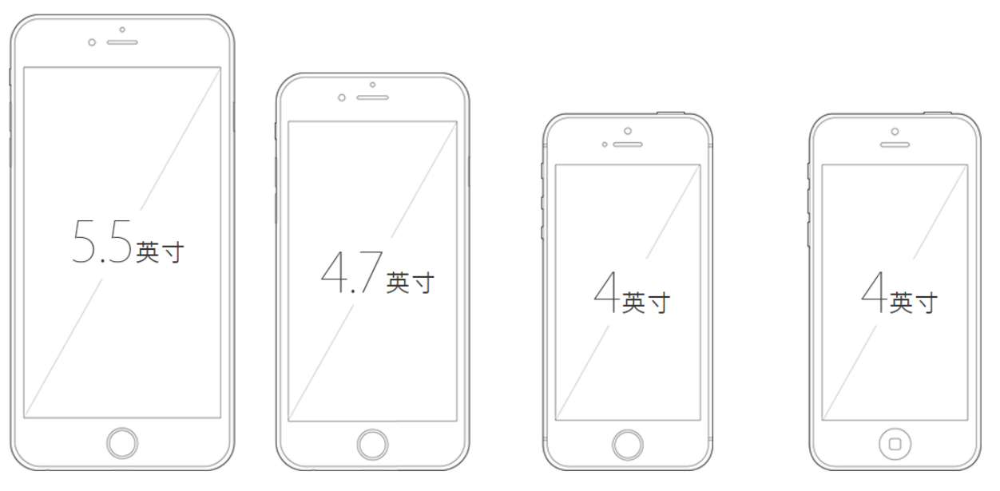

- 像素分类/分辨率

  设备像素（物理像素），顾名思义，显示屏是由一个个物理像素点组成的，通过控制每个像素点的颜色，使屏幕显示出不同的图像，屏幕从工厂出来那天起，它上面的物理像素点就固定不变了，单位pt。
  CSS像素(CSS pixels): 又称逻辑像素，是为web开发者创造，在CSS和JavaScript中使用的一个抽象的层

  DIP(Device independent Pixel)  CSS像素 =设备独立像素 = 逻辑像素

- DPR :

  获得**设备像素比** （dpr）后，便可得知设备像素与CSS像素之间的比例。当这个比率为1:1时，使用1个设备像素显示1个CSS像素。当这个比率为2:1时，使用4个设备像素显示1个CSS像素，当这个比率为3:1时，使用9（3*3）个设备像素显示1个CSS像素。
  所以，有如下公式：

  > DPR = 设备像素/CSS像素
  >
  > iphone8的css像素  375*667
  >
  > 设备像素750*1334

- 屏幕缩放 
  - PC端 
    css的1个像素往往都是对应电脑屏幕的1个物理像素 
    下图为4个CSS像素完全覆盖了4个设备像素 

    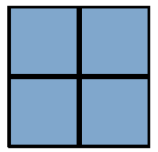

  - 移动端
    由于屏幕尺寸的限制，缩放是经常性的操作
    设备像素(深蓝色背景)、CSS像素(半透明背景) 
    左图表示缩小操作时，1个设备像素覆盖了多个CSS像素，右图表示放大操作时，1个CSS像素覆盖了多个设备像素

    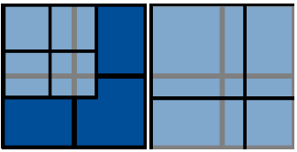

  

  

- Retina (视网膜)屏幕  

   这是一种显示技术，可以将把更多的像素点压缩至一块屏幕里，从而达到更高的分辨率并提高屏幕显示的细腻程度，这种分辨率在正常观看距离下足以使人肉眼无法分辨其中的单独像素。

   最先使用`retina`屏幕是iphone 4，屏幕分辨率为960 * 640（326ppi）。

- 内核  

   Gecko内核,css前缀为"-moz-",代表 firefox 
   WebKit内核,css前缀为"-webkit-"，代表 chrome、苹果、微信等
   Presto内核,css前缀为"-o-",代表Opera(欧朋) 
   Trident内核,css前缀为"-ms-",代表IE

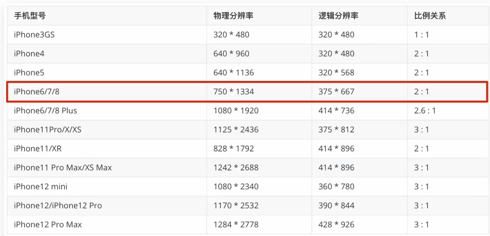

- 二倍图。

  设计师给提供的图片不能基于 逻辑分辨率，应该基于物理分辨率。

  目的：让页面显示更清晰。

### 1.6 视口 

​		**视口(Viewport)**是移动Web开发中一个非常重要的概念，最早是由苹果公司在推出iPhone手机时发明的，**其目的是为了让iPhone的小屏幕尽可能完整显示整个网页**。通过设置视口，不管网页原始的分辨率尺寸有多大，都能将其缩小显示在手机浏览器上，这样保证网页在手机上看起来更像在桌面浏览器中的样子。在苹果公司引入视口的概念后，大多数的移动开发者也都认同了这个做法。

​		视口简单来说就是浏览器显示页面内容的屏幕区域。在移动端浏览器中，存在着3种视口，分别是布局视口(layout viewport)、视觉视口(visual viewport)和理想视口(ideal viewport)。

#### 布局视口

​		布局视口是指网页的宽度，一般移动端浏览器都默认设置了布局视口的宽度。根据设备的不同，布局视口的默认宽度有可能是768px、980px或1024px等，这个宽度并不适合在手机屏幕中展示。移动端浏览器之所以采用这样的默认设置，是为了解决早期的PC端页面在手机上显示的问题。

​		试想相同的内容，当窗口变窄，只能尽可能缩小网站来让用户看到网站的全貌。这对易读性来说不是件好事。为了解决这个问题，在移动端出现初期，为了在移动端可以查看PC端页面，就提出了布局视口的概念，具体含义是，在手机上，视口与 移动浏览器屏幕宽度 不相关联，而是完全独立的，我们称它为布局视口

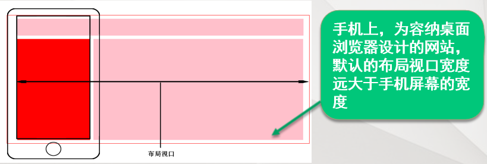

当移动端浏览器展示PC端网页内容时，由于移动端设备屏幕比较小，不能像PC端浏览器那样完美地展示网页，这正是布局视口存在的问题。这样的网页在手机的浏览器中会出现左右滚动条，用户需要左右滑动才能查看完整的一行内容。

#### 视觉视口	

​		字面意思，它是用户正在看到的网站的区域。注意：是网站的区域。虽然布局视口很大程度上帮助了桌面网站到手机的转移，但我们还是不能完全无视移动端设备的屏幕尺寸
​		视觉视口是用户正在看的网站区域,这个区域的宽度等同于移动设备的浏览器窗口的宽度。用户可以通过缩放来操作视觉视口，同时不会影响布局视口，布局视口仍然保持原来的宽度


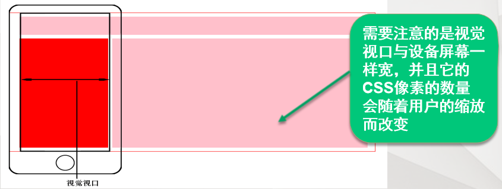

#### 理想视口

​		默认情况下，一个手机或平板浏览器的布局宽度是在980px或1024px。虽然这能让桌面网站不被压扁，但是这并不理想，尤其对手机用户，因为在狭窄的屏幕上更适合一个狭窄的网站

真正适合手机的视口是什么呢？
		理想视口:理想视口是指对设备来讲最理想的视口尺寸。采用理想视口的方式，可以使网页在移动端浏览器上获得最理想的浏览和阅读的宽度。

​		**在理想视口情况下，布局视口的大小和屏幕宽度是一致的，**这样就不需要左右滚动页面了。在开发中，为了实现理想视口，需要给移动端页面**添加meta标签配置视口**，通知浏览器来进行处理


```css
<meta name="viewport" content="width=device-width, user-scalable=no, initial-scale=1.0, maximum-scale=1.0, minimum-scale=1.0"/>;
```

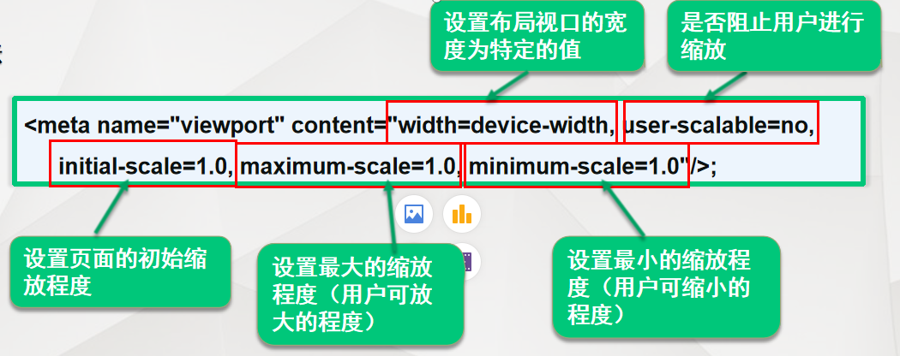

```js
//桌面浏览器不支持它，也不需要它，因为它们没有理想视口的概念。meta视口标签应该被放在文档的head标签中
//width：主要目的是把布局视口的尺寸设为一个理想的值。那个这个特定的值可以设置为一个具体的像素值。不过默认值为“device-width”，即让布局视口的宽度等于设备的宽度。这样可以灵活的变通，而不用考虑设备的尺寸变化。
//initial-scale：设置了页面的初始缩放程度。1代表100%，2表示200%，以此类推。
//minimum-scale和maximum-scale：设置缩放程度的最小值和最大值。容易出现的问题是修改了initial-scale的值，发现没有任何效果，原因是没修改maximum-scale的默认值。如果最大缩放程度为1，无论把initial-scale改为几都没用。
//user-scalable:是否允许用户通过手指缩放页面
//viewport-fit 设置为cover值可以解决刘海屏的留白问题
```

**viewport-fit** 
 设置为 cover 可以解决『刘海屏』的留白问题 

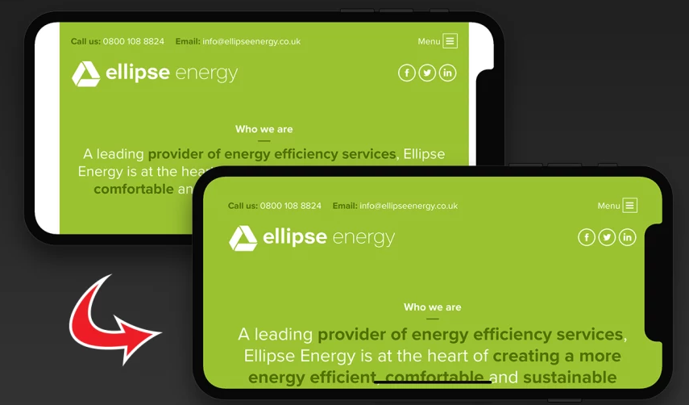

```
配置vscode生成代码的模板
{
	"html": {
		"prefix": "html",
		"body": [
			"<!DOCTYPE html>",
			"<html>",
			"<head>",
			"\t<meta charset=\"UTF-8\">",
			"\t<meta name=\"viewport\" content=\"width=device-width, initial-scale=1.0,maximum=1.0,minimum-scale=1.0,user-scalable=0\">",
			"\t<meta http-equiv=\"X-UA-Compatible\" content=\"ie=edge\">",
			"\t<title>Document</title>",
			"\t<link rel=\"stylesheet\" href=\"$1\">",
			"\t<script src=\"$2\"></script>",
			"</head>",
			"<body>\n$3",
			"</body>",
			"</html> "
		],
		"description": "The full sample code - htm15."
	}
}
```


## 二、移动开发选择和技术解决方案

### 2.1 移动端主流方案 

1. 单独制作移动端页面（主流）

   通常情况下，网址域名前面加 m(mobile)
   可以打开移动端。通过判断设备，如果是移动设备打开，则跳到移动端页面。  

```js
var sUserAgent = navigator.userAgent.toLowerCase();

var bIsIpad = sUserAgent.match(/ipad/i) == "ipad";
var bIsIphoneOs = sUserAgent.match(/iphone os/i) == "iphone os";
移动信息设备
var bIsMidp = sUserAgent.match(/midp/i) == "midp";
var bIsUc7 = sUserAgent.match(/rv:1.2.3.4/i) == "rv:1.2.3.4";
uc浏览器
var bIsUc = sUserAgent.match(/ucweb/i) == "ucweb";
var bIsAndroid = sUserAgent.match(/android/i) == "android";
嵌入式电子设备
var bIsCE = sUserAgent.match(/windows ce/i) == "windows ce";
是微软针对移动设备而开发的操作系统
var bIsWM = sUserAgent.match(/windows mobile/i) == "windows mobile";

if (bIsIpad || bIsIphoneOs || bIsMidp || bIsUc7 || bIsUc || bIsAndroid || bIsCE || bIsWM) {
    // 移动端浏览器 
    document.write("phone");
    //移动端浏览器
    window.location.href = "https://m.jd.com/";
    // if (curURL.indexOf("jd.com") != -1) {
    //     window.location.href = "https://m.jd.com/";
    // }
} else {
    // PC端浏览器
    document.write("pc");
    //  if (curURL.indexOf("jd.com") != -1) {
        // window.location.href = "https://www.jd.com/";
    //   }
    }
```

也就是说，PC端和移动端为两套网站，pc端是pc端的样式，移动端在写一套，专门针对移动端适配的一套网站

```
京东pc    https://www.jd.com/
京东m站   https://m.jd.com/
```

2. 响应式页面兼容移动端（其次）

   响应式网站：即pc和移动端共用一套网站，只不过在不同屏幕下，样式会自动适配

### 2.2 移动端技术解决方案

- #### 移动端浏览器兼容问题

  移动端浏览器基本以 webkit 内核为主，因此我们就考虑webkit兼容性问题。我们可以放心使用 H5 标签和 CSS3 样式。同时我们浏览器的私有前缀我们只需要考虑添加 webkit 即可


## 三、相对单位em和rem 

### 3.1 相对单位em的特性

em是一个相对长度单位，它的值并不是固定的                                                                                                                                                                                                                                      em是描述相对于当前对象内文本的字体尺寸，它是相对长度单位。
em会继承父级元素的字体大小（相对父级的字体大小而发生变化）

div嵌套盒子演示相对单位em

### 3.2 相对单位rem的特性

rem是CSS3新增的一个相对单位（root em，根em）
rem与em的区别在于使用rem为元素设定字体大小时，仍然是相对大小，但相对的只是HTML根元素                                                                                               rem的值并不是固定的
rem是相对根节点html发生变化的（和父节点无关）
实际开发中一般默认的把html根节点设置为10px（62.5%）或者是100px，方便后续计算

相对单位rem是集相对大小和绝对大小的优点于一身通过它既可以做到只修改根元素字体大小就成比例地调整所有字体大小，又可以避免字体大小逐层复合的连锁反应

### 3.3 em、rem使用场景  

- **em**

  通常不使用 em 单位控制字体大小
  首行缩进: text-indent:2em;

- **rem**

  响应式网站可以使用rem去做适配

练习：

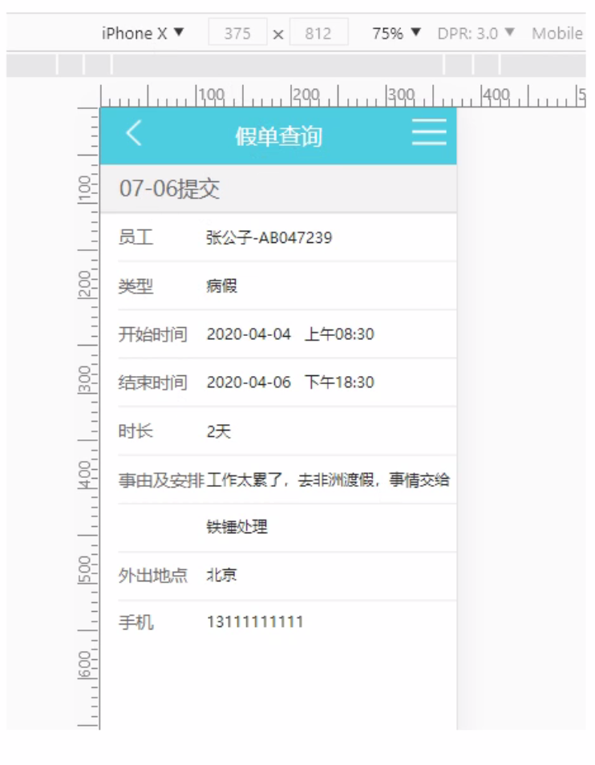

使用js设置字体大小：实时改变

```
function setRem(){
	var ui_w = 375;
	var client_width = document.documentElement.clientWidth || document.body.clientwidth;
	//通过js动态改变根节点字体大小
	var htmlEle = document.getElementsByTagName('html')[0];
	htmlEle.style.fontSize = (client_width/ui_w)*100+'px';
}
//通过onresize事件触发 setRem函数
window.onresize = setRem;
```


## 四、总结与作业

作业素材

