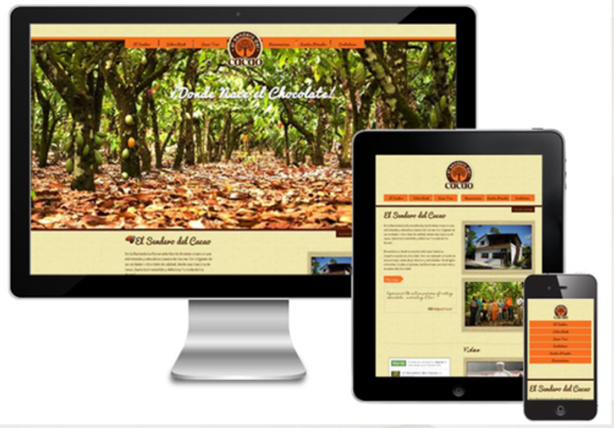

# 第二章：自适应&响应式布局

## 回顾

移动端基础知识

375 X 667     =====    750 X  1334  

## 本章目标 

- 了解什么是自适应
- 会使用swiper插件
- 了解什么是响应式
- 了解流式布局(百分比布局) 
- 掌握自适应方式布局
- 掌握响应式方式布局
- 掌握媒体查询

## 一、自适应布局 

##### 自适应体验 

http://m.ctrip.com/html5/

### 1.1 什么是自适应 

为了解决在不同大小的设备上呈现相同的网页

##### 如何实现

自适应主要是指的宽度的自适应
百分比的流式布局

### 案例：使用自适应布局网页  


### 1.2 swiper插件（参阅手册）

## 二、响应式网页设计 

### 2.1 什么是响应式网页设计 

响应式布局是Ethan Marcotte [伊桑马卡特]在2010年5月份提出的一个概念，简而言之，就是一个网站能够兼容多个终端――而不是为每个终端做─个特定的版本。这个概念是为解决移动互联网浏览而诞生的。

大白话:
—个网站能够兼容多个终端
是同一页面在不同屏幕尺寸下有不同的布局，一套页面，可以在不同的设备上正常显示
当页面足够小的时候，会隐藏掉一部分内容，重点显示主要的内容

响应式网页设计，将三种已有的开发技术整合起来，并命名：
弹性布局 
弹性图片
媒体和媒体查询

体验：https://dribbble.com/  



### 2.2 css 媒体查询 

媒介 

#### 什么是媒体查询？

​		媒体:指的就是各种设备(移动设备,PC设备)

​		查询:指的是要检测属于哪种设备

媒体查询:通过查询当前属于哪种设备,让网页能够在不同的设备下正常的预览。根据设备展示不同的css样式

- 媒体查询(Media Queries)
  媒体类型:all  screen  print   tv   .....
  媒体特征:当前设备 的 要满足的条件 
  关键词：and  or  not  only  

- 兼容性 
  移动终端上一般对css3支持比较好的高级浏览器不需要考虑响应式布局的媒体查询的兼容问题
  IE8及以下版本浏览器不支持媒体查询 

  

- #### 媒体类型的引入方式


```css
<style>
/*内部样式表中使用媒体查询*/
@media 媒体类型 {
    选择器{ /*样式代码写在这里…*/}
}
@media all and (min-width:1024px)
{
    .box{
        width: 1024px;
        padding: 30px;
        margin: 10px auto 0;
        border:1px solid red;
        background: red;
    }
    h2{
        font-size: 28px;
    }
}
</style>
```

```css
<link  rel="stylesheet"  href="style.css"  media="媒体类型" />
<link rel="stylesheet" type="text/css" media="screen and (max-width: 480px)" href="style-1.css" />
<link rel="stylesheet" type="text/css" media="screen and (min-width: 480px) and (max-width: 760px)" href="style-2.css" />
```

### 

- #### 媒体类型
  - 常遇到的媒体类型是
    - All（全部）
    - Screen（屏幕）最常用的
    - Print（页面打印或打印预览模式）

实际上媒体类型不止这三种，W3C共列出10多种媒体类型

| **值**         | **设备类型**                                             |
| -------------- | -------------------------------------------------------- |
| **All**        | **所有设备**                                             |
| **Braille**    | **盲人用点字法触觉回馈设备**                             |
| **Embossed**   | **盲人打印机**                                           |
| **Handheld**   | **便携设备**                                             |
| **Print**      | **打印用纸或打印预览视图**                               |
| **Projection** | **各种****投影设备**                                     |
| **Screen**     | **电脑****显示器**                                       |
| **Speech**     | **语音****或音频合成器**                                 |
| **Tv**         | **电视机****类型设备**                                   |
| **Tty**        | **使用****固定密度字母栅格的媒介，比如电传打字机和终端** |

- #### 媒体特征

是CSS3对媒体类型的增强版
可以将媒体特性看成
“媒体类型（判断条件）+ CSS（符合条件的样式规则）”

| **属 性**         | **值**                             | **Min/Max** | **描 述**              |
| ----------------- | ---------------------------------- | ----------- | ---------------------- |
| **device-width**  | **Length**                         | **Yes**     | **设置屏幕的输出宽度** |
| **device-height** | **Length**                         | **Yes**     | **设置屏幕的输出高度** |
| **width**         | **Length**                         | **Yes**     | **渲染界面的宽度**     |
| **height**        | **Length**                         | **Yes**     | **渲染界面的高度**     |
| **Orientation**   | **Portrait/landscape**             | **No**      | **横屏或竖屏**         |
| **Resolution**    | **分辨率（****dpi/****dpcm****）** | **Yes**     | **分辨率**             |
| **Color**         | **整数**                           | **Yes**     | **每种色彩的字节数**   |
| **color-index**   | **整数**                           | **Yes**     | **色彩表中的色彩数**   |

#### 关键词

注意关键字左右添加空格

and：and操作符用来把多个媒体属性组合起来，合并到同一条媒体查询中。只有当每个属性都为真时，这条查询的结果才为真

[注意]在不使用not或only操作符的情况下，媒体类型是可选的，默认为all

```css
@media screen and (max-width:1200px){样式代码…}  
```

or:将多个媒体查询以逗号分隔放在一起；只要其中任何一个为真，整个媒体语句就返回真，相当于or操作符

```css
@media (max-width:600px) , (min-width:900px) {
				body{
					background-color: red;
				}
			}
```

only：指定某种特定的媒体类型，可以用来排除不支持媒体查询的浏览器

```css
仅仅在满足屏幕宽度小于500px像素时执行样式
<link   href = "style.css"  media = " only screen and  (max-width:500px) "  />
```

not：not操作符用来对一条媒体查询的结果进行取反

```css
<link   href = "style.css"  media = " not screen and  (max-width:500px) "  />
```

**通过媒体查询，解决屏幕获取不到高清图片思路:** 

​		通过媒体查询dpr的值，不同的值显示不同质量的图片在开发中，我们会根据dpr的值显示1倍图，2倍图，3倍图等此处为了演示，	我们只让显示不同的图片，来代替123倍图

```
@media screen and (-webkit-min-device-pixel-ratio: 1){
	div{
		background: ur1(./image/1.jpg);
	}
}
@media screen and (-webkit-min-device-pixel-ratio: 2){
	div{
		background: ur1(./image/2.jpg);
	}
}
@media screen and (-webkit-min-device-pixel-ratio: 3){
	div{
		background: ur1(./image/3.jpg);
	}
}
```

媒体查询:通过查询当前属于哪种设备,让网页能够在不同的设备下正常的预览。根据设备展示不同的css样式

### 2.3 响应式热门活动案例-展示案例

- 屏幕分辨率大于1024px 展示效果：


- 屏幕分辨率在638px--->1024px之间展示效果

  

- 屏幕分辨率在320px到637px之间展示效果

  

### 2.4 响应式布局优缺点

- 优点
  - 不同分辨率设备灵活性强
  - 多终端视觉和操作体验好
  - 响应式web设计中的大部分技术都可以用在WebApp开发中
  
- 缺点
  - 兼容各种设备工作量大，效率低下,维护成本也加重很多
  - 代码累赘，会出现隐藏无用的元素，加载时间加长


### 2.5 响应式与自适应的区别

响应式的概念覆盖了自适应，但是包括的东西更多。响应式布局可以根据屏幕的大小自动的调整页面的展现方式，以及布局
自适应还是暴露出一个问题，如果屏幕太小，即使网页能够根据屏幕大小进行适配，也会感觉在小屏幕上查看，内容过于拥挤
响应式解决了自适应布局的问题。它可以自动识别屏幕宽度、并做出相应调整，布局和展示的内容可能会有所变动

### 2.6 基于rem的响应式布局

如果移动端页面只在移动端访问，那么使用rem可以实现响应式布局

实现原理：动态改变 html的font-size值的大小，来完成rem实现响应式布局

#### rem实现响应式原理

rem 的值都是根据html的fontsize进行计算的
统一缩放元素大小，只要修改html的fontsize

```css
html  {   font-size: 100px;
		/* 将图片的大小变成 75*75 */
		/* font-size: 50px; */}
main {
		 width: 1.5rem; height: 1.5rem;background-color: #f38;
		 }
/*省略其他的CSS样式*/
```

#### 使用rem开发响应式布局步骤2-1

- 从Ui设计师拿到设计稿，一般尺寸都是以iphone 6的尺寸为准 750 * 1334（638*1136）
- 在样式中给html设定一个fontsize的值，我们一般设置一个方便后续计算的值，例如10px、100px等，我们使用100px
- 写样式
  - 完全按照设计稿的尺寸来写样式，设计稿上的长度、height、margin、padding、字体的值是多少，我们就写多少，这样可以100%还原设计稿
  - 注意：需要把得到的像素值/100px,转换为rem单位

#### 使用rem开发响应式布局步骤2-2

- 根据当前屏幕的宽度和设计稿的宽度来重新计算html的FontSize的大小

- 根据当前屏幕宽度和设计稿的宽度的比例，动态计算当前宽度下的fontsize值大小，如果fontsize值改变了，之前设定的所有的rem单位的值自动会跟着改变

- ```js
  var uiW =750,
      // 视口宽度
      winW = document.documentElement.clientWidth，
  // 比率
  var rate = winW / uiW;
  // 设置字体大小
  document.documentElement.style.fontSize = rate *100 + "px";
  
  ```

### 2.7 使用flexible.js+rem进行移动适配（自适应）

这是一个简洁高效的rem适配方案 flexible.js，这个东西是手机淘宝团队出的 (一听淘宝出得,就感觉牛逼)
我们原来适配需要用媒体查询，烦死了，现在好了，不用了 我直接把flexible.js引进来就省得做了

那这玩意是啥原理啊
	他的原理是 把设备分为10等份，你肯定想说，那我设备不一样，分成10份也不一样啊，没事 只要他的比例一样就可以
这10等份的比例 是一致的，我们要做的就是把我们设备的 html的font-size 设置好就行了

比如说 我们的设计稿是 750px(一般来说设计师以苹果6宽度作为标准尺寸) 那我们只需要把 html的 font-size 设置为 75px (750/10) 就可以了
所以在苹果 6 7 8 设计稿为750像素里 1rem=75px
里面元素rem值= 元素的px值/75
剩下的就交给flexible.js

安装vscode插件  **cssrem**  帮助计算rem的值。

### 2.8 使用vw , vh单位做布局 

1vw    ====  把视口宽度分成100份    1%   375   1vw = 3.75     428   1vw = 4.28

1vh     ====  把视口高度分成100份    1%


现在rem的适配性比 vw和vh高。因为现在做布局还要考虑一些老版本的浏览器。

新技术一般都是大厂先行。

百分比跟vw和vh的区别：

​		百分比都是相对于父级元素来说。

​		vw和vh这是公共单位 都是相对于视口的宽高来说的。


面试题：移动适配的方案。

### 三、总结与作业 

作业素材

