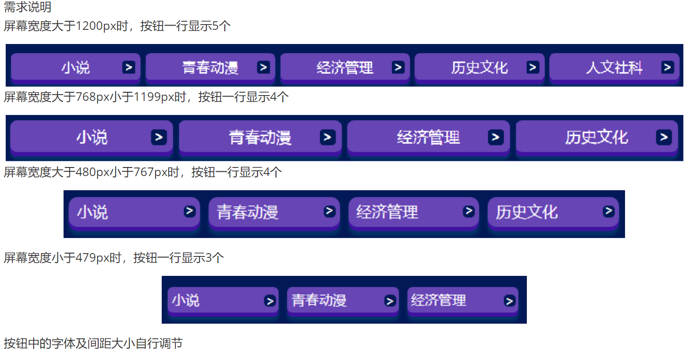

# 第三章：Flex弹性布局

## 课前测试  



## 回顾 

自适应和响应式：

​		核心：让网页能够自动的适配所有的终端。

​		原理：html的font-size 根字号  

​				① 可以通过 js代码 实时控制font-size字体大小  

​				② flexible.js + rem + cssrem 

​				③ vw  vh  

响应式：媒体查询

### 本章目标 

- 会使用flex（弹性布局）实现页面布局
- 会使用容器属性
- 会使用项目属性
- 能解决flex布局中遇到的问题

### 为什么出现Flex弹性盒布局？

- 布局的传统解决方案，基于盒子模型，依赖 display 属性 + position属性 + float属性。它对于有些特殊布局非常不方便，比如，水平垂直居中就不容易实现（现有技术满足不了开发需求）

### flex发展历史

https://caniuse.com/  检测技术支持的标准

float:环绕效果

2009年W3C 提出概念，但是官方没有flex这个词
2011年浏览器厂商决定使用flexbox，来形容它的布局特点
2015年W3C正式将其修改为flexbox布局  
2016年5月官方正式公布最新的稳定的flex布局规范标准，各大浏览器的支持越来越稳定

### 定义

-  Flex是 Flexible Box 的缩写，意为"弹性布局"，用来为盒状模型提供最大的灵活性
-  作用
   - 它能够更加高效方便的控制元素的对齐、排列
   - 可以自动计算布局内元素的尺寸，无论这个元素的尺寸是固定的还是动态的
   - 控制元素在页面的布局方向
   - 按照不同于DOM所指定排序方式对屏幕上的元素重新排序

### 应用场景

使用在现代浏览器中
有一定宽容度要求的设计中

### Flex基本概念

- 采用Flex布局的元素，称为**Flex容器**（flex container），简称”容器”。它的所有子元素自动成为容器成员，称为Flex项目（flex item），简称”项目/弹性盒子” 
- 默认水平方向为主轴（main axis）
- 默认垂直方向为交叉轴/侧轴（cross axis） 
- 项目默认沿主轴排列
- 

###  Flex布局语法

- 语法
  - 块级元素  display : flex;    /     display:-webkit-flex
  - 行内元素 display : inline-flex;  
- 添加前缀 
- **设为 Flex 布局以后，flex item(项目)的float、clear和vertical-align属性将失效**

### 容器上的属性 

| **容器属性**    | **说明**                                                     |
| --------------- | ------------------------------------------------------------ |
| flex-direction  | 决定主轴的方向（即项目的排列方向）                           |
| flex-wrap       | 定义如果在一条轴线排不下，如何换行                           |
| flex-flow       | 复合属性：是flex-direction和flex-wrap属性的简写形式          |
| justify-content | 定义项目在主轴上的对齐方式                                   |
| align-items     | 定义项目在交叉轴上如何对齐                                   |
| align-content   | 定义多根轴线的对齐方式。如果项目只有一根轴线，该属性不起作用 |

#### flex-direction：

```css
决定主轴的方向（即项目的排列方向）
flex-direction: row | row-reverse | column | column-reverse;
属性值含义： 
row（默认）、row-reverse：主轴为水平方向，起点在左端、右端
column 、column-reverse：主轴为垂直方向，起点在上沿、下沿
```

#### flex-wrap: 

```css
默认情况下，项目都排在一条线（又称"轴线"）上。flex-wrap属性定义了如果一条轴线排不下，如何换行
flex-wrap: nowrap | wrap | wrap-reverse;
属性值含义
nowrap（默认）：不换行
	如果父容器的宽度不够  会自动压缩 内部的每一个项目的宽度
wrap：换行，第一行在上方
wrap-reverse：换行，第一行在下方
```

#### flex-flow:

```css
是复合属性：是flex-direction和flex-wrap的简写形式，默认值为row nowrap
flex-flow: <flex-direction> || <flex-wrap>;
flex-flow: column wrap;
属性值：取两个属性的值即可
```

#### justify-content:

```css
定义了项目在主轴上的对齐方式
justify-content: flex-start | flex-end | center | space-between | space-around | space-evenly;
属性值含义
flex-start（默认值）：左对齐 
flex-end：右对齐
center： 居中
space-between：两端对齐，项目之间的间隔都相等
space-around：每个项目两侧的间隔相等。所以，项目之间的间隔比项目与边框的间隔大一倍
space-evenly:间距相等（均分）
```


#### align-items:

```css
定义项目在交叉轴上对齐方式
align-items: flex-start | flex-end | center | baseline | stretch;
属性值：具体的对齐方式与交叉轴的方向有关，下面假设交叉轴从上到下
flex-start：交叉轴的起点对齐
flex-end：交叉轴的终点对齐
center：交叉轴的中点对齐
stretch（默认值）：如果项目未设置高度或设为auto，将占满整个容器的高度
```


#### align-content:

```css
定义了多根轴线时项目在交叉轴的对齐方式
align-content: stretch |flex-start | flex-end | center | space-between | space-around ;
注意：容器内必须有多行的项目，该属性才能渲染出效果。
```

| **属性值**        | **说明**                                                     |
| ----------------- | ------------------------------------------------------------ |
| flex-start        | 与交叉轴的起点对齐                                           |
| flex-end          | 与交叉轴的终点对齐                                           |
| center            | 与交叉轴的中点对齐                                           |
| space-between     | 与交叉轴两端对齐，轴线之间的间隔平均分布                     |
| space-around      | 每根轴线两侧的间隔都相等。所以，轴线之间的间隔比轴线与边框的间隔大一倍 |
| stretch（默认值） | 轴线占满整个交叉轴                                           |

```js
//利用justify-content、align-items两个属性可以比较简单的解决传统布局中垂直居中对齐的难题
```


### 项目上的属性

| **容器属性** | **说明**                                                    |
| ------------ | ----------------------------------------------------------- |
| order        | 定义项目的排列顺序，数值越小排列越靠前，默认为0             |
| flex-grow    | 定义项目的放大比例，默认为0，即如果存在剩余空间，也不放大   |
| flex-shrink  | 定义了项目的缩小比例，默认为1，即如果空间不足，该项目将缩小 |
| flex-basis   | 定义在分配多余空间之前，项目占据的主轴空间                  |
| flex         | 是复合属性，代表flex-grow, flex-shrink 和 flex-basis的简写  |
| align-self   | 定义交叉轴上的对齐方式                                      |

#### order:

```css
定义项目的排列顺序。数值越小，排列越靠前，默认为0
order: <integer>;
属性值
必须为 0 或者 非负整数
负数的话不起作用，会排列在首位，设置了order属性，会按照order属性的值大小排列
```

#### flex-grow:

```css
定义项目的放大比例。  默认为0，即如果存在剩余空间，也不放大。
主要作用是：分配剩余空间的
flex-grow: <number>;
属性值
不能为负数，虽然可以设置为正小数值，一般不这么用
一个元素不设置或者flex-grow设置为0，默认是元素的宽度；
如果给一个或多个元素设置了非负的flex-grow值，父元素剩余的宽度（如果有）重新分配宽度，flex-grow的值代表分配到的宽度比例。
```

#### flex-shrink:

```css
flex-shrink 属性指定了 flex 元素的收缩规则。flex 元素仅在默认宽度之和大于容器的时候才会发生收缩，其收缩的大小是依据 flex-shrink 的值。

注意：如果元素不是弹性盒对象的元素，则 flex-shrink 属性不起作用。
默认为1，即如果空间不足，该项目将缩小。
主要作用是做缩小空间用的  
0 没有空间也不缩小
flex-shrink: <number>;
属性值
负值对该属性无效
```

#### flex-basis:

```css
在flex-grow  和flex-shinrk属性起作用以前，定义每一个flex项目的默认大小，它的默认值为auto，即项目的本来大小。类似于width
flex-basis: auto || <length>;
属性值
length: 我们平常用的一些属性值，如 px、%、 rem等 
```

#### flex:

```css
是一个复合属性，代表flex-grow, flex-shrink 和 flex-basis的简写，后两个属性可选，默认值为flex:0 1 auto;
flex: auto | <'flex-grow'> [ <'flex-shrink'>  <'flex-basis'> ];
属性值
两个快捷值
flex：auto；代表 (1 1 auto)   flex: 1 1 auto;
flex：none；代表 (0 0 auto)   flex: 0 0 auto;
flex:1 存在剩余空间，就放大 === flex-grow:1;
```

#### align-self:

```css
交叉轴上的对齐方式，允许单个项目有与其他项目不一样的对齐方式，可覆盖align-items属性
align-self: auto | flex-start | flex-end | center | baseline | stretch;
属性值
默认值为auto，表示继承父元素的align-items属性
可能取6个值，除了auto，其他都与align-items属性完全一致
```

### flex布局注意点

- flex-direction的改变，一些依赖于主轴定义的属性也跟着改变
  - justify-content
  - align-content
  - align-items
- 容器转为flex布局之后，项目不受float的影响
- flex-wrap的默认是nowrap，我们需要设置wrap才会自动换行 

### 作业：

#### 学员操作—制作《京东app底部》


#### 学员操作—左图右文字效果


#### 学员操作—多列布局


#### 学员操作-三栏布局  


练习-多行多列布局 


**图片懒加载技术：** 

```html
// 加载图片方法
图片懒加载：懒加载在正常的项目开发中应用广泛
    如果我们页面产品展示较多，如果页面加载的同时我们一次性去显示所有图片，肯定会造成页面显示
    比较慢的情况,用户体验不好（浪费用户的流量），这时候图片懒加载就应用而生了，在页面刚开始加载的时候，不在我们首屏显示内的
    图片我们先用一个比较质量比较小的背景图代替，当我们滑动到图片位置的时候，我们再使用js去使用
    真的图片显示出来，这样处理就很大程度上解决了页面显示时间长的问题，所以我们有必要去掌握下
    图片懒加载技术。
<!DOCTYPE html>
<html>
	<head>
		<meta charset="utf-8">
		<meta name="viewport"
			content="width=device-width, user-scalable=no, initial-scale=1.0, maximum-scale=1.0, minimum-scale=1.0" />
		<title></title>
		<style type="text/css">
			* {
				margin: 0;
				padding: 0;
			}

			ul {
				position: relative;
				border: 2px solid red;
			}

			li {
				height: 400px;
			}

			.box {
				height: 500px;
			}
		</style>
	</head>
	<body>
		<div class="box"></div>
		<ul>
			<li></li>
			<li></li>
			<li></li>
			<li></li>
			<li></li>
			<li></li>
			<li></li>
			<li></li>
		</ul>
	</body>
	<script type="text/javascript">
		window.onload = function() {

			//封装函数用于获取元素到文档顶部的距离
			function offsetT(element) {
				var pos = {
					left: 0,
					top: 0
				}

				var parents = element.offsetParent

				pos.left += element.offsetLeft
				pos.top += element.offsetTop

				while (parents && !/html|body/i.test(parents.tagName)) {
					pos.left += parents.offsetLeft;
					pos.top += parents.offsetTop;

					parents = parents.offsetParent;
				}
				return pos;
			}


			//图片懒加载原理
			/*
				页面加载时图片不是一次性加载完成的，而是先使用一张比较小的图片代替所有的图片展示
				但是图片进入可视区域时，才开始加载图片
				图片距离文档顶部的距离 - 向上滚动的距离 <= 窗口可视区域的高度时
				开始加载图片
			*/

			function aaa() {
				//1.获取图片距离文档顶部的距离
				var scrollT = document.documentElement.scrollTop || document.body.scrollTop;
				//2.获取窗口可视区域的高度
				var clientH = document.documentElement.clientHeight || document.body.clientHeight;
				//console.log(clientH, window.innerHeight);
				//3.获取页面中所有需要做懒加载的图片
				var imgs = document.querySelectorAll('li img');
				for (var i = 0; i < imgs.length; i++) {
					if (offsetT(imgs[i]).top - scrollT <= clientH && imgs[i].getAttribute('data-url')) {
						console.log(imgs[i].offsetTop, scrollT, clientH);
						//取出当前的图片元素中的data-url属性的值 赋给  该元素的src属性
						imgs[i].src = imgs[i].getAttribute('data-url');


						//把该元素的 data-url属性清除
						imgs[i].removeAttribute('data-url');

					}
				}
			}
			aaa();
			window.onscroll = aaa;
		}
	</script>
</html>

```

