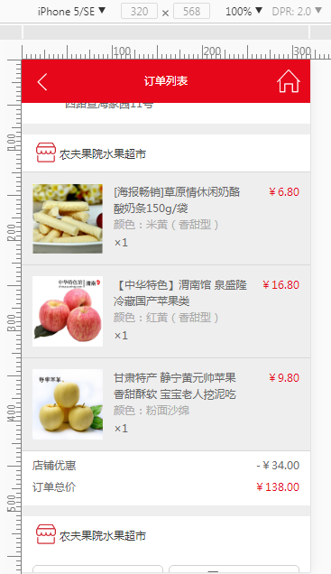
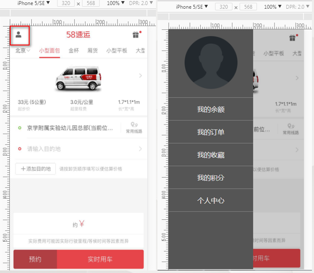

## 第四章：移动端页面布局

### 目标：

- #### 掌握水平居中与垂直居中

- #### 掌握移动端布局的方法

### 掌握水平居中与垂直居中

#### 水平居中

##### 行内元素

```
text-align: center;
```

##### 块级元素

```css
定宽：可以采取绝对定位的方式实现
.center {
    width: 960px;
    position: absolute;
    left: 50%;
    margin-left: -480px;
 }
 不定宽：借助css3的变形属性Transform来完成
 .content {
     position: absolute;
     left: 50%;
     transform: translateX(-50%);
 }


```

#### 垂直居中

##### 单行文本的垂直居中

```
元素的高度和行高相等时，文本呈现垂直居中   height  == line-height   高等于行高
```

##### 多行文本的垂直居中

```
不固定高度的垂直居中
	通过设置padding实现
固定高度的垂直居中
	使用display设置为table-cell，配合样式vertical-align设置为middle来实现
	table-cell：以表格单元格的形式来解析代码
```

##### 块级元素垂直居中

##### 固定宽高的垂直居中

```
.content {
        width: 100px;
        height: 100px;
        position: absolute;
        left: 50%;
        top: 50%;
        margin-left: -50px;
        margin-top: -50px;
    }

```

##### 不固定宽高的垂直居中

```
.content {
       position: absolute;
        left: 50%;
        top: 50%;
        /* 左/上边缘向左/上移动自身宽/高度的一半 */
        transform: translate(-50%, -50%);
    }

```

##### 基于Flex实现垂直居中

移动端开发中最佳的解决方案

```
.content {
         /*转为flex弹性盒布局*/
        display: flex;
        /*主轴上的对齐方式为居中*/
        justify-content: center;
        /*交叉轴上对齐方式为居中*/
        align-items: center;
    }

```


### 掌握移动端布局的方法

百分比流式布局
响应式布局
基于rem的布局
Flex布局

#### 响应式布局案例

##### 阶段一：制作当当书香节导航部分

需求说明
屏幕宽度大于1200px时，按钮一行显示5个

屏幕宽度大于768px小于1199px时，按钮一行显示4个    

屏幕宽度大于480px小于767px时，按钮一行显示4个


屏幕宽度小于479px时，按钮一行显示3个


按钮中的字体及间距大小自行调节

##### 阶段二

需求说明
这一块需要使用百分比布局产品列表，随着屏幕宽度的变化，产品会自动适应屏幕的变化做出相应的调整，这一块并没有用到媒体查询进行控制

[图片懒加载技术](http://note.youdao.com/noteshare?id=2c481a096a4ce0bc76613ac7d5aaaf4b&sub=0B4627A6A9C54579ADDB24565F79295F)


##### 设计稿：


#### 作业：





## 