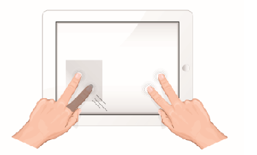
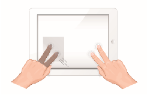
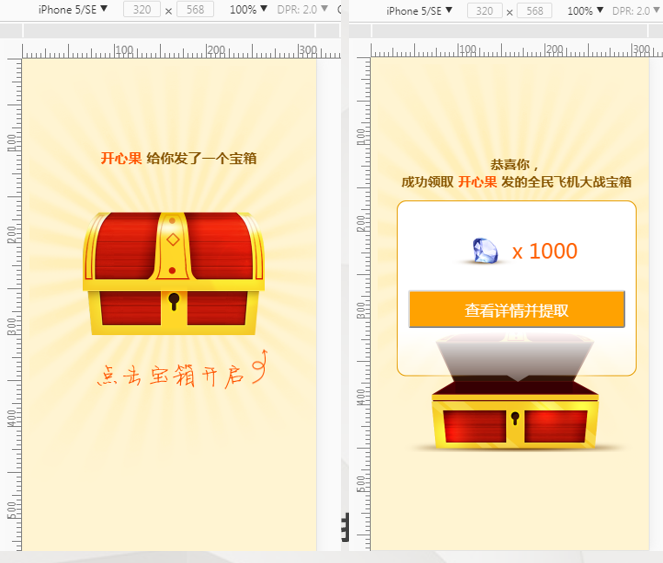

## 第五章：移动端事件

回顾：

### 目标 

会使用移动端事件开发移动端特效 
移动端事件封装 
会使用touch.js移动端事件库  

### 移动端事件  

- 触摸事件  
- 摸两下事件  
- 滑动事件  
- 上滑、下滑、左滑、右滑 
- 长按事件
- 摇一摇、重力感应等

### 300ms 延时 

#### 在移动端上使用click事件

```js
var span = document.getElementsByTagName('span')[0];
span.onclick = function () {
    alert('点击了span元素');
};
```

#### 	300ms产生的原因

1、移动浏览器上支持的 双击缩放操作，以及 IOS系统 上的双击滚动操作，是导致300ms的点击延迟主要原因。
2、手指在屏幕上快速点击两次，移动端浏览器会将网页缩放至原始比例。 那么这和 300 毫秒延迟有什么联系呢？ 假定这么一个场景。用户在 浏览器里边点击了一个链接。由于用户可以进行双击缩放或者双击滚动的操作，当用户点击 一次屏幕之后，浏览器并不能立刻判断用户是确实要打开这个链接，还是想要进行双击操作。因此，浏览器就等待 300 毫秒，以判断用户是否再次点击了屏幕 ，如果 300ms之内再次点击 就会认为是 双击操作，如果300ms 内 没有再次去点击，就认为是单击。
3、在移动WEB兴起的初期，用户对300ms的延迟感觉不明显。但是，随着用户对交互体验的要求越来越高，现今，移动端300ms的点击延迟逐渐变得明显，那我们该如何解决这个问题呢？
    两种方式，第一种 ：**使用移动端专门提供的事件**    第二种，可以使用插件（fastclick.js）解决 300ms延时问题 。

事件的三个阶段：

​		捕获阶段   目标阶段   冒泡阶段

### 300ms延时会造成：点透现象 

参考博客：https://blog.csdn.net/qq_17746623/article/details/55805425?spm=1001.2101.3001.6650.14&utm_medium=distribute.pc_relevant.none-task-blog-2%7Edefault%7EBlogCommendFromBaidu%7Edefault-14.no_search_link&depth_1-utm_source=distribute.pc_relevant.none-task-blog-2%7Edefault%7EBlogCommendFromBaidu%7Edefault-14.no_search_link&utm_relevant_index=23

```js
点透发生的条件
A 和 B不是后代继承关系，而是兄弟关系
A发生touch， B事件绑定click, A touch后立即消失，
A显示在B浮层之上
```

#### 解决点透问题

1.将click换成移动端事件   推荐使用

2.将touchstart中的事件 延迟一定的时间执行  大于  300ms    不推荐

3.e.preventDefault()

```HTML
<!DOCTYPE html>
<html>
<head>
    <meta charset="UTF-8">
    <meta name="viewport" content="width=device-width, initial-scale=1.0,maximum=1.0,minimum-scale=1.0,user-scalable=0">
    <meta http-equiv="X-UA-Compatible" content="ie=edge">
    <title>Document</title>
    <style>
        .box1{
            width: 300px;
            height: 300px;
            background-color: red;
            position: absolute;
            top: 0;
            left: 0;
        }

        .box2{
            width: 200px;
            height: 200px;
            background-color: blue;
            position: absolute;
            top: 0;
            left: 0;
        }
    </style>
</head>
<body>
    <div class="box1"></div>
    <div class="box2"></div>
</body>
<script>
    var box2 = document.getElementsByClassName('box2')[0];
    box2.ontouchstart = function(e){
        //setTimeout(function(){
            box2.style.display = 'none';
        //}, 400);

        e = e || window.event;
        //阻止默认行为
        e.preventDefault();
    }

    /* box2.ontouchend = function(){
        console.log('touchend事件');
    } */

    var box1 = document.getElementsByClassName('box1')[0];
    box1.onclick = function(){
        alert('下层单击事件');
    }
</script>
</html> 
```

4.使用fastclick.js解决。

```JS
1.https://www.bootcdn.cn/fastclick/　　下载文件
2.导入js文件 <script src='fastclick.js'></script>
3.使用
	js中添加：
        if (‘addEventListener’ in document) {
        	document.addEventListener(‘DOMContentLoaded’, function() {
        		FastClick.attach(document.body);
        	}, false);
        }
	如果有jquery：
        $(function() {
        	FastClick.attach(document.body);
        });
```

### Touch事件模型(原生js提供的) 

| touchstart  | 手指刚接触屏幕时触发                                         |
| ----------- | ------------------------------------------------------------ |
| touchmove   | 手指在屏幕上移动时触发                                       |
| touchend    | 手指从屏幕上移开时触发                                       |
| touchcancel | 当一些更高级别的事件发生的时候（如电话接入或者弹出信息）会取消当前的touch操作，即触发touchcancel。一般会在touchcancel时暂停游戏、存档,低电量提示，接入电话等操作 |

单击事件 click 响应时间  300ms   touch事件的响应时间  50ms

touchstart   touchmove  touchend    mousedown   click   mouseup 

### 触摸属性（event） 

touches：表示当前跟踪的触摸操作的touch对象的数组（当前位于屏幕上的所有手指触摸点的一个列表）

- 当一个手指在触屏上时，
      event.touches.length=1  
- 当两个手指在触屏上时，
      event.touches.length=2，以此类推 

changedTouches：导致触摸事件被触发的触摸点数组（涉及当前事件的触摸点的列表）



targetTouches：特定于事件目标的touch对象数组（当前元素对象上所有触摸点的列表。）



#### 触摸事件坐标（event事件对象中）

| clientX    | 触摸目标在视口中的x坐标  视觉视口    |
| ---------- | ------------------------------------ |
| clientY    | 触摸目标在视口中的y坐标   视觉视口   |
| identifier | 标识触摸的唯一ID                     |
| pageX      | 触摸目标在页面中的x坐标     布局视口 |
| pageY      | 触摸目标在页面中的y坐标     布局视口 |
| screenX    | 触摸目标在屏幕中的x坐标              |
| screenY    | 触摸目标在屏幕中的y坐标              |
| target     | 触摸的DOM节点目标                    |

注意：clientX/Y和pageX/Y的区别在于前者相对于视觉视口的左上角，后者相对布局视口的左上角。布局视口 是可以滚动的

### 移动端事件封装

- ##### 实操-单击事件

- ##### 实操-长按事件 

  ```js
  var touchEvents = {
      //先封装长按事件
      /*
          参数列表：
              1.触发长按事件的元素对象  ele
              2.长按事件触发的具体操作  fn()
  
          长按事件的业务逻辑：
              1.要规定好事件在按下多久后会执行？
                  借助定时器 来完成事件的延迟执行
                      一般都是750ms 
              2.在手指离开屏幕时 要清除定时器
              3.要对触摸之后手指的操作 做判断
                  看手指是否胡乱移动
                  借助 touchmove事件
                  因为是手指触摸 所以要兼容一定程度下的手指移动
                      10px 
                      取到 手指刚刚触摸时的坐标点
                      在手指移动过程中 实时获取坐标点
                      拿 移动后的clientY-移动前的cientY
                      移动后的clientY-移动前的cientY
                          取到两个绝对值 一个x轴移动的距离
                              一个是y轴移动的距离
                              当两者都小于10的时候 可以正常触发
                              否则 清除定时器
      */
      tap: function (ele, fn) {
          //开启一个定时器
          var timer = null;
          //定义手指刚触摸时的坐标  和手指移动时的坐标
          var sX, sY, eX, eY;
  
          //手指开始触摸时
          ele.ontouchstart = function () {
              var e = window.event;
              //手指刚触摸时的坐标
              sX = e.touches[0].clientX
              sY = e.touches[0].clientY
              console.log(sX, sY);
              console.log("手指触摸了");
              timer = setTimeout(function () {
                  fn();
              }, 750)
          }
          //手指松开时 如果时间小于750ms不能执行 fn()
          ele.ontouchend = function () {
              clearTimeout(timer)
          }
  
          //手指在移动时触发
          ele.ontouchmove = function () {
              var e = window.event;
              //手指刚触摸时的坐标
              eX = e.changedTouches[0].clientX
              eY = e.changedTouches[0].clientY
              console.log(eX, eY);
              //判断 移动的距离是否大于10
              if (Math.abs(eX - sX) > 10 || Math.abs(eY - sY) > 10) {
                  //清除定时器
                  clearTimeout(timer)
              }
          }
      },
      click: function (ele, fn) {
          /*
              手指刚按下 会直接触发事件吗？
          */
          var status = 0;
          var timer = null;
          //定义手指刚触摸时的坐标  和手指移动时的坐标
          var sX, sY, eX, eY;
          //触摸
          ele.addEventListener("touchstart", function () {
              var e = window.event;
              //手指刚触摸时的坐标
              sX = e.touches[0].clientX
              sY = e.touches[0].clientY
  
              timer = setTimeout(function () {
                  status = 1;
              }, 200)
          }, false)
          //手指移开时    
          ele.addEventListener("touchend", function () {
            clearTimeout(timer)
              if (status == 0) {
                  fn();
              }
              status = 0;
  
          }, false)
  
          //手指在移动时触发
          ele.ontouchmove = function () {
              var e = window.event;
              //手指刚触摸时的坐标
              eX = e.changedTouches[0].clientX
              eY = e.changedTouches[0].clientY
              console.log(eX, eY);
              //判断 移动的距离是否大于10
              if (Math.abs(eX - sX) > 10 || Math.abs(eY - sY) > 10) {
                  //清除定时器
                  status = 1;
              }
          }
      }
  }
  ```
  
  

### 移动端事件库

#### Touch.js  

`Touch.js`是移动设备上的手势识别与事件库, 由百度云Clouda团队维护，也是在百度内部广泛使用的开发工具.(已停更)

`Touch.js`手势库专为移动设备设计,是Web移动端touch点击事件不错的解决方案

https://github.com/Clouda-team/touchjs

参考文档：

https://blog.csdn.net/wangjiaohome/article/details/49364177?spm=1001.2101.3001.6650.8&utm_medium=distribute.pc_relevant.none-task-blog-2%7Edefault%7EBlogCommendFromBaidu%7Edefault-8-49364177-blog-124974389.pc_relevant_aa&depth_1-utm_source=distribute.pc_relevant.none-task-blog-2%7Edefault%7EBlogCommendFromBaidu%7Edefault-8-49364177-blog-124974389.pc_relevant_aa&utm_relevant_index=14

##### 支持移动端事件（部分）

| **属性**   | **设备类型** |
| ---------- | ------------ |
| tap        | 单击屏幕     |
| doubletap  | 双击屏幕     |
| swipe      | 滑动         |
| swipeleft  | 向左滑动     |
| swiperight | 向右滑动     |
| swipeup    | 向上滑动     |
| swipedown  | 向下滑动     |
| hold       | 长按屏幕     |
| dragstart  | 拖动开始     |
| drag       | 拖动         |
| pinchstart | 缩放手势起点 |
| pinchin    | 收缩         |
| pinchout   | 放大         |

用法：

zepto.js  ===  jquery.js

```js
<script src="js/touch-0.2.14.min.js"></script>
/*
	touch.on(1,2,3)

    三个参数：
	1、DOM元素
	2、移动端事件
	3、处理函数

 */
touch.on(oBox, 'tap', function(ev) {
     this.style.background = "red";
     this.style.color = '#fff'; 
});
```

#### hammer.js 

一款开源的移动端脚本框架，他能完美的实现在移端开发的大多数事件，如点击、滑动、拖动、多点触控等事件

http://hammerjs.github.io/

用法：

```js
<script src="js/hammer.min.js"></script>
//创建一个新的hammer对象并且在初始化时指定要处理的dom元素
var hammertime = new Hammer(document.getElementById("test"));

//添加事件
// tap、swipe、rotate、press、pinch、pan等事件，这里就给大家演示tap，剩余的大家可以课下自行学习
hammertime.on("tap", function(e) {
    document.getElementById("result").innerHTML += "点击触发了，长按无效<br />";
    //控制台输出,可以自行查看相关的参数
    console.log(e);
});
```

### 作业：开启宝箱

需求说明 
点击宝箱的时候，宝箱摇晃
摇晃动画结束后，宝箱打开，出现获得的奖励
训练技术
使用touchjs库的tap事件
使用原生封装的addClass给宝箱添加相应的摇晃的类 
使用setTimeout、removeClass等让原来的宝箱变为打开状态的宝箱，并显示奖励模块。且宝箱下面的文字在宝箱打开后消失

### 

