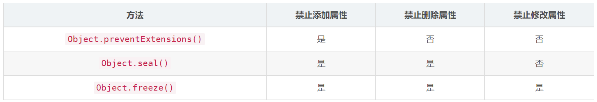
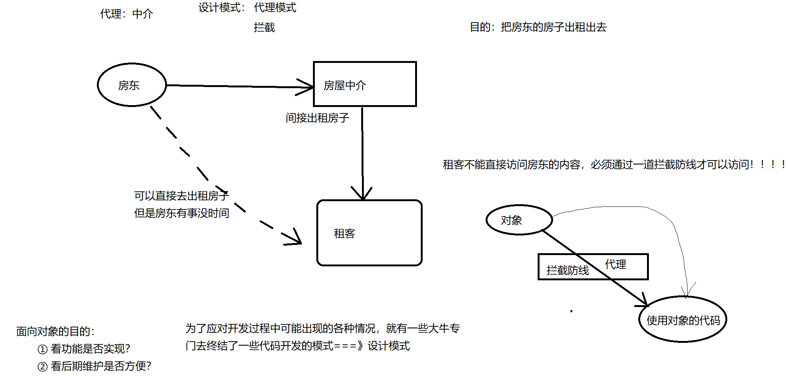
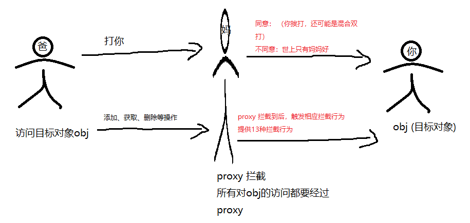

# 第三章：Object对象的常用API和Proxy(代理拦截操作)

## 一、Object对象的常用API (web)

Object对象的api文档：https://developer.mozilla.org/zh-CN/docs/Web/JavaScript/Reference/Global_Objects/Object

### 1.1 Object 对象简介 

`Object` 是 JavaScript 的一种 [数据类型](https://developer.mozilla.org/zh-CN/docs/Web/JavaScript/Data_structures) 。它用于存储各种键值集合和更复杂的实体。Objects 可以通过 `Object()` 构造函数或者使用 [对象字面量](https://developer.mozilla.org/zh-CN/docs/Web/JavaScript/Reference/Operators/Object_initializer) 的方式创建

new Object() 构造函数

obj = {} 字面量

#### 描述

在 JavaScript 中，几乎所有的对象都是 `Object` 类型的实例，它们都会从 `Object.prototype` 继承属性和方法，虽然大部分属性都会被覆盖（shadowed）或者说被重写了（overridden）。 除此之外，`Object` 还可以被故意的创建，但是这个对象并不是一个“真正的对象”（例如：通过 `Object.create(null)`），或者通过一些手段改变对象，使其不再是一个“真正的对象”（比如说：`Object.setPrototypeOf`）。

通过原型链，所有的 `object` 都能观察到 Object 原型对象（Object prototype object）的改变，除非这些受到改变影响的属性和方法沿着原型链被进一步的重写。尽管有潜在的危险，但这为覆盖或扩展对象的行为提供了一个非常强大的机制。

`Object` 构造函数为给定的参数创建一个包装类对象（object wrapper），具体有以下情况：

- 如果给定值是 [`null`](https://developer.mozilla.org/zh-CN/docs/Web/JavaScript/Reference/Operators/null) 或 [`undefined`](https://developer.mozilla.org/zh-CN/docs/Web/JavaScript/Reference/Global_Objects/undefined)，将会创建并返回一个空对象
- 如果传进去的是一个基本类型的值，则会构造其包装类型的对象
- 如果传进去的是引用类型的值，仍然会返回这个值，经他们复制的变量保有和源对象相同的引用地址

当以非构造函数形式被调用时，`Object` 的行为等同于 `new Object()`。

### 1.2 从对象上删除属性

Object 自身没有提供方法删除其自身属性（Map 中的 `Map.prototype.delete()` 可以删除自身属性 ）为了删除对象上的属性，必须使用`delete`操作符

```
let obj = {
	name:"张三",
	age:18
}
delete obj.name //从obj对象上删除name属性
console.log(obj);//观察结果输出
```

### 1.3 Object对象上的静态方法  

| 方法名                                                       | 方法描述                                                     |
| ------------------------------------------------------------ | ------------------------------------------------------------ |
| [`Object.assign()`](https://developer.mozilla.org/zh-CN/docs/Web/JavaScript/Reference/Global_Objects/Object/assign) | 通过复制一个或多个对象来创建一个新的对象                     |
| [`Object.create()`](https://developer.mozilla.org/zh-CN/docs/Web/JavaScript/Reference/Global_Objects/Object/create) | 使用指定的原型对象和属性创建一个新对象。                     |
| [`Object.defineProperty()`](https://developer.mozilla.org/zh-CN/docs/Web/JavaScript/Reference/Global_Objects/Object/defineProperty)  vue2的响应式原理 | 给对象添加一个属性并指定该属性的配置                         |
| [`Object.defineProperties()`](https://developer.mozilla.org/zh-CN/docs/Web/JavaScript/Reference/Global_Objects/Object/defineProperties) | 给对象添加多个属性并分别指定它们的配置。                     |
| [`Object.entries()`](https://developer.mozilla.org/zh-CN/docs/Web/JavaScript/Reference/Global_Objects/Object/entries) | 返回给定对象自身可枚举属性的 `[key, value]` 数组。           |
| [`Object.freeze()`](https://developer.mozilla.org/zh-CN/docs/Web/JavaScript/Reference/Global_Objects/Object/freeze) | 冻结对象：其他代码不能删除或更改任何属性                     |
| [`Object.getOwnPropertyDescriptor()`](https://developer.mozilla.org/zh-CN/docs/Web/JavaScript/Reference/Global_Objects/Object/getOwnPropertyDescriptor) | 返回对象指定的属性配置。                                     |
| [`Object.getOwnPropertyNames()`](https://developer.mozilla.org/zh-CN/docs/Web/JavaScript/Reference/Global_Objects/Object/getOwnPropertyNames) | 返回一个数组，它包含了指定对象所有的可枚举或不可枚举的属性名 |
| [`Object.getPrototypeOf()`](https://developer.mozilla.org/zh-CN/docs/Web/JavaScript/Reference/Global_Objects/Object/GetPrototypeOf) | 返回指定对象的原型对象。                                     |
| [`Object.is()`](https://developer.mozilla.org/zh-CN/docs/Web/JavaScript/Reference/Global_Objects/Object/is) | 比较两个值是否相同。所有 NaN 值都相等（这与==和===不同）     |
| [`Object.isExtensible()`](https://developer.mozilla.org/zh-CN/docs/Web/JavaScript/Reference/Global_Objects/Object/isExtensible) | 判断对象是否可扩展。                                         |
| [`Object.isFrozen()`](https://developer.mozilla.org/zh-CN/docs/Web/JavaScript/Reference/Global_Objects/Object/isFrozen) | 判断对象是否已经冻结。                                       |
| [`Object.isSealed()`](https://developer.mozilla.org/zh-CN/docs/Web/JavaScript/Reference/Global_Objects/Object/isSealed) | 判断对象是否已经密封。                                       |
| [`Object.keys()`](https://developer.mozilla.org/zh-CN/docs/Web/JavaScript/Reference/Global_Objects/Object/keys) | 返回一个包含所有给定对象**自身**可枚举属性名称的数组         |
| [`Object.preventExtensions()`](https://developer.mozilla.org/zh-CN/docs/Web/JavaScript/Reference/Global_Objects/Object/preventExtensions) | 防止对象的任何扩展。                                         |
| [`Object.seal()`](https://developer.mozilla.org/zh-CN/docs/Web/JavaScript/Reference/Global_Objects/Object/seal) | 防止其他代码删除对象的属性。(密封)                           |
| [`Object.setPrototypeOf()`](https://developer.mozilla.org/zh-CN/docs/Web/JavaScript/Reference/Global_Objects/Object/setPrototypeOf) | 设置对象的原型（即内部 `[[Prototype]]` 属性）。              |
| [`Object.values()`](https://developer.mozilla.org/zh-CN/docs/Web/JavaScript/Reference/Global_Objects/Object/values) | 返回给定对象自身可枚举值的数组。                             |

### 1.4 Object对象上的实例属性和实例方法

| 实例属性                                                     | 属性描述                                                     |
| ------------------------------------------------------------ | ------------------------------------------------------------ |
| [`Object.prototype.constructor`](https://developer.mozilla.org/zh-CN/docs/Web/JavaScript/Reference/Global_Objects/Object/constructor) | 一个引用值，指向 Object 构造函数                             |
| [`Object.prototype.__proto__`](https://developer.mozilla.org/zh-CN/docs/Web/JavaScript/Reference/Global_Objects/Object/proto) | 指向一个对象，当一个 object 实例化时，使用该对象作为实例化对象的原型 |


| 方法名                                                       | 方法描述                                                     |
| ------------------------------------------------------------ | ------------------------------------------------------------ |
| [`Object.prototype.hasOwnProperty()`](https://developer.mozilla.org/zh-CN/docs/Web/JavaScript/Reference/Global_Objects/Object/hasOwnProperty) | 返回一个布尔值，用于表示一个**对象自身**是否包含指定的属性，该方法并不会查找原型链上继承来的属性。 |
| [`Object.prototype.isPrototypeOf()`](https://developer.mozilla.org/zh-CN/docs/Web/JavaScript/Reference/Global_Objects/Object/isPrototypeOf) | 返回一个布尔值，用于表示该方法所调用的对象是否在指定对象的原型链中。 |
| [`Object.prototype.propertyIsEnumerable()`](https://developer.mozilla.org/zh-CN/docs/Web/JavaScript/Reference/Global_Objects/Object/propertyIsEnumerable) | 返回一个布尔值，用于表示内部属性 [ECMAScript [[Enumerable\]] attribute](https://developer.mozilla.org/zh-CN/docs/Web/JavaScript/Data_structures#属性) 是否被设置。 |
| [`Object.prototype.toLocaleString()`](https://developer.mozilla.org/zh-CN/docs/Web/JavaScript/Reference/Global_Objects/Object/toLocaleString) | 调用 `toString()。`                                          |
| [`Object.prototype.toString()`](https://developer.mozilla.org/zh-CN/docs/Web/JavaScript/Reference/Global_Objects/Object/toString) | 返回一个代表该对象的字符串。                                 |
| [`Object.prototype.valueOf()`](https://developer.mozilla.org/zh-CN/docs/Web/JavaScript/Reference/Global_Objects/Object/valueOf) | 返回指定对象的原始值。                                       |

### 1.5 对象的冻结，密封，不可扩展的区别

JavaScript中，我们可以修改和[重写](https://so.csdn.net/so/search?q=重写&spm=1001.2101.3001.7020)一切未经保护的对象，同样，他人也可以随意重写我们所定义的对象。一般来讲，我们不应该重写他人的对象，这会导致代码很难维护。不要重写他人的对象，因为别人可能使用了你修改的对象，修改后的对象的行为有可能对他人的功能产生巨大的影响。

#### 如何阻止他人重写对象？

同样的，有些情况下下，我们也不希望其他人随意重写我们定义的对象，一般会用到三个方法Object.preventExtensions()、Object.seal()和Object.freeze()，这三个方法的异同：


可以看出来，Object.freeze()是最严格的。

- `Object.freeze()`

  ```txt
  此方法用来冻结对象，冻结之后无法对该对象中的属性做任何操作。
  可以通过 Object.isFrozen() 判断对象是否已经冻结。
  ```

- `Object.preventExtensions()`

  ```txt
  Object.preventExtensions()将对象标记为不可扩展的，不能再添加新的属性，但是属性的删除和修改不受影响。当为不可扩展的对象添加属性时会静默失败，在严格模式下抛出错误。
  Object.preventExtensions()仅阻止为对象自身添加属性，但是属性仍然可以添加到原型对象。
  可以通过Object.isExtensible()判断对象是否可以扩展，一旦使其不可扩展，就无法逆转。
  ```

- `Object.seal()`

  ```txt
  Object.seal()方法封闭一个对象，阻止添加新属性并将所有现有属性标记为不可配置（阻止删除属性）。当前属性的值只要可写就可以改变。尝试添加或删除现有属性，将会在严格模式下抛出错误。
  Object.seal()改变了属性的访问器属性configurable，让该属性变成不可配置。
  可以通过Object.isSealed()判断对象是否被封闭。
  ```

## 二、Proxy 代理操作 (vue3 的响应式原理)

Proxy 可以理解成，在目标对象之前架设一层“拦截”，外界对该对象的访问，都必须先通过这层拦截，因此提供了一种机制，可以对外界的访问进行过滤和改写。Proxy 这个词的原意是代理，用在这里表示由它来“代理”某些操作，可以译为“代理器”。





```js
ES6 原生提供 Proxy 构造函数，用来生成 Proxy 实例
。
var proxy = new Proxy(target, handler);
Proxy 对象的所有用法，都是上面这种形式，不同的只是handler参数的写法。其中，new Proxy()表示生成一个Proxy实例，target参数表示所要拦截的目标对象，handler参数也是一个对象，用来定制拦截行为。
let obj = {
    sex:'man'
}
let myproxy  = new Proxy(obj,{
    get(){},
    set(){},
    has(){},
    delteProperty(){}
    ...
});
```

## Proxy 支持的拦截操作一览，一共 13 种。

target 目标对象(被代理对象) propKey 被操作的属性值   receiver 代理对象

- **get(target, propKey, receiver)**：拦截对象属性的读取，比如`proxy.foo`和`proxy['foo']`。

- **set(target, propKey, value, receiver)**：拦截对象属性的设置，比如`proxy.foo = v`或`proxy['foo'] = v`，返回一个布尔值。  value表示 要设置的那个值

- **has(target, propKey)**：拦截`propKey in proxy`的操作，返回一个布尔值。

- **deleteProperty(target, propKey)**：拦截`delete proxy[propKey]`的操作，返回一个布尔值。

  ```
  target    目标对象。
  property  待删除的属性名。
  返回值  deleteProperty 必须返回一个 Boolean 类型的值，表示了该属性是否被成功删除。
  ```

- **ownKeys(target)**：拦截`Object.getOwnPropertyNames(proxy)`、`Object.getOwnPropertySymbols(proxy)`、`Object.keys(proxy)`、`for...in`循环，返回一个数组。该方法返回目标对象所有自身的属性的属性名，而`Object.keys()`的返回结果仅包括目标对象自身的可遍历属性。

- **getOwnPropertyDescriptor(target, propKey)**：拦截`Object.getOwnPropertyDescriptor(proxy, propKey)`，返回属性的描述对象。

- **defineProperty(target, propKey, propDesc)**：拦截`Object.defineProperty(proxy, propKey, propDesc）`、`Object.defineProperties(proxy, propDescs)`，返回一个布尔值。

- **preventExtensions(target)**：拦截`Object.preventExtensions(proxy)`，返回一个布尔值。

- **getPrototypeOf(target)**：拦截`Object.getPrototypeOf(proxy)`，返回一个对象。

- **isExtensible(target)**：拦截`Object.isExtensible(proxy)`，返回一个布尔值。

- **setPrototypeOf(target, proto)**：拦截`Object.setPrototypeOf(proxy, proto)`，返回一个布尔值。如果目标对象是函数，那么还有两种额外操作可以拦截。

- **apply(target, object, args)**：拦截 Proxy 实例作为函数调用的操作，比如`proxy(...args)`、`proxy.call(object, ...args)`、`proxy.apply(...)`。

- **construct(target, args)**：拦截 Proxy 实例作为构造函数调用的操作，比如`new proxy(...args)`。

```js
var handler = {
  defineProperty (target, key, descriptor) {
    return false;
  }
};
var target = {};
var proxy = new Proxy(target, handler);
proxy.foo = 'bar' // 不会生效
```

