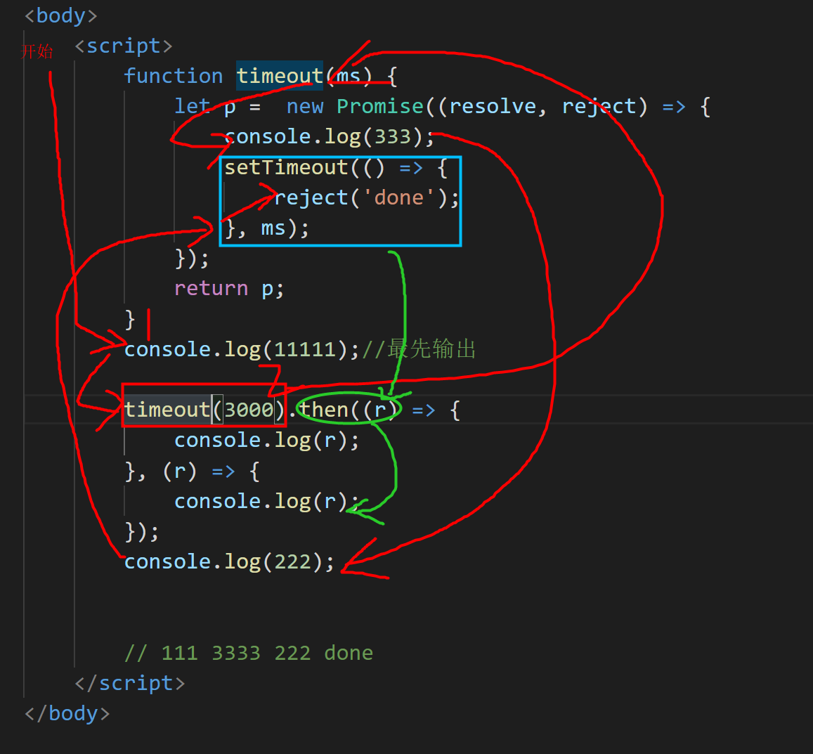

# 第四章：Promise (异步编程解决方案)贼重要

## 回顾：proxy代理  拦截

作用：控制我们对对象中属性的访问：

​		get获取

​		set设置

​		has判断 检查   ===  in操作符

​		deleteProperty  属性的删除 

​		apply拦截 函数调用 

​		。。。。。。

## 一、为什么要学习 Promise 

fun a(){}  这是一个同步

fun b(a){} 异步函数

a函数中需要用到 b函数返回的结果。


let tickets = 100;

if(tickets>0){

​	tickets--;

}

高并发：数据的安全性问题。

js:第一天：

​		发展史：

​				机器语言  01

​				汇编语言

​				高级编程语言

python   java {}   c：贴近硬件   c++:

​		一个功能：

​					c:10000   java:100    python:10   开发成本

​		体量，稳定性


因为 js 是**单线程**的。

特色：用单线程模拟多线程运行。 

同步代码：

异步代码：ajax  DOM事件  定时器。。。 ----》宏任务  微任务

之前我们做异步操作具有代表形的就是 ajax

**回调地狱：** 

​		解决方案：1.promise   2. generator+yield 让步  3.async+await 

```js
<!DOCTYPE html>
<html lang="en">
<head>
    <meta charset="UTF-8">
    <meta http-equiv="X-UA-Compatible" content="IE=edge">
    <meta name="viewport" content="width=device-width, initial-scale=1.0">
    <title>Document</title>
</head>
<body>
    <script>
        //事件轮循机制  EventLoop
        //常见的异步操作：DOM事件绑定  定时器  ajax...
        /* setTimeout(()=>{
            console.log(111);
        },200)

        console.log(222); */

        //ajax操作
        //1.创建对象
        let ajax_ = new XMLHttpRequest();

        //2.创建连接
        /*
            ① 请求方法
            ② 请求的url
            ③ 同步/异步  默认是 异步
        */

        /*场景模拟：
            ①现在 我们向后台发送一次请求需要查到 学生的id编号信息。
            ②拿到学生的id信息后，我们又根据id再次向后台发送请求查询 该id对应的classid
            ③拿到classid后我们又需要向后台发送请求 根据 id和classid 查询 subjectid(科目id)
            。。。。。
            用ajax操作如何完成以上步骤？
                就像俄罗斯套娃 非常难受。代码的可读性非常差，容易造成思维混乱。
            
            使用promise异步编程来解决问题。
                可以把异步编程在形式上变成同步操作。增强代码的可读性。代码也会更加简化。
        */

        ajax_.open('get','./111',true);
        //3.发送请求  如果是  get请求  括号中没有数据  如果是post请求 需要把所有参数放到 send()中
        ajax_.send();
        ajax_.send('username=张三&pass=12345');
        //4.接收响应（这个第四步代码 只需要放在第一步的后边都可以）
        ajax_.onreadystatechange = function(){
            //进行状态码的判断 readyState 0 1 2 3 4
            if(ajax_.readyState==4){
                if(ajax_.status==200){
                    //请求成功  接收的是 字符串类型的数据
                    //我们需要提前跟后台人员商量好  要给我返回 json格式的字符串。
                    //通过JSON.parse()将json字符串转换成  json对象
                    ajax_.responseText();
                }else{
                    //请求失败
                    
                }
            }
        }

        /*场景模拟：
            ①现在 我们向后台发送一次请求需要查到 学生的id编号信息。
            ②拿到学生的id信息后，我们又根据id再次向后台发送请求查询 该id对应的classid
            ③拿到classid后我们又需要向后台发送请求 根据 id和classid 查询 subjectid(科目id)
            。。。。。
            用ajax操作如何完成以上步骤？
                就像俄罗斯套娃 非常难受。代码的可读性非常差，容易造成思维混乱。
            
            使用promise异步编程来解决问题。
                可以把异步编程在形式上变成同步操作。增强代码的可读性。代码也会更加简化。
        */
        //jquery完成 ajax使用
        //面试题：什么是回调地狱？如何解决回调地狱问题？ Promise/async
        //回调地狱
        $.ajax({
            type:'get/post',
            url:'../dd',
            data:'向后台发送的数据一般以 json对象或者json数组的形式向后台发送数据',
            dataType:'json',//预期后台返回的数据格式 一般都是json
            success(){
                //请求成功 内部的ajax就表示外部请求成功后的回调函数。
                $.ajax({
                    success(){
                        $.ajax({
                            success(){
								$.ajax({
                                    success(){
                                        $.ajax({
                                            success(res){

                                            }
                                        })
                                    }
                                })
                            }
                        })
                    }
                })
                
                ajax_(m,url,data)
                ajax_(m,url,data)
                ajax_(m,url,data)
            },
            async:true,//默认true表示异步  false就是同步
            error(){
                //请求失败
            }
            
        })
$.ajax({
                    success(){
                        $.ajax({
                            success(){

                            }
                        })
                    }
                })
ajax_(m,url,data)
$.ajax({
                    success(){
                        $.ajax({
                            success(){

                            }
                        })
                    }
                })
$.ajax({
                    success(){
                        $.ajax({
                            success(){

                            }
                        })
                    }
                })
    </script>
</body>
</html>

回调地狱：回调地狱最主要的就是因为功能逻辑代码嵌套的层次太多,导致可读性降低,维护困难，对代码性能，以及易读性，不友好。
案例：jq_ajax请求的回调嵌套
```

## 二、Promise 的

### 2.1 含义

Promise 是**异步编程**的一种解决方案，比传统的解决方案——回调函数和事件——更合理和更强大。它由社区最早提出和实现，ES6 将其写进了语言标准，统一了用法，**原生提供了`Promise`对象。**所谓`Promise`，简单说就是一个容器，里面管理着异步的操作,从它可以获取异步操作的消息，**本身不是异步的**，是里面管理的操作是异步的。

`Promise`对象有以下两个特点。

（1）`Promise`对象的状态不受外界影响。`Promise`对象代表一个异步操作，有三种状态：`pending`（进行中）、`fulfilled`（已成功）和`rejected`（已失败）。只有异步操作的结果，可以决定当前promise对象+是哪一种状态，任何其他操作都无法改变这个状态。这也是`Promise`这个名字的由来，它的英语意思就是“承诺”，表示其他手段无法改变。

（2）**一旦状态改变，就不会再变，**任何时候都可以得到这个结果。`Promise`对象的状态改变，只有两种可能：从`pending`变为`fulfilled`和从`pending`变为`rejected`。只要这两种情况发生，状态就凝固了，不会再变了，会一直保持这个结果，这时就称为 resolved（已定型）。如果改变已经发生了，你再对`Promise`对象添加回调函数，也会立即得到这个结果。这与事件（Event）完全不同，事件的特点是，如果你错过了它，再去监听，是得不到结果的。

有了`Promise`对象，就可以**将异步操作以同步操作的流程表达出来**，避免了层层嵌套的回调函数。此外，`Promise`对象提供统一的接口，使得控制异步操作更加容易。

`Promise`也有一些缺点。首先，无法取消`Promise`，一旦新建它就会立即执行，无法中途取消。其次，如果不设置回调函数，`Promise`内部抛出的错误，不会反应到外部。第三，当处于`pending`状态时，无法得知目前进展到哪一个阶段。

### 2.2 基本用法

#### 定义

ES6 规定，`Promise`对象是一个构造函数，用来生成`Promise`实例。

```js
promise 是一个构造函数，需要实例化对象
promise构造函数，接受一个函数作为参数
作为参数的函数也接受两个参数，分别是：
-- resolve 
-- reject
-- 它们是两个函数，由 JavaScript 引擎提供，不用自己部署。

--resolve函数的作用是，将Promise对象的状态从“未完成”变为“成功”
（即从 pending 变为 resolved），
在异步操作成功时调用，并将异步操作的结果，作为参数传递出去；

--reject函数的作用是，将Promise对象的状态从“未完成”变为“失败”
（即从 pending 变为 rejected），
在异步操作失败时调用，并将异步操作报出的错误，作为参数传递出去。

    <script>
        //1.创建 Promise对象
        //Promise构造函数中要传递的参数 是一个函数对象。
        //function中要传递两个参数 resolve,reject 这两个参数是内部封装好的我们直接用就可以
        //resolve成功和reject失败都是函数。

        //现在只考虑  js中 同步和异步操作
        let p = new Promise(function(resolve,reject){
            let a = 10;

            if(a > 8){//把次吃当成请求成功的状态
                resolve('请求成功了'); //只要执行这个代码 状态就变成了  fulfilled 成功
            }else{//请求失败的状态
                reject('请求失败了'); //只要执行这个代码 状态就变成了  rejected 失败
            }

            console.log(11111);
        });

        //then 然后  当 promise执行完毕后 会自动的执行then中的内容
        //then(fn1,fn2)  fn1就是请求成功的回调  fn2就是 请求失败的回调
        p.then(function(success){
            console.log(success);
            console.log(2222222222)
        },function(error){
            console.log(error);
        })
        

        console.log('333333333333');
    </script>
```

### 2.3 代码示例分析 



```js
<script>
        function timeout(ms) {
            let p =  new Promise((resolve, reject) => {
                console.log(333);
                setTimeout(() => {
                    reject('done');
                }, ms);
            });
            return p;
        }
        console.log(11111);//最先输出

        timeout(3000).then((r) => {
            console.log(r);
        }, (r) => {
            console.log(r);
        }); 
        console.log(222);


        // 111 3333 222 done
    </script>
上面代码中，最先执行 111输出,然后执行timeout方法返回一个Promise实例，然后输出promise对象中的333，因为333下边的是setTimeout异步代码，所以不会立即执行，需要优先把所有同步代码执行完毕，所以先执行222，执行过222后 经过js引擎的检查发现所有同步代码已经全部执行，然后接着执行 setTimeout代码，表示一段时间以后才会发生的结果。过了指定的时间（ms参数）以后，Promise实例的状态变为resolved/rejected，最后 就会触发then方法绑定的回调函数。
```

### 2.4 Promise.prototype.then

访问地址：https://suggest.taobao.com/sug?code=utf-8&q=iphone12

它的作用是为 Promise 实例添加状态改变时的回调函数。`then`方法的第一个参数是`resolved` 成功状态的回调函数，第二个参数（可选）是`rejected`失败状态的回调函数。**`then`方法返回的是一个新的`Promise`实例**（注意，不是原来那个`Promise`实例）。因此可以采用链式写法，即`then`方法后面再调用另一个`then`方法。

```js
<!DOCTYPE html>
<html>

<head>
    <meta charset="UTF-8">
    <meta name="viewport" content="width=device-width, initial-scale=1.0,maximum=1.0,minimum-scale=1.0,user-scalable=0">
    <meta http-equiv="X-UA-Compatible" content="ie=edge">
    <title>Document</title>
    <link rel="stylesheet" href="">
    <script src=""></script>
    <script src="../../04、jquery/lib/jquery-3.4.1.js"></script>
</head>

<body>
    <script>
        function ajax_send(type, url, data) {
            let p = new Promise((resolve, reject) => {
                $.ajax({
                    type: type,
                    url: url,
                    //data: data,
                    success(res) {
                        resolve(res)
                    },
                    error(err) {
                        reject("请求失败")
                    }
                })
            })
            return p;
        }
        let m = "get";
        let url = "http://localhost:4000";
        ajax_send(m, url)
            .then(res => {
                console.log(res);
                let { data } = JSON.parse(res)
                let { no, name, author, publisher, price } = data[2]
                //console.log(author);
                return ajax_send(m, `${url}?author=${author}`)
            })
            .then(res => {
                console.log(res);
                let { data } = JSON.parse(res)
                let { no, name, author, publisher, price } = data[0]
                console.log(publisher);
                return ajax_send(m, `${url}?publisher=${publisher}`)
            })
            .then(res => {
                console.log(res);
            })
    </script>
</body>

</html>
```

### 2.5 Promise.prototype.catch()和finally()方法

`Promise.prototype.catch()`方法是`.then(null, rejection)`或`.then(undefined, rejection)`的别名，用于指定发生错误时的回调函数。

如果Promise 对象对象状态变为`resolved`，则会调用`then()`方法指定的回调函数；如果异步操作抛出错误，状态就会变为`rejected`，就会调用`catch()`方法指定的回调函数，处理这个错误。另外，`then()`方法指定的回调函数，如果运行中抛出错误，也会被`catch()`方法捕获。

```js
<!DOCTYPE html>
<html lang="en">
<head>
    <meta charset="UTF-8">
    <meta http-equiv="X-UA-Compatible" content="IE=edge">
    <meta name="viewport" content="width=device-width, initial-scale=1.0">
    <title>Document</title>
</head>
<body>
    <script>
        let p = new Promise((resolve,reject)=>{
            let a = 10;
            if(a>8){
                resolve('成功');
            }else{
                reject('失败');
            }
        })

        /* p.then((succ)=>{
            console.log(succ);
        },(error)=>{
            console.log(error);
        }) */

        //catch的函义就等同于  then中的第二个错误的函数
        //从语义化的角度来说 用catch来标识 错误的回调函数。
        //finally表示一定会被执行到的函数，不管状态如何 一定会执行
        p.then((succ)=>{
            console.log(succ);
        }).catch((error)=>{
            console.log(error);
        }).finally(()=>{
            console.log('一定会被执行的代码。');
        })
    </script>
</body>
</html>
```

### 2.6 promise.all / race

```js
异步加载单张图片
<!DOCTYPE html>
<html lang="en">
<head>
    <meta charset="UTF-8">
    <meta http-equiv="X-UA-Compatible" content="IE=edge">
    <meta name="viewport" content="width=device-width, initial-scale=1.0">
    <title>Document</title>
</head>
<body>
    <div id="box"></div>
    <script>
        //异步加载图片  当图片加载完成时 把图片放入 div中
        function loadImg(url){
            return new Promise((resolve,reject)=>{
                //1.先创建 图片对象
                let img = new Image();//===>等同于图像标签

                //图片加载完成时 标识 成功状态
                img.src = url;

                //2.给img对象绑定事件  加载事件 当图片加载完成时 触发
                img.onload = ()=>{
                    resolve(img);
                }

                //3.当图片加载失败
                img.onerror = ()=>{
                    reject('图片加载失败');
                }
            })
        }
        let url = 'http//img.alicdn.com/imgextra/i3/3801041660/O1CN01MZfttd1O8K3oqODys_!!3801041660-0-daren.jpg_360x360xzq90.jpg_.webp';

        loadImg(url).then((success)=>{
            console.log(1111);
            //如果成功 把图片 添加到 div中
            box.appendChild(success);
        }).catch((error)=>{
            console.log(error);
        })
    </script>
</body>
</html>

#Promise.all()
// Promise.all()方法用于将多个 Promise 实例，包装成一个新的 Promise 实例
// let proall = Promise.all([p1,p2,....]);
1）只有p1、p2、p3的状态都变成成功，proall的状态才会变成成功，此时p1、p2、p3的返回值组成一个数组，传递给proall的回调函数。
2）只要p1、p2、p3之中有一个被rejected，proall的状态就变成rejected，此时第一个被reject的实例的返回值，会传递给proall的回调函数。

#promise.race([p1,p2,p3..])
// Promise.race()方法同样是将多个 Promise 实例，包装成一个新的 Promise 实例
// Promise.race 只要有一个promise实例的状态确定了，那整个race的状态就确定了
// 多个实例，谁先加载出来，就执行谁。
p1 p2 p3 p4 p5 :  
异步加载多张图片  all方法和race方法的区别。
<!DOCTYPE html>
<html lang="en">
<head>
    <meta charset="UTF-8">
    <meta http-equiv="X-UA-Compatible" content="IE=edge">
    <meta name="viewport" content="width=device-width, initial-scale=1.0">
    <title>Document</title>
</head>
<body>
    <div id="box"></div>
    <script>
        //异步加载图片  当图片加载完成时 把图片放入 div中
        function loadImg(url){
            return new Promise((resolve,reject)=>{
                //1.先创建 图片对象
                let img = new Image();//===>等同于图像标签

                //图片加载完成时 标识 成功状态
                img.src = url;

                //2.给img对象绑定事件  加载事件 当图片加载完成时 触发
                img.onload = ()=>{
                    resolve(img);
                }

                //3.当图片加载失败
                img.onerror = ()=>{
                    reject('图片加载失败');
                }
            })
        }


        let url1 = 'http://img.alicdn.com/imgextra/i3/3801041660/O1CN01MZfttd1O8K3oqODys_!!3801041660-0-daren.jpg_360x360xzq90.jpg_.webp';
        let url2 = 'http://img.alicdn.com/tfscom/i4/1991616983/O1CN01mQBuiz21SGJkBqiU4_!!1991616983.jpg_360x360xzq90.jpg_.webp';
        let url3 = 'http://img.alicdn.com/bao/uploaded/i1/2264215783/O1CN01rPiBbl1saf3doMLBa_!!2264215783-0-lubanu-s.jpg_360x360xzq90.jpg_.webp';

        Promise.all([
            loadImg(url1),
            loadImg(url2),
            loadImg(url3)
        ]).then((success)=>{
            console.log(success);
            //此时 success中包含 三个  Promise实例对象
            for (const img of success) {
                box.appendChild(success);
            }
        }).catch(()=>{

        })

        //race只返回第一个加载完成的实例
        Promise.race([
            loadImg(url1),
            loadImg(url2),
            loadImg(url3)
        ]).then((success)=>{
            console.log(success);
            //此时 success中包含的只有一个实例对象
            //此时包含的是 三个promise对象中 优先加载完成的那一个promise实例对象
            box.appendChild(success);
        }).catch(()=>{

        })

        
    </script>
</body>
</html>
```

## 综合案例 

要求：

- 封装原生ajax请求，调用接口数据，具体实现本章节开头时的回调地狱的效果。
- 基于Promise封装ajax请求,调用接口数据，对比体现Promise管理异步状态的优势，功能的强大，一定要掌握promise的用法

## 作业：

1. promise基本用法 （5分钟）
2. 异步加载图片的案例 （5分钟）
3. promise封装ajax (7分钟)