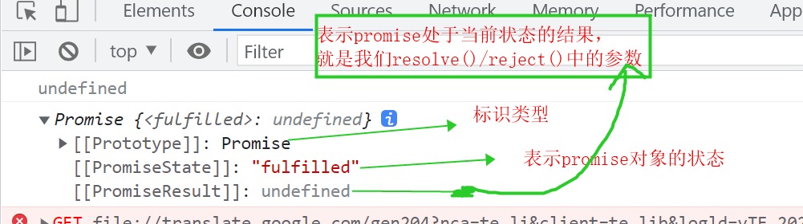
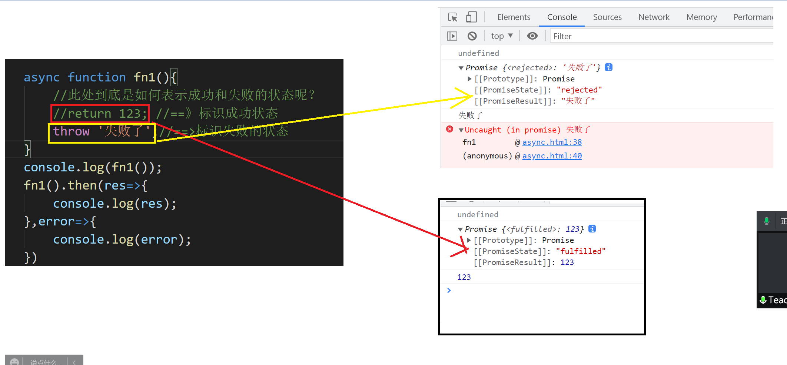
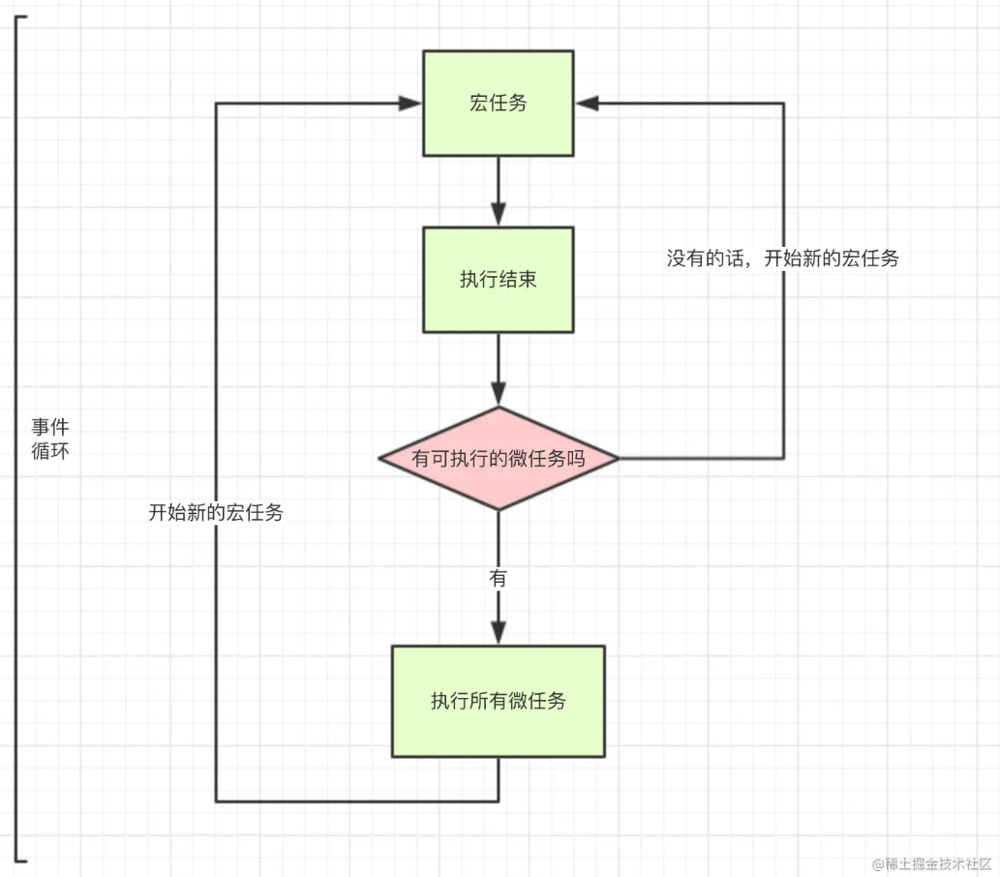

# 第五章：async & await

## 回顾：

Promise 主要作用：解决回调地狱

let p = new Promise((resolve,reject)=>{

​		resolve('成功信息');//fulfilled状态

​		reject('失败');//rejected失败状态

})

then(fn1(),fn2())

​		fn1(success)就是resolve函数的回调函数,success就是 resolve(参数)的参数

​		fn2(error)就是 reject函数的回调函数   error就是  reject(参数)  的参数

可以一致往下then  但是  要记得 return promise对象。

catch() 捕获  try () catch{} 捕获异常 

​			就等同于  then中的第二个函数参数  当发生错误时 会调用catch()方法

finally(()=>{}) 不管成功还是失败   一定会被执行的代码。可以用于日志记录等。

Promise.all([数组 promise1,promise2,promise...n]) 当所有的promis对象状态都为 fulfilled时  成功 时 才能正常的将整个promise状态改为成功---》执行成功的回调函数。

Promise.race([ promise1,promise2,promise...n])  根据第一个加载完成的promise对象来执行代码  并且只执行第一个加载完成的。

**思考：使用Promise解决回调地狱 好不好？**

​		如果不涉及到参数传递  那 很好！

​		但是如果涉及到参数的传递（上一次请求的结果要在下一次请求中使用）此时使用promise会很麻烦！

今天的  async 异步  await等待 两者结合  的使用方案===》被称之为解决异步问题的终极放案！！！

## 本章目标：

- 掌握async的基本用法
- 会使用async解决回调地狱问题  
- 掌握await用法
- 会结合使用async和await
- 掌握fetch API的使用

## 一、async基本用法

async 异步  await  async  + wait   异步等待

参考博客：https://segmentfault.com/a/1190000007535316

ES 2017 标准引入了 async 函数，使得异步操作变得更加方便。

ES6  ES2015正式发布  还没有async 

ES2017  ES7/8

async 是什么？===》异步的

- async 关键字，**用来修饰函数**，把这种函数称之为async函数
- async 是es8中，引入的，一个用于异步编程的一种解决方案；
- **async函数返回一个 Promise 对象，可以使用then方法添加回调函数。**
- **`async`函数内部`return`语句返回的值，会成为`then`方法回调函数的参数**  



```js
function fn(){}
console.log(fn());  //undefined

async function fn(){}
console.log(fn());  //Promise   PromiseState:'fulfilled'  PromiseResult:undefined

async function fn(){
    return 0; 
}
console.log(fn());  //Promise   PromiseState:'fulfilled'  PromiseResult:0

 //async函数返回一个 Promise 对象，可以使用then方法添加回调函数。
fn().then(res=>console.log(res)); //0
```



async 函数返回的是一个 Promise 对象。如果在函数中 `return` 一个直接量，async 会把这个直接量通过 `Promise.resolve()` 封装成 Promise 对象。

> `Promise.resolve(x)` 可以看作是 `new Promise(resolve => resolve(x))` 的简写，可以用于快速封装字面量对象或其他对象，将其封装成 Promise 实例。
>
> <script>
>         /**
>          *async  用来修饰函数
>             但凡使用async 修饰的函数 执行后 一定会返回一个Promise对象 不管这个函数有没有写return 
>                 async函数返回的Promise 一定是成功状态!!!
>                     如果async函数中 写了return 
>                         此时 return 的结果就是 整个promise对象的结果
>                         如果没有return  整个promise对象的结果是undefined
>          */
>         async function aaa() {
>             console.log(1111);
>             //返回成功状态
>             //return Promise.resolve(0);//===》return 0;
> 
>
>             /*
>                 如果想返回成功状态：
>                     方式一：直接  return 结果;
>                     方式二：return Promise.resolve(结果);
>                 如果想返回错误状态
>                     方式一：throw "出错了"//表示抛出异常。
>                     方式二：return Promise.reject(错误信息)
>             */
>             throw "出错了"//表示抛出异常。
>             //return Promise.reject("错误了")
>         }
>         console.log(aaa());
>
>         aaa().then(res => {
>             console.log(res);
>         })
>     </script>

async 函数返回的是一个 Promise 对象，所以在**最外层**不能用 await 获取其返回值的情况下，我们当然应该用原来的方式：`then()` 链来处理这个 Promise 对象，就像这样：

此时async是外层函数的情况下，如果想获取其中的结果:有两种方式：

​		① 使用then链获取

​		② 使用一个新的async函数 获取。

```javascript
<script>
        //异步函数  返回值 是123
        async function fn1() {
    		let res = await $.get("url");
    		console.log(res);
            return 123;===>把123封装成一个promise对象
        }
        //Uncaught SyntaxError: await is only valid in async functions and the top level bodies of modules
        //await只能用在 async函数内部
        //let aa = await fn1();

        //通过then链来获取 promise对象的结果
        fn1().then(res=>{
            console.log(res);
        })

        //await关键字来获取promise对象的结果
        async function fn(){
            //fn1()函数执行完毕后 返回的是 一个 Promise对象
            //await关键字 可以直接从 Promise对象中取出我们需要的那个结果值。
            //resolve()/reject()括号中的参数 
            let res = await fn1();
            console.log(res);
        }
        fn();
    </script>
```

如果 async 函数没有返回值，又该如何？很容易想到，它会返回 `Promise.resolve(undefined)`。

联想一下 Promise 的特点——无等待，所以在没有 `await` 的情况下执行 async 函数，它会立即执行，返回一个 Promise 对象，并且，绝不会阻塞后面的语句。这和普通返回 Promise 对象的函数并无差别。

## 二、await 等待

### 2.1 为什么要使用await

一般来说，都认为 await 是在等待一个 async 函数完成。不过按[语法说明](https://link.segmentfault.com/?enc=am8Sg40EjQ%2FeLPEbY6lz2Q%3D%3D.iPcnc4HmQIc4UuL1CHS2nVoN9Q7Phl8yJEMUY6Ra9lXlZ6L%2BQFsXi2TvNTytDG4PHWACXXx7gE23jaiRFVHD4PxAXVmhrWhMLw84nb3Telc%3D)，await 等待的是一个表达式，这个表达式的计算结果是 Promise 对象或者其它值（换句话说，就是没有特殊限定）。

因为 async 函数返回一个 Promise 对象，所以 await 可以用于等待一个 async 函数的返回值——这也可以说是 await 在等 async 函数，但要清楚，它等的实际是一个返回值。注意到 await 不仅仅用于等 Promise 对象，它可以等任意表达式的结果，所以，await 后面实际是可以接普通函数调用或者直接量的。

- await 命令必须写在async函数中，否则语法错误

- 如果它等到的不是一个 Promise 对象，那 await 表达式的运算结果就是它等到的东西。

  如果它等到的是一个 Promise 对象，await 就忙起来了，它会阻塞后面的代码，先执行async外面的同步代码，等着 Promise 对象 resolve状态--》fulfilled，然后得到 resolve 的值，作为 await 表达式的运算结果。

```js
<script>
        //异步函数  返回值 是123   async函数返回的结果就是一个promise对象
        async function fn1() {
            return 123;
        }
        //Uncaught SyntaxError: await is only valid in async functions and the top level bodies of modules
        //await只能用在 async函数内部
        //let aa = await fn1();

        //通过then链来获取 promise对象的结果
        fn1().then(res=>{
            console.log(res);
        })

        //这是一个普通函数 返回值是 你好哈哈哈
        function fn2(){
            return '你好哈哈哈';
        }

        //await关键字来获取promise对象的结果
        async function fn(){
            //fn1()函数执行完毕后 返回的是 一个 Promise对象
            //await关键字 可以直接从 Promise对象中取出我们需要的那个结果值。
            //resolve()/reject()括号中的参数 
            let res = await fn1();//此时的fn1()是一个promise对象

            //如果await接收的是一个promise对象 那么就直接从中取出整个promise对象的结果
            //如果await接收的是一个普通的值，那么此时 await的结果就是这个普通的数据值。
            let res1 = await fn2();
            console.log(res,res1);
        }
        fn();
    </script>
```

### 2.2 async 函数有多种使用形式。

```javascript
// 函数声明
async function foo() {}

// 函数表达式
const foo = async function () {};

// 对象的方法
let obj = { 
    fn:function(){},
    //等价
    fn(){},
    async demo(){},
    async foo() {} 
};
obj.foo().then(...)

// Class 的方法
class Storage {
  constructor() {
    this.cachePromise = caches.open('avatars');
  }

  async getAvatar(name) {
    const cache = await this.cachePromise;
    return cache.match(`/avatars/${name}.jpg`);
  }
}

const storage = new Storage();
storage.getAvatar('jake').then(…);

// 箭头函数
const foo = async () => {};
```

### 2.3 案例对比 （async/await 的优势在于处理 then 链（参数的传递））

案例一：

```js
<script>
        //使用Promise解决回调地狱
    $.ajax({
    	success(){
            $.ajax({
                success(){
                    $.ajax({
                        
                    })
                }
            })
        }
	})
        // 发送ajax请求的函数
        function ajax_(url) {
            return new Promise((resolve,reject)=> {
                let ajax_ = new XMLHttpRequest();
                ajax_.open('get', url, true);
                ajax_.send();
                //ajax_.send('username=张三&pass=12345');
                ajax_.onreadystatechange = function () {
                    //进行状态码的判断 readyState 0 1 2 3 4
                    if (ajax_.readyState == 4) {
                        if (ajax_.status == 200) {
                            //请求成功 
                            resolve(ajax_.responseText);
                        } else {
                            //请求失败
                            reject('请求失败');
                        }
                    }
                }
            })
        }
        

        function ajax_1(url,str) {
            return new Promise((resolve,reject)=> {
                let ajax_ = new XMLHttpRequest();
                ajax_.open('get', url, true);
                ajax_.send();
                ajax_.onreadystatechange = function () {
                    //进行状态码的判断 readyState 0 1 2 3 4
                    if (ajax_.readyState == 4) {
                        if (ajax_.status == 200) {
                            //请求成功 
                            str += ajax_.responseText;
                            resolve(str);
                        } else {
                            //请求失败
                            reject('请求失败');
                        }
                    }
                }
            })
        }
        
        //promise的核心改变的不是异步操作的本质，改变的只是异步操作的形式
        //相当于用同步代码的方式去执行异步代码，
        //最终目的：就是增强代码的可读性，条理性。
        let url1 = './111.json';
        let url2 = './222.json';
        let url3 = './333.json';

       let p1 = ajax_(url1).then((success)=>{
            return ajax_1(url2,success);
        },(error)=>{
            console.log(error);
        })
        
        let p2 = p1.then((success)=>{
            //console.log(success);
            return ajax_1(url3,success);
        },(error)=>{})
        
        p2.then((success)=>{
            console.log(success); 
        },(error)=>{})
        /* ajax_(url1).then((success)=>{
            console.log(success+'第一次');
            return ajax_(url2);
        },(error)=>{
            console.log(error);
        }).then((success)=>{
            console.log(success);
            return ajax_(url3);
        },(error)=>{

        }).then((success)=>{
            console.log(success);
            
        },(error)=>{

        }) */


        //使用async+await来完成多层回调
        async function print(){
            let str = '';
            str += await ajax_(url1);
            str += await ajax_(url2);
            str += await ajax_(url3);
           // console.log(str);
            return str;
        }
        let aaa = '';
        print().then(res=>{
            aaa = res;
            console.log(res);
        })

        console.log(aaa);
    </script>
```

案例二、

```js
//结合上一章节回调地狱，promise,对比async处理异步操作
1.原生ajax回调地狱
request_ajax('GET', 'http://localhost:4000?name=三体', function (res) {
    console.log(res);
    let {data: [{author}]} = res;
    request_ajax('GET', `http://localhost:4000?author=${author}`,function (re) {
        console.log(re);
    });
});

2.promise形式
request_ajax_promise('get', 'http://localhost:4000?name=三体')
    .then((res) => {
    console.log(res);
    let { data: [{author}]} = res;
    return request_ajax_promise('get', `http://localhost:4000?author=${author}`);
})
    .then((res) => {
    console.log(res);
    return;
});

3.async形式
async function getdata(){
    let res = await request_ajax_promise('get', 'http://localhost:4000?name=三体');
    console.log(res);
    let { data: [{name}]} = res;
    return await request_ajax_promise('get', `http://localhost:4000?name=${name}`);
}
getdata().then(res=>console.log(res));
```

### 2.4 宏任务和微任务(区分，重要) 

参考博客：https://juejin.cn/post/6844903512845860872#comment

```
ES5:
异步任务：
	DOM事件
	定时器
	ajax
	图片，视频，音频资源的加载
同步任务：
	常规的js代码
		运算，输出，流程控制，html页面的骨架(加载)
		EVentloop 事件循环机制
			执行栈  所有的异步代码进入 任务队列中等待执行。
ES6中 又划分出 宏任务/微任务
	EventLoop事件机制
		执行栈
		任务队列：
			宏任务队列   macrotask
			微任务队列   microtask
```

#### 2.2.1 什么是宏任务和微任务？

首先，我们要先了解下 Js 。js 是一种单线程语言，简单的说就是：只有一条通道，那么在任务多的情况下，就会出现拥挤的情况，这种情况下就产生了 ‘多线程’ ，但是这种“多线程”是通过单线程模仿的，也就是假的。那么就产生了同步任务和异步任务。

ES6 规范中，`microtask` 称为` jobs`，`macrotask` 称为 `task`
宏任务是由宿主发起的，而微任务由JavaScript自身发起。

在ES3以及以前的版本中，JavaScript本身没有发起异步请求的能力，也就没有微任务的存在。在ES5之后，JavaScript引入了Promise，这样，不需要浏览器，JavaScript引擎自身也能够发起异步任务了。

#### 2.2.2 宏任务、微任务有哪些？

- 宏任务：

  ```
  1. script (可以理解为外层同步代码)
  2. setTimeout/setInterval
  3. UI rendering/UI事件
  4. postMessage，MessageChannel
  5. setImmediate，I/O（Node.js）
  ```

- 微任务：

  ```
  1. Promise
  	new Promise() 中的回调函数代码是同步的 之后的then 才是异步的
  2. async await
  	await + 表达式;
  	其余语句;
  	await之后跟随的表达式会立即执行(同步),但是await下边的别的语句 是异步的。
  	
  3. process.nextTick（Node.js） 
  4. Object.observe（已废弃；Proxy 对象替代）
  5. MutaionObserver
  ```

#### 2.2.3 宏任务和微任务的执行流程

**事件循环的顺序，决定js代码的执行顺序。进入整体代码(宏任务< script >)后，开始第一次循环,执行其中所有的同步代码，把异步宏任务代码放入 `macrotask `宏任务队列中，把异步微任务代码放入`microtask` 微任务队列，接着执行第一轮中挑出的所有的微任务，第一轮的微任务执行完毕后，然后再次从宏任务队列中开始 执行宏任务队列中的第一个宏任务，先把这个宏任务队列中的同步代码执行完毕，再执行这个宏任务中的所有的微任务。之后 就一直循环这种执行流程 ---》EventLoop完整的事件循环机制。**




分析代码的执行流程！！！

```js
示例一、
async function f3(){
	let res = await 123;
	console.log(res);
	return res;
}
f3();
console.log(f3());

示例二、
async function f2(){
    let res = await new Promise((resolve,reject)=>{
        if(true){
            resolve({msg:'嘿嘿嘿'});
        }else{
            reject({msg:'error~'});
        } 
    });
    console.log(res);
}
f2();
```


```js
示例三：
async function f4(){
    console.log(111111);
    let r = await 22222;
    console.log(r);
    console.log(33333);
}
f4();
console.log(444444);
// 1 4 2 3
示例四：
async function fn(){
    console.log(111);
    let res = await new Promise((resolve,reject)=>{
        console.log(22222)
        setTimeout(()=>{
            if(true){
                console.log('aaaaa')
                resolve('成功');
            }else{
                reject('失败');
            }
        },1000)
        console.log(3333)
    }); 
    //console.log(a,res);
    console.log(66666);
}
console.log(44444)
fn();
console.log(55555)


面试题：
	async function async1() {
      console.log('async1 start');
      await async2();
      console.log('async1 end');
    }

    async function async2() {
      console.log('async2');
    }

    console.log('script start');
    setTimeout(function () {
      console.log('setTimeout');
    }, 0)

    async1();

    new Promise(function (resolve) {
      console.log('promise1');
      resolve();
    }).then(function () {
      console.log('promise2');
    });

    console.log('script end');
    // script start  async1 start  async2  promise1  script end  async1 end  promise2  setTimeout

代理示例5：
    console.log('1');

    setTimeout(function() {
        console.log('2');
        process.nextTick(function() {
            console.log('3');
        })
        new Promise(function(resolve) {
            console.log('4');
            resolve();
        }).then(function() {
            console.log('5')
        })
    })
    process.nextTick(function() {
        console.log('6');
    })
    new Promise(function(resolve) {
        console.log('7');
        resolve();
    }).then(function() {
        console.log('8')
    })

    setTimeout(function() {
        console.log('9');
        process.nextTick(function() {
            console.log('10');
        })
        new Promise(function(resolve) {
            console.log('11');
            resolve();
        }).then(function() {
            console.log('12')
        })
    })

```

### 

## 三、[Fetch  API](https://developer.mozilla.org/zh-CN/docs/Web/API/Fetch_API/Using_Fetch)  自学

前后端交互：三种方式

ajax,fetch,axios

- fetch 基于promise 
- 默认是get 方式
- 提供了一个全局 fetch() 方法，该方法提供了一种简单，合理的方式来跨网络异步获取资源。 这种功能以前是使用 XMLHttpRequest 实现的。Fetch 提供了一个更理想的替代方案

```js
fetch('http://localhost:4000?name=三体').then(res=>{
    // 返回的是服务端的响应。不是真正的数据；
    // 但是，我们要获取数据，就要 使用一个方法res.json();
    // console.log(res);
    return res.json();
}).then(res=>{
    console.log(res);
    let { data: [{author}]} = res;
    return fetch(`http://localhost:4000?author=${author}`);
}).then(res=>{
    return res.json();
}).then(res=>{
    console.log(res);
});


//fetch 与 async 结合使用demo
async function fn() {
    let res = await fetch('http://localhost:4000?name=三体');
    res = await res.json();
    let {data: [{author}]} = res;
    let r = await fetch(`http://localhost:4000?author=${author}`);
    return await r.json();
}
fn().then(res => console.log(res)); 
```

[参阅文档讲解学习](https://developer.mozilla.org/zh-CN/docs/Web/API/Fetch_API/Using_Fetch)

## 四、作业

1. 总结async和await的使用
2. 回调地狱案例以及三种优化方式【回调地狱/promise / async / fetch】 (10分钟)