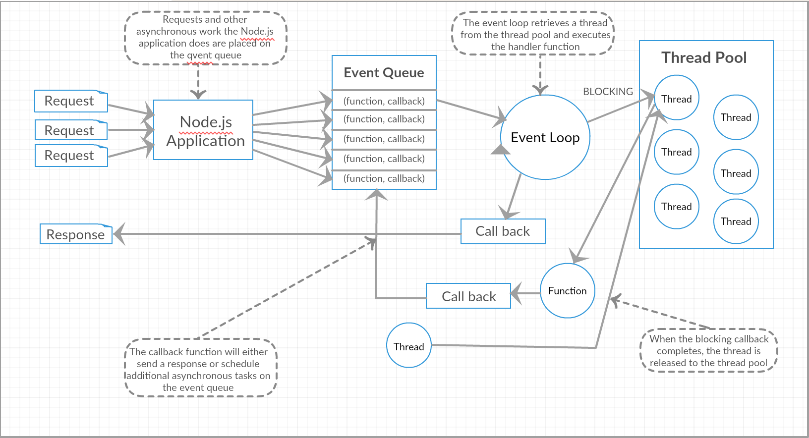

# 第一章：NodeJS课程介绍和安装

## 一、学习目的：

js:两种环境（浏览器环境(搭建页面)，node环境(搭建后台)）

浏览器js: 

​		ECMA的基本语法(变量，注释，运算符，流程控制，对象)   

​		(DOM   BOM) web api

node环境：

​		ECMA基本语法

​		不支持web api

​		支持后端模块：fs 文件读取   http服务器模块  。。。

作为前端开发工程师也可以写后台代码,目标全栈工程师 
更偏向大前端 
会处理Node.js常见需求 

微前端(前端的微服务架构)

## 二、Node.js诞生史 

Node.js之父：Ryan Dahl（瑞安·达尔）


• Ryan Dahl并非科班出身的开发者，在2004年的时候他还在纽约的罗彻斯特大学数学系读博士。 

• 2006年，做出了退学的决定，然后一个人来到智利的Valparaiso小镇。他开始学习网站开发了，走上了码农的道路。  

• 从那时候开始，Ryan Dahl的生活方式就是接项目，然后去客户的地方工作，在他眼中，拿工资和上班其实就是去那里旅行。• Ryan Dahl经过两年的工作后，成为了高性能Web服务器的专家，从接开发应用到变成专门帮客户解决性能问题的专家。 

• 2008年Google公司Chrome V8引擎横空出世，JavaScript脚本语言的执行效率得到质的提升,于是在2009年2月它开始着手编写Node.js

•  Ryan Dahl于2010年加入Joyent公司，全职负责Node.js项目的开发。此时Node.js项目已经从个人项目变成一个公司组织下的项目。

## 三、什么是 Node.js 

- Node.js 是一个基于 Chrome V8 引擎的 JavaScript 运行环境(采用Google开发的V8引擎运行js代码)
- Node.js 使用了事件驱动、非阻塞式 I/O 的模型，使其轻量又高效
- 

## 四、Node.js 使用场景

- 高并发
- 即时通讯
- 推送消息
- 搭建后台服务器

## 五、Node.js的特性

- 它是一个JavaScript运行环境
- 依赖于 Chrome V8 引擎 
- 轻量 ，适于实时数据交互应用
- 单线程
- 非阻塞I/O    input/output
- 事件驱动

### 5.1单线程  

像java、python这个可以具有多线程的语言。多线程同步模式是这样的，将cpu分成几个线程，每个线程同步运行。Node.js不会为每个客户连接创建一个新的线程，而仅使用一个线程。也就是说每一个计算独占cpu，遇到I/O请求不阻塞后面的计算，当I/O完成后，以事件的方式通知，继续执行计算2。


### 5.2 非阻塞I/O

```
I/O（英语：Input/Output），即输入/输出，通常指数据在内部存储器和外部存储器或其他周边设备之间的输入和输出。
而在程序执行的过程中会有很多的I/O操作，如读写文件，请求响应，数据库的读写等等
```

非阻塞I/O也就是指程序在执行的过程中，I/O操作不会阻塞程序的执行，也就是在执行I/o操作时，程序的的执行不受影响，继续执行其他的代码（这主要得益于node的事件循环机制），很显然这种非阻塞I/O大大提高了程序的性能。

nodejs 会保证主线程不会被阻塞，如果遇到正在执行的IO操作。nodejs 会把io操作放到其他地方去执行。(通过事件驱动来执行）。系统会把这个操作挪动事件队列里面执行。执行结束的任务会以回调函数的形式，返回给线程。然后继续处理接下来的任务。

### 5.3 事件驱动



Nodejs 会把所有请求和异步操作都放到一个事件队列中，用户的每一个请求就是一个事件。主线程先把普通（同步任务）代码执行完毕，然后会循环事件队列里的函数，如果遇到有IO的操作，nodejs会去线程池里拿出一个线程去执行IO的操作，执行完毕后再把拿到数据的回调函数，放到事件队列的尾部，继续事件循环，当主线程再次循环到该事件时，就直接处理并返回给上层调用。 这个过程就叫 **事件循环** (Event Loop)


```
应用层：   即 JavaScript 交互层，常见的就是 Node.js 的模块，比如 http，fs
V8引擎层：  即利用 V8 引擎来解析JavaScript 语法，进而和下层 API 交互
NodeAPI层：  为上层模块提供系统调用，一般是由 C 语言来实现，和操作系统进行交互 。
LIBUV层： 是跨平台的底层封装，实现了 事件循环、文件操作等，是 Node.js 实现异步的核心 
```

## 六、Node.js安装 

### 6.1 下载安装 

Node.js官网:  https://nodejs.org/en/
Node.js中文网:  http://nodejs.cn/       

                                                                                                                                                                                                            下载安装【傻瓜式下一步】                         

 Current是当前最新版本      LTS是长期支持版本稳定版
查看Node.js版本: 终端 中输入 node -v     

linux命令行   

### 6.2 终端介绍 

终端——人与机器交互的接口
人和机器是两个相互独立的实体。当人使用机器时，必须借助某种接口(interface)才能与机器交流信息。台式机的接口包括显示器、键盘、鼠标、扬声器、麦克风等。CPU、内存、硬盘、光驱、显卡、网卡等其他硬件属于主机(host)。Unix和Linux把这种使得人和机器可以交互的接口称为终端。
终端具有两个基本功能：向主机输入信息和向外部输出信息。所以终端可以分为输入设备和输出设备。台式机的输入设备通常包括键盘、鼠标、麦克风，输出设备包括显示器、扬声器等。

**通常将命令行程序称为终端**    

打开方式：

```
1.win+r  运行窗口   cmd
2.在文件夹url地址栏中输入 cmd 回车
3.在文件夹中，按shift+右键，找powershell
4.vscode  在集成终端中打开
```

可以在终端中通过”命令”去执行一些操作
可以用命令打开电脑中某个文件、创建某个文件夹、查看电脑的IP等等     

```
dir 查看文件目录
cd 文件名  进入下一级
cd ../ 向上一级
cls 清屏操作


新建文件夹：
mkdir+文件夹名字，mkdir与文件名之间一定要有空格
rmdir 文件夹名字  删除文件夹

table键：补全命令
“ifconfig”：查看IP地址
tree：以树状形状显示目录结构。
盘符：进入某个磁盘 d:
```

#### 6.3 node环境 运行js文件 

```
终端中输入  node 文件名
```

## 七、Node.js 模块化 

commonjs 规范 

### 7.1 什么是模块化？

**模块化** 是指解决一个 复杂问题 时，自顶向下逐层 把系统划分成若干模块的过程 。对于整个系统来说， 模块是可组 合、分解和更换的单元 。

例如：


程序中：编程领域中的模块化，就是**遵守固定的规则**，把一个大文件拆成独立并互相依赖的多个小模块 把代码进行模块化拆分的好处

- ① 提高了代码的复用性
- ② 提高了代码的可维护性
- ③ 可以实现按需加载

在Node.js中,以模块为单位去划分功能

- Node.js中也提供了完整的模块加载机制
- 一个js文件就是一个模块,多个模块可以相互引用,多个模块作为整体也可看作是一个广义上的模块

### 7.2 模块化规范

**模块化规范** 就是对代码进行模块化的拆分与组合时，需要遵守的那些规则。
例如：使用什么样的语法格式来引用模块，在模块中使用什么样的语法格式向外暴露成员
**模块化规范的好处 ：**大家都遵守同样的模块化规范写代码，降低了沟通的成本，极大方便了各个模块之间的相互调用， 利人利己。

**commonjs规范:**

https://blog.csdn.net/u012443286/article/details/78825917 参考博客

CommonJS模块规范主要分为三部分：模块引用、模块定义、模块标识(文件名)。

- node应用由模块组成，采用的commonjs模块规范。

- 每一个文件就是一个模块，拥有自己独立的作用域，变量，以及方法等，对其他的模块都不可见。

- CommonJS规范规定，每个模块内部，`module`变量代表当前模块。这个变量是一个对象，它的`exports`属性（即module.exports）是对外的接口。加载某个模块，其实是加载该模块的`module.exports`属性。

  

- `require()`方法用于加载模块。

  ```
  模块引用：node在引入模块的时候一般都是通过名字来引入模块
  	在规范中定义了一个方法叫做  require();规定将一个模块引入到当前运行环境/当前模块中
  	var m = require('模块路径');
  	规范中规定模块的应用需要添加 ./  ../  并且可以省略.js的后缀名
  require("./module01.js") 
  ```

- 可以有多个exports,引入只有一个require

- 也可以用来向外暴露一个类

  ```js
  let a = 10;
  //直接导出整个对象
  module.exports = {
  	name:"张三"
  }
  //向导出对象上挂载变量
  module.exports.a = a
  //向导出的对象上挂载函数
  module.exports.introduce = function(){
  	
  	console.log("你好哈哈哈");
  }
  
  class Person{
  	
  }
  //向导出的模块对象上挂载一个类person
  module.exports.person = Person;
  
  
  //此时输出module对象可以观察到 如下结果
  console.log(module);
  //module对象中内容如下
  Module {
    id: 'F:\\前端备课\\node备课\\node01\\module01.js',
    path: 'F:\\前端备课\\node备课\\node01',
    exports: {
      name: '张三',
      a: 10,
      person: [class Person]
    },
    filename: 'F:\\前端备课\\node备课\\node01\\module01.js',
    loaded: false,
    children: [],
    paths: [
      'F:\\前端备课\\node备课\\node01\\node_modules',
      'F:\\前端备课\\node备课\\node_modules',
      'F:\\前端备课\\node_modules',
      'F:\\node_modules'
    ]
  }
  ```

### 7.3 模块导出的原理 

**问题思考：** 以上使用的`module`对象属于谁？ 属于全局对象吗？

**注意：** **在node.js环境中，引入的模块的变量都是输出局部变量的。**

- 浏览器环境中 全局对象 是window对象	

- node环境中 全局对象是 global对象  可以通过输出gloabl对象验证 引入的模块是否属于 全局对象

- 那么这个变量是属于谁呢？

  ```txt
  是属于一个函数，node.js引入外界的模块，其实就是把外界的内容封装成一个函数对象。
  	那么怎么才能够看到这个函数对象呢？
  	函数对象中都会有一个参数叫做 arguments
  	arguments.callee属性会指向函数本身！！
  	可以通过 console.log(arguments.callee+'');拼接上一个空的字符串可以打印出函数的具体内容。
  		function (exports, require, module, __filename, __dirname) {
  			//这个函数中会含有5个参数：
              exports 对象     向外界暴漏 函数和变量
              require 函数     用于引入外界的模块
              module  对象     这个对象表示模块本身
              __filename 局部变量    代表当前模块的完整的路径+名字
              __dirname  局部变量    代表当前文件的路径(绝对路径)
  		}
  ```
  
  

### 7.4 node中的模块的分类

- **核心模块/内置模块：**
  就是指 nodejs内建的模块 我们可以直接使用的。
    		例如  `path`   `fs`  `http`  `url`等

- **文件模块/自定义模块：**
  就是☞由用户自己创建的.js文件。

- **第三方模块/包：** 

  特指别人封装好的，具有特定功能的，我们只需要安装引入 即可使用，类似于`jquery` `art-template`等

  ​		`express`模块  `[underscore`模块  `mysql`模块 `jwt`模块等

## 八、包(package)与npm/yarn

### 8.1 包的介绍

#### 8.1.1 什么是包？

Node.js 中的第三方模块又叫做包

就像电脑和计算机指的是相同的东西，第三方模块和包指的是同一个概念，只不过叫法不同。

不同于 Node.js 中的内置模块与自定义模块， 包是由第三方个人或团队开发出来的 ，免费供所有人使用。

**注意** ：Node.js 中的包都是免费且开源的，不需要付费即可免费下载使用。

#### 8.1.2 为什么要用包？

由于 Node.js 的内置模块仅提供了一些底层的 API，导致在基于内置模块进行项目开发的时，效率很低。
包是基于内置模块封装出来的 ，提供了更高级、更方便的 API， 极大的提高了开发效率 。
包 和 内置模块 之间的关系，类似于 jQuery 和 浏览器内置 API 之间的关系。

#### 8.1.3 包的来源？

​		国外有一家 IT 公司，叫做 npm, Inc. 这家公司旗下有一个非常著名的网站： https://www.npmjs.com/ ，它是 全球最 大的包共享平台 ，你可以从这个网站上搜索到任何你需要的包，只要你有足够的耐心！
到目前位置，全球约 1100 多万 的开发人员，通过这个包共享平台，开发并共享了超过 120 多万个包 供我们使用。
npm, Inc. 公司 提供了一个地址为 https://registry.npmjs.org/ 的服务器，来对外共享所有的包，我们可以从这个服务器上下载自己所需要的包。
**注意：**
​		从 https://www.npmjs.com/ 网站上搜索自己所需要的包
​		从 https://registry.npmjs.org/ 服务器上下载自己需要的包

### 8.2 npm 包管理工具

#### 8.2.1 npm 是什么？

​		npm是随同Node.js一起安装的包管理工具通过npm可以共享使用各式JS开源库,对JS开源库的版本可以直接快速的管理,使用这些基于模块开发方式让团队更好的协作开发                                                                                                                                                                               		npm 为你和你的团队打开了连接整个 JavaScript 天才世界的一扇大门。它是世界上最大的软件注册表，每星期大约有 30 亿次的下载量，包含超过 1200000 个 *包（package）* （即，代码模块）

#### 8.2.2 npm如何安装使用？ 

安装node.js时，将自动安装npm。但是，npm的更新频率比Node.js的更新频率高，因此请确保您具有最新版本。

**查看当前`npm`的版本:** 

```
获取当前版本，请运行：
npm -v。
```

**更新到最新版本，请运行：**

```
@latest 表示下载最新版  -g表示全局安装
npm install npm@latest -g
```

**安装第三方模块，请运行：**

```
安装模块
npm install <package name>     本地安装
npm install -g <package name>      全局安装
npm install <package name>@版本号 [-g]  安装指定版本的包
```

#### 8.2.3 `npm` 初体验  

**需求：**封装一个通用的函数，用来返回固定格式的日期类型。

常规方式：自定义`fomdate`模块 然后引入使用：

```js
//定义格式化时间的方法
function dateFormeat(dataStr) {
    const dt = new Date(dataStr)
    const y = dt.getFullYear()
    const m = padZero(dt.getMonth() + 1)
    const d = padZero(dt.getDate())
    const hh = padZero(dt.getHours())
    const mm = padZero(dt.getMinutes())
    const ss = padZero(dt.getSeconds())
    return `${y}-${m}-${d} ${hh}:${mm}:${ss}`
}
//定义补零的函数
function padZero(n) {
    return n > 9 ? n : '0' + n
}
module.exports = {
    dateFormeat
}
//-------------------------------------
//导入自定义的格式化时间模块
const TIME = require('./fomdate')
// 调用方法进行时间格式化
const dt = new Date()
console.log(dt);
const newDt = TIME.dateFormeat(dt)
console.log(newDt);
```

**`npm`方式：**

1. 使用 `npm` 包管理工具，在项目中安装格式化时间的包 `moment`
2. 使用 `require()` 导入格式化时间的包
3. 参考 `moment` 的官方 API 文档http://momentjs.cn/对时间进行格式化

```js
//导入moment模块
let moment = require("moment");
let str = moment(new Date()).format("YYYY-MM-DD");
console.log(str);
```

### 8.3 `npm`的常用命令和一些注意事项

#### 8.3.1 常用命令

```
包的 语义化版本规范
	包的版本号是以“点分十进制”形式进行定义的，总共有三位数字，例如 2.24.0
	其中每一位数字所代表的的含义如下：
		第1位数字：大版本
		第2位数字：功能版本
		第3位数字：Bug修复版本
常用命令：
    npm install <package>   安装包，默认会安装最新的版本
    
    npm install <package>@<version>   安装指定版本
    
    npm install <package> --save 或 npm install <package> -S 
    安装包并将安装包信息将加入到dependencies（生产阶段的依赖）
    
    npm install <package> --save-dev 或 npm install <package> -D 　　　
    安装包并将安装包信息将加入到devDependencies（开发阶段的依赖），所以开发阶段一般使用它
    
    npm install <package> --save-optional 或 npm install <package> -O 
    安装包并将安装包信息将加入到optionalDependencies（可选阶段的依赖）
    
    npm install <package> --save-exact 或 npm install <package> -E    
    精确安装指定模块版本
    
    npm install 包名 -g  全局安装包（全局安装的包一般都是一些工具）
    
本地安装和全局安装的区别：
	1.安装方式不同。
		这种写法会把安装包信息写入package.json文件的devDependencies字段中。
	2.保存的路径不同：本地为安装到项目中指定的node-moudel中。全局安装是到node安装目录下的node-mouduels中。
	3.用法不同：全局安装你可以用命令行去操作。本地的话，是通过require语法获取安装引入安装模块。
	4.全局可以替代本地么：不行的拉。全局安装以后如果你想本地引用模块的话，需要修改路径。
	5.本地安装的重要性：本地安装最最关键的就是解决了不同项目对不同包的版本依赖问题。
		比如：A项目依赖框架 X 1.1版本， 而B项目依赖框架 X2.1版本。这个时候，如果X框架是作为全局安装的话，那么文件		中只有一个版本，必定不能同时满足两个项目的需求。所以本地安装是很有必要的。
    
    npm list / ls  查看本地安装信息
    
    npm ls -g   查看全局安装的模块及依赖 
    
    npm uninstall <package name> 卸载本地包
    
    npm update <package name> 更新本地包
    
    npm update  更新所有本地包

    npm uninstall -g <package name> 卸载全局包
    
    npm update -g <package name>更新全局包
    
    npm update -g 更新所有全局包
    
    npm -v  查看npm的版本
    
    npm version  查看所有模块的版本
    
    npm search  包名 搜索包
    
    npm install / i   包名 安装包
    
    npm remove / r  包名 删除包
    
    npm install  下载当前项目所依赖的包
    
    npm root [-g]    输出 node_modules的路径
```

#### 8.3.2 cnpm(镜像)的安装和使用 

```
	由于npm的服务器在国外（即在“墙”外），国（墙）内开发者做项目的时候，很多“包”的下载速度极慢，在这种环境下阿里巴巴为了众多开发者的便捷便挺身而出推出了淘宝镜像（即cnpm），它把npm官方的“包”全部搬到国内，供广大开发者使用。
	cnpm的官方介绍是：cnpm是一个完整 npmjs.org 镜像，你可以用此代替官方版本(只读)，同步频率目前为 10分钟 一次以保证尽量与官方服务同步。
	安装指令:
		npm install cnpm -g --registry=https://registry.npm.taobao.org

npm config get registry 检测包的下载地址源头
默认为：https://registry.npmjs.org/

//把下包的地址更改为淘宝镜像地址
npm config set registry=https://registry.npm.taobao.org/
再次执行命令：
npm config get registry
结果为：
https://registry.npm.taobao.org/
```

##### 安装练习：

[underscore.js](https://underscorejs.net/) 

npm是未来大家非常常用的一个管理工具,在前端的工作中,npm也被大量的使用,所以一定要熟练掌握npm的使用。


#### 8.3.3 `package.json` 文件详解

​		npm 规定，在 项目根目录中，必须 提供一个叫做 `package.json` 的包管理配置文件。用来记录与项目有关的一些配置 信息。例如：

- 项目的名称、版本号、描述等
- 项目中都用到了哪些包
- 哪些包只在开发期间会用到
- 那些包在开发和部署时都需要用到

管理本地安装的npm软件包的最佳方法是创建一个 `package.json`文件。

一个`package.json`文件：

- 列出您的项目所依赖的软件包。
- 允许您使用[语义版本控制规则](https://www.npmjs.cn/getting-started/using-a-package.json/docs.npmjs.com/getting-started/semantic-versioning)指定项目可以使用的软件包的[版本](https://www.npmjs.cn/getting-started/using-a-package.json/docs.npmjs.com/getting-started/semantic-versioning)。
- 使您的构建具有可复制性，因此*更*易于与其他开发人员共享。

##### 创建package.json文件

```
//方法1
npm init

//方法2
npm init -y(--yes)

//方法3
当我们安装第三方模块时 会自动的帮我们生成一个 package.json文件
```

##### package文件重要属性：

```
- name:项目名或者包名
- version:版本号
- description:描述
- author:作者
- scripts:运行脚本命令的npm命令行缩写
- dependencies:项目运行所依赖的模块,一般用于生产环境(您的应用程序在生产中需要这些软件包)
- devDependencies:项目开发所需要的模块,一般用于开发环境(这些软件包仅在开发和测试时需要)
```

**注意** ：

- 今后在项目开发中，一定要把 `node_modules` 文件夹，添加到 `.gitignore` 忽略文件中。

- 当我们在团队协作开发时，`node_modules`文件夹是不会发送给别人的，我们需要把这个文件夹删除掉再发送给同事，此时别人拿到的是一个只有我们源代码的文件夹，里边各种依赖都是没有的，但是别慌，项目目录中只需要含有`package.json`文件就可以了，我们直接运行 **`npm install/npm i`**命令就可以把所有记录的依赖包都给下载到本地了。

##### `--save`和`--save-dev`安装标志：

​		向您的依赖项中添加依赖项的更简单（更棒）方法`package.json`是从命令行执行此操作，`npm install`并使用`--save`或 标记该命令`--save-dev`，具体取决于您希望如何使用该依赖项。

要将条目添加到您`package.json`的中`dependencies`：

```
npm install <package_name> --save
注意：项目运行必备的，应该安装在 dependencies 节点下，所以我们应该使用 -save 的形式安装。
```

要将条目添加到您`package.json`的中`devDependencies`：

```
npm install <package_name> --save-dev
注意：
	node_modules目录中，devDependencies节点下的模块不会下载到node_modules目录
	devDependencies节点下的模块是我们在开发时需要用的，比如项目中使用的 gulp ，压缩css、js的模块。
	这些模块在我们的项目部署后是不需要的，所以我们可以使用 -save-dev 的形式安装。
```

##### package和npm配合使用

把已经配置好的package文件,通过npm进行自动安装（npm install ）,完成开发环境的搭建

package-lock.json 是在 `npm install`时候生成一份文件，用来记录当前状态下实际安装的各个npm package的具体来源和版本号。npm最新的版本就开始提供自动生成package-lock.json功能，为的是让开发者知道只要你保存了源文件，到一个新的机器上、或者新的下载源，只要按照这个package-lock.json所标示的具体版本下载依赖库包，就能确保所有库包与你上次安装的完全一样。

- package.json中的字段

  ```json
  – name、description、version、keywords、maintainers、contributors、bugs、licenses、repositories、dependencies、homepage、os、cpu、engine、builtin、directories、implements、scripts、author、bin、main、devDependencies
  
  package.json文件中的内容示例
  {
    "name": "webpack03",
    "version": "1.0.0",
    "description": "",
    "main": "index.js",
    "scripts": {
      "test": "echo \"Error: no test specified\" && exit 1",
      "dev": "webpack-dev-server"
    },
    "keywords": [],
    "author": "",
    "license": "ISC",
    "dependencies": {
      "jquery": "^3.6.0",
      "webpack-dev-server": "^4.7.3"
    },
    "devDependencies": {
      "clean-webpack-plugin": "^4.0.0",
      "css-loader": "^6.5.1",
      "html-loader": "^3.1.0",
      "html-webpack-plugin": "^5.5.0",
      "less-loader": "^10.2.0",
      "node-sass": "^7.0.1",
      "sass-loader": "^12.4.0",
      "style-loader": "^3.3.1",
      "webpack-cli": "^4.9.1"
    }
  }
  name - 包名
  version - 包的版本号
  description - 包的描述
  homepage - 包的官网 url
  author - 包的作者姓名
  contributors - 包的其他贡献者姓名
  dependencies - 依赖包列表。如果依赖包没有安装，npm 会自动将依赖包安装在 node_module 目录下
  repository - 包代码存放的地方的类型，可以是 git 或 svn，git 可在 Github 上
  main - main 字段指定了程序的主入口文件，require(‘moduleName’)
  就会加载这个文件。这个字段的默认值是模块根目录下面的 index.js
  keywords - 关键字
  ```


### 8.4 模块的加载机制

#### 8.4.1 优先从缓存中加载

模块在第一次加载后会被缓存 。 这也意味着多次调用 require() 不会导致模块的代码被执行多次。
注意：不论是内置模块、用户自定义模块、还是第三方模块，它们都会优先从缓存中加载，从而 提高模块的加载效率。

#### 8.4.2 内置模块的加载机制

​		内置模块是由 Node.js 官方提供的模块， 内置模块的加载优先级最高 。
例如，require('fs') 始终返回内置的 fs 模块，即使在 node_modules 目录下有名字相同的包也叫做 fs。

#### 8.4.3 自定义模块的加载机制

​		使用 require() 加载自定义模块时，必须指定以 ./ 或 ../ 开头的 路径标识符 。在加载自定义模块时，如果没有指定 ./ 或 ../ 这样的路径标识符，则 node 会把它当作 内置模块 或 第三方模块 进行加载。同时，在使用 require() 导入自定义模块时，如果省略了文件的扩展名，则 Node.js 会 按顺序 分别尝试加载以下的文件：

```
1. 按照确切的文件名进行加载
2. 补全 .js 扩展名进行加载
3. 补全 .json 扩展名进行加载
4. 补全 .node 扩展名进行加载
5. 加载失败，终端报错
```

#### 8.4.4 第三方模块的加载机制

- 如果传递给 require() 的模块标识符不是一个内置模块，也没有以 ‘./’ 或 ‘../’ 开头，则 Node.js 会从当前模块的父 目录开始，尝试从 /node_modules 文件夹中加载第三方模块。

- 如果没有找到对应的第三方模块，则移动到再上一层父目录中，进行加载，直到文件系统的根目录。

- **举例说明**

  假设在 `D:\project\node\node01\test.js` 文件里调用了 `require('jquery') `，则 Node.js 会按以下顺序查找：

  ```
  1.  D:\project\node\node01\node_modules\jquery 
  2.  D:\project\node\node_modules\jquery 
  3.  D:\project\node_modules\jquery 
  4.  D:\node_modules\jquery 
  5.  如果最终没有找到--直接报错 Error: Cannot find module 'xxx
  ```

## 九、总结和作业：

1. 自定义formatDate模块

   实现对日期对象的格式化处理 例如处理成：2090-12-21 12:12:00

2. 实参可以传入日期对象，或者不传（默认当前时间）

3. 实现可以定制月日连接符 例如：formatDate('/')  ==>   2090/12/21 12:12:00

4. 自定义equals模块

   包含两个函数 

   - 取出数组中的最大值
   - 取出数组中的最小值