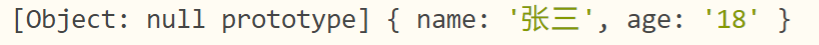

# 第二章：文件系统模块/前后端交互

## 一、fs 模块 

在Node.js中,对文件和文件夹进行操作,比如读取,创建等,用来管理文件的系统的模块
也可以在响应过程中读取指定的文件内容,比如html文件或者jpg文件等,并且把这些作为响应内容

I : input  : 读取   从文件--》程序中

o:output： 写出 从程序中--》文件中

### 1、fs常用API---文件写入：

#### **1.1 同步文件写入：** 

```js
/*文件系统（File System）
		- 文件系统简单来说就是通过Node来操作系统中的文件
		- 使用文件系统，需要先引入fs模块，fs是核心模块，直接引入不需要下载*/
//引入node.js的fs文件读写模块  f file  s system
var fs = require('fs');
/*
	文件操作分为三大步
		1.打开文件
		2.向文件中读取/写入内容
		3.关闭文件
*/
//同步操作
//1.打开文件  
/*
	fs.openSync(path[, flags[, mode]])
		- path 要打开文件的路径
		- flags 打开文件要做的操作的类型
		 	r 只读的
		 	w 可写的
		- mode 设置文件的操作权限，一般不传
	返回值：
		- 该方法会返回一个文件的描述符作为结果，我们可以通过该描述符来对文件进行各种操作
*/
var f = fs.openSync("hello.txt", "w");
//2.向文件中写入内容
/*
fs.writeSync(f, string[, position[, encoding]])
	- f 文件的描述符，需要传递要写入的文件的描述符
	- string 要写入的内容
	- position 写入的起始位置
	- encoding 写入的编码，默认utf-8
*/
fs.writeSync(f, '你好哈哈哈');
//3.关闭文件
//fs.closeSync(f)
//- f 要关闭的文件的描述符
fs.closeSync(f);

```


#### **1.2 异步文件写入：**

```js
var fs = require('fs');
/*
	文件操作分为三大步
		1.打开文件
		2.向文件中读取/写入内容
		3.关闭文件
*/

/*
	//1.异步打开文件
	fs.open(path[, flags[, mode]], callback)
		- path 要打开文件的路径
		- flags 打开文件要做的操作的类型
			r 只读的
			w 可写的
		- mode 设置文件的操作权限，一般不传
		- callback 回调函数  有两个参数 
			-- err 打开失败  错误对象  如果打开成功 err 为null
			-- fd  打开成功的 文件描述符
	异步写入文件：
	fs.write(fd, string[, position[, encoding]], callback)
		fd:文件描述符
		string:写入的内容
		position:写入的位置
		encoding:编码
		callback:回调函数
*/ 
fs.open('hello.txt','a',function(err,fd){
	if(!err){
		//2.当打开文件成功时 调用异步的写入方法 fs.write();
		//for(var i=0;i<10;i++){
			fs.write(fd,'a这是异步写入的代码b',function(err){
				if(!err){
					console.log('写入成功！');
				}else{
					console.log('写入失败！');
				}
			});
		//}
		//3.关闭文件
		fs.close(fd,function(err){
			if(!err){
				console.log('文件已经关闭！')
			}
		});
	}
});
```

#### **1.3 简单文件写入：** 

```js
//引入fs模块
var fs = require('fs');
//简单文件写入不需要像之前一样三步走：直接调用writeFile/writeFileSync方法就可以了
/*
	简单文件写入  同步
		fs.writeFileSync(file, data[, options])
			file:文件描述符 直接使用文件路径表示
			data:要写入的数据
			options:对写入进行的一些设置 一般不设置
	简单文件写入 异步
		fs.writeFile(file, data[, options], callback)
			file:文件描述符 直接使用文件路径表示
			data:要写入的数据
			options:对写入进行的一些设置 一般不设置
			callback:回调函数
				err:错误对象
		options如果进行参数传递，一般是以对象的形式进行：包含三个内容
	    encoding <string> | <null> 默认值: 'utf8'
	    mode <integer> 默认值: 0o666
	    flag <string> 请参阅对文件系统 flags 的支持。 默认值: 'w'。
	追加的同步写入
		fs.appendFileSync(path, data[, options])
	追加的异步写入		
		fs.appendFileSync(path, data[, options],callback)
			path:文件名/文件描述符
			data:写入的数据
			options:写入的一些设置
			callback:回调函数
	options如果进行参数传递，一般是以对象的形式进行：包含三个内容
	    encoding <string> | <null> 默认值: 'utf8'
	    mode <integer> 默认值: 0o666
	    flag <string> 请参阅对文件系统 flags 的支持。 默认值: 'a'。
*/
//简单同步写入
fs.writeFileSync('hello.txt','asdfghj');
//简单异步写入
fs.writeFile('hello.txt','12345',function(err){
	if(!err){
		console.log('写入成功');
	}
}); 
//追加的同步写入
fs.appendFileSync('hello.txt','67890');
//追加的异步写入
fs.appendFile('hello.txt','67890',function(err){
	if(!err){
		console.log('写入成功');
	}
});
```

#### **1.4 流式文件写入** 

```js
/*
	流式文件写入一般适合大文件的写入
*/
/*
	同步、异步、简单文件的写入都不适合大文件的写入，性能较差，容易导致内存溢出
 */
var fs = require("fs");

//流式文件写入
//创建一个可写流
/*
	fs.createWriteStream(path[, options])
		用来创建一个可写流
			path，文件路径
			options 配置的参数
 */
var ws = fs.createWriteStream("hello3.txt");

//可以通过监听流的open和close事件来监听流的打开和关闭
/*
	on(事件字符串,回调函数)
		- 可以为对象绑定一个事件
	once(事件字符串,回调函数)
		- 可以为对象绑定一个一次性的事件，该事件将会在触发一次以后自动失效
*/
ws.once("open",function () {
	console.log("流打开了~~~");
});

ws.once("close",function () {
	console.log("流关闭了~~~");
});

//通过ws向文件中输出内容
ws.write("你好哈哈哈");
ws.write("你好嘿嘿嘿");
ws.write("你好呵呵呵");
ws.write("你好嘻嘻嘻");
ws.write("你好丑丑丑");

//关闭流  此时再使用close关闭就不行了 会导致一部分的内容无法写入，此时需要使用end()方法进行流的关闭，输入完毕后再关。
ws.end();
```

### 2、fs常用API---文件读取

文件读取一样也分为同步文件读取和异步文件读取

同步文件读取，异步文件读取 请参考文件写入，代码基本一致，方法由write()换成read()

简单文件读取也一样，方法由 writeFile()换成 readFile();   

writeFile()===>readFile();

writeFileSync()====>readFileSync();

```
简单文件读取：
fs.readFile():用来读取文件内容的函数
fs.readFileSync();
fs.readdir():读取一个文件夹的内容
fs.writeFile():文件写入内容
fs.mkdir():创建文件夹
fs.stat():检测文件状态
```

#### 2.1 简单文件读取

```js
/*
	1.同步文件读取
	2.异步文件读取
	3.简单文件读取
	 fs.readFile(path[, options], callback)
	 fs.readFileSync(path[, options])
	 	- path 要读取的文件的路径
	 	- options 读取的选项
	 	- callback回调函数，通过回调函数将读取到内容返回(err , data)
	 		err 错误对象
	 		data 读取到的数据，会返回一个Buffer
				为什么会返回一个buffer 而不是字符串?
					因为 读取文件时 不是只能读取文档，也有可能读取的是图片，视频，音频文件！！！
					字符串可以借助toString()方法转换
					但是 图片，视频，音频根本没有办法转换成字符串！！
					所以返回一个Buffer可以提高通用性！！！
	4.流式文件读取
 */

var fs = require("fs");
fs.readFile("7.gif" , function (err , data) {
	if(!err){
		//console.log(data);
		//将data写入到文件中
		fs.writeFile("5.gif",data,function(err){
			if(!err){
				console.log("文件写入成功");
			}
		} );
	}
});
```

#### 2.2 流式文件读取

方式一：比较复杂（了解为主）

```js
/*
	流式文件读取也适用于一些比较大的文件，可以分多次将文件读取到内存中
 */

var fs = require("fs");

//创建一个可读流
var crs = fs.createReadStream("123.mp3");
//创建一个可写流
var cws = fs.createWriteStream("456.mp3");

//监听流的开启和关闭
crs.once("open",function () {
	console.log("打开可读流");
});

crs.once("close",function () {
	console.log("关闭可读流");
	//当把数据读取完毕后，关闭可写流
	ws.end();
});

cws.once("open",function () {
	console.log("打开可写流");
});

cws.once("close",function () {
	console.log("关闭可写流");
});

//如果要读取一个可读流中的数据，必须要为可读流绑定一个data事件，data事件绑定完毕，它会自动开始读取数据
crs.on("data", function (data) {
	//console.log(data);
	//将读取到的数据写入到可写流中
	cws.write(data);
});
```

方式二：

```js
/*
	流式文件读取也适用于一些比较大的文件，可以分多次将文件读取到内存中
 */

var fs = require("fs");

//创建一个可读流
var crs = fs.createReadStream("123.mp3");
//创建一个可写流
var cws = fs.createWriteStream("789.mp3");

//pipe()方法 可以将可读流中的内容直接输出到可写流中,一次性输出
crs.pipe(cws);
```

这种文件的读取方式，我们在工作中能够使用到的次数可能很少，一般都是底层取使用的一些，我们大概做一下了解。

### 3、fs模块其余方法（参考官方文档自行测试）

- 检测path路径是否存在

  - fs.exists(path，callback)

  - fs.existsSync(path) 

- 获取文件相关信息

  - fs.stat(path, callback) 

  - fs.statSync(path) 

- 删除文件

  - fs.unlink(path, callback) 

  - fs.unlinkSync(path)其他操作

- 展示文件列表

  - fs.readdir(path[, options], callback) 

  - fs.readdirSync(path[, options])

- 截断文件

  - fs.truncate(path, len, callback) 

  - fs.truncateSync(path, len) 

- 创建目录

  - fs.mkdir(path[, mode], callback) 

  - fs.mkdirSync(path[, mode])其他操作

- 删除目录/文件

  - fs.rmdir(path, callback) 

  - fs.rmdirSync(path)

- 对文件和目录重命名

  - fs.rename(oldPath, newPath, callback) 

  - fs.renameSync(oldPath, newPath) 

- 监视文件的修改
  - fs.watchFile(filename[, options], listener)

## 二、path模块 

### 1.什么是path模块？

Node.js path 模块提供了一些用于处理文件路径的小工具，我们可以通过以下方式引入该模块：

```js
var path = require("path")
```

### 2.path模块中的常用方法 

- `path.join()`方法  

  ```js
  path.join([...path])
  官网描述：path.join() 方法会将所有给定的 path 片段连接到一起（使用平台特定的分隔符作为定界符），然后规范化生成的路径。
  
  由于windows和linux系统下文件路径分隔符表示不同，windows使用""，linux使用"/"，因此为了考虑兼容平台，node使用path模块下的方法对其进行拼接，内部会做兼容处理。
  
  path.join方法，抛开path，join就是指对字符进行拼接，将path.join()方法中的参数进行拼接，然后处理成路径返回。
  
  举个栗子：
  
  console.log(path.join('a', 'b', 'c')); // a/b/c
  console.log(path.join('a', '/b', '/c')); // a/b/c
  输出是一样的，因为它不仅仅是做字符拼接，还做了规范化路径处理。
  
  console.log(path.join('a', '/b', '/c')); // a/b/c
  console.log(path.join('a', '../b', '/c')); // b/c
  可以看出对其中字符进行了解析，会根据路径规则解析后再拼接返回规范化路径。
  ```

- `path.resolve()`  方法

  ```js
  path.resolve([...paths])
  官网描述：path.resolve方法会将路径或路径片段的序列解析为绝对路径。
  注意：
  	给定的路径序列会从右到左进行处理，后面的每个 path 会被追加到前面，直到构造出绝对路径
  	如果在处理完所有给定的 path 片段之后还未生成绝对路径，则会使用当前工作目录生成的路径会被规范化，并且尾部的斜杠会被删除（除非路径被解析为根目录）
  	零长度的 path 片段会被忽略。
  	如果没有传入 path 片段，则 path.resolve() 会返回当前工作目录的绝对路径。
  	根据以上几点总结一下：path.resolve()方法无论如何会返回一个绝对路径，什么样的路径是绝对路径？以'/'开头的路径是绝对路径。那就是说在解析中，从右往左，当遇到 '/'开头的字符时，立即停止解析，直接返回解析好的路径。
  
  console.log(path.resolve('/a', '/b')) // /b  解析到第一个/b 直接返回 /b
  console.log(path.resolve('/a', 'b')) // /a/b  解析到/a 将解析后的/a/b返回
  	/a/b
  
  
  
  console.log(path.resolve('a', 'b', '/')) // / 解析到 / 直接返回不再进行
  console.log(path.resolve('a', 'b')) // F:\前端备课\node备课\node02\a\b 未解析到 / 所以使用到当前工作目录
  console.log(path.resolve('/a', '../b')) // /b 遵循路径级别规则，解析到/a停止，当解析../向上一级，返回/b
  相对来说path.resolve方法比较难记，但是理解核心path.resolve()方法无论如何会返回一个绝对路径这样就会好记一些。
  可以总结如下记忆：
  	从后向前看
  		字符以 / 开头不会拼接直接返回，因为已经是绝对路径（绝对路径就结束）
  		字符以 ../ 开头拼接前面的路径，且不含最后一节字符（路径解析规则）
  		字符以 ./ 开头直接拼接前面的路径（路径解析规则）
  		如果在处理完所有给定的 path 片段之后还未生成绝对路径，则再加上当前工作目录（最终要绝对路径）
  	在使用中，一般都是配合__dirname生成绝对路径
  
  console.log(path.join(__dirname, './a')); // F:\前端备课\node备课\node02\a
  console.log(path.resolve(__dirname, './a')); // F:\前端备课\node备课\node02\a
  console.log(path.join(__dirname, '../a')); // F:\前端备课\node备课\a
  console.log(path.resolve(__dirname, '../a')); // F:\前端备课\node备课\a
  结果是一样的，前端一般在webpack配置路径的时候会用到，两个都可以用。
  ```

- `path.basename()`方法

  ```
  path.basename() 方法会返回 path 的最后一部分。 尾部的目录分隔符会被忽略。
  
  	path ：string
  	ext ：string 可选的文件扩展名。
  	返回：string
  	
  举个栗子：
  	let str = path.basename('/a/b/c/index.html');
  		返回: index.html
  	let str = path.basename('/a/b/c/index.html','.html');
  		返回: index
  ```
  
- `path.extname()`方法

  ```
  path.extname('路径') 返回路径中文件的扩展名部分
  举个栗子：
  	let str = path.extname('/a/b/c/index.html');
  	console.log(str);//.html
  ```

## 三、http 模块 

express 第三方模块

### 1.http模块介绍  

借助http模块,通过几行代码能实现一个迷你web server 

http模块是Node.js 重要的核心模块


http.Server 类:用来搭建一个服务,帮助接受请求,发送响应
http.ServerResponse 类:响应请求,设置响应的内容等

### 2.nodemon安装使用

​		在之前的案例中 我们每一次修改了代码都要重新启动服务器，太麻烦，nodemon工具可以自动检测代码，当有代码的改动时，nodemon会自动的帮组我们重新启动服务器。

安装命令： `npm i nodemon -g` 

使用：以前都是使用`node server.js`运行服务器  以后 可以直接使用 `nodemon server.js` 之后，只要代码有改动，就会自动重新启动服务。

### 3.使用http模块创建web服务器 

```js
核心步骤：
	1.导入http模块
		const http = require("http");
	2.创建web实例
		调用http模块中的createServer()方法
		const server = http.createServer();
	3.给创建好的server绑定一个‘request’事件
    	server.on('request',(req,resp)=>{
            //当客户端请求这个服务器时，此方法就会调用执行
        })
	4.启动服务器
    	调用listen方法可以启动服务器
        server.listen("端口号",()=>{
            //服务器启动成功后的回调函数
            console.log("your server as running 路径地址")
        })
示例代码：
    const http = require("http");
    let server = http.createServer()
    server.on('request',(req,resp)=>{
        console.log("接收到了请求");
    }).listen(80,()=>{
        console.log("服务器启动成功：http://localhost:80");
    })

也可以这样写：
    const http = require("http");
    let server = http.createServer((req,resp)=>{
        console.log("接收到了请求");
    }).listen(80,()=>{
        console.log("服务器启动成功：http://localhost:80");
    })
一个最简单的服务器就创建成功了！
```

### 3.req对象和resp对象的详解

一次完整的请求 包含两部分内容组成：请求和响应

要处理请求相关的内容 就使用 req对象

要处理响应相关的就用res对象

#### 3.1 request对象

**解释：** 此对象是客户端相关的对象，其中包含了客户端相关的一些信息。

```js
ccomplete	客户端请求是否已经发送完成
httpVersion	HTTP协议版本，通常是1.0或1.1
method		HTTP请求方法，如：GET,POST
url			原始的请求路径
headers		HTTP请求头
trailers	HTTP请求尾(不常见)
connection	当前HTTP连接套接字，为net.Socket的实例
socket		connection属性的别名
client		client属性的别名

常用的  method ,url ,headers
```

#### 3.2 response响应对象

**解释：**响应对象包含的是服务器发回给客户端的浏览器的一些相关信息

```js
res.write(数据); 会发送一块响应主体 这种方式是直接写出数据，但是并没有关闭流；
res.end(data,callback);
	此方法向服务器发出信号，表明已发送所有响应头和主体，该服务器应该视为此消息已完成,响应结束。 必须在每个响应上调用此 
方法，如果指定了 data，则相当于调用 response.write(data) 之后再调用 response.end(callback)。
这种方式是写出最后的数据，并且写出后会关闭流；
```

**解决乱码和跨域问题：**

```js
res.writeHead(200,{
	//设置响应的编码 ，防止乱码
	'content-type':'text/html;charset=utf-8',
	//设置跨域
	'Access-Control-Allow-Origin':'*'
});
```

#### 3.3 url的处理 get请求的方式

客户端在发送get请求时，会请求不同的数据，那么会传入不同的请求地址：服务器要根据不同的请求地址返回不同的内容

- 比如 http://localhost:8000/login
- 比如 http://localhost:8000/products

```js
const http = require("http");
const url = require("url");
let server = http.createServer((req,resp)=>{
	if(req.url === '/login'){
		res.end("欢迎登录！")
	}else if(req.url === '/users'){
		res.end("获取所有的users信息");
	}
}).listen(80,()=>{
	console.log("服务器启动成功：http://localhost:80");
})
我们可以根据发送的不同的路径判断应该返回什么样的内容！！
```

##### url的内容解析：

如果用户发送的地址中携带一些额外的参数怎么办？
类似这样的路径： http://localhost:8000/login?name=why&password=123;
这个时候，url的值是 /login?name=why&password=123； n 我们如何对它进行解析呢？**使用内置模块url：**

```
内置模块url中含有一个parse()方法，此方法可以把url字符串转换成对象：
例如：
	let obj = url.parse(req.url);
	console.log(obj);
	obj的输出结果如下图所示：
```


```js
我们可以通过解构赋值把query和pathname从格式化后的obj对象中取出来：
let {query,pathname} = url.parse(req.url);
```

但是此时的query仍然是一个字符串，如果想从其中获取出我们需要的单个数据

- 传统方式：只能通过字符串操作的相关api,太麻烦了。
- 常用方式：可以通过一个包 `querystring` 这个包中提供有方法可以帮我们把字符串直接格式化为对象类型。

##### `querystring` 包的使用：

```js
1.安装querystring包
	npm i querystring
2.导入包
	const qs = require("querystring")
3.使用包中的parse()方法 把字符串解析为对象
	let {query,pathname} = url.parse(req.url)
	let str = qs.parse(query);
```



然后我们就可以开心的使用这些参数操作了。

#### 3.4 接收post请求 

​		当我们从客户端发送的是post请求时，携带的数据在请求体中，无法直接获取，此时可以借助`req`对象监听的`data`事件来完成操作。

```js
let server = http.createServer((req,res)=>{
	req.setEncoding("utf-8")
	req.on('data',(data)=>{
		console.log(data.toString());
		console.log(qs.parse(data.toString()));
	})
	res.end("111");
}).listen(80,()=>{
	console.log("服务器启动成功：http://localhost:80");
})
```

#### 3.5 前端向后端发送请求的数据格式问题

```
1.发送get请求  参数直接携带在路径中  我们称为  query string 查询参数
2.发送post请求：
	I.普通表单发送post  格式为 x-www-form-urlencoded格式
	II.带有文件上传的表单发送 格式为 form-data格式
		需要在表单中添加一个属性 enctype="multipart/form-data"
	III.发送ajax请求 可以直接以 json对象的格式发送
```


```
在request对象的header中也包含很多有用的信息，客户端会默认传递过来一些信息：
content-type是这次请求携带的数据的类型：
application/json表示是一个json类型；
text/plain表示是文本类型；
application/xml表示是xml类型；
multipart/form-data表示是上传文件；
content-length：文件的大小和长度
accept-encoding：告知服务器，客户端支持的文件压缩格式，比如js文件可以使用gzip编码，对应 .gz文件；
accept：告知服务器，客户端可接受文件的格式类型；
user-agent：客户端相关的信息；
```

**postman工具 测试接口：** **apifox**  


## 四、总结与作业

学会搭建简单的服务器。