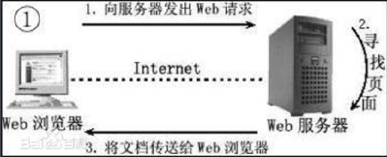
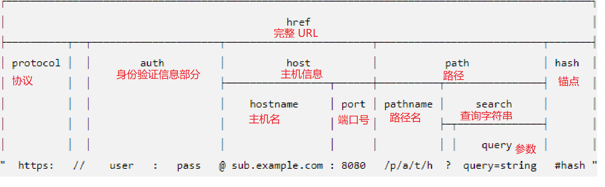
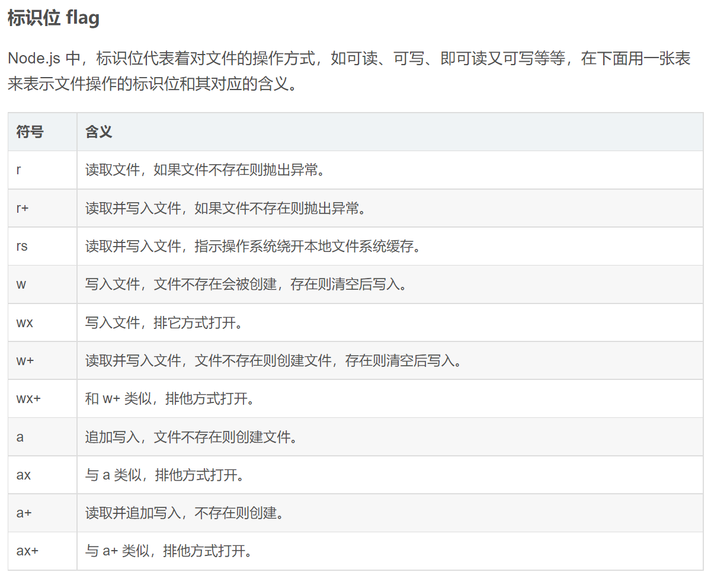
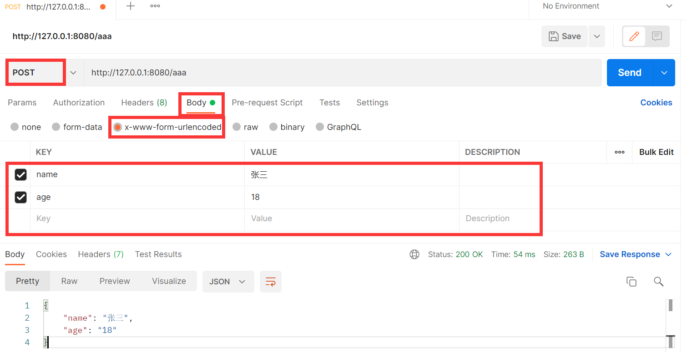
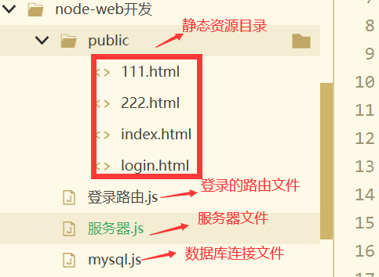
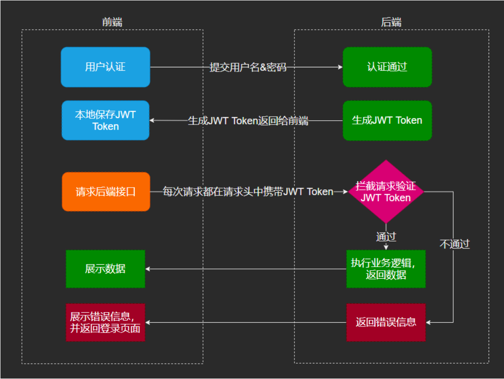
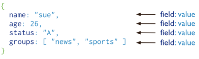
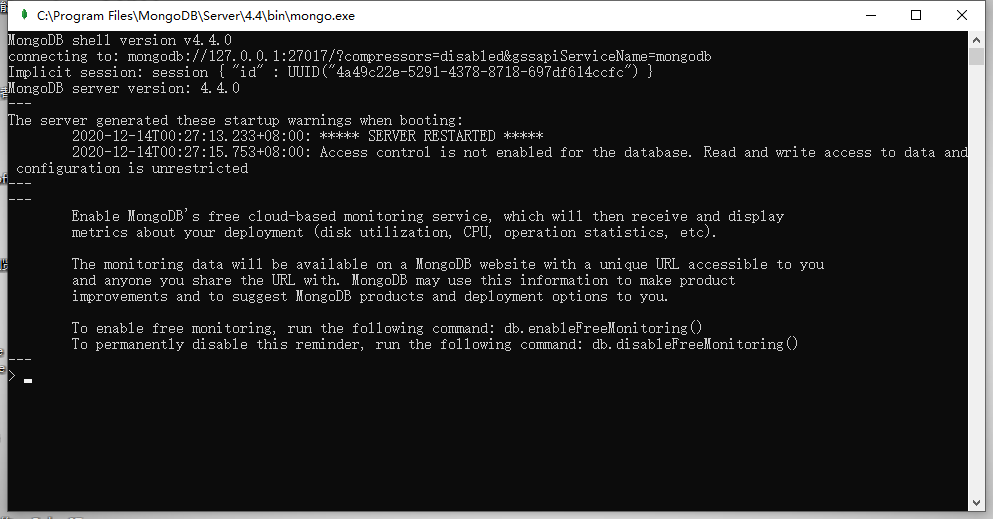

# Node.js

# 第二章：搭建后台

## http模块

- 借助http模块,通过几行代码能实现一个迷你web server 
- http模块是Node.js重要的核心模块
- 

http.Server 类:用来搭建一个服务,帮助接受请求,发送响应
http.ServerResponse 类:响应请求,设置响应的内容等

```js
//引入http包
let http = require('http');
//http.createServer 返回http.Server实例
let serve = http.createServer(function(req,res){
    // res:response 服务器的响应
    // req:request 接受的前端的请求
    // 设置响应头内容
    res.writeHead(200,{
        'content-type':'text/html;charset=utf-8',
        'Access-Control-Allow-Origin':'*'
    });

    //res.write(); //write() 会发送一块响应主体

    res.end();
    //res.end(data,callback);
    //此方法向服务器发出信号，表明已发送所有响应头和主体，该服务器应该视为此消息已完成,响应结束。 必须在每个响应上调用此 response.end() 方法。
    //如果指定了 data，则相当于调用 response.write(data) 之后再调用 response.end(callback)。
    //如果指定了 callback，则当响应流完成时将调用它
});
//serve.listen(端口号，主机名，callback)启动 HTTP 服务器用于监听连接;

```

[翻阅官方提供的API文档,养成翻阅文档的习惯,多写,多练](http://nodejs.cn/api/http.html)

## url模块

### url模块作用

- 对请求的URL进行处理和解析

- 也可以对URL进行格式化的操作

-  使用方法如下：

  ```js
  const url = require('url');
  ```

URL 字符串是结构化的字符串，包含多个含义不同的组成部分。 解析字符串后返回的 URL 对象，每个属性对应字符串的各个组成部分。



### url模块常用API

url.parse():将一个url字符串解析并且返回一个url对象
url.format():对一个url对象进行格式化操作,返回一个url字符串
url.resolve():返回一个”from/to”的字符串,相当于对路径进行拼接

```js
let http = require('http');
let url = require('url');

let person = [
  {name:'李逵',age:18,job:'杀老虎'},
  {name:'高俅',age:38,job:'踢球'},
  {name:'高俅',age:38,job:'宦官'},
  {name:'宋江',age:28,job:'梁山扛把子'},
  {name:'西门庆',age:25,job:'不干好事'}
];

http.createServer((req,res)=>{
  if(req.url === '/favicon.ico') return ;
  res.writeHead(200, {
    'Content-type': 'text/plain;charset=utf-8',
    'Access-Control-Allow-Origin': '*'
  });
  // let url_obj = url.parse(req.url); 
  // let names = url_obj.query.split('=')[1]
  // console.log(url_obj, names, decodeURI(names));
  let url_obj = url.parse(req.url,true); 
  if('name' in url_obj.query){
    let result = person.filter((item)=>{
      return item.name.includes(url_obj.query.name);
    });
    res.write(JSON.stringify(result));
  }
    
    
  //WHATWG url
  // let url_ = new URL(req.url,'http:127.0.0.1:2020');
  // console.log(url_.searchParams.get('name'));
    
    
  res.end();
}).listen(2020,'127.0.0.1',()=>{
  console.log('running.......');
});
```

```JS
// format()   格式化一个url
  let url_str = url.format({
    protocol:'http',
    hostname:'www.qianduan0371.com',
    port:12345,
    pathname:'/index/demo',
    query:{
      name:"lisi",
      age:12
    },
    hash:'format_demo'
  });
  res.write(url_str);
	
//resolve
  let url1 = url.resolve('/one/two/three', 'four'); // '/one/two/four'
  let url2 = url.resolve('http://example.com/', '/one'); // 'http://example.com/one'
  let url3 = url.resolve('http://example.com/one', '/two'); // 'http://example.com/two'
  console.log(url1,url2,url3);
```

## 什么是node.js路由

通过请求的URL路径和其他需要的 GET 及 POST 参数来区分不同的请求,随后路由需要根据这些数据来执行相应的代码(路由就可以通过这些URL路径和参数准确找到对应功能代码上)。因此，我们需要查看 HTTP 请求，从中提取出请求的 URL 以及 GET/POST 参数

```
//例如
http://127.0.0.1:2020/login       登录
http://127.0.0.1:2020/register    注册
```

```js
案例功能：
//例如
http://127.0.0.1:2020/add       添加
http://127.0.0.1:2020/search    查询
添加用户信息（用户名、年龄） 
查询用户（用户名）
接口地址：http://127.0.0.1:2020/add(search)
请求方式：get
参数：
	用户名：name
    年龄：age
```

## 作业：

见资料包作业：《后台搭建》上机作业

# 第三章：文件系统模块/前后端交互

## fs模块

在Node.js中,对文件和文件夹进行操作,比如读取,创建等,用来管理文件的系统的模块
也可以在响应过程中读取指定的文件内容,比如html文件或者jpg文件等,并且把这些作为响应内容

### 一、fs常用API---文件写入：

#### **1.1 同步文件写入：**

```js
/*文件系统（File System）
		- 文件系统简单来说就是通过Node来操作系统中的文件
		- 使用文件系统，需要先引入fs模块，fs是核心模块，直接引入不需要下载*/
//引入node.js的fs文件读写模块  f file  s system
var fs = require('fs');
/*
	文件操作分为三大步
		1.打开文件
		2.向文件中读取/写入内容
		3.关闭文件
*/
//同步操作
//1.打开文件  
/*
	fs.openSync(path[, flags[, mode]])
		- path 要打开文件的路径
		- flags 打开文件要做的操作的类型
		 	r 只读的
		 	w 可写的
		- mode 设置文件的操作权限，一般不传
	返回值：
		- 该方法会返回一个文件的描述符作为结果，我们可以通过该描述符来对文件进行各种操作
*/
var f = fs.openSync("hello.txt", "w");
//2.向文件中写入内容
/*
fs.writeSync(fd, string[, position[, encoding]])
	- fd 文件的描述符，需要传递要写入的文件的描述符
	- string 要写入的内容
	- position 写入的起始位置
	- encoding 写入的编码，默认utf-8
*/
fs.writeSync(f, '你好哈哈哈');
//3.关闭文件
//fs.closeSync(fd)
//- fd 要关闭的文件的描述符
fs.closeSync(f);

```



#### **1.2 异步文件写入：**

```js
var fs = require('fs');
/*
	文件操作分为三大步
		1.打开文件
		2.向文件中读取/写入内容
		3.关闭文件
*/

/*
	//1.异步打开文件
	fs.open(path[, flags[, mode]], callback)
		- path 要打开文件的路径
		- flags 打开文件要做的操作的类型
			r 只读的
			w 可写的
		- mode 设置文件的操作权限，一般不传
		- callback 回调函数  有两个参数 
			-- err 打开失败  错误对象  如果打开成功 err 为null
			-- fd  打开成功的 文件描述符
	异步写入文件：
	fs.write(fd, string[, position[, encoding]], callback)
		fd:文件描述符
		string:写入的内容
		position:写入的位置
		encoding:编码
		callback:回调函数
*/ 
fs.open('hello.txt','a',function(err,fd){
	if(!err){
		//2.当打开文件成功时 调用异步的写入方法 fs.write();
		//for(var i=0;i<10;i++){
			fs.write(fd,'a这是异步写入的代码b',function(err){
				if(!err){
					console.log('写入成功！');
				}else{
					console.log('写入失败！');
				}
			});
		//}
		//3.关闭文件
		fs.close(fd,function(err){
			if(!err){
				console.log('文件已经关闭！')
			}
		});
	}
});
```

#### **1.3 简单文件写入：** 

```js
//引入fs模块
var fs = require('fs');
//简单文件写入不需要像之前一样三步走：直接调用writeFile/writeFileSync方法就可以了
/*
	简单文件写入  同步
		fs.writeFileSync(file, data[, options])
			file:文件描述符 直接使用文件路径表示
			data:要写入的数据
			options:对写入进行的一些设置 一般不设置
	简单文件写入 异步
		fs.writeFile(file, data[, options], callback)
			file:文件描述符 直接使用文件路径表示
			data:要写入的数据
			options:对写入进行的一些设置 一般不设置
			callback:回调函数
				err:错误对象
		options如果进行参数传递，一般是以对象的形式进行：包含三个内容
	    encoding <string> | <null> 默认值: 'utf8'
	    mode <integer> 默认值: 0o666
	    flag <string> 请参阅对文件系统 flags 的支持。 默认值: 'w'。
	追加的同步写入
		fs.appendFileSync(path, data[, options])
	追加的异步写入		
		fs.appendFileSync(path, data[, options],callback)
			path:文件名/文件描述符
			data:写入的数据
			options:写入的一些设置
			callback:回调函数
	options如果进行参数传递，一般是以对象的形式进行：包含三个内容
	    encoding <string> | <null> 默认值: 'utf8'
	    mode <integer> 默认值: 0o666
	    flag <string> 请参阅对文件系统 flags 的支持。 默认值: 'a'。
*/
//简单同步写入
fs.writeFileSync('hello.txt','asdfghj');
//简单异步写入
fs.writeFile('hello.txt','12345',function(err){
	if(!err){
		console.log('写入成功');
	}
}); 
//追加的同步写入
fs.appendFileSync('hello.txt','67890');
//追加的异步写入
fs.appendFile('hello.txt','67890',function(err){
	if(!err){
		console.log('写入成功');
	}
});
```

#### **1.4 流式文件写入**

```js
/*
	流式文件写入一般适合大文件的写入
*/
/*
	同步、异步、简单文件的写入都不适合大文件的写入，性能较差，容易导致内存溢出
 */
var fs = require("fs");

//流式文件写入
//创建一个可写流
/*
	fs.createWriteStream(path[, options])
		用来创建一个可写流
			path，文件路径
			options 配置的参数
 */
var ws = fs.createWriteStream("hello3.txt");

//可以通过监听流的open和close事件来监听流的打开和关闭
/*
	on(事件字符串,回调函数)
		- 可以为对象绑定一个事件
	once(事件字符串,回调函数)
		- 可以为对象绑定一个一次性的事件，该事件将会在触发一次以后自动失效
*/
ws.once("open",function () {
	console.log("流打开了~~~");
});

ws.once("close",function () {
	console.log("流关闭了~~~");
});

//通过ws向文件中输出内容
ws.write("你好哈哈哈");
ws.write("你好嘿嘿嘿");
ws.write("你好呵呵呵");
ws.write("你好嘻嘻嘻");
ws.write("你好丑丑丑");

//关闭流  此时再使用close关闭就不行了 会导致一部分的内容无法写入，此时需要使用end()方法进行流的关闭，输入完毕后再关。
ws.end();
```

### 二、fs常用API---文件读取

文件读取一样也分为同步文件读取和异步文件读取

同步文件读取，异步文件读取 请参考文件写入，代码基本一致，方法由write()换成read()

简单文件读取也一样，方法由 writeFile()换成 readFile();   

writeFile()===>readFile();

writeFileSync()====>readFileSync();

```
简单文件读取：
fs.readFile():用来读取文件内容的函数
fs.readFileSync();
fs.readdir():读取一个文件夹的内容
fs.writeFile():文件写入内容
fs.mkdir():创建文件夹
fs.stat():检测文件状态
```


#### 2.1 简单文件读取

```js
/*
	1.同步文件读取
	2.异步文件读取
	3.简单文件读取
	 fs.readFile(path[, options], callback)
	 fs.readFileSync(path[, options])
	 	- path 要读取的文件的路径
	 	- options 读取的选项
	 	- callback回调函数，通过回调函数将读取到内容返回(err , data)
	 		err 错误对象
	 		data 读取到的数据，会返回一个Buffer
				为什么会返回一个buffer 而不是字符串?
					因为 读取文件时 不是只能读取文档，也有可能读取的是图片，视频，音频文件！！！
					字符串可以借助toString()方法转换
					但是 图片，视频，音频根本没有办法转换成字符串！！
					所以返回一个Buffer可以提高通用性！！！
	4.流式文件读取
 */

var fs = require("fs");
fs.readFile("7.gif" , function (err , data) {
	if(!err){
		//console.log(data);
		//将data写入到文件中
		fs.writeFile("5.gif",data,function(err){
			if(!err){
				console.log("文件写入成功");
			}
		} );
	}
});
```

#### 2.2 流式文件读取

方式一：比较复杂（了解为主）

```js
/*
	流式文件读取也适用于一些比较大的文件，可以分多次将文件读取到内存中
 */

var fs = require("fs");

//创建一个可读流
var crs = fs.createReadStream("123.mp3");
//创建一个可写流
var cws = fs.createWriteStream("456.mp3");

//监听流的开启和关闭
crs.once("open",function () {
	console.log("打开可读流");
});

crs.once("close",function () {
	console.log("关闭可读流");
	//当把数据读取完毕后，关闭可写流
	ws.end();
});

cws.once("open",function () {
	console.log("打开可写流");
});

cws.once("close",function () {
	console.log("关闭可写流");
});

//如果要读取一个可读流中的数据，必须要为可读流绑定一个data事件，data事件绑定完毕，它会自动开始读取数据
crs.on("data", function (data) {
	//console.log(data);
	//将读取到的数据写入到可写流中
	cws.write(data);
});
```

方式二：

```js
/*
	流式文件读取也适用于一些比较大的文件，可以分多次将文件读取到内存中
 */

var fs = require("fs");

//创建一个可读流
var crs = fs.createReadStream("123.mp3");
//创建一个可写流
var cws = fs.createWriteStream("789.mp3");

//pipe()方法 可以将可读流中的内容直接输出到可写流中,一次性输出
crs.pipe(cws);
```

这种文件的读取方式，我们在工作中能够使用到的次数可能很少，一般都是底层取使用的一些，我们大概做一下了解。

### 三、fs模块其余方法（参考官方文档自行测试）

- 检测path路径是否存在

  - fs.exists(path，callback)

  - fs.existsSync(path) 

- 获取文件相关信息

  - fs.stat(path, callback) 

  - fs.statSync(path) 

- 删除文件

  - fs.unlink(path, callback) 

  - fs.unlinkSync(path)其他操作

- 展示文件列表

  - fs.readdir(path[, options], callback) 

  - fs.readdirSync(path[, options])

- 截断文件

  - fs.truncate(path, len, callback) 

  - fs.truncateSync(path, len) 

- 创建目录

  - fs.mkdir(path[, mode], callback) 

  - fs.mkdirSync(path[, mode])其他操作

- 删除目录/文件

  - fs.rmdir(path, callback) 

  - fs.rmdirSync(path)

- 对文件和目录重命名

  - fs.rename(oldPath, newPath, callback) 

  - fs.renameSync(oldPath, newPath) 

- 监视文件的修改
  - fs.watchFile(filename[, options], listener)

## 静态资源管理

问题:启动服务,在浏览器里无法直接查看图片,CSS等静态资源
解决方案:通过fs模块解决静态文件加载的问题

案例：

## Get请求

參考nodejs路由功能

## 作业： 

1. 实现注册，登录  get
2. 把用户名和密码 保存到json文件中
3. 登录成功后，响应一张图片，前端显示。

# 第四章：第三方模块


## post请求

要求：

- 掌握form表单POST请求

- 掌握Ajax POST请求

- ```js
  const http = require('http');
  const querystring = require('querystring');
  
  http.createServer((req,res)=>{
    if(req.url === '/favicon.ico') return;
    // console.log(req);
    if(req.method.toUpperCase() === 'POST'){
      // 接收post 提交上来的数据
      // 数据接收 分段接收。
      // 会触发俩个事件
      var alldata = '';
      req.on('data',function(v){
        alldata+=v;
      });
      req.on('end',function(){
        alldata = querystring.parse(alldata);
        console.log(alldata);
        res.end(JSON.stringify(alldata));
      });
    }
  }).listen(12345,'127.0.0.1',()=>{
    console.log('running......');
  })
  ```

- 文件上传    

- ```
  上机演示案例
  借助 formidable 第三方模块处理接收文件
  ```

## 作业：

实现post请求文件上传

# 第五章：[Express框架](https://www.expressjs.com.cn/)

基于 [Node.js](https://nodejs.org/en/) 平台，快速、开放、极简的 Web 开发框架。

## 掌握知识点

## 一、 安装 , 使用 , 访问路径(绑定处理函数) , 托管静态资源

​		执行命令：`npm i express` 

```js
//1.安装并引入express模块
const express = require('express');
//2.调用express() 方法来完成一个服务器
let app = express();
//可以对服务器接收的请求进行监听
//监听get请求
/*
	app.get(url,()=>{});
		url表示监听的路径
		后边是当访问该路径时的回调函数
*/
app.get('/aaa',(req,resp)=>{
	//可以通过req.query对象 来获取请求时客户端发送的数据信息
	let obj = req.query;
	resp.send(obj);
	
}); 
/*
	可以通过 /bbb/:id的形式来匹配动态参数
	可以通过req.params来获取动态的参数
	客户端在访问路径时，只需要直接在路径后追加 参数就可以了
		http://127.0.0.1:8080/bbb/1/张三
*/

app.get('/bbb/:id/:name',(req,resp)=>{
	//可以通过req.query对象 来获取请求时客户端发送的数据信息
    //req.query主要用于接收 get请求时 拼接在路径后边的 参数字符串
	let obj = req.params;
	resp.send(obj);
	
}); 
//监听post请求
app.post('/aaa',(req,resp)=>{
	let obj = {
        name:"张三",
        age"18"
    };
	resp.send(obj);
});
//托管静态资源 pub就是托管的目录
/*
	打开浏览器直接访问 http://127.0.0.1:8080会默认打开 pub目录下的index.html页面
	如果不想默认打开index.html，可以设置第二个参数
		app.use(express.static('./public',{index:'login.html'}));
	如果想访问别的资源 请在路径后追加 要访问的文件的名字
		例如:http://127.0.0.1:8080/aaa.html
	如果有多个静态资源目录  请多次调用
		app.use(express.static('url'))方法 
		会按照上下的顺序去查找内容。
*/
app.use(express.static('pub'));
/*
	app.use('/ccc'.express.static('sta'));
		如果在use中添加了第一个参数，/ccc
		此时 就相当于在以后访问sta静态资源文件下的内容的时候，必须要要加上/ccc的路径
		http://127.0.0.1:8080/ccc/aaa.html
*/
app.use('/ccc',express.static('sta'));
//3.给app这个服务器绑定端口和回调函数
app.listen(8080,()=>{
	console.log('express server running at http://127.0.0.1:8080');
})
```

## 二、 nodemon安装使用

​		在之前的案例中 我们每一次修改了代码都要重新启动服务器，太麻烦，nodemon工具可以自动检测代码，当有代码的改动时，nodemon会自动的帮组我们重新启动服务器。

安装命令： `npm i nodemon -g`

使用：以前都是使用`node server.js`运行服务器  以后 可以直接使用 `nodemon server.js` 之后，只要代码有改动，就会自动重新启动服务。

## 三、 路由

### 3.1 路由的简单使用

路由：路由（routing）是指分组从源到目的地时，决定端到端路径的网络范围的进程 [1] 。路由工作在[OSI参考模型](https://baike.baidu.com/item/OSI参考模型)第三层——[网络层](https://baike.baidu.com/item/网络层/4329439)的[数据包](https://baike.baidu.com/item/数据包/489739)转发设备。

在express中路由是指客户端的请求和服务器处理函数之间的关系。由三部分组成，分别是请求的类型，请求的URL地址，处理函数。`app.METHOD(path,handle)`

```js
路由示例：
app.get('/bbb',(req,resp)=>{
	resp.send(obj);
}); 

app.post('/aaa',(req,resp)=>{
	resp.send(obj);
});
当客户端的请求到达服务器，就会经过路由的匹配，来确定该请求的处理函数。按照先后顺序匹配。
```

### 3.2 路由的模块化

在一个完整的项目中可能会有很多的路由，如果用上边的方式，我们会把路由也就是服务器接收请求的模块跟服务器的搭建模块耦合在一起，不符合我们面向对象的开发思想（模块化开发思想），所以我们可以把路由单独的去做一个模块。增强代码的可读性，可维护性。

**定义路由模块单独的js文件：**

```js
//路由模块
//1.导入express
const express = require('express');
//2.创建整体的路由对象
const router = express.Router();
//3.绑定具体的路由（请求的路径）
router.get('/aaa',(req,resp)=>{
	resp.send('这里是get请求');
});
router.post('/aaa',(req,resp)=>{
	resp.send('这里是post请求');
});
//4.向外暴漏路由对象
module.exports = router;
```

**引入使用路由模块：**

```js
//1.引入express模块
const express = require('express');
//2.创建服务器
let app = express();

//引入路由模块
const router = require('./路由模块');
//使用用路由模块
//app.use(router);
//此处如果想给路由添加一个前缀 类似于 处理静态资源模块的方法,这样 以后访问路由就要加上/user路径了。
app.use('/user',router);
//3.绑定端口
app.listen(8080,()=>{
	console.log('your server running at http://127.0.0.1:8080')
});
```

app.use()方法的作用用来注册全局中间件：

### 3.3 路由的中间件

什么是中间件：可以把它当作是一个**拦截器**。就像工厂的流水线一样，第一步处理完成之后才能进行第二步的处理，第二步的处理之后，才能进行第三步的处理，一直到成品完成。也就是说我们的请求有可能没办法一次完成，中间还需要经过很多别的步骤来处理，这些来处理的步骤就是中间件，====》等同于我们的工具函数（本质上就是一个函数）。

#### 3.3.1 全局中间件：

**定义格式：** 

```js
//1.引入express模块
const express = require('express');
//2.创建服务器
let app = express();
let fun = function(req,resp,next){
	//1.此处可以定义中间件的具体处理步骤
    。。。。
    //2.此处当执行完毕处理步骤后，一定调用next();
    next();//标识当前中间件已经处理完毕，可以交由下一个中间件来处理。
}
//通过app.use()方法注册全局中间件，也就是不管怎样请求，让中间件都能生效
//也可以直接把fun函数写在app.use()括号内。
app.use(fun);

app.get('/bbb',(req,resp)=>{
	resp.send(obj);
}); 

app.post('/aaa',(req,resp)=>{
	resp.send(obj);
});
//3.绑定端口
app.listen(8080,()=>{
	console.log('your server running at http://127.0.0.1:8080')
});
观察结果发现：在请求的回调函数执行之前会先执行 中间件定义的内容。

```

**如果是定义多个中间件，再次定义就可以，会按照中间件定义的顺序一次执行。**

#### 3.3.2 局部中间件：

只会在某一次或几次请求中会执行，需要我们自己去定义。

```js
const express = require('express');

let app = express();
//定义中间件
let fun1 = (req,resp,next)=>{
	console.log('中间件一执行了');
	next();
}
//把fun1中间件直接写在去顶的访问路径监听函数中(路由中)。
app.get('/aaa',fun1,(req,resp)=>{
	resp.send('你好哈哈哈get请求');
});
app.post('/aaa',(req,resp)=>{
	resp.send('你好哈哈哈post请求');
});
app.listen(9090,()=>{
	console.log('express server running at http://127.0.0.1:9090');
});
运行观察结果发现：只有get请求的/aaa会执行中间件fun1,post请求的/aaa不会执行中间件fun1
格式：可以同时绑定调用多个中间件  可以带上[] 也可以不带
app.get('/aaa',fun1,fun2,(req,resp)=>{
	resp.send('你好哈哈哈get请求');
});
```

中间件也可以直接绑定到Router上边：

```js
//1.引入express模块
const express = require('express');
//2.创建服务器
let app = express();

//引入路由模块
const router = require('./路由模块');


//通过router.use();把中间件绑定到路由对象上
router.use(function(req,resp,next){
    //1.中间件代码
    ......
    //2.调用next()
    next();
});

//使用用路由模块
app.use(router);

//3.绑定端口
app.listen(8080,()=>{
	console.log('your server running at http://127.0.0.1:8080')
});
```

#### 3.3.3 错误中间件

概念：专门用来捕获项目运行过程中出现的错误，异常。防止项目因为某一个异常而崩溃。

格式：

```
同样是一个function 处理函数，function(err,req,resp,next){}包含4个参数。
```

使用：

```js
const express = require('express');
let app = express();


app.get('/aaa',(req,resp)=>{
	//模拟错误
	throw '出错喽';
	resp.send('请求成功');
});
//定义错误中间件
let error = (err,req,resp,next)=>{
	console.log('错误中间件执行了');
	resp.send('出错了，兄弟');
	next();
}
app.use(error);
app.listen(8080,()=>{
	console.log('127.0.0.1:8080');
});
注意：错误中间件比较特殊 必须把它放在所有路由的下边才可以执行，否则不会被执行。
```

#### 3.3.4 express内置中间件

从express4.16.0之后的版本内置三个中间件：

- express.static中间件，用于托管静态资源

  ```js
  app.use(express.static());
  ```

- express.json中间件，用于解析json格式的请求体数据

  ```js
  app.use(express.json());
  ```

  示例：

  ```js
  const express = require('express');
  let app = express();
  //定义json解析中间件
  app.use(express.json());
  
  app.post('/aaa',(req,resp)=>{
  	console.log('请求成功');
  	//此处可以通过req.body来接收post请求，请求体中的数据
  	//如果没有配置 json解析中间件 会接收到undefined/""
  	console.log(req.body);
  	resp.send(req.body);
  });
  app.listen(8080,()=>{
  	console.log('127.0.0.1:8080');
  });
  ```

- express.urlencoded解析URL-encoded格式的请求体数据

  正常的form表单发送的都是urlencoded格式的数据。

  ```js
  app.use(express.urlencoded({extended:false}));
  ```

  示例：

  ```js
  const express = require('express');
  let app = express();
  //定义json解析中间件
  //app.use(express.json());
  
  //定义urlencoded中间件 来解析表单中urlencoded格式的数据
  app.use(express.urlencoded({extended:false}));
  app.post('/aaa',(req,resp)=>{
  	console.log('请求成功');
  	//此处可以通过req.body来接收post请求，请求体中的数据
  	//如果没有配置 urlencoded解析中间件 会接收到undefined/""
  	console.log(req.body);
  	resp.send(req.body);
  });
  app.listen(8080,()=>{
  	console.log('127.0.0.1:8080');
  });
  ```

  

注意：在express4之前处理数据需要引入body-parser模块，使用方式跟以上一样，不过在express4之后json()方法和urlencoded()方法已经被继承到了express模块中，所以使用的时候不需要再引入body-parser模块了，能满足我们的大多数需求。

### 3.4 使用cors中间件模块解决跨域问题

​		cors是由一些列http的响应头组成，这些响应头信息来决定浏览器是否阻止前端js代码跨域获取资源，浏览器的同源安全策略默认会阻止跨域，但是如果接口配置了相关的http相应头信息就可以解除跨域问题。

#### 3.4.1 通过cors中间件解决跨域问题。

1. 首先安装cors模块 `npm i cors`;
2. 导入中间件 `const cors = require('cors');`
3. 注册cors中间件 `app.use(cors());` 

示例：

```js
node.js搭建服务器
const express = require("express");
let app = express();

//配置跨域中间件 解决跨域问题
const cors = require('cors');
app.use(cors());

app.get('/user',(req,resp)=>{
	resp.send('你好哈哈哈');
})
app.listen(80,()=>{
	console.log('your server at http://127.0.0.1:80');
});
```

html测试页面：

```html
	<button type="button" onclick="aaa()">点我测试跨域</button>
	<script type="text/javascript">
		function aaa(){
			let ajax_ = new XMLHttpRequest();
			ajax_.open('get','http://127.0.0.1:80/user',true);
			ajax_.send();
			ajax_.onreadystatechange = function(){
				if(ajax_.status==200 && ajax_.readyState==4){
					console.log(ajax_.responseText);
				}
			}
		}
	</script>
```

#### 3.4.2 通过配置http响应头解决跨域问题

- cors响应头信息 Access-Control-Allow-Origin

  ```js
  Access-Control-Allow-Origin,'具体网址'| *;
  如果写具体网址，标识对这个网址开放跨域，*标识对所有网址都开放跨域
  
  resp.setHeader('Access-Control-Allow-Origin','*');
  ```

- cors响应头信息 Access-Control-Allow-Methods

  默认情况下只支持get,post,head请求，如果你想发起put,delete,options等请求方法，需要设置该请求头信息

  ```js
  //只允许get,post,put,delete,options请求方式
  resp.setHeader('Access-Control-Allow-Methods','get,post,put,delete,options');
  //允许所有的请求方式
  resp.setHeader('Access-Control-Allow-Methods','*');
  ```

  配置案例：express内置的all方法完成跨域，也是一个中间件
  
  ```js
  //设置该服务器可跨域访问
  /* app.all('*', function (req, res, next) {
      //允许http://xxx.xx.xx/可跨
      res.header('Access-Control-Allow-Origin', '*');
      res.header('Access-Control-Allow-Headers', 'Content-Type');
      res.header('Access-Control-Allow-Methods', '*');
      res.header('Content-Type', 'application/json;charset=utf-8');
      next();
  }); */
  ```
  
  

## 作业：


# 第六章：node操作mysql数据库

## 一、安装mysql

同mysql课程。

## 二、在node中使用mysql模块

### 2.1 安装Mysql模块

执行命令`npm i mysql` ;

### 2.2 配置连接Mysql服务

```js
//1.导入mysql模块
const mysql = require('mysql');
//2.建立与mysql之间的连接
const db = mysql.createPool({
	host:'127.0.0.1',//数据库的ip地址
	user:'root',//用户名
	password:'',//密码
	database:'ceshi'//要操作的数据库
})
```

### 2.3 连接mysql并且操作数据

#### 2.3.1 查询

```js
//1.导入mysql模块
const mysql = require('mysql');
//2.建立与mysql之间的连接
const db = mysql.createPool({
	host:'127.0.0.1',//数据库的ip地址
	user:'root',//用户名
	password:'',//密码
	database:'ceshi'//要操作的数据库
})
//3.通过Mysql模块提供的query方法测试是否连接成功
//sql语句根据自己的需求去定义
db.query('select * from user',(err,results)=>{
	if(err) throw 'mysql连接失败';
	console.log(results);
})
```

#### 2.3.2 新增

```js
//新增操作方式一
sql语句的插入语句中可以直接把数据直接写死进去，但是这样不符合我们的要求，我们要从客户端来操作数据库 数据应该是可以发生变化的所以采用第二种方式
db.query('insert into stu1 values(6,"老白",18)',(err,results)=>{
	if(err) throw `mysql连接失败,${err.message}`;
	if(results.affectedRows == 1){
		console.log('数据新增成功');
	}
})
//方式二
以?号当作占位符，把需要的数据放到一个数组中去，可以一一对应
db.query('insert into stu1 values(?,?,?)',[7,"老秦",20],(err,results)=>{
	if(err) throw `mysql连接失败,${err.message}`;
	if(results.affectedRows == 1){
		console.log('数据新增成功');
	}
})
affectedRows 表示数据操作后返回的受影响的行数。

//方式三
/*
	当要插入的数据的行非常多时，可能会写很多的？和字段名
	此时可以简单写法
	注意：必须是对象中的属性名和数据表中的字段名保持一致才可以！！！
*/
db.query('insert into stu1 set ?',{id:9,name:'老老老',age:18},(err,results)=>{
	if(err) throw `mysql连接失败,${err.message}`;
	if(results.affectedRows == 1){
		console.log('数据新增成功');
	}
	console.log(results)
})
```

### 2.3.3 修改和删除

删除和更新的操作方式同新增方式

```js 
//修改数据
//方式一：常规方式
db.query('update stu1 set name=?,age=? where id=?',['老小',20,9],(err,results)=>{
	if(err) throw `mysql连接失败,${err.message}`;
	if(results.affectedRows == 1){
		console.log('数据修改成功');
	}
	console.log(results)
})

//方式二：简易方式，同新增简易方式
/*query方法中的第二个参数[{name:'李四',age:30},9] 前边的对象对应set后边的?
9对象 id=? 
注意：要求对象中的属性名和sql表中的字段名保持一致
*/
db.query('update stu1 set ? where id=?',[{name:'李四',age:30},9],(err,results)=>{
	if(err) throw `mysql连接失败,${err.message}`;
	if(results.affectedRows == 1){
		console.log('数据修改成功');
	}
	console.log(results)
})

//删除
//删除数据 12就是要删除的那个数据的id
db.query('delete from stu1 where id=?',12,(err,results)=>{
	if(err) throw `mysql连接失败,${err.message}`;
	if(results.affectedRows == 1){
		console.log('数据删除成功');
	}
	console.log(results)
})
```

## 三、web项目开发相关

### 3.1 web的开发模式

主要分为两种

- 服务器端渲染模式

  服务器端直接响应页面给客户端，客户端浏览器只需要直接渲染页面就可以了

- 前后端分离模式

  客户端通过ajax/fetch/axios 等技术向服务器端获取数据，再有浏览器对数据进行处理，进而渲染到页面上显示。

### 3.2 开发模式的选择

具体选择何种开发模式，要根据项目的业务需求来考虑，合理的选择需要的开发模式。

一般来说前后端交互比较多的推荐使用前后端分离模式，利于前端开发者和后端开发者的合理分工，提高开发效率。

前后端数据交互较少，仅仅是为了在页面中展示数据的话，推荐使用服务器端渲染模式，服务器端直接发送页面给客户端浏览器，浏览器不需要再对数据进行处理，只需要负责渲染页面就可以了。

### 3.3 前后端的身份认证

**什么是身份认证？**

​		在web开发中类似于软件的登录，验证码的接收等，就是让软件能够认识登录的人是谁，就叫做身份认证。

- 服务器端渲染模式

  一般采用session认证机制；

  请参考js时讲解的session和cookie

- 前后端分离模式

  采用jwt认证机制

### 3.4 express中使用session认证机制

1. 安装express-session中间件

   执行：`npm i express-session` ;命令

2. 配置session中间件

   ```js
   //配置session中间件
   app.use(session({
   	secret:'you is a good man',//可以设置任意字符串，加密使用
   	resave:false,//是否每次重新保存会话 建议false
   	saveUninitialized:true,//固定写法 是否自动保存未初始化的会话 建议false
   	cookie: {
   	        maxAge: 1000 * 60 * 60 * 24   //有效期一天
   	    }
   }));
   ```

3. session失效

   ```js
   req.session.destory();可让session失效
   一般推出登录时使用
   ```

3.5 登录案例+登录拦截器实现

需求：public下有很多文件，但是默认我们只能访问login.html文件，其余文件都是项目内部的文件，不登陆无法访问，借助session来完成登录的身份认证。

- 案例目录结构

  

- login.html文件

  ```html
  <!DOCTYPE html>
  <html>
  	<head>
  		<meta charset="utf-8">
  		<title>登录页</title>
  		<script src="https://code.jquery.com/jquery-3.1.1.min.js"></script>
  	</head>
  	<body>
  		<!-- <form action="/login" method="post"> -->
  			用户名: 	<input type="text" id="uname" name="username"><br>
  			密码: <input type="password" id="pword" name="password"><br>
  			<input id="btn" type="button" value="登录"/>
  		<!-- </form> -->
  	</body>
  	<script type="text/javascript">
  		$('#btn').click(()=>{
  			$.ajax({
  				type:'post',
  				url:'http://127.0.0.1:80/login',
  				data:{username:uname.value,password:pword.value},
  				dataType:'json',
  				success:(result)=>{
  					if(result.code==200){
  						window.location.href = 'index.html';
  					}else{
  						alert(result.msg);
  					}
  				}
  			})
  		})
  	</script>
  </html>
  ```

- index.html 用于测试退出登录功能

  ```html
  <!DOCTYPE html>
  <html>
  	<head>
  		<meta charset="utf-8">
  		<title></title>
  		<script src="https://code.jquery.com/jquery-3.1.1.min.js"></script>
  	</head>
  	<body>
  		<h1>这里是首页</h1>
  		<button>推出登录</button>
  		<script type="text/javascript">
  			$('button').click(()=>{
  				$.ajax({
  					type:'get',
  					url:'http://127.0.0.1:80/logout',
  					dataType:'json',
  					success:(result)=>{
  						if(result.code==200){
  							window.location.href = 'login.html';
  						}else{
  							alert(result.msg);
  						}
  					}
  				})
  			})
  		</script>
  	</body>
  </html>
  ```

- mysql.js 数据库的连接配置

  ```js
  //1.导入mysql模块
  const mysql = require('mysql');
  //2.建立与mysql之间的连接
  const db = mysql.createPool({
  	host:'127.0.0.1',//数据库的ip地址
  	user:'root',//用户名
  	password:'',//密码
  	database:'ceshi'//要操作的数据库
  })
  module.exports = db;
  ```

- 服务器.js文件（命名app.js）

  ```js
  //1.引入express模块
  const express = require('express');
  //导入session中间件模块
  const session = require('express-session');
  //引入路由模块
  const router = require('./登录路由');
  //2.创建服务器
  let app = express();
  
  //配置session中间件
  app.use(session({
  	secret:'you is a good man',//可以设置任意字符串，加密使用
  	resave:false,//是否每次重新保存会话 建议false
  	saveUninitialized:true,//固定写法 是否自动保存未初始化的会话 建议false
  	cookie: {
  	        maxAge: 1000 * 60 * 60 * 24   //有效期一天
  	    }
  }));
  
  //方式一：通过注册cors中间件解决跨域问题
  const cors = require('cors');
  app.use(cors());
  //方式二：设置该服务器可跨域访问
  app.all('*', function (req, res, next) {
      //允许http://xxx.xx.xx/可跨
      res.header('Access-Control-Allow-Origin', '*');
      res.header('Access-Control-Allow-Headers', 'Content-Type');
      res.header('Access-Control-Allow-Methods', '*');
      res.header('Content-Type', 'application/json;charset=utf-8');
      next();
  });
  以上两种跨域方式使用一种就可以。
  
  //实现登录的拦截器功能，只要没有登录 就只能去访问login.html页面
  //自定义中间件拦截器
  //注意拦截器的位置要放在静态资源中间件的上边，session中间件的下边。
  app.use((req,resp,next)=>{
  	let url = req.url;
  	console.log(url);
  	/*
  		只要路径中不带有login，并且 session中没有user，全部都重定向到login.html页面 登录去
  	*/
  	if(!url.includes('login') && !req.session.user){
  		//证明没有登录，直接跳转到登录页面
  		resp.redirect('/login.html');
  	}
  	next();
  })
  //配置静态资源处理
  app.use(express.static('./public',{index:'login.html'}));
  //配置表单数据解析和json数据解析
  app.use(express.json());
  app.use(express.urlencoded({extended:false}));
  
  //引入路由模块
  app.use('/',router);
  
  //3.绑定端口
  app.listen(80,()=>{
  	console.log('your server running at http://127.0.0.1:80')
  });
  ```

- 登录路由.js

  ```js
  //创建登录的路由
  //引入express模块
  const express = require('express');
  //引入mysql.js模块 用于操作数据库
  const db = require('./mysql.js');
  //创建路由对象
  const router = express.Router();
  //把具体的登录请求挂载到router路由对象上
  router.post('/login',(req,resp)=>{
  	//1.接收前台发来的数据
  	let body = req.body;
  	//2.查询数据库中是否存在该条用户信息
  	db.query("select * from user where username=? and password=?",[body.username,body.password],(err,results)=>{
  		//如果没有查询到数据就抛出异常
  		if(err) throw `出错了,${err.message}`;
  		//查到数据
  		//console.log(results);
  		if(results.length>0){//证明查到了数据
  			//3.把数据存入session中
  			//向session对象中追加一个自定义属性 user其中存储的就是登录成功后存入的用户信息
  			req.session.user = body;
              //redirect可以在服务器端控制前端页面的跳转，重定向，但是我们一般都会在前端进行页面的跳转。
  			//resp.redirect('/index.html');
  			resp.send({
  				code:200,
  				msg:'登录成功'
  			})
  		}else{
  			resp.send({
  				code:400,
  				msg:'用户名或者密码错误'
  			})
  		}
  	})
  });
  
  //退出登录的路由
  router.get('/logout',(req,resp)=>{
  	//session失效
  	req.session.destroy();
  	resp.send({
  		code:200,
  		msg:'退出登录成功!'
  	});
  });
  //向外暴露router路由对象
  module.exports = router;
  ```

**测试功能：** 发现如果不登陆，是无法访问 index.html   111.html   222.html页面的。

### 3.5 JWT认证机制

#### 3.5.1 为什么要使用jwt认证机制

- 每个用户的登录信息都会保存到服务器的session中，随着用户的增多，服务器开销会明显增大
- 由于session是存在与服务器的物理内存中，所以在分布式系统中，这种方式将会失效。虽然可以将session统一保存到Redis中，但是这样做无疑增加了系统的复杂性，对于不需要redis的应用也会白白多引入一个缓存中间件
- 对于非浏览器的客户端、手机移动端等不适用，因为session依赖于cookie，而移动端经常没有cookie
- 因为session认证本质基于cookie，所以如果cookie被截获，用户很容易收到跨站请求伪造攻击。并且如果浏览器禁用了cookie，这种方式也会失效
- 前后端分离系统中更加不适用，后端部署复杂，前端发送的请求往往经过多个中间件到达后端，cookie中关于session的信息会转发多次
- 由于基于Cookie，而cookie无法跨域，所以session的认证也无法跨域，对单点登录不适用

一般来说 如果不是前后端分离项目就推荐使用session认证机制，如果是前后端分离项目可以使用jwt认证机制。

#### 3.5.2 什么是jwt?

JWT是json web token缩写。它将用户信息加密到token里，服务器不保存任何用户信息。服务器通过使用保存的密钥验证token的正确性，只要正确即通过验证。

我们先来回顾一下利用token进行用户身份验证的流程：

    客户端使用用户名和密码请求登录
    服务端收到请求，验证用户名和密码
    验证成功后，服务端会签发一个token，再把这个token返回给客户端
    客户端收到token后可以把它存储起来，比如放到cookie中
    客户端每次向服务端请求资源时需要携带服务端签发的token，可以在cookie或者header中携带
    服务端收到请求，然后去验证客户端请求里面带着的token，如果验证成功，就向客户端返回请求数据

这种基于token的认证方式相比传统的session认证方式更节约服务器资源，并且对移动端和分布式更加友好。其优点如下：

    支持跨域访问：cookie是无法跨域的，而token由于没有用到cookie(前提是将token放到请求头中)，所以跨域后不会存在信息丢失问题
    无状态：token机制在服务端不需要存储session信息，因为token自身包含了所有登录用户的信息，所以可以减轻服务端压力
    更适用CDN：可以通过内容分发网络请求服务端的所有资料
    更适用于移动端：当客户端是非浏览器平台时，cookie是不被支持的，此时采用token认证方式会简单很多
    无需考虑CSRF：由于不再依赖cookie，所以采用token认证方式不会发生CSRF，所以也就无需考虑CSRF的防御

而JWT就是上述流程当中token的一种具体实现方式，其全称是JSON Web Token，官网地址：https://jwt.io/

通俗地说，JWT的本质就是一个字符串，它是将用户信息保存到一个Json字符串中，然后进行编码后得到一个JWT token，并且这个JWT token带有签名信息，接收后可以校验是否被篡改，所以可以用于在各方之间安全地将信息作为Json对象传输。JWT的认证流程如下：

    首先，前端通过Web表单将自己的用户名和密码发送到后端的接口，这个过程一般是一个POST请求。建议的方式是通过SSL加密的传输(HTTPS)，从而避免敏感信息被嗅探
    后端核对用户名和密码成功后，将包含用户信息的数据作为JWT的Payload，将其与JWT Header分别进行Base64编码拼接后签名，形成一个JWT Token，形成的JWT Token就是一个如同lll.zzz.xxx的字符串
    后端将JWT Token字符串作为登录成功的结果返回给前端。前端可以将返回的结果保存在浏览器中，退出登录时删除保存的JWT Token即可
    前端在每次请求时将JWT Token放入HTTP请求头中的Authorization属性中(解决XSS和XSRF问题)
    后端检查前端传过来的JWT Token，验证其有效性，比如检查签名是否正确、是否过期、token的接收方是否是自己等等
    验证通过后，后端解析出JWT Token中包含的用户信息，进行其他逻辑操作(一般是根据用户信息得到权限等)，返回结果




#### 3.5.3 JWT的结构

JWT由3部分组成：标头([Header](https://so.csdn.net/so/search?q=Header&spm=1001.2101.3001.7020))、有效载荷(Payload)和签名(Signature)。在传输的时候，会将JWT的3部分分别进行Base64编码后用`.`进行连接形成最终传输的字符串。

Payload是真正的用户信息，Header和Signature部分是为了保证信息安全的。

##### 1.Header

JWT头是一个描述JWT元数据的JSON对象，alg属性表示签名使用的算法，默认为HMAC SHA256（写为HS256）；typ属性表示令牌的类型，JWT令牌统一写为JWT。最后，使用Base64 URL算法将上述JSON对象转换为字符串保存

    {
      "alg": "HS256",
      "typ": "JWT"
    }

##### 2.Payload

有效载荷部分，是真正的用户信息，是JWT的主体内容部分，是用户信息经过加密后生成的字符串，也是一个JSON对象，包含需要传递的数据。 JWT指定七个默认字段供选择

    iss：发行人
    exp：到期时间
    sub：主题
    aud：用户
    nbf：在此之前不可用
    iat：发布时间
    jti：JWT ID用于标识该JWT

这些预定义的字段并不要求强制使用。除以上默认字段外，我们还可以自定义私有字段，一般会把包含用户信息的数据放到payload中，如下例：

    {
      "sub": "1234567890",
      "name": "Helen",
      "admin": true
    }
    
    请注意，默认情况下JWT是未加密的，因为只是采用base64算法，拿到JWT字符串后可以转换回原本的JSON数据，任何人都可以解读其内容，因此不要构建隐私信息字段，比如用户的密码一定不能保存到JWT中，以防止信息泄露。JWT只是适合在网络中传输一些非敏感的信息
##### 3.Signature

签名哈希部分是对上面两部分数据签名，需要使用base64编码后的header和payload数据，通过指定的算法生成哈希，以确保数据不会被篡改。首先，需要指定一个密钥（secret）。该密码仅仅为保存在服务器中，并且不能向用户公开。然后，使用header中指定的签名算法（默认情况下为HMAC SHA256）根据以下公式生成签名
H M A C S H A 256 ( b a s e 64 U r l E n c o d e ( h e a d e r ) + " . " + b a s e 64 U r l E n c o d e ( p a y l o a d ) , s e c r e t ) HMACSHA256(base64UrlEncode(header) + "." + base64UrlEncode(payload), secret) HMACSHA256(base64UrlEncode(header)+"."+base64UrlEncode(payload),secret)
在计算出签名哈希后，JWT头，有效载荷和签名哈希的三个部分组合成一个字符串，每个部分用.分隔，就构成整个JWT对象。

#### 3.5.4 JWT的使用

客户端收到服务器端返回的JWT字符串后一般会把它存储在本地存储中localStorage/sessionStorage中，以后的请求中都要带上这个信息字符串，进行身份认证，推荐把JWT放在http请求头中的Authorrization字段中。

1. 安装JWT相关的包

   运行命令:`npm i jsonwebtoken express-jwt`;

   jsonwebtkoken用于生成字符串

   express-jwt用于将jwt字符串解析还原成json对象。

   

2. 定义secret密钥

   主要用于对字符串的加密和解密 生成JWT字符串时进行加密，把这个加密后的数据还原成字符串的时候，再进行解密。

   其实就是定义一个随意的字符串，这个字符串就是密钥

3. 登录成功后，调用jsonwebtoken的sign()方法生成jwt字符串，并响应给客户端。

   ```js
   //调用jwt的sign()方法生成一个jwt加密的字符串
   /*
   	sign(参数1，参数2，参数3)方法接收三个参数
   	参数1：用户的信息对象
   	参数2：加密的密钥
   	参数3：jwt的配置对象 可以配置有效期
   */
   resp.send({
       code:200,
       msg:'登录成功',
       token:jwt.sign({username:body.username,password:body.password},secretKey,{expiresIn:30});
   })
   ```

4. 将jwt字符串还原为用户信息

   后续的客户端发送请求时候都会带上这个token信息 通过请求头中的Authorazation字段。服务器端需要一个全局的中间件做配置，除了登录，注册以及静态资源之外的接口访问都需要通过中间件拦截。

  ```js
  //实现登录的拦截器功能，只要没有登录 就只能去访问login.html页面
  //自定义中间件拦截器
  /*
  	expressJwt({secret:secretKey}); 表示以这个secretKey进行解密
  	unless({path:[/^\/login\/]});表示路径中带有login的都忽略这个解密操作
  */
  app.use(expressJwt({secret:secretKey}).unless({path:[/^\/login\/]}));
  ```

5. 之后就可以通过req.user对象去访问加密时存储进去的内容了。

   user对象是内置的固定名字，里边包含的就是服务器端进行加密时存入的内容。在没有导入express-jwt模块之前，req请求对象中是没有user参数的。

   

# 第七章：MongoDB

## 什么是MongoDB ?

MongoDB 是由C++语言编写的，是一个基于分布式文件存储的开源数据库系统。

在高负载的情况下，添加更多的节点，可以保证服务器性能。

MongoDB 旨在为WEB应用提供可扩展的高性能数据存储解决方案。

MongoDB 将数据存储为一个文档，数据结构由键值(key=>value)对组成。MongoDB 文档类似于 JSON 对象。字段值可以包含其他文档，数组及文档数组。



## MongoDB 下载 

你可以在mongodb官网下载该安装包，地址为：https://www.mongodb.com/download-center#community。

## [**Windows 平台安装** **MongoDB**](https://www.runoob.com/mongodb/mongodb-window-install.html)

- 完整安装
- 自定义安装

## 链接MongoDB

- 完整安装
  - 默认安装c盘，找到MongoDB/Server/bin/   运行mongo.exe,出现一下界面，链接成功
  - 

## MongoDB 概念解析

不管我们学习什么数据库都应该学习其中的基础概念，在mongodb中基本的概念是文档、集合、数据库。

| ***\*SQL术语/概念\**** | ***\*MongoDB术语/概念\**** | ***\*解释/说明\****                 |
| ---------------------- | -------------------------- | ----------------------------------- |
| database               | database                   | 数据库                              |
| table                  | collection                 | 数据库表/集合                       |
| row                    | document                   | 数据记录行/文档                     |
| column                 | field                      | 数据字段/域                         |
| index                  | index                      | 索引                                |
| table joins            |                            | 表连接,MongoDB不支持                |
| primary key            | primary key                | 主键,MongoDB自动将_id字段设置为主键 |

通过下图实例，我们也可以更直观的了解Mongo中的一些概念：

 

## 数据库

一个mongodb中可以建立多个数据库。

MongoDB的默认数据库为"db"，该数据库存储在data目录中。

MongoDB的单个实例可以容纳多个独立的数据库，每一个都有自己的集合和权限，不同的数据库也放置在不同的文件中。

***\*"show dbs"\**** 命令可以显示所有数据库的列表。

执行 ***\*"db"\**** 命令可以显示当前数据库对象或集合。

运行"use"命令，可以连接到一个指定的数据库。

## 文档

文档是一组键值(key-value)对(即BSON)。***\*MongoDB 的文档不需要设置相同的字段，并且相同的字段不需要相同的数据类型\****，这与关系型数据库有很大的区别，也是 MongoDB 非常突出的特点。

下表列出了 RDBMS 与 MongoDB 对应的术语：

| ***\*RDBMS\****        | ***\*MongoDB\****                 |
| ---------------------- | --------------------------------- |
| 数据库                 | 数据库                            |
| 表格                   | 集合                              |
| 行                     | 文档                              |
| 列                     | 字段                              |
| 表联合                 | 嵌入文档                          |
| 主键                   | 主键 (MongoDB 提供了 key 为 _id ) |
| **数据库服务和客户端** |                                   |
| Mysqld/Oracle          | mongod                            |
| mysql/sqlplus          | mongo                             |

## 集合

集合就是 MongoDB 文档组，类似于 RDBMS （关系数据库管理系统：Relational Database Management System)中的表格。

集合存在于数据库中，集合没有固定的结构，这意味着你在对集合可以插入不同格式和类型的数据，但通常情况下我们插入集合的数据都会有一定的关联性。

## MongoDB 数据类型

下表为MongoDB中常用的几种数据类型。

| ***\*数据类型\**** | ***\*描述\****                                               |
| ------------------ | ------------------------------------------------------------ |
| String             | 字符串。存储数据常用的数据类型。在 MongoDB 中，UTF-8 编码的字符串才是合法的。 |
| Integer            | 整型数值。用于存储数值。根据你所采用的服务器，可分为 32 位或 64 位。 |
| Boolean            | 布尔值。用于存储布尔值（真/假）。                            |
| Double             | 双精度浮点值。用于存储浮点值。                               |
| Min/Max keys       | 将一个值与 BSON（二进制的 JSON）元素的最低值和最高值相对比。 |
| Array              | 用于将数组或列表或多个值存储为一个键。                       |
| Timestamp          | 时间戳。记录文档修改或添加的具体时间。                       |
| Object             | 用于内嵌文档。                                               |
| Null               | 用于创建空值。                                               |
| Symbol             | 符号。该数据类型基本上等同于字符串类型，但不同的是，它一般用于采用特殊符号类型的语言。 |
| Date               | 日期时间。用 UNIX 时间格式来存储当前日期或时间。你可以指定自己的日期时间：创建 Date 对象，传入年月日信息。 |
| Object ID          | 对象 ID。用于创建文档的 ID。                                 |
| Binary Data        | 二进制数据。用于存储二进制数据。                             |
| Code               | 代码类型。用于在文档中存储 JavaScript 代码。                 |
| Regular expression | 正则表达式类型。用于存储正则表达式。                         |


## MongoDB 创建数据库

MongoDB 创建数据库的语法格式如下：

```
use DATABASE_NAME
```

如果数据库不存在，则创建数据库，否则切换到指定数据库。

数据库名可以是满足以下条件的任意UTF-8字符串。

· 不能是空字符串（"")。

· 不得含有' '（空格)、.、$、/、\和\0 (空字符)。

· 应全部小写。

· 最多64字节。

有一些数据库名是保留的：admin,  local,  config等。可以直接访问这些有特殊作用的数据库。


## MongoDB 删除数据库

MongoDB 删除数据库的语法格式如下：

```
db.dropDatabase()
```

删除当前数据库，默认为 test，你可以使用 db 命令查看当前数据库名。

## [MongoDB 创建集合](https://www.runoob.com/mongodb/mongodb-create-collection.html)

MongoDB 中使用 ***\*createCollection()\**** 方法来创建集合。

语法格式：

```
db.createCollection(name, options)
```

参数说明：

· name: 要创建的集合名称

· options: 可选参数, 指定有关内存大小及索引的选项

## MongoDB 删除集合

MongoDB 中使用 drop() 方法来删除集合。

***\*语法格式：\****

```
db.collection.drop()
```

***\*返回值\****

如果成功删除选定集合，则 drop() 方法返回 true，否则返回 false。

以下实例删除了 runoob 数据库中的集合 site：

```
> use runoob
switched to db runoob
> db.createCollection("runoob")     # 先创建集合，类似数据库中的表
> show tables             # show collections 命令会更加准确点
runoob
> db.runoob.drop()
true
> show tables
> 
```

## 插入文档

文档的数据结构和JSON基本一样。

所有存储在集合中的数据都是BSON格式。

BSON是一种类json的一种二进制形式的存储格式,简称Binary JSON。

MongoDB 使用 insert() 或 save() 方法向集合中插入文档，语法如下：

```
db.COLLECTION_NAME.insert(document)
```

以下文档可以存储在 MongoDB 的 books数据库 的 col 集合中：

```
db.col.insert({title: 'MongoDB 教程', 

  description: 'MongoDB 是一个 Nosql 数据库',

  tags: ['mongodb', 'database', 'NoSQL'],

  likes: 100})
```

## [MongoDB 查询文档](https://www.runoob.com/mongodb/mongodb-query.html)

MongoDB 查询文档使用 find() 方法。

find() 方法以非结构化的方式来显示所有文档。

### 语法

MongoDB 查询数据的语法格式如下：

```
db.collection.find(query, projection)
```

## MongoDB 更新文档

MongoDB 使用 ***\*update()\**** 和 ***\*save()\**** 方法来更新集合中的文档。

## update() 方法

update() 方法用于更新已存在的文档。语法格式如下：

```
db.collection.update(

  <query>,

  <update>,

  {

   upsert: <boolean>,

   multi: <boolean>,

   writeConcern: <document>

  })
```

***\*参数说明：\****

**·** ***\*query\**** : update的查询条件，类似sql update查询内where后面的。

**·** ***\*update\**** : update的对象和一些更新的操作符（如$,$inc...）等，也可以理解为sql update查询内set后面的

**·** ***\*upsert\**** : 可选，这个参数的意思是，如果不存在update的记录，是否插入objNew,true为插入，默认是false，不插入。

**·** ***\*multi\**** : 可选，mongodb 默认是false,只更新找到的第一条记录，如果这个参数为true,就把按条件查出来多条记录全部更新。

**·** ***\*writeConcern\**** :可选，抛出异常的级别。

db.col.update({'title':'MongoDB 教程'},{$set:{'title':'MongoDB'}})

以上语句只会修改第一条发现的文档，如果你要修改多条相同的文档，则需要设置 multi 参数为 true。

db.col.update({'title':'MongoDB 教程'},{$set:{'title':'MongoDB'}},{multi:true})

## MongoDB 删除文档

MongoDB remove()函数是用来移除集合中的数据。

remove() 方法的基本语法格式如下所示：

```
db.collection.remove(<query>,{justOne: <boolean>,writeConcern: <document>})
```

***\*参数说明：\****

**·** ***\*query\**** :（可选）删除的文档的条件。

**·** ***\*justOne\**** : （可选）如果设为 true 或 1，则只删除一个文档，如果不设置该参数，或使用默认值 false，则删除所有匹配条件的文档。

**·** ***\*writeConcern\**** :（可选）抛出异常的级别。

db.col.remove({'title':'MongoDB 教程'})            WriteResult({ "nRemoved" : 2 })      # 删除了两条数据

\>db.col.find()……                    # 没有数据

如果你只想删除第一条找到的记录可以设置 justOne 为 1，如下所示：

\>db.COLLECTION_NAME.remove(DELETION_CRITERIA,1)

果你想删除所有数据，可以使用以下方式（类似常规 SQL 的 truncate 命令）：

\>db.col.remove({})

## Robo 3T 的使用

# 第八章：Mongoose

## mongoose模块

Node.js`连接`MongoDB`数据库，推荐`Mongoose`模块，可以更加方便的对数据库进行操作。

### Node.js中安装模块

```
npm install mongoose --save
```

### 引入模块

在需要使用的js文件中引入模块。

```
var mongoose = require('mongoose');
```

### 连接数据库

```
var db = mongoose.connect('mongodb://localhost/mongodb',{
  useNewUrlParser: true,
  useUnifiedTopology: true
});
```

URL以`mongodb://[用户名:密码@]数据库地址[:端口]/数据库名`。（默认端口27017）

需要对连接状况进行判断，可以用以下代码：

```javascript
var db = mongoose.connection;
db.on("error", function (error) {  
    console.log("数据库连接失败：" + error);
});

db.on("open", function () {  
    console.log("数据库连接成功"); 
})

db.on('disconnected', function () {    
    console.log('数据库连接断开');  
})
```

### 基本概念

最常接触到的有两个概念`Schema`、`Model`

#### Schema

在 Mongoose 中，所有数据都由一个 Schema 开始创建。每一个 schema 都映射到一个 Mongodb 的集合(collection)，并定义了该集合(collection)中的文档(document)的形式。但不能通过Schema对数据进行更改。

```tsx
const mongoose = require('mongoose');
const Schema = mongoose.Schema;

const UserShema = new Schema({
  name: { type: String, required: true },     //type:类型    required:必填项    default：默认值
  createTime: { type: Date, default: Date.now },
  sex: String,
  avatar: String,
  vip: Boolean,
}) 
```

`Model`是将Schema定义的结构赋予集合名。可用此名对数据库进行增删查改。

#### Model

```jsx
var blogModel = mongoose.model('集合名', 自定义Schema/UserShema);
var blogModel = mongoose.model('Blog', UserShema);
```

将名为blogSchema的Schema与Blog名字绑定，即是存入集合的名字，但存入集合的名字是Blogs，会自动添加一个s。
这里将Model命名为blogModel，需要对Blog集合操作的话，都需要使用变量名blogModel。


### 增查改删(CRUD)

所有的参数都是以`JSON对象`形式传入。

#### 增(C)

`Model.create(doc(s), [callback])`

`Model#save([options], [options.safe], [options.validateBeforeSave], [fn])`

`Model.insertMany(doc(s), [options], [callback])`

#### 查(R)

`Model.find(conditions, [projection], [options], [callback])`

`Model.findOne([conditions], [projection], [options], [callback])`

`Model.findById(id, [projection], [options], [callback])`

#### 改(U)

`Model.update(conditions, doc, [options], [callback])`

`Model.updateMany(conditions, doc, [options], [callback])`

`Model.updateOne(conditions, doc, [options], [callback])`

#### 删(D)

`Model.remove(conditions, [callback])`

`Model.deleteMany(conditions, [callback])`

`Model.deleteOne(conditions, [callback])`

# 验收作业

实现xxx管理系统，支持数据的增删改查

#### 相关手册

1.菜鸟教程：https://www.runoob.com/mongodb/mongodb-sort.html

2.mongoose：http://www.mongoosejs.net/docs/index.html

