# webpack-01

## 回顾：

## 课程目标：

- 会使用webpack打包项目模块
- 了解webpack中的5大核心概念 
- 会使用一些简单的webpack插件 

## 本章目标：

- 了解什么是webpack
- 为什么要使用webpack 
- webpack的使用方式 
- 会使用webpack完成简易项目的构建 

## 一、webpack 

web  前端项目 

package 包 

打包前端项目。就是一个工具。

模块化：

vue:SPA 单页面应用 

压缩js,css 图片  字体包    视频  音频。。。

### 1.1 为什么要使用 webpack ? 

**问题：为什么要打包项目 ？** 

一般来说文件的传输取决于三个方面：

​		1.网速（传输速度）。

​		2.文件大小。

​		3.文件个数。

文件的传输：是根据大小和文件的个数传输的，速度再快  一次也只能发送一个文件。

100mb/s  

视频  200mb  ==  2s

有1000个  1kb 的文件   可能需要  5s才能传输完成。

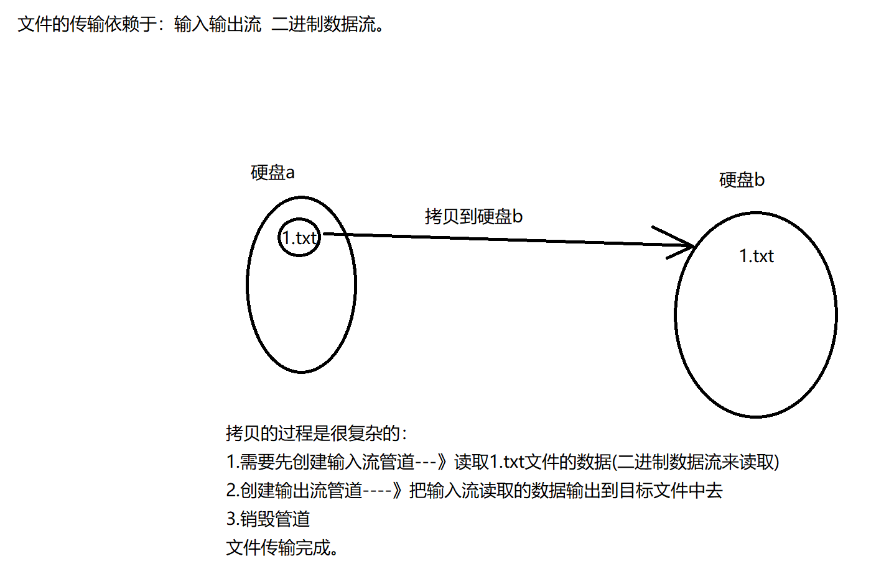

文件的数量如果很多，就需要一直去重复 这个步骤。输入输出的管道创建与销毁 是很耗费内存和时间的。

**问题一：在网页中会引用哪些常见的静态资源？**

+ JS

 - .js  .jsx  .ts（TypeScript）

+ CSS

 - .css  .less   .sass  .scss

+ Images

 - .jpg   .png   .gif   .bmp   .svg

+ 字体文件（Fonts）

 - .svg   .ttf   .eot   .woff   .woff2

+ 模板文件

 - .ejs   .jade  .vue【这是在webpack中定义组件的方式，推荐这么用】

**问题二：网页中引入的静态资源多了以后有什么问题？？？** 

1. 一个前端项目里面可能有多个 .js, 多个 .css , 多个静态图片， 多个其他前端资源。
   当一个页面需要加载多个 .js 的话，**也会拖累整个页面的加载速度，因为我们要发起很多的二次请求**；
   
   精灵图/雪碧图。
   
2. 要处理错综复杂的依赖关系，例如一些 js 资源彼此之间存在依赖关系。

   a.js

   b.js

**问题三：如何解决上述两个问题？** 

1. 合并、压缩、精灵图、图片的Base64编码

2. 使用webpack可以解决各个包(文件夹)之间的复杂依赖关系；

   如图所示，webpack 就把左边的各种各样的静态资源，打包成了一个所谓的 assets 这样浏览器加载起来就快多了。

   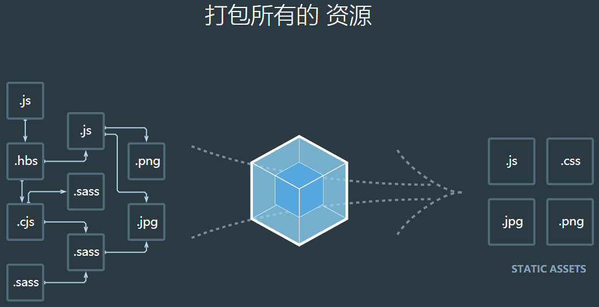

我们自己在写项目的时候 会有很多的 js文件 css文件  ，一张Html页面可能需要引入  很多个 .js文件，之前这种感觉很正常，但是这样存在问题，会拖累整个页面的加载速度，因为我们要发起很多的二次请求。所以我们可以想象 把这些用到的js文件都放入一个 .js文件中去，如果自己做这个事情，根本没法做。所以就有了 webpack。

### 1.2 什么是webpack?  

a.js  b.js  b.js中要使用a.js的代码。 需要两个文件。

webpack可以帮助我们把 a.js和b.js融合成一个js文件供我们使用。

- Webpack 是一个前端资源加载/打包工具（项目构建工具）。它将根据模块的依赖关系进行静态分析，然后将这些模块按照指定的规则生成对应的静态资源。
- webpack 提供了友好的模块化支持，以及资源的合并、打包、压缩、混淆、处理 js 兼容问题、性能优化等强大的功能，从而让程序员把工作的重心放到具体的功能实现上，提高了开发效率和项目的可维护性。
- [webpack官网](https://www.webpackjs.com/)   https://webpack.docschina.org/

WebPack可以看做是**模块打包机**：它做的事情是，分析你的项目结构，找到JavaScript模块以及其它的一些浏览器不能直接运行的拓展语言（Scss，[TypeScript](https://so.csdn.net/so/search?q=TypeScript&spm=1001.2101.3001.7020)等），并将其转换和打包为合适的格式供浏览器使用。

### 1.3 webpack的使用方式  （全局安装，项目/局部安装）

webpack基于 Node.js的，所以必须先安装Node.js。 

1. 运行  `npm i webpack -g` 全局安装webpack，这样就能在全局使用webpack的命令 （全局安装）

   i  install  安装     webpack 就表示 名字  要从npm服务器上下载的 第三方包。

   -g  代表全局安装。

   NPM是随同NodeJS一起安装的包管理工具，能解决NodeJS代码部署上的很多问题，常见的使用场景有以下几种：

   - 允许用户从NPM服务器下载别人编写的第三方包到本地使用。
   - 允许用户从NPM服务器下载并安装别人编写的命令行程序到本地使用。
   - 允许用户将自己编写的包或命令行程序上传到NPM服务器供别人使用。

2. npm

   npm 包管理器 类似于  gitee 仓库 类似于云端仓库，里边存储的各种包

3. 在项目根目录中运行`npm i webpack --save-dev`安装到项目依赖中  （项目安装）

   webpack版本 最新5 

   如果你的公司用的是  1/3/4版本 此时 我们在有 全局安装的基础上，还要有项目安装 `npm i webpack@版本号 --save-dev` 。

4. webpack4.0以后版本，需要安装命令工具`npm install webpack-cli -g`

5. 查看webpack 信息   npm info webpack    4.0以后 直接输入该命令： webpack  -v 

**最终安装时：**`npm i webpack webpack-cli -D` ;

-S   ====>  --save   依赖进入package.json文件中的dependencies选项中   生产模式

-D  ====>  --save-dev 依赖进入package.json文件中的devDependencies选项中  开发模式

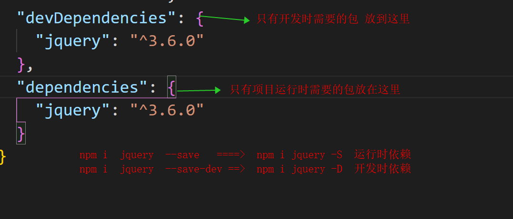

### 1.4 案例 

1. 创建项目基本的目录结构 src  和dist 

   所有我们完成的源码都要放在src中

   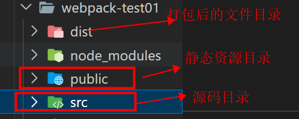

2. 运行`npm init -y`初始化项目，使用npm管理项目中的依赖包

通常我们使用npm init命令来创建一个npm程序时，会自动生成一个package.json文件。package.json文件会描述这个NPM包的所有相关信息，包括作者、简介、包依赖、构建等信息

3. 使用` npm install 模块名`安装所需要的模块类库(可选，如果有外界依赖包 需要执行  如果没有，可以不执行)

4. 执行打包命令 `webpack  ./main.js  -o  ../dist/        -o === --output`  

   ```
如果直接执行以上命令 相当于  以 生产模式打包
   
   	webpack  入口文件  -o  输出的位置  --mode=development/production
   		mode表示模式：
   			development   以开发模式打包
   			production    以生产模式打包
   ```
   
   **初次执行webpack打包命令如果报错：**
   
   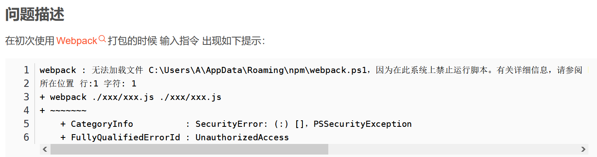
   
   原因
   
   powershell对于脚本的执行有着严格的安全限制 默认是不载入配置文件的 因而报错
   可使用Set-ExecutionPolicy指令来修改PowerShell中执行策略的用户首选项
   
   共有四个权限等级可选择：
   
   ```
   Restricted：不载入配置文件 不执行脚本【默认该权限等级】
   AllSigned：所有配置文件和脚本必须通过信任的出版商签名 这里的脚本页包括在本地计算机上创建的脚本
   RemoteSigned：所有从互联网上下载的脚本必须通过信任的出版商签名
   Unrestricted：载入所有的配置文件和脚本
   如果运行了一个从互联网上下载且没有数字签名的脚本 在执行前会提示是否执行
   ```
   
   解决方法：
   
   ```
   1、以管理员权限打开PowerShell
   2、输入Set-ExecutionPolicy RemoteSigned命令 将脚本执行权限修改为RemoteSigned
   3、输入Y以确认
   如果直接执行以上命令仍然失败：请执行一下命令：
   	仍然打开powerShell :
   ```
   
   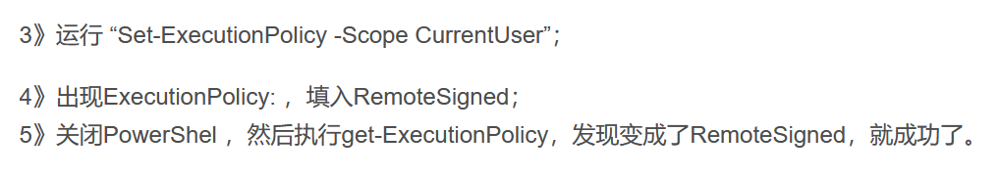

案例1：初体验 

案例2：使用webpack完成表格隔行变色效果

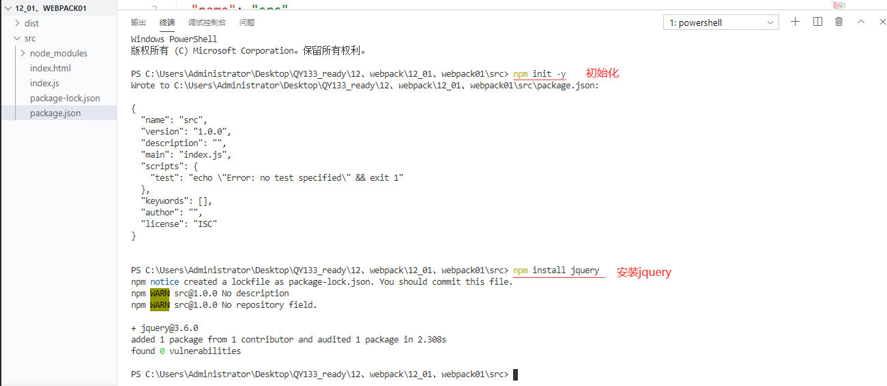

1. 创建`index.js`并书写各行变色的代码逻辑：

```js
	// 导入jquery类库
    import $ from 'jquery'
	
    // 设置偶数行背景色，索引从0开始，0是偶数
   $(function () {
    $('li:odd').css('background', 'red');
    $('li:even').css('background', 'green');
	}
   );
```

  2.直接在页面上引用`main.js`会报错，因为浏览器不认识`import`这种高级的JS语法，需要使用webpack进行处理，webpack默认会把这种高级的语法转换为低级的浏览器能识别的语法；

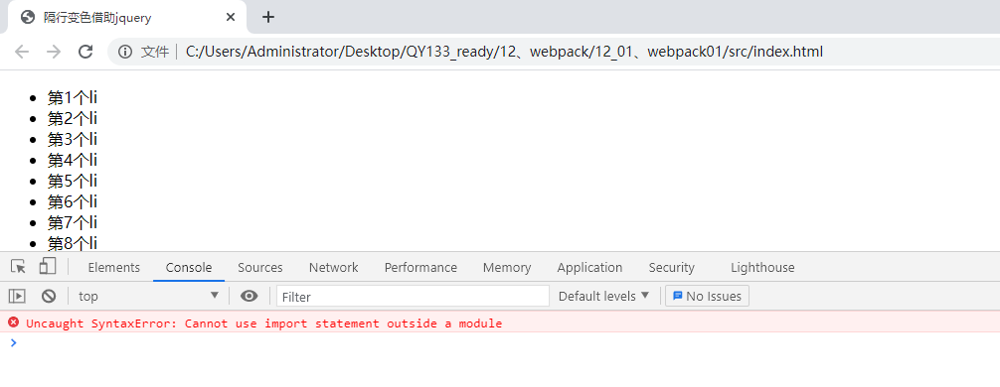

3. **先把目录切换到项目根目录**：然后运行命令: `webpack` 

   **webpack5默认：**此时会把src目录下的`index.js` 进行打包处理 输出到 dist目录下 `main.js`文件。

   如果不想使用默认的文件名字，我们也可以执行一下命令：

   ​	运行`webpack 入口文件路径 -o 输出文件路径`对`index.js`进行处理：此时需要注意一下 终端所处的目录级别！！！

   ​			`webpack  ./index.js  -o  ../dist/ -o === --output  `  

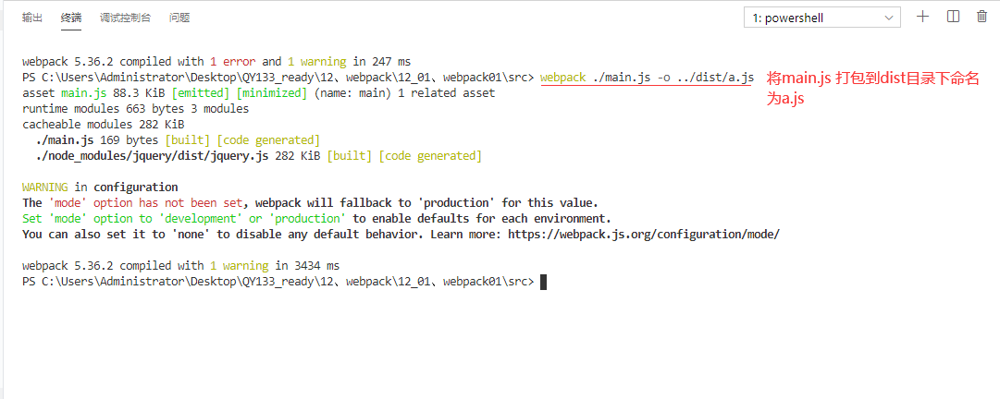

命令太长：也可以直接在package.json的 scripts中配置命令：

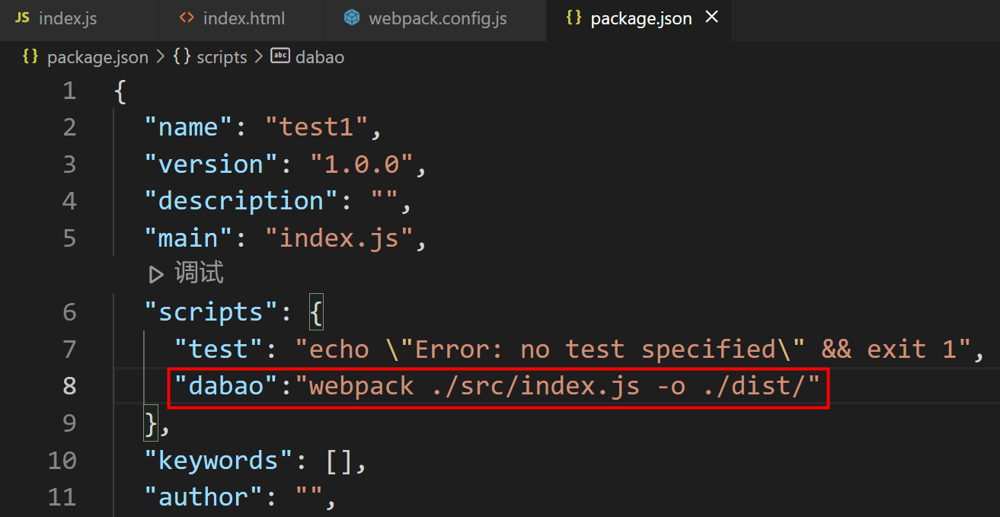

配置完毕后 可以直接运行 ： `npm  run  dabao`

4.在index.html文件中引入打包后的js样式

```js
<!DOCTYPE html>
<html lang="en">
<head>
    <meta charset="UTF-8">
    <meta http-equiv="X-UA-Compatible" content="IE=edge">
    <meta name="viewport" content="width=device-width, initial-scale=1.0">
    <title>隔行变色借助jquery</title>

    <!-- 引入打包后的js文件 -->
    <script src="../dist/main.js"></script>
</head>

<body>
    <ul>
        <li>第1个li</li>
        <li>第2个li</li>
        <li>第3个li</li>
        <li>第4个li</li>
        <li>第5个li</li>
        <li>第6个li</li>
        <li>第7个li</li>
        <li>第8个li</li>
        <li>第9个li</li>
        <li>第10个li</li>
    </ul>
    
</body>
</html>
```

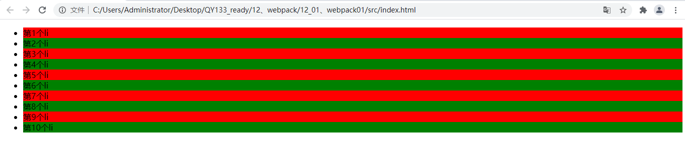

```js
不通过配置文件打包方式
webpack4以后 默认不需要再创建webpack.config.js来配置打包的入口和出口；

默认情况下， webpack
入口为./src/index.js文件
出口为./dist/main.js文件
确保入口文件/src/index.js位置正确，在项目根目录下运行命令：
PS C:\Users\baijinbao\Documents\webpack02\test3\src> 
webpack  默认打包  (最新版的可以不用引入配置文件)
```

### 1.5 webpack的配置文件`webpack.config.js` 

#### 1.5.1 webpack的5个核心概念：

- mode 开发模式

  主要指当前webpack的打包配置是基于哪种模式

  ①开发模式：development

  ②生产模式：production

- entry 入口

  主要指打包的入口文件位置

- output 出口

  主要指打包的出口文件位置

- loader 加载器

  webpack的作用是为了打包我们的项目，让项目的体积尽可能小，并且还要适应各种环境，但是它本身只能识别js,json等资源，css,less,图片，视频，音频，字体文件等无法识别，需要借助于一些加载器才可以完成打包。

- plugins 插件

  具有某一些特定功能的小工具，类似于 之前用过的jquery插件

webpack.config.js文件就是对整个webpack的配置文件。

#### 1.5.2 mode 开发模式

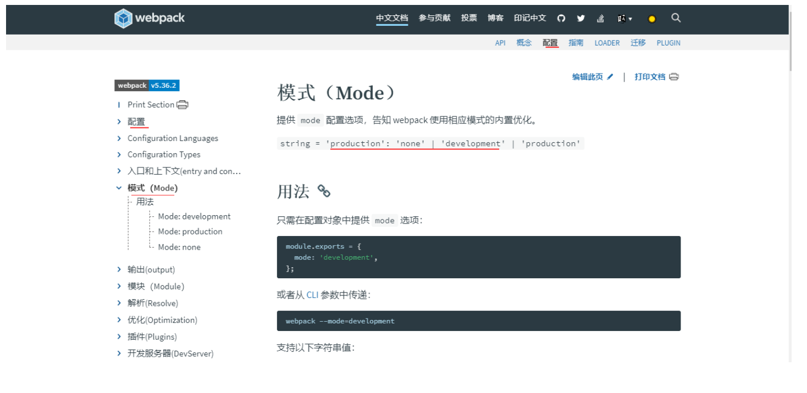

```
 // 导入处理路径的模块
   var path = require('path');
   module.exports = {
        //指定development模式时，项目不会压缩，当指定production生产模式时，项目会被webpack压缩，体积变小
        mode:'development',//指定开发模式  还有production生产模式（上线运行模式）
   }
   如果使用development模式，打包后的文件中会包含注释代码
```


#### 1.5.3 打包配置 

运行webpack命令的时候，webpack会有默认的 指定入口文件和输出文件的路径，但是我们也可以自己配置入口文件和输出文件的路径，我们需要在`webpack.config.js`中配置这两个路径：

```js
    // 导入处理路径的模块
    var path = require('path');

    // 导出一个配置对象，将来webpack在启动的时候，会默认来查找webpack.config.js，并读取这个文件中导出的配置对象，来进行打包处理
    module.exports = {
        //指定development模式时，项目不会压缩，当指定production生产模式时，项目会被webpack压缩，体积变小
        mode:'development',//指定开发模式  还有production生产模式（上线运行模式）
        entry: path.resolve(__dirname, 'src/js/main.js'), // 项目入口文件 __dirname当前模块目录名
        // 多入口
  		// entry:['./src/js/index.js','./src/js/one.js'],
        //entry: {
            //ind: './src/js/index.js',
            //on: './src/js/one.js'
        //},
        output: { // 配置输出选项
            path: path.resolve(__dirname, 'dist'), // 配置输出的路径
            filename: 'bundle.js' // 配置输出的文件名
        },
        // 多出口
        //output: {
         //   filename: 'js/webpack02.[name].js',
         //   path: path.resolve(__dirname, 'dist')
        //},
    }
```

在目录下直接使用 `webpack`命令打包 就会按照我们配置文件中的配置打包 

### 1.5.4 使用clean-webpack-plugin 插件

使用clean-webpack-plugin 在打包之前做清空dist的操作

```js
第一步：先安装 插件
npm install clean-webpack-plugin --save-dev

第二步：配置webpack.config.js

const {CleanWebpackPlugin} = require('clean-webpack-plugin')

// 配置插件
  plugins:[
    // 在打包之前做清空dist的操作
    new CleanWebpackPlugin()
  ]
```

## 二、案例练习

webpack打包最终实现的：把 js,css,less,图片 等 都以模块的形式导入到 main.js文件中 。

**打包的执行流程：**打包时，一定是先读取 webpack.config.js配置文件 当没有查找到配置的时候，此时就按照默认配置打包。

## 案例实现：设置div颜色

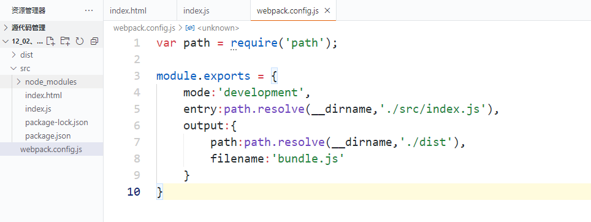

#### 创建文件夹目录

- 初始化npm  `npm init -y`
- 安装jquery `PS \12、webpack\12_02、webpack02\src> npm install jquery`

#### 1、index.html

```html
<!DOCTYPE html>
<html lang="en">
<head>
    <meta charset="UTF-8">
    <title>div变颜色</title>
    <script src="../dist/bundle.js"></script>
</head>
<body>
    <div></div>
</body>
</html>
```


#### 2、index.js

```js
import $ from 'jquery';

$(function(){
    $('div').css({
        width:'200px',
        height:'200px',
        background:'red'
    });
})
```

#### 3、webpack.config.js

```js
var path = require('path');

module.exports = {
    //mode指定开发模式 development开发模式   production指定生产模式（项目上线发布使用）
    mode:'development',
    entry:path.resolve(__dirname,'./src/index.js'),
    output:{
        path:path.resolve(__dirname,'./dist'),
        filename:'bundle.js'
    }
}
```


#### 4、webpack打包

`12、webpack\12_02、webpack02> webpack`


#### 5、在index.html中引入打包的js文件

```js
  <script src="../dist/bundle.js"></script>
```


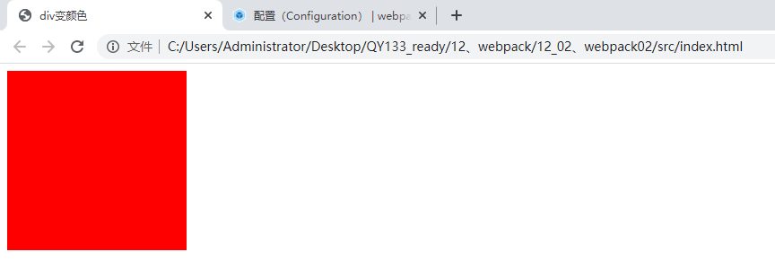


如果修改index.js中div的颜色，会变颜色吗？

很明显不行，因为没有打包，修改后需要重新打包


那么，如何实现修改js源码，就可以自动打包呢？

饿汉模式，懒汉模式

## 三、实现webpack的实时重新加载(live reloading) 热加载/热部署

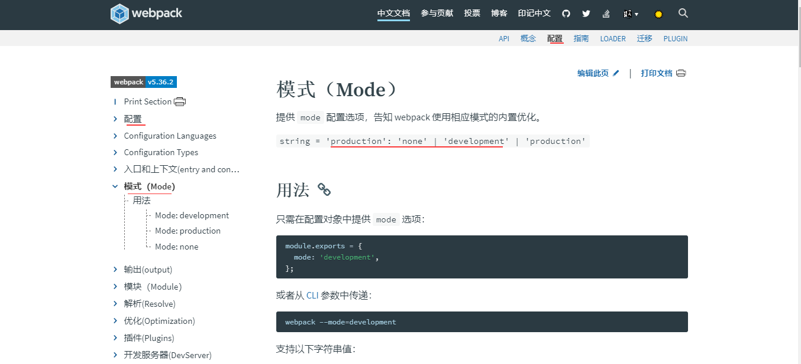


1. 由于每次重新修改代码之后，都需要手动运行webpack打包的命令，比较麻烦，所以使用`webpack-dev-server`来实现代码实时打包编译，当修改代码之后，会自动进行打包构建。

2. 运行`npm install webpack-dev-server --save-dev`安装到开发依赖

3. 安装完成之后，在命令行直接运行`webpack-dev-server/webpack serve` 两个命令都可以来进行打包运行，发现报错，

   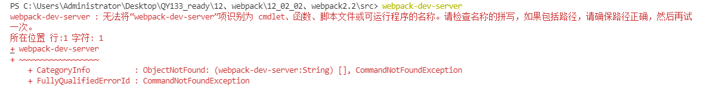

4. 此时需要借助于`package.json`文件中的指令，来进行运行`webpack-dev-server`命令，在`scripts`节点下新增`"dev": "webpack-dev-server"`指令，发现会提示我们 Do you want to install  'webpack-cli' 只是因为 你安装的cli是全局环境下的，我们此时使用的webpack-dev-server启动后 会处于开发环境下 所以我们需要安装 开发环境下的cli :

   执行命令: npm install -D webpack-cli   一般不需要自己执行，直接输入 yes 就可以自动执行了。

   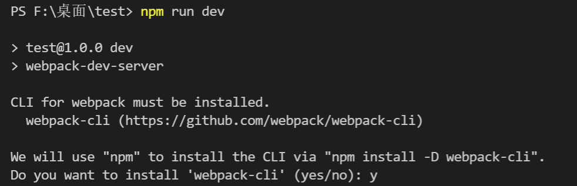

   出现如下所示，表示启动成功，但是此时是以服务器的形式进行启动。点击链接 可以打开文件。

   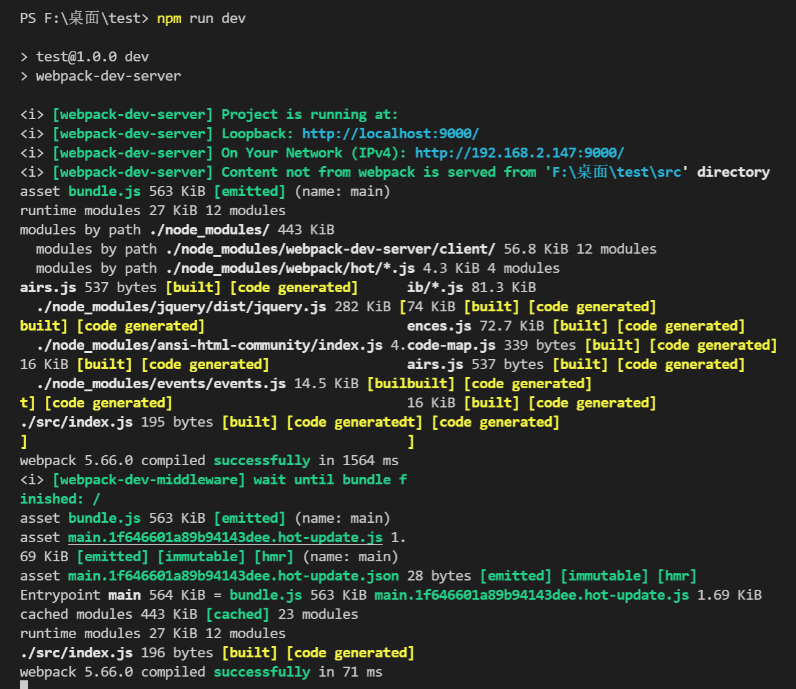

   **如果是 4的版本此时会报错：** (了解)

   找不到对应的路径

   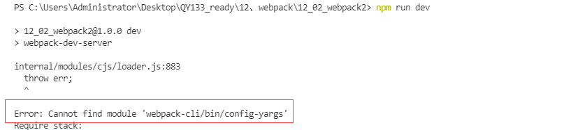

   因为cli4.0以后的版本，舍弃了config-yargs

   安装3.0的版本

   ```
   npm install webpack-cli@3
   ```

   再次运行 `npm run dev` 就可以正常执行了。

5. 可以进行实时打包（npm run dev），但是此时 dist目录下并没有生成main.js 文件，这是因为 `webpack-dev-server`将打包好的文件放在了内存中

   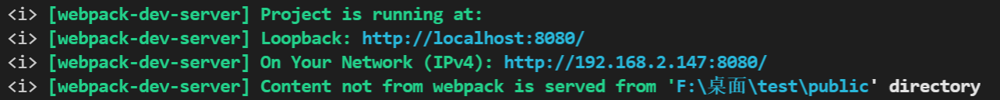

   Loopback: 表示当前启动的访问的服务器路径

   On Your NetWork: 表示对应得Ip地址得访问路径

   Content not from webpack is served from 'url' 表示当前的资源不是来源于 项目目录 而是来源于 自动生成的public 文件，这个文件夹在内存中。

   尝试修改Index.js文件中的内容，可以发现 页面会实时的加载更新了。

6. **注意：**

   1. webpack 4+ 版本，你还需要安装 CLI   cnpm install --save-dev webpack-cli

      cnpm命令指的是淘宝镜像命令，一般来说 使用npm就都是用npm,使用 cnpm就都是用cnpm

   2. *不推荐全局安装 webpack。这会将你项目中的 webpack 锁定到指定版本，并且在使用不同的 webpack 版本的项目中，可能会导致构建失败。*

   3. 对于大多数项目，我们建议本地安装。这可以使我们在引入破坏式变更(breaking change)的依赖时，更容易分别升级项目。通常，webpack 通过运行一个或多个 [npm scripts](https://docs.npmjs.com/misc/scripts)，会在本地 `node_modules` 目录中查找安装的 webpack：

 + 把`main.js`放在内存中的好处是：由于需要实时打包编译，所以放在内存中速度会非常快.

   ### **访问的方式一：** 

   生成的文件是在服务器根目录下** 生成的main.js默认在 服务器根目录下   其余的静态页面 会默认存在 public 文件夹下。

   所以此时需要修改 index.html文件中 引入的路径为< script  src = "./main.js" />才能打开页面。

   

   ### **访问首页的方式二：**

   关于devServer的配置：当我们没有把静态资源存放在`public`目录下时，webpack-dev-server启动后 访问index.html页面的方方法：此时是无法访问到 index.html的 因为 静态资源此时并没有参与打包。需要访问静态页面内容需要增加新的配置：webpack.config.js中   devServer对象配置相应的属性 static静态资源目录配置，把这个目录配置成我们静态资源放置的位置

   ```js
   const path = require('path');
   module.exports = {
       mode: 'development',
       entry:path.resolve(__dirname,'./src/index.js'),
       output:{
           filename:'bundle.js',
           path:path.resolve(__dirname,'./dist/')
       },
       devServer: {
           //静态资源文件夹
           static: {
             directory: path.join(__dirname, 'src'),
           },
           //contentBase:path.resolve(__dirname,'./src'),
           //启用gzip压缩 是否为静态文件开启gzip压缩，默认是false，经过gzip压缩后的文件会变很小。（性能优化）
           compress: true,
           //设置端口号
           port: 9000,
           //编译成功后，自动打开浏览器
           open:true,
           //热替换
           hot:true,
           //项目部署的ip地址 默认本机
           host:'127.0.0.1',
         }
   }
   ```

 + **webpack版本4**中为了能在访问`http://localhost:8080/`的时候直接访问到index首页，可以使用`--contentBase src`指令来修改dev指令，指定启动的根目录：(了解)

 ```js
//方式一 
"dev": "webpack-dev-server --contentBase src --open --port 9999 --hot "

//方式二
 webpack.config.js
 devServer:{
    contentBase:'./src',
    hot:true,//热加载
  }
 ```

## 四、使用`html-webpack-plugin`插件配置启动页面

### 访问首页的方式三：

由于使用`--contentBase` /`static{directory}` 指令的过程比较繁琐，需要指定启动的目录，同时还需要修改index.html中script标签的src属性，所以推荐大家使用`html-webpack-plugin`插件配置启动页面。使用这个插件我们不需要手动引入js文件，会自动的插件会自动引入js文件。

1. 运行`npm i html-webpack-plugin --save-dev`安装到开发依赖

   启动服务 根目录下：`webpack-dev-server`

2. 修改`webpack.config.js`配置文件如下：

   ```js
   const path = require('path');
   const { CleanWebpackPlugin } = require('clean-webpack-plugin');
   var htmlWebpackPlugin = require('html-webpack-plugin');
   module.exports = {
       mode: 'development',
       entry: path.resolve(__dirname, './src/index.js'),
       output: {
           filename: 'bundle.js',
           path: path.resolve(__dirname, './dist')
       },
       devServer: {
           //静态资源文件夹
           static: {
               directory: path.join(__dirname, 'public'),
           },
           //contentBase:path.resolve(__dirname,'./src'),
           //启用gzip压缩 是否为静态文件开启gzip压缩，默认是false，经过gzip压缩后的文件会变很小。（性能优化）
           compress: true,
           //设置端口号
           port: 9000,
           //编译成功后，自动打开浏览器
           open: true,
           //热替换
           hot: true,
           //项目部署的ip地址 默认本机
           host: '127.0.0.1',
       },
       // 配置插件
       plugins: [
           // 在打包之前做清空dist的操作
           new CleanWebpackPlugin(),
           //配置html页面加载插件
           new htmlWebpackPlugin() 
       ]
   }
   ```

   启动服务 根目录下：`npm run dev`

此时页面显示：

是插件帮我们生成的html文件

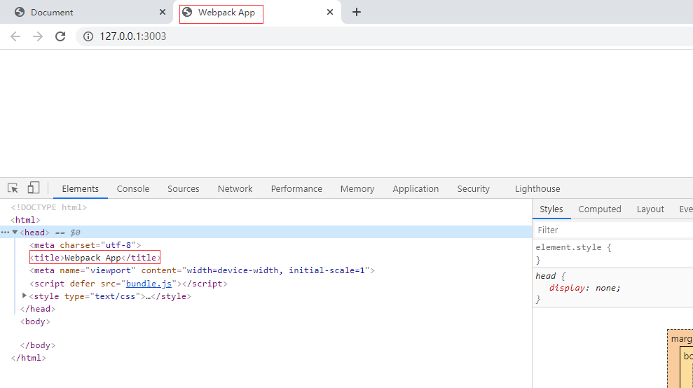

再来进行打包 执行 webpack，出现了打包后的index.html文件

 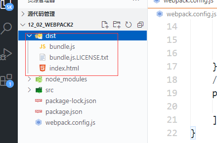


此时点进打包好的html文件

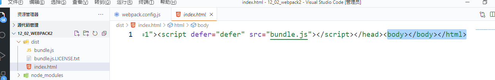

发现里面没有div,不是我们想要打包的html文件


3. 在插件中添加配置信息，然后重新打包

```js
    // 导入处理路径的模块
    var path = require('path');
    // 导入自动生成HTMl文件的插件  得到一个构造函数
    var HtmlWebpackPlugin = require('html-webpack-plugin');

    module.exports = {
        entry: path.resolve(__dirname, 'src/js/main.js'), // 项目入口文件
        output: { // 配置输出选项
            path: path.resolve(__dirname, 'dist'), // 配置输出的路径
            filename: 'bundle.js' // 配置输出的文件名
        },
        plugins:[ // 添加plugins节点配置插件
            new HtmlWebpackPlugin({
                //模板路径，即我们自己的html文件 插件会帮我们把html文件做打包处理 放到内存中
                template:path.resolve(__dirname, 'src/index.html'),
                filename:'./index.html'//自动生成的HTML文件的名称
            })
        ]
    }
```

重新打包：webpack

得到了我们想要打包的html文件

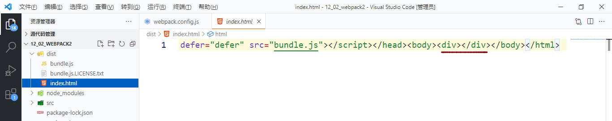

注意：插件会自动的给index.html文件添加一个script标签引入的就是打包后的js文件，我们不需要再次手动引入了。

① 安装 html-webpack-plugin插件  npm i html-webpack-plugin -D

② 在webpack.config.js中导入 插件 ===》导入的是构造函数

③ 在webpack.config.js中的plugins属性中配置 插件的实例对象 

​			new HtmlWebpackPlugin({

​					template:'老路径,

​					filename:新名字

​		})

## 五、作业

1. 熟练入口文件，出口文件的配置，
2. 熟练webpack-dev-server的使用
3. html-webpack-plugin的使用