# webpack-02：webpack中的loader加载器

拿到一个webpack项目 上传到git时 不要上传 node_modules文件夹  要保留 package.json文件

​	直接执行  npm  install  会根据package.json文件中的依赖去下载。

## 一、使用webpack打包css文件   

复制一个昨天的项目 

新建一个css文件 

index.css 

```
*{
    margin: 0;
    padding: 0;
}
```

在index.js中，把css作为模块引入

```js
import $ from 'jquery';

import './index.css';//把css作为模块引入

$(function(){
    $('div').css({
        height:'200px',
        width:'200px',
        background:'skyblue'
    })
})
```


此时报错了：

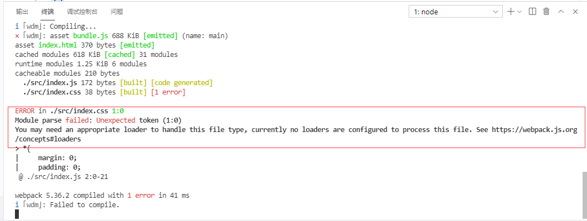

您可能需要一个适当的加载器来处理这个文件类型，目前没有配置加载器来处理这个文件。看到https://webpack.js.org/concepts加载器：

### 什么是loader加载器：

在实际开发中，webpack默认只能打包处理.js后缀结尾的模块，其它的html文件，css文件，图片文件等无法直接处理，需要调用相应的loader加载器才可以正常打包，否则就会爆出错误。

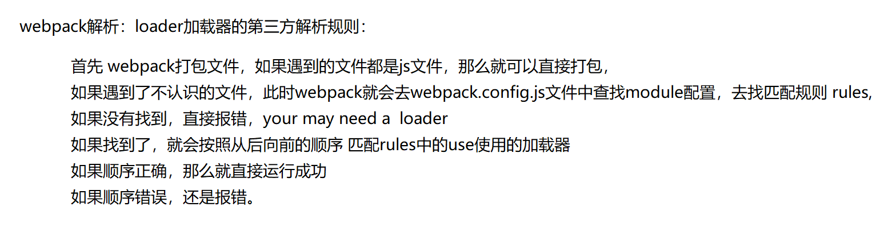

1. 运行`npm i style-loader css-loader --save-dev`

   运行`npm run dev`

   发现报错，需要进行配置

   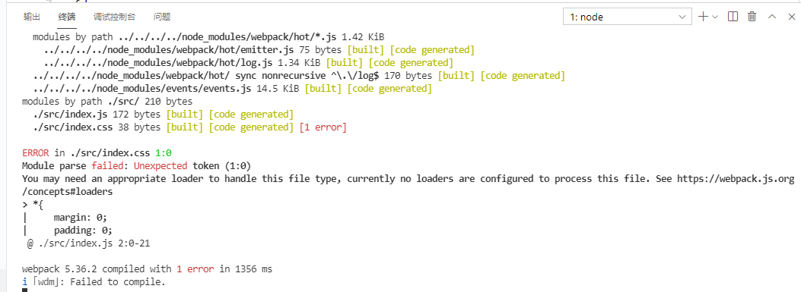

2. 修改`webpack.config.js`这个配置文件：

```js
module: { // 用来配置第三方loader模块的
        rules: [ // 文件的匹配规则
        //此处可以配置多个匹配规则，当webpack要处理一些文件时会自动来这里查找加载器
        //test 匹配文件后缀.css结尾的文件
        /*
        	use表示使用加载器模块。在调用时是倒着调用的 先用css-loader进行处理，然后把处理后的结果转交给style-loader 最终把结果交还给webpack。合并到main.js文件中最终生成打包好的文件。
        	注意：多个loader加载顺序 从后向前加载
        */
            { test: /\.css$/, use: ['style-loader', 'css-loader'] }//处理css文件的规则
        ]
    }
```

`npm run dev` 重新运行，发现css样式已经引入

 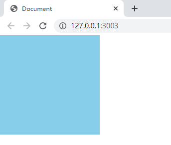

注意：`use`表示使用哪些模块来处理`test`所匹配到的文件；`use`中相关loader模块的调用顺序是从后向前调用的；

## 二、使用webpack打包less文件

新建less文件  demo.less

```less
body{
    background-color: rgb(27, 98, 107);
}
```

在index.js中引入less

```js
import $ from 'jquery';
import './index.css';

import './demo.less';

$(function(){
    $('div').css({
        height:'200px',
        width:'200px',
        background:'skyblue'
    })
})
```

运行报错

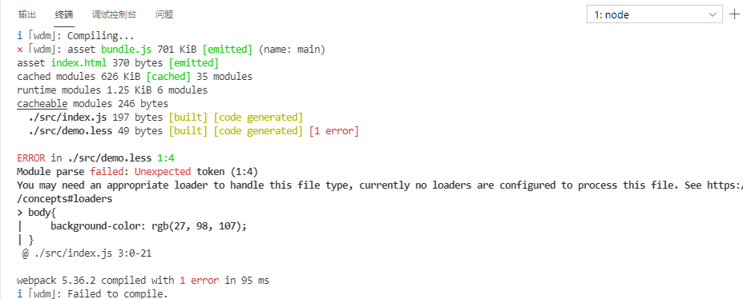

1. 运行`npm i less-loader less --save-dev`

   此处需要按装两个模块 但是后边的less并不是加载器模块，只是less-loader需要依赖于less模块。

2. 修改`webpack.config.js`这个配置文件：

```
{ test: /\.less$/, use: ['style-loader', 'css-loader', 'less-loader'] },
```

`npm run dev`

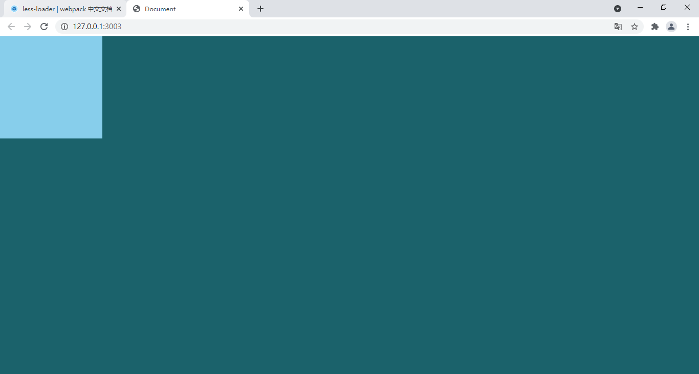

### 使用 webpack 打包 sass 文件(了解)

1. 运行`npm i sass-loader node-sass --save-dev`
2. 在`webpack.config.js`中添加处理sass文件的loader模块：

```
{ test: /\.scss$/, use: ['style-loader', 'css-loader', 'sass-loader'] }
```

## 三、webpack中的 url 路径处理 

### 3.1 使用webpack处理引入的图片

base64 格式：

如下：我们如果在页面中直接加入 图片标签 < img src="./5.gif" alt=""> 此时运行 页面上是无法显示图片的

base64格式：如果把图片转换成base64格式，浏览器可以直接解析这个文件，不需要向服务器发送请求。

**优点：减少浏览器向服务器的请求次数   缺点：会把体积增大** 

一般来说开发时：如果图片大小小于10kb  选择转为base64格式    否则 就以请求的方式来使用图片

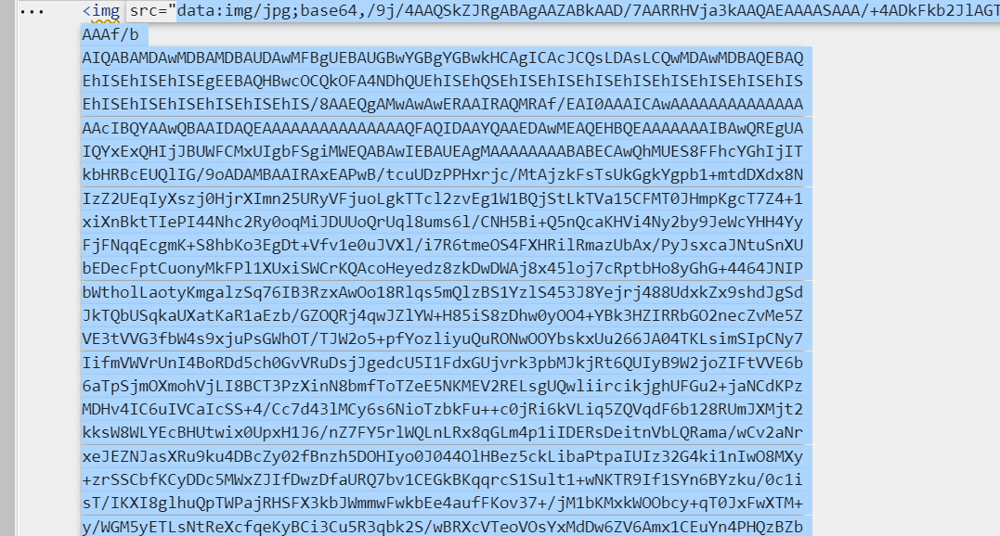

```js
{ 
	test: /\.(png|jpg|gif|svg|bmp|jpeg)$/, 
	//------使用webpack5内置的type
	type: 'asset',//在导出一个 data URI 和发送一个单独的文件之间自动选择。之前通过使用 url-loader，并且配置资源体积限制实现。
	parser:{
		dataUrlCondition:{
			maxSize:20*1024  //data转成url的条件，也就是转成bas64的条件,maxSize相当于limit
            //如果满足条件就转换成 base64格式显示，否则就直接导出文件到下方generator配置的filename的imgs文件夹中去
		}
	}, 
	generator:{
		//geneator中是个对象，配置下filename，和output中设置assetModuleFilename一样，将资源打包至imgs文件夹
		filename:"imgs/[name].[hash:6][ext]"  //[name]指原来的名字，[hash:6]取哈希的前六位确保不会重复，[ext]指原来的扩展名
	}
} 
```

以上配置的目的：其实就是为了 把本地的图片路径转换成base64字符串/网络路径。

### 3.2 webpack5版本之前 使用webpack处理css中的路径(了解)

要通过  url-loader  file-loader来实现。

在less中给div设置背景图片

```less
body{
    background-color: rgb(27, 98, 107);
    div{
        background: url(./girl.jpg) no-repeat;
    }
}
```

保存，发现报错，因为webpack不认识.jpg类型的文件

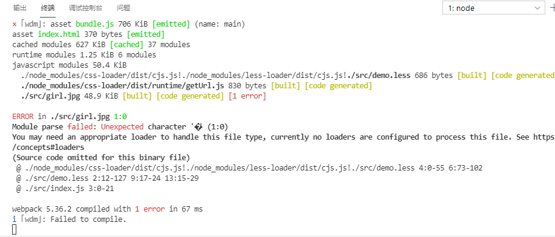

1. 运行`npm i url-loader file-loader --save-dev`
2. 在`webpack.config.js`中添加处理url路径的loader模块：

```
{ test: /\.(png|jpg|gif|jpeg|bmp)$/, use: 'url-loader' }
```

启动`npm run dev`  

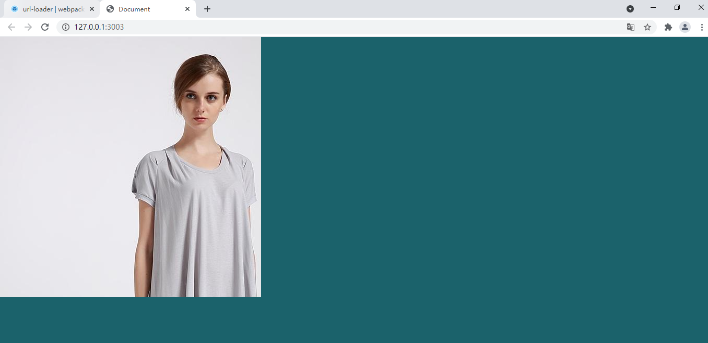 


此时加载时，把图片转成了base64的编码格式

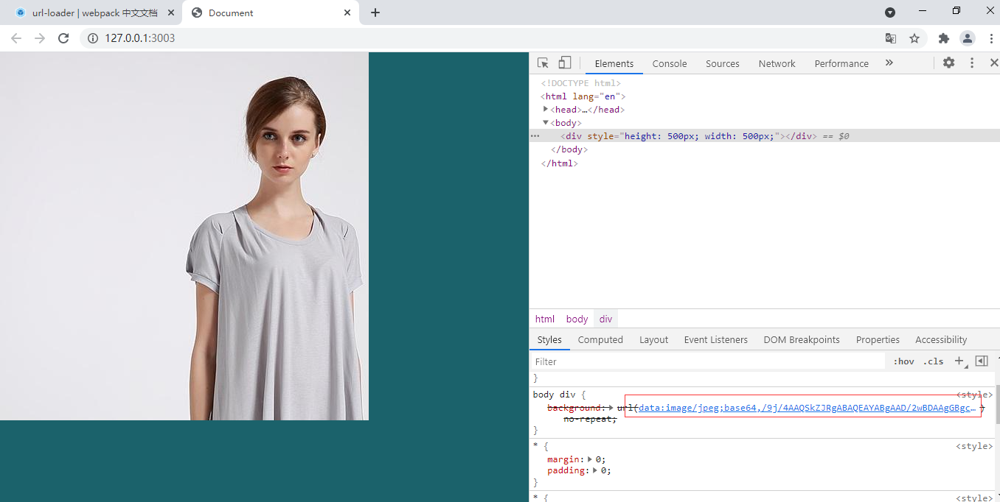

1. 可以通过`limit`指定进行base64编码的图片大小；只有小于指定字节（byte）的图片才会进行base64编码：

    

```
{ test: /\.(png|jpg|gif)$/, use: 'url-loader?limit=43960&name=[hash:8]-[name].[ext]' },
limit ：指定大小 只有小于limit设置大小的图片才会被转成base64编码的图片
hash:添加hash值，防止重名
name:原名显示
ext:原后缀
```


```js
const path = require('path');

// 导入自动生成HTMl文件的插件
var htmlWebpackPlugin = require('html-webpack-plugin');
module.exports = {

    entry:path.resolve(__dirname,'./src/index.js'),
    output:{
        path:path.resolve(__dirname,'./dist'),
        filename:'bundle.js'
    },
    devServer:{
        contentBase:'./src',
        open:true,
        port:3003,
        host:'127.0.0.1'
    },
    // 配置plugins
    plugins:[
        new htmlWebpackPlugin({
            template:path.resolve(__dirname,'./src/index.html'),
            filename:'index.html'
        })
    ],
    module: { // 用来配置第三方loader模块的
        rules: [ // 文件的匹配规则
            { test: /\.css$/, use: ['style-loader', 'css-loader'] },//处理css文件的规则
            { test: /\.less$/, use: ['style-loader', 'css-loader', 'less-loader'] },
            { test: /\.(png|jpg|gif)$/, use: 'url-loader?limit=28340&name=[name].[ext]' }
        ]
    }
```

### 3.3 加载音视频

```js
//在 index.js文件中 导入 音视频文件
import mp3 from './video/素材/新二神曲.mp3'

//在webpack.config.js文件中 老版本 配置音视频加载器
//配置加载音视频
            //老版本配置
            /* { test: /\.(mp3|mp4)$/, use: 'file-loader' }, */
            //新版配置
            { 
                test: /\.(mp3|mp4)$/, 
                //------使用webpack5内置的type
                type:'asset',//表示导出文件的路径 url
                generator:{
                    //geneator中是个对象，配置下filename，和output中设置assetModuleFilename一样，将资源打包至imgs文件夹
                    //[name]指原来的名字，[hash:6]取哈希的前六位确保不会重复，[ext]指原来的扩展名
                    filename:"video/[name].[hash:6][ext]"  
                },
                
            } ,
```


### 3.4 加载字体

**webpack5 导入字体包文件不需要做loader处理  可以自动加载不需要做配置。** 

导入字体包  

```less
body{
    background-color: rgb(27, 98, 107);
    div{
        background: url(./girl.jpg) no-repeat;
        background-size: cover;
    }
}

@font-face {
    font-family: 'myfont';
    src: url(./fonts/shimesone_personal-webfont.eot);
    src: url(./fonts/shimesone_personal-webfont.svg);
    src: url(./fonts/shimesone_personal-webfont.ttf);
    src: url(./fonts/shimesone_personal-webfont.woff);
}

也可以通过asset的方式 来配置打包输出的目录  同处理图片文件
但是 不能使用asset 应该使用  asset/resource 不会被转换成 base64格式
```

webpack5 版本此时直接运行就可以成功了。

========================================================================================

**webpack5再之前的版本此时可能会报错！！！！**

保存，报错，因为无法识别 url

```
加载字体：
{test:/\.(ttf|eot|svg|woff|woff2)$/,use:'url-loader'}
```

```js
  module: { // 用来配置第三方loader模块的
        rules: [ // 文件的匹配规则
            { test: /\.css$/, use: ['style-loader', 'css-loader'] },//处理css文件的规则
            { test: /\.less$/, use: ['style-loader', 'css-loader', 'less-loader'] },
            { test: /\.(png|jpg|gif)$/, use: 'url-loader?limit=28340&name=[name].[ext]' },
            {test:/\.(ttf|eot|svg|woff|woff2)$/,use:'url-loader'}
        ]
    }
```


### 3.5 终极配置

```js
//导入自带的path路径模块
const path = require('path');
//导入clean-webpack-plugin 插件  引入的是一个类 相当于对象  我们需要使用的是这个类中的构造函数
//使用使用结构赋值 来接收
const {CleanWebpackPlugin} = require('clean-webpack-plugin')
//console.log(CleanWebpackPlugin)
//导入html-webpack-plugin插件
const HtmlWebpackPlugin = require('html-webpack-plugin');
//关于对webpack的配置
module.exports = {
    //模式 ：用于配置 项目所处的模式  开发模式development  生产模式production
    //区别：1.打包时文件的体积  2.打包时的速度 pro  慢
    mode:'development' ,
    //配置打包的入口
    entry:path.resolve(__dirname,'./src/index.js'),
    //配置打包的出口
    output:{
        path:path.resolve(__dirname,"./dist/"),
        filename:'js/main.js'
    },
    //配置插件
    plugins:[
        //配置打包之前清空dist目录
        new CleanWebpackPlugin(),
        //配置htmlwebpackplugin插件 会让html页面也参与打包
        //并且把打包后的html页面 也放入配置好的根目录中
        new HtmlWebpackPlugin({
            //指定参与打包的html文件
            template:path.resolve(__dirname,'./src/index.html'),
            //打包后的新的名字
            filename:'index.html'
        })
    ],
    //配置 webpack-dev-server插件的
    devServer:{
        //静态资源文件夹
        static: {
            directory: path.join(__dirname, './aaa'),
        },
        //老版本：contentBase:path.resolve(__dirname,'./src'),
        //启用gzip压缩 是否为静态文件开启gzip压缩，默认是false，经过gzip压缩后的文件会变很小。（性能优化）
        compress: true,
        //设置端口号
        port: 9000,
        //编译成功后，自动打开浏览器
        open:true,
        //热替换
        //hot:true,
        //项目部署的ip地址 默认本机
        host:'127.0.0.1',
    },
    //用来配置第三方加载器
    module:{
        //匹配文件的格式
        rules:[
            //配置css加载器
            {
                //通过正则来匹配.css结尾的文件
                test:/\.css$/,
                //使用loader模块解析该文件
                //加载器使用的规则：
                //webpack在读取配置加载器的时候，是倒着读取的
                use:['style-loader','css-loader']
            },
            {
                //通过正则来匹配.less结尾的文件
                test:/\.less$/,
                use:['style-loader','css-loader','less-loader']
            },
            //配置图片加载器
            /* {
                //老版本配置  一样可以用
                //通过正则来匹配图片文件
                test:/\.(png|jpg|gif|bmp)$/,
                use:'url-loader'
            }, */
            //新版配置 webpack5
            { 
                test: /\.(png|jpg|gif|svg|bmp|jpeg)$/, 
                //------使用webpack5内置的type
                type:'asset',//表示导出文件的路径 url
                parser:{
                    dataUrlCondition:{
                        maxSize:10*1024  //data转成url的条件，也就是转成bas64的条件,maxSize相当于limit
                        //如果满足条件就转换成 base64格式显示，否则就直接导出文件到下方generator配置的filename的imgs文件夹中去
                    }
                }, 
                generator:{
                    //geneator中是个对象，配置下filename，和output中设置assetModuleFilename一样，将资源打包至imgs文件夹
                    //[name]指原来的名字，[hash:6]取哈希的前六位确保不会重复，[ext]指原来的扩展名
                    filename:"imgs/[name].[hash:6][ext]"  
                },
                
            } ,
            //配置加载音视频
            //老版本配置
            /* { test: /\.(mp3|mp4)$/, use: 'file-loader' }, */
            //新版配置
            { 
                test: /\.(mp3|mp4)$/, 
                //------使用webpack5内置的type
                type:'asset',//表示导出文件的路径 url
                generator:{
                    //geneator中是个对象，配置下filename，和output中设置assetModuleFilename一样，将资源打包至imgs文件夹
                    //[name]指原来的名字，[hash:6]取哈希的前六位确保不会重复，[ext]指原来的扩展名
                    filename:"video/[name].[hash:6][ext]"  
                },
            } ,
            //配置字体文件
            { 
                test: /\.(ttf|eot|svg|woff|woff2)$/, 
                //------使用webpack5内置的type
                type:'asset/resource',//表示导出文件的路径 url
                generator:{
                    //geneator中是个对象，配置下filename，和output中设置assetModuleFilename一样，将资源打包至imgs文件夹
                    //[name]指原来的名字，[hash:6]取哈希的前六位确保不会重复，[ext]指原来的扩展名
                    filename:"fonts/[name].[hash:6][ext]"  
                }
            } ,
        ]
    }
    
}
```

## 四、ESlint 

### 4.1 什么是Eslint 

​		可组装的JavaScript和JSX检查工具,ESLint最初是由[Nicholas C. Zakas](http://nczonline.net/) 于2013年6月创建的开源项目。它的目标是提供一个插件化的javascript代码检测工具。

### 4.2 为什么要使用ESlint

​		ESLint 是一个开源的 JavaScript 代码检查工具，由 Nicholas C. Zakas 于2013年6月创建。代码检查是一种静态的分析，常用于寻找有问题的模式或者代码，并且不依赖于具体的编码风格。对大多数编程语言来说都会有代码检查，一般来说编译程序会内置检查工具。

​		JavaScript 是一个动态的弱类型语言，在开发中比较容易出错。因为没有编译程序，为了寻找 JavaScript 代码错误通常需要在执行过程中不断调试。像 ESLint 这样的可以让程序员在编码的过程中发现问题而不是在执行的过程中。

​		ESLint 的初衷是为了让程序员可以创建自己的检测规则。ESLint 的所有规则都被设计成可插入的。ESLint 的默认规则与其他的插件并没有什么区别，规则本身和测试可以依赖于同样的模式。为了便于人们使用，ESLint 内置了一些规则，当然，你可以在使用过程中自定义规则。

ESLint 使用 Node.js 编写，这样既可以有一个快速的运行环境的同时也便于安装。

### 4.3 ESLint使用

**第一步：** 安装Eslint依赖包

​		在 webpack 4 中，ESLint 是通过 loader 的方式集成到 webpack 中的。在 webpack 5 中，是通过 plugins（插件）的形式进行集成。插件名称为 eslint-webpack-plugin。该插件又依赖 eslint 包，故需要安装两个开发依赖包：

```
npm i eslint eslint-webpack-plugin -D
```

**第二步：** 在项目的根目录下 添加配置文件 `.eslintrc.js`

- ESlint的配置文件有多种方式：
  - .eslintrc
  - **.eslintrc.js** 我们采用这种格式
  - .eslintrc.json
  - 也可以在package.json中直接配置
  - 以上方式的区别只是配置的格式不同。

​	在项目的根路径下添加 ESLint 的配置文件：`.eslintrc.js`:

```js
module.exports = {
  env: {
    node: true,//开启Node环境
    browser: true//开启浏览器环境支持
  },
  //继承其它的规则
  extends: ['eslint:recommended'],//使用ESLint官方提供的规则
  //配置解析选项
  parserOptions: {
    ecmaVersion: 6,//支持es6语法
    sourceType: "module" //支持模块化
  },
  //配置具体的检查规则
  /*
  	"off" 或者 0 表示关闭该项语法检查
  	"warn" 或者 1 表示该项语法检查会报警告
  	"error" 或者 2 表示该项语法如果不符合会直接报错
  */
  rules: {
    'semi':'error',//是否禁止使用分号
    'no-var': 'error',//不支持var声明变量
    'no-console': 'error'//不支持代码中含有 console输出语句
  }
}
```

**第三步：**增加webpack.config.js配置

```js
//导入esline的webpack插件
const ESLintWebpackPlugin = require('eslint-webpack-plugin')


module.exports = {
  ...
  plugins: [
    new ESLintWebpackPlugin({
        //配置需要eslint扫描的包
      context: path.resolve(__dirname, 'src')
    })
  ],
  ...
}
```

安装ESlint插件 会对不符合规则的语句代码高亮处理：


该插件可以配套使用一个文件`.eslintignore`  该文件作用跟`.gitignore`类似：

**表示哪些文件或者文件夹 不会被 ESlint检查语法。** 

## 五、使用 babel 处理高级JS语法(只做参考，不需要练习)

现在基本不再考虑老版本浏览器，所有浏览器都支持 es6，不需要做转码处理。

### 5.1 老版本babel  

1. 运行`cnpm i babel-core babel-loader babel-plugin-transform-runtime --save-dev`安装babel的相关loader包
2. 运行`cnpm i babel-preset-es2015/env babel-preset-stage-0 --save-dev`安装babel转换的语法
3. 在`webpack.config.js`中添加相关loader模块，其中需要注意的是，一定要把`node_modules`文件夹添加到排除项：

```
{ test: /\.js$/, use: 'babel-loader', exclude: /node_modules/ }      
exclude:排除
```

4. 在项目根目录中添加`.babelrc`文件，并修改这个配置文件如下：

```
json格式文件：
{
    "presets":["es2015/env", "stage-0"],
    "plugins":["transform-runtime"]
}

```

5. **注意：语法插件`babel-preset-es2015`可以更新为`babel-preset-env`，它包含了所有的ES相关的语法；**

### 5.2 新版本babel

安装最新babel依赖

```js
babel 8.x
//.babelrc
{
  "presets": [
    "@babel/preset-env"
  ],
  "plugins": [
    "@babel/plugin-transform-runtime"
  ]
}
```

## 六、项目的发布 

项目的发布需要在package.json文件中 配置build命令，相当于执行打包命令 把所有文件都放置在dist目录中。

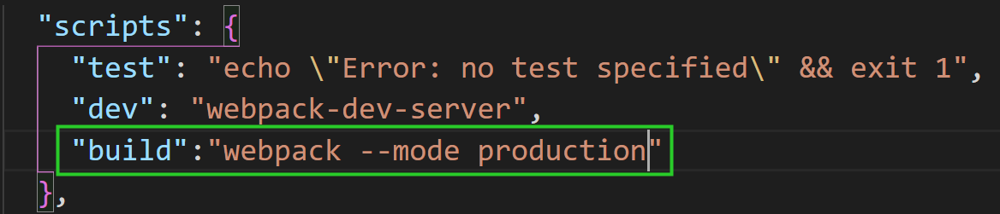

--mode 属性是为了让项目处于生产模式。 相当于修改了 mode属性。

## 七、作业   

1. 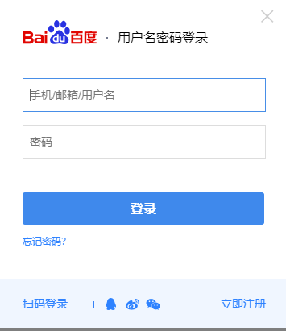

   1. 静态页面 100%  素材去百度

   2. 登录功能，要求加正则验证 手机号  邮箱 

      用户名8位字母数字下划线组合，首字母必须大写，第2,3位必须是小写，后5位 必须是字母数字或者下划线

   3. 结合webpack 来开发和打包

