# 第一章：初识vue和vue指令的使用

## 回顾webpack: 3w1h

## 课程目标

- 掌握常用指令及其数据交互方式

  v-if  v-for  ......   axios 

- 掌握组件开发方式 

  组件：html页面 让html模块 也可以进行复用。 xxx.vue 

- 掌握路由配置 

  点击超链接 导航到 指定的组件 并显示在页面上。

- 学会使用vuex及vue-ui组件库 

- 使用vue进行项目开发  

## 本章目标

- 了解vue的产生背景 
- 优势，好处 
- 了解vue的**核心思想mvvm**  
- 制作Vue.js起步 
- vue模版语法制作倒序字符串 
- 了解什么是 Vue.js 指令
- 理解 Vue.js 指令的用途
- 掌握 Vue.js 指令的书写规范
- 能够使用 Vue.js 指令完成部分页面交互效果

## 一、Vue.js 简介 

### 1.1 介绍 

前端三剑客：anguler (很少)  

vue    针对中小型项目

react 大型项目 ---》编码方式--》传统的 js 


- Vue.js 是目前最流行的、**国产的**前端MVVM框架 主要用于**构建用户页面**
  - 框架：封装与业务无关的重复代码，形成框架 
  - 框架的优势：提升开发效率，提高代码重用性，使前端开发变得简单
- 渐进式 JavaScript框架：
  - 可以由浅入深的，由简单到复杂的使用 vue.js 
  - 渐进式意味着你可以将Vue作为你应用的一部分嵌入其中，带来更丰富的交互体验。
- 作者是尤雨溪 ( 美籍华人 ) ，前 Google 员工   知乎 
- GitHub账号：https://github.com/yyx990803  gitee
- 官方入门：https://cn.vuejs.org/ 
- vue2.0API 文档：https://cn.vuejs.org/v2/guide/
- vue3.0API 文档：https://www.vue3js.cn/docs/zh/
- GitHub 库：https://github.com/vuejs/vue 

### 1.2 历史由来 

**数据**  

​		尤雨溪谈Vue.js :“我在 Google 的工作需要在浏览器上进行大量原型设计，于是我想要尽快获得有形的东西。当时有些项目使用了 Angular。Angular提供了一些用数据绑定和数据驱动来处理 DOM的方法，所以你不必自己碰DOM。它也有一些副作用，就是按照它规定的方式来构建代码。对于当时的场景而言实在是太重了。
​		我想，我可以只把我喜欢的部分从Angular中提出来，建立一个非常轻巧的库，不需要那些额外的逻辑。我也很好奇Angular的源码到底是怎么设计的。我最开始只是想着手提取 Angular 里面很小的功能，如声明式数据绑定。Vue 大概就是这么开始的。
​		用过一段时间之后，我感觉我做的东西还有点前途，因为我自己就很喜欢用。于是我花了更多的时间把它封装好，取了一个名字叫做Vue.js 。
​		2014年 2月，我第一次将它作为实际的项目发布在 Github 上，并把链接发送到了 Hacker News 上，它就被顶到了首页，然后它在首页待了好几个小时。后来，我写了一篇文章，分享了Vue 第一周的使用数据以及我的感受。那是我第一次看见这么多人在 Github 上为一个项目打星星。我当时一个星期收获了好几百个星星,整个人都激动坏了。

vue 2.6+    vue 2.7(vue3新特性)   react好  vue3  函数式组件 hooks


- 2014年2月25日，发布0.9.0
- 2015年10月27日，发布1.0.0
- 2016年4月27日，发布2.0
- 2020年9月18日， 发布3.0.0

### 1.3 Vue.js优势

1.体积小压缩后33K;   vue.js   jquery.js
2.更高的运行效率
		基于**虚拟dom**, 一种可以预先通过JavaScript进行各种计算，把最终的DOM操作计算出来并优化的技术，由于这个DOM操作属于预处理操作，并没有真实的操作DOM，所以叫做虚拟DOM。diff算法
3.**双向数据绑定**：最核心的就是**数据** 
		让开发者不用再去操作dom对象，把更多的精力投入到业务逻辑上;                                                                                                                                                      4.生态丰富、学习成本低、被广泛的应用于web端、移动端、跨平台应用开发;    weex
		市场上拥有大量成熟、稳定的基于vue.js的ui框架、常用组件!拿来即用实现快速开发!
对初学者友好、入门容易、学习资料多;

ElementUI   vant  antd...     iview   bootstrap 

**vue最大的两个优势：** 

- 数据决定/驱动视图 

- 双向数据绑定

  ​	js代码中的数据可以直接决定视图的显示，用户直接操作页面上的DOM元素 也可以把这个DOM元素对应的js中的数据修改掉。

## 二、MVC和MVVM设计模式 

### 2.1 MVC框架：

MVC全名是Model View Controller，是模型(model)－视图(view)－控制器(controller)的缩写，一种软件设计典范。

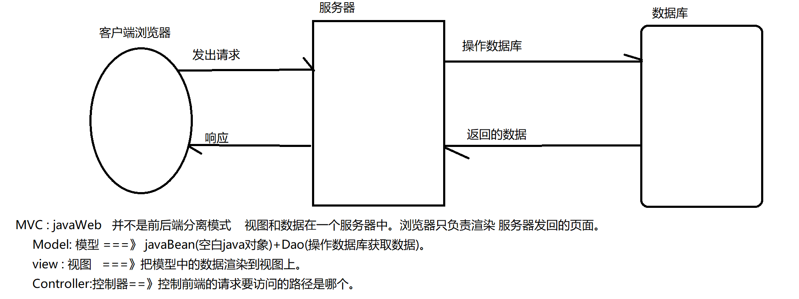

### MVC模式的意思是，软件可以分成三个部分。

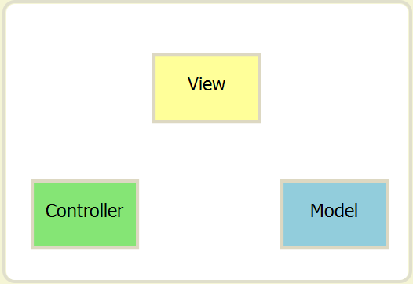

```
视图（View）：用户界面。
控制器（Controller）：业务逻辑
模型（Model）：数据保存
```

### 各部分之间的通信方式如下

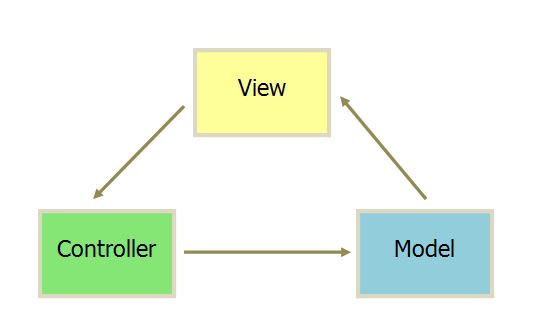

```
View 传送指令到 Controller
Controller 完成业务逻辑后，要求 Model 改变状态
Model 将新的数据发送到 View，用户得到反馈
所有通信都是单向的
```

### 2.2 MVVM框架：

MVVM是Model-View-ViewModel 的简写。它本质上就是MVC 的改进版。**MVVM 就是将其中的View 的状态和行为抽象化，让我们将视图 UI 和业务逻辑分开。**

MVVM 由 Model,View,ViewModel 三部分构成，Model 层代表数据模型，也可以在Model中定义数据修改和操作的业务逻辑；View 代表UI 组件，它负责将数据模型转化成UI 展现出来，ViewModel 是一个同步View 和 Model的对象。

在MVVM架构下，View 和 Model 之间并没有直接的联系，而是通过ViewModel进行交互，Model 和 ViewModel 之间的交互是双向的， 因此View 数据的变化会同步到Model中，而Model 数据的变化也会立即反应到View 上。

ViewModel 通过双向数据绑定把 View 层和 Model 层连接了起来，而View 和 Model 之间的同步工作完全是自动的，无需人为干涉，**因此开发者只需关注业务逻辑，不需要手动操作DOM, 不需要关注数据状态的同步问题，复杂的数据状态维护完全由 MVVM 来统一管理。**

### mvvm模型图

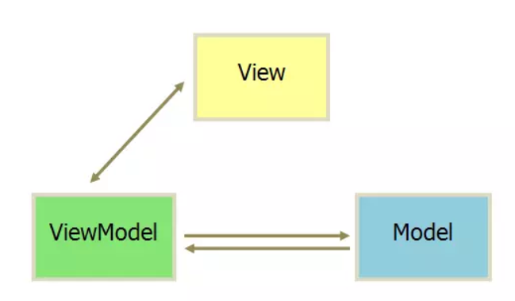

或者理解为：

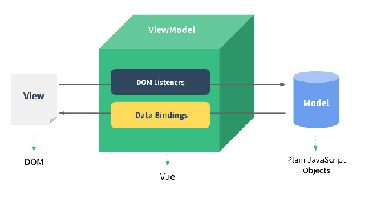

### mvvm的优势

```
1、低耦合：MVVM模式中，数据是独立于UI的，ViewModel只负责处理和提供数据，UI想怎么处理数据都由UI自己决定，ViewModel不涉及任何和UI相关的事，即使控件改变,ViewModel几乎不需要更改任何代码，专注自己的数据处理就可以了

2.自动同步数据:ViewModel通过双向数据绑定把View层和Model层连接了起来，View和Model这两者可以自动同步。程序员不需要手动操作DOM, 不需要关注数据状态的同步问题，MVVM 统一管理了复杂的数据状态维护（vue是以数据驱动视图）

3、可重用性：你可以把一些视图逻辑放在一个ViewModel里面，让很多view重用这段视图逻辑。

4、独立开发：开发人员可以专注于业务逻辑和数据的开发（ViewModel），设计人员可以专注于页面设计。

5、可测试：ViewModel里面是数据和业务逻辑，View中关注的是UI，这样的做测试是很方便的，完全没有彼此的依赖，不管是UI的单元测试还是业务逻辑的单元测试，都是低耦合的
```

### 2.3 二者区别

```
mvc 和 mvvm 其实区别并不大。都是一种设计思想，主要区别如下：
1.mvc 中 Controller演变成 mvvm 中的 viewModel
2.mvvm 通过数据来驱动视图层的显示而不是节点操作。
3.mvc中Model和View是可以直接打交道的，造成Model层和View层之间的耦合度高。而mvvm中Model和View不直接交互，而是通过中间桥梁ViewModel来同步
	mvc数据单向传递，mvvm数据双向绑定
4.mvvm主要解决了:mvc中大量的DOM 操作使页面渲染性能降低，加载速度变慢，影响用户体验。
```

## 三、vue的使用入门 

### 3.1 Vue.js的开发模式 (下载安装) 

- 根据项目需求，可以选择从不同维度使用它 

  - 开发简单页面或者应用，可以直接使用script标签引入CDN-vue文件，当然也可以把代码下载下来，通过相对路径引入

    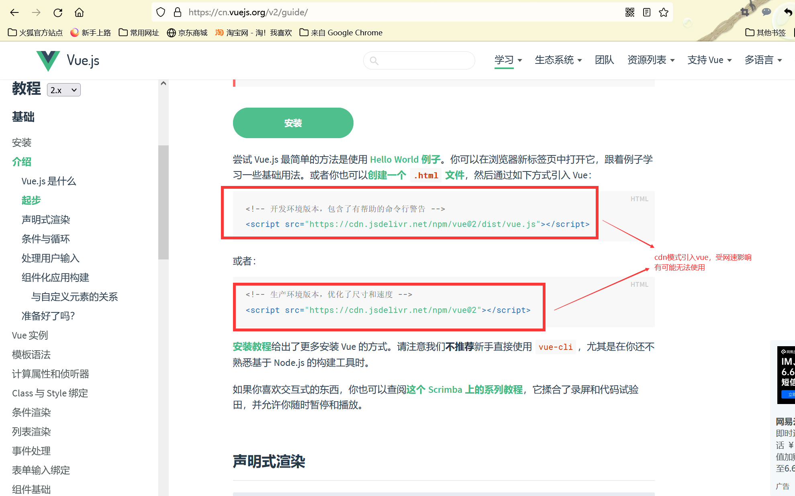

  - 对于一些业务逻辑复杂，对前端工程有要求的项目，可以使用Vue单文件的形式结合webpack使用，必要时还会用到vue-router来管理路由，使用vuex来管理状态 。使用@vue/cli 【vue-cli】  【vue3.0--vite】

- 下载vue.js 

  下载vue:https://vuejs.org/v2/guide/installation.html#Direct-lt-script-gt-Include

  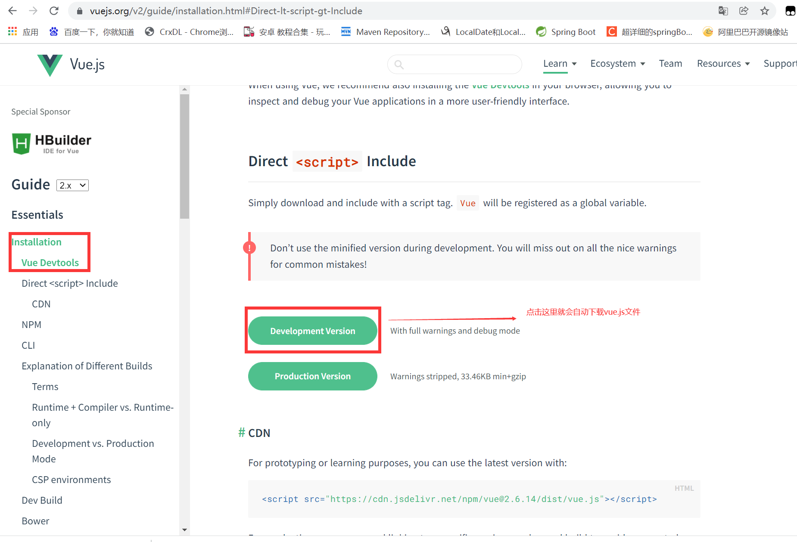

- 也可以直接去github仓库下载：https://github.com/vuejs/vue

  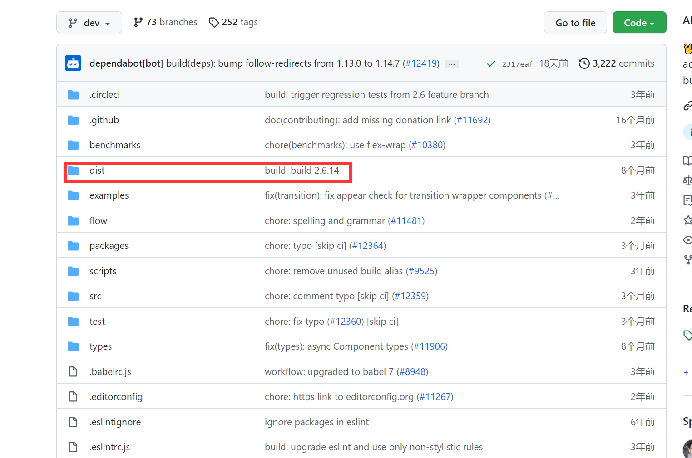

  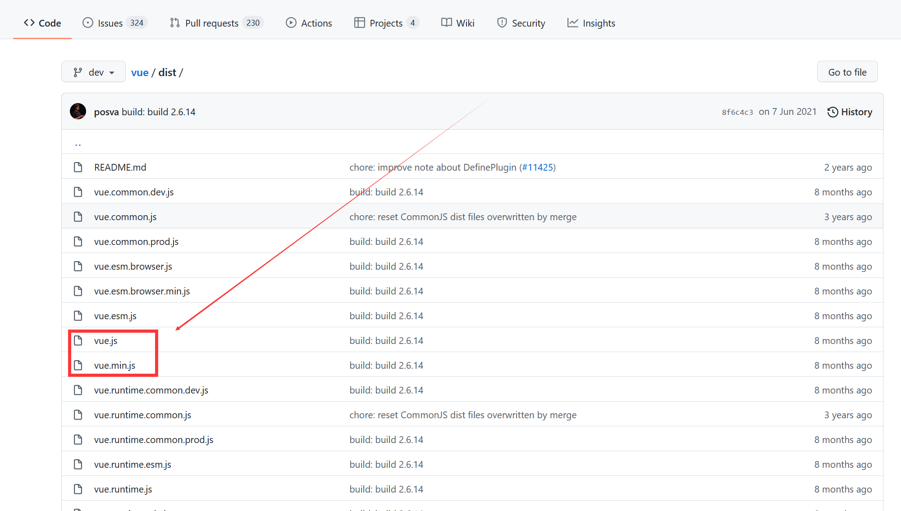

### 3.2 Vue起步插值表达式概述 

- 什么是插值表达式

  - 使用双大括号来包裹 js 代码构成插值表达式 `{{表达式}}`

- 插值表达式用来做什么

  - 将双大括号中的数据替换成vue实例中对应属性值进行展示

- 双大括号语法

  - 也叫模板语法，Mustache 语法，
  - Vue.js 使用了基于 HTML 的模板语法，允许开发者声明式地将 DOM 绑定至底层 Vue 实例的数据。所有 Vue.js 的模板都是合法的 HTML，所以能被遵循规范的浏览器和 HTML 解析器解析。

- 插值表达式中可以写入哪些内容

  - JSON数据
  - 数字
  - 字符串
  - js表达式
  - 普通运算

- 注意

  - **插值表达式只能用在内容节点，不能用在属性节点中。**

  - 避免在双括号中使用复杂表达式(或者js语句)
  
  - ```js
    <!-- 这是语句，不是表达式 -->
    {{ var a = 1 }}
    
    <!-- 流程控制也不会生效，请使用三元表达式 -->
    {{ if (ok) { return message } }}
    ```

```html
<!DOCTYPE html>
<html>
	<head>
		<meta charset="utf-8">
		<title></title>
		<script src="../js/vue.js"></script>
	</head>
	<body>
		<div id="app">
			<!-- 从vue对象中的data对象中取name属性的值 -->
			{{name}}
			<!-- 从vue对象中的data对象中的person对象中取name属性的值 -->
			{{person.name}}
			<!-- 插值表达式中可以写三目运算符 -->
			{{num > 4 ? 10 : 20}}
			<!-- 插值表达式中可以直接写字符串 -->
			{{'你好哈哈哈'}}
			<!-- 插值表达式中可以定义json对象和数组 就是直接显示对象和数组 -->
			{{
				{
					name:'李四',
					age:18
				}
			}}
			{{
				[1,2,3]
			}}
			<!-- 插值表达式中也可以调用函数 需要把函数挂载到vue对象中的methods属性上 -->
			{{fun1()}}
			<h1>{{fun2()}}</h1>
		</div>
	</body>
	<script type="text/javascript">
		new Vue({
			//elements目标元素
			el:'#app',
			//数据存放的位置
			data:{
				name:'张三',
				num:5,
				person:{
					name:'李四',
					age:19,
					address:'郑州'
				}
			},
			//methods属性用于挂载方法，绑定事件用额
			methods:{
				fun1(){
					console.log('你好啊哈');
				},
				fun2:()=>{
					return 'fun2函数';
				}
			},
			
		})
	</script>
</html>
```

### 3.3 数据双向绑定原理分析（表现形式，不是底层源码分析）

底层原理实现后面课程讲到

- DOM监听 
  
  - 视图层发生变化，DOM监听到之后，会传到逻辑层进行处理
- 数据绑定
  - 逻辑层把数据处理完成之后，通过数据绑定，把处理后的结构返回给视图层
  
    也就是或js代码中数据的变化会被自动同步到页面上，页面上的表单中数据的变化也会被同步到js数据中。
  
  - 


### 3.4 案例

- #### 案例1-Vue.js 初体验 

需求说明
引入vue.js库
创建 view 视图 
通过vue实例化一个 vue对象
将 data 中变量 msg 放在 #box内的双花括号内,最后显示在浏览器中

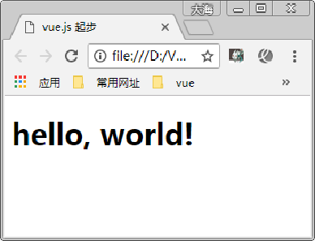

- #### 案例2-制作倒序字符串

需求说明
使用插值表达式完成右图效果，将“hello”转为“olleh”
调用原生的JavaScript方法字符串分割、数组翻转等

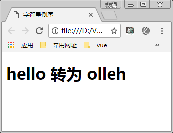

### 3.5 计算属性computed

模板内的表达式非常便利，但是设计它们的初衷是用于简单运算的。在模板中放入太多的逻辑会让模板过重且难以维护。如上案例。所以，对于任何复杂逻辑，你都应当使用**计算属性**（computed）。

```js
var vm = new Vue({
  computed: {
    // 计算属性的 getter 此时的reversedMessage相当于是一个属性，并不是函数
    reversedMessage: function () {
      // `this` 指向 vm 实例
      return this.message.split('').reverse().join('')
    }
  }
})

你可以像绑定普通 property 一样在模板中绑定计算属性。Vue 知道 vm.reversedMessage 依赖于 vm.message，因此当 vm.message 发生改变时，所有依赖 vm.reversedMessage 的绑定也会更新。

我们可以将同一函数定义为一个方法而不是一个计算属性。两种方式的最终结果确实是完全相同的。然而，不同的是计算属性是基于它们的响应式依赖进行缓存的。只在相关响应式依赖发生改变时它们才会重新求值。这就意味着只要 message 还没有发生改变，多次访问 reversedMessage 计算属性会立即返回之前的计算结果，而不必再次执行函数。
	#跟绑定方法相比：计算属性 不用绑定任何事件类型，其次 计算属性 只要操作的值没有发生改变，那么计算属性的方法就不会执行，只会把之前的结果做缓存，直接取值。但是如果绑定方法，只要方法调用，函数就会执行，提高效率。
    
#计算属性默认只有 getter，不过在需要时你也可以提供一个 setter
演示案例-计算属性steer
//方式二：通过计算属性反转
			computed:{
				/* reserves:function(){
					return this.msg.split('').reverse().join('');
				} */
				reserves:{
					get:function(){
						return this.msg.split('').reverse().join('');
					},
					set:function(msg){
						this.msg = msg;
					}
				}
			}

<div class="box">
			{{msg}}反转后{{reserves}}<br>
            set也是属性的形式，所以直接使用=赋值改变msg的值
			{{reserves='你好哈哈哈'}}反转{{reserves}}
</div>
注意：计算属性本身就是一个属性，计算属性类似于侦听器，只要数据发生了改变 计算属性就会重新运算并且发生改变。
```

## 四、vue指令 

### 4.1 相关插件安装 

高亮代码括号的插件

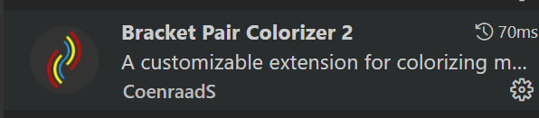

vue的代码提示插件


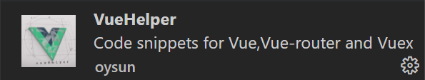

标签重命名插件

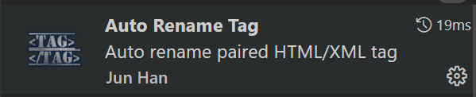


###   4.2 什么是 Vue 指令

指令 (Directives) 是带有 `v-` 前缀的特殊 attribute。指令 attribute 的值预期是**单个 JavaScript 表达式**。指令的职责是，当表达式的值改变时，将其产生的连带影响，响应式地作用于 DOM。解析模板/标签(标签属性，标签体内容，绑定事件等)
例如：

```js
//点击toggle按钮，会显示红色方块，再次点击，红色方块消失，这里就是通过控制属性的真假，通过指令作用到红色方块上来控制方块的显示隐藏
<button v-on:click="isaaa = !isaaa">toggle</button>
<div class="block" v-show="isaaa"></div>
```

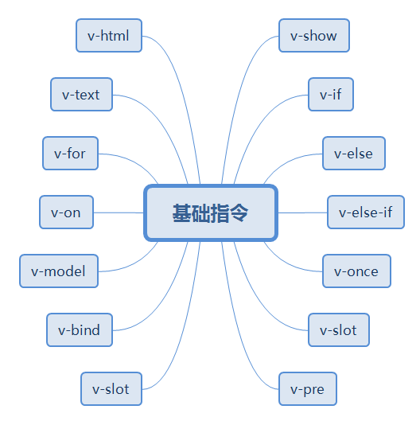

### 4.3 Vue.js 指令的书写规范 

```js
//书写位置：任意 HTML 元素的开始标签内 
<p v-if="seen">现在你看到我了</p>

//注意：一个开始标签内可写入多个指令，多个指令间使用空格分隔
<a href="javascript:;" :class="{active:timeflag}" @click="queryAll('time')">全部</a>

```

### 4.4 常用指令 

- **`v-text`** 

  语法格式：`v-text='表达式'` 

  作用相当于之前学习的DOM操作中的innerText属性,会直接覆盖元素中原本的文本内容，实际开发中使用不多

  ```html
  <p v-text="name+'法撒旦'"></p>
  <script>
  let app = new Vue({
  			el:'p',
  			data:{
  				stat:true,
  				name:'张三'
  			}
  		})
  </script>
  ```

- **`v-html`**

  语法格式：`v-html='表达式'`

  作用相当于DOM操作中的innerHTML属性，可以识别字符串中的标签。

  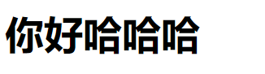

  ```html
  <p v-html="msg"></p>
  <script>
  let app = new Vue({
  			el:'p',
  			data:{
  				msg:'<h1>你好哈哈哈</h1>'
  			}
  		})
  </script>
  ```

- **`v-if ` `v-else-if` `v-else`  ** 

  作用等同于js代码中的 if  else if  elseif  else  帮助我们按照需求去控制DOM元素的显示与隐藏。

  语法格式：`v-if='表达式'`   `v-else-if='表达式'`   `v-else='表达式'`  

  **注意：** v-if 和后续的v-else-if  v-else都要连续使用，如果中间有间隔，效果是可以正常显示的，但是，控制台会报错。这个特性针对操作同级元素的时候来说。

  ```html
  <body>
      <div id="max">
          <ul v-if='num>10'>
              <li>你好哈哈1</li>
              <li>你好哈哈2</li>
              <li>你好哈哈3</li>
          </ul>
          <ul v-else="num>5">
              <li>你好嘿嘿1</li>
              <li>你好嘿嘿2</li>
              <li>你好嘿嘿3</li>
          </ul>
      </div>
  </body>
  <script>
      let app = new Vue({
          el: '#max',
          data: {
              num: 9
          }
      })
  </script>
  ```

- **`v-show`** 

  控制元素是否显示，作用等同于 css 样式的display:none 或非none

  语法格式： `v-show='true/false'`;  true为显示，false为不显示

  ```html
  <div id="max">
  			<p v-show='stat'>你好哈哈哈</p>
  			<button v-on:click='tiggleShow()'>点我</button>
  		</div>
  <script type="text/javascript">
  		let app = new Vue({
  			el:'#max',
  			data:{
  				stat:true,
  			},
  			methods:{
  				tiggleShow(){
  					this.stat = !this.stat;
  				}
  			}
  		})
  	
  	</script>
  ```

  ```
  v-if与v-show区别:
    v-show指令的元素始终会被渲染到HTML
    它只是简单地为元素设置CSS的style属性。当不满足条件的元素被设置style="display:none"样式
    v-if指令满足条件是，会渲染到html中，不满足条件时，是不会渲染到html中的
  
  v-if 指令有更高的切换消耗
  v-if当条件成立的时候会将元素加上，不成立的时候，就会移除dom，并且内部的指令不会执行
  v-show 指令有更高的初始渲染消耗
  v-show只是简单的隐藏和显示
  如果需要频繁切换使用 v‐show 较好，如果在运行时条件不大可能改变 使用v‐if 较好
  ```

  

- **`v-for`**  循环遍历 #*

  v-for的作用等同于js代码中的for循环，用于循环生成DOM结构，想循环哪个DOM结构，就在哪个DOM结构上添加v-for。

  **但凡使用到v-for的地方 必须添加第二个属性 :key='id'**

  ```html
  <body>
      <div id="box">
          <!-- 遍历数组
          语法 v-for="(item,index) in arr"
              item 就表示数组中的每一个数据
              index表示下标
      -->
          <ul>
              <li v-for="(item,index) in arr">{{item}}</li>
          </ul>
          <!-- 遍历普通对象
              语法 v-for="(val,key,i) in arr"
              val 就表示对象中的每一个值
              key 就表示对象中的每一个键值
              i就是下标
          -->
          <ul>
              <li v-for="(val,key,i) in user">{{key}}--{{val}}--{{i}}</li>
          </ul>
  		<!-- 遍历字符串 -->
          <ul>
              <li v-for="(item,i) in str">{{item}}</li>
          </ul>
      </div>
      <script>
          let app = new Vue({
              el: '#box',
              data: {
                  arr: ['a', 'b', 'c'],
                  user: { "name": '张三', "age": 18, "address": '郑州' },
                  str:'abcdefg'
              }
          })
      </script>
  </body>
  
  ```

- **`v-on`**  绑定事件和事件处理

  vue的绑定事件的方式，只需要把原生事件名字的on去掉就可以了

  例如: onclick === > @click/v-on:click    onblur ===> @blur/v-on:blur

  - 普通用法

    ```html
    为 HTML 元素绑定事件监听
    	v-on：事件名称 =‘函数名称()’
    		表达式可以是一个方法的名字或一个内联语句
    	简写语法：@事件名称 =‘函数名称()’
    	注意：函数定义在 methods 配置项中
    
    <button v-on:click='fn()'>toggle</button>
    v-on: 可以简写成 @
    <button @click='fn()'>toggle</button>
    ```

- **`v-bind`** 

  作用：为元素的**属性** **动态**的绑定值 

```html
v-bind可以在其名称后面带一个参数，参数通常是HTML元素的属性（attribute），v-bind是动态绑定指令，默认情况下自带属性的值是固定的，为了能够动态的给这些属性添加/修改值可以使用v-bind指令
v-bind:属性名 = ‘表达式’
简写形式：v-bind可以省略，直接书写为 :属性名 = ‘表达式’
 等价于     //绑定一个属性

```

**v-bind:绑定class**

```js
//对象语法
	我们可以传给 v-bind:class 一个对象，以动态地切换 class：
	格式：<div v-bind:class="{ 类名: 布尔值 }"></div>
//isActive是boolean属性的参数，为true就给div添加类名active,为false就不添加
<div v-bind:class="{ active: isActive }"></div>
可以同时绑定多个类名，也可以和静态类名同时存在
<div class="static" v-bind:class="{ active: isActive, 'text-danger': hasError }"></div>

//数组语法
我们可以把一个数组传给 v-bind:class，以应用一个 class 列表：
<div v-bind:class="[activeClass, errorClass]"></div>
 data: {
  activeClass: 'active',
  errorClass: 'text-danger'
}

<div v-bind:class="[isActive ? activeClass : '', errorClass]"></div>
//绑定多个属性
<div v-bind:class="{'textColor':isColor, 'textSize':isSize}">多个样式的绑定</div>

 <div id="box">
        <a :href="url" v-bind:class='classname'>点我</a>
    </div>
    <script>
        new Vue({
            el:'#box',
            data:{
                url:'http://www.baidu.com',
                classname:['aaa','bbb','ccc']
            }
        })
    </script>
```

**v-bind:绑定内联样式** 

```js
#对象语法
//v-bind:style 的对象语法十分直观——看着非常像 CSS，但其实是一个 JavaScript 对象。CSS property 名可以用驼峰式 (camelCase) 或短横线分隔 (kebab-case，记得用引号括起来) 来命名：
<div v-bind:style="{ color: activeColor, fontSize: fontSize + 'px' }"></div>
data: {
  activeColor: 'red',
  fontSize: 30
}
//直接绑定到一个样式对象通常更好，这会让模板更清晰：
<div v-bind:style="styleObject"></div>
data: {
  styleObject: {
    color: 'red',
    fontSize: '13px'
  }
}

#数组语法
//v-bind:style 的数组语法可以将多个样式对象应用到同一个元素上：
<div v-bind:style="[styleObject，baseStyles, overridingStyles]"></div>
```

- **`v-model`**  *** 

  你可以用 `v-model` 指令在表单 `<input>`、`<textarea>` 及 `<select>` 元素上创建**双向数据绑定**。它会根据控件类型自动选取正确的方法来更新元素。尽管有些神奇，但 `v-model` 本质上不过是语法糖。它负责监听用户的输入事件以更新数据，并对一些极端场景进行一些特殊处理。

  `v-model` 会**忽略**所有表单元素的 `value`、`checked`、`selected` attribute 的初始值而总是将 Vue 实例的数据作为数据来源。你应该通过 JavaScript 在组件的 `data` 选项中声明初始值。

  **v-model说白了就像监听器一样，会自动的将vue实例的值同步更新到表单中，同样的也会把表达中的值同步到vue实例中。**

  这就是双向数据绑定。

  **注意：**只有表单元素使用v-model使用才有意义，因为只有表单元素才可以跟用户交互。别的元素使用只能显示数据，没有别的意义。

  **对input框，操作的是value属性的值：**

  ```html
  <body>
      <div class="box">
          <input type="text" value="你好嘿嘿嘿" v-model='msg'>
          <br>
          {{msg}}
      </div>
      <script>
          new Vue({
              el:'.box',
              data:{
                  msg:'你好哈哈哈'
              }
          })
      </script>
  </body>
  ```

  **对单个复选框操作的是 checked属性的值：**

  ```html
  <body>
      <div class="box">
          <input type="checkbox" v-model='b'>
          <br>
        	{{b}}
      </div>
      <script>
          new Vue({
              el:'.box',
              data:{
                  b:''
              }
          })
      </script>
  </body>
  此时vue实例中b的值会就跟复选框绑定到了一起。
  ```

  **对多个复选框操作如果在vue实例中是用一个数组接收，接收到是一个数组，里边包含的是被选中的复选框的vlaue值**

  ```html
  <body>
      <div class="box">
          <input type="checkbox" value="1" v-model='b'>
          <input type="checkbox" value="2" v-model='b'>
          <input type="checkbox" value="3" v-model='b'>
          <br>
        	{{b}}
      </div>
      <script>
          new Vue({
              el:'.box',
              data:{
                  b:[]
              }
          })
      </script>
    想让哪个框默认选中，就直接把这个框的值写入到vue的实例中去。
  ```

  **对于单选框来说，拿到的是被选中的那个单选框的value属性的值：**

  ```html
  <body>
      <div class="box">
          <input type="radio" value="男" name="sex" v-model="s">男
          <input type="radio" value="女" name="sex" v-model="s">女
          <br>
         	{{s}}
      </div>
      <script>
          new Vue({
              el:'.box',
              data:{
                  s:""
              }
          })
      </script>
  </body>
  ```

  **对于下拉框来说，拿到的是被选中的那个选项的值** 

  ```html
  <body>
      <div class="box">
          <select name="" id="" v-model="selected" multiple>
              <option value="a">a</option>
              <option value="b">b</option>
              <option value="c">c</option>
              <option value="d">d</option>
          </select>
          <br>
          {{selected}}
      </div>
      <script>
          new Vue({
              el:'.box',
              data:{
                  selected:''
              }
          })
      </script>
  </body>
  此时selected拿到的就是被选中的项的value值，如果是多选的下拉框，此时的selected值就是选中的多个框的value值。
  ```

- `v-model的专用修饰符` 

  ```html
  .lazy - 取代 input 监听 change 事件
  	原本的数据绑定相当于对input框进行oninput事件监听，使用v-model.lazy之后相当于把oninput事件换成了onchange事件
  .number - 输入字符串转为有效的数字  自动转换为数字
      <div id="app">
              <input type="text" v-model.number='num1'>+<input type="text" v-model.number='num2'>=<span>{{num1+num2}}</span>
          </div>
          <script>
              new Vue({
                  el:'#app',
                  data:{
                      num1:1,
                      num2:2
                  }
              })
          </script>
  .trim - 输入首尾空格过滤
  ```

### 

## 五、总结与作业：

面试题：谈谈你对mvc mvvm的理解？掌握vue的常用指令