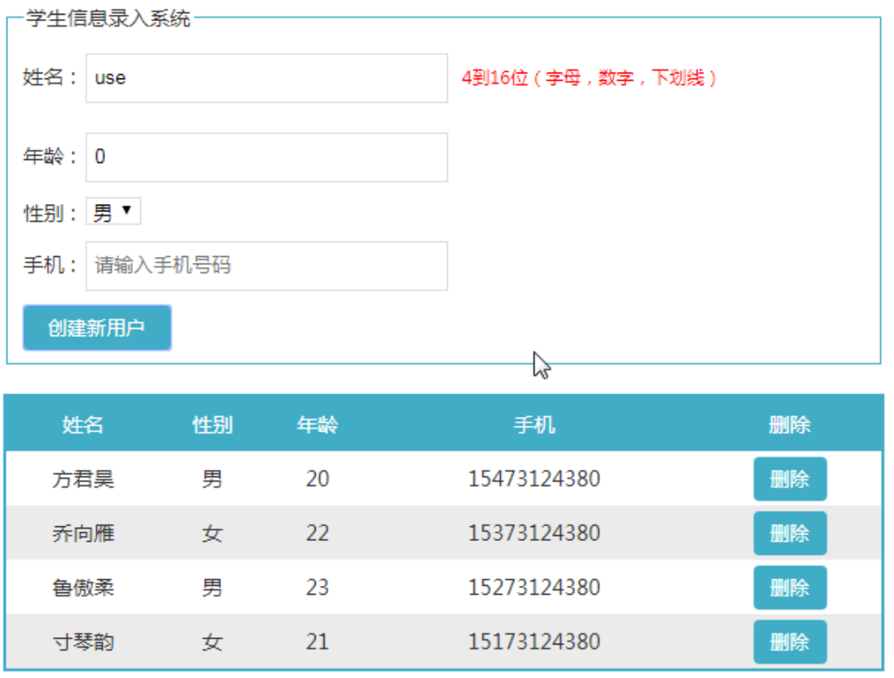

# 第二章：vue事件处理和常用修饰符和指令案例练习

## 回顾:

## 本章目标

- vue中的事件处理
- 事件修饰符
- 按键修饰符
- 系统修饰符
- exact修饰符
- 鼠标修饰符

## 一、事件处理和修饰符相关

### 事件处理

- vue中的event事件对象：

  如果调用函数时不传递参数，那么在函数中可以直接使用e来表示事件对象，但是如果进行参数的传递，在函数内部就无法再使用e了，此时 vue中给我们提供了一个 $event 来表示事件对象，只需要调用函数时传入即可。

```html
获取事件对象
 	<div id="max">
        <button @click='fn($event)'>点我获取事件对象</button>
    </div>
    <script>
        new Vue({
            el: '#max',
            methods: {
                fn(e){
                    console.log(e);
                }
            }
        })
    </script>
```

- **事件修饰符**

  ```
  v-on后面可以增加修饰符
  <div @click.stop='fn()'>点我</div>
  事件修饰符：
  	常用：
      	.stop：调用event.stopPropagation() 阻止事件冒泡
      	.prevent : 调用event.preventDefault()阻止默认行为
      不常用：
          .self : 只当事件是从侦听器绑定的元素本身触发时才触发回调
              例如：如果不想添加冒泡事件，可以给父子级的元素都添加.self修饰符这样就不会触发冒泡事件，只有在点击元素自身的时候才会触发。
          .once:点击事件将只会触发一次
              事件只会被触发一次，触发后，底层就会解绑事件 类似于jquery中one()事件绑定
          .capture:添加事件监听器时使用事件捕获模式
          .passive:滚动事件的默认行为 (即滚动行为) 将会立即触发
  ```

- **按键修饰符**  

  在监听键盘事件时，我们经常需要检查详细的按键。Vue 允许为 `v-on` 在监听键盘事件时添加按键修饰符：

  ```
  <!-- 只有在 `key` 是 `Enter` 时调用 `vm.submit()` -->
  <input v-on:keyup.enter="submit">
  ```

  注意：`keyCode` 的事件用法[已经被废弃了](https://developer.mozilla.org/en-US/docs/Web/API/KeyboardEvent/keyCode)并可能不会被最新的浏览器支持。

  使用 `keyCode` attribute 也是允许的：

  ```
  <input v-on:keyup.13="fn1">enter键触发
  <input v-on:keyup.65="fn2">a键触发
  ```

  为了在必要的情况下支持旧浏览器，Vue 提供了绝大多数常用的按键码的别名：

  - `.enter`
  - `.tab` 
  - `.delete` (捕获“删除”和“退格”键)
  - `.esc` 
  - `.space`
  - `.up`
  - `.down`
  - `.left`
  - `.right`

  有一些按键 (`.esc` 以及所有的方向键) 在 IE9 中有不同的 `key` 值, 如果你想支持 IE9，这些内置的别名应该是首选。

  你还可以通过全局 `config.keyCodes` 对象[自定义按键修饰符别名](https://cn.vuejs.org/v2/api/#keyCodes)：

  ```html
  // 可以使用 `v-on:keyup.f1`
  
  <div id="max">
          <input type="text" @keydown.aaa='fn4'>
  
      </div>
      <script>
      	//单个定义
      	Vue.config.keyCodes.f1 = 112
      	//当以多个
          Vue.config.keyCodes = {
              aaa:65,
              bbb:66
          }
          new Vue({
              el: '#max',
              methods: {
                  fn4(){
                      alert('a键被按下了');
                  }
  
              }
          })
      </script>
  ```

- **系统修饰键**

  ```
  系统修饰键
      .ctrl
      .alt
      .shift
      .meta
  注意：在 Mac 系统键盘上，meta 对应 command 键 (⌘)。在 Windows 系统键盘 meta 对应 Windows 徽标键 (⊞)。在 Sun 操作系统键盘上，meta 对应实心宝石键 (◆)。在其他特定键盘上，尤其在 MIT 和 Lisp 机器的键盘、以及其后继产品，比如 Knight 键盘、space-cadet 键盘，meta 被标记为“META”。在 Symbolics 键盘上，meta 被标记为“META”或者“Meta”。
  
  <!-- Alt + C -->同时按下alt键和c键
  <input v-on:keyup.alt.67="handler">
  
  #请注意: 修饰键与常规按键不同，在和 keyup 事件一起用时，事件触发时修饰键必须处于按下状态。换句话说，只有在按住 ctrl 的情况下释放其它按键，才能触发 keyup.ctrl。而单单释放 ctrl 也不会触发事件。如果你想要这样的行为，请为 ctrl 换用 keyCode：keyup.17。
  ```

- **`.exact` 修饰符** 

  > 2.5.0 新增

  `.exact` 修饰符允许你控制由精确的系统修饰符组合触发的事件。

  ```
  <!-- 只要按下的键中有ctrl键 事件就可以被触发 -->
  <button v-on:click.ctrl="onClick">A</button>
  
  <!-- 有且只有 Ctrl 被按下的时候才触发 -->
  <button v-on:click.ctrl.exact="onCtrlClick">A</button>
  
  <!-- 没有任何系统修饰符被按下的时候才触发 -->
  <button v-on:click.exact="onClick">A</button>
  ```

- **鼠标按钮修饰符** 

  > 2.2.0 新增

  - `.left`
  - `.right`
  - `.middle`

  这些修饰符会限制处理函数仅响应特定的鼠标按钮。

  ```
  当点击鼠标右键时才会触发事件
  <button @click.right='fn()'>鼠标修饰符</button>
  ```

## 二、案例作业 

### 案例1—注册页面

需求说明
使用常见表单元素布局注册页面
使用v-model指令完成对应数据的绑定
填写的表单内容可以显示在表单下方


### 案例2—点击重新编辑

需求说明
点击“Edit Me”，下方出现文本框，可以自行修改文本
输入框中的文字和页面中的文字保持一致
使用 v-show、v-on、v-model 指令

<video src="assets/点击重新编辑.mp4"></video>


### 案例3—仿京东左侧菜单

需求说明:
完成京东左侧菜单的页面布局
使用 v-for 指令遍历子分类名称，从而显示子分类的列表


### 案例4—导航切换 

需求说明：
点击导航条中的导航项目，当前被点击的项目内容会显示在下方绿色方块中，并且当前被点击项目的背景会变成红色
使用 v-for 指令遍历显示导航项目，使用v-on添加添加事件，使用v-bind指令动态绑定class和key属性


### 案例5—商品的增加，删除，上下架 


**需求：** 

- 点击新增，添加商品，如果输入框为空字符串则弹出提示框
- 点击删除，删除对应的行
- 点击操作栏中的上下架，改变对应的状态

```html
<!DOCTYPE html>
<html lang="en">
<head>
    <meta charset="UTF-8">
    <meta http-equiv="X-UA-Compatible" content="IE=edge">
    <meta name="viewport" content="width=device-width, initial-scale=1.0">
    <title>Document</title>
    <script src="./lib/vue.js"></script>
    <style>
        td{
            height: 30px;
            text-align: center;
        }
    </style>
</head>
<body>
    <div id="app">
        <div>
            名称: <input type="text" v-model.trim="gName">
            数量: <input type="text" v-model.number="gNum">
            是否上架: <select v-model="gState">
                <option value="true">上架</option>
                <option value="false">下架</option>
            </select>
            <button @click="addGoods">新增商品</button>
        </div>
        <table border="1" width="800px">
            <thead>
                <th><input type="checkbox" @change="checkAll" v-model="allState"></th>
                <th>编号</th>
                <th>名称</th>
                <th>状态</th>
                <th>数量</th>
                <th>操作</th>
            </thead>
            <tbody>
                <tr v-for="(item,index) in goods">
                    <td><input type="checkbox" v-model="item.isChecked" @change="reverseChk"></td>
                    <td>{{item.id}}</td>
                    <td>{{item.name}}</td>
                    <td>
                        <span v-if="item.state">上架状态</span>
                        <span v-else>下架状态</span>
                    </td>
                    <td><button @click="add(item.id)">+</button><span>{{item.num}}</span><button @click="sub(item.id,index)">-</button></td>
                    <td>
                        <button @click="del($event,item.id)">删除</button>
                        <button v-if="item.state" @click="item.state=!item.state">点击下架</button>
                        <button v-else  @click="item.state=!item.state">点击上架</button>
                    </td>
                </tr>
            </tbody>
        </table>
        <span>选中的商品的总数量：{{count}}</span>
    </div>

    <!-- <button onclick="alert()">点我</button> -->
</body>
<script>
    /*
        ① 根据data数据渲染DOM结构
        ② 新增商品
        ③ 删除功能  根据id删除
        ④ 上下架功能  根据id修改上下架
        ⑤ 首先把数据中新增一个属性 isChecked
            在把这个属性跟页面中的input框做双向数据绑定
            全选：给全选框绑定事件
            反选：给所有的复选框绑定事件
    */
    new Vue({
        el:'#app',
        data:{
            goods:[
                {id:1,name:'苹果',state:true,num:5,isChecked:false},
                {id:2,name:'香蕉',state:false,num:5,isChecked:false},
                {id:3,name:'橘子',state:true,num:5,isChecked:true},
                {id:4,name:'甘蔗',state:true,num:5,isChecked:false},
                {id:5,name:'荔枝',state:true,num:5,isChecked:false}
            ],
            //定义商品名称
            gName:'',
            //商品的数量
            gNum:0,
            //上下架的状态
            gState:true,
            //商品id
            ids:5,
            //全选状态
            allState:false,
            //记录选中的商品的总数量
            //count:0
        },
        methods: {
            //定义新增商品的方法/函数
            addGoods(){
                //1.先创建一个商品对象 
                let obj = {
                    id:++this.ids,
                    name:this.gName,
                    num:this.gNum,
                    state:this.gState
                }
                //2.把数据整体追加到 data中goods中
                this.goods.push(obj);
            },
            //定义删除按钮
            del(e,i){
                //方式一：DOM方式  不推荐使用
                //e.target.parentElement.parentElement.remove()
                //e.target.parentNode.parentNode.remove()

                //方式二：从数据的角度来删除
                /* this.goods.forEach((item,index) => {
                    if(item.id==i){
                        //index表示删除的下标  1 表示删除的个数
                        this.goods.splice(index,1)
                    }
                }); */
                //使用数组的filter方法做过滤操作 拿到符合条件的所有结果
                this.goods = this.goods.filter(item=>item.id!=i)
            },
            //定义修改状态的函数
            /* changeState(i){
                this.goods.forEach((item) => {
                    if(item.id==i){
                        //index表示删除的下标  1 表示删除的个数
                        item.state = !item.state
                    }
                });
            } */
            //定义全选事件
            checkAll(){
                //全选：要把购物车中所有的选项的isChecked属性值都变成跟全选框一致
                this.goods.forEach((item) => {
                    item.isChecked = this.allState
                });
            },
            //定义反选事件
            reverseChk(){
                //点击每一个复选框时，都要对所有复选框做遍历，看里边是否存在isChecked为false的选项
                //只要有false  那么allState也等于false 
                this.allState = this.goods.every(item=>item.isChecked==true)
            },
            //定义数量的增加方法
            add(i){
                this.goods.forEach((item) => {
                    if(item.id==i){
                        item.num+=1
                    }
                });
            },
            //定义数量的减少方法
            sub(i,a){
                //如果数量为1的  就直接return  
                if(this.goods[a].num==1) return ;
                
                this.goods.forEach((item) => {
                    if(item.id==i){
                        item.num-=1
                    }
                });
            }
        },
        computed: {
            //计算选中结算的商品总数量
            count(){
                //先 筛选 出被选中的商品 再 计算中总数量赋值给count 
                return this.goods.filter(item=>item.isChecked==true).reduce((total,item)=>total+=item.num,0)
            }
        }
    })
</script>
</html>
```


## 三、作业：

作业1：学生信息录入系统



作业2：任务列表案例

需求：观察视频中各项特效变化，完成效果。

<video src="assets/todolist.mp4"></video>

```html
<!DOCTYPE html>
<html lang="en">
<head>
    <meta charset="UTF-8">
    <meta http-equiv="X-UA-Compatible" content="IE=edge">
    <meta name="viewport" content="width=device-width, initial-scale=1.0">
    <title>Document</title>
    <script src="../js/vue.js"></script>
    <style>
        .active{
            text-decoration: line-through;
            color: gray;
        }
    </style>
</head>
<body>
    <div id="app">
        <h1>任务列表</h1>
        <h4>任务总数{{sum()}}; 未完成{{daiban()}};已完成{{sum()-daiban()}}</h4>
        <ol>
            <li v-for='(item,index) in lists'>
                <input :id="item.id" v-model='item.isChecked' type="checkbox">
                <span :class="{active:item.isChecked}"  @dblclick='showInp1(index)' v-show='item.isEdit'>{{item.content}}</span>
                <input type="text" @blur='item.isEdit=true' v-model='item.content'  v-show='!item.isEdit'>
            </li>
        </ol>
        <input type="text" v-model.trim='msg'><button @click='add'>添加</button>
        <button @click='del'>删除已完成任务</button>
    </div>
    <script>
        let vm = new Vue({
            el:'#app',
            data:{
                lists:[
                    {isChecked:false,content:'学习java',isEdit:true},
                    {isChecked:false,content:'学习html',isEdit:true},
                    {isChecked:false,content:'学习vue',isEdit:true},
                    {isChecked:false,content:'学习css',isEdit:true}
                ],
                msg:'',
                id:0
            },
            methods:{
                //添加任务
                add(){
                    let obj = {
                        id:++this.id,
                        isChecked:false,
                        content:this.msg,
                        isEdit:true
                    }
                    this.lists.push(obj);
                },
                //定义双击任务时显示input输入框
                showInp1(i){
                    //如果任务是已完成状态此时无法再次编辑
                    if(this.lists[i].isChecked) return;
                    //改变当前编辑的数据的isedit的值
                    this.lists[i].isEdit = false;
                },
                //任务总数
                sum(){
                    return this.lists.length;
                },
                //未完成的任务
                daiban(){
                    let aaa = 0;
                    this.lists.forEach(obj => {
                        if(!obj.isChecked){
                            aaa++;
                        }
                    });
                    return aaa;
                },
                //删除已完成任务
                del(){
                    //通过原生js的数组的fillter方法筛选出未完成的任务
                    this.lists = this.lists.filter((obj)=>{
                        return obj.isChecked!=true;
                    })
                }
            }
        })
    </script>
</body>
</html>
```

