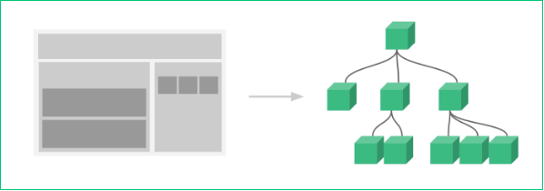
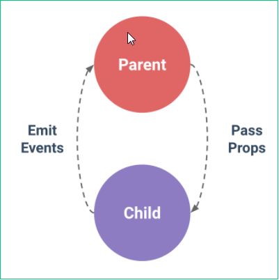
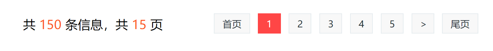
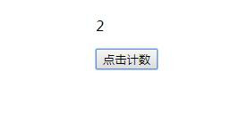

# 第三章：组件

vue指令和修饰符 

## 本章任务：

1. 制作移动端头部底部组件

## 本章目标：

1. 理解组件以及组件的用途
2. 掌握组件的定义方法和调用方法
3. 能够灵活封装并使用组件
4. 理解父子组件的定义
5. 掌握多种父子组件之间的数据传递 

## 一、组件介绍 

### 1.1 什么是组件 

**组件化开发；** 

组件（Component）的概念：从 **UI** 的角度，去分析问题，把一个页面，拆分为一些互不相干的小组件（部分），**组件是可复用的vue实例**(组件就是一个完整的vue实例)，在开发中，我们可以把重复的代码封装成组件，随着我们项目的开发，我们手里的组件会越来越多，最后，我们如果要实现一个页面，可能直接把现有的组件拿过来进行拼接，就能快速得到一个完整的页面， 这样方便了UI元素的重用；达到便捷高效开发的目的。**组件即自定义控件，组件是html元素的集合体；ui结构的复用。**
组件的用途：组件能够封装可重用代码，扩展HTML标签功能
组件的本质： 假如你自定义了一个组件名字叫 'login'  使用时：< login>< /login>    自定义标签    <组件名></组件名>  <h1></h1>   

### 1.2 组件的分类 

一个组件就是一个DOM结构(html,js,css)  xxx.vue

- 全局组件
- 局部组件 

#### 1.2.1 全局组件 

**语法：**

```
#采用Vue.component(名称，描述当前组件的配置项);方法来创建全局组件
#定义位置：创建实例前定义全局组件
Vue.component('name', {
  template: '<div>我是一个小小小组件</div>' // html代码
});
#组件的作用域：
全局范围内均可调用
```

**组件的调用方法:**

​	组件本质为标签，调用方式与调用标签相同<组件名></组件名> 

**定义组件名的方式有两种：**  

	1. Vue.component('my-component-name', { /* ... */ })
当使用 kebab-case (短横线分隔命名) 定义一个组件名称时，你也必须在引用这个自定义元素时使用 kebab-case，例如 < my-component-name>。

2. Vue.component('MyComponentName', { /* ... */ })
   当使用 PascalCase (首字母大写命名/驼峰式) 定义一个组件时，你在引用这个自定义元素时两种命名法都可以使用。也就是说 < my-component-name> 和 <MyComponentName> 都是可接受的，注意，尽管如此，直接在 DOM (即非字符串的模板) 中使用时只有 kebab-case 是有效的。

组件是可复用的 Vue 实例，所以它们与 `new Vue` 接收相同的选项，例如 `data`、`computed`、`watch`、`methods` 以及生命周期钩子等。仅有的例外是像 `el` 这样根实例特有的选项。

**注意：**

- 组件中必须包含一个根元素
- 在vm实例中data是全局数据，**在组件中data必须是函数**，数据是以**函数返回值**的形式来确定的。

##### template模板配置：

- 直接绑定模板

  ```html
  <!DOCTYPE html>
  <html lang="en">
  
  <head>
      <meta charset="UTF-8">
      <meta http-equiv="X-UA-Compatible" content="IE=edge">
      <meta name="viewport" content="width=device-width, initial-scale=1.0">
      <title>Document</title>
      <script src="./lib/vue.js"></script>
  </head>
  
  <body>
      <div id="app">
          <my-name-age></my-name-age>
      </div>
  
      <template id="tem">
          <div>
              <h1 v-if="s">你好哈哈哈{{name}}{{age}}</h1>
              <h1 v-else>你好哈哈哈{{name}}</h1>
              <Button @click="fn1">点我</Button>
          </div>
      </template>
  </body>
  <script>
      //注册组件
      /*
          组件的命名 可以使用-链接多个单词  也可以使用大驼峰
          但是在组件调用的时候，推荐使用 -链接方式调用
      */
      Vue.component('my-name-age', {
          //模板 此处的template===> el
          template: '#tem', // html代码
          //注意：组件中的data跟vue实例中定义方式不一样！！！
          data(){
              return {
                  name:'张三',
                  age:19,
                  s:false
              }
          },
          methods: {
              fn1(){
                  alert('我是组件的函数')
              }
          }
      });
  
      new Vue({
          el: '#app',
          data: {
             
          },
      })
  </script>
  
  </html>
  ```

- 引入模板

  ```html
  <body>
      <div id="app">
          <!-- <my-Com></my-Com> -->
          <My-Com></My-Com>   
          <My-Com></My-Com>   
          <My-Com></My-Com>   
          <My-Com></My-Com>   
      </div>
      <template id="aaa">
          <div>你好哈哈哈</div>
      </template>
  </body>
  <script>
      //自定义全局组件
      //注意：引入外部的模板 必须把模板内容放入一个<template>标签中
      Vue.component("MyCom", {
          template:'#aaa'
      })
  
      new Vue({
          el:"#app",
          data:{},
          methods:{},
          filters:{},
          computed:{}
      })
  </script>
  ```

**data数据配置：**

```html
【面试题】data必须是一个函数
为了保证组件的独立性 和 可复用性，data 是一个函数，组件实例化的时候这个函数将会被调用，返回一个对象，计算机会给这个对象分配一个内存地址，你实例化几次，就分配几个内存地址，他们的地址都不一样，所以每个组件中的数据不会相互干扰，改变其中一个组件的状态，其它组件不变。一个组件的 data 选项必须是一个函数，因此每个实例可以维护一份被返回对象的独立的拷贝。
<body>
    <div id="app">
         <my-com></my-com>
         <my-com></my-com>
         <my-com></my-com>
    </div>
    <template id="aaa">
        <button @click='add'>点我{{i}}</button>
    </template>
</body>
<script>
    //自定义全局组件 
    Vue.component("MyCom", {
        template:'#aaa',
        data(){
            return {
                i:0
            }
        },
        methods:{
            add(){
                this.i++;
            }
        }
    })

    new Vue({
        el:"#app",
        data:{},
        methods:{},
        filters:{},
        computed:{}
    })
</script>
例如：
function fn(){
    return {
        name:"lisi",
        age:20
    }
}
let fn1 = fn();
let fn2 = fn();
fn1.name = 'zhangsan';
console.log({} === {}) //false
console.log(fn1); // {name:"zhangsan",age:20}
console.log(fn2);//{name:"lisi",age:20}


```

#### 1.2.2 局部组件

语法：

```js
#在Vue实例中，使用components选项可以局部的注册组件,而且所有的局部组件都需要放到这里定义
new Vue({
    el: '#box',
    data: {},
    // 2、局部组件的定义
    components: {
        // 组件名称：{配置项}
        'test': {
            // template: '<h1>标签</h1>'
            template: '#t',
            data() {
                return {
                    msg: 'hello',
                    a: 100
                }
            }
        }	
    }
});
#组件的调用方法：
<组件名></组件名>
#组件的作用域：
定义该组件的作用域内可调用 当前的vue实例对象中可以调用，其余的vue实例对象就无法调用。
#组件注册方式不一样，其它与全局注册类似
```

案例：局部组件的数据遍历。

```html
<body>
    <div id="app">
        <one></one>
    </div>
    <template id="tem">
        <div>
            <p v-for="(item, index) in list">{{item.name}}=={{item.age}}=={{item.address}}</p>
        </div>
    </template>
</body>
<script>
    new Vue({
        el:'#app',
        data:{

        },
        components:{
            one:{
                template:'#tem',
                data(){
                    return {
                        list:[
                            {name:'张三',age:18,address:'郑州1'},
                            {name:'张四',age:19,address:'郑州2'},
                            {name:'张五',age:17,address:'郑州3'}
                        ]
                    }
                }
            }
        }
    })
</script>
```

### 1.3 父子组件的定义 

#### 1.3.1 使用 

通常一个应用会以一棵嵌套的组件树的形式来组织：



例如，你可能会有页头、侧边栏、内容区等组件，每个组件又包含了其它的像导航链接、博文之类的组件。

1、当前组件内部仍然存在 **components**选项，当前组件的子组件就写到components选项中
2、子组件可以认为是当前组件的一个细化过程，当前组件划分力度比较大，不容易维护开发，所以需要划分为更加细化的组件，所以就产生子组件详见图片展示情况，例如，你可能会有页头、侧边栏、内容区等组件，每个组件又包含了其它的像导航链接、博文之类的组件。这就是一个细化组件的过程，也就是父子组件的划分；

语法：

```js
<body>
    <div id="app">
        <father></father>
    </div>
    <template id="father">
        <div>
            <h1>{{fmsg}}</h1>
            <son></son>
        </div>
    </template>
    <template id="son">
        <div>
            <h3>{{smsg}}</h3>
        </div>
    </template>
</body>
<script>
    new Vue({
        el:'#app',
        data:{},
        components: {
            //定义父组件
            father:{
                template:'#father',
                data(){
                    return {
                        fmsg:'父亲组件'
                    }
                },
                components:{
                    //定义子组件
                    son:{
                        template:'#son',
                        data(){
                            return {
                                smsg:'儿子组件'
                            }
                        }
                    }
                }
            }
        }
    })
</script>
```


#### 1.3.2 父子组件的作用域

- 组件相当于完整的vue实例
- 组件与vue实例间作用域独立
- 父子组件间作用域相互独立
  - 子组件调用只能在父组件的模板中进行调用

## 二、组件的进阶使用

经典面试题：vue组件之间数据传递的方式有哪些？

### 2.1 父组件传值给子组件

子组件有时候需要接收来自父组件的数据，这时候就需要绑定 props 的值

```js
<div id="app">
    <input type="text" v-model="parentMessage">
    <my-component :message="parentMessage"></my-component>
</div>
//Prop 是你可以在组件上注册的一些自定义 attribute。当一个值传递给一个 prop attribute 的时候，它就变成了那个组件实例的一个 property
```

### 2.2 props 选项的作用  prop

props是**自定义属性**，组件之间可以通过props属性去自定义一些属于自己的属性，并通过这个属性来进行组件之间的数据传输。

**单页面应用**  

- 组件不仅仅是要把模板的内容进行复用，**更重要的是组件之间的通信**，由父组件向子组件**正向传递**数据或者参数，就是通过props来实现的  
- props选项用来**声明它期待获得**的数据 
- props 本质：props 为元素属性
- 

### 2.3 props 的使用

1. 先在子组件中定义props属性 自定义 需要的属性的名字
2. 在父组件调用子组件的地方 通过 v-bind:自定义属性名  传递数据

```js
我们需要在组件中添加一个新的属性props 里边用来定义期待的数据的名字===》data中数据的属性名，不过这个数据是由父组件传递来的
#js
components: { 
 '组件名称': {
    template: '#模板ID',
    props: ['message1', 'message2',...]
  }
}

#html
此时的messages就是上边子组件中定义的props中的message1 val就是传递来的该属性的值
<组件 message1='val'></组件> 传递写死的值
<组件 :message1='val'></组件> 通过v-bind动态的传递值
```

### 2.4 Prop可以具有的类型

- 以字符串数组的形式传递(此时传递来的数据的类型一般都是字符串类型)
- **注意：**如果使用字符串数组 定义属性  此时传递来的数据的类型要看父 父组件是什么类型，子组件接收到就是什么类型。

通常，我们只看到了以字符串数组形式列出的 prop：

```
props: ['title', 'likes', 'isPublished', 'commentIds', 'author']
```

- **把props以对象的形式定义**：自定义传递来的数据的类型

但是，如果你希望每个 prop 都有指定的值类型。这时，你可以以对象形式列出 prop，这些 property 的名称和值分别是 prop 各自的名称和类型：

```js 
props: {
  title: String,
  likes: Number,
  isPublished: Boolean,
  commentIds: Array,
  author: Object,
  callback: Function,
  contactsPromise: Promise // or any other constructor
}
```

```html
<!DOCTYPE html>
<html lang="en">
<head>
    <script src="../js/vue.js"></script>
    <style>
        #fff{
            width: 500px;
            height: 500px;
            background-color: red;

        }
        #sss{
            margin: auto;
            width: 300px;
            height: 300px;
            background-color: skyblue;
        }
    </style>
</head>
<body>
    <div id="app">
        <input type="text" v-model="inp">
        //最外层节点向father节点传递数据
        <father :val="inp"></father>
    </div>
    <template id="father">
        <div id="fff">
            这里是父亲:<br>
            根节点传递来的数据:{{val}}
            <br>
            父亲可以给儿子的钱: <input type="text" v-model.number="money">
            //father节点向son节点传递数据
            <son :fname="fmsg" :fage="fage" :fmoney="money"></son>
        </div>
    </template>
    <template id="son">
        <div id="sss">
            这里是儿子
            <p>父亲的姓名是：{{fname}},年龄是{{fage}},可以从父亲那里拿{{fmoney+1}}元</p>
        </div>
    </template>
</body>
<script>
    new Vue({
        el:'#app',
        data:{
            inp:'你好哈哈哈'
        },
        components:{
            //定义父组件
            father:{
                template:'#father',
                props:['val'],
                data(){
                    return {
                        fmsg:'杨爹',
                        fage:55,
                        money:null
                    }
                },
                //定义子组件
                components:{
                    son:{
                        template:'#son',
                        data(){
                            return {
                                smsg:'小杨',
                                sage:18
                            }
                        },
                        //使用数组形式接收父组件传递来子组件的数据
                        //props: ['fname','fage','fmoney']
                        //使用对象形式 来接收父组件传递来子组件的数据
                        props:{
                            fname:String,
                            fage:Number,
                            fmoney:Number
                        }
                    }
                }
            }
        }
    })
</script>
</html>
```


### 2.5 Prop 验证

我们可以为组件的 prop 指定验证要求，例如你知道的这些类型。如果有一个需求没有被满足，则 Vue 会在浏览器控制台中警告你。

为了定制 prop 的验证方式，你可以为 `props` 中的值提供一个带有验证需求的对象，而不是一个字符串数组。例如：

```js
Vue.component('my-component', {
  props: {
    // 基础的类型检查 (`null` 和 `undefined` 会通过任何类型验证)
    propA: Number,
    // 多个可能的类型
    propB: [String, Number],
    // 必填的字符串
    propC: {
      type: String, //数据类型
      required: true  //必填项
    },
    // 带有默认值的数字
    propD: {
      type: Number,
      default: 100  //默认值
    },
    // 带有默认值的对象
    propE: {
      type: Object,
      // 对象或数组默认值必须从一个工厂函数获取
      default: function () {
        return { message: 'hello' }
      }
    },
    // 自定义验证函数
    propF: {
      validator: function (value) {
        // 这个值必须匹配下列字符串中的一个
        return ['success', 'warning', 'danger'].indexOf(value) !== -1
      }
    }
  }
})
#注意那些 prop 会在一个组件实例创建之前进行验证，所以实例的 property (如 data、computed 等) 在 default 或 validator 函数中是不可用的。
```


### props 的使用 

- 与 data 一样，props 可以用在模板中
- 可以在 vm 实例中像 this.message 这样使用
- 与组件data函数return的数据区别
  - props的数据来自父级
  - data中数据是组件自己的数据 

### 2.6 单向数据流 

所有的 prop 都使得其父子 prop 之间形成了一个**单向下行绑定**：父级 prop 的更新会向下流动到子组件中，但是反过来则不行。这样会防止从子组件意外变更父级组件的状态，从而导致你的应用的数据流向难以理解。

父组件===>子组件：vue允许的，会主动触发的，也叫正向传递。

子组件===>父组件：vue允许的，不会主动触发，需要手动（被动）触发，叫做逆向传递。

额外的，每次父级组件发生变更时，子组件中所有的 prop 都将会刷新为最新的值。这意味着你**不**应该在一个子组件内部改变 prop。如果你这样做了，Vue 会在浏览器的控制台中发出警告。**也就是说props属性接收到的数据是只读的不能随意修改** 

这里有两种常见的试图变更一个 prop 的情形：

```js
#这个 prop 用来传递一个初始值；这个子组件接下来希望将其作为一个本地的 prop 数据来使用。在这种情况下，最好定义一个本地的 data property 并将这个 prop 用作其初始值：
props: ['initialCounter'],
data: function () {
  return {
    counter: this.initialCounter
  }
}

#这个 prop 以一种原始的值传入且需要进行转换。在这种情况下，最好使用这个 prop 的值来定义一个计算属性：
props: ['size'],
computed: {
  normalizedSize: function () {
    return this.size.trim().toLowerCase()
  }
}
```

**注意：**在 JavaScript 中对象和数组是通过引用传入的，所以对于一个数组或对象类型的 prop 来说，在子组件中改变变更这个对象或数组本身**将会**影响到父组件的状态。

### 2.7 自定义事件监听：实现子向父传值

自定义事件：click  dblclick  blur  focus    aaa   bbb  ccc  ddd  自已起事件名字

自定义函数：function(){}  

1、父组件将值传递给子组件，叫做正向传值，子组件将值传递给父组件，叫做逆向传值；需要借助 **自定义事件**
2、vue.js 中允许正向传值，所以正向传值不需要条件触发，是主动的；逆向传值，也是允许的，但是需要主动（手动）触发

#### 使用：

```js
#子组件中
this.$emit(‘event’,val);
//$emit：实例方法，用来触发事件监听
//参数
event：自定义事件名称
val：通过自定义事件传递的值(val为可选参数)
#子组件主动触发事件监听 （抛）
<button @click="go">向父组件传值</button>
methods:{
    go(){
        this.$emit('自定义事件名'，事件传递的可选参数);
    }
}

#父组件中接收自定义事件监听 （接）
<component @自定义事件名='事件处理函数/fn'></component>
methods:{
    fn(v){
        v//自定义事件传递的值，会作为fn的参数来传递
    }
}
```

案例：接收来自子组件的数据。

1. 先定义两个父子组件

   ```html
   <!DOCTYPE html>
   <html lang="en">
   <head>
       <meta charset="UTF-8">
       <meta http-equiv="X-UA-Compatible" content="IE=edge">
       <meta name="viewport" content="width=device-width, initial-scale=1.0">
       <title>Document</title>
       <script src="../js/vue.js"></script>
   </head>
   <body>
       <div id="app">
           <father></father>
       </div>
       <template id="father">
           <div>
               <h1>{{fmsg}}</h1>
               接收来自子组件的数据:{{sonData}}
               <son ></son>
           </div>
       </template>
       <template id="son">
           <div>
               <h3>{{smsg}}</h3>
           </div>
       </template>
   </body>
   <script>
       new Vue({
           el:'#app',
           data:{},
           components: {
               //父组件
               father:{
                   template:'#father',
                   data(){
                       return {
                           fmsg:'父亲组件数据',
                           sonData:''
                       }
                   },
                   components:{
                       son:{
                           template:'#son',
                           data(){
                               return {
                                   smsg:'儿子组件的数据'
                               }
                           }
                       }
                   }
                   
               }
           }
       })
   </script>
   </html>
   ```

2. 在子组件的模板中添加一个按钮触发给父组件传递数据的方法

   ```html
   <template id="son">
           <div>
               <h3>{{smsg}}</h3>
               在子组件中添加一个按钮触发给父组件传递数据的方法
               <button @click="sonEvent">给父组件传值</button>
           </div>
       </template>
   ```

3. 在子组件中添加方法sonEvent

   ```js
   methods:{
   	//子组件上定义方法
   	sonEvent(){
           //$emit专门用来监听 @aaa事件  此时的aaa就表示一种新的事件类型 是我们自己定义的事件
           //从这里把我们自己定义的事件传递到父组件，再由父组件调用这个事件。就可以接收到子组件传递去的参数
   		this.$emit('aaa', this.smsg)
   	}
   }
   ```

4. 在父组件调用子组件的位置添加监听事件

   ```html
   <template id="father">
           <div>
               <h1>{{fmsg}}</h1>
               接收来自子组件的数据:{{sonData}}
               <!-- 在父组件调用子组件的位置 添加@事件名  此处的事件名是子组件中定义好的名字 -->
               <son @aaa="fatherEvent"></son>
           </div>
       </template>
   ```

5. 在父组件中定义方法 fatherEvent

   ```js
    methods:{
        //次数的val就是子组件中的$emit实例方法传递来的数据
    	fatherEvent(val){
    		console.log(val);
    		//把子组件传递来的数据 赋值给父组件的属性
    		this.sonData = val;
    	}
    }
   ```

   这样一来，我们以后就可以在父组件中来使用子组件传递来的数据了。

**小结：** 子向父传递数据 

1. 先在子组件中定义函数，函数中定义代码 this.$emit('自定义事件名' ，要传递的数据);
2. 在父组件中 调用子组件  < son  @自定义事件名 = ‘fn’>  fn函数中的参数就是 传递来的数据。

## 三、总结与作业

1. 总结今日知识点 今日课堂案例 5遍以上。

   2. 分页器 

      一般常用在后台管理系统。



```html
<!doctype html>
<html lang="en">
	<head>
		<script src="../js/vue.js" type="text/javascript" charset="utf-8"></script>
		<title>vue分页</title>
		<style type="text/css">
			ul {
				list-style: none;
				margin: 0;
			}

			.pagetation_info {
				width: 100%;
				height: 24px;
				padding: 20px 0;
			}

			ul.pagetation_box {
				float: right;
				height: 100%;
				padding: 0 60px;
			}

			ul.pagetation_box li {
				float: left;
				height: 100%;
				border: 1px solid #e6ecef;
				background-color: #f8f8f8;
				margin: 0 5px;
				padding: 0 10px;
				color: #263238;
				cursor: pointer;
				text-align: center;
				line-height: 22px;
			}

			ul.pagetation_box li a {
				text-decoration: none;
				color: #263238;
				font-size: 12px;
			}

			ul.pagetation_box li.active {
				background-color: #FF4646;
				border-color: #FF4646;
			}

			ul.pagetation_box li.active a {
				color: #fff;
			}

			ul.pagetation_box li.prev,
			ul.pagetation_box li.next {
				width: 7px;
			}

			ul.pagetation_box li:hover {
				background-color: #FF4646;
				border-color: #FF4646;
			}

			ul.pagetation_box li:hover a {
				color: #fff;
			}

			ul.pagetation_box li.more {
				width: 24px;
				padding: 0;
				background: url(../img/public/page_more.png) no-repeat center center;
				border: none;
			}

			.num_total {
				float: right;
				height: 100%;
				line-height: 22px;
				padding-top: 3px;
				padding-bottom: 3px;
			}

			.num_total>span {
				color: #FC5B27;
			}
		</style>
	</head>

	<body id="">
		<div id="app-body">
			<div class="pagetation_info clearfix">
				<ul class="pagetation_box">
					<li class="firstPage" @click="page.currentPage=1"><a href="javascript:;">首页</a></li>
					<li class="prev" v-show="page.currentPage != 1"
						@click="page.currentPage-- && _gotoPage(page.currentPage)"><a href="javascript:;">&lt;</a></li>
					<li v-for="item in pages" @click="_gotoPage(item)" :class="{'active':page.currentPage == item}">
						<a href="javascript:;">{{item}}</a></li>
					<li class="next" v-show="page.allPages != page.currentPage && page.allPages != 0 "
						@click="page.currentPage++ && _gotoPage(page.currentPage)"><a href="javascript:;">&gt;</a></li>
					<li class="lastPage" @click="page.currentPage=page.allPages"><a href="javascript:;">尾页</a></li>
				</ul>
				<div class="num_total">
					共 <span>{{page.allRecords}}</span> 条信息，共 <span>{{page.allPages}}</span> 页
				</div>
			</div>
		</div>
		<script>
			new Vue({
				el: "#app-body",
				data: {
					//定义页码对象
					page: {
						//当前页
						"currentPage": 1,
						//每页的条数
						"pagesize": 10,
						//总数据条数
						"allRecords": 150,
						//总页码
						"allPages": 15,
						//展示的所有页码数
						"showItem": 5,
					}
				},
				computed: {
					//通过计算属性计算 中间显示的页码数
					pages() {
						//var _this = this;
						//定义一个空数组  用来存储页面中需要显示的页码数
						var p = [];
						//如果当前页码数 小于 展示的页码数
						if (this.page.currentPage <= this.page.showItem) {
							//就从 当前选中的页码数 和当前所有的页码数 取出较小的值
							var i = Math.min(this.page.showItem, this.page.allPages);
							//将得到的较小的数据做循环 得到一个页码组成的数组
							while (i>0) {
								p.unshift(i--);
							}
						} else {//如果当前页码数 > 显示的页码数
							//取中间数 使用当前页 - 选中页/2
							var middle =this.page.currentPage - Math.floor(this.page.showItem / 2);
							//把当前展示的页码的总数赋值给 i
							let	i = this.page.showItem;
							console.log(middle, i);
							//如果页码的中间数 大于  页码总数-展示的页码数
							//相当于剩余 最终的两页的时候 页码的数组就不再发生变化了 
							if (middle > (this.page.allPages - this.page.showItem)) {
								//中间数 = 页码总数-展示页码数+1
								middle = (this.page.allPages - this.page.showItem) + 1
							}
							while (i-->0) {
								p.push(middle++);
							}
							
							//不取中间数的方法
							/* let i = this.page.currentPage;
							while(i> (this.page.currentPage - this.page.showItem)){
								p.unshift(i--)
							} */
						}
						return p;
					},
				},
				methods: {
					_gotoPage(i) {
						//var _this = this;
						if (i == this.page.currentPage) return;
						this.page.currentPage = i;
					},
				}
			});
		</script>

	</body>
</html>
```


3. 计数器-见作业  2的数据显示是父组件   点击计数按钮在子组件中。




