# 第四章：vue-cli+过滤器+侦听器

## 回顾：

组件之间的通信

父传子：正向传递  vue允许  自动触发

​		props 

​		1.先在子组件中定义期待的属性名和类型

​		2.在父组件中调用子组件的位置 添加 v-bind:自定义属性名

​	注意：props只读属性 ====》data(){  属性 }

子传父：逆向传递  vue允许  主动触发

​		自定义事件 click  blur  focus....   监听自定义事件触发的函数

​		1.在子组件中定义函数  ===》 this.$emit( '自定义事件名' ，传递的参数  );

​		2.在父组件中调用子组件的位置 < son  @自定义事件名= 'fn()'>< /son> 添加一个绑定一个自定义事件

​					fn(val)函数中   val就是传递来的参数 

xxx.vue  === 》 组件

## 本章任务：

- 使用@vue/cli快速搭建项目 
  - 目前 学习的是vue2.x  脚手架工具 @vue/cli 4.x   vue-cli@2
  - 后期学习vue3.x    脚手架工具  可以 是@vue/cli 4.x    也可以是新推出的 vite 
- 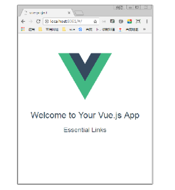
- 制作多彩照片墙效果 
- 

## 本章目标

- 掌握项目环境配置方法
- 能够灵活掌握单文件组件的使用方法
- 掌握单文件组件中父子组件的通信

## 一、vue-cli简介 

### 1.1 什么是 vue-cli 

官网文档：https://cli.vuejs.org/zh/guide/

Vue CLI 是一个基于 Vue.js 进行快速开发的完整系统，简化了我们创建webpack-vue项目的过程。

提供：

- 通过 `@vue/cli` 实现的交互式的项目脚手架。

- 通过 `@vue/cli` + `@vue/cli-service-global` 实现的零配置原型开发。

- 一个运行时依赖 (

  ```
  @vue/cli-service 
  ```

  )，该依赖：

  - 可升级；
  - 基于 webpack 构建，并带有合理的默认配置；
  - 可以通过项目内的配置文件进行配置；
  - 可以通过插件进行扩展。

- 一个丰富的官方插件集合，集成了前端生态中最好的工具。

- 一套完全图形化的创建和管理 Vue.js 项目的用户界面。

Vue CLI 致力于将 Vue 生态中的工具基础标准化。它确保了各种构建工具能够基于智能的默认配置即可平稳衔接，这样你可以专注在撰写应用上，而不必花好几天去纠结配置的问题。与此同时，它也为每个工具提供了调整配置的灵活性，无需 eject。

#### CLI 

CLI (`@vue/cli`) 是一个全局安装的 npm 包，提供了终端里的 `vue` 命令。它可以通过 `vue create` 快速搭建一个新项目，或者直接通过 `vue serve` 构建新想法的原型。你也可以通过 `vue ui` 通过一套图形化界面管理你的所有项目。

### 1.2 为什么要用 vue-cli 创建项目

- 使用Vue.js开发大型应用时，有很多工作是繁琐而且重复的，业务逻辑复杂，对前端工程化又有要求，想要便捷高效开发项目
  - 代码的目录结构整理
  - 项目构建和部署
  - 热加载
  - 代码的单元测试等
- 在Vue.js生态中我们可以使用vue-cli脚手架工具来快速构建项目

### 1.3 基于vue-cli创建项目

安装 node.js 、 npm 、 cnpm

#### [安装@vue/cli --- 手册](https://cli.vuejs.org/zh/)

1. 安装命令 ： `npm install -g @vue/cli`  

2. 检查命令：`vue --version`  

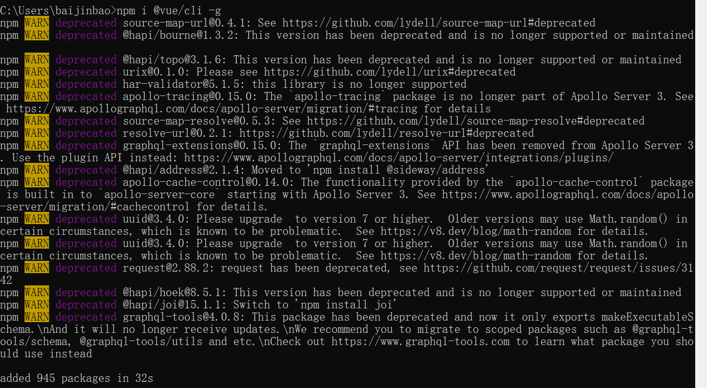

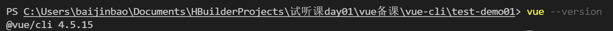

3. 创建项目命令：`vue create 项目名`  

   **注意项目名不能出现大写字母！！！** 如果项目名带有大写字母，会出现如下错误提示。

   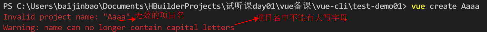

4. 选择预设项

   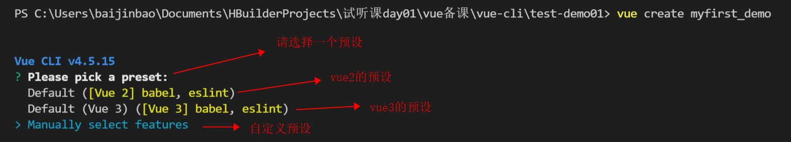

   按上下键调整：选择第三个 `Manually select features` 手动选择 自定义预设

5. 手动选择

   `Check the features needed for your project: (Press <space> to select, <a> to toggle all, <i> to invert selection)  //选择将来项目中用到的依赖  空格：选择  a：全选  i：反选` 

   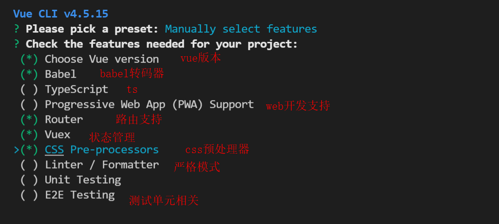

   选择完毕按下 `enter`键 

6. 选择2.x 的vue版本

   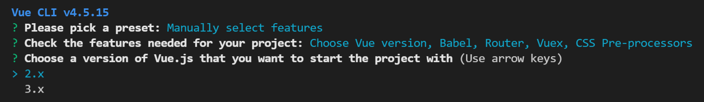

7. 是否使用历史的路由版本 选择 n

   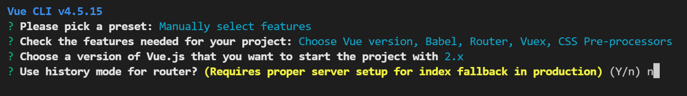

8. css预处理器选择less

   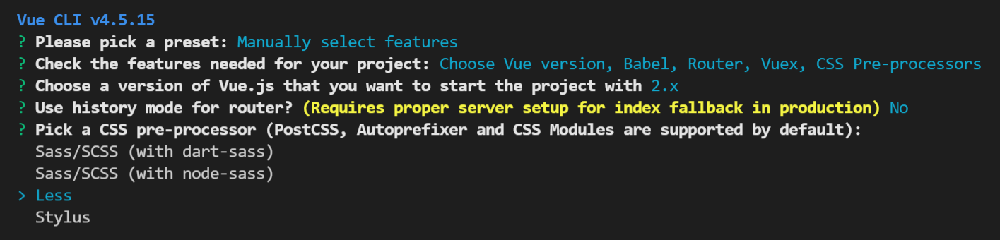

9. 选择配置信息所处的位置

   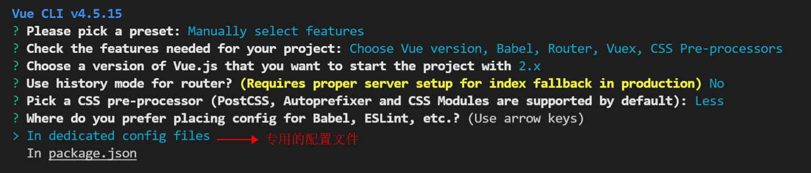

   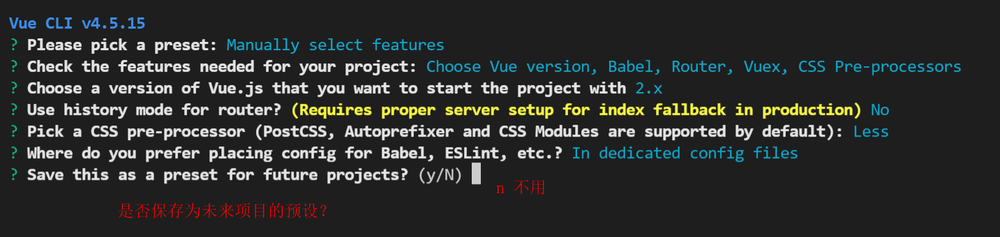

   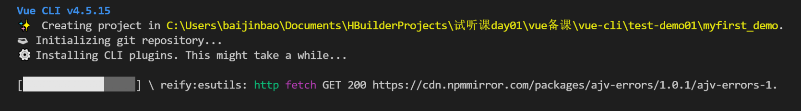

   项目创建过程中。。。。 我的心在等待。。。

   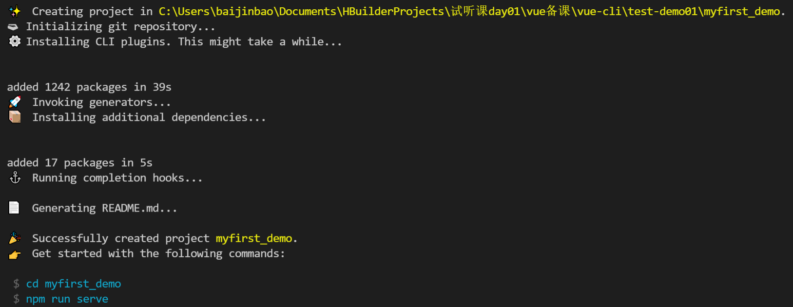

   显示这样的页面，表示项目创建成功；

   **项目目录解析：**

   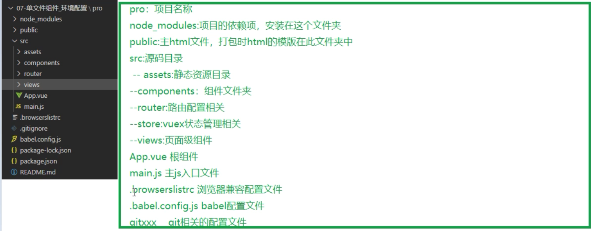

10. 按照上边提示分别输入命令 ，表示运行创建好的项目。

    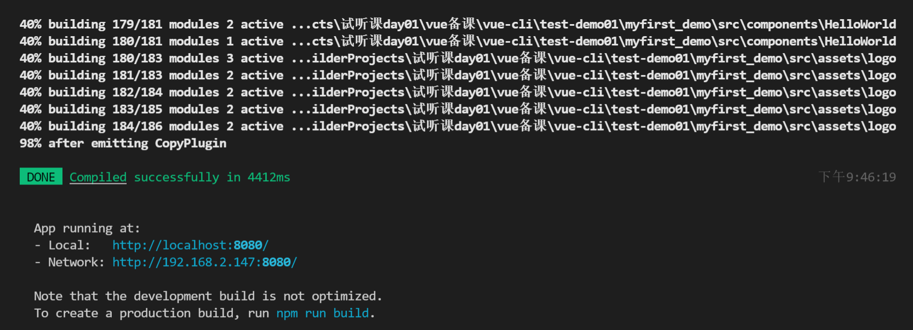

    浏览器输入路径：访问该项目。出现如下页面

    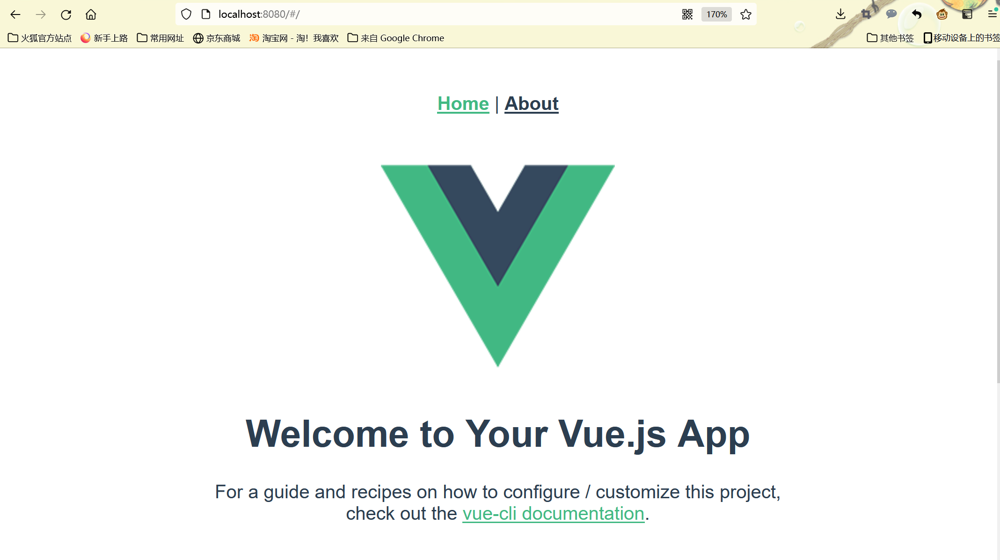

### 1.4 练习：构建项目 

## 二、单文件组件 xxx.vue 

### 2.1 为什么要使用单文件组件

在很多 Vue 项目中，我们使用 `Vue.component` 来定义全局组件，紧接着用 `new Vue({ el: '#container '})` 在每个页面内指定一个容器元素。

这种方式在很多中小规模的项目中运作的很好，在这些项目里 JavaScript 只被用来加强特定的视图。但当在更复杂的项目中，或者你的前端完全由 JavaScript 驱动的时候，下面这些缺点将变得非常明显：

- **全局定义 (Global definitions)** 强制要求每个 component 中的命名不得重复
- **字符串模板 (String templates)** 缺乏语法高亮，在 HTML 有多行的时候，需要用到丑陋的 `\`
- **不支持 CSS (No CSS support)** 意味着当 HTML 和 JavaScript 组件化时，CSS 明显被遗漏
- **没有构建步骤 (No build step)** 限制只能使用 HTML 和 ES5 JavaScript，而不能使用预处理器，如Babel

文件扩展名为 .vue 的 single-file components(单文件组件) 为解决上述问题提供了方法

### 2.2 单文件组件的定义

在components文件夹下 新建文件扩展名为 MyCom.vue的文件，文件包含以下内容：

```vue
//单文件组件的定义
/*
    其中包含 css ,js , html模板内容
 */
<template>
  <div>
      <h1>我是第一个组件中的数据</h1>
  </div>
</template>

//组件的js
<script>
export default {
    props: {

    },
    data () {
        return {
            
        }
    },
    methods: {
        
    },
    computed: {
        
    }
}
</script>
//组件的css样式
<style lang="less" scoped>
    h1{
        background-color: red;
        color: blue;
        font-size: 200px;
    }
</style>
```

**注意：scoped属性表示 该样式只在当前组件中生效。**

修改main.js中内容：

```js
import Vue from 'vue'
import App from './App.vue'
import router from './router'
import store from './store'
//引入自定义的aaa.vue组件
import aaa from './components/aaa'

Vue.config.productionTip = false

new Vue({
  router,
  store,
  render: h => h(aaa)//使用aaa.vue组件
}).$mount('#app')
```

打开浏览器，运行观察效果：


单文件组件的特点

- 完整语法高亮
- 模块化处理
  - template中书写HTML结构
  - script中书写组件的配置项
- 组件作用域的 CSS  【scoped 表明这里写的css 样式只适用于该组件，可以限定样式的作用域】

#### 2.2.1 分析vue项目默认启动后打开的页面是怎么打开的？（执行流程）

​		通过main.js把App.vue中的内容渲染到html页面上！

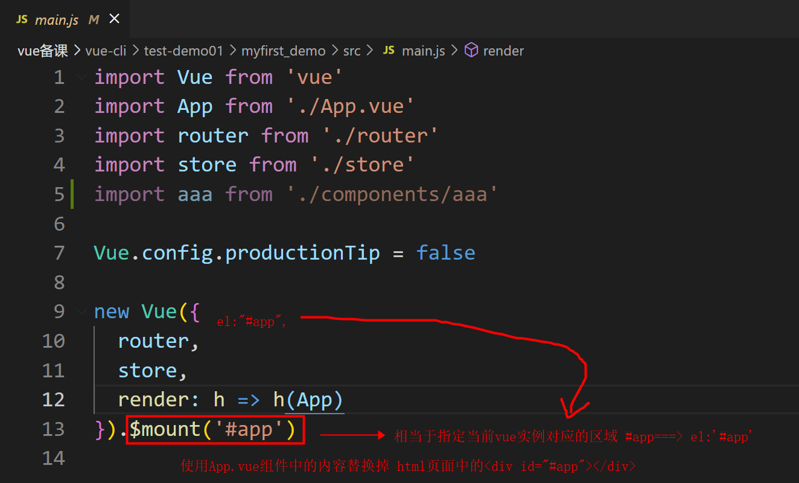

#### 2.2.2 main.js中的render函数理解

`render` 函数 ：此处为什么要使用render函数来进行页面的渲染，为什么不直接使用template模板引入呢？

**因为：**通过 `import Vue from  'vue'`引入的是精简版的vue.js  并不是完整版的vue.js  完整版的vue.js包含 核心代码和模板解析器，最终项目上线时，模板解析器其实是不需要的，所以vue会搞精简版的vue.js供用户使用。 如果直接使用template模板引入，这个精简版的vue.js是无法对模板进行解析的，但是可以通过提供的render函数进行解析。

**相当于：**

```
new Vue({
	template:`<h1>你好哈哈哈</h1>`
}) 等同于代码

//render函数要有返回值
new Vue({
	render:function(createElement){ return createElement('h1','你好哈哈哈')}
	就等同于代码
	render:createElement=>createElement('h1','你好哈哈哈')
	就等同于代码
	render:h=>h(App) 直接渲染根组件
}) 
```

$mount()方法的作用等同于  el:""绑定区域。

#### 2.2.3 cli脚手架构建项目的webpack的配置相关：

vue脚手架隐藏了所有的webpack相关配置，如果想查看具体的配置可以执行 `vue inspect > output.js` 这样会在目录下生成一个文件output.js 里边包含所有的配置信息。

如果想做自定义的配置请参考vue官网vue-cli官方文档：

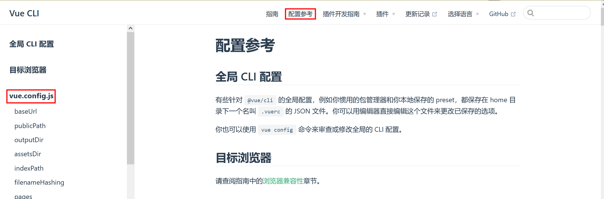

**练习案例：**自定义组件显示到首页。

#### 2.2.4 vue-cli项目中定义全局组件：

​		在`main.js`中通过Vue.component()方法注册全局组件。

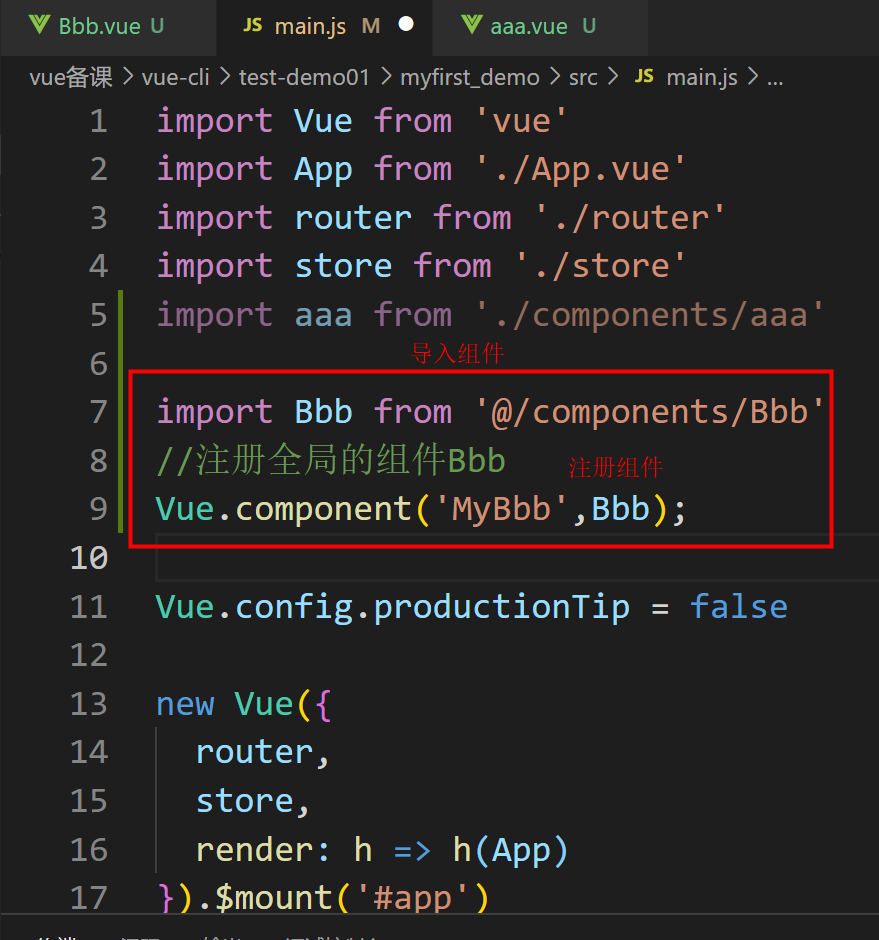

`Vue.config.productionTip = false` 这行代码是在服务启动成功后 会在浏览器的控制台有一个 提示代码。

如果值为false 不显示 如下红框中代码  如果为true就显示如下代码。

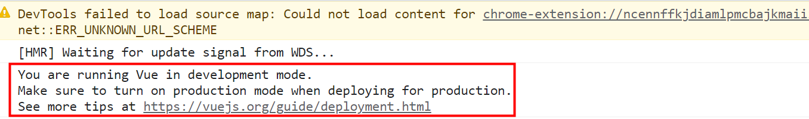

### 2.3 单文件组件中script 标签理解 

- 不使用.vue 单文件时，我们是通过 Vue 构造函数创建一个 Vue 根实例来启动vue 项目
- 在.vue文件中，export default 后面的对象就相当于 new Vue() 构造函数中的接受的对象
  需要注意data 的书写方式不同，在 .vue 组件中data 必须是一个函数，它return返回一个对象，这个返回的对象的数据，供组件实现

### 2.4 单文件组件使用-案例

页面中有一个input输入框，当进行输入的时候，输入框下面的内容会进行大写的同步显示
当输入完成后，按enter键就会弹出输入的内容

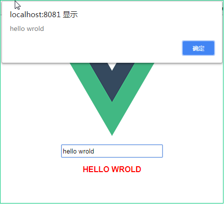

### 2.5 父组件传值子组件

#### **方式一：**

- 传值仍然通过props来实现
- 实现步骤
  - 在父组件中导入子组件
  - 在父组件的components中注册
  - 在模板中进行调用
  - 通过v-bind指令把值传递到子组件中
  - 子组件通过props进行接收

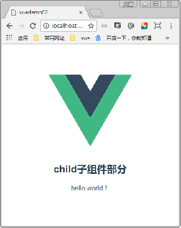

#### **方式二：**

**使用 provide 和 inject 的 api 完成(祖孙传值)**

provide：是一个对象，或者是一个返回对象的函数。里面包含要给子孙后代属性

inject：一个字符串数组，或者是一个对象。获取父组件或更高层次的组件provide的值，既在任何后代组件都可以通过inject获得

```js
//父组件中：添加如下属性
provide() {
    return {
      m1: 100,
      m2: 200,
    };
  },
//子组件中 接收数据 inject
inject:['m1','m2']
```

**注意：**provide/inject一般在深层组件嵌套中使用合适。一般在组件开发中用的居多。

#### **方式三：**

**parent/children **

$parent: 子组件获取父组件Vue实例，可以获取父组件的属性方法等

$children: 父组件获取子组件Vue实例，是一个数组，是直接儿子的集合，但并不保证子组件的顺序

### 2.6 子组件传值父组件 

实现步骤

1. 子组件中需要以某种方式例如点击事件的方法来触发一个自定义事件
2. 将需要传的值作为$emit的第二个参数，该值将作为实参传给响应自定义事件的方法
3. 在父组件中注册子组件并在子组件标签上绑定对自定义事件的监听

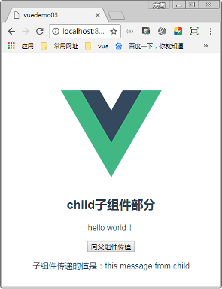

### 2.7 不相关组件之间的传递数据

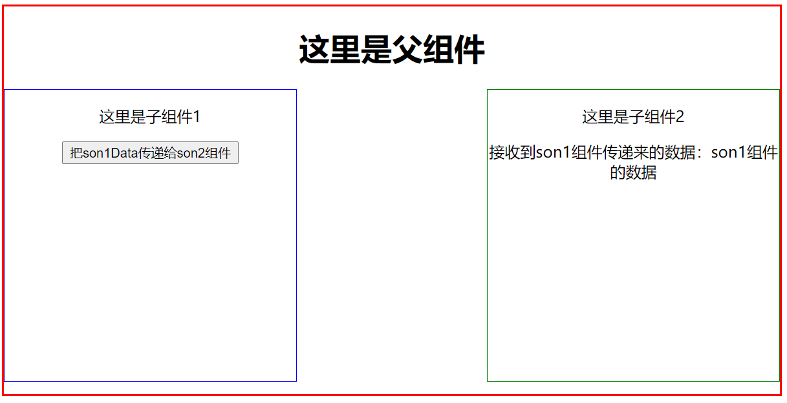

- **eventBus传递数据**   总线传值

  实现步骤：

  1.  创建父组件index.vue

     ```vue
     <template>
       <div id="max">
           <h1>这里是父组件</h1>
           <!--引入两个子组件-->
           <son1></son1>
           <son2></son2>
       </div>
     </template>
     
     <script>
     import son1 from '@/components/son1.vue'
     import son2 from '@/components/son2.vue'
     import Son1 from './son1.vue'
     import Son2 from './son2.vue'
     export default {
         components: {
             son1,
             son2
         }
     }
     </script>
     
     <style lang='less' scoped>
         #max{
             width: 800px;
             height: 400px;
             border: 2px solid red;
             text-align: center;
         }
     </style>
     ```

  2. 创建两个子组件son1.vue和son2.vue

     ```vue
     #son1.vue 文件
     <template>
       <div class="son1">
         <p>这里是子组件1</p>
         <button @click="sendMsg">把son1Data传递给son2组件</button>
       </div>
     </template>
     
     <script>
     import bus from '@/components/eventBus.js'
     export default {
         data () {
             return {
                 son1Data:'son1组件的数据'
             }
         },
         methods: {
             sendMsg(){
                bus.$emit('send', this.son1Data)
             }
         }
     };
     </script>
     
     <style lang="less" scoped>
         .son1{
             width: 300px;
             height: 300px;
             border:1px solid blue;
             float: left;
         }
     </style>
     ```

     ```vue
     # son2.vue文件
     <template>
       <div class="son1">
         <p>这里是子组件2</p>
         接收到son1组件传递来的数据：{{msg}}
       </div>
     </template>
     
     <script>
     import bus from '@/components/eventBus.js'
     export default {
       data () {
         return {
           msg:''
         }
       },
       created () {
         //$on()方法 监听当前实例上的自定义事件。事件可以由 vm.$emit 触发。回调函数会接收所有传入事件触发函数的额外参数。
         bus.$on('send', val=>{
           this.msg = val;
         })
       }
     };
     </script>
     
     <style lang="less" scoped>
         .son1{
             width: 300px;
             height: 300px;
             border:1px solid green;
             float: right;
         }
     </style>
     ```

  3. 项目中单独创建一个eventBus.js文件

     ```js
     //导入vue实例的构造函数
     import Vue from 'vue';
     export default new Vue()
     ```

  4. 把main.js入口文件的主页面改成index.vue  运行页面观察效果

     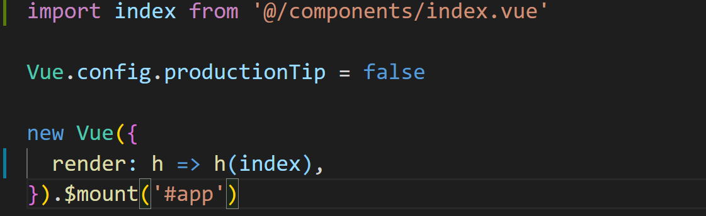

     

- **常规传值(子组件A把数据传递给父组件，父组件在把数据传递给子组件B)**

  参考父子组件  子父组件传值，一样。

### 案例操作—多彩照片墙 

需求说明
使用Vue脚手架Vue-cli快速搭建项目
使用父组件向子组件传递图片的地址
在子组件中接收图片地址，使用v-for指令遍历渲染显示图片

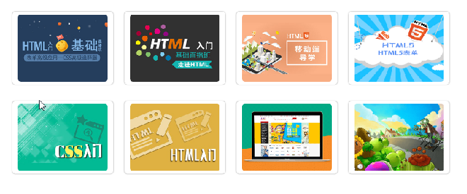

##  三、Vue.js 过滤器 

### 3.1 概念简介

Vue.js 允许你自定义过滤器，可被用于一些常见的文本格式化，比如字母的大写、货币的千位使用逗号分隔。过滤器可以用在两个地方：**双花括号插值和 `v-bind` 表达式** (后者从 2.1.0+ 开始支持)。过滤器应该被添加在 JavaScript 表达式的尾部，由“管道” ‘|’ 符号指示。注意：过滤器在vue3中已经被干掉了。

```js
//<!-- 在双花括号中    message：data中定义的属性       | 管道符    capitalize:过滤器函数        -->
//表示页面中显示的数据是过滤器函数的返回值
<p>{{ message | capitalize }}</p>

//<!-- 在 `v-bind` 中         |管道符   formatId：过滤器 -->
<div v-bind:id="rawId | formatId"></div>

注意：过滤器是一个函数，一定要有反回值，参数就是管道符前边的数据。
```

### 3.2 过滤器的使用放法：

**局部过滤器：**你可以在一个组件的选项中定义本地的局部过滤器（只能在一个vue实例中使用）

```js
<body>
    <div id="app">
        <!-- msg是原本的值 | 表示管道符  调用filter函数 此时标签中显示的就是过滤器函数的返回值 -->
        <p>{{msg | test1}}</p>
    </div>
</body>
<script>
    const vm = new Vue({
        el:'#app',
        data:{
            msg:'你好哈哈哈'
        },
        methods:{},
        filters:{
            test1(msg){
                return msg.replace(/哈/g,'*');;
            }
        }
    })
</script>
```

**全局过滤器：**可以在多个vue实例中共享过滤器。

在创建 Vue 实例之前全局定义过滤器：

```js
/*
	格式Vue.filter(参数1,参数2)
		参数1 表示全局过滤器的名字
		参数2 表示处理函数
*/
Vue.filter('capitalize', function (value) {
  if (!value) return ''
  value = value.toString()
  return value.charAt(0).toUpperCase() + value.slice(1)
})

new Vue({
  // ...
})
```

过滤的规则是自定义的，通过给Vue示例添加选项filters来设置
过滤器是 JavaScript 函数，因此可以接收参数,过滤器函数总接收表达式的值 (之前的操作链的结果) 作为第一个参数。在上述例子中，`capitalize` 过滤器函数将会收到 `message` 的值作为第一个参数。

**注意：** 如果全局过滤器和私有过滤器的名字相同，优先使用私有过滤器！！！

### 3.3 过滤器可以串联

```js
{{ message | filterA | filterB | filterC}}
//filterA 被定义为接收单个参数的过滤器函数，表达式 message 的值将作为参数传入到函数中。然后继续调用同样被定义为接收单个参数的过滤器函数 filterB，将 filterA 的结果传递到 filterB 中。
Vue.filter('capitalize', function (value,arg1,arg2) {})
注意：过滤器调用时也可以传递其余的参数，但是function函数中第一个参数永远都是管道符前边的数据，后边的arg1...可以传递别的参数。
```

### 案例：时间格式化  

#### moment.js  常用的js格式化日期库

使用moment.js : http://momentjs.cn/ moment.js中文网

需求说明：
格式化的规则是当 月份、日期、小时等小于 10的时候，前面补上 0 
对需要过滤的数据调用定义的规则进行处理，并返回处理之后的结果

```
filters: {
            changeDate(date){
                /* var year = date.getFullYear();
                var month = date.getMonth()+1;
                var day = date.getDate();
                var week = date.getDay();
                var hour = date.getHours();
                var minute = date.getMinutes();
                var second = date.getSeconds() > 9 ? date.getSeconds() : "0"+ date.getSeconds();
               return year+"年"+month+"月"+day+"日 星期"+week+" "+hour+"时"+minute+"分"+second+"秒"; */
               return moment(date).format('YYYY-MM-DD HH:mm:ss');
            }
        },
```

axios({

​		method:get

​		url:

​		params:{},

​		data{}

})===>promise  .then(res=>{data}).catch()    async+await

$.ajax({

​		method  url  data  dataType  success  error 

})

.get 获取  .post   .put    .delete ====>rest/restful风格   解决的是关于请求的问题

查询          

##### **RESTful** **风格** **URL:** 

**什么是** **rest**：**REST（英文：Representational State Transfer，简称 REST）描述了一个架构样式的网络系统，比如 web 应用程序。它首次出现在 2000 年 Roy Fielding 的博士论文中，他是 HTTP 规范的主要编写者之一。在目前主流的三种 Web 服务交互方案中，REST 相比于 SOAP（Simple Object Access protocol，简单对象访问协议）以及 XML-RPC 更加简单明了，无论是对 URL 的处理还是对 Payload 的编码，REST 都倾向于用更加简单轻量的方法设计和实现。值得注意的是 REST 并没有一个明确的标准，而更像是一种设计的风格。它本身并没有什么实用性，其核心价值在于如何设计出符合 REST 风格的网络接口。**restful** **的优点**它结构清晰、符合标准、易于理解、扩展方便，所以正得到越来越多网站的采用。

**restful** **的特性：**资源（**Resources**）：网络上的一个实体，或者说是网络上的一个具体信息。它可以是一段文本、一张图片、一首歌曲、一种服务，总之就是一个具体的存在。可以用一个 URI（统一资源定位符）指向它，每种资源对应一个特定的 URI 。要获取这个资源，访问它的 URI 就可以，因此 **URI** 即为每一个资源的独一无二的识别符。 表现层（**Representation**）：把资源具体呈现出来的形式，叫做它的表现层 （**Representation**）。比如，文本可以用 txt 格式表现，也可以用 HTML 格式、XML 格式、JSON 格式表现，甚至可以采用二进制格式。状态转化（**State Transfer**）：每 发出一个请求，就代表了客户端和服务器的一次交互过程。HTTP 协议，是一个无状态协议，即所有的状态都保存在服务器端。因此，如果客户端想要操作服务器，必须通过某种手段，让服务器端发生**“**状态转化**”**（**State Transfer**）。而这种转化是建立在表现层之上的，所以就是 **“**表现层状态转化**”**。具体说，就是 **HTTP** 协议里面，四个表示操作方式的动词：**GET** 、**POST** 、**PUT**、**DELETE**。它们分别对应四种基本操作：**GET** 用来获取资源，**POST** 用来新建资源，**PUT** 用来更新资源，**DELETE** 用来删除资源。

**restful** **的示例：**

/account/1 HTTP **GET** ： 得到 id = 1 的 account 

/account/2 HTTP **DELETE**： 删除 id = 1 的 account 

/account/3 HTTP **PUT**： 更新 id = 1 的 account 

## 四、侦听器(watch)  

监听，computed 计算属性 

### 4.1 概念 

Vue 提供了一种更通用的方式来观察和响应 Vue 实例上的数据变动：**侦听属性**。当你有一些数据需要随着其它数据变动而变动时，可以使用侦听器来完成，就是通过侦听器监视数据的变化，从而做出合适的对应操作。

### 4.2 使用 

方法：watch属性专门用来定义侦听器，watch中定义的**函数的名字**就是要**侦听的属性的名字**，newVal就是变化后的数据，oldVal就是变化之前的数据。

- 函数式侦听器
  - 进入页面不调用不会触发
  - 如果侦听的是对象中的属性，不会触发侦听器

```js
	//函数形式的侦听器  进入页面不调用不会触发  并且如果侦听的是对象中的属性，不会触发侦听器
	watch:{
            name(newVal,oldVal){
                console.log(newVal,oldVal);
            }
        }
	//对象格式的侦听器 进入页面就会立即执行一次 借助于immediate属性来决定 借助于deep属性能实现侦听对象中属性的需求
	watch:{
            //对象格式的侦听器
            name:{
                //侦听的处理函数
                handler(newVal,oldVal){
                    axios.get('http://127.0.0.1:8080/register?name='+newVal).then((resp)=>{
                        console.log(resp.data);
                    })
                },
                //该属性取值为true/false 如果为true表示立即触发
                immediate:true
            }
        }
	
```


```html
//侦听器一：函数侦听器
<body>
    <div id="app">
        <input type="text" v-model="name">
    </div>
</body>
<script>
    let vm = new Vue({
        el:'#app',
        data:{
            name:'张三'
        },
        methods:{},
        //watch属性专门用来定义侦听器
        watch:{
            name(newVal,oldVal){
                console.log(newVal,oldVal);
            }
        }
    })
</script>
//侦听器二：对象侦听器
<body>
    <div id="app">
        <input type="text" v-model="user.name">
    </div>
</body>
<script>
    let vm = new Vue({
        el:'#app',
        data:{
            user:{
                name:'张三'
            }
        },
        methods:{},
        watch:{
            //对象格式的侦听器
            user:{
                //侦听的处理函数
                handler(newVal,oldVal){
                    axios.get('http://127.0.0.1:8080/register?name='+newVal).then((resp)=>{
                        console.log(resp.data);
                    })
                },
                //该属性取值为true/false 如果为true表示页面加载 就立即触发
                immediate:true,
                //可以实现侦听对象中的属性的变化
                deep:true 
            },
            //直接侦听对象中属性的变化
            'user.name'(newVal){
                
            }
        }
    })
</script>
```

```html
<!DOCTYPE html>
<html lang="en">
<head>
    <meta charset="UTF-8">
    <meta http-equiv="X-UA-Compatible" content="IE=edge">
    <meta name="viewport" content="width=device-width, initial-scale=1.0">
    <title>Document</title>
    <script src="./lib/vue.js"></script>
</head>
<body>
    <div id="app">
        <input type="text" v-model="user.name">
        <input type="text" v-model="user.age">
    </div>
</body>
<script>
    new Vue({
        el:'#app',
        data:{
            msg:'',
            user:{
                name:'张三',
                age:18
            }
        },
        computed:{
            //计算属性要调用才能执行
            changeMsg(){
               
                return this.msg+1
            }
        },
        //所有的侦听器都定义在这里
        //侦听器中函数的名字就是要侦听的属性的名字
        //函数中有两个参数，第一个是改变后的新数据，第二个是变化前的老数据
        watch: {
            //函数侦听器
            /* msg(newVal,oldVal){
                console.log(newVal,oldVal)
            } */
            //方式一：侦听的是整个user对象
            /* user:{
                handler(newVal){
                    console.log(newVal.name,newVal.age)
                },
                //页面加载 立即执行一次
                immediate:true,
                //深度侦听
                deep:true
            }, */
            //方式二：单独侦听某一个属性
            'user.name'(newVal){
                console.log(newVal)
            }
        }
    })
</script>
</html>
```

应用场景：百度的注册页，用户名和密码框，随着数据的变化页面上会给出相应的提示，用户名是否被占用，密码的强弱级别变化。启动server.js。

**案例：**判断用户名是否被占用。

```html
<body>
    <div id="app">
        <input type="text" v-model="name">
    </div>
</body>
<script>
    let vm = new Vue({
        el:'#app',
        data:{
            name:'张三'
        },
        methods:{},
        watch:{
            //判断用户名是否被占用
            name(newVal){
                axios.get('http://127.0.0.1:8080/register?name='+newVal).then((resp)=>{
                    console.log(resp.data);
                })
            }
        }
    })
</script>
```

## 

## 五、作业：

1. 封装移动端头部和tabber

   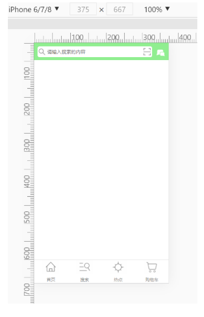

2. 多彩照片墙