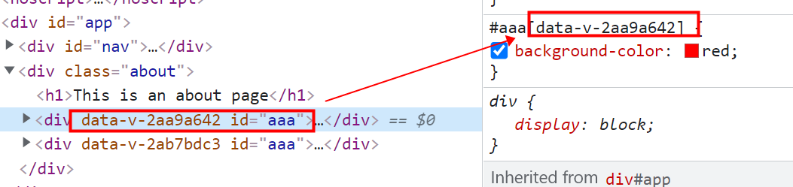
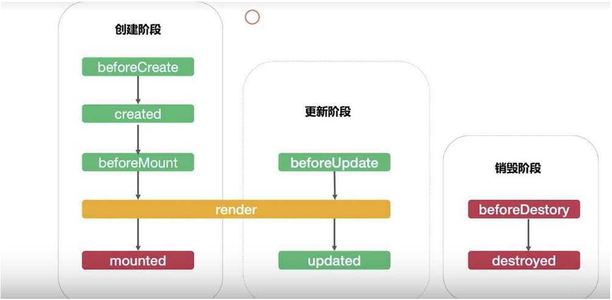
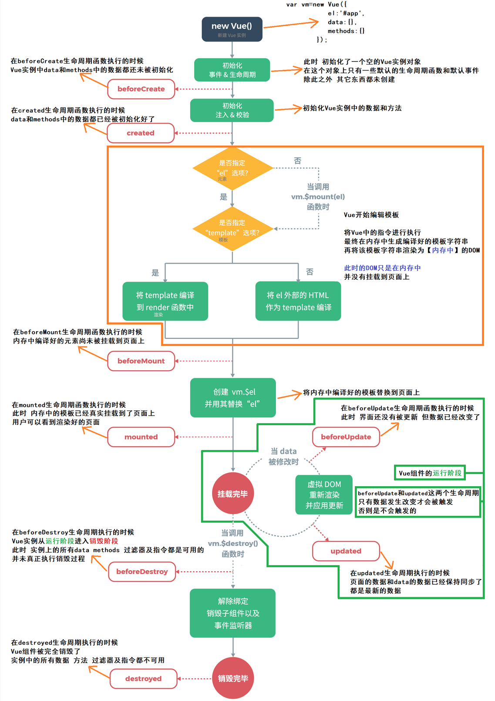

# 第五章：vue生命周期、vue的DOM操作、mixin混入，插件

## 本章目标

- 了解实例生命周期的过程
- 理解钩子函数的作用

## 回顾：

vue/cli 脚手架：

vue.js==={1.vue的核心代码  2.vue的模板编译器}

## 零、关于cli开发时，样式相关的补充

### 0.1 多组件类名相同时 

开发过程中当多个组件开发时有相同类名时，此时vue会按照组件的导入顺序进行解析，后导入的组件 会覆盖先导入的组件类名样式

### 0.2 scoped 属性

通过在样式表的< style>标签中添加scoped属性可以让样式只在当前组件内起作用。

原理是 添加过scoped属性后，vue会自动的在该组件的标签前添加 一个自定义的属性名，然后通过属性选择器去确定到底使用哪个样式内容。



##  一、实例的生命周期

为什么需要生命周期？

通过生命周期函数(钩子)来让vue实例在不同的时期执行不同的功能操作。

#### 完成案例：

需求1：使用js，完成效果  当**页面加载完成时** 让p标签字体大小由10px一直增加，每次加1 到50px后在减小到10px 再累加 循环往复。

```html
		<div id="app">
			<p :style="{fontSize: x+'px'}">你好哈哈哈</p>
		</div>
		let vm = new Vue({
			el:"#app",
			data:{
				x:10,
			}
		})
 		let b = true;
		setInterval(()=>{
			if(vm.x<100 && b==true){
				vm.x+=1
			}
			if(vm.x == 100){
				b = false
			}
			if(b==false){
				vm.x -= 1
			}
			if(vm.x==10){
				b = true
			}
		},20) 
```

需求2：有一个json文件 ，当页面加载完成时 把json文件中的数据遍历显示到页面上。

```html
<!DOCTYPE html>
<html>
	<body>
		<div id="app">
			<ul>
				<li v-for="item in list">{{item.name}}</li>
			</ul>
		</div>
	</body>
	<script type="text/javascript">
		let vm = new Vue({
			el:"#app",
			data:{
				list:[]
			},
			methods:{
				async getData(){
					let {data:res} = await axios.get('./111.json')
					this.list = res
				}
			},
			created() {
				this.getData()
			},
			
		})
	</script>
</html>
```


### 1.1 什么是实例的生命周期

- 所谓“生命周期” life cycle，是指实例对象从构造函数开始执行（被创建）到被GC（Garbage Collection：垃圾回收机制）回收销毁的整个存在的时期

  创建----》运行----》销毁       出生----》活着(提供服务的)----》死亡

### 1.2 什么是生命周期钩子(函数)

- 在生命周期中**被自动调用**的函数叫做生命周期函数，也被形象的称为钩子函数，是由vue框架内部提供的函数。	

  在不同的实例对象时期，这些函数会自动的执行调用。

```js
#这里是我们第一次接触生命周期的感念：和人一样，人从出生一直到到最后的死亡，要经历很多个时期，比如童年、少年、青年、中年、老年等等，同理我们的实例也是有类似这样的一个周期，
```

- 生命周期钩子的**用途**

  - 在对象从创建到被回收的整个过程中会在不同的时期有不同的钩子函数，我们可以利用不同时期的钩子函数去完成不同的操作

- 钩子函数有哪些  

  - beforeCreate、created、beforeMount、mounted、beforeUpdate、updated、beforeDestroy、destroyed	

  - | **生命周期函数**                  | **含义**                                                     |
    | --------------------------------- | ------------------------------------------------------------ |
    | **beforeCreate（创建前）**        | **组件实例刚被创建，只有一些生命周期函数和默认事件，data和methods中的数据还没有初始化【加一些loading事件】** |
    | ********created（创建后）******** | **组件实例刚创建完成，属性已经绑定，当时DOM还未生成，$el属性还不存在【结束loading事件，还做一些初始化，实现函数自执行等 ajax,axios等数据获取在这个阶段进** |
    | **beforeMount(挂载前)**           | **模板编译、挂载之前**                                       |
    | **mounted（挂载后）**             | **模板编译、挂载之后【发起后端请求，取回数据接收页面之间传递的参数子组件向父组件传递参数】** |
    | **beforeUpdate（更新前）**        | **组件更新之前**                                             |
    | **updated（更新后）**             | **组件更新之后**                                             |
    | **beforeDestroy（销毁前）**       | **组件销毁前调用,这个阶段还可以访问到数据和方法，但是如果操作数据和方法的话，此时vm已经不能再被更新了** |
    | **destroyed（销毁后）**           | **组件销毁后调用**                                           |

**生命周期函数的分类：** 



### 1.3 钩子函数图解  



销毁阶段：注意：销毁的是属于vue实例自己的内容，原生的事件 不会被销毁掉。

```js
<!DOCTYPE html>
<html lang="en">

<head>
    <meta charset="UTF-8">
    <meta http-equiv="X-UA-Compatible" content="IE=edge">
    <meta name="viewport" content="width=device-width, initial-scale=1.0">
    <title>Document</title>
    <script src="./lib/vue.js"></script>
</head>

<body>
    <div id="app">
        <p>数据展示：{{x}}</p>
        <button @click="aaa">点击+</button>
        <button @click="des">点我销毁</button>
    </div>
</body>
<script>
    let vm = new Vue({
        el: '#app',
        //template:`<p>数据展示：{{x}}</p>`,
        data: {
            x: 10
        },
        methods: {
            aaa(){
                console.log('aaa方法执行了');
                this.x+=1
            },
            des(){
                //销毁方法
                this.$destroy()
            }
        },
        //阶段一(创建阶段) 1.1 beforeCreate：
        beforeCreate () {
            console.log("beforeCreate");
            /* console.log(this)
            debugger */
        },
        //阶段一(创建阶段) 1.2 created：
        created () {
            console.log("created");
            //console.log(this)
            //debugger
        },
        //阶段一(创建阶段) 1.3 beforeMount 挂载前阶段
        beforeMount () {
            //此阶段 可以操作DOM，但是会被最终的vue的真实DOM给覆盖掉
            console.log("beforeMount");
            //console.log(this)
            //debugger
        },
        //阶段一(创建阶段) 1.4 mounted 挂载后阶段
        mounted (){
            console.log("mounted");
            //console.log(this)
            //debugger
        },
        //阶段二(更新阶段) 2.1 beforeUpdate 更新前
        beforeUpdate () {
            console.log("beforeUpdate");
            /* console.log(this)
            debugger */
        },
        //阶段二(更新阶段) 2.2 updated 更新后
        updated () {
            console.log("updated");
            /* console.log(this)
            debugger */
        },
        //阶段三(销毁阶段) 3.1 beforeDestory 销毁前
        beforeDestroy () {
            console.log("beforeDestroy");
            //console.log(this)
            //debugger
        },
        //阶段三(销毁阶段) 3.2 destoryed 销毁后
        destroyed () {
            console.log("destroyed");
            console.log(this)
            debugger
        }
    })
    
</script>

</html>
```

#### 总结：

- **常用的**生命周期钩子 
  - created钩子      ajax  axios 请求数据
  - mounted钩子   ajax  axios 请求数据
  - beforeDestory钩子   ：停止定时器，消息订阅。。。
- 注意事项：
  - 销毁后整个vue实例就没有信息展示了
  - 销毁后 自定义事件会失效，但是原生DOM事件依然存在
  - 不会在beforeDestory阶段操作数据，因为，此时操作数据也是没有用的，不会触发数据更新

#### 搞清除Vue实例的生命周期（面试题）。

## 二、vue的DOM操作

### 2.1 $ref 引用

正常情况下DOM操作我们可以使用原生js和jquery来完成，但是vue是一个新的框架，我们要使用vue配套的DOM操作的方法来使用。

#### vm.$refs

- **类型**：`Object` 

- **只读**

- **详细**：

  一个对象，持有注册过 [`ref` attribute](https://cn.vuejs.org/v2/api/#ref) 的所有 DOM 元素和组件实例。

### 2.2 使用 $refs 获取DOM元素 

`ref`属性介绍：被用来给元素或者子组件注册引用信息(id的替代者)。

- ref用在DOM元素上获取的就是该DOM元素
- ref用在组件标签上，获取的就是组件的实例对象

**格式：**

- 添加ref : `<h1 ref="myh1">这里是父组件</h1>`
- 获取：`this.$refs.myh1`

```vue
只需要在组件中的标签上添加一个ref属性 我们就可以通过$refs来取到这个DOM元素
<h1 ref="myh1">这里是父组件</h1>
<button @click="getDom">取出DOM元素</button>
//son1组件
<son1 ref="son1Com"></son1>

methods: {
        getDom(){
			//取h1标签元素
            console.log(this.$refs.myh1);
			//取son1组件
			console.log(this.$refs.son1Com)
        }
    }
```

### 2.3 使用 $refs 获取组件引用

使用方式：同上 ：只需要在子组件的引用上添加一个ref属性 就可以通过$refs来取到整个子组件  就可以调用整个子组件上的数据和方法了。可以达成由父组件直接操作子组件的需求。

### 2.4 $nextTick方法

**作用：** 将回调延迟到下次 DOM 更新循环之后执行。在修改数据之后立即使用它，然后等待 DOM 更新。它跟全局方法 `Vue.nextTick` 一样，不同的是回调的 `this` 自动绑定到调用它的实例上。

当DOM更新完毕后 才会执行 $.nextTick

使用场景：案例：页面中有一个p标签和按钮，点击按钮 改变p标签上的数据

```vue
<template>
  <div class="son1">
    <p ref="p2">{{aaa}}</p>
    <button @click="changeAaa">点我改变数据</button>
  </div>
</template>

<script>
import bus from '@/components/eventBus.js'
export default {
    data () {
        return {
            son1Data:'son1组件的数据',
            aaa:'马上改变'
        }
    },
    methods: {
        changeAaa(){
            /*点击 `改变数据` 按钮会调用changeAaa方法 先进行赋值 但是接下来的控制台输出
            	console.log(this.$refs.p2.innerHTML); 输出的还是之前的老数据 并没有输出更新后的数据，这是因为vue的DOM更新是异步的，此时我们需要使用$nextTick()方法 在这个方法的回调函数中去使用DOM元素。
            */
            this.aaa = '改过的数据';
            
            console.log(this.$refs.p2.innerHTML);
            
            this.$nextTick(()=>{
                console.log(this.$refs.p2.innerHTML);
            })
            
        }
    }
};
</script>

```

## 三、mixin 混入/混合

功能：可以把不同组件中的相同的功能  抽取出来。

### 3.1 概念 

混入 (mixin) 提供了一种非常灵活的方式，来分发 Vue 组件中的可复用功能。一个混入对象可以包含任意组件选项。当组件使用混入对象时，所有混入对象的选项将被“混合”进入该组件本身的选项。

把多个组件共用的功能提取成一个配置对象。

分类：

- 局部混入 
- 全局混入

### 3.2 局部混入使用

1. 把多个组件中可能会重复利用的代码抽取出来 放在一个mixin.js文件中

   ```js
   export const a = {
   	methods:{
   		aaa(){
   			alert(this.msg)
   		}
   	},
   }
   ```

2. 在用到这些功能的组件中导入 这个mixin.js文件

   ```js
   //导入配置好的mixin.js
   import {a} from './mixin.js'
   ```

3. 在组件的配置项中添加`mixins`配置项  把导入的mixin.js 配置进去以数组形式配置 可以有多个混入

   ```vue
   <script>
   	//导入配置好的mixin.js
   	import {a} from './mixin.js'
   	export default {
   		data(){
   			return {
   				msg:'李四'
   			}
   		},
           //配置混入 的js
   		mixins:[a]
   	}
   </script>
   ```

### 3.3 选项合并 

- 当组件和混入对象含有同名选项时，这些选项将以恰当的方式进行“合并”。比如，数据对象在内部会进行递归合并，并在发生冲突时以组件数据优先。
- 同名钩子函数将合并为一个数组，因此都将被调用。另外，混入对象的钩子将在组件自身钩子**之前**调用。
- 值为对象的选项，例如 `methods`、`components` 和 `directives`，将被合并为同一个对象。两个对象键名冲突时，取组件对象的键值对。

### 3.4 全局混入 

概念：混入也可以进行全局注册。使用时格外小心！一旦使用全局混入，它将影响**每一个**之后创建的 Vue 实例。使用恰当时，这可以用来为自定义选项注入处理逻辑。

```js
//导入定义好的全局混入文件
import mixin02 from './components/mixin02.js'
//注册全局混入
Vue.mixin(mixin02)
```

**注意：** 请谨慎使用全局混入，因为它会影响每个单独创建的 Vue 实例 (包括第三方组件)。大多数情况下，只应当应用于自定义选项，就像上面示例一样。推荐将其作为[插件](https://cn.vuejs.org/v2/guide/plugins.html)发布，以避免重复应用混入。

## 四、vue 插件 

### 4.1简介

插件通常用来为 Vue 添加全局功能。插件的功能范围没有严格的限制——一般有下面几种：

1. 添加全局方法或者 property。如：[vue-custom-element](https://github.com/karol-f/vue-custom-element)
2. 添加全局资源：指令/过滤器/过渡等。如 [vue-touch](https://github.com/vuejs/vue-touch)
3. 通过全局混入来添加一些组件选项。如 [vue-router](https://github.com/vuejs/vue-router)
4. 添加 Vue 实例方法，通过把它们添加到 `Vue.prototype` 上实现。
5. 一个库，提供自己的 API，同时提供上面提到的一个或多个功能。如 [vue-router](https://github.com/vuejs/vue-router)

### 4.2 开发插件 

Vue.js 的插件应该暴露一个 `install` 方法。这个方法的第一个参数是 `Vue` 构造器，第二个参数是一个可选的选项对象(就是在使用插件时 可以传入其余的自定义参数)：

```js
//自定义并向外暴漏一个插件
export default {
	//接收一个Vue的构造器
    //install(Vue,参数2){} Vue就是构造器  参数2  就是注册插件时传入的其余的参数。
	install(Vue){
		  // 1. 添加全局资源 自定义指令
		  Vue.directive('color', {
		    bind (el, binding, vnode, oldVnode) {
		       el.style.color = 'red'
		    }
		  })
		
		  // 2. 注入组件选项
		  Vue.mixin({
		    created: function () {
		      console.log('插件定义的created方法被调用了')
		    }
		  })
		
		  // 3. 添加实例方法
		  Vue.prototype.aaa = function (methodOptions) {
		    // 逻辑...
			alert('这是一个实例方法');
		  }
		    
		  //4.定义全局过滤器
		   Vue.filter('myFilter',function(val){
				return val.toUpperCase()
		   })
	}
}
```

### 4.3 使用插件

通过全局方法 `Vue.use()` 使用插件。它需要在你调用 `new Vue()` 启动应用之前完成：

```js
// 调用 `MyPlugin.install(Vue)`
Vue.use(MyPlugin)

new Vue({
  // ...组件选项
})
```

也可以传入一个可选的选项对象：

```js
Vue.use(MyPlugin, { someOption: true })//此处的{ someOption: true }就是传入插件中的其余参数
```

`Vue.use` 会自动阻止多次注册相同插件，届时即使多次调用也只会注册一次该插件。

## 五、总结与作业 

掌握今日的知识点，**重点vue生命周期** 。  