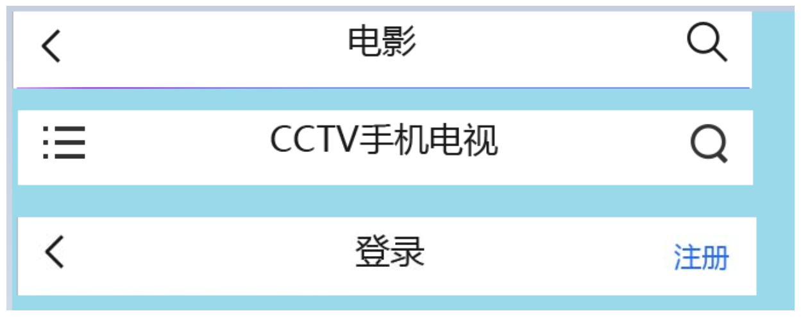

# 第七章：动态组件，插槽，自定义指令，axios

## 本章任务 

1. 动态组件
2. 插槽
3. 自定义指令
4. vant UI 组件库
5. 能够使用Axios发起请求进行前后端数据交互   
6. axios的配置 

## 本章内容 

- 动态组件
- 插槽
- 自定义指令
- axios

## 一、动态组件 

### 1.1 什么是动态组件 

概念：动态组件就是可以**动态改变的组件**，之前我们引入组件，都是把组件固定写在某一个位置显示，没有办法切换组件显示，动态组件可以帮我们完成这个目的。vue中提供了一个组件`<component/>`来动态的完成组件的切换， 不需要我们自己去封装。

### 1.2 动态组件的使用 

1. 父组件中导入并注册子组件

   ```js
   	//导入需要动态切换的 两个子组件	
   	import com01 from '../components/Com01.vue'
   	import com02 from '../components/Com02.vue'
   	export default{
   		name:"about",
           //注册子组件
   		components:{
   			com01,com02
   		},
   	}
   ```

2. 在父组件中通过`<component is>`内置组件的:is属性，使用子组件

   ```vue
   直接写is相当于直接写死 一个组件的名称，可以使用v-bind 的:is属性来完成动态的组件切换效果。
   <template>
     <div class="about">
       <h1>This is an about page</h1>
   	<button  @click="changeCom()">切换组件</button>
   	<component :is="comName"></component>
     </div>
   </template>
   ```

**存在问题：** **此时虽然可以动态切换组件，但是存在问题，组件的切换其实就是组件的销毁并重新创建，此时会导致再次切换回来无法保证原来的组件中的数据信息。可以通过生命周期函数验证。**

com01.vue组件：

```vue
<template>
	<div class="box">
		<h1>这里是组件01</h1>
		<p>{{num}}</p>
		<button type="button" @click="add">点击增加</button>
	</div>
</template>

<script>
	export default{
		data(){
			return{
				num:0
			}
		},
        methods:{
			add(){
				this.num+=1;
			}
		}
	}
</script>

<style lang="less" scoped="scoped">
	h1{
		background-color: blue;
		color: white;
	}
</style>
```

com02.vue组件：

```vue
<template>
	<div class="box">
		<h1>这里是组件02</h1>
		<p>{{num}}</p>
		<button type="button" @click="add">点击增加</button>
	</div>
</template>

<script>
	export default{
		data(){
			return{
				num:0
			}
		},
        methods:{
			add(){
				this.num+=1;
			}
		}
	}
</script>

<style lang="less" scoped="scoped">
	h1{
		background-color: red;
		color: white;
	}
</style>
```

about.vue父组件：

```vue
<template>
  <div class="about">
    <h1>This is an about page</h1>
	<button  @click="changeCom()">切换组件</button>
	<component :is="comName"></component>
  </div>
</template>
<script>
	import com01 from '../components/Com01.vue'
	import com02 from '../components/Com02.vue'
	export default{
		name:"about",
		components:{
			com01,com02
		},
		data(){
			return {
				comName:'com01',
				comList:['com01','com02']
			}
		},
		methods:{
			changeCom(){
				let i = this.comList.findIndex(item=>{
					return item == this.comName
				})
				if(i==0){
					//console.log(this.comList[1])
					this.comName = this.comList[1]
				}
				if(i==1){
					this.comName = this.comList[0]
				}
			}
		}
	}
	
</script>
<style type="text/css">
	
</style>
```

### 1.3 使用 keep-alive 解决上述问题

keep-alive可以保证在组件切换时 不被销毁,处于缓存状态，从而保证数据的完整性。

代码实现：使用`<keep-alive></keep-alive>`把`<component :is=''></component>`包括起来就可以了。

```vue
	<keep-alive>
		<component :is="comName"></component>
	</keep-alive>
```

### 1.4 `keep-alive`的生命周期函数和属性props

#### 1.4.1 生命周期函数

`keep-alive`缓存组件有两个生命周期钩子函数，分别是：

- `activated`   组件被激活时调用
- `deactivated`  组件被缓存时调用

```vue
<template>
	<div class="box">
		<h1>这里是组件01</h1>
		<p>{{num}}</p>
		<button type="button" @click="add">点击增加</button>
	</div>
</template>

<script>
	export default{
		data(){
			return{
				num:0
			}
		},
		methods:{
			add(){
				this.num+=1;
			}
		},
        //定义keep-alive组件的生命周期函数
		activated() {
			console.log('com01组件被激活了');
		},
		deactivated() {
			console.log('com01组件被缓存了');
		}
	}
</script>

<style lang="less" scoped="scoped">
	h1{
		background-color: blue;
		color: white;
	}
</style>
```

#### 1.4.2 `keep-alive`属性

- `include` - 字符串或正则表达式。只有名称匹配的组件会被缓存。
- `exclude` - 字符串或正则表达式。任何名称匹配的组件都不会被缓存。
- `max` - 数字。最多可以缓存多少组件实例。最多可以缓存多少组件实例。一旦这个数字达到了，在新实例被创建之前，已缓存组件中最久没有被访问的实例会被销毁掉。

```vue
	<keep-alive include="com01,com02">
		<component :is="comName"></component>
	</keep-alive>
```

**注意：**include和exclude两个属性不能同时使用。

## 二、插槽 slot 

### 2.1 slot简介  v-slot

slot是插槽（槽口）的意思，其目的在于让组件的 **可扩展性** 更强，用来混合父组件的内容与子组件自己的模板

```js
#例如：需要在组件中插入一些内容
<alert-box>
  Something bad happened.
  ul
	li
</alert-box>

#定义组件模版时
<template id="ab">
    <div class="demo-alert-box">
      //调用组件时，插入的内容会显示在模版中的这个位置
      <slot></slot>
    </div>   
</template>

Vue.component('alert-box', {
  template:'#ab'
})
```


### 2.2 使用场景和分类

在**组件化开发**中，虽然组件是一样的，但是在不同的使用场景组件的一部分内容需要有不同的内容显示

#### 2.2.1 分类

- 匿名slot
- 具名slot

#### 2.2.2 匿名插槽

匿名插槽：从字面意思来理解是就是没有名字的插槽，特点就是可以放任何你放的东西。

**注意：**此时的插槽不是真的没有名字，而是名字默认为 'default'  ====>  `<slot name='default'></slot>`

```html
<template id="mycomponent">
    <div>
        <p>头部区域</p>
        <slot>如果没有分发内容，则显示默认提示</slot>
        <p>底部区域</p>
    </div>
</template>
<mycomponent>
    <span>可以防止任何内容</span>
</mycomponent>
```

#### 2.2.3 具名插槽

假设我们的电脑主板上的各种插槽，有插CPU的，有插显卡的，有插内存的，有插硬盘的，所以假设有个组件是computer，我们不可能把显卡插到内存的位置上，具名slot也就是每个slot都有名字，不能随意替换，对应插入

```html
vue2.6之前的版本：
	<div id="app">
        <first>
            <!-- 这里的内容就相当于插头 slot就连接组件中的插槽 -->
            <ul slot="usb">
                <li>第1个li标签</li>
                <li>第2个li标签</li>
                <li>第3个li标签</li>
            </ul>
            <ul>
                <li>你好嘿嘿额1</li>
                <li>你好嘿嘿额2</li>
            </ul>
        </first>
    </div>
在组件模板中定义slot有名字的插槽 但是在使用时 也要带上插槽的名字。
    <template id="tem">
        <div>
            <p>你好哈哈哈哈</p>
            <!-- 定义插槽 name属性定义插槽的名字 -->
            <slot name="usb"></slot>
            <slot></slot>
        </div>
    </template>

vue2.6之后的版本：
<!--子组件模版-->
<template id="mycomponent">
    <div class="container">
        <header>
            <slot name="header"></slot>
        </header>
        <main>
            <slot></slot>
        </main>
        <footer>
            <slot name="footer"></slot>
        </footer>
    </div>
</template>

<!--调用子组件 向具名插槽提供内容的时候，我们可以在一个 <template> 元素上使用 v-slot 指令，并以 v-slot 的参数的形式提供其名称：
缩写：v-slot:header  ===     #header
-->
<mycomponent>
    <template v-slot:header>
        <h1>Here might be a page title</h1>
    </template>

    <p>A paragraph for the main content.</p>
    <p>And another one.</p>
	v-slot的简写形式就是#
    <template #footer>
        <p>Here's some contact info</p>
    </template>
</mycomponent>
```

#### 2.2.4 作用域插槽：借助插槽的子组件向父组件传值：

**场景：**子组件的数据需要到父组件，父组件使用子组件的数据进行一些列运算 再发送给子组件。

如果使用父子组件的通信：需要借助 自定义事件监听，props[]做数据传递，麻烦。

此时可以使用插槽来实现 子向父  再到  父向子做数据传递。

```vue
#com01.vue子组件中
<template>
	<div class="box">
		<h1>
			这里是组件01
			<slot name="aaa" msg='你好哈哈哈'></slot>
		</h1>
	</div>
</template>

#About.vue父组件中
<template >
	<!--使用子组件-->
	<com01>
    	<template v-slot:aaa='obj'>
			这是插槽插入的内容
			{{obj.msg}}
		</template>
    </com01>			
</template>
观察发现，在com01.vue子组件中的插槽内 定义了属性msg='你好哈哈哈'，在about.vue父组件中的<template>标签中通过v-slot:aaa='obj'指令中 可以通过obj来获取到 msg的属性的数据。同理，此时的msg是直接写死的内容，可以通过:msg把这个数据变成动态传递的。
```

**使用场景：**作用域插槽一般在封装组件时比较常用，在封装好的组件中，通过插槽预留数据位置，在使用组件时，只需要传入需要的数据就可以了。

课下改版购物车：把加减按钮单独提取成一个组件。

### vant:组件库https://vant-contrib.gitee.io/vant/v2/#/zh-CN/home

## 三、自定义指令 

### 3.1 什么是自定义指令

**概念：** 在vue中内部提供的有很多v-系列的指令，例如 v-if  v-model 等，都有特定的作用，但是如果我们有一些特殊的需求时，vue也支持我们可以自定义指令来完成一些功能的设置。

**我们自己封装一个函数，给这个函数链接一个对应的名字 把这个名字当作指令来使用。**

**分类：**主要有两种 

- 全局自定义指令
- 局部(私有)自定义指令

### 3.2 为什么要用自定义指令 

问题一：vue 的内置指令干了什么？

​		就是DOM操作，vue做DOM操作的方式 跟我们之前学习 原生js 自己写的代码是一样的。

问题二：自定义指令是干啥的？

​		让我们自己操作DOM，按照我们自己的需求 就跟我们当年写原生js一样。  借助函数

**vue的指令底层实际上就是调用函数，通过v-系列的指令调用对应的函数。** 

### 3.3 自定义指令的使用 

完成案例：当输入框加载完成时，让输入框得到焦点。

**全局自定义指令：**

```
// 注册一个全局自定义指令 `v-focus`
Vue.directive('focus', {
  // 当被绑定的元素插入到 DOM 中时……
  inserted: function (el) {
    // 聚焦元素
    el.focus()
  }
})
```

**局部自定义指令：** 

```
//所有的局部自定义指令放在这里。 只能再当前组件内部使用这个指令
directives: {
  focus: {
    // 指令的定义
    inserted: function (el) {
      el.focus()
    }
  }
}
```

#### 指令的钩子函数以及参数对象：

一个指令定义对象可以提供如下几个钩子函数 (均为可选)：

- `bind`：只调用一次，指令第一次绑定到元素时调用。在这里可以进行一次性的初始化设置。

- `inserted`：被绑定元素插入父节点时调用 (仅保证父节点存在，但不一定已被插入文档中)。

- `update`：所在组件的 VNode 更新时调用，**但是可能发生在其子 VNode 更新之前**。指令的值可能发生了改变，也可能没有。但是你可以通过比较更新前后的值来忽略不必要的模板更新 (详细的钩子函数参数见下)。

  当数据发生更新时 就会调用。

**在使用自定义指令时 如果我们想传递一些参数使用，此时在自定义指令的`bind(el,binding)`函数中可以进行参数接收**

`el`：指令所绑定的元素，可以用来直接操作 DOM。

`binding`：一个对象，包含以下 property：

- `name`：指令名，不包括 `v-` 前缀。  **当有多个单词组成指令名字时，推荐使用‘ - ’ 连接多个单词**
- `value`：指令的绑定值，例如：`v-my-directive="1 + 1"` 中，绑定值为 `2`。
- `oldValue`：指令绑定的前一个值，仅在 `update` 和 `componentUpdated` 钩子中可用。无论值是否改变都可用。
- `expression`：字符串形式的指令表达式。例如 `v-my-directive="1 + 1"` 中，表达式为 `"1 + 1"`。
- `arg`：传给指令的参数，可选。例如 `v-my-directive:foo` 中，参数为 `"foo"`。
- `modifiers`：一个包含修饰符的对象。例如：`v-my-directive.foo.bar` 中，修饰符对象为 `{ foo: true, bar: true }`。

1. **对象式自定义指令** 

在vue实例中添加节点 `directives` 此节点专门用来定义私有自定义指令：

```vue
<template>
	<div class="box">
		<h1 v-aaa>
			这里是组件01
		</h1>
	</div>
</template>


//在directives属性下  可以定义私有自定义指令
		directives:{
			//此处的aaa就是自定义指令的名字
			aaa:{
				//当指令绑定到标签上时  会立即触发 bind事件
				bind(el){
					el.style.aaa = "green"
				}
			}
		}
注意：在上边代码中 aaa就是指令的名字  调用时 要加上v-   v-aaa就是此指令的全名
	在指令对象中要添加一个bind()函数  只要把指令添加到标签上，那么就可以自动触发 这个bind函数，括号中的el就是触发当前指令的元素DOM对象。
```

**传递参数的自定义指令使用** 

```vue
<template>
	<div class="box">
		<h1 v-aaa="'blue'">
			这里是组件01
		</h1>
	</div>
</template>

//在directives属性下  可以定义私有自定义指令
		directives:{
			//此处的color就是自定义指令的名字
			color:{
				//当指令绑定到标签上时  会立即触发 bind事件
				//可以直接从binding的value属性中取到 指令的数据
				bind(el,binding){
					el.style.color = binding.value
				}
			}
		}
```

**此时存在问题：** 如果我们不是通过指令直接赋值，而是通过组件中的data数据来给指令进行赋值，此时，如果我们在指令绑定之后，再次修改了该data数据的值，此时 这个结果不会同步更新到DOM结构中。

使用`update()`方法 解决这个问题，该方法会在DOM结构更新时调用一次，就可以保证指令中的数据发生更新后 也可以把数据的结果同步更新到DOM结构中。

```vue
<template>
	<div class="box">
		<h1 v-color='yanse'>
			这里是组件01
			<button type="button" @click="yanse='pink'">点击按钮改变颜色</button>
		</h1>
	</div>
</template>

<script>
	export default{
		data(){
			return{
				num:0,
				yanse:'red'
			}
		},
		//在directives属性下  可以定义私有自定义指令
		directives:{
			//此处的color就是自定义指令的名字
			color:{
				//当指令绑定到标签上时  会立即触发 bind事件
				bind(el,binding){
					el.style.color = binding.value
					console.log('触发了bind函数')
				},
				update(el,binding){
					el.style.color = binding.value
					console.log('触发了update函数')
				}
			},
		}
	}
</script>

<style lang="less" scoped="scoped">
	h1{
		background-color: blue;
		color: white;
	}
</style>
```

2. **函数式自定义指令**

在很多时候，你可能想在 `bind` 和 `update` 时触发相同行为，而不关心其它的钩子。比如这样写：

```vue
//全局指令中
Vue.directive('color-swatch', function (el, binding) {
  el.style.backgroundColor = binding.value
})
//局部指令中
<script>
	export default{
		data(){
			return{
				num:0,
				yanse:'red'
			}
		},
		//在directives属性下  可以定义私有自定义指令
		directives:{
			//此处的color就是自定义指令的名字
			color(el,binding){
				el.style.color = binding.value
			},
		}
	}
</script>
此时我们的bind和update函数触发的行为是完全一样的 我们可以把指令对象简写成一个函数使用。
```

**注意：** 

- 指令的名字 如果是多个单词 推荐使用 ‘ - ’ 连接。
- 指令中的内置函数中的this指向window对象。

### 3.4 全局自定义指令

```
注册一个全局自定义指令 Vue.directive(参数一，参数二)
参数一：指的是指令的名字
参数二：指的是指令的配置  可以是对象，也可以是函数
Vue.directive('focus', {
  // 当被绑定的元素插入到 DOM 中时……
  inserted: function (el) {
    // 聚焦元素
    el.focus()
  }
})

```

##   四、前端和后端的开发简介 + axios请求

### 4.1 概念

- 任何一个应用程序都有前端和后端（后台、服务端）
  - 前端：客户端，就是浏览器
  - 后端：服务器 
- 前端开发
  - 控制页面的样式
  - 数据的展示
  - 越来越多的业务逻辑放前端处理
- 后端开发
  操作数据库，返回给我们需要的数据	
- 

###  4.2 交互的应用场景

- 从后端获取一些数据，将其进行展示或计算
  - 浏览页面的时候，打开一个页面，这时候就会有交互产生，会从后端获得页面数据在前端页面显示
- 将用户在页面中提交的数据发送给后端
  - 登录的场景中体现的较为明显，登录操作的时候需要把用户名和密码发送后端，后端验证之后，确定是否能登录成功	

### 4.3、Axios 基本介绍 

Axios 是一个基于 promise 的 HTTP 库，可以用在浏览器和 node.js 中。

官方地址：https://github.com/axios/axios
中文地址：http://www.axios-js.com/zh-cn/docs/                                                                                                                                                                Axios 是一个基于 promise 的 HTTP 库，可以用在浏览器和 node.js 中。

#### 4.3.1 特性 

- 从浏览器中创建 [XMLHttpRequests](https://developer.mozilla.org/en-US/docs/Web/API/XMLHttpRequest)
- 从 node.js 创建 [http](http://nodejs.org/api/http.html) 请求
- 支持 [Promise](https://developer.mozilla.org/en-US/docs/Web/JavaScript/Reference/Global_Objects/Promise) API
- 拦截请求和响应 
- 转换请求数据和响应数据
- 取消请求
- 自动转换 JSON 数据
- 客户端支持防御 [XSRF](http://en.wikipedia.org/wiki/Cross-site_request_forgery)

#### 4.3.2 Axios安装 

CDN方式
https://unpkg.com/axios/dist/axios.min.js

NPM
npm install axios

#### 4.3.3 axios的使用方法

```js
<script src='./../js/axios.min.js'></script>
#基本用法
//可以通过向 axios 传递相关配置来创建请求
//axios(config)    基于promise的api ，所以在then方法中接收数据
axios({
  //配置请求的方式  默认为get
  method: 'post',
  //请求路径
  url: '/user/12345',
  //put  post  才使用data配置
  data: {
    firstName: 'Fred',
    lastName: 'Flintstone'
  }
}).then(res=>console.log(res));
//res是整体的响应对象，一共有6个属性 其中一个 data才是我们需要的返回数据
#get请求
// 为给定 ID 的 user 创建请求
axios.get('/user?ID=12345')
  .then(function (response) {
    console.log(response);
  })
  .catch(function (error) {
    console.log(error);
  });

// 上面的请求也可以这样做
axios.get('/user', {
    params: {
      ID: 12345
    }
  })
  .then(function (response) {
    console.log(response);
  })
  .catch(function (error) {
    console.log(error);
  });

#执行post请求
let obj = {
    firstName: 'Fred',
    lastName: 'Flintstone'
  }
axios.post('/user', obj)
  .then(function (response) {
    console.log(response);
  })
  .catch(function (error) {
    console.log(error);
  });

#执行多个并发请求
function getUserAccount() {
  return axios.get('/user/12345');
}

function getUserPermissions() {
  return axios.get('/user/12345/permissions');
}
//一般使用不多
axios.all([getUserAccount(), getUserPermissions()])
  .then(axios.spread(function (acct, perms) {
    // 两个请求现在都执行完成
  }));
```

**async + await 调用axios**：

```js
async handler(newVal){
	let obj = await axios.get('http://127.0.0.1:8080/register?name='+newVal);
	console.log(obj.data);
}
```


#### 4.3.4 请求方法的别名

rest 风格

为方便起见，为所有支持的请求方法提供了别名

```
axios.request(config)
axios.get(url[, config])
axios.delete(url[, config])
axios.head(url[, config])
axios.options(url[, config])
axios.post(url[, data[, config]])
axios.put(url[, data[, config]])
axios.patch(url[, data[, config]])
```

###### 注意

在使用别名方法时， `url`、`method`、`data` 这些属性都不必在配置中指定。

#### 4.3.5 配置默认值

你可以指定将被用在**各个请求**的配置默认值 

##### 全局的 axios 默认值

```js
axios.defaults.baseURL = 'https://api.example.com';  //基础地址
axios.defaults.headers.common['Authorization'] = AUTH_TOKEN; //设置公共请求头
axios.defaults.headers.post['Content-Type'] = 'application/x-www-form-urlencoded';
//通常前端通过POST请求向服务器端提交数据格式有4中，分别是"application/x-www-form-urlencoded"格式、" multipart/form-data"格式、"application/json"格式和"text/xml/plain"格式。通常最常见的是"application/json"格式，也就是通过JSON字符串形式。
```

##### 创建实例 

可以使用自定义配置新建一个 axios 实例

##### axios.create([config]) 

```js
const instance = axios.create({
  baseURL: 'https://some-domain.com/api/',
  timeout: 1000,
});

此时发送请求，直接使用我们自己定义的instance实例对象就可以了  instance====》axios对象
testConfig(){
	instance.get('aaa?id=123&subject=java').then(res=>{
		console.log(res.data);
	})
}
```

##### 实例方法

以下是可用的实例方法。指定的配置将与实例的配置合并。

```
axios#request(config)
axios#get(url[, config])
axios#delete(url[, config])
axios#head(url[, config])
axios#options(url[, config])
axios#post(url[, data[, config]])
axios#put(url[, data[, config]])
axios#patch(url[, data[, config]])
```

#### 4.3.6 请求配置见手册

参见官网配置信息：http://www.axios-js.com/zh-cn/docs/

#### 4.3.7 响应结构信息

某个请求的响应包含以下信息

```js
{
  // `data` 由服务器提供的响应
  data: {},

  // `status` 来自服务器响应的 HTTP 状态码
  status: 200,

  // `statusText` 来自服务器响应的 HTTP 状态信息
  statusText: 'OK',

  // `headers` 服务器响应的头
  headers: {},

   // `config` 是为请求提供的配置信息
  config: {},
 // 'request'
  // `request` is the request that generated this response
  // It is the last ClientRequest instance in node.js (in redirects)
  // and an XMLHttpRequest instance the browser
  request: {}
}
```

#### 4.3.8 axios 拦截器 

全局配置：所有的请求都必须要经过拦截器。

在请求或响应被 `then` 或 `catch` 处理前拦截它们。aaa

```js
// 添加请求拦截器
axios.interceptors.request.use(function (request) {
    // 在发送请求之前做些什么  此处的config就是请求的整个配置对象
    return request;
  }, function (error) {
    // 对请求错误做些什么
    return Promise.reject(error);
  });

// 添加响应拦截器
axios.interceptors.response.use(function (response) {
    // 对响应数据做点什么 此处的response相当于相应的整体配置对象
    return response;
  }, function (error) {
    // 对响应错误做点什么
    return Promise.reject(error);
  });
注意：必须有return   此处return相当于拦截放行。
```

如果你想在稍后移除拦截器，可以这样：

```js
const myInterceptor = axios.interceptors.request.use(function () {/*...*/});
axios.interceptors.request.eject(myInterceptor);
```

可以为自定义 axios 实例添加拦截器

```js
const instance = axios.create();
instance.interceptors.request.use(function () {/*...*/});
```

#### 4.3.9 补充 


#### 4.3.10 项目中axios的相关配置

**问题一：**在以后的vue-cli项目开发中我们很多时候都会发送大量的请求，按照以往的方式 我们会在每一个用到axios的vue文件中导入axios文件，这样比较麻烦 所以我们可以把axios挂载到vue 实例的原型对象上。

main.js文件：

```
//先在main.js文件中导入axios模块
import axios from 'axios'
//把axios模块挂载到vue的原型对象上，这样只要是vue的实例对象就都可以使用这个axios模块了，调用的时候 直接使用
//this.$http.get()  此时的$http<====>axios
Vue.prototype.$http = axios
```

**问题二：** 重复的导入axios是一个问题，其次每一次发送请求时 都要填写完整的路径也是一个问题，不利于后期的维护，所以我们可以在挂载axios之前 先对axios进行全局的路径配置：

```
//1.先在main.js文件中导入axios模块
import axios from 'axios'

//2.挂载之前先配置axios的BaseUrl路径
axios.defaults.baseURL = 'http://127.0.0.1:8080/'（请求的根路径）

//3.把axios模块挂载到vue的原型对象上，这样只要是vue的实例对象就都可以使用这个axios模块了，调用的时候 直接使用
//this.$http.get()  此时的$http<====>axios
Vue.prototype.$http = axios
```

需要掌握的：

  1. 如何发送get/post请求 ？

  2. 如何在发送get/post请求时携带参数 ？

  3. 前后端交互的数据格式问题？

       - 请求的格式有哪些？ application /(x-www-form-urlencoded/json/form-data/text-xml/plian)

       - axios默认发送 application/json类型的数据  后端无法直接接收

         需要处理：① qs 推荐   ② URLSearchParam()

		4. vue-cli项目中如何更好的使用axios?

     - 全局挂载(axios本身)
     - 全局挂载(axios的子实例对象 axios.create({}) )

		5. axios相关的配置

     - 全局访问路径的配置
     - 请求格式的配置(要看发送的数据本身)
     - 请求和响应的拦截器

## 五、总结与作业

1. 掌握动态组件，插槽，自定义指令的基础用法
2. 掌握使用axios发送请求的方式
3. 移动端页面头部组件的封装

