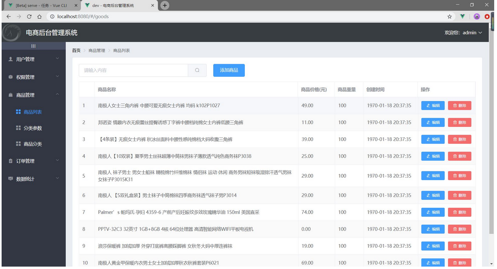
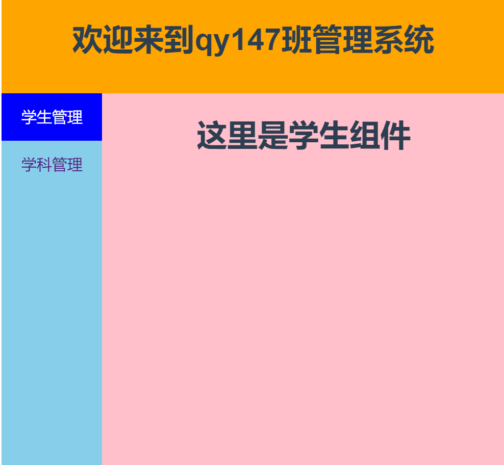
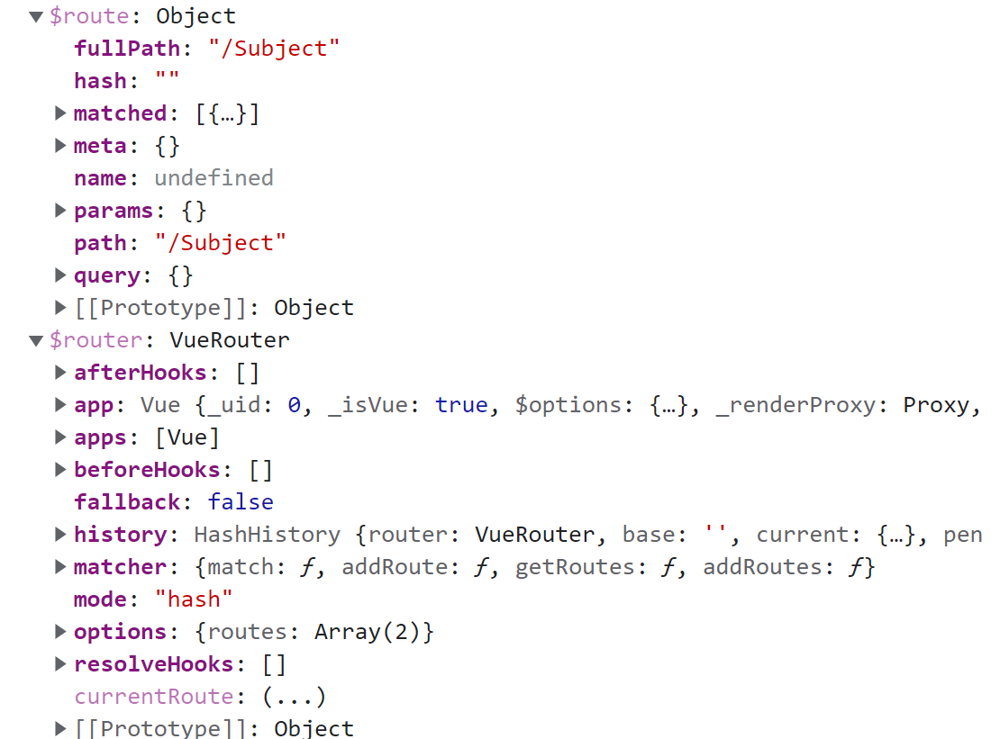
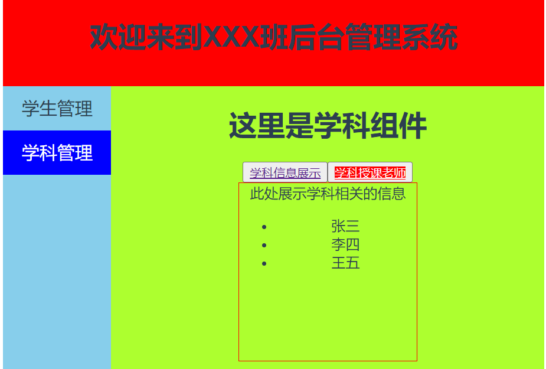

# 第八章：vue路由配置01基础

## 回顾：

动态组件：< component  :is=''>

​		keep-alive  include  exclude  max

插槽：

​		匿名插槽 default

​		具名插槽

​		作用域插槽

​		v-slot:name='obj'  # < template>

自定义指令：directive

​		局部:directives  当前组件范围内

​				对象式：对象的名字就是指令的名字

​						bind(), 当指令跟DOM元素**绑定**的时候

​						inserted(),当DOM元素插入结构中的时候

​						update()当数据发生更新时执行

​				函数式：函数的名字就是指令的名字

​		全局:main.js中  Vue.directive

渲染：

## 本章任务

1. 掌握vue路由配置的基本操作姿势

## 本章内容

- 理解路由的作用
- 掌握一级路由的配置方法
- 掌握二级路由(嵌套路由)的配置方法
- 掌握路由传参的使用方法

## 一、路由 

举个栗子：


对来说路由器：路由就是 一个路由接口对应一台终端设备。key===value

< component  :is='aaa'>aaa  ===   AAA.vue 

< iframe  name='aaa'  src="">  < a  href="独立的 html 页面" target='aaa'>

### 1.1 什么是路由 

Vue Router 是 [Vue.js](http://cn.vuejs.org/) 官方的路由管理器。Vue.js 路由允许我们通过不同的 URL 访问不同的内容。根据 url 锚点路径，在容器中加载不同的模块，本质作用是做页面导航。

路由的本质就是一种对应关系，比如说我们在url地址中输入我们要访问的url地址之后，浏览器要去请求这个url地址对应的资源。
 那么url地址和真实的资源之间就有一种对应的关系，就是路由。

#### 路由分为前端路由和后端路由

1. 后端路由是由服务器端进行实现，并完成资源的分发.
   						概念: 根据不同的URL请求,返回不同的内容
      				**本质: URL请求地址与服务器资源之间的对应关系**
2. 前端路由是依靠hash值(锚链接)的变化进行实现 
   					概念: 根据不同的事件显示不同的页面内容,即事件与事件处理函数之间的对应关系.
      					前端路由主要做监听事件并分发执行事件处理函数

**路由：实际上就是一组对应关系。** 

​		**一个路径对应一个路由组件。**   这个路径表示的仅仅是纯前端级 组件跳转。类似于锚点。

### 1.2 为什么要用路由 

主要目的：就是为了开发SPA应用

SPA: single page web application。单页[Web](https://baike.baidu.com/item/Web/150564)应用（single page web application，SPA），就是只有一张Web页面的应用。单页应用程序 (SPA) 是加载单个HTML 页面并在用户与应用程序交互时动态更新该页面的Web应用程序。 [1] 浏览器一开始会加载必需的HTML、CSS和JavaScript，所有的操作都在这张页面上完成，都由JavaScript来控制。因此，对单页应用来说模块化的开发和设计显得相当重要。

速度：更好的用户体验，让用户在web app感受native app的速度和流畅，

·MVVM：经典MVVM开发模式，前后端各负其责。

·ajax/axios/fetch：重前端，业务逻辑全部在本地操作，数据都需要通过AJAX同步、提交。

·路由：在URL中采用#号来作为当前视图的地址,改变#号后的参数，页面并不会重载。

通过 Vue.js 可以实现多视图的单页 Web 应用（single page web application，SPA）（单页面应用开发）

- 一种特殊的Web应用。它将所有的活动局限于一个Web页面中，仅在该Web页面初始化时加载相应的HTML、JavaScript、CSS。
- 一旦页面加载完成，SPA不会因为用户的操作而进行页面的重新加载或跳转，而是利用JavaScript动态的变换HTML（采用的是div切换显示和隐藏），从而实现UI与用户的交互



### 1.3 路由的工作原理

**路由渲染的本质其实是超链接锚点**：通过`location.href`可以获取到当前的路径地址，通过`location.hash`可以获得锚点的名字内容，也就是`#name` 。

当用户点击了页面中的路由链接时，会使链接的地址发生改变，相当于点击页面中的超链接时，链接的锚点发生改变，也叫做hash值 。路由会监听这个地址的变化，从而把这个地址对应的组件渲染到页面上。

这就意味着，我们要实时的监听浏览器地址栏中的内容，只要地址栏的内容发生了改变，我们就要获取到 地址栏中末尾位置的**路径地址** 然后根据这个路径地址 来渲染出不同的组件。需要监听事件`onhashChange` 只要地址发生改变 这个事件就可以触发。

```vue
<template>
  <div id="app">
    <div>
      <a href="#/aaa">AAA</a>
      <a href="#/bbb">BBB</a>
      <a href="#/ccc">CCC</a>
    </div>
    <div>
      <component :is='name'></component>
    </div>
  </div>
</template>

<script>
import aaa from './components/AAA.vue'
import bbb from './components/BBB.vue'
import ccc from './components/CCC.vue'
export default {
  data () {
    return {
      name:'aaa'
    }
  },
  name: 'App',
  components: {
    aaa,bbb,ccc
  },
  created () {
    //onhashchange 监听地址栏 只要地址栏发生了改变 就会触发这个事件
    window.onhashchange =()=>{
      console.log('1111',location.hash)
      switch(location.hash){
        case "#/aaa":
          this.name = "aaa"
          break
        case "#/bbb":
          this.name = "bbb"
          break
        case "#/ccc":
          this.name = "ccc"
          break
      }
    }
  }
}
</script>
```


###  1.4 路由的使用和配置

- 路由官网
  - https://router.vuejs.org/zh/
- 直接下载 / CDN
  - CDN:https://unpkg.com/vue-router@3.0.1/dist/vue-router.js
  - 使用 vue-router.js 库来引入路由功能模块
- NPM    
  - 安装路由  vue2.x版本对应 vue-router3   vue3.x对应vue-router4
    	`npm install vue-router@3/@4`

#### 1.4.1 路由的配置



1. 安装

2. 在src目录下创建**router文件夹**，并在其内创建**index.js**作为vue路由功能模块js文件

   ```js
   //1.导入vue和vue-router模块
   import Vue from 'vue'
   import VueRouter from 'vue-router'
   //使用路由模块  注册路由模块
   Vue.use(VueRouter)
   //2.导入我们自己需要的组件 路由组件
   import Student from '../views/Student.vue'
   //import Subject from '../views/Subject.vue'
   //3.配置路由规则 映射关系/对应关系
   const routes = [
       { path: '/stu', component: Student },
       { path: '/sub', component: ()=>import('../views/Subject.vue') },
   ]
   //4.创建路由器对象,向外暴漏
   export default new VueRouter({
       routes
   })
   ```
   
3. 在main.js入口文件中实例化vue对象，并注册路由

   ```js
   import Vue from 'vue'
   import App from './App.vue'
   //导入路由
   import router from './router/index.js'
   
   Vue.config.productionTip = false
   
   new Vue({
     router,//注册路由
     render: h => h(App)
   }).$mount('#app')
   ```

4. 在页面定义导航和路由出口

   - 通过`< router-link to="/路径">< /router-link>`标签配置路由导航

     - to:目标地址 ===>就指向路由器中的path
   
     - tag:指定何种标签，同样它还是会监听点击，触发导航。默认a 
   
     - active-class:设置链接激活时使用的 CSS 类名
       要注意，当 < router-link> 对应的路由匹配成功，将自动设置 class 属性值 `.router-link-active`

       也就是：`active-calss='router-link-active'` 

     - class属性默认值可以通过路由的构造选项 `linkActiveClass` 来全局配置

   - 通过`< router-view>< /router-view>`标签渲染组件
   
     把这个标签写在要渲染组件的位置就可以了。
   
   ```vue
   <template>
     <div id="app">
       <div id="nav">
         <!-- 配置路由导航 ： 路径对应的就是 router中配置的 路径 -->
         <router-link to="/">Home</router-link>
         <router-link to="/about">about</router-link>
       </div>
         <!-- 路由链接的组件渲染的位置 -->
       <router-view></router-view>
       
       <!-- <HelloWorld msg="Welcome to Your Vue.js App"/> -->
     </div>
   </template>
   ```

**注意：** 路由的切换会导致组件销毁，如果不想销毁可以参考使用 `keep-alive`  

**注意：** 此时在路由渲染的组件中添加mounted生命周期钩子  打印输出this 会发现 vue组件实例对象上多出两个属性：

`$route` 和 `$router` 



`$route` 指的是当前路由组件的配置相关的信息(参数对象)，`$router`指的是整个路由器对象 （导航对象）

#### 1.4.2 路由重定向 redirect 

当我们打开项目访问页面时，访问的路径是根路径 `http://localhost:8080/#/` 是一个单独的`/` ，路由中并没有与之对应的匹配规则，所以此时我们可以设置`redirect`属性 来作为路由打开时 默认访问的组件页面。

```
    //redirect 用来配置重定向 
    //当访问 / 时 会把路径重定向到 stu
    { path: '/', redirect: "sub" },
```

#### 1.4.3 二级路由(嵌套路由)/多级路由 



**概念：** 我们点击一级路由会展示一个组件，但是在这个组件的内部 还会存在其余的链接/按钮，此时点击这个链接/按钮 会重新渲染一个组件，此时，一级路由组件跟这个嵌套组件的关系就是嵌套路由。我们要通过`children`属性来配置子路由

**注意：** 二级路由，path分配，前面不要有 /

```js
#二级路由配置
routes:[
    {
        path:'/home',
        children:[
            
            //redirect 重定向 通过这个属性可以设置 默认展示的子路由组件
            {path:"/",redirect:"list"},
            {path:'tv',component:()=>import('./../components/tv.vue')},
            {path:'music',component:()=>import('./../components/music.vue')}
        ]
    }
]

#在一级路由组件模版中定义二级路由导航和路由出口
<!--  在一级路由组件模版中，定义二级路由导航 -->
<router-link to='/home/tv'>tv</router-link>
<!--  在一级路由组件模版中，定义二级路由出口-->
<router-view></router-view>
```

### 1.5 动态路由匹配（路由传参）

#### 1.5.1 参数传递一 （`:` 传递参数）

**简介：**我们经常需要把某种模式匹配到的所有路由，全都映射到一个同样的组件。例如，我们有一个`StudentInfo`组件，对于所有 ID学号 各不相同的学生，都要使用这个组件来渲染学生信息。

把hash地址中可变的部分定义为参数项，可以提高路由的可复用性。我们可以在 `vue-router` 的路由路径中使用“动态路径参数”来达到这个效果，使用`:`表示动态路由参数。

**组件中的路由点击位置：**

```html
<router-link to='stu/1'>学生一</router-link>
<router-link to='stu/2'>学生二</router-link>
<router-link to='stu/3'>学生三</router-link>
<router-link to='stu/4'>学生四</router-link>
注意：此时 只要是goods下的地址都会被路由映射到 路由规则的goods选项节点下去匹配
	{
			path: '/Student',
			component: Student,
			children:[
				{path:'stu/1',component:StuInfo},
				{path:'stu/2',component:StuInfo},
				{path:'stu/3',component:StuInfo},
				{path:'stu/4',component:StuInfo},
			]
		},
此时路由规则可以这样定义，但是太麻烦了，每一个都要对应一个路由规则，此时可以采用一下对应规则
```

**index.js中的路由规则：**

```js
const router = new VueRouter({
  routes: [
    // 动态路径参数 以冒号开头
    { path: 'stu/:id', component: StuInfo }
  ]
})
```

此时我们可以在`StuInfo`组件中接收到路由中传递的参数：

当匹配到一个路由时，参数值会被设置到 `this.$route.params`，可以在每个组件内使用。于是，我们可以更新 学生信息的模板，输出当前用户的 ID：`< div>User {{ $route.params.id }}< /div>`

#### 1.5.2 参数传递二 （`props`属性传递参数）

1. 给路由开启`props`属性

   ```js
   //index.js中的路由配置
   //添加属性props:true;
   const router = new VueRouter({
     routes: [
       // 动态路径参数 以冒号开头
       { path: 'stu/:id', component: StuInfo ,props:true}
     ]
   })
   ```

2. ` StuInfo` 组件中使用`props`属性接收参数

   ```js
   export default{
       //
       props:['id'],
       methods:{
           aaa(){
               console.log(this)
           }
       }
   }
   ```

**补充：** **注意：**上边代码中`<router-link to='stu/1' />`标签中的参数 1 一般被叫做**路径参数** 。我们也有另外一种传递参数的方式，类似于超链接向后台发送请求的参数传递(hash地址传参)， `<router-link to='stu/1?name=张三&age=19'/>` 这种参数传递的方式叫做   **查询参数**  组件接收数据时 可以使用 `$route.query`来接收。

**路由链接处代码：(路由传递参数的写法一)**：to属性的字符串拼接式

```js
<router-link to="/Student/stu/1?name=123&age=18">张三</router-link>
```

`StuInfo`组件中代码：可以使用`$route.query`接收参数

```vue
<h4>{{$route.query}}</h4>
```

**路由传递参数的写法二：**to属性的对象式

```js
<router-link :to="{
				path:'/Student/stu/2',
				query:{
					name:'123456',
					age:18
				}
			}">
		李四
</router-link>
```

### 1.6 命名路由

**概念：** 在定义路由时 添加一个新的配置项 `name` 就可以了

`index.js配置中：`

```js
{
	path: '/Student',
    //此处给路由添加一个name属性
	name:'SSS',
	component: Student,
	children:[
		{path:'stu/:id',component:StuInfo,props:true}
	]
},
```

`路由链接处:` 通过`:to`属性 指定 对应的路由跳转

```js
<router-link tag="p" active-class="router-link-active" :to="{name:'SSS'}">学生管理</router-link>
```


## 二、总结与作业

1. 总结今日知识点
2. 课堂案例