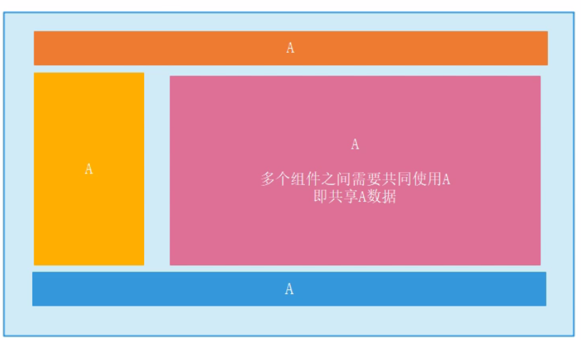
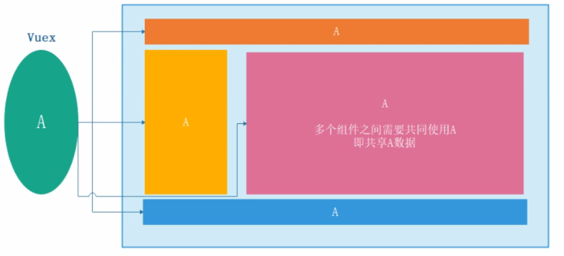
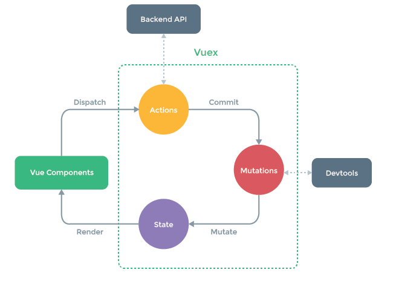
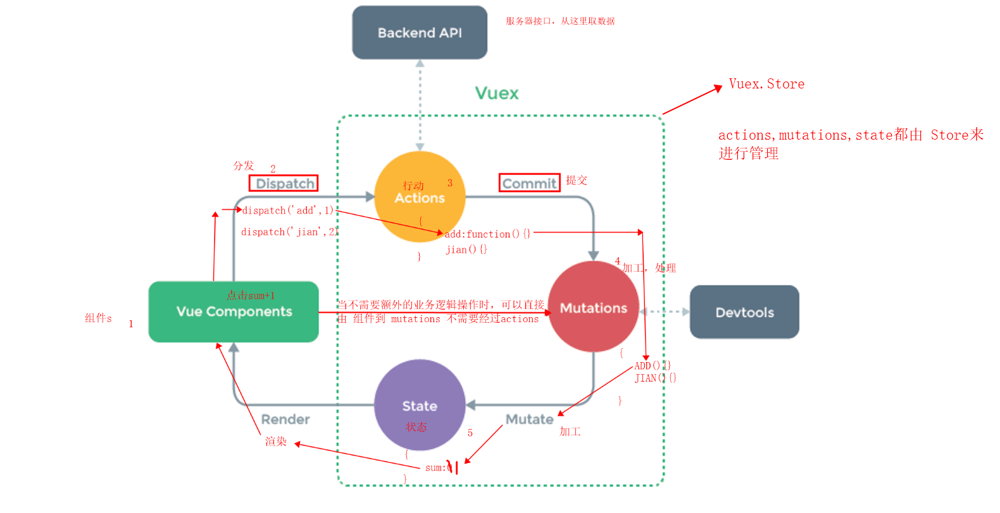
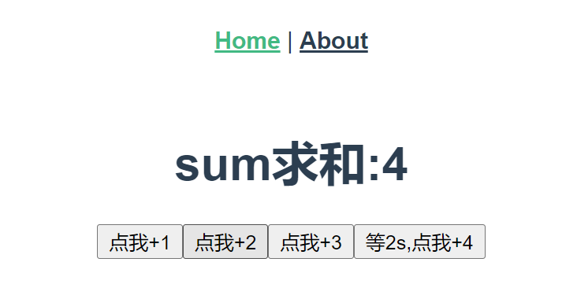
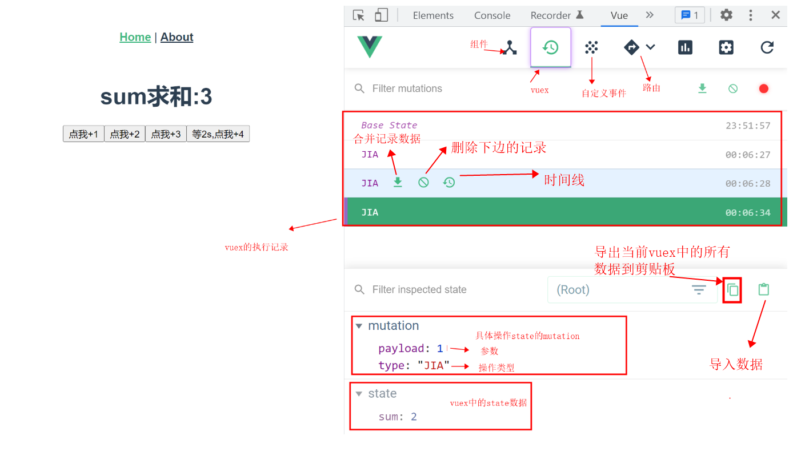
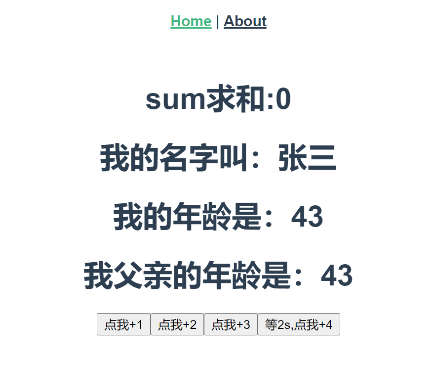

# 第十章：vuex状态(数据)管理

## 一、Vuex 

import eventbus 

Vue.proptotype.enventBus = eventBus

全局事件总线。

组件之间的通信：

​		props属性

​		自定义事件

​		总线传值eventBus

​		插槽传值

​		vuex

### 1.1 什么是vuex

**概念：**Vuex 是一个专为 Vue.js 应用程序开发的**状态管理模式**

。它采用**集中式存储**管理应用的所有组件的状态，并以相应的规则保证状态以一种**可预测**的方式发生变化，可以用于组件之间的通信。

### 1.2 为什么要用vuex(什么时候使用vuex) 

当我们的应用遇到**多个组件共享状态**时，我们会遇到如下问题：

- 多个视图依赖于同一状态
  - 传参的方法对于多层嵌套的组件将会非常繁琐，并且对于兄弟组件间的状态传递无能为力
- 来自不同的视图的行为需要变更同一状态 
  - 我们经常会采用父子组件直接引用或者通过事件来变更和同步状态的多份拷贝。以上的这些模式非常脆弱，通常会导致无法维护的代码。



因此，我们为什么不把组件的共享状态抽取出来，以一个全局单例模式管理，通过定义和隔离状态管理中的各种概念并通过强制规则维持视图和状态间的独立性，我们的代码将会变得更结构化且易维护。



### 1.3 vuex原理分析





我们可以把数据存储在state中 state是一个对象(key===value)，由它来替我们管理公用的一些数据，首先我们在组件中会向actions中发送一个请求 类似函数的发送，调用dispatch('操作type',参数)  actions也是一个对象类型的数据集合，在其中会有一个key值 跟我们发送的dispatch中的操作 对应，其value是一个回调函数  但是这个回调函数并不会直接帮我们去修改state中的数据，而是要再次进行请求,调用commit方法，把请求==》传递到mutations对象中，让mutations中的对应函数来做对state中数据的更新操作。并且在state中数据更新后 自动的把这个数据再次渲染(render)到所有使用这个数据的组件中去。

问题：上述过程中的actions好像没有什么作用，为什么还要有actions呢？

​		因为，我们一般要在actions中进行异步操作,/复杂业务逻辑处理。并且vue官方推荐，如果我们的操作中不存在异步，那么此时可以直接从组件中调用commit到Mutations中直接执行操作。

注意：在vuex中有一个对象叫做store，上边看到的Actions,Mutations,State 这三个对象都要被Store对象所管理。图中体现的dispatch和commit方法都是由Store提供的。

```js
#Vuex 可以帮助我们管理共享状态，并附带了更多的概念和框架。这需要对短期和长期效益进行权衡
#如果您不打算开发大型单页应用，使用 Vuex 可能是繁琐冗余的
#如果您的应用够简单，您最好不要使用 Vuex。
#如果您需要构建一个中大型单页应用，您很可能会考虑如何更好地在组件外部管理状态，Vuex 将会成为自然而然的选择
```

### 1.4 vuex的使用

#### 1.4.1 安装

注意：现在vue3已经是vue的默认版本 直接执行`npm i vuex`安装的vuex是4版本。

vue2 ===> vuex3   vue3====>vuex4

```js
npm :    npm install vuex@3 --save
```

#### 1.4.2 使用

```js
第一步：#src/store/index.js 创建vuex模块文件，开始使用vuex
在一个模块化的打包系统中，您必须显式地通过 `Vue.use()` 来安装 Vuex：
import Vue from 'vue'
import Vuex from 'vuex'
Vue.use(Vuex)

第二步：#实例化Vuex.store ，并进行相关配置
export default new Vuex.Store({
  state: {
      //存储状态
  },
  mutations: {
      //变更store中的状态
  },
  actions: {
      //类似于mutation,
      //action提交的是mutation,而不是直接变更状态
      //action可以包含异步操作
  },
  getters:{
    //state的派生状态  
  },
  modules: {
      //将store分割成模块
  }
})


第三步：#在main.js中，vue实例对象中注册store
import store from './store'
new Vue({
  store,
  render: h => h(App)
}).$mount('#app')
```

每一个 Vuex 应用的核心就是 store（仓库）。“store”基本上就是一个容器，它包含着你的应用中大部分的**状态 (state)**。Vuex 和单纯的全局对象有以下两点不同：

1. Vuex 的状态存储是响应式的。当 Vue 组件从 store 中读取状态的时候，若 store 中的状态发生变化，那么相应的组件也会相应地得到高效更新。
2. 你不能直接改变 store 中的状态。改变 store 中的状态的唯一途径就是显式地**提交 (commit) mutation**。这样使得我们可以方便地跟踪每一个状态的变化，从而让我们能够实现一些工具帮助我们更好地了解我们的应用。

**案例：使用vue完成求和案例** 



最初版不用vuex的代码：见 笔记  src1目录

vuex版本

- **state对象**

```js
#存储共享状态
state:{
    num:100,
    userinfo:{}
}
#通过在根实例中注册 store 选项，该 store 实例会注入到根组件下的所有子组件中，且子组件能通过 this.$store 访问到
#由于 Vuex 的状态存储是响应式的，从 store 实例中读取状态最简单的方法就是在计算属性中返回某个状态
computed:{
	num(){
		return this.$store.state.num;
	}
},
```

- **Actions**

Action 类似于 mutation，不同在于：

- Action 提交的是 mutation，而不是直接变更状态。
- Action 可以包含任意异步操作。

```js
actions: {
    increment (context) {
        context.commit('increment')
    }
}

//Action 函数接受一个与 store 实例具有相同方法和属性的 context 对象，因此你可以调用 context.commit 提交一个 mutation，或者通过 context.state 和 context.getters 来获取 state 和 getters。

//Action 通过 store.dispatch 方法触发：
store.dispatch('increment')

//Actions 支持同样的载荷方式和对象方式进行分发：

// 以载荷形式分发
store.dispatch('incrementAsync', {
  amount: 10
})

// 以对象形式分发
store.dispatch({
  type: 'incrementAsync',
  amount: 10
})
```

- **Mutations**

```js
#你不能直接改变 store 中的状态。改变 store 中的状态的唯一途径就是显式地提交 (commit) mutations。这样使得我们可以方便地跟踪每一个状态的变化，从而让我们能够实现一些工具（devToolS）帮助我们更好地了解我们的应用

#Vuex 中的 mutation 非常类似于事件：每个 mutation 都有一个字符串的 事件类型 (type) 和 一个 回调函数 (handler)。这个回调函数就是我们实际进行状态更改的地方，并且它会接受 state 作为第一个参数：
mutations: {
    increment (state,payload) {
      // 变更状态
      //state.num++
        state.num+=payload
    }
  }

#怎么提交mutations
commit 接收俩个参数(事件名，额外的参数)  用在组件中修改store中状态时使用

//store.commit('increment')
methods:{
    add(){
        this.$store.commit('increment',45);
    }
},
#一条重要的原则就是要记住 mutation 必须是同步函数，每一条 mutation 被记录，devtools 都需要捕捉到前一状态和后一状态的快照，但是异步中的状态的改变都是不可追踪的
```

**案例：使用vuex完成求和案例** 

home.vue组件中：

```vue
<template>
	<div class="home">
		<h1>sum求和:{{$store.state.sum}}</h1>
		<button type="button" @click="addOne">点我+1</button>
		<button type="button" @click="addTwo">点我+2</button>
		<button type="button" @click="addThree">点我+3</button>
		<button type="button" @click="addFour">等2s,点我+4</button>
	</div>
</template>
<script>
	export default {
		name: 'Home',
		data() {return {sum: 0}},
		methods: {
			addOne() {
				//console.log(this.$store.state.sum)
				this.$store.dispatch('jia',1)
			},
			addTwo() {
				this.$store.dispatch('jia2',2)
			},
			addThree() {
				this.sum += 3
			},
			addFour() {
				setTimeout(()=>{
					this.sum += 4
				},2000 )
			}
		}
	}
</script>
```

store目录下的index.js:

```js
//1.导入vue 和vuex
import Vue from 'vue'
import Vuex from 'vuex'
Vue.use(Vuex)
//2.实例化vuex 并进行相关的配置
export default new Vuex.Store({
	//进行状态管理，公用的数据放在这里
	state:{
		sum:0,
		name:'张三',
		age:18
	},
	//用于响应组件中的动作
	//mutations变更state之前的操作，类似于mutations但是 这里不进行state变更操作，主要这里执行异步代码
	actions:{
		//此处函数对应组件中调用的 $store.dispatch('jia',1)方法
		//context 就是一个类似于Store对象的参数，但是其中的内容比Store对象少  payload就是 1
		/*addOne(context,payload) {
			//console.log(context,payload)
			//此处需要调用store的commit()方法 通知 mutations执行操作 会自动调用mutations中对应JIA的函数
			context.commit('ADDONE',payload)
		},
		addTwo(context,payload){
			context.commit('ADDTWO',payload)
		},*/
        注意：以上的addOne和addTwo方法因为其中没有什么业务逻辑，所以可以直接通过组件与mutations连接，不需要再经过actions了。
        
		addThree(context,payload){
			context.commit('ADDTHREE',payload)
		},
		addFour(context,payload){
			setTimeout(function() {
				context.commit('ADDFOUR',payload)
			}, 2000)
		}
	},
	//具体执行操作state中数据的方法都在这里
	mutations:{
		//此处接收两个参数 state 数据对象  payload就是参数 1
		addOne(state,payload){
			state.sum+=payload
		},
		addTwo(state,payload){
			state.sum+=payload
		},
		ADDTHREE(state,payload){
			state.sum+=payload
		},
		ADDFOUR(state,payload){
			state.sum+=payload
		},
	},
	//可以对state中的数据进行额外的处理操作 类似于 computed 计算属性
	getters:{
		//定义张三父亲的年龄 比张三大30岁
		fatherAge(state){
			return state.age+=30
		}
	},
	//模块化
	modules:{}
})
```

**问题：**测试发现，我们就算不用经过以上 mutations--actions--state等流程也可以直接去操作Store中的state，那为什么还要经过这么多流程呢？

首先要知道vuex是单向数据流，如果在组件中可以直接修改state数据就违背了vuex这个仓库了。

还有就是，如果组件内可以修改state数据，那么如果是异步修改怎么办？所以有很多无法预测的问题，

vuex 不但是一种全局修改数据的工具，更重要的意义是在于把跨组件的交互，拆分为基于状态管理的处理。

使用如 vuex 本身就是希望基于这样一个数据结构的约定，使得项目代码更加直观和简单。每一个 state
树对应整个项目的一个数据，每一个 mutation 执行完成后都可以更新到一个新的状态。这样 devtools 就可以打个 snapshot 存下来。可以尝试开着 devtool 调用一个异步的 action，可以清楚地看到它所调用的 mutation 是何时被记录下来的，并且可以立刻查看 mutation 对应的状态。

所以，通过commit 提交 mutation 的方式来修改 state 时，vue的调试工具能够记录每一次 state 的变化，这样方便调试。但是如果是直接修改state，则没有这个记录，那样做会使状态不受我们管控。如果是多个模块需要引用一个state的，然后每个人可能由不同的人开发，如果直接修改值，可能会造成数据的混乱，Mutation 也记录不到，到时候调试会有麻烦。但是通过 mutation 修改 state 这样设计，就有个统一的地方进行逻辑运算去修改。如果逻辑有变动，修改一个地方就可以了。

#### vuetools如何调试vuex




**注意：**如果在Actions中操作state数据也可以生效，但是会造成开发者工具失效，无法侦听vuex的变化。

### 1.5 **Getters**  

有时候我们需要从 store 中的 state 中派生出一些状态/数据，例如对列表进行过滤并计数.

Vuex 允许我们在 store 中定义“getter”（可以认为是 store 的计算属性）。就像计算属性一样，getter 的返回值会根据它的依赖被缓存起来，且只有当它的依赖值发生了改变才会被重新计算。

```js
#接受state作为第一个参数，对state中的数据进行过滤，二次处理
getters:{
    //过滤年龄小于30
     filter_age(state){
        return state.student.filter(item => item.age<30);
     }
}
#Getters 会暴露为 store.getters 对象，你可以以属性的形式访问这些值
组件中读取数据：this.$store.getters.filter_age
```

### 1.6 vuex中的mapState、mapGetters、mapActions、mapMutations对象

需求：假如我们要在页面中显示如下图内容：



第一步：在store目录下的index.js的state中添加属性 name,age

```js
state:{
		sum:0,
		name:'张三',
		age:18
	},
```

第二步：通过getters计算出张三父亲的年龄：

```
getters:{
		//定义张三父亲的年龄 比张三大30岁
		fatherAge(state){
			return state.age+25
		}
	},
```

第三步：把数据展示在Home.vue组件上

```js
<template>
	<div class="home">
		<h1>sum求和:{{$store.state.sum}}</h1>
		<h1>我的名字叫：{{$store.state.name}}</h1>
		<h1>我的年龄是：{{$store.state.age}}</h1>
		<h1>我父亲的年龄是：{{$store.getters.fatherAge}}</h1>
		<button type="button" @click="addOne">点我+1</button>
		<button type="button" @click="addTwo">点我+2</button>
		<button type="button" @click="addThree">点我+3</button>
		<button type="button" @click="addFour">等2s,点我+4</button>
	</div>
</template>
```

**问题：**效果完成，但是观察发现，我们每次取数据的代码中包含有很多的重复代码，思考: 能否简化？

简化代码：在home组件中修改代码如下：把从$store中提取数据的方式都改成**计算属性**的形式，会方便很多。

```js
<template>
	<div class="home">
		<h1>sum求和:{{sum}}</h1>
		<h1>我的名字叫：{{name}}</h1>
		<h1>我的年龄是：{{$store.state.age}}</h1>
		<h1>我父亲的年龄是：{{fAge}}</h1>
		<button type="button" @click="addOne">点我+1</button>
		<button type="button" @click="addTwo">点我+2</button>
		<button type="button" @click="addThree">点我+3</button>
		<button type="button" @click="addFour">等2s,点我+4</button>
	</div>
</template>

<script>
	export default {
		name: 'Home',
		computed:{
			sum(){
				return this.$store.state.sum
			},
			name(){
				return this.$store.state.name
			},
			fAge(){
				return this.$store.getters.fatherAge
			}
		}
	}
</script>
```

**问题：**此时观察发现 计算属性中仍然是 重复代码，怎么解决？ 借助 内置提供的 mapState  mapGetters属性

**第一步：**在组件中导入vuex中提供的 `mapState,mapGetters,mapMutations,mapActions` 对象

```js
import {mapState,mapGetters,mapMutations,mapActions} from 'vuex'
```

**第二步：**修改computed计算属性中的代码

- 对象式 

​		使用`...mapState({sum:'sum',name:'name',age:'age'})` 简写形式把 计算属性给替换掉。

​		mapState对象式：{sum:'sum'} key值的sum是我们要在组件中使用的变量名，value的'sum'是跟state中的属性sum对应

​		使用`...mapGetters({fAge:'fatherAge'})` 简写形式把 计算属性给替换掉。

- 数组式 

​		使用`...mapState(['sum','name','age'])` 简写形式把 计算属性给替换掉。

​		使用`...mapGetters(['fatherAge'])` 简写形式把 计算属性给替换掉。

```js
computed:{
			/* sum(){
				return this.$store.state.sum
			},
			name(){
				return this.$store.state.name
			}, 
			age(){
				return this.$store.state.age
			}
			*/
    	State数据获取的简写形式
			//对象形式
			...mapState({sum:'sum',name:'name',age:'age'}),
			//数组形式
			...mapState(['sum','name','age']),
                
         Getters数据获取的简写形式   
			/*fAge(){
				return this.$store.getters.fatherAge
			}*/
    		//对象式
            ...mapGetters({fAge:'fatherAge'}),
            //数组式
            ...mapGetters(['fatherAge'])
		},
```

使用`mapMutations和mapActions` 对象来完成 简写 与 Store目录下index.js中 mutations和actions中方法的连接：

**注意：** 方法简写时 需要把参数在函数调用时进行传递。

home组件中原本methods中函数的写法：

```js
methods: {
			addOne() {
				this.$store.dispatch('addOne',1)
			},
			addTwo() {
				this.$store.dispatch('addTwo',2)
			},
			addThree() {
				this.$store.dispatch('addThree',3)
			},
			addFour() {
				this.$store.dispatch('addFour',4)
			}
		},
```

替换成：

```
//对应actions中的方法
...mapActions({addThree:'addThree',addFour:'addFour'}),
对象中的key值 是我们要在组件中调用的函数名，value值是我们要跟store中actions对应的函数的类型值。

//对应mutations中的方法
...mapMutations({addOne:'addOne',addTwo:'addTwo'})
```

**最终代码：**

home.vue组件中：

```vue
<template>
	<div class="home">
		<h1>sum求和:{{sum}}</h1>
		<h1>我的名字叫：{{name}}</h1>
		<h1>我的年龄是：{{$store.state.age}}</h1>
		<h1>我父亲的年龄是：{{fatherAge}}</h1>
		<button type="button" @click="addOne(1)">点我+1</button>
		<button type="button" @click="addTwo(2)">点我+2</button>
		<button type="button" @click="addThree(3)">点我+3</button>
		<button type="button" @click="addFour(4)">等2s,点我+4</button>

	</div>
</template>
<script>
	import {mapState,mapGetters,mapActions,mapMutations} from 'vuex'
	export default {
		name: 'Home',
		computed:{
		   //对象形式
			//...mapState({sum:'sum',name:'name',age:'age'}),
			//数组形式
			...mapState(['sum','name','age']),
			/* ...mapGetters({fAge:'fatherAge'}) */
			...mapGetters(['fatherAge'])
		},
		methods: {
			...mapMutations({addOne:'addOne',addTwo:'addTwo'}),
			...mapActions({addThree:'addThree',addFour:'addFour'}),
		}
	}
</script>
注意：当使用mapMutations和mapActions时 会发现没有办法传递参数，注意此时的参数传递无法再向之前一样传递了，而是需要在调用方法时传递  <button @click='addNum(1)'>点我</button> 此时函数的传递在调用时传递 mapActions和mapMutations会自动的去帮助我们做映射，也是可以把参数传递到store中的actions和mutations中对应的方法中。
```

store目录下的index.js中

```js
//1.导入vue 和vuex
import Vue from 'vue'
import Vuex from 'vuex'
Vue.use(Vuex)
//2.实例化vuex 并进行相关的配置
export default new Vuex.Store({
	//进行状态管理，公用的数据放在这里
	state:{
		sum:0,
		name:'张三',
		age:18
	},
	//用于响应组件中的动作
	//mutations变更state之前的操作，类似于mutations但是 这里不进行state变更操作，主要这里执行异步代码
	actions:{
		//此处函数对应组件中调用的 $store.dispatch('jia',1)方法
		//context 就是一个类似于Store对象的参数，但是其中的内容比Store对象少  payload就是 1
		/* addOne(context,payload) {
			//console.log(context,payload)
			//此处需要调用store的commit()方法 通知 mutations执行操作 会自动调用mutations中对应JIA的函数
			context.commit('ADDONE',payload)
		}, */
		/* addTwo(context,payload){
			context.commit('ADDTWO',payload)
		}, */
		addThree(context,payload){
			context.commit('ADDTHREE',payload)
		},
		addFour(context,payload){
			setTimeout(function() {
				context.commit('ADDFOUR',payload)
			}, 2000)
		}
	},
	//具体执行操作state中数据的方法都在这里
	mutations:{
		//此处接收两个参数 state 数据对象  payload就是参数 1
		addOne(state,payload){
			state.sum+=payload
		},
		addTwo(state,payload){
			state.sum+=payload
		},
		ADDTHREE(state,payload){
			state.sum+=payload
		},
		ADDFOUR(state,payload){
			state.sum+=payload
		},
	},
	//迷你版State其中包含我们需要的一些信息
	getters:{
		//定义张三父亲的年龄 比张三大30岁
		fatherAge(state){
			return state.age+=25
		}
	},
	//模块化
	modules:{}
})
```

### 1.7 多组件共享数据 

### 1.8 Module 

由于使用单一状态树，应用的所有状态会集中到一个比较大的对象。当应用变得非常复杂时，store 对象就有可能变得相当臃肿。

为了解决以上问题，Vuex 允许我们将 store 分割成**模块（module）**。每个模块拥有自己的 state、mutation、action、getter、甚至是嵌套子模块——从上至下进行同样方式的分割：

```js
#moduleA.js
const moduleA = {
  namespaced:true,
  state:{ xx },
  mutations: { ... },
  actions: { ... },
  getters: { ... }
}
export default moduleA;
            
#modulesB.js
const moduleB = {
  //开启命名空间
  namespaced:true,
  state: () => ({ ... }),
  mutations: { ... },
  actions: { ... }
}
export default moduleB;

#index.js
import moduleA from './moduleA.js'
import moduleB from './moduleB.js'
const store = new Vuex.Store({
  modules: {
    a: moduleA,
    b: moduleB
  }
})
//使用：this.$store.state.a.xx
页面中使用时：<h2>{{ $store.state.b.n }}</h2>
vm实例中使用时：带上所属的模块
methods: {
    ...mapActions("b", ["add"]),
    ...mapActions("b", { add: "add" }),
  },
     
//this.$store.dispatch('a/addFour', 4)
      
注意：模块化的方式使用store 
	1.定义模块是 需要带上命名空间的开启
    2.使用时 需要带上指定的模块
```

## 二、总结与作业

掌握vuex的基本使用。