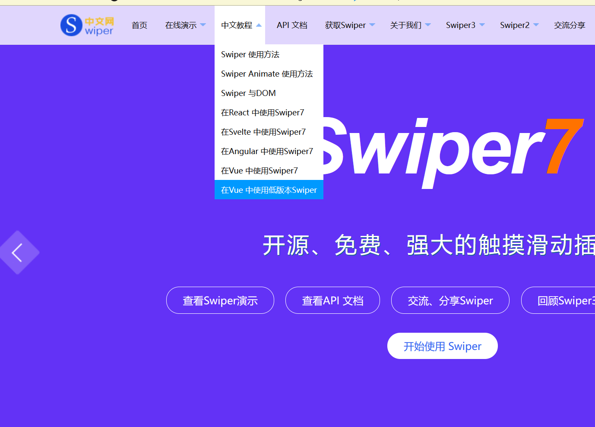
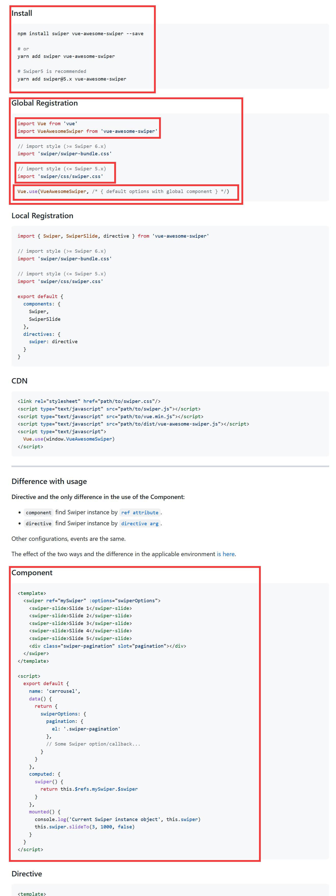
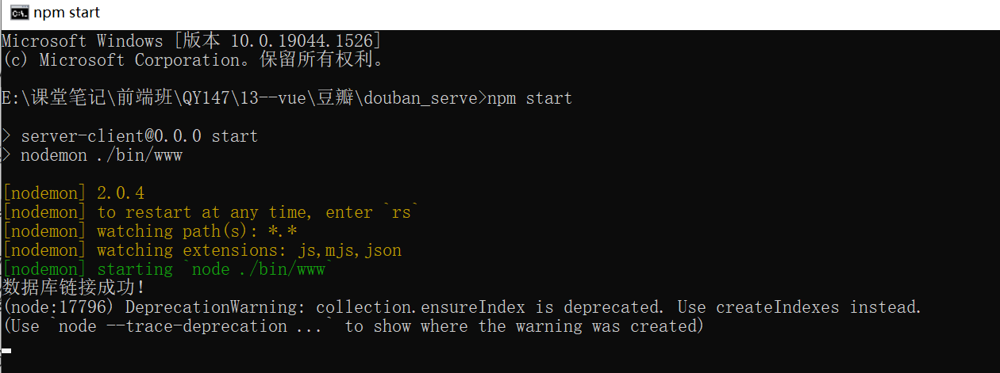
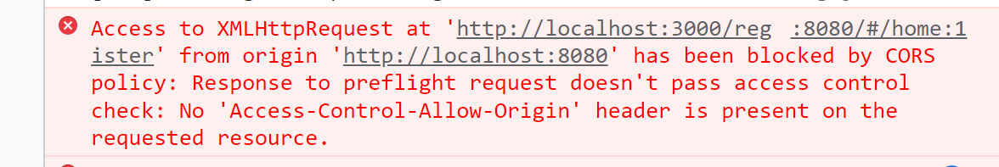

# 豆瓣案例

### 第一步：分析项目案例的页面结构

### 第二步：搭建vue cli项目

### 第三步：搭建底部工具栏

- 引入vant组件库
- 参考官网找到tabbar组件 引入使用 

### 第四步：给底部工具栏配置路由以及定义相关的组件

### 第五步：移动端页面适配

- 在main.js中 导入util.js 用来适配页面中的rem单位

  ```js
  export default{
      setRem() {
          // 设计稿宽度和设备宽度
          var uiW = 375,
              winW = document.documentElement.clientWidth,
              // 定义比例
              rate = winW / uiW;
          var oWrap = document.getElementById("app");
          if(winW > uiW) {
              oWrap.style.width = uiW + "px";
              oWrap.style.margin = "0 auto";
              return;
          }
          document.documentElement.style.fontSize = rate * 100 + "px";
          
      },
      // 另外一些公共方法 
  }
  ```
  
- 在main.js中导入common.css用来清除标签的默认样式 

  ```js
  import Vue from 'vue'
  import App from './App.vue'
  import router from './router'
  //导入vant组件库
  import Vant from 'vant';
  import 'vant/lib/index.css';
  Vue.use(Vant);
  //导入utils工具包
  import utils from './assets/utils/utils.js'
  
  //导入初始化页面的css文件
  import './assets/css/common.css'
  
  Vue.config.productionTip = false
  new Vue({
  	mounted() {
  		//页面初始化后执行
  		utils.setRem()
  		//页面发生变化时执行
  		window.onresize = utils.setRem()
  	},
  	router,
  	render: h => h(App)
  }).$mount('#app')
  ```

### 第六步：搭建 **首页** 的顶部导航栏 

由于vant组件库中没有相关的组件，所以需要自定义头部组件

```js
自定义插槽
<template>
	<div id="head-navbar">
		<!-- 此处放置左侧图标 -->
		<div>
			<slot name='left-i'></slot>
		</div>
		<!-- 此处放置标题 或者其余内容 -->
		<div>
			{{title}}
		</div>
		<!-- 此处插槽 用来放置图标 -->
		<div id="">
			<slot name="right-i"></slot>
		</div>
	</div>
</template>

<script>
	export default {
		props:{
			title:{
				type:String
			}
		}
	}
</script>

<style lang="less" scoped>
</style>
```

自定义Head.vue组件：

```vue
<template>
  <div id="top">
    <div></div>
    <div>{{ title }}</div>
    <div>
      <slot name="icon"></slot>
    </div>
  </div>
</template>

<script>
export default {
  props: ["title"],
};
</script>

<style lang='less' scoped>
#top {
  position: fixed;
  top: 0;
  left: 0;
  background-color: skyblue;
  height: 0.5rem;
  width: 100%;
  font-size: 0.16rem;
  display: flex;
  justify-content: center;
  align-items: center;
  > div {
    background-color: pink;
    flex: 1;
    text-align: center;
    height: 0.5rem;
    line-height: 0.5rem;
  }
  img {
    position: absolute;
    top: 50%;
    transform: translateY(-50%);
    width: 0.26rem;
  }
  .icon_r {
    right: 0.15rem;
  }
  .icon_l {
    right: 0.5rem;
  }
}
</style>
-- 分组组件
<template>
  <div>
    <Head title="小组">
      <template #icon_r>
        
        
      </template>
    </Head>
  </div>
</template>

<script>
import Head from "@/components/Head";
export default {
  components: {
    Head,
  },
};
</script>

<style>
</style>

```

在每一个组件中都导入这个head.vue组件使用。

### 第七步：首页home.vue组件定义轮播图

1. 使用vant组件自带的 Swipe 轮播

2. 

3. 使用swipper插件完成轮播  https://www.swiper.com.cn/

   

   

   自定义轮播图组件：Carousel.vue 

   ```vue
   //封装轮播图组件
   <template>
   	<swiper ref="mySwiper" :options="swiperOptions">
   		<slot name="item-car"></slot>
   		<div class="swiper-pagination" slot="pagination"></div>
   	</swiper>
   </template>
   
   <script>
   	export default {
   		data() {
   			return {
   				swiperOptions: {
   					pagination: {
   						el: '.swiper-pagination'
   					},
   					//开启自动轮播
                       autoplay: {
                         disableOnInteraction: false,
                         delay: 1000,//1秒切换一次
                       },
           effect: "cube",
           loop: true,
   				}
   			}
   		},
   		computed: {
   			swiper() {
   				return this.$refs.mySwiper.$swiper
   			}
   	},
   		mounted() {
   		console.log('Current Swiper instance object', this.swiper)
   			this.swiper.slideTo(0, 1000, true)
   		}
   	}
   </script>
   ```

   home.vue组件调用：

   ```vue
   <Carousel>
   	<template #item-car>
   		<swiper-slide></swiper-slide>
   		<swiper-slide></swiper-slide>
   		<swiper-slide></swiper-slide>
   	</template>
   </Carousel>
   ```

4. swiper的使用方式

   ```vue
   1.安装swiper
   
   2.定义轮播图组件
   <template>
     <!--基础存放容器-->
     <div class="swiper-container">
       <!-- 需要进行轮播的部分 -->
       <div class="swiper-wrapper">
         <!-- 每个节点 -->
         <div class="swiper-slide">
           
         </div>
         <div class="swiper-slide">
           
         </div>
         <div class="swiper-slide">
           
         </div>
       </div>
   
       <!--如果需要使用分页器-->
       <div class="swiper-pagination swiper-pagination-white"></div>
   
       <!-- 如果需要使用前进后退按钮 -->
       <div class="swiper-button-prev swiper-button-white"></div>
       <div class="swiper-button-next swiper-button-white"></div>
     </div>
   </template>
   
   <script>
   import swiper from "swiper";
   export default {
     mounted() {
       this.initSwiper();
     },
     methods: {
       initSwiper() {
         new Swiper(".swiper-container", {
           //设置轮播的循环方式
           loop: true,
   
           //设置自动播放间隔时间
           autoplay: 2000,
   
           // 轮播效果,默认为平滑轮播
           effect: "slide",
   
           //分页器
           pagination: ".swiper-pagination",
   
           //前进后退按钮
           prevButton: ".swiper-button-prev",
           nextButton: ".swiper-button-next",
   
           // 用户中断轮播后续播
           autoplayDisableOnInteraction: false,
         });
       },
     },
   };
   </script>
   
   <style lang='less' scoped>
   @import url("../../node_modules/swiper/dist/css/swiper.css");
   .swiper-container {
     width: 100%;
     height: 1.5rem;
   }
   
   .swiper-slide img {
     width: 100%;
     object-fit: cover;
   }
   </style>
   ```


### 第八步：home.vue请求后端数据       

1. 启动服务器 

   - 安装mongodb数据库服务：https://www.jb51.net/article/164138.htm  参考教程，下载安装

   - cmd  进入 douban_server文件夹  输入命令 `npm start` 

   

   如图所示 数据库连接成功。

2. 在home.vue组件中向服务器发送请求  

   **先执行注册和登录请求** 

   ```js
   mounted() {
   			//请求数据
   			axios.post('http://localhost:3000/register',{
   				username:'admin',
   				password:'123456'
   			}).then(res=>{
   				console.log(res)
   			})
   		}
   ```

   此时报错：跨域问题：

   

   **解决放案：**

   在项目目录下新建文件 vue.config.js:

   ```js
   module.exports = {
   	devServer:{
   		proxy:{
   			'/api':{
   				target:'http://localhost:3000',
   				pathRewrite:{
   					'^/api':''
   				}
   			}
   		}
   	}
   }
   ```

   以后再请求路径 就请求：/api/资源路径  此时api就映射到 http://localhost:3000

   ```js
   mounted() {
   			//请求数据
   			axios.post('/api/register',{
   				username:'admin',
   				password:'123456'
   			}).then(res=>{
   				console.log(res)
   			})
   		}
   ```

   此时就可以接收到数据了。

3. 实际开发中关于axios请求的封装

- 把axios挂载到Vue的原型对象上

```js
import axios from 'axios'
axios.defaults.baseURL = '根路径'
Vue.prototype.$http = axios
```

存在问题：这样不利于复用，整体只有一个根路径，如果项目中还想访问另外的服务器，还是需要重新写

- 自己封装 http-axios.js

  ```js
  import axios from "axios"
  export default function (config){
  		const instance = axios.create({
  		  baseURL: '/api'
  		});
  		return instance(config);
  }
  ```

  可以达到一个可复用的效果

4. 使用axios拦截器 对请求进行token信息认证

   对项目来说我们每一次的请求都需要向后台发送token认证信息，但是登录和注册不需要token认证，所以我们需要通过axios拦截器来进行设置

   ```js
   import axios from "axios"
   export default function (config){
   		const instance = axios.create({
   		  baseURL: '/api'
   		});
   		instance.interceptors.request.use(function (config) {
   		    // 在发送请求之前做些什么
   			//console.log(config)
   			//此时不需要进行token验证
   			if(config.url == '/login' || config.url == '/register'){
   				return config;
   			}else{
   				//否则 需要在请求头中设置token信息
   				config.headers['token'] = sessionStorage.getItem('token')
   				return config;
   			}
   		    
   		  }, function (error) {
   		    // 对请求错误做些什么
   		    return Promise.reject(error);
   		  });
   		  
   		return instance(config);
   }
   ```

5. 请求home主页数据 

   ```
   //1.请求首页数据，调用封装好的http-axios.js
   			http({
   				method:'get',
   				url:'/home'
   			}).then(res=>{
   				let {data:result} = res
   				console.log(result)
   				//把拿到的结果赋值给data中的list
   				this.list = result
   			})
   //2.创建组件渲染数据到页面上
   ```

   

### 第九步：书影音二级路由导航