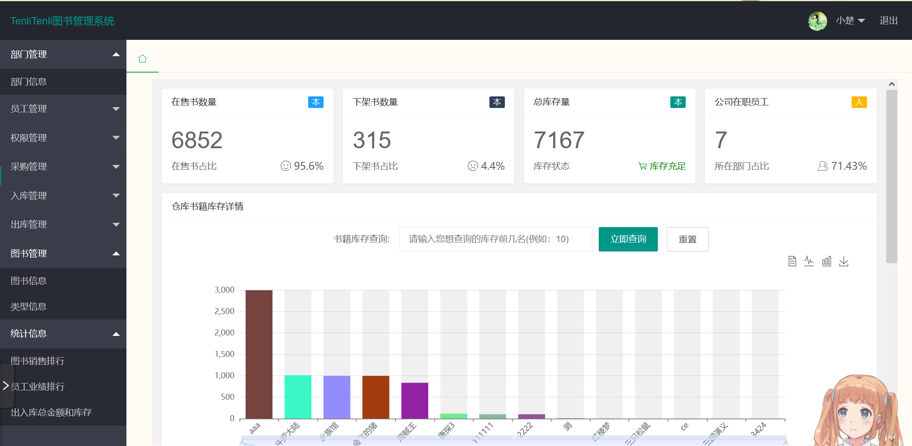
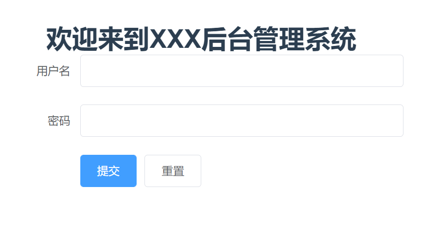
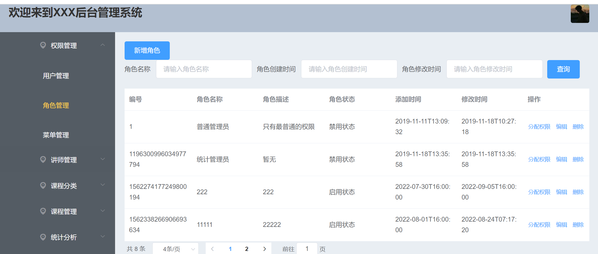
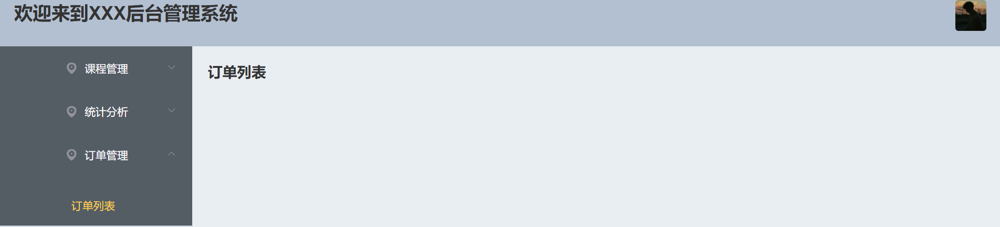

# 第十四章：Element-ui组件库

## 一、常用的UI组件库

### 1.1 移动端常用UI组件库

- **Vant组件库**	
- **Mint组件库** 
- **Cube组件库**  

### 1.2 PC端常用UI组件库

- **Element UI组件库**  饿了么

  搭建后台管理系统

  

- **IView UI组件库**


# 后台管理系统项目：完成菜单权限控制和按钮权限控制

用户--》角色--》权限

## 1.1 登录功能 

一般来说后台管理系统无需注册，可以直接由管理员给员工分配账号就可以了，所以之后的一切功能都需要从登录开始。

- 首先我们需要一个登录组件 Login.vue

  

- 输入用户名和密码，点击提交按钮

  点击提交按钮 应该向后台服务器发出一个请求，看登录是否成功，登录成功后需要跳转页面到首页，但是同时也需要做出一些别的事情，**例如：【存储后台返回的token令牌，当前用户所拥有的权限菜单，当前用户拥有的按钮权限，当前登录的用户信息】**等数据到**vuex/sessionStorage/localStorage**。

  

## 1.2 权限功能的控制 

### 1.2.1 简介 

所谓权限控制，在生活中，也就是说一个人到底有没有权限去做一些事情；例如皇宫中，只有手持皇帝令牌的才可以随意进出皇宫，但是普通人是无法进出皇宫的，并且根据令牌的级别不同，进入皇宫后能去的地方也是不一样的。

那变成中的权限控制指的是什么呢？一般指的是在后台管理系统中，不同的用户登录后所能看到的一些信息是不一样的，在后台管理系统中我们如果想做什么操作，那么都需要通过左侧菜单的显示，才可以去做相对应的操作，怎么控制权限呢，也就是通过控制不同用户登录之后所能看到的菜单项来进行权限的控制。按钮权限控制也是一样的道理，不同的人去访问同一个页面 所能看到的页面中的按钮是不一样的，只有具有操作权限的人才可以看到相对应的按钮。

不同的用户进入到首页应该看到的是不同的菜单项的展示。如下图：

**超级管理员登录**



**普通员工登录**



### 1.2.2 实现思路

分析：如果想实现权限的控制，只靠我们前台肯定是不可以的，需要前后端的协作配合才可以，并且大家还需要知道，前端的权限控制 只能控制页面的访问，实际上是不能达成安全的控制的，也就是说最终的安全保障 还是需要后端。并且前端能够实现的权限控制，也需要后台发送的数据来配合完成。

**整体流程：**

1. 登录成功后存储token到vuex。
2. 还需要向服务器查询当前登录人所拥有的菜单权限，并把菜单权限存入vuex。
3. 遍历所拥有的菜单权限并渲染到首页的左侧菜单栏中。
4. 根据菜单权限动态计算出所拥有的路由规则，并把路由规则存入router路由器中。
5. 向服务器查询当前登录人所拥有的按钮权限，并把按钮权限存入vuex。
6. 页面中使用按钮时，根据vuex中所存储的按钮权限，来判断是否能够显示按钮。

### 1.2.3 具体编码实现

Login.vue中实现：

```js
登录按钮触发的事件： 
submitForm(formName) {
            this.$refs[formName].validate((valid) => {
                //如果验证成功
                if (valid) {
                    this.$http.post('/system/login', this.ruleForm).then(res => {
                        //console.log(res.data);
                        let { code, data: { token, resource }, msg } = res.data
                        //console.log(token);
                        console.log(resource, '按钮权限');
                        if (code == 2000) {
                            //this.$message(msg)
                            //向本地存储中存入token令牌
                            //sessionStorage.setItem('token', token)
                            //向vuex中存入数据token
                            this.$store.dispatch('set_token', token)
                            //向vuex存储所拥有的按钮级别的权限
                            this.$store.dispatch('set_buttonPermission', resource)

                            setTimeout(() => {
                                //页面跳转到首页
                                this.$router.replace("/home")
                            }, 1000)

                            //向后台发送请求查询当前用户角色对应的权限
                            this.$store.dispatch('getPermission')
                        } else {
                            this.$error(msg)
                        }

                    })
                } else {
                    console.log('error submit!!');
                    return false;
                }
            });
```

router路由中的：

```js
import Vue from 'vue'
import VueRouter from 'vue-router'
import Home from '../views/Home.vue'
Vue.use(VueRouter)
//定义默认路由
export const defaultRoutes = [
  { path: '/', redirect: 'login' },
  {
    path: '/login',
    component: () => import('@/views/Login.vue')
  },
  {
    path: '/home',
    name: 'Home',
    component: Home,
    /* children: [
      {
        path: 'role',
        component: () => import('@/views/Role.vue')
      }
    ] */
  }
]

//定义其余路由
export const anyRoutes = [
  {
    path: '*',
    component: () => import('@/views/404.vue')
  }
]

const router = new VueRouter({
  routes: defaultRoutes
})

router.beforeEach(async (to, from, next) => {
  next()
})

export default router

```

Store中的具体操作：

```js
import http from '@/utils/http.js'
import Vuex from 'vuex'
import Vue from 'vue'
Vue.use(Vuex)
import handlerRoute from '../utils/handlerRoute'
//导入router中定义好的默认路由和其它路由
import { defaultRoutes, anyRoutes } from '@/router'
import router from '@/router'
export default new Vuex.Store({
    state: {
        //存储状态
        token: '',
        //存储当前用户的所有权限菜单
        permissionMenu: [],
        //存储转换后的所有异步路由
        asyncRoute: [],
        //存储最终定义好的所有路由
        allRoutes: [],
        //存储所有拥有的按钮权限
        allButtonPermission: []
    },
    actions: {
        //类似于mutation,
        //action提交的是mutation,而不是直接变更状态
        //action可以包含异步操作
        //设置token
        set_token(context, payload) {
            context.commit("SET_TOKEN", payload)
        },
        //把当前用户所拥有的按钮权限存入vuex
        set_buttonPermission(context, payload) {
            context.commit("SET_BUTTON", payload)
        },
        //设置存储路由的方法
        async getPermission(context) {
            //向后台发送请求查询权限
            let { data } = await http.get('/system/permission/leftMenu')
            //把data中有关权限的菜单存入vuex
            //console.log(data);
            context.commit('SET_MENU', data.data)

            //处理路由数据并存入vuex中
            //console.log(handlerRoute(data.data));
            context.commit('ASYNCROUTRS', handlerRoute(data.data, []))
        }
    },
    mutations: {
        //变更store中的token
        SET_TOKEN(state, payload) {
            state.token = payload
        },
        //变更store中的权限菜单
        SET_MENU(state, payload) {
            state.permissionMenu = payload
        },
        //存储计算好的异步路由
        ASYNCROUTRS(state, payload) {
            //存储计算好的异步路由
            state.asyncRoute = payload
            //计算出最终路由
            console.log(defaultRoutes);
            defaultRoutes.forEach(item => {
                if (item.path == '/home') {
                    item.children = state.asyncRoute
                    return;
                }
            });
            state.allRoutes = defaultRoutes.concat(anyRoutes)
            //把最终计算好的路由添加到路由器中
            //router.options.routes.push(state.allRoutes);
            router.addRoutes(state.allRoutes)
        },
        //存储所有拥有的按钮权限
        SET_BUTTON(state, payload) {
            state.allButtonPermission = payload
        }
    },
    getters: {
        //state的派生状态  
    },
    modules: {
        //将store分割成模块
    }
})
```

handlerRoute.js 工具转换代码操作：

```js
//此方法是把从后端请求到的菜单数据转换成路由规则的格式，不是通用方法。 

//定义封装异步路由的函数
function parseRouter(menus, arr) {
    //console.log(arr);
    menus.forEach(item => {
        //代表有子菜单
        if (item.children && item.children.length > 0) {
            parseRouter(item.children, arr)
        } else {
            let obj = {}
            obj.path = item.path;
            //obj.component = () => import(`${item.component}`);
            obj.component = (resolve) => require(['@/views/' + item.component], resolve);
            obj.meta = item.name;
            obj.children = []
            arr.push(obj)
        }
    })
    return arr
}
export default parseRouter
```

**注意事项：**当动态路由生效之后，页面是无法刷新的，因为只要刷新页面就会清空vuex，也就是说vuex中存储的那些数据都会被清除掉，路由数据也会，所以会造成页面的空白。

```js
解决：在App.vue中的created钩子函数中添加如下代码
created() {
    //在页面刷新时将vuex里的state信息保存到sessionStorage里
    window.addEventListener("beforeunload", () => {
      console.log("页面将要刷新了");
      sessionStorage.setItem("state", JSON.stringify(this.$store.state))
    })
	//刷新页面时 App.vue需要被重新加载 此时判断sessionStorage中是否存在state,如果存在就把数据重新读取，并再次存入vuex中
    if (sessionStorage.getItem("state")) {
      //把sessionStorage中的数据再次存入vuex  
      this.$store.replaceState(Object.assign(this.$store.state, JSON.parse(sessionStorage.getItem("state"))));
        
      //再次调用getPermission方法 重新生成动态路由。
      this.$store.dispatch('getPermission')
    }
},
```

此时以上的方式可以实现路由的跳转，但是 如果是多级的嵌套路由就不好实现了，会很麻烦。

### 1.2.4 实现方式二：(动态路由生成)通用方式

分析：在本地定义好一个文件 routes.js 在其中配置好我们整个项目中需要的所有的路由规则。然后根据后台服务器返回的当前用户具有的权限信息，拿用户具有的权限信息 与 本地配置好的路由规则做对比，从routes.js定义的路由规则中过滤出我们需要的路由规则，并且把这个规则加入到router路由器对象中，完成动态路由的匹配。

**第一步：自己根据自己项目的组成部分在router.js中定义一个包含所有内容的路由规则：**

```js
//定义异步路由
export const asyncRoutes = [
  {
    path: 'user',
    name: 'User',
    meta: { title: '用户管理' },
    component: () => import('@/views/User')
  },
  {
    path: 'role',
    name: 'Role',
    meta: { title: '角色管理' },
    component: () => import('@/views/Role')
  },
  {
    path: 'menu',
    name: 'Menu',
    meta: { title: '菜单管理' },
    component: () => import('@/views/Menu')
  },
  {
    path: 'addTeacher',
    name: 'AddTeacher',
    meta: { title: '添加讲师' },
    component: () => import('@/views/AddTeacher')
  },
  {
    path: 'teacherList',
    name: 'TeacherList',
    meta: { title: '讲师列表' },
    component: () => import('@/views/TeacherList')
  },
  {
    path: 'categoryList',
    name: 'CategoryList',
    meta: { title: '课程分类列表' },
    component: () => import('@/views/CategoryList')
  },
  {
    path: 'addCategory',
    name: 'AddCategory',
    meta: { title: '添加课程' },
    component: () => import('@/views/AddCategory')
  },
  {
    path: 'courseList',
    name: 'CourseList',
    meta: { title: '课程列表' },
    component: () => import('@/views/CourseList')
  },
  {
    path: 'publicCourse',
    name: 'PublicCourse',
    meta: { title: '发布课程' },
    component: () => import('@/views/PublicCourse')
  },
]

//定义默认路由
export const defaultRoutes = [
  { path: '/', redirect: 'login' },
  {
    path: '/login',
    component: () => import('@/views/Login.vue')
  },
  {
    path: '/home',
    name: 'Home',
    component: Home,
  }
]

//定义其余路由
export const anyRoutes = [
  {
    path: '*',
    component: () => import('@/views/404.vue')
  }
]
```

**第二步：根据当前登录用户 向后台查询出当前用户所拥有的组件访问权限标记**

```js
["TeacherList ","AddTeacher","CategoryList","AddCategory","CourseList","PublicCourse","OrderList"]
得到一个数组，该数组中包含当前用户拥有的所有权限
```

**第三步：封装一个方法，把全局的路由规则 与查询出的用户所拥有的路由权限做对比，从中过滤出该用户所能访问的路由规则**

```js
//格式化路由的方法
/*
	asyncRoutes:表示我们自己根据项目定义的全局路由规则
	routes:表示查询出的当前登录用户所具有的权限数组
*/
function equalsRoutes(asyncRoutes, routes) {
    return asyncRoutes.filter(item => {
        //如果路由中包含item.name
        if (routes.includes(item.name)) {
            //再判断该路由中是否含有子级路由，如果含有子级路由，也要比对
            if (item.children && item.children.length > 0) {
                item.children = equalsRoutes(item.children, routes)
            }
            return true
        }
    })
}
```

**第四步：把计算好的当前用户所具有的路由规则从新设置到router路由器对象中**

```js
//此操作可以在vuex中完成
let allRoutes = equalsRoutes(asyncRoutes, routes);
//在Mutations中执行 把allRoutes存入state数据对象中
router.addRoutes(state.allRoutes)
```

## 1.3 按钮权限的控制

方法同上，把按钮中使用的权限标记符，与后台返回的该用户具有的所有按钮权限标记符做对比，如果有，就表示该登录人可以访问此按钮，否则此按钮就不显示。

```js
<!-- 以下代码中的 role.add,role.update,role.remove等都是按钮权限的标记符 -->
<el-button v-show="$store.state.allButtonPermission.includes('role.add')">新增按钮</el-button>
<el-button v-show="$store.state.allButtonPermission.includes('role.update')">修改按钮</el-button>
<el-button v-show="$store.state.allButtonPermission.includes('role.remove')">删除按钮</el-button>
<el-button v-show="$store.state.allButtonPermission.includes('role.list')">查询按钮</el-button> 
<!-- 以上写法太过麻烦 可以通过全局自定义指令来完成 -->
    
<!-- 在main.js中声明全局自定义指令 -->
//定义一个控制按钮级别权限的自定义指令
Vue.directive('btn', (el, binding) => {
  //如果没有此权限 直接把这个按钮删除掉 不展示
  if (!store.state.allButtonPermission.includes(binding.value)) {
    el.remove()
  }
})

    <el-button v-btn="'role.add'">新增按钮</el-button>
    <el-button v-btn="'role.update'">修改按钮</el-button>
    <el-button v-btn="'role.remove'">删除按钮</el-button>
    <el-button v-btn="'role.list'">查询按钮</el-button>
```

## 权限分配

1.根据角色id查询当前角色具有的权限以及所有权限

