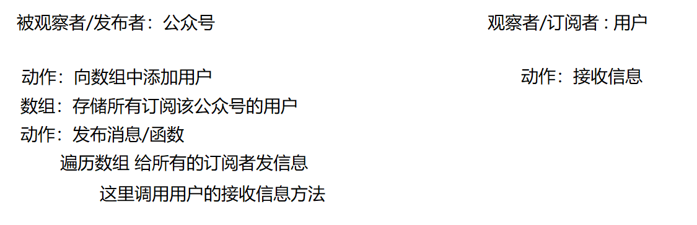

# vue2的数据监测原理

## 本章内容

- Object.defineProperty() 数据劫持 
- vue的数据代理
- vue的数据监测
- 消息订阅与发布 

## 一、vue的数据代理和响应式(数据监测)原理

当数据发生改变时 我们要实时监听到，并且随之做出改变(DOM操作)

### 1.1 了解Object.defineProperty()方法

**概念：** **`Object.defineProperty()` **方法会直接在一个对象上定义一个新属性，或者修改一个对象的现有属性，并返回此对象。

**备注：**应当直接在 [`Object`](https://developer.mozilla.org/zh-CN/docs/Web/JavaScript/Reference/Global_Objects/Object) 构造器对象上调用此方法，而不是在任意一个 `Object` 类型的实例上调用。

#### 语法

```
Object.defineProperty(obj, prop, descriptor)


Object.keys
Object.values
Object.assign()
```

### 参数

- `obj`

  要定义属性的对象。

- `prop`

  要定义或修改的属性的名称或 [`Symbol`](https://developer.mozilla.org/zh-CN/docs/Web/JavaScript/Reference/Global_Objects/Symbol) 。

- `descriptor`

  要定义或修改的属性描述符。

### 返回值：

被传递给函数的对象。

### 描述：

该方法允许精确地添加或修改对象的属性。通过赋值操作添加的普通属性是可枚举(遍历)的，在枚举对象属性时会被枚举到（[`for...in`](https://developer.mozilla.org/zh-CN/docs/Web/JavaScript/Reference/Statements/for...in) 或 [`Object.keys`](https://developer.mozilla.org/zh-CN/docs/Web/JavaScript/Reference/Global_Objects/Object/keys)[ ](https://developer.mozilla.org/en-US/docs/Web/JavaScript/Reference/Global_Objects/Object/keys)方法），可以改变这些属性的值，也可以[`删除`](https://developer.mozilla.org/zh-CN/docs/Web/JavaScript/Reference/Operators/delete)这些属性。这个方法允许修改默认的额外选项（或配置）。默认情况下，使用 `Object.defineProperty()` 添加的属性值是不可修改（immutable）的。

对象里目前存在的属性描述符有两种主要形式：***数据描述符*和*存取描述符***。*数据描述符*是一个具有值的属性，该值可以是可写的，也可以是不可写的。*存取描述符*是由 getter 函数和 setter 函数所描述的属性。一个描述符只能是这两者其中之一；不能同时是两者。

这两种描述符都是对象。它们共享以下可选键值（默认值是指在使用 `Object.defineProperty()` 定义属性时的默认值）：

- `configurable`

  当且仅当该属性的 `configurable` 键值为 `true` 时，该属性的描述符才能够被改变，同时该属性也能从对应的对象上被删除。  **默认为**  **`false`**。

- `enumerable` 控制属性是否可以枚举(遍历)

  当且仅当该属性的 `enumerable` 键值为 `true` 时，该属性才会出现在对象的枚举属性中。  **默认为 `false`**。

**数据描述符**还具有以下可选键值：

- `value`

  该属性对应的值。可以是任何有效的 JavaScript 值（数值，对象，函数等）。  **默认为 [`undefined`](https://developer.mozilla.org/zh-CN/docs/Web/JavaScript/Reference/Global_Objects/undefined)**。

- `writable` 

  当且仅当该属性的 `writable` 键值为 `true` 时，属性的值，也就是上面的 `value`，才能被[`赋值运算符` (en-US)](https://developer.mozilla.org/en-US/docs/Web/JavaScript/Reference/Operators#assignment_operators)改变。  **默认为 `false`。**

**存取描述符**还具有以下可选键值：

- `get`

  属性的 getter 函数，如果没有 getter，则为 `undefined`。当访问该属性时，会调用此函数。执行时不传入任何参数，但是会传入 `this` 对象（由于继承关系，这里的`this`并不一定是定义该属性的对象）。该函数的返回值会被用作属性的值。  **默认为 [`undefined`](https://developer.mozilla.org/zh-CN/docs/Web/JavaScript/Reference/Global_Objects/undefined)**。

- `set` 

  属性的 setter 函数，如果没有 setter，则为 `undefined`。当属性值被修改时，会调用此函数。该方法接受一个参数（也就是被赋予的新值），会传入赋值时的 `this` 对象。  **默认为 [`undefined`](https://developer.mozilla.org/zh-CN/docs/Web/JavaScript/Reference/Global_Objects/undefined)**。

#### 描述符默认值汇总

- 拥有布尔值的键 `configurable`、`enumerable` 和 `writable` 的默认值都是 `false`。
- 属性值和函数的键 `value`、`get` 和 `set` 字段的默认值为 `undefined`。

案例：

```html
<!DOCTYPE html>
<html>
	<head>
		<meta charset="utf-8">
		<title></title>
	</head>
	<body>
		<script type="text/javascript">
			let people = {
				name:'张三',
				address:'郑州'
                age:18,
			}
			/*
				Object.defineProperty(obj,prop,descriptor)
					obj:表示要添加属性的对象
					prop:表示要添加的属性
					descriptor:表示对新增属性的配置(描述)
			*/
			Object.defineProperty(people,'age',{
				value:19,//新增属性age的值
				enumerable:true,//控制属性是否可以被遍历
				writable:true,//控制属性能否被修改
			})
			console.log(people)
			console.log(Object.keys(people))
		</script>
	</body>
</html>
```

可以使用Object.defineProperty()方法对 对象中的属性进行更精确的控制。

**需求：能否让people对象中的age属性动态发生变化呢？** 

**尝试方法：**在外界定义变量num 把num的值赋给perople中的age属性。

```js
<script>
	let num = 19;
	let people = {
				name:'张三',
				address:'郑州'
                age:num,
			}
</script>
    
```

**结论：**此时代码第一次执行时，可以把num赋值给age,但是 后续num的值发生改变后，就无法在赋值了，所以无法完成需求。

**解决方法：**借助于`Object.defineProperty()`方法 中的`get()`配置来实现

```js
<script>
	let num = 19;
	let people = {
    	name:'张三',
    	address:'郑州',
    }
    Object.defineProperty(people,'age',{
        //当有代码使用age属性时，就会执行get()方法，return的num就是age属性的值
        get(){
            return num
        },
        //当有代码给age属性赋值时 就会执行set()函数 并接收到要修改的值  val 再把val的值赋给 num变量 只要num的值发生改变 就相当于age的值发生了改变。
        set(val){
            num = val
        }
    })
</script>
此时通过  Object.defineProperty方法 添加get(){}函数描述符 可以解决问题，此时并不是直接把num的值赋给age,而是，当每次有调用age属性时，就去执行get()函数 去重新读取num的值。此时 只要num的值发生改变  age的值就会随之发生改变。可以完成我们的需求。
```

### 1.2 vue的数据代理

**数据代理：**通过一个对象（_data）来对另一个对象（data）中的属性进行读和写。

代码分析：

```js
<body>
		<div id="app">
			<h1>名字是：{{name}}</h1>
			<h1>年龄是：{{age}}</h1>
		</div>
	</body>
	<script type="text/javascript">
		let vm = new Vue({
			el:'#app',
			data:{
				name:'张三',
				age:18
			}
		})
	</script>
```

**问题一：**页面标签中显示的数据 是直接从data中获取的吗？

​		不是，vue在读取到`data`属性后 会先把`data`赋值给 vue实例上的另外一个属性` _data` ，再把_data中的属性和getter和setter方法复制到vm的实例对象上。

**问题二：** 页面标签中的数据是直接从`_data`属性中获取的吗 ？

​		不是，如果是直接从`_data`中获取数据，此时我们在页面标签中取数据就应该这样写 `{{_data.name}}` 这样写法其实也是可以的，但是我们每一次的操作都要加上`_data`编码不方便，所以 vue又把`_data`中的属性取出来在vm实例对象上放了一份。所以我们后续的代码写法可以直接写成`{{name/age}}`,而不用添加 `_data`了。底层的实现就是`Object.defineProperty()`方法。

**问题三：** vm实例对象上的`_data`属性中为什么也会有对应的getter和setter方法呢？使用的是数据代理吗？

​		不是，注意：此处采用的是**数据劫持**(就是Vue会先对data中的数据进行处理了，添加getter和setter方法就叫数据劫持)，因为vue 要对数据做监听，当数据发生改变时，要同时把改变后的数据同步更新到DOM中。所以此处 被叫做`响应式`(vue监测数据改变的原理)。

**小结：`Object.defineProperty()`方法的主要作用：**

- 可以让我们实时的获取最新的数据 
- 可以让我们在获取和设置数据时 能够做一些额外的操作(调用一些其它的函数)

### 1.3 vue监测数据改变的原理(响应式) 对象/数组 

**核心：**是当vue监测到数据改变时，是如何让页面上所有用到这个数据的DOM 发生更新的！！！

经典设计模式：23种

**设计模式： ** **观察者模式**     **消息发布与订阅** 



#### 1.3.1 消息发布与订阅

案例：用户关注公众号，订阅公众号信息，当公众号发布消息时，所有关注这个公众号的用户都可以接收到消息。

**ES5 通过原型对象完成发布与订阅：** 

```js
//定义发布者 Observer
function GongZongHao(name) {
	console.log(name + '公众号创建了')
	this.name = name;
    //定义数组 用来存储关注公众号的用户
	this.subList = [];
}
//向原型上添加方法  订阅方法 和 发布方法
GongZongHao.prototype.addUser = function(user) {
	console.log(user.name + "关注了AAA公众号")
	this.subList.push(user)
}
GongZongHao.prototype.sendMsg = function(msg) {
	console.log(this.name + "发布了消息：" + msg)
	this.subList.forEach(item => {
		//调用用户接收消息的方法
		item.receive(msg)
	})
}

//定义用户
function User(name) {
	this.name = name;
}
//定义用户接收消息的方法
User.prototype.receive = function(msg) {
	console.log(this.name + "接收到了消息：" + msg)
}

//定义AAA公众号对象
let AAA = new GongZongHao('aaa')

//定义用户张三，李四，王五，赵六
let zhangsan = new User('张三')
let lisi = new User('李四')
let wangwu = new User('王五')
let zhaoliu = new User('赵六')

//让用户订阅AAA公众号
AAA.addUser(zhangsan)
AAA.addUser(lisi)
AAA.addUser(wangwu)
AAA.addUser(zhaoliu)

//AAA公众号发布消息
AAA.sendMsg('今天是个好天气')
```

**ES6 类与对象完成发布与订阅：** 

```js
//定义发布者 公众号
class GongZongHao{
	constructor(name) {
		//定义公众号的名字
	    this.name = name
		//定义一个数组用来存储订阅公众号的用户
		this.subList = []
	}
	//定义订阅公众号的方法
	addUser(user){
		this.subList.push(user)
	}
	
	//定义公众号发送消息的方法
	sendMsg(msg){
		console.log(this.name+"公众号发布了消息："+msg)
		this.subList.forEach(item=>{
			item.receive(msg)
		})
	}
}

//定义订阅者  用户
class User{
	constructor(name) {
	    //定义用户的名字
	    this.name = name;
	}
	//定义用户接收信息的方法
	receive(msg){
		console.log(this.name+"接收到了消息："+msg)
	}
}

//定义AAA公众号
let AAA = new GongZongHao('aaa')

//定义用户张三
let zhangsan = new User('张三')
let lisi = new User('李四')
let wangwu = new User('王五')
let zhaoliu = new User('赵六')

//让用户订阅AAA公众号
AAA.addUser(zhangsan)
AAA.addUser(lisi)
AAA.addUser(wangwu)
AAA.addUser(zhaoliu)

//AAA公众号发布消息
AAA.sendMsg('今天是个好天气')
```

#### 1.3.2 vue监测数据改变的原理----对象

**案例：**手动实现简易版vue**监测对象**的数据原理：

**需求：**定义data数据 当其中属性的值发生改变时 就 在控制台输出 `某属性发生了改变`。

```html
<!DOCTYPE html>
<html>
	<head>
		<meta charset="utf-8">
		<title></title>
	</head>
	<body>
		<script type="text/javascript">
			let data = {
				name:'张三',
				age:18
			}
            //这种方式 会造成死循环
			/* Object.defineProperty(data,'name',{
				get(){
					return data.name
				},
				set(val){
					data.name = val
				}
			})
			console.log(data);
			data.name = 'Lis' */
			
			//定义构造函数
			function Obs(obj){
				this.name = obj.name;
				this.age = obj.age;
				let keys = Object.keys(obj)
				keys.forEach(k=>{
					Object.defineProperty(this,k,{
						get(){
							return obj[k]
						},
						set(val){
							console.log(`${k}被修改了`)
							obj[k] = val
						}
					})
				})
			}
            //创建Obs构造函数的实例对象 并把要监测的 data数据对象 传入
            let obs = new Obs(data)
            //把定义好的数据监测对象赋值给data本身和vue实例对象
			let vm = data = obs
            
			data.name = '王五'
			data.age = 19
		</script>
	</body>
</html>
```

**案例：** 使用发布与订阅模式+Object.defineProperty()方法完成监听数据改变，并更新页面DOM的需求。

```html
<!DOCTYPE html>
<html>
	<head>
		<meta charset="utf-8">
		<title></title>
	</head>
	<body>
		<p id='p1'>你好哈哈哈</p>
	</body>
	<script type="text/javascript">
	
		//定义发布者
		class Dep{
			constructor(data) {
			    this.data = data
				//定义数组用来存储订阅者
				this.subList = []
			}
			
			//添加订阅者
			addWatcher(watcher){
				//把订阅者添加到数组中
				this.subList.push(watcher)
			}
			//通知订阅者
			send(){
				//通知所有订阅者 并调用对应的操作
				this.subList.forEach(w=>{
					w.callBack(this.data)
				})
			}
			//监听data中数据的改变
			listenData(){
				//console.log(this)
				let that = this;
				//取出要监听的数据中所有的key值
				let keys = Object.keys(this.data)
				keys.forEach(key=>{
					let value = this.data[key]
					Object.defineProperty(this.data,key,{
						configurable:true,
						enumerable:true,
						//当外界获取元素时执行
						get(){
							console.log(`读取了${key}的值`)
							return value
						},
						//当外界设置，或修改元素时执行 val就是修改时 传入的值
						set(val){
							console.log(`${key}的值发生了改变`)
							value = val
							//调用通知方法
							that.send()
						}
					})
				})
			}
		}
		
		//定义订阅者
		class Watcher{
			constructor(fn) {
			    this.fn = fn
			}
			callBack(data){
				this.fn(data)
			}
		}
		//定义订阅者收到消息后的操作
		function fn(data){
			console.log('监听到数据发生改变，需要调用渲染dom的方法')
			console.log(data)
			//更新DOM结构的数据
			document.getElementById('p1').innerText = data.name
		}
		
		//创建订阅者对象
		let w1 = new Watcher(fn)
		
		//定义vue对象的构造函数
		class my_vue{
			constructor(options) {
				this.$data = options.data
				this.$el = options.el
				//创建发布者
				let dep = new Dep(options.data)
				//调用添加订阅者方法
				dep.addWatcher(w1)
				//调用监听数据的改变的方法
				dep.listenData()
				//通知订阅者
				dep.send()
			}
		}
		
        //定义被代理的数据
        let obj = {
				name:'张三',
				age:18
			}
        
		//创建vue实例对象
		let vm = new my_vue({
			el:'#app',
			data:obj
		})
		
	</script>
</html>
```


#### 1.3.3 `Vue.set()`和`vm.$set()`方法 

**需求：**vm实例对象中data属性中含有一个对象类型的数据Person,如何动态的向Person对象中添加一个**响应式**的属性？

如果我们直接向Person对象中添加一个age属性 可以添加成功，但是此时这个age属性并不是响应式数据，也就是说数据发生改变时，页面视图并不会随之改变。我们可以通过`Vue.set()`或者`vm.set()`方法来完成这个需求。

##### Vue.set( target, propertyName/index, value )

- **参数**：

  - `{Object | Array} target`
  - `{string | number} propertyName/index`
  - `{any} value`

- **返回值**：设置的值。

- **用法**：

  向响应式对象中添加一个 property，并确保这个新 property 同样是响应式的，且触发视图更新。它必须用于向响应式对象上添加新 property，因为 Vue 无法探测普通的新增 property (比如 `this.myObject.newProperty = 'hi'`)

  **注意:**对象不能是 Vue 实例，或者 Vue 实例的根数据对象。

```vue
	<body>
		<div id="app">
			<h2>姓名是：{{person.name}}</h2>
			<h2>地址是：{{person.address}}</h2>
			<h2 v-if="person.age">年龄是：{{person.age}}</h2>
			<button type="button" @click="addAge">点我添加属性age</button>
		</div>
	</body>
	<script type="text/javascript">
		new Vue({
			el:'#app',
			data:{
				person:{
					name:'小明',
					address:'郑州'
				}
			},
			methods:{
				addAge(){
					//这种添加方式不是响应式的数据
					//this.person.age = 18
					//通过vue内部提供的方法添加   就是响应式数据
					//Vue.set(this.person,'age',19)
					this.$set(this.person,'age',20)
				}
			}
		})
	</script>
```

**注意：**此方法只能用于在data内部的对象属性上添加内容，而不能直接在data上 或者 vm上添加属性。

**小结：**

- Vue 无法检测 property 的添加或移除。由于 Vue 会在初始化实例时对 property 执行 getter/setter (数据劫持)转化，所以 property 必须在 `data` 对象上存在才能让 Vue 将它转换为响应式的。
- 对于已经创建的实例，Vue 不允许动态添加根级别的响应式 property。但是，可以使用 `Vue.set(object, propertyName, value)` 方法向嵌套对象添加响应式 property。

#### 1.3.4 vue监测数据改变的原理----数组

**需求：**编码实现 点击按钮把张三的个人信息更改成新的信息。

```html
<!DOCTYPE html>
<html>
	<head>
		<meta charset="utf-8">
		<title></title>
		<script src="../js/vue.js" type="text/javascript" charset="utf-8"></script>
	</head>
	<body>
		<div id="app">
			<button type="button" @click="changeZhangSan">点我</button>
			<ul>
				<li v-for="item in list">
					编号:{{item.id}},名字:{{item.name}},年龄:{{item.age}}
				</li>
			</ul>
		</div>
	</body>
	<script type="text/javascript">
		//需求：定义按钮，点击触发函数 改变 张三的名字为张三三 年龄为40
		new Vue({
			el:'#app',
			data:{
				list:[
					{id:1,name:'张三',age:18},
					{id:2,name:'李四',age:19},
					{id:3,name:'王五',age:20}
				]
			},
			methods:{
				changeZhangSan(){
					//这样改可以
					//this.list[0].name = '张三三'
					
					//创建一个新的对象把整体的张三所在的对象给替换掉
					this.list[0] = {id:1,name:'张三三',age:40}
					//此处修改不行，vue并不能监测到此时数据的改变
				}
			}
		})
	</script>
</html>
```

**注意：**此时发现问题，我们如果直接通过下标去修改数组中的内容，vue是无法监测到数组中数据发生改变的。

**Vue 不能检测以下数组的变动：**

1. 当你利用索引直接设置一个数组项时，例如：`vm.items[indexOfItem] = newValue`

2. 当你修改数组的长度时，例如：`vm.items.length = newLength`

3. 如果想监测数组 可以使用 `Vue.set(target,index,replace)`和`vm.$set(target,index,replace)`方法实现

4. Vue 将被侦听的数组的**变更方法**进行了包裹，所以它们也将会触发视图更新。这些被包裹过的方法包括：这些方法表示的已经不是Array原型对象上的方法了，而是被Vue包装后的方法。

   **变更方法**，顾名思义，会变更调用了这些方法的原始数组。相比之下，也有**非变更方法**，例如 `filter()`、`concat()` 和 `slice()`。它们不会变更原始数组，而**总是返回一个新数组**。当使用非变更方法时，可以用新数组替换旧数组

   ```js
   push()结尾追加,
   pop()删除末尾,
   shift()删除开头,
   unshift()开头添加,
   sort()排序,
   splice()指定位置删除，添加,
   reverse()反转
   ```


### 二、总结与作业：

**总结：** **vue2中的数据代理主要使用的就是`Object.defineProperty()`方法来完成的。**

**作业：**今日所讲内容整理笔记 背住。面试题。

 