# 第一章：小程序基础

## 本章内容 

- 认识小程序
- 会注册自己的小程序
- 微信开发者工具的使用
- 创建小程序项目
- 有关项目的一些基本配置

## 一、小程序介绍 

### 1.1 简介

微信小程序简称小程序，英文名Mini Program，是一种不需要下载安装即可使用的应用，它实现了应用“触手可及”的梦想，用户扫一扫或搜一下即可打开应用
小程序是一种新的开放能力，开发者可以快速地开发一个小程序。小程序可以在微信内被便捷地获取和传播，同时具有出色的使用体验

### 1.2 微信小程序发展历史 

2016年1月11日，微信之父张小龙解读了微信的四大价值观，指出拆分出来的服务号并没有提供更好的服务，所以微信内部正在研究新的形态，叫「微信小程序」
2016年9月21日，微信小程序正式开启内测
2017年1月9日0点，微信第一批小程序正式上线                                                                                                            

2017年12月28日，微信更新的 6.6.1 版本开放了小游戏 

### 1.3 小程序接入流程 

开发小程序的第一步，你需要拥有一个**小程序帐号**，通过这个帐号你就可以管理你的小程序。在这个小程序管理平台，你可以管理你的小程序的权限，查看数据报表，发布小程序等操作。

https://mp.weixin.qq.com/ 微信公众平台

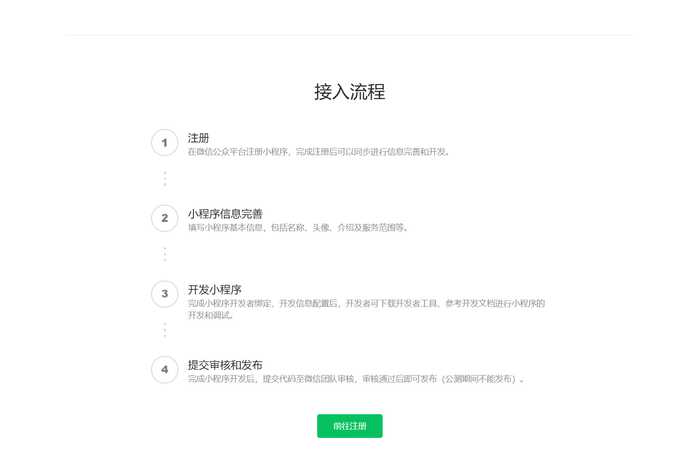

- 注册微信小程序账号 https://mp.weixin.qq.com/wxopen/waregister?action=step1

  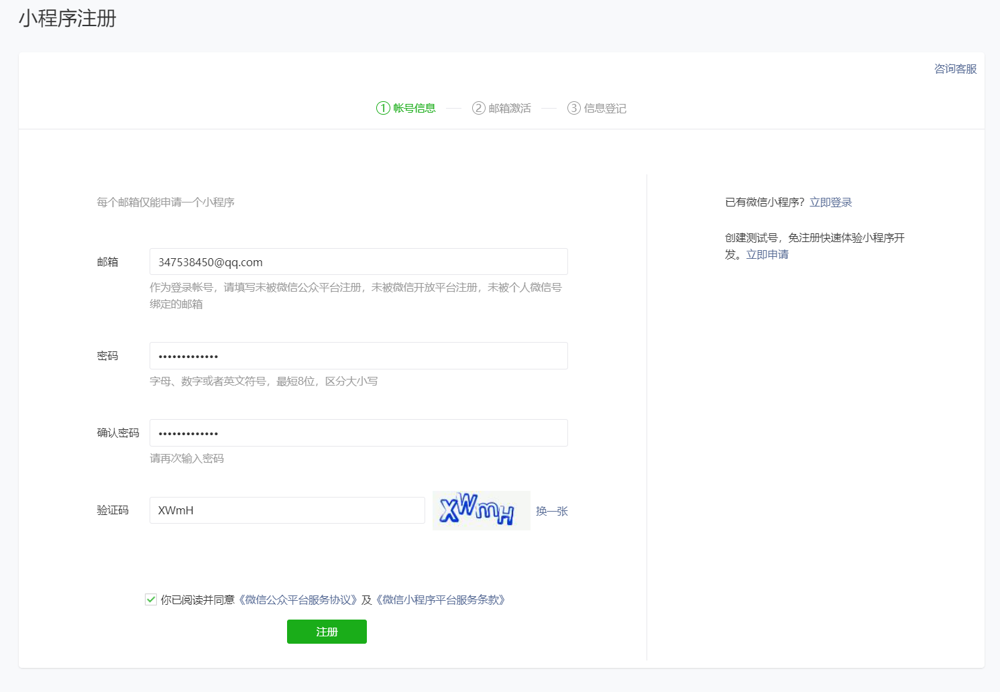

  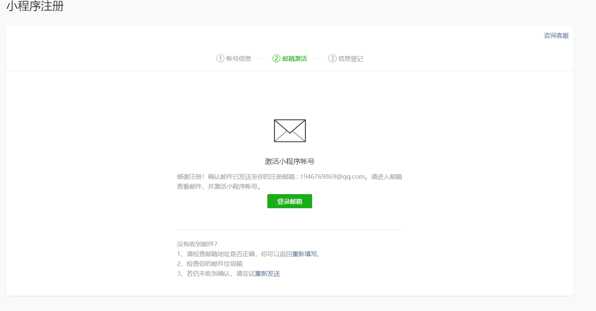

  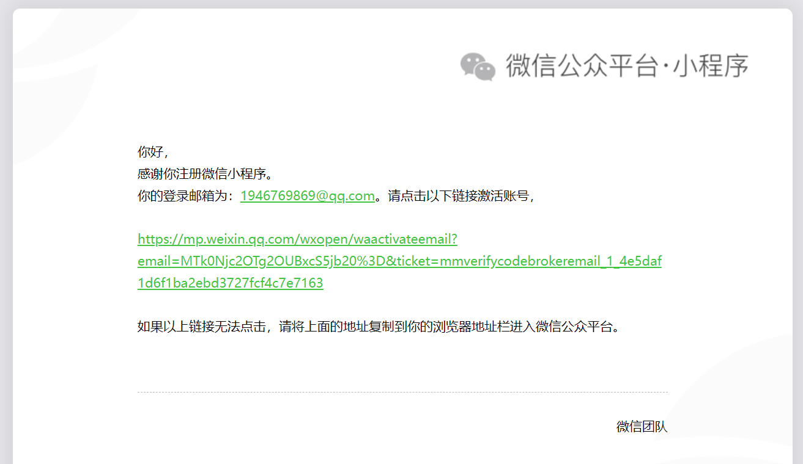

  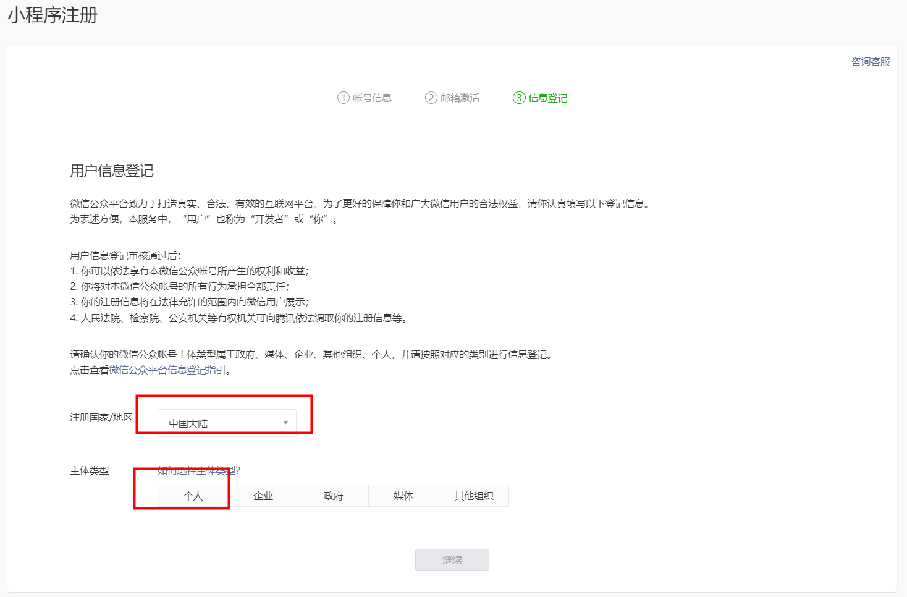

  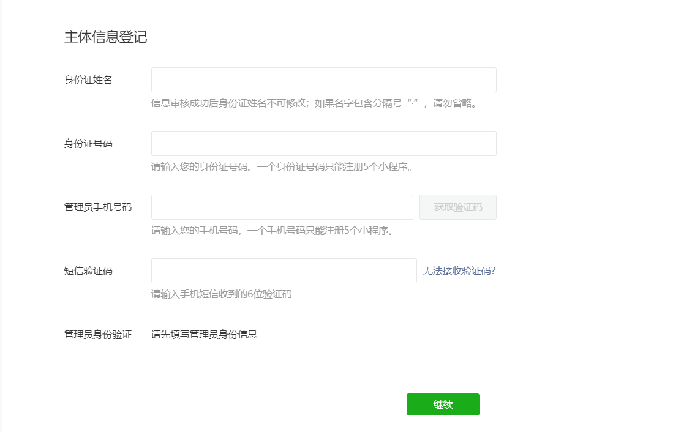

  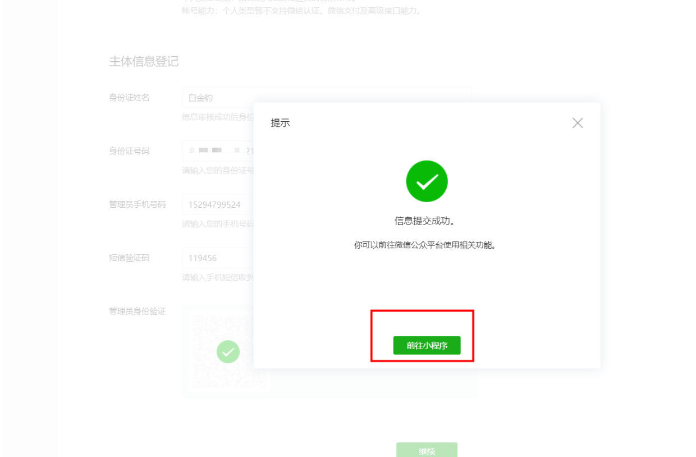

  进入小程序显示如下页面：

  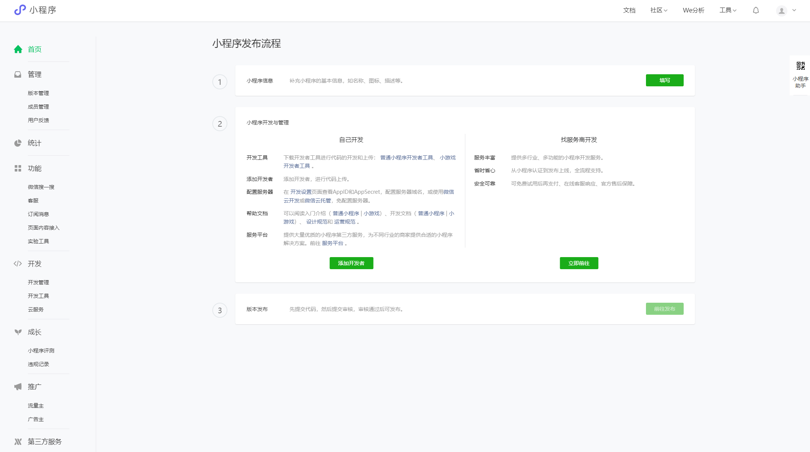

- 小程序信息完善

- 开发小程序 -- [小程序开发者工具](https://developers.weixin.qq.com/miniprogram/dev/devtools/download.html)，语法，组件，API的使用

- 提交审核和发布


## 二、开发者工具使用 

### 2.1 安装`微信web开发者工具` 

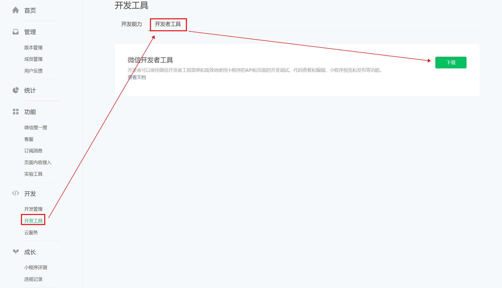

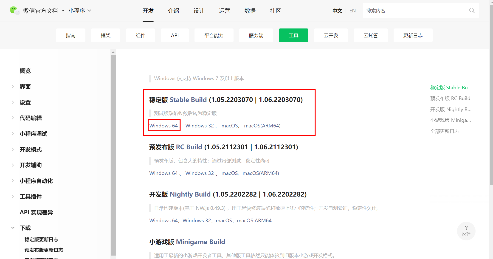

下载完毕后安装，傻瓜式操作。。。。。。

打开软件出现如下界面，扫码登录：

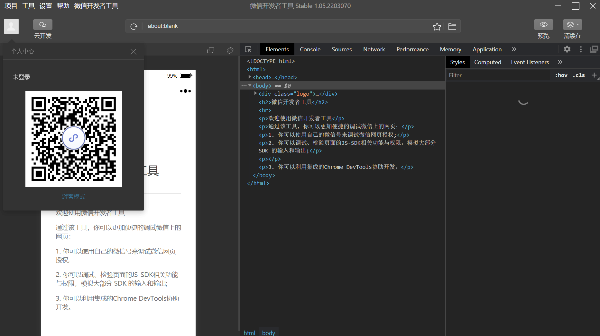

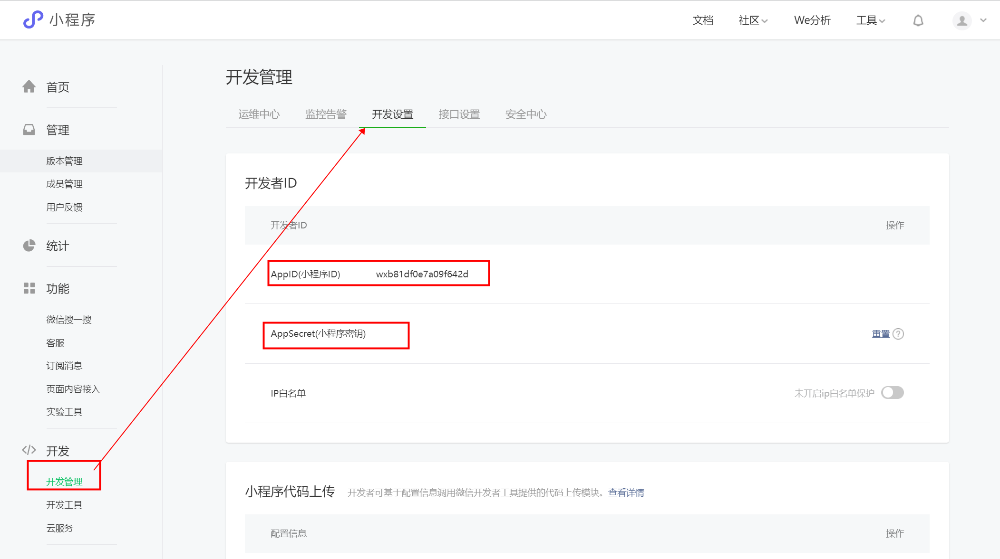

### 2.2 创建项目  

- 创建
  - 项目目录为存放路径
  - AppID在微信公众平台登录后获取
  - 项目名称为自定义小程序项目名称

  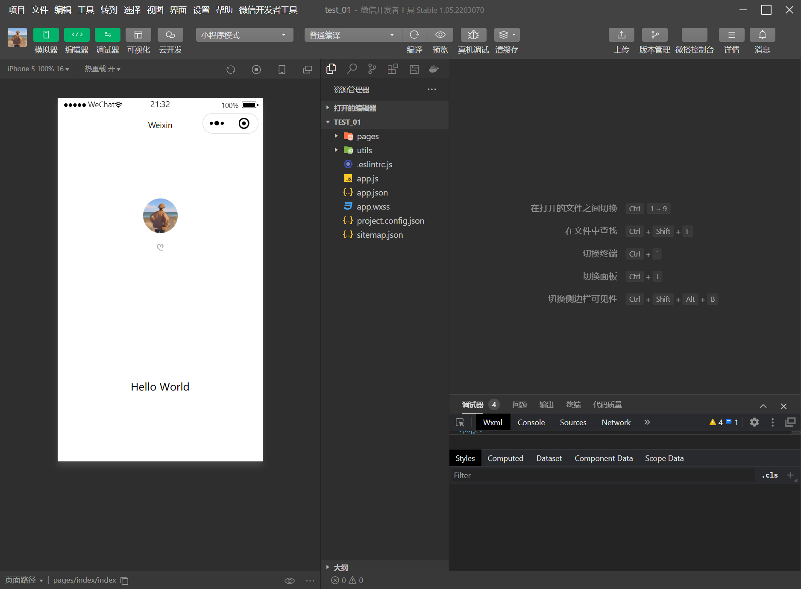

- 目录结构解析

  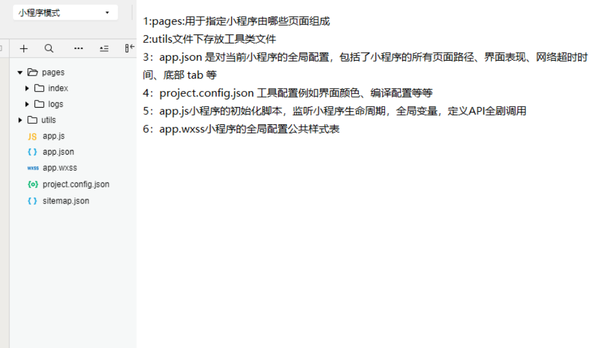

## 三、小程序构成和配置 

### 3.3 小程序页面构成

#### 3.3.1 构成

1. `.json` 后缀的 `JSON` 配置文件
2. `.wxml` 后缀的 `WXML` 模板文件
3. `.wxss` 后缀的 `WXSS` 样式文件
4. `.js` 后缀的 `JS` 脚本逻辑文件

#### 3.3.2 WXML 模板

网页编程采用的是 HTML + CSS + JS 这样的组合，其中 `HTML` 是用来描述当前这个页面的结构，`CSS` 用来描述页面的样子，`JS` 通常是用来处理这个页面和用户的交互。同样道理，在小程序中也有同样的角色，其中 `WXML` 充当的就是类似 `HTML` 的角色，和 `HTML` 非常相似，`WXML` 由标签、属性等等构成。但是也有很多不一样的地方。

1. 标签名字有点不一样
   - 往往写 HTML 的时候，经常会用到的标签是 `div`, `p`, `span`
   - 小程序的 `WXML` 用的标签是 `view`, `button`, `text` 等等，这些标签就是小程序给开发者包装好的基本能力，我们还提供了地图、视频、音频等等组件能力
   - 
2. 多了一些 `wx:if` 这样的属性以及 {{ }} 这样的表达式
   - WXML 中的动态数据均来自对应 Page 的 data
   - 简单绑定
     - 数据绑定使用 Mustache 语法（双大括号）将变量包起来
   - 列表渲染
     - 在组件上使用 wx:for 控制属性绑定一个数组，即可使用数组中各项的数据重复渲染该组件
   - 条件渲染
     - 使用 wx:if="{{condition}}" 来判断是否需要渲染该代码块

#### 3.3.3 WXSS 样式

`WXSS` 具有 `CSS` 大部分的特性，小程序在 `WXSS` 也做了一些扩充和修改。

1. 新增了尺寸单位。在写 `CSS` 样式时，开发者需要考虑到手机设备的屏幕会有不同的宽度和设备像素比，采用一些技巧来换算一些像素单位。`WXSS` 在底层支持新的尺寸单位 `rpx` ，开发者可以免去换算的烦恼，只要交给小程序底层来换算即可，由于换算采用的浮点数运算，所以运算结果会和预期结果有一点点偏差。
2. 提供了全局的样式和局部样式。和前边 `app.json`, `page.json` 的概念相同，你可以写一个 `app.wxss` 作为全局样式，会作用于当前小程序的所有页面，局部页面样式 `page.wxss` 仅对当前页面生效。
3. 此外 `WXSS` 仅支持部分 `CSS` 选择器

更详细的文档可以参考 [WXSS](https://developers.weixin.qq.com/miniprogram/dev/framework/view/wxss.html) 

#### 3.3.4 尺寸单位

- 尺寸单位：rpx 

- rpx（responsive pixel）可以根据屏幕宽度进行自适应调整
  例如ipone6上，屏幕宽度为375px,共750个物理像素，则750rpx=375px=750物理像素（1rpx=0.5px=1物理像素）
  微信建议开发小程序时设计师可以用ipone6作为视觉稿的标准

- ```css
  /** 设置view容器的宽度为100px的话，即200rpx **/
  view{
    width:200rpx;
  }
  
  ```

- 样式导入

  - 使用@import语句可以导入外联样式表，@import后跟需要导入的外联样式表的相对路径，用;表示语句结束

  - ```css
    /** common.wxss **/
    .small-p {
      padding:5px;
    }
    /** app.wxss **/
    @import "common.wxss";
    .middle-p {
      padding:15px;
    }
    
    ```

- app.wxss中的样式为全局样式，page的wxss为局部样式

#### 3.3.5 微信小程序的事件绑定

 1. 小程序中所有事件的绑定 都要使用 bind+事件名  例如 ；tap触摸   bindtap='函数名'

 2. 常用的事件类型

    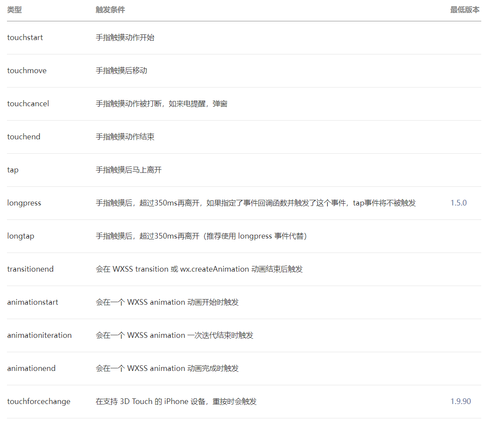

	3. 事件触发函数定义的位置

    在同级目录下的xxx.js中的page()页面对象中直接定义即可。

	4. 如何传递参数，调用函数时？

    ```
    <button bindtap="aaa" data-id="5" data-name="张三">点我</button>
    点击按钮时 如果触发函数需要传递参数  那么需要在标签中 添加一个 `data-属性名`=属性值
    在按钮触发的aaa函数中 可以通过事件对象e 取出传递的属性值：
    aaa(e){
        console.log("aaa事件出发了");
        console.log(e.currentTarget.dataset);
      }
    ```

#### 3.3.6 小程序的基础语法

请参考文档：https://developers.weixin.qq.com/miniprogram/dev/reference/wxml/

关于数据的绑定：https://developers.weixin.qq.com/miniprogram/dev/framework/view/two-way-bindings.html

data中的数据如果需要被变更 必须使用：

```
this.setData({
	"变更的属性key":"值"
})
```


### 3.4 关于小程序项目的一些json配置项

#### JSON 配置

JSON 是一种数据格式，并不是编程语言，在小程序中，JSON扮演的静态配置的角色。

我们可以看到在项目的根目录有一个 `app.json` 和 `project.config.json`，此外在 `pages/logs` 目录下还有一个 `logs.json`，我们依次来说明一下它们的用途。

- **小程序配置 app.json**

app.json 是当前小程序的全局配置，包括了小程序的所有页面路径、界面表现、网络超时时间、底部 tab 等，其他配置项细节可以参考文档 [小程序的配置 app.json 。](https://developers.weixin.qq.com/miniprogram/dev/framework/config.html)

- **工具配置 project.config.json**

通常大家在使用一个工具的时候，都会针对各自喜好做一些个性化配置，例如界面颜色、编译配置等等，当你换了另外一台电脑重新安装工具的时候，你还要重新配置。

考虑到这点，小程序开发者工具在每个项目的根目录都会生成一个 `project.config.json`，你在工具上做的任何配置都会写入到这个文件，当你重新安装工具或者换电脑工作时，你只要载入同一个项目的代码包，开发者工具就自动会帮你恢复到当时你开发项目时的个性化配置，其中会包括编辑器的颜色、代码上传时自动压缩等等一系列选项。

其他配置项细节可以参考文档 [开发者工具的配置](https://developers.weixin.qq.com/miniprogram/dev/devtools/projectconfig.html) 。

- **页面配置 page.json**

如果你整个小程序的风格是蓝色调，那么你可以在 `app.json` 里边声明顶部颜色是蓝色即可。实际情况可能不是这样，可能你小程序里边的每个页面都有不一样的色调来区分不同功能模块，因此我们提供了 `page.json`，让开发者可以独立定义每个页面的一些属性，例如刚刚说的顶部颜色、是否允许下拉刷新等等。

其他配置项细节可以参考文档 [页面配置](https://developers.weixin.qq.com/miniprogram/dev/framework/config.html#页面配置)

- app.json 是当前小程序的全局配置，包括了小程序的所有页面路径、界面表现、网络超时时间、底部 tab 等

### 3.5 小程序官方文档 

参考官方文档

### 3.6 todoList练习案例 

todoList页面：

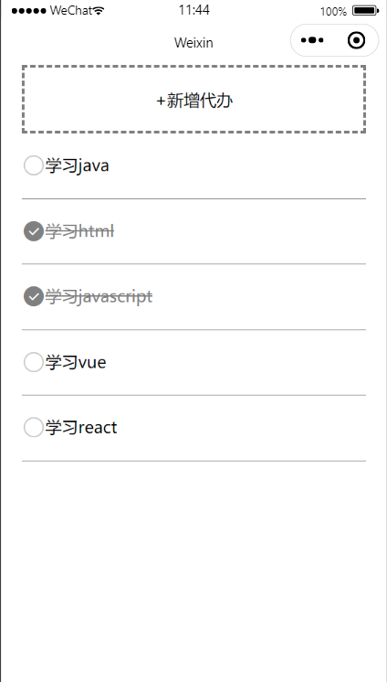

点击新增待办 跳转到todos页面

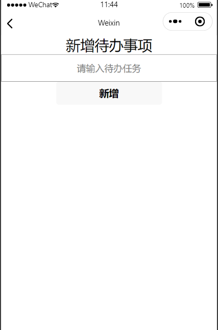

输入内容，点击新增按钮 后 再返回上一级页面。

```js
// pages/todoList/todoList.js
Page({
  /**
   * 页面的初始数据
   */
  data: {
    textList:[
      {id:1,text:'学习java',isFinish:false},
      {id:2,text:'学习html',isFinish:false},
      {id:3,text:'学习javascript',isFinish:false},
      {id:4,text:'学习vue',isFinish:false}
    ],
    idx:5
  },
  aaa(e){
    //console.log('触摸事件触发了')
    //console.log(e.currentTarget.dataset.id)
    let id = e.currentTarget.dataset.id
    this.data.textList.forEach(item=>{
      if(id == item.id){
        item.isFinish = !item.isFinish
      }
    })
    //需要把修改后的数据重新设置回 data中
    this.setData({
      textList:this.data.textList
    })
  },
  //点击新增代办
  goTodos(){
    let that = this;
    //跳转到todos页面
    wx.navigateTo({
      url: '/pages/todos/todos',
      events:{
        getInputValue:function(data){
          //console.log(data.data)
          let res = data.data;
          let obj = {
            id:that.data.idx++,
            text:res,
            isFinish:false
          }
          //添加数据
          that.data.textList.push(obj)

          //设置数据
          that.setData({
            textList:that.data.textList
          })
        }
      }
    })
  }
})
```

```html
<!--pages/todoList/todoList.wxml-->
<view class="top" bindtap="goTodos">+新增代办</view>
<view>
  <view 
    class="content" 
    wx:for="{{textList}}" 
    wx:key="{{item.text}}"
    data-id="{{item.id}}" 
    bindtap="aaa">
    <!-- 定义图标 -->
    <icon wx:if="{{!item.isFinish}}" class="icon-small" type="circle" size="23"></icon>
    <icon wx:else class="icon-small" type="success" color="gray" size="23"></icon>
    <!-- 定义文本内容 -->
    <text class="{{item.isFinish ? 'active' : ''}}">{{item.text}}</text>
  </view>
</view>
```

```js
// pages/todos/todos.js
Page({

  /**
   * 页面的初始数据
   */
  data: {
    inputValue:''
  },
  getInValue(e){
    //console.log(e.detail.value)
    this.setData({
      inputValue:e.detail.value
    })
  },
  //发送数据
  send(){
    console.log(111)
    //通过自定义事件传递参数回 原页面
    const eventChannel = this.getOpenerEventChannel()
    eventChannel.emit('getInputValue', {data: this.data.inputValue});

    //关闭当前页面返回上一级页面
    wx.navigateBack({
      delta: 1
    })
  }
})
```

```html
<!--pages/todos/todos.wxml-->
<view class="max">
  <text >新增待办事项</text>
  <view>
    <input type="text" focus bindinput="getInValue" placeholder="请输入待办任务"/><br />
    <button bindtap="send">新增</button>
  </view>
</view>
```


## 四、总结与作业

- toDoList案例

  