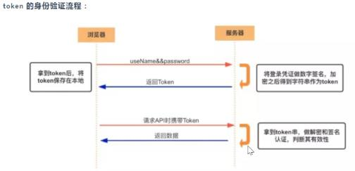
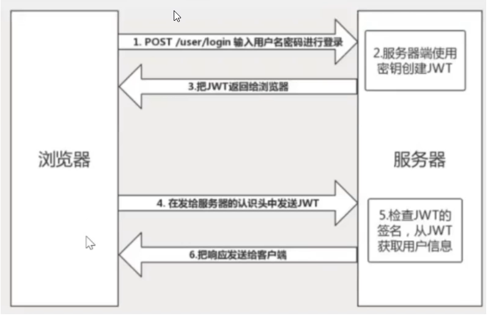
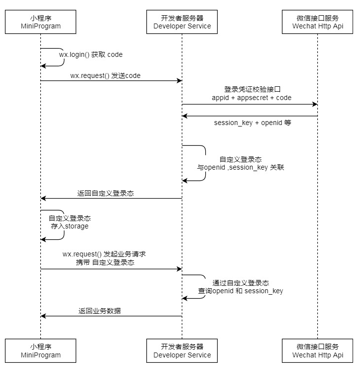
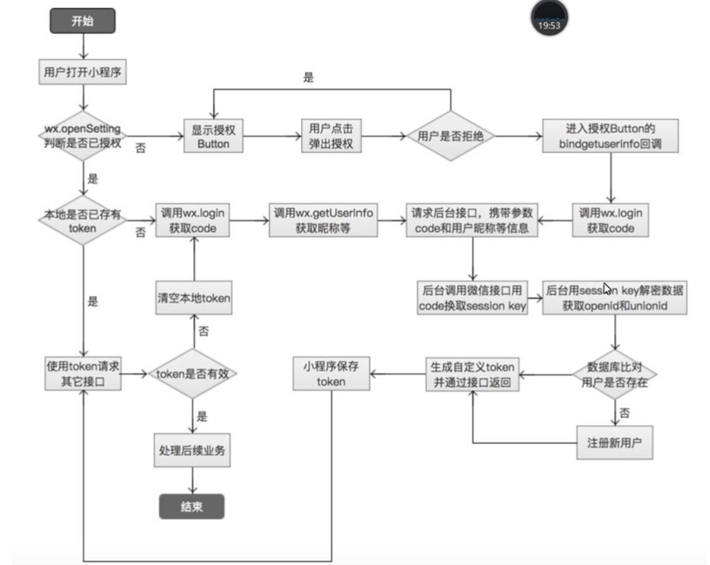
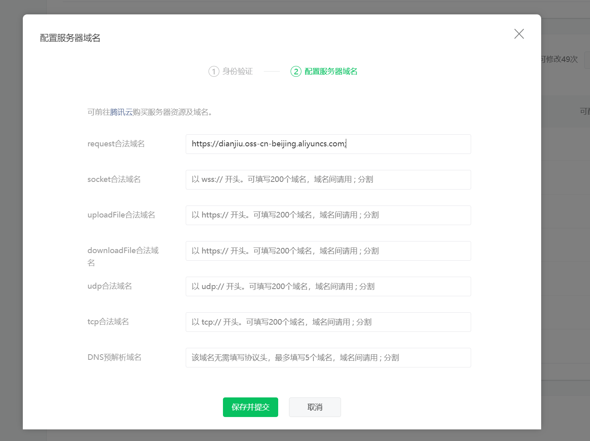
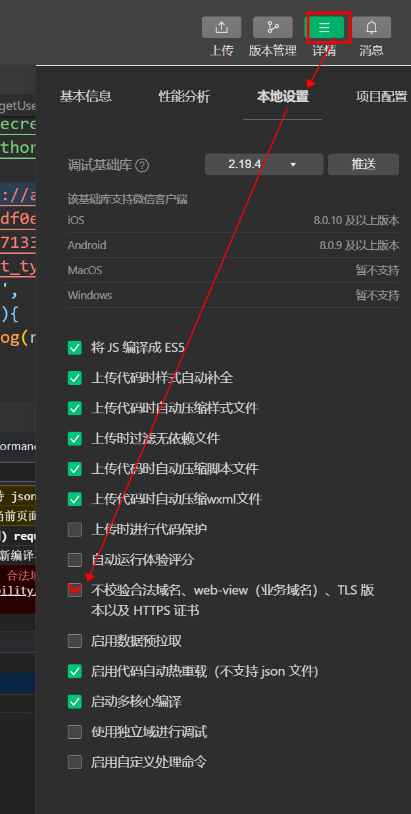

# 第二章：微信授权 -- 小程序登录流程

token 

username+password+时间戳

正常软件(注册登录)：后端是根据登录的用户信息，时间戳等 来共同生成一个token身份信息。

小程序：wx.login()方法  appid  secret  code 来向小程序的后台 请求：换取 openid  ， session_key

后端根据 openid  ， session_key 生成一个令牌token 

后续：

#### 获取用户信息

https://developers.weixin.qq.com/miniprogram/dev/api/open-api/user-info/wx.getUserProfile.html

```js
<view wx:if='{{!showloginbtn}}'>
  <image src="{{userinfo.avatarUrl}}"></image>
  <text>{{userinfo.nickName}}</text>
</view>
<button bindtap="login" wx:else>登录</button>

data: {
    userinfo:{},
    showloginbtn:true
  },
wx.getUserProfile({
      desc:'用做登录',
      success:(res)=>{
        console.log(res);
        this.setData({
          userinfo:res.userInfo,
          showloginbtn:false
        })
        wx.setStorage({
          data: res.userInfo,
          key: 'userinfo'
        })
				wx.login({
          success:(res)=>{
            console.log(res);
            // 拿到code  调用auth.code2Session  ，换取openid session_key  这个步骤，是要后台来完成的，主要是为了安全
            // 客户端的代码可以反编译出来、很容易被劫持
              //注意本步操作 在此处只是测试，应该是由后端来完成这个操作。
            wx.request({
              url:`https://api.weixin.qq.com/sns/jscode2session?appid=wx376752a6223c9a08&secret=222e2541c9d8eaa8ae9909f6baad680d&js_code=${res.code}&grant_type=authorization_code`,
              success:(res)=>{
                console.log(res);
              }
            });
          }
        }); 
 )}
  
  
  
  onLoad: function (options) {
    wx.getStorage({
      key: 'userinfo',
      success:(res)=>{
        this.setData({
          userinfo:res.data,
          showloginbtn:false
        })
      }
    })
  },
```


#####  1.什么是认证（Authentication )

通俗地讲就是验证当前用户的身份，证明 " 你是你自己 ” (比如︰你每天上下班打卡，都需要通过指纹打卡，当你的指纹和系统里录入的指纹相匹配时，就打卡成功）
互联网中的认证:

- 用户名密码登录 

- 邮箱发送登录链接

- 手机号接收验证码

- 只要你能收到邮箱/验证码，就默认你是账号的主人

  活体监测

##### 2.什么是授权（Authorization )

挖矿。root 超级权限 

用户授予第三方应用访问该用户某些资源的权限
。你在安装手机应用的时候，APP会询问是否允许授予权限（访问相册、地理位置等权限)
。你在访问微信小程序时，当登录时，小程序会询问是否允许授予权限（获取昵称、头像、地区、性别 0,1,2 等个人信
息）。
实现授权的方式有:cookie、session 、token

```js
wx.getSetting({
      success(res) {
        console.log(res);
        //if (!res.authSetting['scope.userInfo']) {
          wx.authorize({
            scope: "scope.record",
            success () {
              // 用户具体位置授权
              /* wx.getLocation({
                type: 'wgs84',
                success (res) {
                  const latitude = res.latitude
                  const longitude = res.longitude
                  const speed = res.speed
                  const accuracy = res.accuracy
                  console.log(latitude,longitude,speed,accuracy);
                }
               }) */
               //用户个人信息的授权
               /* wx.getUserInfo({
                success: function(res) {
                  console.log(1111);
                  var userInfo = res.userInfo
                  var nickName = userInfo.nickName
                  var avatarUrl = userInfo.avatarUrl
                  var gender = userInfo.gender 
                  var province = userInfo.province
                  var city = userInfo.city
                  var country = userInfo.country
                  console.log(res.userInfo);
                }
              }) */
              //麦克风授权
              wx.startRecord({
                success (res) {
                  const tempFilePath = res.tempFilePath
                }
              })
            }
          })
        }
      //}
    })
```


##### 3.什么是凭证( Credentials )  

实现认证和授权的前提是需要一种媒介（证书）来标记访问者的身份

- 在现实生活中，每个人都会有一张专属的居民身份证，是用于证明持有人身份的一种法定证件。通过身份证，我们可以办理手机卡/银行卡/个人贷款/交通出行等等，这就是认证的凭证。

- 在互联网应用中，一般网站会有两种模式，游客模式和登录模式。游客模式下，可以正常浏览网站上面的文章，一旦想要点赞/收藏/分享文章，就需要登录或者注册账号。当用户登录成功后，服务器会给该用户使用的浏览器颁发一个令牌( token )，这个令牌用来表明你的身份，每次浏览器发送请求时会带上这个令牌，就可以使用游客模式下无法使用的功能。

##### 4.什么是Token(令 牌)

- 访问资源接口( API )时所需要的资源凭证

- 简单token的组成: uid(用户唯一 的身份标识)、 time(当前时间的时间戳)、sign (签名, token的前几位以哈希算法压缩成的一定长度的十六进制字符串)

●特点:
。服务端无状态化、可扩展性好
。支持移动端设备
。安全
。支持跨程序调用


##### token的身份验证流程：



1.客户端使用用户名跟密码请求登录 
2.服务端收到请求,去验证用户名与密码
3.验证成功后，服务端会签发-一个token并把这个token发送给客户端
4.客户端收到token以后,会把它存储起来,比如放在cookie里或者localStorage里
5.客户端每次向服务端请求资源的时候需要带着服务端签发的token
6.服务端收到请求,然后去验证客户端请求里面带着的token , 如果验证成功,就向客户端返回请求的数据
●每一次请求都需要携带token,需要把token放到HTTP的Header里

●基于token的用户认证是-种服务端无状态的认证方式,服务端不用存放token数据。用解析token的计算时间换
取session的存储空间,从而减轻服务器的压力.减少频繁的查询数据库
●token 完全由应用管理,所以它可以避开同源策略
●Access Token的有效期比较短,当Acesss Token由于过期而失效时,使用Refresh Token就可以获取到新的
Token ,如果Refresh Token也失效了,用户就只能重新登录了。
●Refresh Token及过期时间是存储在服务器的数据库中,只有在申请新的Acesss Token时才会验证,不会对业务接口
响应时间造成影响,也不需要向Session一样-直保持在内存中以应对大量的请求。

##### 5.什么是 JWT

● JSON Web Token (简称JWT )是目前最流行的跨域认证解决方案。
●是一种认证授权机制。
●JWT是为了在网络应用环境间传递声明而执行的一种基于JSON的开放标准( RFC 7519[4])。JWT的声明一般被用
来在身份提供者和服务提供者间传递被认证的用户身份信息,以便于从资源服务器获取资源。比如用在用户登录上。
●可以使用HMAC算法或者是RSA的公/私秘钥对JWT进行签名。因为数字签名的存在,这些传递的信息是可信的。



●JWT认证流程:
	。用户输入用户名/密码登录,服务端认证成功后,会返回给客户端一 个JWT
	。客户端将token保存到本地(通常使用localstorage ,也可以使用cookie )
	。当用户希望访问一个受保护的路由或者资源的时候。需要请求头的Authorization字段中使用Bearer模式添加
JWT 
●服务端的保护路由将会检查请求头Authorization 中的JWT信息,如果合法,则允许用户u1万
选择晋言
●因为JWT是自包含的(内部包含了一些会话信息) ,因此减少了需要查询数据库的需要
.因为JWT并不使用Cookie的,所以你可以使用任何域名提供你的API服努而不需要担心跨域资源共字问题
( CORS )
●因为用户的状态不再存储在服务端的内存中,所以这是-种无状态的认证机制

##### 6.小程序登录流程  



#### 说明：

1. 调用 [wx.login()](https://developers.weixin.qq.com/miniprogram/dev/api/open-api/login/wx.login.html) 获取 **临时登录凭证code** ，并回传到开发者服务器。
2. 调用 [auth.code2Session](https://developers.weixin.qq.com/miniprogram/dev/api-backend/open-api/login/auth.code2Session.html) 接口，换取 **用户唯一标识 OpenID** 和 **会话密钥 session_key**。

之后开发者服务器可以根据用户标识来生成自定义登录态（token），用于后续业务逻辑中前后端交互时识别用户身份。




作业：

1. 以理解为主，理解授权，小程序登录流程
2. 作业二-实现小程序获取用户信息、地理位置、相机等授权操作

如果在微信小程序中 想访问一些接口 则 必须在微信公众平台中配置合法域名才可以。

如果有多个合法域名 要以  `; `分隔



如果是在开发者工具中，可以勾选 不校验合法域名 

