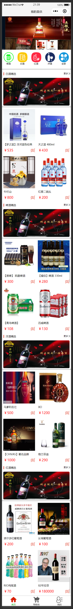
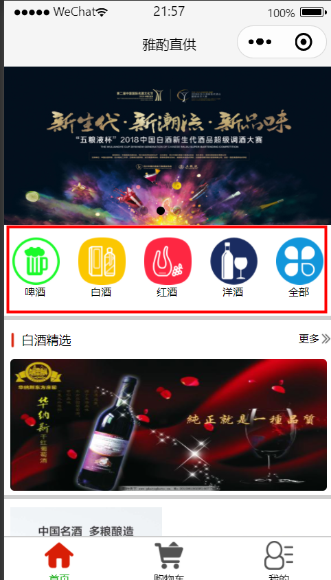
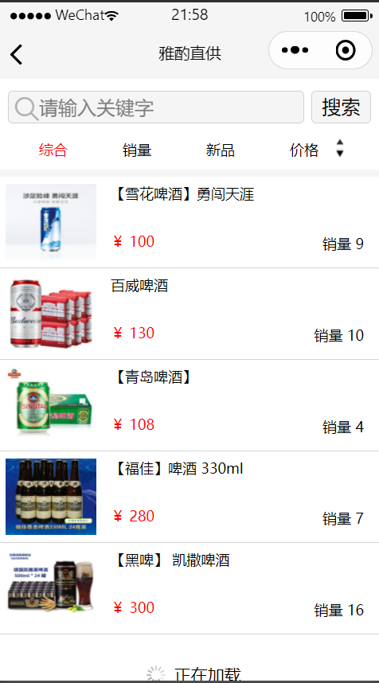
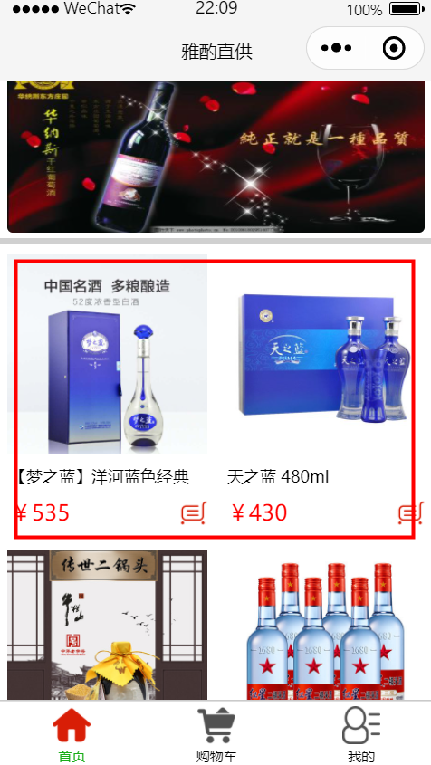
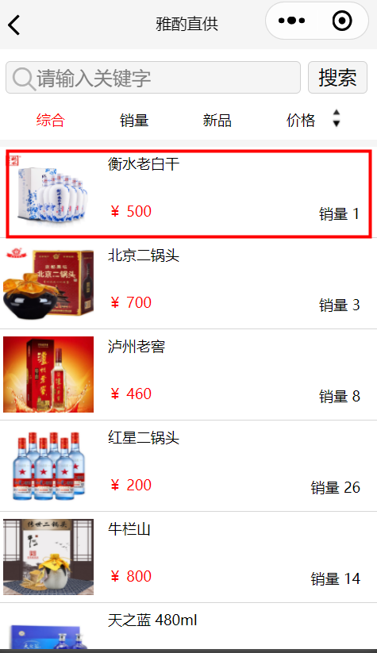
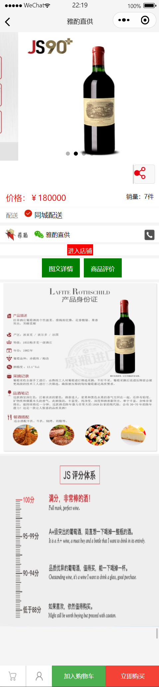
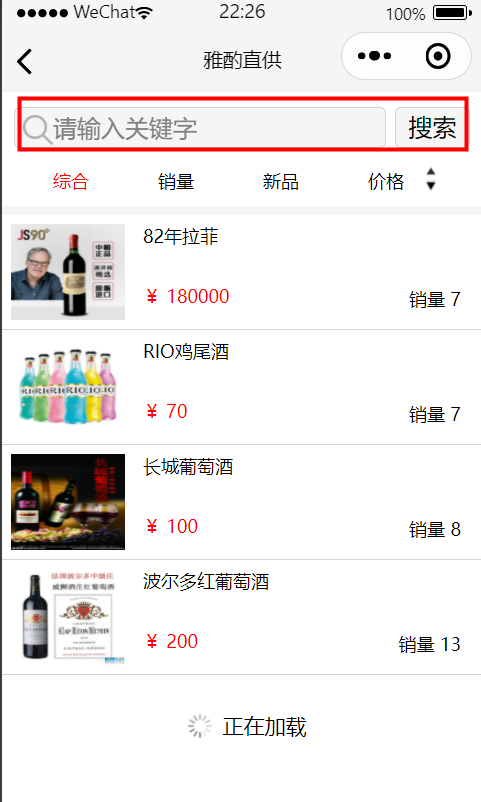
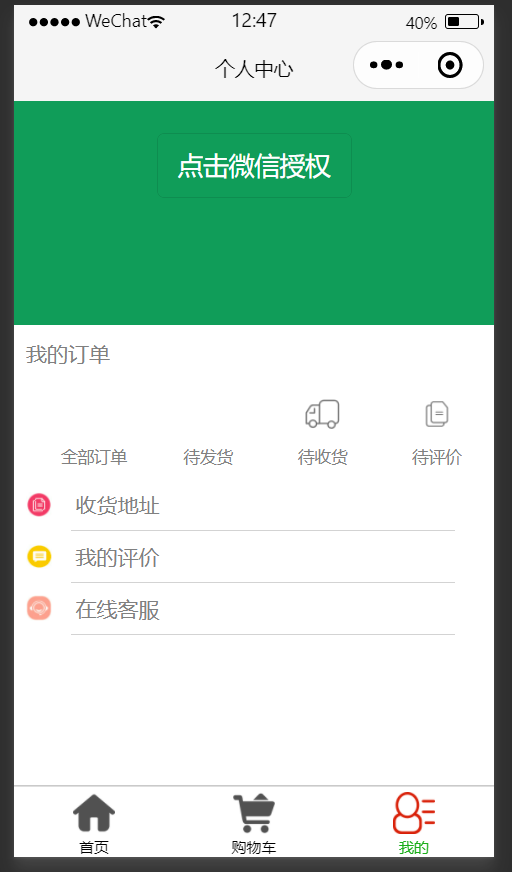
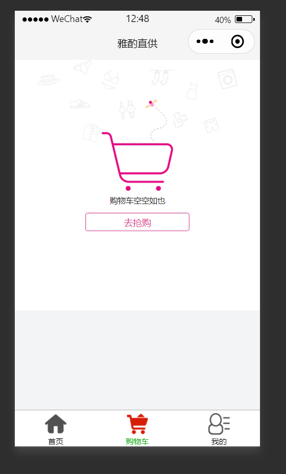
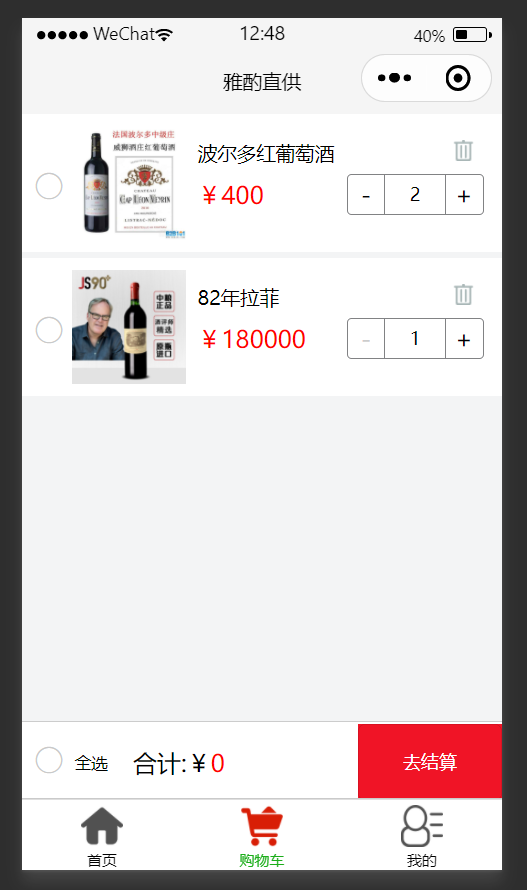

关于wx.request的二次封装：

```js
//在utils文件夹下创建http.js


//定义全局公共的访问基础路径
const baseUrl = "http://localhost:8808"
//封装函数
function http(options){
  return new Promise((resolve,reject)=>{
    wx.request({
      url: baseUrl+options.url,
      method:options.method || "GET",
      data:options.data || {},
      header:{
        token:wx.getStorageSync('token') || ""
      },
      success(res){
        /* if(res.code == 2000){
          resolve(res.data)
        }else{
          reject(res.data)
        } */
        resolve(res.data)
      },
      fail(){
        reject("请求失败！")
      }
    })
  })
}

module.exports = http;
```

2.也可以把所有的接口进行封装 放入一个api.js文件中 发请求时 只需要直接从api.js中导入即可。

```js
const http = require('./http')
//封装登录的接口
let login = async ()=>{
  let data = await http({
    url:'/system/login',
    method:"POST",
    data:{
      name:"admin",
      password:'123456'
    }
  })
  wx.setStorageSync('token', data.data.token)
  return data
}
//封装查询所有商品的接口

//修改商品的接口

module.exports = {
  login,
  ...,
  ...
}

//在需要使用的地方导入api.js文件使用接口
const {login} = require('../../utils/api')
```


所有图片的访问地址：https://dianjiu.oss-cn-beijing.aliyuncs.com  +  /AopAndMyBatis2/0b08d5e9-d6f3-45ce-9f3f-7b1d477e396d.jpeg 

### 1. 首页商品展示：



## 首页酒品展示 接口：

| url地址         | http://118.190.158.17:8006/AopAndMyBatis2/wxview/getFoursWine |
| --------------- | ------------------------------------------------------------ |
| method/请求方式 | get                                                          |
| params/携带参数 | 无                                                           |

### 2. 酒品分类：  



图中**酒品分类**和 **更多** 点击跳转到商品列表页：这两处是同一个接口



只展示当前选中酒品的类别。

## **酒品分类的id:**固定id值

啤酒:1   白酒:2    红酒:3   洋酒:4  

| url地址         | http://118.190.158.17:8006/AopAndMyBatis2/wxview/getWineClassify?id=' + id |
| --------------- | ------------------------------------------------------------ |
| method/请求方式 | get                                                          |
| params/参数     | id(必填)   表示当前酒品分类的  id                            |

## **列表页上拉加载更多**接口：

| url地址        | http://118.190.158.17:8006/AopAndMyBatis2/wxview/getWineClassifys?id=' + id + '&count=' + count |
| -------------- | ------------------------------------------------------------ |
| method请求方式 | get                                                          |
| params参数     | id就是当前酒品分类的id , count就是当前页面展示的数据的条数   |

### 3. 商品详情展示：





## 点击如上两图所示：点击进入商品详情页面，两处接口一致：

| url地址         | http://118.190.158.17:8006/AopAndMyBatis2/wxview/getOneWine?id=' + id |
| --------------- | ------------------------------------------------------------ |
| method/请求方式 | get                                                          |
| 参数            | id (此处id表示 点击的单独酒品的id)  不是分类Id               |


商品详情页：



## 4.列表页搜索框的查询



| url地址        | http://118.190.158.17:8006/AopAndMyBatis2/wxview/getWineClassify?name=' + 搜索框的值 |
| -------------- | ------------------------------------------------------------ |
| method请求方式 | get                                                          |
| params参数     | name 表示的搜索框输入的酒品名                                |

5.搜索框下边的 `综合`，`销量` ，`新品`，`价格升序/降序排列` 

# **其中`综合`与`新品`的接口：**

| url地址        | http://118.190.158.17:8006/AopAndMyBatis2/wxview/getWineClassify?id=' + id |
| -------------- | ------------------------------------------------------------ |
| method请求方式 | get                                                          |
| params参数     | id (此处id表示的是从 首页跳转来时 传递来的酒品分类的id值)    |

# **`销量`**接口：

| url地址        | http://118.190.158.17:8006/AopAndMyBatis2/wxview/getSalesClassify?id=' + id |
| -------------- | ------------------------------------------------------------ |
| method请求方式 | get                                                          |
| params参数     | id                                                           |

# **`价格升序`**接口：

| url地址        | http://118.190.158.17:8006/AopAndMyBatis2/wxview/getDescClassify?id=' + id |
| -------------- | ------------------------------------------------------------ |
| method请求方式 | get                                                          |
| params参数     | id                                                           |

# **`价格降序`**接口：

| url地址        | http://118.190.158.17:8006/AopAndMyBatis2/wxview/getAscClassify?id=' + id |
| -------------- | ------------------------------------------------------------ |
| method请求方式 | get                                                          |
| params参数     | id                                                           |





