语法参照 vue.js

api文档参照小程序 


editplus  sublime  notepadd++   dreamweaver  **vsCode  HbuilderX   webstorm**  

# 第一章：uni-app基础  

## 一、Uni-app简介 

### 1.1 uni-app的由来 

当前跨平台开发存在的三个问题，为解决这些问题，DCloud开发了这套终极跨平台解决方案uni-app。

1. 多端泛滥
2. 体验不好
3. 生态不丰富

### 1.2 什么是uni-app 

[官方网页](https://uniapp.dcloud.io/resource)

`uni-app` 是一个使用 [Vue.js](https://vuejs.org/) 开发所有前端应用的框架，开发者编写一套代码，可发布到iOS、Android、Web（响应式）、以及各种小程序（微信/支付宝/百度/头条/QQ/钉钉/淘宝）、快应用等多个平台。

即使不跨端，`uni-app`同时也是更好的小程序开发框架,更好的App跨平台框架、更方便的H5开发框架

具有vue和微信小程序的开发经验，可快速上手uni-app

为什么要去学习uni-app？

1. 一套代码，适配多个平台 (相对开发者来说，减少了学习成本，因为只学会uni-app之后，即可开发出iOS、Android、H5、以及各种小程序的应用，不需要再去学习开发其他应用的框架，相对公司而言，也大大减少了开发成本。)
2. 运行体验好（组件、api与微信小程序一致，兼容weex原生渲染）
3. 通用技术栈，学习成本低 （vue语法，小程序的api,内嵌mpvue）
4. 开放生态，组件更丰富
   1. 支持通过npm安装第三方包
   2. 支持微信小程序自定义组件及[SDK](https://baike.baidu.com/item/%E8%BD%AF%E4%BB%B6%E5%BC%80%E5%8F%91%E5%B7%A5%E5%85%B7%E5%8C%85/10418833?fromtitle=SDK&fromid=7815680&fr=aladdin)
   3. 兼容mpvue组件及项目
   4. App端支持和原生混合编码

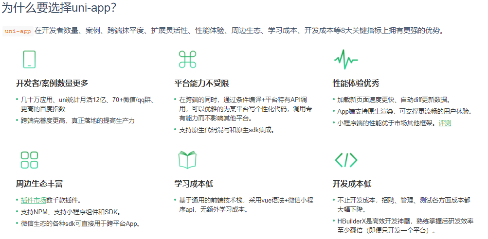

[一套代码，运行到多个平台](https://uniapp.dcloud.io/?id=一套代码，运行到多个平台)

`uni-app`实现了一套代码，同时运行到多个平台；如下图所示，一套代码，同时运行到iOS模拟器、Android模拟器、H5、微信开发者工具、支付宝小程序Studio、百度开发者工具、字节跳动开发者工具、QQ开发者工具（底部8个终端选项卡代表8个终端模拟器）：

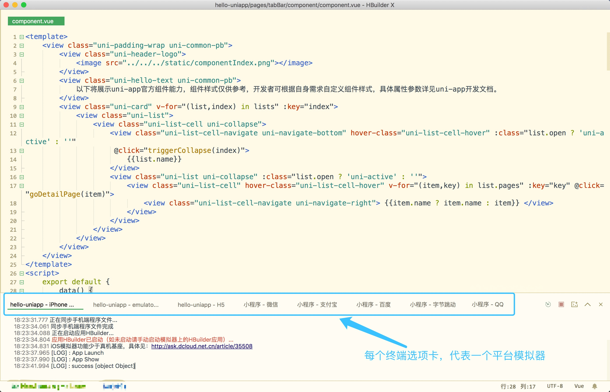

实际运行效果如下：

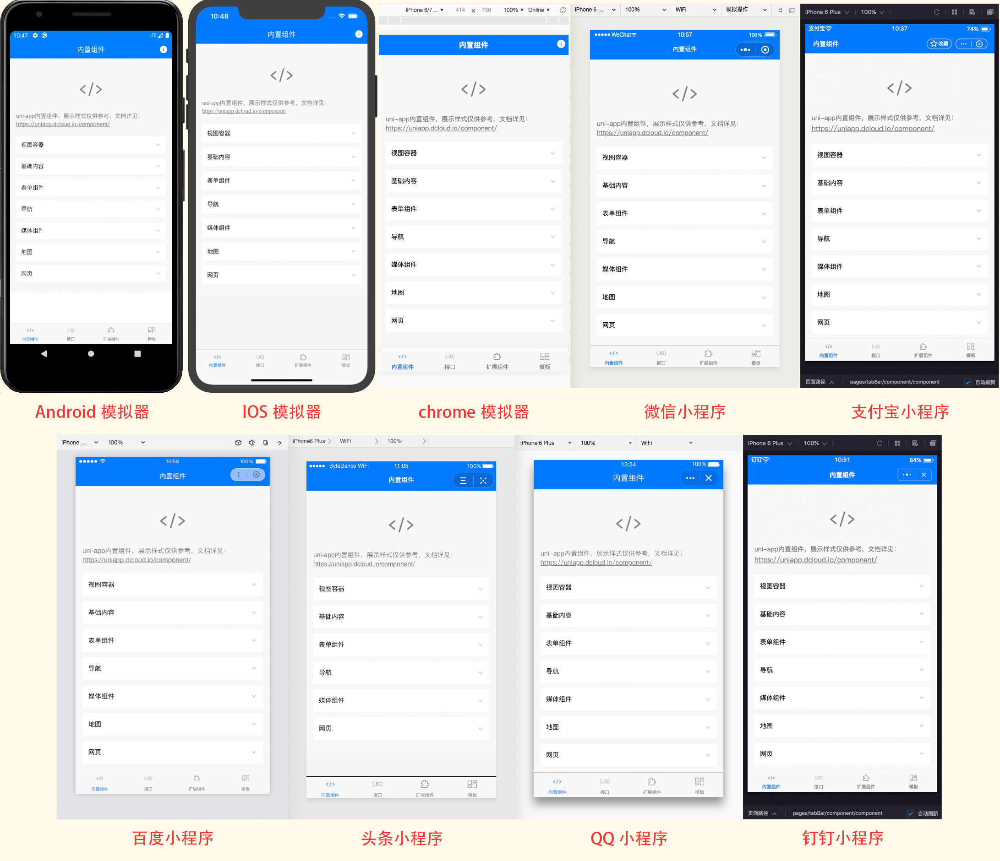

### 1.3 快速上手

#### 1.3.1 安装编辑器HbuilderX  [下载地址](https://www.dcloud.io/hbuilderx.html)

HBuilderX是通用的前端开发工具，但为`uni-app`做了特别强化。

下载App开发版，可开箱即用安装微信开发者工具 [下载地址](https://developers.weixin.qq.com/miniprogram/dev/devtools/download.html)

[利用HbuilderX初始化项目](https://uniapp.dcloud.io/quickstart-hx?id=%e5%88%9b%e5%bb%bauni-app)

+ 点击HbuilderX菜单栏文件>项目>新建

+ 选择uni-app,填写项目名称，项目创建的目录

#### 1.3.2 [运行项目](https://uniapp.dcloud.io/quickstart-hx?id=%e8%bf%90%e8%a1%8cuni-app)

1. **运行在浏览器中**

   ​	在菜单栏中点击运行，运行到浏览器，选择浏览器即可运行

2. **在微信开发者工具里运行：**

   进入项目，点击工具栏的运行 -> 运行到小程序模拟器 -> 微信开发者工具，即可在微信开发者工具里面体验uni-app

   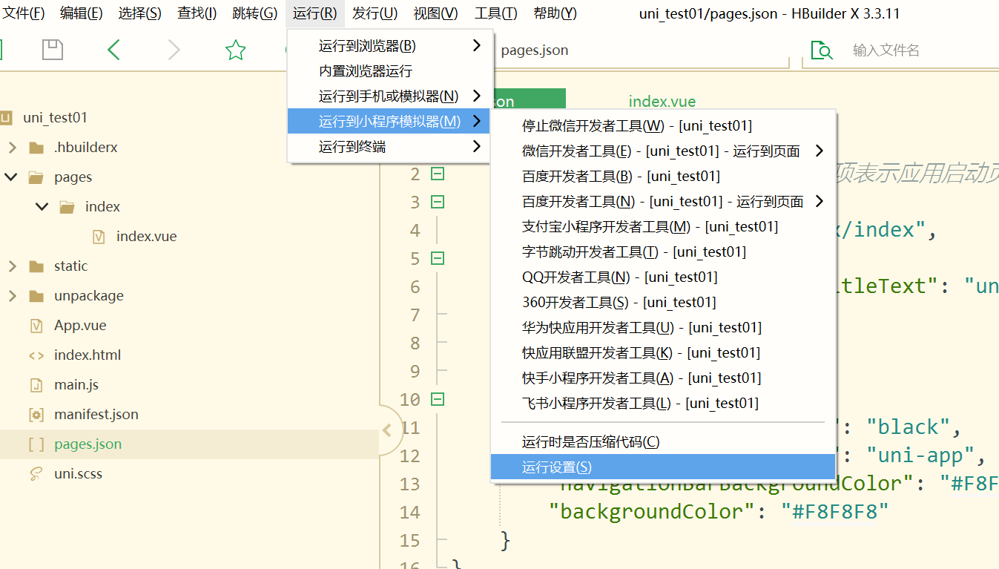
   
   **首次运行需要指定开发工具路径**

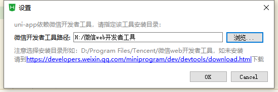

​		**第一次运行到小程序会报如图所示的错误：**

​		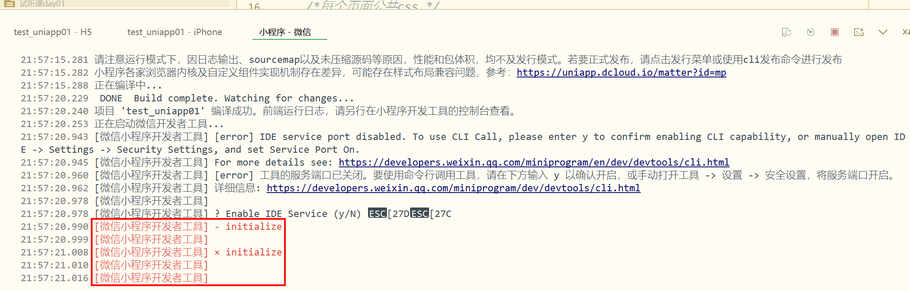

需要手动打开微信开发者工具配置 ----  安全配置----服务端口---开启；

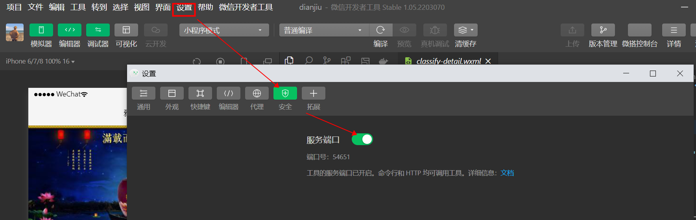

再次尝试运行：

可以直接打开微信开发者工具，观察运行结果。

3. **在手机或模拟器中运行：**

   进入项目，点击工具栏的运行 -> 运行到手机或模拟器 -> 选择调式的手机

   先下载真机运行插件

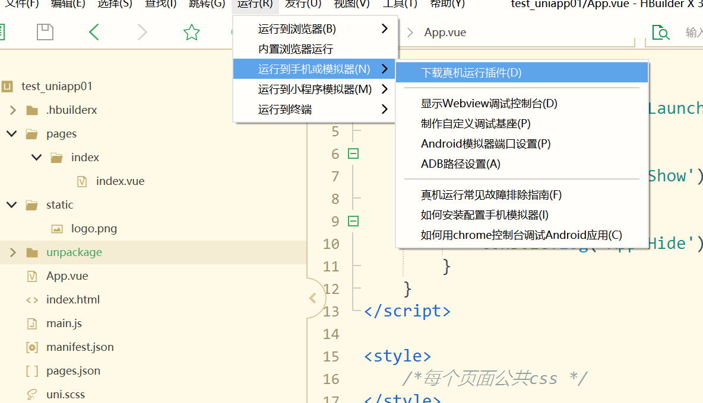

​		再次运行：

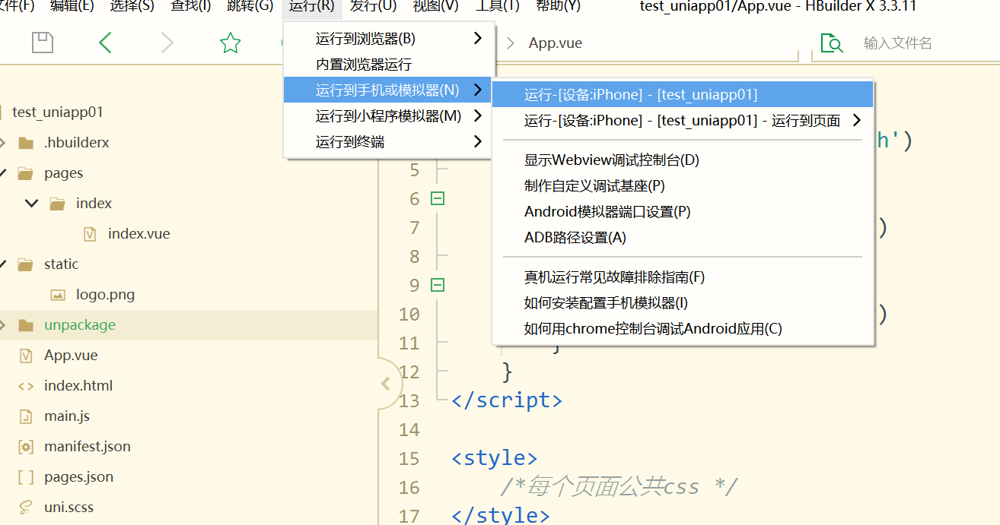

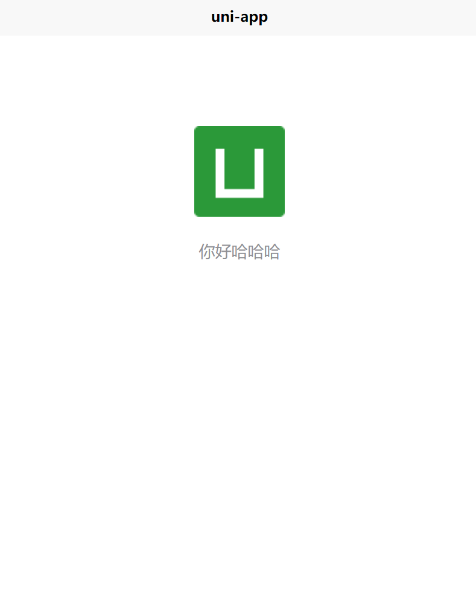

**注意：**

+ 如果是第一次使用，需要先配置小程序ide开发工具的相关路径，填写小程序Appid 才能运行成功
+ 微信开发者工具在设置中安全设置，服务端口开启

### 1.4 打包发布

1. 打包为原生APP（云端）
2. 打包为原生APP（离线）
3. 发布为H5
4. 发布为小程序


## 二、全局配置和页面配置

### 2.1 项目目录结构介绍

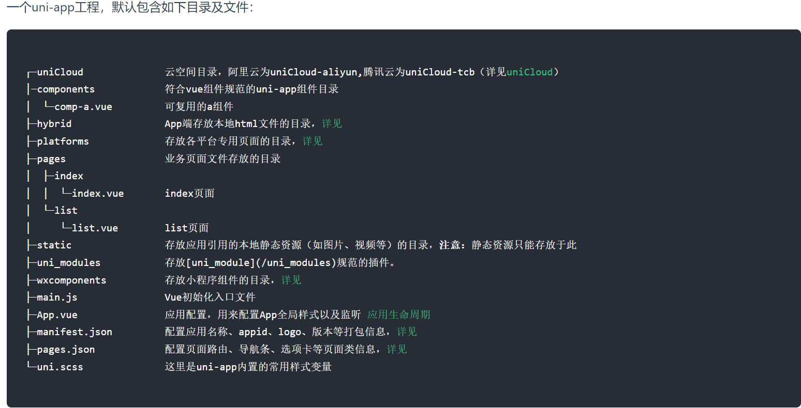

为了实现多端兼容，综合考虑编译速度、运行性能等因素，`uni-app` 约定了如下开发规范：

- 页面文件遵循 [Vue 单文件组件 (SFC) 规范](https://vue-loader.vuejs.org/zh/spec.html)
- 组件标签靠近小程序规范，详见[uni-app 组件规范](https://uniapp.dcloud.io/component/README)
- 接口能力（JS API）靠近微信小程序规范，但需将前缀 `wx` 替换为 `uni`，详见[uni-app接口规范](https://uniapp.dcloud.io/api/README)
- 数据绑定及事件处理同 `Vue.js` 规范，同时补充了App 及页面的生命周期
- 为兼容多端运行，建议使用flex布局进行开发

### 2.2 通过globalStyle进行全局配置（默认页面的窗口表现）

用于设置应用的状态栏、导航条、标题、窗口背景色等。[详细文档](https://uniapp.dcloud.io/collocation/pages?id=globalstyle)

| 属性                         | 类型     | 默认值  | 描述                                                         |
| ---------------------------- | -------- | ------- | ------------------------------------------------------------ |
| navigationBarBackgroundColor | HexColor | #F7F7F7 | 导航栏背景颜色（同状态栏背景色）                             |
| navigationBarTextStyle       | String   | white   | 导航栏标题颜色及状态栏前景颜色，仅支持 black/white           |
| navigationBarTitleText       | String   |         | 导航栏标题文字内容                                           |
| backgroundColor              | HexColor | #ffffff | 窗口的背景色                                                 |
| backgroundTextStyle          | String   | dark    | 下拉 loading 的样式，仅支持 dark / light                     |
| enablePullDownRefresh        | Boolean  | false   | 是否开启下拉刷新，详见[页面生命周期](https://uniapp.dcloud.io/use?id=%e9%a1%b5%e9%9d%a2%e7%94%9f%e5%91%bd%e5%91%a8%e6%9c%9f)。 |
| onReachBottomDistance        | Number   | 50      | 页面上拉触底事件触发时距页面底部距离，单位只支持px，详见[页面生命周期](https://uniapp.dcloud.io/use?id=%e9%a1%b5%e9%9d%a2%e7%94%9f%e5%91%bd%e5%91%a8%e6%9c%9f) |

### 2.3 页面配置

右键pages新建demo目录，在demo目录下右键新建.vue文件,并选择基本模板

```html
<template>
	<view>
		demo
	</view>
</template>

<script>
</script>

<style>
</style>
```

#### 2.3.1 通过pages来配置页面

| 属性  | 类型   | 默认值 | 描述                                                         |
| ----- | ------ | ------ | ------------------------------------------------------------ |
| path  | String |        | 配置页面路径                                                 |
| style | Object |        | 配置页面窗口表现，配置项参考 [pageStyle](https://uniapp.dcloud.io/collocation/pages?id=style) |

pages数组数组中第一项表示应用启动页

```html
"pages": [ 
		{
			"path":"pages/message/message"
		},
		{
			"path": "pages/index/index",
			"style": {
				"navigationBarTitleText": "uni-app"
			}
		}
	]
```

通过style修改页面的标题和导航栏背景色，并且设置h5下拉刷新的特有样式

```js
"pages": [ //pages数组中第一项表示应用启动页，参考：https://uniapp.dcloud.io/collocation/pages
		{
			"path":"pages/message/message",
			"style": {
				"navigationBarBackgroundColor": "#007AFF",
				"navigationBarTextStyle": "white",
				"enablePullDownRefresh": true,
				"disableScroll": true,
				"h5": {
					"pullToRefresh": {
						"color": "#007AFF"
					}
				}
			}
		}
	]
```

#### 2.3.2 配置tabbar

如果应用是一个多 tab 应用，可以通过 tabBar 配置项指定 tab 栏的表现，以及 tab 切换时显示的对应页。

**Tips**

- 当设置 position 为 top 时，将不会显示 icon
- tabBar 中的 list 是一个数组，只能配置最少2个、最多5个 tab，tab 按数组的顺序排序。

**属性说明：**

| 属性            | 类型     | 必填 | 默认值 | 描述                                                 | 平台差异说明              |
| --------------- | -------- | ---- | ------ | ---------------------------------------------------- | ------------------------- |
| color           | HexColor | 是   |        | tab 上的文字默认颜色                                 |                           |
| selectedColor   | HexColor | 是   |        | tab 上的文字选中时的颜色                             |                           |
| backgroundColor | HexColor | 是   |        | tab 的背景色                                         |                           |
| borderStyle     | String   | 否   | black  | tabbar 上边框的颜色，仅支持 black/white              | App 2.3.4+ 支持其他颜色值 |
| list            | Array    | 是   |        | tab 的列表，详见 list 属性说明，最少2个、最多5个 tab |                           |
| position        | String   | 否   | bottom | 可选值 bottom、top                                   | top 值仅微信小程序支持    |

其中 list 接收一个数组，数组中的每个项都是一个对象，其属性值如下：

| 属性             | 类型   | 必填 | 说明                                                         |
| ---------------- | ------ | ---- | ------------------------------------------------------------ |
| pagePath         | String | 是   | 页面路径，必须在 pages 中先定义                              |
| text             | String | 是   | tab 上按钮文字，在 5+APP 和 H5 平台为非必填。例如中间可放一个没有文字的+号图标 |
| iconPath         | String | 否   | 图片路径，icon 大小限制为40kb，建议尺寸为 81px * 81px，当 postion 为 top 时，此参数无效，不支持网络图片，不支持字体图标 |
| selectedIconPath | String | 否   | 选中时的图片路径，icon 大小限制为40kb，建议尺寸为 81px * 81px ，当 postion 为 top 时，此参数无效 |

案例代码：

```js
"tabBar": {
		"list": [
			{
				"text": "首页",
				"pagePath":"pages/index/index",
				"iconPath":"static/tabs/home.png",
				"selectedIconPath":"static/tabs/home-active.png"
			},
			{
				"text": "信息",
				"pagePath":"pages/message/message",
				"iconPath":"static/tabs/message.png",
				"selectedIconPath":"static/tabs/message-active.png"
			},
			{
				"text": "我们",
				"pagePath":"pages/contact/contact",
				"iconPath":"static/tabs/contact.png",
				"selectedIconPath":"static/tabs/contact-active.png"
			}
		]
	}
```

#### 2.3.3 condition启动模式配置

启动模式配置，仅开发期间生效，用于模拟直达页面的场景，如：小程序转发后，用户点击所打开的页面。

**属性说明：**

| 属性    | 类型   | 是否必填 | 描述                             |
| ------- | ------ | -------- | -------------------------------- |
| current | Number | 是       | 当前激活的模式，list节点的索引值 |
| list    | Array  | 是       | 启动模式列表                     |

**list说明：**

| 属性  | 类型   | 是否必填 | 描述                                                         |
| ----- | ------ | -------- | ------------------------------------------------------------ |
| name  | String | 是       | 启动模式名称                                                 |
| path  | String | 是       | 启动页面路径                                                 |
| query | String | 否       | 启动参数，可在页面的 [onLoad](https://uniapp.dcloud.io/use?id=%e9%a1%b5%e9%9d%a2%e7%94%9f%e5%91%bd%e5%91%a8%e6%9c%9f) 函数里获得 |

**注意：** 在 App 里真机运行可直接打开配置的页面，微信开发者工具里需要手动改变编译模式，如下图：

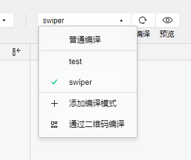

```json
"condition": { //模式配置，仅开发期间生效
    "current": 0, //当前激活的模式（list 的索引项）
    "list": [{
            "name": "swiper", //模式名称
            "path": "pages/component/swiper/swiper", //启动页面，必选
            "query": "interval=4000&autoplay=false" //启动参数，在页面的onLoad函数里面得到。
        },
        {
            "name": "test",
            "path": "pages/component/switch/switch"
        }
    ]
}
```
