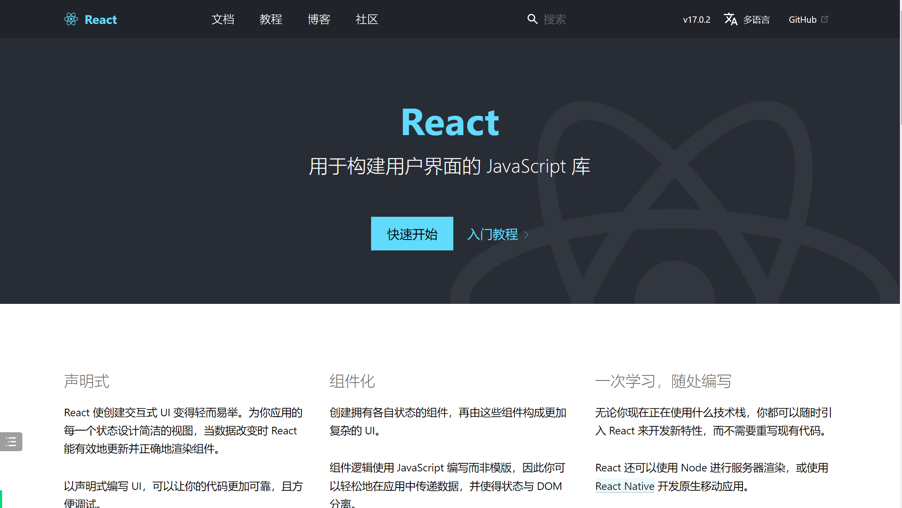
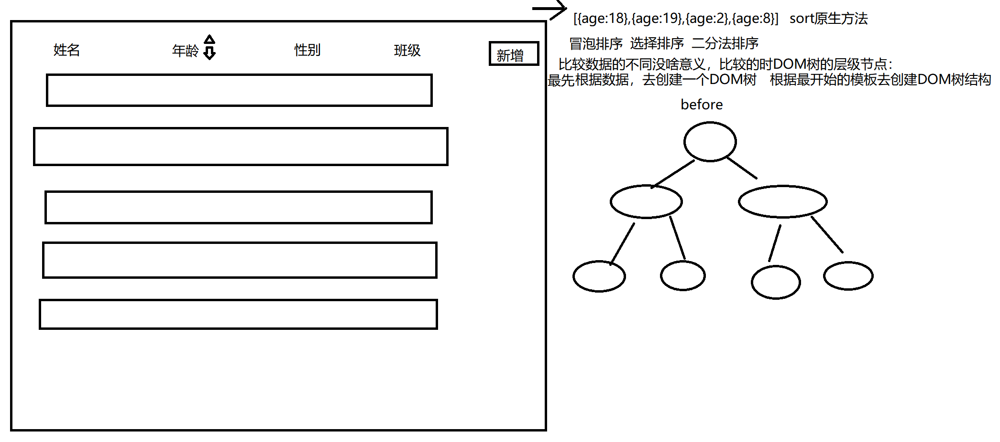
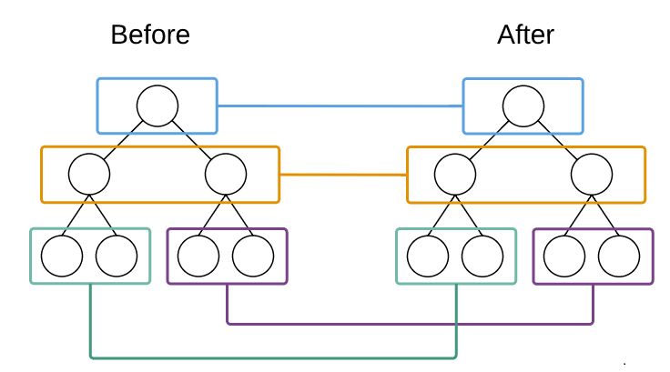
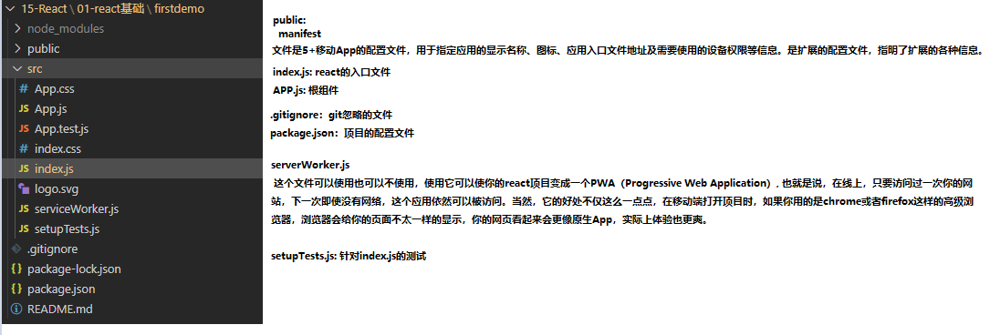
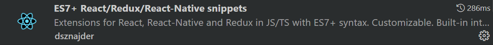
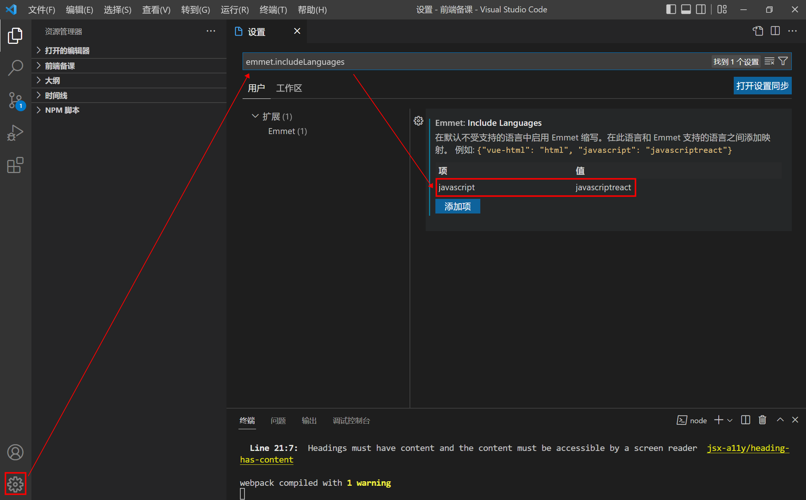

# 第一章：React 基础

### 本章目标：

1. 了解什么是react
2. React与vue的区别
3. react的虚拟DOM和diff算法
4. React在普通的html页面的使用
5. react脚手架
6. jsx语法
7. 函数式组件
8. useState  hook

## 一、React JS简介 

react 技术一线大厂必备。 13年  es5  18

大型的项目：react 居多   健壮性强(更贴近原生js) ，运行效率。。。更高一些 使用时会比vue复杂一些。

中小型项目：vue居多 

BS方向: brower  server 浏览器

CS方向:client server  客户端


vue: 结合 `weex` 可以做原生开发

react:结合[React Native](https://reactnative.dev/)  可以做原生开发

### 1.1 简介 



react : MVC框架  Model(数据模型)   view(视图页面)   Controller(控制器--》js代码(函数))

vue : MVVM框架 Model   view    ViewModel 

+ React 起源于 Facebook(脸书) 的内部项目，因为该公司对市场上所有 JavaScript MVC 框架，都不满意，就决定自己写一套，用来架设 Instagram 的网站。做出来以后，发现这套东西很好用，**就在2013年5月开源了**。

+ 官方对react的定位是：用于构建用户界面的 JavaScript 库

+ 轻量级前端框架，支持JSX（JavaScript XML）语法，jsx是js内定义的一套XML语法，最终被解析成 js。在JSX中可以将HTML与JS混写；

  html1.0  html2.0====>xml（严格版的html）

  XML：同html  支持你 像编写js代码一样编写html代码。

+ 同样采用虚拟DOM（不总是直接操作dom），Diff(different)算法（最小化页面重绘）高效。

#### 官网

英文官网:[ https://reactjs.org/](https://reactjs.org/) 

中文官网: https://react.docschina.org/

### 1.2 React与vue.js的对比



#### 虚拟Dom  

- vue和react都采用了虚拟dom算法，以最小化更新真实DOM，从而减小不必要的性能损耗。

- Vue的虚拟dom是基于 snabbdom (虚拟DOM库)库所做的修改，为了保证页面的最小优化，snabbdom引入了diff算法，通过Diff算法找出前后两个虚拟DOM树之间的差异，只更新改变了的DOM节点，而不重新渲染未改变的DOM节点。

- react定义的一种类似于XML的JS扩展语法：JSX。作用是用来创建react虚拟DOM。React使用JSX编写虚拟DOM对象，经过Babel 编译之后会生成真正的DOM. 然后会将真正的DOM插入(Render)到页面。

  

#### 组件化方面 

import  export   require()

1. 模块化：从 **代码** 的角度，去分析问题，把我们编程时候的业务逻辑，分割到不同的模块中来进行开发，这样能够**方便代码的重用**；
2. 组件化：从 **UI** 的角度，去分析问题，把一个页面，拆分为一些互不相干的小组件，随着我们项目的开发，我们手里的组件会越来越多，最后，我们如果要实现一个页面，可能直接把现有的组件拿过来进行拼接，就能快速得到一个完整的页面， 这样方**便了UI元素的重用**；**组件是元素的集合体**；
3. Vue是如何实现组件化的：.vue 组件模板文件，浏览器不识别这样的.vue文件，所以，在运行前，会把 .vue 预先编译成真正的组件；

   - template： UI结构
   - script： 业务逻辑和数据
   - style： UI的样式

   4.React如何实现组件化：在React中实现组件化的时候，根本没有 像 .vue 这样的模板文件，而是，直接使用JS代码的形式，去创建任何你想要的组件；React.createElement('div') 通过react(封装)的方式来创建节点。

 + React中的组件，都是直接在 js 文件中定义的（.js   /   .jsx）；

 + React的组件，并没有把一个组件 拆分为 三部分（结构、样式、业务逻辑），而是全部使用JS来实现一个组件的；（也就是说：结构、样式、业务逻辑是混合在JS里面一起编写出来的）

   

#### 移动APP开发

+ Vue，结合 Weex 这门技术，提供了 迁移到 移动端App开发的体验
+ React，结合 ReactNative，提供了迁移到 移动App的开发体验（RN用的最多，也是最火最流行的）；

#### 轻量化

都把注意力集中保持在核心库，而将其他功能如**路由**和**全局状态管理**交给相关的库。(vue-router、vuex、react-router、redux等等)

### 1.3 React中几个核心的概念

#### 1.3.1 虚拟DOM（Virtual Document Object Model）====> VNode

 + DOM的本质是什么：Document Object Model  页面元素  JS表示的UI界面元素 
 + DOM和虚拟DOM的区别：
   - DOM是由浏览器中的JS提供功能，所以我们只能人为的使用 浏览器提供的固定的API来操作DOM对象；
   - 虚拟DOM：并不是由浏览器提供的，而是我们程序员手动模拟实现的，类似于浏览器中的DOM，但是有着本质的区别；

 - 为什么要实现虚拟DOM：
   - JavaScript需要借助浏览器提供的DOM接口才能操作真实DOM，修改DOM经常导致页面重绘，所以一般来说，DOM操作越多，网页的性能就越差
   - 真实的DOM中，过多的内容修改，会带来多次的页面重绘，极大的损耗页面的性能。
   - 而在使用虚拟DOM时，不管一次修改了多少内容，最后只会发生一次页面的重绘，大大的提高了页面的性能。
   - 虚拟DOM设计的核心就是用高效的js操作，来减少低性能的DOM操作，以此来提升网页性能。
   - DOM渲染是最耗费内存资源的。
 - 虚拟DOM的目的： 
   - 虚拟DOM并不能消除原生的DOM操作，你仍然需要通过浏览器提供的DOM接口来操作真实DOM树，才能使页面发生改变。虚拟DOM的设计似乎是多此一举。
   - 但是虚拟DOM带来了一个重要的优势，那就是我们可以在完全不访问真实DOM的情况下，掌握DOM的结构
   - 如果我们本打算手动进行三次真实DOM操作，有了虚拟DOM结构后，把这三次DOM操作简化成了一次，这不就带来了性能上的提升
 - React中的虚拟dom
   - React中使用`jsx`语法定义模板时，React会用它生成一个由JavaScript描述的虚拟DOM树，并将其保存在JavaScript内存中。这个虚拟DOM树还保留了我们在模板中定义的数据和视图的绑定关系，这为React自动根据数据变化更新视图提供了可能。随后当数据发生变化时，React重新生成一个虚拟DOM树，通过对比两个虚拟DOM树的差异，React就可以知道该如何高效地更新视图。接着它就会调用原生的DOM接口，去更新真实DOM。


#### 1.3.2 Diff算法 

diff算法其实就是对DOM进行different比较的一种算法,简单来说Diff算法在虚拟DOM上实现，是虚拟DOM的加速器，提升性能的法宝.

React 需要同时维护两棵虚拟DOM树：一棵表示当前的DOM结构，另一棵在React状态变更将要重新渲染时生成。React通过比较这两棵树的差异，决定是否需要修改DOM结构，以及如何修改。

 - tree diff:新旧DOM树，**逐层对比**的方式，就叫做 tree diff,每当我们从前到后，把所有层的节点对比完后，必然能够找到那些 需要被更新的元素；
 - component diff：在对比每一层的时候，组件之间的对比，叫做 component diff;当对比组件的时候，如果两个组件的类型相同，则暂时认为这个组件不需要被更新，如果组件的类型不 同，则立即将旧组件移除，新建一个组件，替换到被移除的位置；
 - element diff:在组件中，每个元素之间也要进行对比，那么，元素级别的对比，叫做 element diff；
 - key：key这个属性，可以把 页面上的 DOM节点 和 虚拟DOM中的对象，做一层关联关系；
   

### 

## 二、React的基本使用

### 2.1 html页面中使用react 

- html中准备一个React容器,用作react的作用范围

- ```html
  .....
  <div id="box"></div>
  <!--你可以像这样在 <body> 标签内的任意位置放置一个“容器” <div>。根据需要，你可以在一个页面上放置多个独立的 DOM 容器。它们通常是空标签 —— React 会替换 DOM 容器内的任何已有内容。-->
  .....
  ```

- 添加Script标签

- ```js
  #在 </body> 结束标签之前，向 HTML 页面中添加以下标签：
  <script crossorigin src="https://unpkg.com/react@16/umd/react.development.js"></script>
  <script crossorigin src="https://unpkg.com/react-dom@16/umd/react-dom.development.js"></script>
  <script>
  	#在此书写你的React代码
    // 创建虚拟dom
    let btnEle1 = React.createElement('button',{
          id:'aaa',
          className:'bbb',
          onClick:function(){
              alert('你好哈哈哈')
          }
      },'这是一个按钮',null)
      let btnEle2 = React.createElement('button',{
          id:'aaa',
          className:'bbb',
          onClick:function(){
              alert('你好嘿嘿')
          }
      },'这是一个按钮',null)
      let divEle = React.createElement('div',{
          id:'max'
      },'文本内容',[btnEle1,btnEle2],'<div>文本内容</div>');
  
  	//渲染DOM结构
      ReactDOM.render(divEle,document.getElementById('app'))
  
  </script>
  
  #语法解释
  1.React 提供了createElement(type,props,[...child])方法返回指定类型的新 React 元素(虚拟dom)，
  	type：dom类型
  	props:虚拟dom的属性
  	child:子元素
  2.ReactDOM提供 render(virtualDOM, containerDOM) 将虚拟DOM元素渲染到页面中的真实容器DOM中显示
  	virtualDOM:js或jsx创建的虚拟dom对象
  	containerDOM:用来包含虚拟DOM元素的真实dom元素对象(div)
  //如果是react18推荐使用ReactDOM.createRoot方法来进行渲染
          /*  let root1 = ReactDOM.createRoot(document.getElementById('root'))
           root1.render(h1) */
  ###劣势
  1.以上创建虚拟dom的方式繁琐冗余，不能很方便的大量创建虚拟dom ----  解决方案  jsx语法
  2.script便签引入形式难以实现单页面应用，对前端工程化不友好   ----  解决方案  React脚手架创建应用
  
  ###注意 html页面中如果想使用jsx语法需要再导入babel转码器
  <!-- 使用babel转码器 来对jsx进行语法解析 -->
  <script src="https://cdn.staticfile.org/babel-standalone/6.26.0/babel.min.js"></script>
  并在script标签中添加 type="text/babel"属性
  <script type="text/babel"></script>
  
  ```

### 2.2 使用React创建应用(脚手架) 

**Create React App** 的官方文档：https://create-react-app.bootcss.com/  react脚手架

umijs  https://umijs.org/


```
npx create-react-app name   || npm init react-app my-app
cd name
npm start
```

目录结构分析：



- reportWebVitals：性能分析文件

  - web-vitals是Google发起的，旨在提供各种质量信号的统一指南，我们相信这些质量信号对提供出色的网络用户体验至关重要。
    其可获取三个关键指标（CLS、FID、LCP）和两个辅助指标（FCP、TTFB）

  - FCP:首次内容绘制是浏览器将第一个DOM渲染到屏幕的时间，可以是任何文本、图像、SVG等的时间

    TTFB:指浏览器发起第一个请求到数据返回第一个字节所消耗的时间，这个时间包括了网络请求时间、后端处理时间

    LCP:代表在viewport中最大的页面元素加载时间

    CLS:是衡量用户[视觉稳定性的](https://web.dev/user-centric-performance-metrics/#types-of-metrics)一项重要的以用户为中心的度量标准

- App.test.js: 测试用例文件   npm test

  

2. 项目中导入的两个相关的包：

```
// 1. 在 React 学习中，需要安装 两个包 react  react-dom
// 1.1 react 这个包，是专门用来创建React组件、组件生命周期等这些东西的；
// 1.2 react-dom 里面主要封装了和 DOM 操作相关的包，比如，要把 组件渲染到页面上
import React from 'react'
import ReactDOM from 'react-dom'
```

3. 使用JS的创建虚拟DOM节点：

```
// 2. 在 react 中，如要要创建 DOM 元素了，只能使用 React 提供的 JS API 来创建，不能【直接】像 Vue 中那样，手写 HTML 元素
// React.createElement() 方法，用于创建 虚拟DOM 对象，它接收 3个及以上的参数
// 参数1： 是个字符串类型的参数，表示要创建的元素类型
// 参数2： 是一个属性对象，表示 创建的这个元素上，有哪些属性
// 参数3： 从第三个参数的位置开始，后面可以放好多的虚拟DOM对象，这些参数，表示当前元素的子节点

<h1>这是一个大大的H1</h1>
var myH1 = React.createElement('h1', null, '这是一个大大的H1')

// <div title="this is a div" id="mydiv" class="mydiv">这是一个div</div>
var myDiv = React.createElement('div', { title: 'this is a div', id: 'mydiv' ,className:'mydiv'}, '这是一个div', myH1)
```

4. 使用 ReactDOM 把元素渲染到页面指定的容器中：

```
// ReactDOM.render('要渲染的虚拟DOM元素', '要渲染到页面上的哪个位置中')
// 注意： ReactDOM.render() 方法的第二个参数，和vue不一样，不接受 "#app" 这样的字符串，而是需要传递一个 原生的 DOM 对象
ReactDOM.render(myDiv, document.getElementById('app'))
```


### 2.3 练习：

创建React应用 

## 三、JSX语法

### 3.1 jsx语法

```js
#这种既不是字符串也不是 HTML的标签语法，我们称之为jsx
let vNode = <h1>Hello, world!</h1>;
```

JSX是一种JavaScript的语法扩展，运用于[React](https://baike.baidu.com/item/React/18077599)架构中，其格式比较像是模版语言，但事实上完全是在[JavaScript](https://baike.baidu.com/item/JavaScript/321142)内部实现的，它具有 JavaScript 的全部功能。元素是构成React应用的最小单位，JSX就是用来声明React当中的元素，React使用JSX来描述用户界面。

1. 当编译引擎，在编译JSX代码的时候，如果遇到了`<`那么就把它当作 HTML代码去编译，如果遇到了 `{}` 就把 花括号内部的代码当作 普通JS代码去编译；在{}内部，可以写任何符合JS规范的代码；

   ```js
   #如果要在 JSX 语法内部，书写 JS 代码了，那么，所有的JS代码，必须写到 {} 内部；
   let title = 'this is a title';
   let mydiv = <div> 
     这是使用功jsx语法创建的div元素
     <h1 title={title}>这是一个h1</h1> 
   </div>
   
   #在 JSX 语法中，你可以在大括号内放置任何有效的 JavaScript 表达式
   <li>{2 + 2}</li>
   <li>{fn()}</li>
   ```

   

2. JSX语法的本质：还是以 React.createElement 的形式来实现的，并没有直接把 用户写的 HTML代码，渲染到页面上，以下两种示例代码完全等效；

   ```js
   const element = (
     <h1 className="greeting">
       Hello, world!
     </h1>
   );
   
   const element = React.createElement(
     'h1',
     {className: 'greeting'},
     'Hello, world!'
   );
   ```

   

3. 因为 JSX[javascript xml] 语法上更接近 JavaScript 而不是 HTML，所以 React DOM 使用 `camelCase`（小驼峰命名）来定义属性的名称，而不使用 HTML 属性名称的命名约定。

   在JSX中，如果要为元素添加`class`属性了，那么，必须写成`className`，因为 `class`在ES6中是一个关键字；和`class`类似，label标签的 `for` 属性需要替换为 `htmlFor` ， `tabindex` 则变为 tabIndex 。

   ```HTML
   <li className="lisi" >李四</li>
   <label htmlFor="user">用户名</label>
   ```

4. 在jsx语法中如果想写内联样式需要使用 `{{key:value,key:value}}`包起来 其中的属性如果是多个单词需要使用小驼峰格式命名。

   ```jsx
   let text = "你好哈哈"
   let a = "aaa"
   let h1Ele = <h1 id={a} style={{ color: 'white', backgroundColor: 'red' }}>{text}</h1>
   ```

5. 在JSX创建DOM的时候，所有的节点，必须有唯一的**根元素**进行包裹；

6. 如果要写注释了，注释必须放到 {} 内部 

   ```
   {/* 我是注释 */}
   ```

7. jsx解析标签的规则：

   ```
   // 如果首字母是小写的，那么就是按照普通的html标签来解析的。
   // 如果首字母是大写的，那么就按照组件的形式去解析。 
   // 组件的首字母必须是大写
   ```
   

### 3.2 列表渲染 

**案例练习：** 使用jsx语法完成列表的渲染。示例如下图


```jsx
<!DOCTYPE html>
<html>

<head>
    <meta charset="UTF-8">
    <meta name="viewport" content="width=device-width, initial-scale=1.0,maximum=1.0,minimum-scale=1.0,user-scalable=0">
    <meta http-equiv="X-UA-Compatible" content="ie=edge">
    <title>Document</title>
    <link rel="stylesheet" href="">
    <script src="https://unpkg.com/react@17/umd/react.development.js" crossorigin></script>
    <script src="https://unpkg.com/react-dom@17/umd/react-dom.development.js" crossorigin></script>
    <script src="https://cdn.staticfile.org/babel-standalone/6.26.0/babel.min.js"></script>
</head>

<body>
    <div id="box"></div>

    <script type="text/babel">
        let arr = ['任务一', '任务二', '任务三']
        let VDOM = (
            <div>
                <h1>任务展示：</h1>
                <ul>
                    {
                        arr.map((item, index) => <li key={index}>{item}</li>)
                    }
                </ul>
            </div>
        )
        ReactDOM.render(VDOM, document.getElementById('box'))
        /* let root = ReactDOM.createRoot(document.getElementById('box'))
        root.render(h1Ele) */
    </script>
</body>

</html>
注意：以后会经常使用到map函数对列表进行处理。 react中所有的列表渲染都是采用 map函数       
一定要掌握。
```

### 3.3 diff算法

通过以上列表渲染案例 通过动态更改数组中内容的多少观察浏览器控制台中element元素的变化，变成紫色表示重新渲染了，否则表示没有发生改变。

页面中本身存在一个列表结构，点击按钮时 把列表中重新添加一项，根据不同的添加位置来观察浏览器控制台中element元素的变化。

```js
<!DOCTYPE html>
<html>

<head>
    <meta charset="UTF-8">
    <meta name="viewport" content="width=device-width, initial-scale=1.0,maximum=1.0,minimum-scale=1.0,user-scalable=0">
    <meta http-equiv="X-UA-Compatible" content="ie=edge">
    <title>Document</title>
    <link rel="stylesheet" href="">
    <script src=""></script>
    <script src="https://unpkg.com/react@18/umd/react.development.js" crossorigin></script>
    <script src="https://unpkg.com/react-dom@18/umd/react-dom.development.js" crossorigin></script>
    <script src="https://unpkg.com/babel-standalone@6/babel.min.js"></script>
</head>

<body>
    <button onclick="changeArr()">点我</button>
    <hr>
    <div id="app"></div>
    <script type="text/babel">
        let arr = ['任务一', '任务二', '任务三'];
        let content = (
            <ul>
                {arr.map(item => <li key={item}>{item}</li>)}
            </ul>
        )

        ReactDOM.render(content, document.getElementById('app'))


        function changeArr() {
            let arr = ['任务四', '任务一', '任务二', '任务三'];
            let content = (
                <ul>
                    {arr.map(item => <li key={item}>{item}</li>)}
                </ul>
            )

            ReactDOM.render(content, document.getElementById('app'))
        }
    </script>
</body>

</html>
```


### 3.4 jsx语法提示插件

安装插件：



快速补全react代码  点击左上角文件 --> 首选项 -->设置 

在搜索框中输入 emmet.includeLanguages



key值是:javascript  value值是： javascriptreact

之后就可以在jsx语法中正常写html标签了，有语法提示。


## 四、函数组件 

```
// 在react中，构造函数，就是一个最基本的组件
// 如果想要把组件放到页面中，可以把构造函数的名字，当做组件的名称，以html标签的形式引入页面中。
// 注意：react在解析所有的标签的时候，是以标签的首字母来区分的，
// 如果首字母是小写的，那么就是按照普通的html标签来解析的。
// 如果首字母是大写的，那么就按照组件的形式去解析。 
// 组件的首字母必须是大写
function Hello(){
 return <div>
  <h1>这是在Hello组件中定义的元素</h1>
 </div>
}
ReactDom.render(<Hello></Hello>,document.getElementById('root'));
```

### 4.1 将组件封装到单独的文件中

src

​	components

​		hello.js 组件

```react
hello.js组件

import React from 'react';
function Hello(props){
  return <div >
  <h1>这是在Hello组件中定义的元素</h1>
    <div>姓名：{props.name}</div>
    <div>年龄：{props.age}</div>
    <div>工作：{props.job}</div>
  </div>
}
export default Hello;
```

```react
index.js
import Hello from './components/hello.js'
```

### 4.2 组件中的props属性

父组件向子组件传递数据

```js
let obj = {
  name:'lisi',
  age:20,
  job:'xuesheng'
}
function Hello(props){
//在组件中，如果想要使用从外部传递过来 的数据，必须显式的在构造函数参数列表中，定义props属性来接收
//通过props得到的数据都是只读的，不能修改
// props.name = 'aaa';
  return <div>
    <h1>这是在Hello组件中定义的元素</h1>
    <div>姓名：{props.name}</div>
    <div>年龄：{props.age}</div>
    <div>工作：{props.job}</div>
  </div>
}
ReactDOM.render(
//展开运算符
  //<Hello {...obj}/>
    <Hello name={obj.name} age={obj.age} job={obj.job}>
  ,
  document.getElementById('root')
);


在父组件中调用子组件的地方
<Son  key={value}>
	在这里定义的内容 会被 存入 Son子组件中的props的children属性中 相当于 vue中的匿名插槽    
</Son>
在SOn组件标签体内定义的属性 会被存入 Son子组件的props属性中 可以传递任意数据类型
	如果传递的是DOM结构  酒相当于vue中的具名插槽
    可以通过props属性点出这个结构。
```

### 4.3 组件中事件的绑定：

```js
1.react中事件的绑定需要使用小驼峰方式绑定
	<button onClick={aaa}></button>
2.react中也可以使用事件对象 e 
	注意：这个事件对象e不是原生的事件对象，而是经过react二次封装的事件对象，不需要考虑兼容性问题。
3.react中阻止默认行为的方式
	return false;不能使用！！！
	e.preventDefault() 可以使用！！！
4.react中阻止事件冒泡
	e.stopPropagation()
	
	
function App() {
  function aaa(e) {
    console.log(e);
    console.log("你好哈哈哈");
  }
  return (
    <div className="App">
      <button onClick={aaa}>点我</button>
    </div>
  );
}

export default App;
```

### 4.4 函数式组件中的 useState 钩子


​		我们发现函数式组件中定义的变量不能直接引起页面的重新渲染，这样对我们的项目是很不友好的，那么如何能够定义一个可以引起页面重新渲染的数据呢？

`useState()钩子`:

```js
useState()是react内部提供的一个钩子函数 意在能够让我们在函数式组件中使用state属性
用法：
	let [num,setNum] = useState(1);
		useState钩子是一个函数 其中接收一个参数 可以是普通数据，也可以是对象。
		其返回值是一个数组，数组的第一项就是变量的名字  第二项就是访问该变量的函数。
		以上代码，我们可以通过num访问 1  可以通过setNum(newVal)函数去修改num属性的值。
		
	注意：
		1.当我们通过setNum()去修改num的值时 才会引起页面的重新渲染。也就是说只有state中的数据发生了变化才会引起组件的重新渲染。
		2.如果state中存放的是一个对象类型的数据，此时如果想需改对象中的某一个属性是会出现问题的。
			let [user, setUser] = useState({
                name: '张三',
                age: 18
            })
            //这种方式修改 新对象会直接把老对象给直接覆盖掉
            	setUser({ name: '李四' })
            //此时可以这样修改
            	setUser({...user,name:'李四'})
            或者使用
            	let newVal = Object.assign({},user)
            	newVal.name='李四';
            推荐使用展开运算符修改！！！
		3.state的更新是异步的
			每一次的更新都相当于是把上一次更新后的结果拿过来作为下一次更新的基础值，这就意味着如果操作state时 发生了延迟 那么state中数据的更新可能会出现不同步的问题。
			例如：
				function addNum() {
                    setTimeout(() => {
                      setNum(num1 + 1)
                    }, 1000);
                }
                <button onClick={addNum}>点我num++</button>
                此时 当我们多次点击button按钮发现 num的结果并没有加够响应的次数，是因为当我们在1秒内点击多次时，每一次的点击取到的都是同一个值，因为num还没有发生更新。
             解决：代码如下
             	function addNum() {
                    setTimeout(() => {
                      setNum((oldNum) => {
                        return oldNum + 1
                      })
                      //简单写法
                      //setNum((oldNum)=>oldNum+1)
                    }, 1000);
                  }
              此时 setNum()接收的是一个回调函数，回调函数中的参数就是上一次num的值oldNum，该函数返回一个老的num值+1，这样就可以解决问题。
```


## 六、总结与作业：

1. 掌握什么是react
2. 掌握react的diff算法
3. 掌握react的jsx语法
4. 掌握函数式组件的编写
5. 掌握函数式组件中useState钩子的使用

