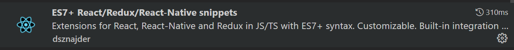
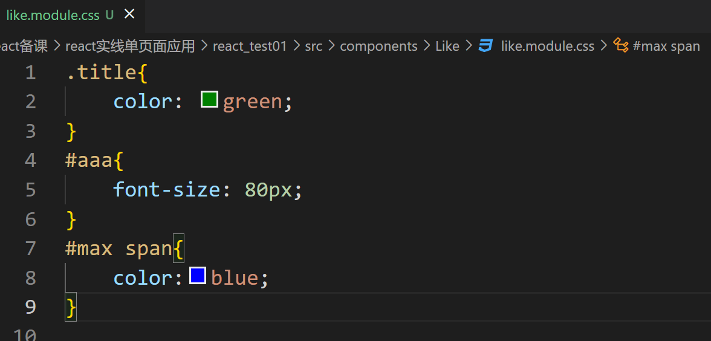
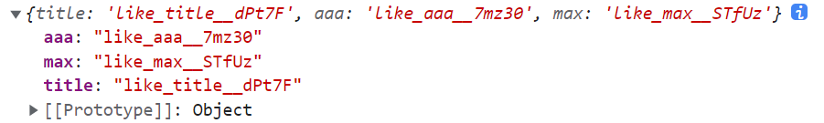

# 第二章：class 组件以及组件中的state,props属性

## 本章目标

- 会使用class类创建组件 
- 掌握props的使用
- 掌握state状态的使用
- React项目中使用style相关

## 回顾 

jsx语法  函数式组件 

函数式组件适用于非常简单的结构   

class类组件使用于复杂情况  


## 一、class类创建组件 



### 1.1 基于class关键字创建组件

+ 使用 class 关键字来创建组件

```js
//使用class创建的类，通过extents关键字，继承了React.Component之后，就是一个组件的模板了。
class Person extends React.Component{
    render(){ 
        // 在render函数中，必须返回一个null或者符合规范的虚拟DOM元素
        return <div>
            <h1>这是用 class 关键字创建的组件！</h1>
        </div>;
    }
}

```

## 二、组件中的props详解

### 2.1 props 概念

当 React 元素为用户自定义组件时，它会将 JSX 所接收的属性（attributes）以及子组件（children）转换为单个对象传递给组件，这个对象被称之为 “props”。

### 2.2 props的使用

- **函数式组件中**

  构造函数中必须声明props属性，才可以使用

  **Hello.js组件中：**

  ```js
  export default function(props){
      return <div >
              <h1>这是一个h1标,属于hello.js组件</h1>
              <p>接收父组件传递来的参数：{props.name}</p>
          </div>
  }
  ```

  **父组件中：**

  ```js
  //先导入子组件
  import Hello from './components/Hello/Hello.js'
  //使用子组件
  <Hello name="张三"></Hello>
  ```

- **对象式组件中**

  **定义一个组件**

  ```js
  import React from 'react'
  class Like extends React.Component{
      constructor(){
          super()
          //如果构造函数没有显式接收props 
          //console.log(this.props)//undefined
      }
      constructor(props){
          super(props)
          //此处构造函数有显式接收props 
          //console.log(this.props)//此处可以正常接收到父组件传递来的数据
      }
      render(){
          return <h1 >你好哈哈哈哈</h1>
      }
  }
  export default Like
  ```

  **注意：** 在class中定义的组件中，如果要在constructor之外的位置使用props,不需要接收 可以直接使用`this.props` , 但是如果想在constructor之内使用`this.props` 需要先构造函数的参数列表以及`super`中事先声明`props`。

  - 无论是使用函数或是类来声明一个组件，它决不能修改它自己的props。
  - 所有的React组件必须像纯函数那样使用它们的props。
  - 类组件中的属性和函数的调用必须使用this关键字
  
  ```js
  import React from "react";
  //创建类式的组件  类名就是组件的名字
  //自己创建的类必须要继承React内部提供的类
  //React.component  所有的类组件都要继承 这个类
  /*
      父类：被称为 超类 
      子类：被称为 派生类
          子类是被父类创建出来的！
          没有父类，可以有子类吗？ 无父无子
              创建子类对象之前，必须先初始化父类！！！
  */
  
  class Father extends React.Component{
      /* 构造函数：只会在创建对象时执行，所以我们选择在构造函数中 重置aaa函数的this指向 */
      constructor(props){
          //在创建Father之前 先初始化 一个React.Component 父类对象。
          //但凡是存在继承  那么就必须调用super()
          super(props)
  
          //改变函数aaa中的this指向 并且把bind返回的函数重新赋值给 aaa
          this.aaa = this.aaa.bind(this)
  
  
          //如果想在constuctor中使用props,必须要先入参
          console.log("props",this.props)
  
      }
      //在类式组件中 不需要声明 就可以直接使用 props
      //就是相当于继承自 父类的render函数
      //当数据发生改变时，就会执行这个render函数
      render(){
          return (
              <div>
                  这是使用class类创建的组件
                  <h1>接收到APP.js的数据：{this.props.name}</h1>
                  {/* 在调用函数的时候 可以直接通过bind改变aaa函数的this指向，但是这样不太好
                      只要render函数 重新执行，那么aaa函数的this就要被重置一次,代码会重复执行。
                  */}
                  {/* <button onClick={this.aaa.bind(this)}>点我</button> */}
                  <button onClick={this.aaa}>点我</button>
              </div>
          )
      }
  
      aaa(){
          //类中这个函数 相当于默认开启了 严格模式 所以此处无法直接使用this 
          console.log(this)
          console.log(this.props.name)
          //哪些知识点可以改变this指向？
          /*
              call(obj,arg1,arg2....),apply(obj,[.....])
                  会自动先执行一次。
              bind(obj) bind函数会改变this指向 并且同时返回另一个函数，
              那么后续我们再使用时，只能使用bind()返回的新函数。
              //let aaa = aaa.bind()
          */
      }
  }
  export default Father
  ```
  
  

### 2.3 props的默认值和类型规定

#### 2.3.1 默认值设置

**格式：**

```
组件名.defaultProps = {
	name="张三"
}
如果调用组件时，不传递name属性 此时会使用默认的name值
```

#### 2.3.2 类型规定

**格式：**

```js
15.5版本之前的验证方式
组件名.propTypes = {
	name:React.PropTypes.String.isRequired
}

现在的验证方式：
//1.先导入用于验证的库
import PropTypes from 'prop-types';
//2.定义验证类型
组件名.propTypes = {
	//name属性 必须是字符串类型，并且必须要传递 string指定类型， isRequired指定必填
	name:PropTypes.string.isRequired
}

  // 你可以将属性声明为 JS 原生类型，默认情况下
  // 这些属性都是可选的。
  optionalArray: PropTypes.array,
  optionalBool: PropTypes.bool,
  optionalFunc: PropTypes.func,
  optionalNumber: PropTypes.number,
  optionalObject: PropTypes.object,
  optionalString: PropTypes.string,
  optionalSymbol: PropTypes.symbol,
注意：PropTypes 提供一系列验证器，可用于确保组件接收到的数据类型是有效的。当传入的 prop 值类型不正确时，JavaScript 控制台将会显示警告。出于性能方面的考虑，propTypes 仅在开发模式下进行检查。

可以通过 defaultProps对象来给属性设置默认值：
	组件名.defaultProps = {
        name:'张三',
        age:18
    }
```

#### 2.3.4 使用 `...运算符`传递参数

```js
在父组件向子组件传递参数时，可以直接使用...运算符
let obj = {
	name:'张三',
	age:18,
	address:'郑州'
}
<Hello {...obj}></Hello>
```

### 2.4 props中的children属性

- 只要子组件标签内有内容，props中就会出现一个children属性
- 子组件标签内的内容可以是任意的，children都可以进行接收
- children只是一个比较特殊的属性，子组件标签上也可以写自定义属性
- 属性值可以是任意类型

使用props的children属性 就相当于vue中的插槽，但是react中是没有插槽的概念的。

```
//匿名插槽
//Father组件中调用son组件
<Son>
	<span>我是嵌入组件体中的内容</span>
</Son>

//Son组件中
通过props.children属性可以取到 标签体内容

//具名插槽
props属性传值 除了接收普通的数据类型外，还可以直接传递 标签 以标签作用数据
<Son left={<span>我是left的值</span>}></Son>
此时在子组件中 可以通过this.props.left 来获取到这个 标签结构

你可以任意的选择该属性放置的位置，渲染时 会被解析成对应的DOM结构元素。
```


## 三、组件中的私有属性state状态/数据

### 3.1 简介

**概念：**在组件中，我们可以定义state来实现私有属性，除了拥有并设置了它的组件，其他组件都无法访问。
State 与 props 类似，但是 state 是私有的，并且完全受控于当前组件。

### 3.2 使用

state表示的是组件中的私有数据，如果我们的组件需要有属于自己的私有数据，那么state的使用是必不可少的。

#### 3.2.1 使用位置

**定义位置：**组件类的构造器中

```js
class Like extends React.Component{
    constructor(){
        super()
        this.state = {
            name:'张三'
        }
    }
    return (
    	<div>{this.state.name}</div>
    )
}
```

#### 3.2.2 类组件中定义函数

**案例：**定义一个handsome(帅气) 组件，包含一个h1标签 ，一个按钮，点击按钮切换h1标签中的内容('你好帅' ，'你好丑')

```js
//定义handSome组件
import React from 'react'
class HandSome extends React.Component{
    constructor(props){
        super(props)
        //在state中定义 isShow属性用来控制 内容的展示
        this.state = {
            isShow:false
        }
        console.log(this.props)
        //this.changeIsShow = this.changeIsShow.bind(this)
    }
	
    //在这个changeIsShow函数中无法直接使用this取到state中的数据，因为这里的this是undefined
    /*如果想使用this：有两种方式：
    	方式一：在构造函数中 通过bind()方法改变 changeIsShow()函数的this指向
    	方式二：定义函数时，不要定义普通函数，要使用箭头函数
    		changeIsShow=()=>{
    			这里可以使用this
    		}
    */
    changeIsShow(){
        //此处无法直接拿到this的值 ,此处 跟React没有关系，是js本来就有的特性,类中的方法会自动的开启严格模式,只要开启严格模式 this就是undefined 如果不开启严格模式this应该指向window对象。
        //并且这个方法是通过onclick回调的 并不是直接通过React的实例对象调用的 所以此处的this是 undefined
        /*
        	例如
        	let obj = {
              name: 'lisi',
              say() {
                console.log(this.name)
              },
            }
            obj.say();//lisi

            let d = obj.say
            d()//error
		//解决办法：在调用的时候使用bind绑定this
        */
        console.log(this)//undefined
        
        
        //注意:我们无法直接修改state中的值 官方推荐我们使用
        /*
        	this.setState({})的方式来修改
        */
        
        let isShow = !this.state.isShow
        this.setState({isShow})
    }

    render(){
        return (
            <div>
                <h1>
                    {this.state.isShow ? "你好帅" : '你好丑'}
                </h1>
				<button onClick={this.changeIsShow}>点我</button>
			</div>
    }
}

export default HandSome
```

#### 3.2.3 state状态+onChange事件实现双向数据绑定

案例需求：state中定义msg属性  把msg属性赋值给input框，当input框的值发生改变时，让页面中显示的msg的值也发生改变

```js
import React from 'react'
import PropTypes from 'prop-types';
class Like extends React.Component {
    constructor() {
        super()
        this.state = {
            msg:'你好哈哈哈'
        }
    }
    changeMsg=(event)=>{
        //从事件对象中可以取出数据
        console.log(event.target.value)
        /* let msg = this.state.msg; */
        this.setState({msg:event.target.value})
    }

    render() {
        return (
            <div>
                <h2>{this.state.msg}</h2>
                <input onChange={this.changeMsg} value={this.state.msg} />
            </div>
        )
    }
}

export default Like
```

#### 3.2.4 state在使用时的其它注意事项

//$.nextTick() 当DOM渲染完毕后再执行

**State 的更新可能是异步的**：
		出于性能考虑，React 可能会把多个 setState() 调用合并成一个调用。因为 this.props 和 this.state 可能会异步更新，所以你不要依赖他们的值（state）来更新下一个状态。

例如：上边案例的changeMsg函数中，如果我们在this.setState()的下边添加一行输出语句，此时会发现，这个输出语句输出的是修改之前的数据。异步操作

```js
 changeMsg=(event)=>{
        //从事件对象中可以取出数据
        console.log(event.target.value)
        /* let msg = this.state.msg; */
        this.setState({msg:event.target.value})
        
        console.log(this.state.msg)
    }
```

**解决方式：**

​		要解决这个问题，可以让 `setState()` 接收一个函数而不是一个对象。这个函数用上一个 state 作为第一个参数，将此次更新被应用时的 props 做为第二个参数，如果想使用更新过的最新的数据做额外的操作，

此时可以在setState(回调函数1，回调函数2)添加第二个回调函数，其中可以操作最新的数据。

```js
// Correct
changeMsg = (event) => {
        this.setState((state, props) => ({
           msg:event.target.value
        }),()=>{
            console.log(this.state.msg)
        });
    }
```

小节：其实props和state类似 都是属于类的实例对象身上的属性，所以在构造之外的位置可以直接使用this.props和this.state来调用。

#### 3.2.5 单向数据流

**单向数据流：**

​		组件可以选择把它的 state 作为 props 向下传递到它的子组件中，这通常会被叫做“自上而下”或是“单向”的数据流。任何的 state 总是所属于特定的组件，而且从该 state 派生的任何数据或 UI 只能影响树中“低于”它们的组件。

如果你把一个以组件构成的树想象成一个 props 的数据瀑布的话，那么每一个组件的 state 就像是在任意一点上给瀑布增加额外的水源，但是它只能向下流动。

### 3.3 两种创建组件方式的对比

**注意:以上两种创建组件的方式，有着本质上的区别，**

- 使用function构造函数创建的组件
  - 内部没有state私有数据，只有一个props来接收外界传递过来的数据
  - 使用function创建的组件，叫做【无状态组件】 最本质的区别，就是有无state属性;
  - function创建的组件，没有自己的生命周期函数;
  - react17/18 函数式组件中可以通过useState钩子函数来创建属于自己的state数据。
- 使用class类创建的组件
  - 使用class关键字创建的组件，内部，除了有this.props这个只读属性之外，还有一个专门用于存放自己私有
    数据的this.state属性，这个state是可读可写的!
  - 使用class创建的组件，叫做【有状态组件】最本质的区别，就是有无state属性;
  - class创建的组件，有自己的生命周期函数

**问题: **什么时候使用有状态组件，什么时候使用无状态组件呢???

1. 如果一个组件需要存放自己的私有数据，或者需要在组件的不同阶段执行不同的业务逻辑，此时，非常适合用class
   创建出来的有状态组件;
2. 如果一个组件，只需要根据外界传递过来的props，渲染固定的页面结构就完事儿了，此时，非常适合使用
   function创建出来的无状态组件;(使用无状态组件的小小好处:由于剔除了组件的生命周期，所以，运行速度会相对快一些


### 3.5 React-style

一个小案例，巩固有状态组件和无状态组件的使用

#### 通过for循环生成多个组件

1. 数据：

```
CommentList = [
    { user: '张三', content: '哈哈，沙发' },
    { user: '张三2', content: '哈哈，板凳' },
    { user: '张三3', content: '哈哈，凉席' },
    { user: '张三4', content: '哈哈，砖头' },
    { user: '张三5', content: '哈哈，楼下山炮' }
]
1.数组渲染
{
	this.state.CommentList.map(item => {
		return <Item {...item} key={item.user}></Item>
	})
}
2.jsx语法
3.抽离组件
import React from 'react'
export default function Item(props) {
    return (
        <div>
            姓名:{props.user},内容：{props.content}
        </div>
    )
}
```


## 四、React项目中style样式的使用

### 4.1 直接引入外部的css文件

```
1. 有样式覆盖情况
style.css     
引入 import './style.css' 
但是此种会导致样式之间产生冲突。
```

### 4.2 把css文件以模块化的方式封装

css in js : js形式的css

```js
//可以避免组件样式覆盖
可以分模块定义   style.module.css
import style from './style.module.css'
//会把样式表以模块化的形式导入使用 
console.log(style)
```





经过导入后 会呈现出如上图所示：

使用时：

```js
 <div id={likeStyle.max}>
     <h1 className={likeStyle.title}>
         {this.state.isShow ? this.props.name : '你好丑'}
    </h1>
    <h2 id={likeStyle.aaa}>{this.state.msg}</h2>
    <Hello></Hello>
    <span>这是一个span标签</span>
</div>
```

###  4.3 使用普通的style样式

style 中不能直接写样式，此时不是真正的html 而是jsx语法，所写的都是一些js语句，所以在次数，style = {{}}  外层{} 是jsx语法书写js代码的形式， 内层{}是一个对象来表现样式

样式优化1 样式提出来，作为js变量 

const userStyle = {fontSize: '14px'};

样式优化2 如果有很多样式，可以统一保存在一个样式对象中

```
const styles = {
    item: {border: '1px dashed #ccc', margin: '10px', padding: '10px', boxShadow: '0 0 #ccc'},
    user: {fontSize: '14px'},
    content: {fontSize: '12px'}
}
```

样式优化3 把样式封装到js文件中。

```
style.js
export default{
    item: {border: '1px dashed #ccc', margin: '10px', padding: '10px', boxShadow: '0 0 10px #ccc'},
    user: {fontSize: '14px'},
    content: {fontSize: '12px'}
}

import styles from '@/components/styles.js'
```


推荐文章：

https://zhuanlan.zhihu.com/p/110533397

https://www.jianshu.com/p/8ba5fe0c4215

## 五、protal 传送门 

Portal 提供了一种将子节点渲染到存在于父组件以外的 DOM 节点的优秀的方案。

```
ReactDOM.createPortal(child, container)
```

第一个参数（`child`）是任何[可渲染的 React 子元素](https://react.docschina.org/docs/react-component.html#render)，例如一个元素，字符串或 fragment。第二个参数（`container`）是一个 DOM 元素。

在项目中有一些组件会被复用很多次，并且我们有时候并不希望这个组件位于当前使用的位置，而是想让他位于 一个固定的位置，不会影响其余的DOM结构，例如 公共的弹出框 组件，那么我们可以使用 react中提供的 `protal`来达成我们的目的。

#### 用法

通常来讲，当你从组件的 render 方法返回一个元素时，该元素将被挂载到 DOM 节点中离其最近的父节点：

```react
render() {
  // React 挂载了一个新的 div，并且把子元素渲染其中
  return (
    <div>      {this.props.children}
    </div>  );
}
```

然而，有时候将子元素插入到 DOM 节点中的不同位置也是有好处的：

```react
render() {
  // React 并*没有*创建一个新的 div。它只是把子元素渲染到 `domNode` 中。
  // `domNode` 是一个可以在任何位置的有效 DOM 节点。
  return ReactDOM.createPortal(
    this.props.children,
    domNode  );
}
```

一个 portal 的典型用例是当父组件有 `overflow: hidden` 或 `z-index` 样式时，但你需要子组件能够在视觉上“跳出”其容器。例如，对话框、悬浮卡以及提示框。

一般来说：

```jsx
我们可以在body中创建一个跟#root同级的节点
import React from 'react'
import PropTypes from 'prop-types'
import styles from './Dialog.module.scss'
import { useState } from 'react'
import { useEffect } from 'react';
import ReactDOM from 'react-dom';
let bbb = document.getElementById('dialog')
function Dialog(props) {
    ///console.log(props.show);

    let [showDialog, setShowDialog] = useState(false);
    
    const closeDialog = () => {
        props.closeDialog()
    }
    const open = () => {
        setShowDialog(true)
    }
    const ok = () => {
        props.onok()
    }
    //正常渲染模式
    /* return (
        <div className={styles.container} >
            <div className={styles.box} style={{
                width: props.width || 300
            }}>
                <h3>{props.title}</h3>
                <h1>{props.msg}</h1>
                {
                    props.children === undefined ? '' : props.children
                }
                <div>
                    <button onClick={ok}>确定</button>
                    <button onClick={closeDialog}>取消</button>
                </div>
            </div>
        </div>

        
    ) */
    //使用传送门的渲染方式
    let aaa = (
        <div className={styles.container} >
            <div className={styles.box} style={{
                width: props.width || 300
            }}>
                <h3>{props.title}</h3>
                <h1>{props.msg}</h1>
                {
                    props.children === undefined ? '' : props.children
                }
                <div>
                    <button onClick={ok}>确定</button>
                    <button onClick={closeDialog}>取消</button>
                </div>
            </div>
        </div>
    )
    return ReactDOM.createPortal(aaa, bbb)
}

Dialog.propTypes = {}

export default Dialog

```


## 作业：

1. 

React中引入图片的方式

```
#  demo.jsx 组件
#引入
import img1 from './../assets/image/xxx.jpeg';
或
const img2 = require('./../assets/image/xxx.jpeg');

#使用

<div style={{background:`url(${img2}) center center no-repeat`}}>
或


```

2. 自定义封装弹出框组件