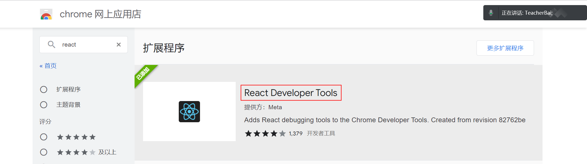
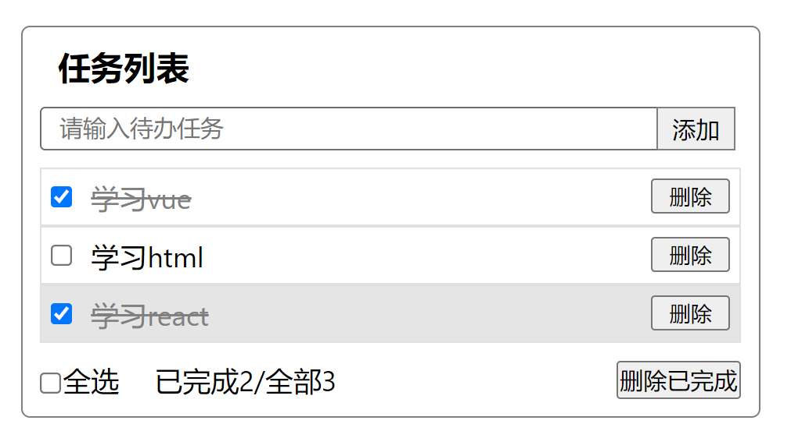
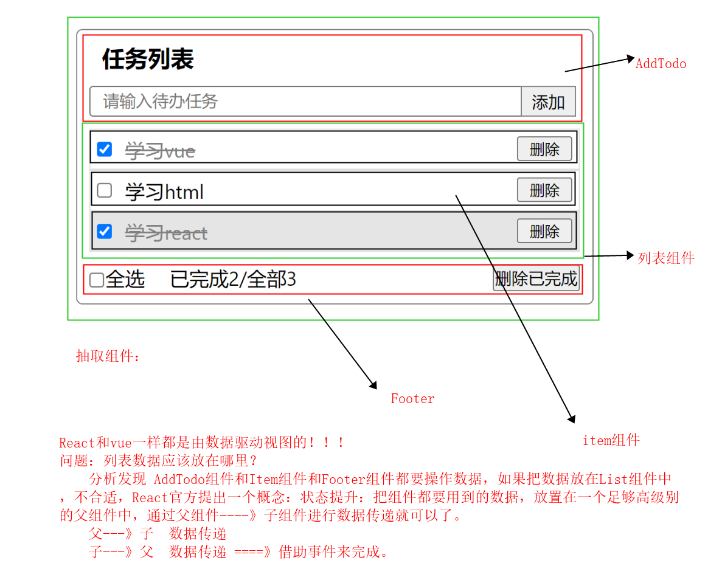
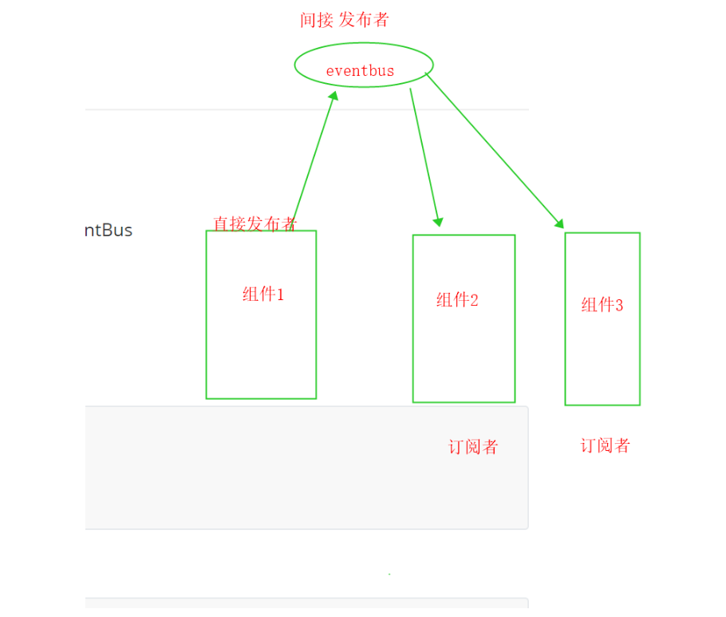
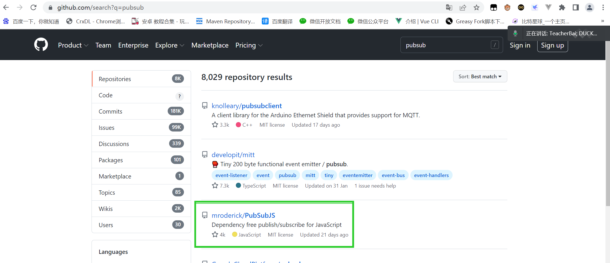

## 一、react03 --TodoList案例/Context/Effect

### 补充：state和props的简写形式 

```react
在昨天的代码中 state会被定义在当前类组件的 constructor构造函数中
class Aaa extends Component {
    constructor(props) {
        super(props)
        this.state = {
			name:"张三",
			age:18
        }
    }
}
相当于是在Aaa这个类的身上添加了一个属性 此语法其实跟 类中static属性的作用是一样的 所以可以把代码简写成如下格式：
export default class StateTest extends Component {
    constructor() {
        super();
    }
    state = {
        name: '老焦',
        age: 18,
        isShuaiQi: true,
        msg: '你好哈哈哈',
        CommentList: [
            { user: '张三', content: '哈哈，沙发' },
            { user: '张三2', content: '哈哈，板凳' },
            { user: '张三3', content: '哈哈，凉席' },
            { user: '张三4', content: '哈哈，砖头' },
            { user: '张三5', content: '哈哈，楼下山炮' }
        ]
    }
}
此时，这种语法不需要再写 constructor构造函数了。

props属性的验证器也一样：
	正常写法：
		组件名.propTypes = {
			//name属性 必须是字符串类型，并且必须要传递 string指定类型， isRequired指定必填
			name:PropTypes.string.isRequired
		}
	组件名其实就是类名，所以以上语法也可以简写成：
		static propTypes = {
			name:PropTypes.string.isRequired
		}
```

安装react的开发者工具 



todoLists最终案例效果图： 抽离组件





### 第一步：把数据渲染出来 

1. 先抽取公共的数据todoLists放在App根组件中
2. 从App根组件把数据传递给 List列表组件
3. 在Lists列表组件对数据进行处理 遍历< Item>组件

### 第二步：添加一个新的任务 

**react中子组件向父组件传递数据：** 

第一步：先在父组件中定义一个函数   把这个函数作为参数传递给子组件

第二步：在子组件中调用这个 函数  并传入需要传递的数据

第三步：父组件中该函数就会被触发  并接收到传递来的参数

```
//父组件中定义用于接收addTodo组件传递来的数据
  receiveNewAddTodo = (val) => {
    console.log("接收到来自addTodo组件的新任务数据", val);
  }
  render() {
    let { todoLists } = this.state
    return (
      <div className='App'>
        <h1>任务列表</h1>
        <AddTodo
        	//把该函数以参数的形式传递给addTodo子组件
          receiveNewAddTodo={this.receiveNewAddTodo}

        ></AddTodo>
        <List
          todoLists={todoLists}
        >

        </List>
        <Footer></Footer>
      </div>
    );
  }
  
  //子组件中：
  //定义向父组件传递新任务数据的方法
    addTodo = () => {
    	//调用父组件传递来的参数 这个参数就是负组件中用于接收 子组件数据的方法。
        this.props.receiveNewAddTodo(this.state.val);
    }

    render() {
        return (
            <div className={styles.addtodo}>
                <input type="text" onChange={this.changeVal} placeholder='请求输入新的任务' />
                //点击按钮时调用 addTodo方法
                <button onClick={this.addTodo}>添加</button>
            </div>
        )
    }
    
```

​	点击添加按钮需要获取到input框输入的值 并且把这个数据传递给 App父组件，在父组件中要对整体的todoList数据做更新。

1. 把input框的值跟State绑定 双向数据绑定
2. 点击按钮 把这个数据传递给App父组件 **子---》父传递** 
3. 在App父组件中 拿到todo组件传来的数据 对todoLists做更新。

### 第三步：把列表的选中状态与App父组件中的数据关联起来

如果使用常规方式，需要做三层传递  app组件--》List组件---》Item组件 太麻烦  如果层级再多 就会更加麻烦。

所以使用 不相干组件之间的数据传递。

#### 不相干组件之间的数据传递



EventBus 总线传值 消息发布与订阅

组件1 ----》组件2 

通过消息发布与订阅的思想来完成兄弟(不相干)组件之间的数据传递EventHub/EventBus

####  使用第三方库 PubSubjs /events

vue中有自带的方法可以完成总线传值，但是react中没有，我们可以借助第三方库来实现 不相干组件之间的数据传递。



1. 安装：`npm i pubsub-js`

2. 发布组件代码：

```js
//导入PubSub库
import PubSub from 'pubsub-js'

PubSub.publish("methodName", data)进行发送值
```

3. 订阅组件代码：

```js
//导入PubSub库
import PubSub from 'pubsub-js'
PubSub.subscribe("methodName", (msg, data) => {})来接收数据
第一个参数是事件名
msg表示 消息的名字 ====》 methodName
data就是传递来的数据

componentDidMount(){
    PubSub.subscribe('list1',(_,e)=>{
        //更新数据的代码
    })
}
```

4. 取消订阅

   ```
   取消指定订阅：PubSub.unsubscrib(名称)
    
   取消所有订阅：PubSub.clearAllSubscriptions()
   ```

   

在Item组件中 我们改变复选框的选中状态时，需要从Item组件---->App组件传递数据，当前点击的 id 和复选框的状态 ，App父组件接收到数据之后 对todoLists做数据更新。

1. 首先给Item组件中的复选框绑定onChange事件 调用父组件传递到子组件的函数
2. 通过这个函数把数据传递给App父组件
3. 更新todoLists数据中对应id的isFinish。

### 第四步：全选功能

在Footer组件中当改变 全选框的状态时 需要把 全选框的checked值，传递给App父组件，父组件根据 接收到的checked修改，todoLists中所有的isFinish。

1. 给Footer组件的全选框绑定onChange事件，触发时 把 checked值传递过去
2. App组件使用Checked更新TodoLists的状态

### 第五步：反选，总任务，已完成任务，删除已完成任务 实线步骤 同上！！！


## 二、React中context的使用

### 2.1 什么是context ?

```
Context 提供了一个无需为每层组件手动添加 props，就能在组件树间进行数据传递的方法。在一个典型的 React 应用中，数据是通过 props 属性自上而下（由父及子）进行传递的，但这种做法对于某些类型的属性而言是极其繁琐的（例如：地区偏好，UI 主题），这些属性是应用程序中许多组件都需要的。Context 提供了一种在组件之间共享此类值的方式，而不必显式地通过组件树的逐层传递 props。

也就是说：Context提供了一个局部的全局作用域，使用Context则无需再手动的逐层传递props。
```

### 2.2 context的使用

**Context 设计目的是为了共享那些对于一个组件树而言是“全局”的数据**

#### 2.2.1**`React.createContext`**

```
const MyContext = React.createContext(defaultValue);
```

创建一个 Context 对象。当 React 渲染一个订阅了这个 Context 对象的组件，这个组件会从组件树中离自身最近的那个匹配的 `Provider` 中读取到当前的 context 值。

**只有**当组件所处的树中没有匹配到 Provider 时，其 `defaultValue` 参数才会生效。这有助于在不使用 Provider 包装组件的情况下对组件进行测试。注意：将 `undefined` 传递给 Provider 的 value 时，消费组件的 `defaultValue` 不会生效。

该API调用会会返回一个Context对象  可以把它作为是一个组件。这个组件中会含有另外的两个组件 `Provider`和`Consumer`

**使用：**我们一般会单独定义一个`Context.js`文件 其中用来存放并向外暴漏 通过`React.createContext(defaultValue)`API创建的Context对象。

```js
import React from 'react';
const Context = React.createContext()
export default Context
```

#### 2.2.2 `Context.Provider` 和`Context.Consumer`

我们一般会在公共的父组件中 使用`<Context.Provider></Context.Provider>`组件包括需要订阅其数据的所有子组件。

该`<Context.Provider></Context.Provider>`中会含有一个value属性，在value中我们会设置一些数据，这些数据可以被其中所包括的所有子组件所共享，避免了层层传递数据。

**使用：** 

在Parent.jsx父组件中

```jsx
//导入公共的Context.js 文件
import Context from 'Context.js'
function Parent(props){

	return (
        <Context.Provider value={{name:"张三",age:18}}>
            <div>
                <Son></Son>
            </div>
		</Context.Provider>
	)
}
```

在Son.js子组件中/(包括后续嵌套的所有层级的组件中都可以使用这种方式来获取数据)

```jsx
#获取数据的方式一：
//导入公共的Context.js 文件
import Context from 'Context.js'
function Son(props){
//使用其提供的Consumer组件来订阅Context的变更,需要一个函数作为子元素,函数的第一个形参便是Provider组件提供的value值
	return (
        <Context.Consumer>
            {(value) => {
                return (
                  <div>
                    第一种使用Context方式获取的值：{value}
                  </div>
                );
              }}
		</Context.Consumer>
	)
}
这种方式太麻烦 不推荐使用！！！
```

##### 使用`useContext()`钩子函数 来完成数据的获取

```jsx
#获取数据的方式二：
//函数式组件中 也可以使用React中提供的useContext()钩子函数 来完成数据的获取
//该钩子函数中的参数 必须是一个Context对象
import Context from 'Context.js'
import {useContext} from 'react'
function Son(props){
    //把导入的Context对象 作为参数传入useContext()中
    //此时 返回的context就是 父组件中 provider组件中定义的value属性的值。
    let context = useContext(Context);
	return (
        <div>{JSON.stringify(context)}</div>
	)
}

只有当组件所处的树中没有匹配到 Provider 时，其 defaultValue 参数才会生效。此默认值有助于在不使用 Provider 包装组件的情况下对组件进行测试。注意：将 undefined 传递给 Provider 的 value 时，消费组件的 defaultValue 不会生效。
```

**第三种：Class组件：React.createContext提供的Provider和class的contextType属性**

> 挂载在 class 上的 contextType 属性会被重赋值为一个由 React.createContext() 创建的 Context 对象。这能让你使用 this.context 来消费最近 Context 上的那个值。你可以在任何生命周期中访问到它，包括 render 函数中。

使用`static`关键字添加静态属性，和直接在`class`添加属性效果一致,最终都会添加到类上，而不是类的实例上 

```jsx
import React, { Component } from "react";
import context from "./context";
class ClassC extends Component {
    //此处把context赋值给 类中的contextType属性 之后就可以通过 this.context来获取到 共享的数据
  static contextType = context;
  render() {
    const value = this.context;
    return <div>第三种使用Context方式获取的值：{JSON.stringify(value)}</div>;
  }
}

// ClassC.contextType = context; //此处与写static关键字作用一致
export default ClassC;
```

#### 2.2.3 子组件也可以修改Context中共享的数据

父组件中在`<Context.Provider >`组件中 向子组件传递数据时  可以直接传递useState类型的数据[num,setNum]，这样就可以在子组件中 通过调用父组件传递的setNum函数 来修改Context中的数据，并且所有订阅了`context`的子组件都能更新到最新的值。

### 2.3 使用Context改版todoLists案例

## 三、React中useEffect()钩子的使用

### 3.1 useEffect的作用

***Effect Hook* 可以让你在函数组件中执行副作用操作**

```jsx
import React, { useState, useEffect } from 'react';
function Example() {
  const [count, setCount] = useState(0);

  // Similar to componentDidMount and componentDidUpdate:  
  useEffect(() => {    
  	// Update the document title using the browser API    
  	document.title = `You clicked ${count} times`;  
  });
  return (
    <div>
      <p>You clicked {count} times</p>
      <button onClick={() => setCount(count + 1)}>
        Click me
      </button>
    </div>
  );
}
```

这段代码基于[上一章节中的计数器示例](https://react.docschina.org/docs/hooks-state.html)进行修改，我们为计数器增加了一个小功能：将 document 的 title 设置为包含了点击次数的消息。

数据获取，设置订阅以及手动更改 React 组件中的 DOM 都属于副作用。不管你知不知道这些操作，或是“副作用”这个名字，应该都在组件中使用过它们。

在 React 组件中有两种常见副作用操作：需要清除的和不需要清除的。

**useEffect案例：**

```jsx
import React, { useState, useEffect } from 'react';

function Example() {
  const [count, setCount] = useState(0);

  useEffect(() => {
    document.title = `You clicked ${count} times`;
  });

  return (
    <div>
      <p>You clicked {count} times</p>
      <button onClick={() => setCount(count + 1)}>
        Click me
      </button>
    </div>
  );
}
```

**useEffect 做了什么？** 通过使用这个 Hook，你可以告诉 React 组件需要在渲染后执行某些操作。React 会保存你传递的函数（我们将它称之为 “effect”），并且在执行 DOM 更新之后调用它。在这个 effect 中，我们设置了 document 的 title 属性，不过我们也可以执行数据获取或调用其他命令式的 API。

**为什么在组件内部调用 useEffect？** 将 useEffect 放在组件内部让我们可以在 effect 中直接访问 count state 变量（或其他 props）。我们不需要特殊的 API 来读取它 —— 它已经保存在函数作用域中。Hook 使用了 JavaScript 的闭包机制，而不用在 JavaScript 已经提供了解决方案的情况下，还引入特定的 React API。

**useEffect 会在每次渲染后都执行吗？** 是的，默认情况下，它在第一次渲染之后和每次更新之后都会执行。（我们稍后会谈到如何控制它。）你可能会更容易接受 effect 发生在“渲染之后”这种概念，不用再去考虑“挂载”还是“更新”。**React 保证了每次运行 effect 的同时，DOM 都已经更新完毕。** 

### 3.2 useEffect钩子函数的使用

**使用方法一：**不需要清除的effect

```jsx
useEffect钩子函数接收一个回调函数作为参数。该函数会在组件渲染完毕后执行。
//基础使用
useEffect(()=>{
	//副作用操做
})

提示: 通过跳过 Effect 进行性能优化
在某些情况下，每次渲染后都执行清理或者执行 effect 可能会导致性能问题。
如果某些特定值在两次重渲染之间没有发生变化，你可以通知 React 跳过对 effect 的调用，只要传递数组作为 useEffect 的第二个可选参数即可：
useEffect(() => {
  document.title = `You clicked ${count} times`;
}, [count]); // 仅在 count 更改时更新
上面这个示例中，我们传入 [count] 作为第二个参数。这个参数是什么作用呢？如果 count 的值是 5，而且我们的组件重渲染的时候 count 还是等于 5，React 将对前一次渲染的 [5] 和后一次渲染的 [5] 进行比较。因为数组中的所有元素都是相等的(5 === 5)，React 会跳过这个 effect，这就实现了性能的优化。

当渲染时，如果 count 的值更新成了 6，React 将会把前一次渲染时的数组 [5] 和这次渲染的数组 [6] 中的元素进行对比。这次因为 5 !== 6，React 就会再次调用 effect。如果数组中有多个元素，即使只有一个元素发生变化，React 也会执行 effect。


如果想执行只运行一次的 effect（仅在组件挂载和卸载时执行），可以传递一个空数组（[]）作为第二个参数。这就告诉 React 你的 effect 不依赖于 props 或 state 中的任何值，所以它永远都不需要重复执行。这并不属于特殊情况 —— 它依然遵循依赖数组的工作方式。
useEffect(()=>{
	//副作用操做
},[])

除此之外，请记得 React 会等待浏览器完成画面渲染之后才会延迟调用 useEffect，因此会使得额外操作很方便。
```

**使用方法二：**需要清除的effect

```jsx
useEffect钩子函数接收一个回调函数作为参数。该函数会在组件渲染完毕后执行。
//基础使用
useEffect(()=>{
	//副作用操作
	//该函数可以定义一个返回值  返回值也是一个函数  在这个函数中可以完成一些清除操作/收尾操作
	return ()=>{
		//清除操作/收尾操作
	}
})

案例：搜索框
	正常来说 当我们在搜索框中输入内容时 会触发一个事件 向后台发送请求 根据输入内容请求数据search()，但是 如果我们只是使用onChange事件的话 会发现 每次只要内容有改变 就会立即调用search()函数 这样的话太过于浪费性能，所以我们一般会使用防抖 来处理搜索框。
	react中提供的有更好的方式可以来解决这个问题，就是使用effect!!!
	
import React, { useState, useEffect } from 'react';

function Example1() {
   
    let [val, setVal] = useState('');
    const changeVal = (e) => {
        //console.log(a, e);
        setVal(e.target.value)
        //search();
    }
    const search = () => {
        console.log("开始搜索");
    }
    useEffect(() => {
        let timer = setTimeout(() => {
            search();
        }, 500);
        return () => {
            //此处用于清除定时器
            clearTimeout(timer)
        }
    }, [val])
    return (
        <div>
            <input type="text" value={val} onChange={(e) => changeVal(e)} />
        </div>
    );
}
export default Example1
```

### 3.3 使用useEffect改版todoLists代码

## 四、作业

1. 完成课堂案例 todoLists

2. 完成购物车案例 

   

