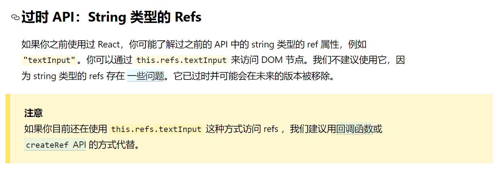
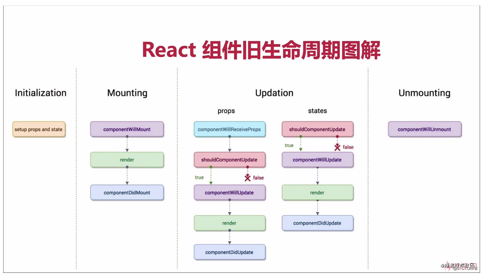
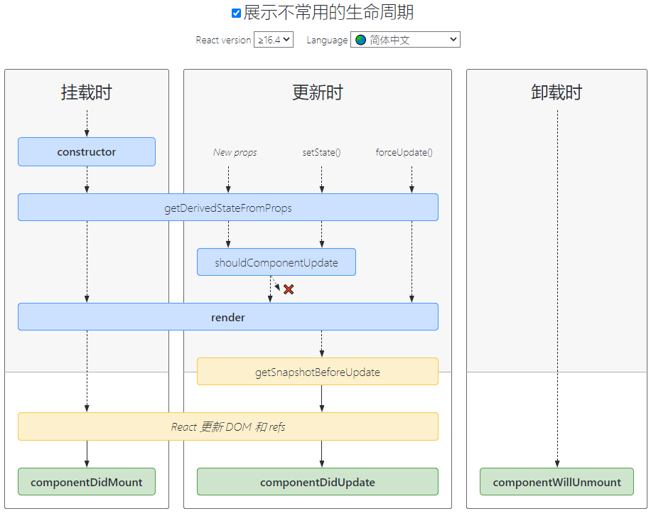

# 第四章：useReducer/useRef 钩子和类组件生命周期

## 本章目标

- 掌握useReducer钩子的使用
- 掌握ref的用法
- 掌握useRef钩子的使用
- 掌握react类组件的生命周期函数

## 一、useReducer 钩子的使用 

### `useReducer` 

```jsx
const [state, dispatch] = useReducer(reducer, initialArg, init);
```

[`useState`](https://react.docschina.org/docs/hooks-reference.html#usestate) 的替代方案。它接收一个形如 `(state, action) => newState` 的 reducer，并返回当前的 state 以及与其配套的 `dispatch` 方法。（如果你熟悉 Redux 的话，就已经知道它如何工作了。

在某些场景下，`useReducer` 会比 `useState` 更适用，例如 state 逻辑较复杂且包含多个子值，或者下一个 state 依赖于之前的 state 等。并且，使用 `useReducer` 还能给那些会触发深更新的组件做性能优化，因为[你可以向子组件传递 `dispatch` 而不是回调函数](https://react.docschina.org/docs/hooks-faq.html#how-to-avoid-passing-callbacks-down) 。

以下是用 reducer 重写 [`useState`](https://react.docschina.org/docs/hooks-reference.html#usestate) 一节的计数器示例：

```jsx
const initialState = {count: 0};

function reducer(state, action) {
  switch (action.type) {
    case 'increment':
      return {count: state.count + 1};
    case 'decrement':
      return {count: state.count - 1};
    default:
      throw new Error();
  }
}

function Counter() {
  const [state, dispatch] = useReducer(reducer, initialState);
  return (
    <>
      Count: {state.count}
      <button onClick={() => dispatch({type: 'decrement'})}>-</button>
      <button onClick={() => dispatch({type: 'increment'})}>+</button>
    </>
  );
}
```

> 注意
>
> React 会确保 `dispatch` 函数的标识是稳定的，并且不会在组件重新渲染时改变。这就是为什么可以安全地从 `useEffect` 或 `useCallback` 的依赖列表中省略 `dispatch`。

#### 指定初始 state

有两种不同初始化 `useReducer` state 的方式，你可以根据使用场景选择其中的一种。将初始 state 作为第二个参数传入 `useReducer` 是最简单的方法：

```
  const [state, dispatch] = useReducer(
    reducer,
    {count: initialCount}  
    );
```

> 注意
>
> React 不使用 `state = initialState` 这一由 Redux 推广开来的参数约定。有时候初始值依赖于 props，因此需要在调用 Hook 时指定。如果你特别喜欢上述的参数约定，可以通过调用 `useReducer(reducer, undefined, reducer)` 来模拟 Redux 的行为，但我们不鼓励你这么做。

#### 惰性初始化

你可以选择惰性地创建初始 state。为此，需要将 `init` 函数作为 `useReducer` 的第三个参数传入，这样初始 state 将被设置为 `init(initialArg)`。init函数需要返回一个 跟初始state类型相同的数据结构。

这么做可以将用于计算 state 的逻辑提取到 reducer 外部，这也为将来对重置 state 的 action 做处理提供了便利：

```jsx
function init(initialCount) {  
    return {count: initialCount};
}
function reducer(state, action) {
  switch (action.type) {
    case 'increment':
      return {count: state.count + 1};
    case 'decrement':
      return {count: state.count - 1};
    case 'reset':      
    	return init(action.payload);    
    default:
      throw new Error();
  }
}

function Counter({initialCount}) {
  const [state, dispatch] = useReducer(reducer, initialCount, init);  
    return (
    <>
      Count: {state.count}
      <button
        onClick={() => dispatch({type: 'reset', payload: initialCount})}>        Reset
      </button>
      <button onClick={() => dispatch({type: 'decrement'})}>-</button>
      <button onClick={() => dispatch({type: 'increment'})}>+</button>
    </>
  );
}
```

#### 跳过 dispatch

如果 Reducer Hook 的返回值与当前 state 相同，React 将跳过子组件的渲染及副作用的执行。（React 使用 [`Object.is` 比较算法](https://developer.mozilla.org/en-US/docs/Web/JavaScript/Reference/Global_Objects/Object/is#Description) 来比较 state。）

需要注意的是，React 可能仍需要在跳过渲染前再次渲染该组件。不过由于 React 不会对组件树的“深层”节点进行不必要的渲染，所以大可不必担心。如果你在渲染期间执行了高开销的计算，则可以使用 `useMemo` 来进行优化。

**使用useReducer()钩子改版 todoLists** 

## 二、React组件中的DOM操作 

**概念：**Refs 提供了一种方式，允许我们访问 DOM 节点或在 render 方法中创建的 React 元素。

**引入：**ref引用，有时候我们在项目开发期间，会有一些需求：能够拿到一些DOM元素相关的内容，然后去处理一些业务逻辑。通常来说我们可以通过给元素绑定事件 来获取其事件对象，但是这种只能获取触发事件的元素本身，并不能获取到DOM结构中的其它元素，那么此时我们就可以通过ref来完成这个需求。

### 1.1 类组件：字符串形式的ref使用(过时API)

**使用：** 在组件模板标签中添加ref属性，通过`this.refs.属性`就可以拿到该元素DOM对象。

```jsx
import React, { Component } from 'react'

export default class index extends Component {

    getInpVal=()=>{
        console.log(this.refs.inp.value)
    }

    render() {
        return (
            <div>
                <input type="text" ref='inp'/>
                <button onClick={this.getInpVal}>点我获取input框的值</button>
            </div>
        )
    }
}
```



### 1.2 类组件：回调refs

**概念：**React 也支持另一种设置 refs 的方式，称为“回调 refs”。它能助你更精细地控制何时 refs 被设置和解除。你会传递一个函数。这个函数中接受 React 组件实例或 HTML DOM 元素作为参数，以使它们能在其他地方被存储和访问。

**使用：** 在组件的标签，或者子组件上添加`ref={(e)=>{this.inp = e}}` 此时的ref的值不是字符串标识了，而是一个回调函数。

**写法一：**

```jsx
import React, { Component } from 'react'

export default class index extends Component {

    getInpVal=()=>{
        //2.此时，我们可以直接从this上获取到inp 进而取到其中的数据
        console.log(this.inp.value)
    }

    render() {
        return (
            <div>
                //1.此处的e表示的就是当前所在的input元素，回调函数中 把el赋值给this.inp 相当于把el挂载到了React实例对象的inp属性上，inp属性是随意起的名字
                <input type="text" ref={(el)=>this.inp = el}/>
                <button onClick={this.getInpVal}>点我获取input框的值</button>
            </div>
        )
    }
}
```

**写法二：**把设置在ref中的回调函数定义在外部，此时也是可以的。

```jsx
import React, { Component } from 'react'

export default class index extends Component {

    setInp=(e)=>{
        this.inp = e
    }

    getInpVal=()=>{
        console.log(this.inp.value)
    }

    render() {
        return (
            <div>
                {/* <input type="text" ref='inp'/> */}
                <input type="text" ref={this.setInp}/>
                <button onClick={this.getInpVal}>点我获取input框的值</button>
            </div>
        )
    }
}
```

### 1.3 类组件：通过createRef()方法来实现

```jsx
import React, { Component } from 'react'

export default class index extends Component {

    //1.该方法会创建一个容器，用来存储ref所表示的DOM元素,赋值给ref1相当于把这个容器挂载到this上,当前创建的React实例上。
    ref1 = React.createRef()
    
    getInpVal=()=>{
        //3.可以从this.ref1.current中取值
        console.log(this.ref1.current.value)
    }

    render() {
        return (
            <div>
                //2.此处 ref标识的就是 ref1 会把当前input元素对象存入 ref1指代的容器中
                <input type="text" ref={this.ref1}/>
                <button onClick={this.getInpVal}>点我获取input框的值</button>
            </div>
        )
    }
}
```

### 1.4 函数式组件 useRef()钩子

```
const refContainer = useRef(initialValue);//创建一个容器
```

`useRef` 返回一个可变的 ref 对象，其 `.current` 属性被初始化为传入的参数（`initialValue`）。返回的 ref 对象在组件的整个生命周期内保持不变。

```jsx
function TextInputWithFocusButton() {
  const inputEl = useRef(null);
  const onButtonClick = () => {
    // `current` 指向已挂载到 DOM 上的文本输入元素
    inputEl.current.focus();
  };
  return (
    <>
      <input ref={inputEl} type="text" />
      <button onClick={onButtonClick}>Focus the input</button>
    </>
  );
}
```

本质上，`useRef` 就像是可以在其 `.current` 属性中保存一个可变值的“盒子”。所以 就算我们自己创建一个普通对象，只要其中含有一个current属性 这个对象也可以作为DOM元素的容器来使用。

你应该熟悉 ref 这一种[访问 DOM](https://react.docschina.org/docs/refs-and-the-dom.html) 的主要方式。如果你将 ref 对象以 `<div ref={myRef} />` 形式传入组件，则无论该节点如何改变，React 都会将 ref 对象的 `.current` 属性设置为相应的 DOM 节点。

然而，`useRef()` 比 `ref` 属性更有用。它可以[很方便地保存任何可变值](https://react.docschina.org/docs/hooks-faq.html#is-there-something-like-instance-variables)，其类似于在 class 中使用实例字段的方式。

这是因为它创建的是一个普通 Javascript 对象。而 `useRef()` 和自建一个 `{current: ...}` 对象的唯一区别是，`useRef` 会在每次渲染时返回同一个 ref 对象。

```
也就是说：
	const inputEl = useRef(null);
	const inputEl = {current:null};
		在运行时 这两者是等效的。
	区别：
		useRef 会在每次渲染时返回同一个 ref 对象。而自己创建的js对象 是会每一次都被重新创建一个新的对象的。
```

请记住，当 ref 对象内容发生变化时，`useRef` 并*不会*通知你。变更 `.current` 属性不会引发组件重新渲染。如果想要在 React 绑定或解绑 DOM 节点的 ref 时运行某些代码，则需要使用[回调 ref](https://react.docschina.org/docs/hooks-faq.html#how-can-i-measure-a-dom-node) 来实现。

### 1.5 受控组件与非受控组件

在大多数情况下，我们推荐使用 [受控组件](https://react.docschina.org/docs/forms.html#controlled-components) 来处理表单数据。在一个受控组件中，表单数据是由 React 组件来管理的。另一种替代方案是使用非受控组件，这时表单数据将交由 DOM 节点来处理。

## 三、类组件的生命周期函数 ==== 函数组件useEffect

### 2.1 为什么要用生命周期函数

**实现案例：**计时器，每隔1秒 改变一次。

错误代码：

```jsx
import React, { Component } from 'react'
export default class index extends Component {

    state={
        time:new Date()
    }
    
    render() {
        setInterval(() => {
            console.log(111)
            this.setState({
                time:new Date()
            })
        }, 1000);
        return (
            <div>
                <h2>{this.state.time.toLocaleString()}</h2>
            </div>
        )
    }
}
以上代码，效果可以实现，但是定时器会无限叠加，指数级！！！
```

使用React生命周期函数来完成效果：

```jsx
import React, { Component } from 'react'
import moment from 'moment'
export default class index extends Component {

    state={
        time:new Date()
    }
    
    //需求完成一个时钟效果，每秒更新一次
    componentDidMount(){
        setInterval(() => {
            console.log(111)
            this.setState({
                time:new Date()
            })
        }, 1000); 
    }

    render() {
        return (
            <div>
                <h2>{this.state.time.toLocaleString()}</h2>
            </div>
        )
    }
}
```

### 2.2 组件的生命周期

出生 ---》活着---》死亡

创建---》提供服务---》销毁/卸载

 + 概念：在组件创建、到加载到页面上运行、以及组件被销毁的过程中，总是伴随着各种各样的事件，这些在组件特定时期，触发的事件，统称为 组件的生命周期；

 + 注意：在React版本更新过程中，有些钩子函数被遗弃了（官方手册有提示）。

 + 组件生命周期分为三部分：

   四个阶段：

   1. 初始化 props和state
   2. 挂载阶段
   3. 更新阶段(会重复执行)
   4. 卸载阶段

   

   render() 执行n+1次 。

 + 

   

   - **组件挂载阶段**：组件创建阶段的生命周期函数，有一个显著的特点：创建阶段的生命周期函数，在组件的一辈子中，只执行一次；

     - constructor:如果不初始化 state 或不进行方法绑定，则不需要为 React 组件实现构造函数
     - render：第一次开始渲染真正的虚拟DOM，当render执行完，内存中就有了完整的虚拟DOM了，但是页面尚未显示dom元素
       - 在return之前虚拟dom还没有开始创建，页面上拿不到任何元素 
       - return执行完毕后，虚拟dom创建好了，但是还没有挂在到页面上。
     - componentDidMount: 组件完成了挂载，此时，组件已经显示到了页面上，当这个方法执行完，组件就进入都了 运行中 的状态，页面，虚拟内存中，数据保持一致。 
       -  最早只能在此函数中操作dom元素
       -  相当于vue中的mounted钩子函数
       -  此组件执行完，就进入到了运行中的状态，所以此函数是组件创建阶段的最后一个函数

   - **组件运行阶段**：也有一个显著的特点，根据组件的state和props的改变，有选择性的触发0次或多次；

     - shouldComponentUpdate(nextProps, nextState): 组件是否需要被更新，此时，组件尚未被更新，但是，state 和 props 肯定是最新的

       - 此函数中要求必须返回一个boolean 如果返回一个fasle,则不会继续执行后续的生命周期函数，而是直接退回到了运行中状态，此时后续的render函数并没有被执行，因此页面不会被更新，但是组件中的state状态，却被修改了

       - 可以通过不同的条件来指定后续的执行效果

         - 偶数次累加

         - ```
           // console.log(this.state.num);
           // return nextState.num %2 ===0?true:false;
           ```

     - componentWillUpdate组件将要被更新了(被废弃)

     - render: 此时，又要重新根据最新的 state 和 props 重新渲染一棵内存中的 虚拟DOM树，当 render 调用完毕，内存中的旧DOM树，已经被新DOM树替换了！此时页面还是旧的

     - componentDidUpdate(prevProps, prevState): 此时，页面又被重新渲染了，state 和 虚拟DOM 和 页面已经完全保持同步

       -  组件完成了更新，此时，state中的数据、虚拟DOM、页面上的DOM，都是最新的，此时，你可以放心大胆的去操作页面了

   - **组件销毁阶段**：也有一个显著的特点，一辈子只执行一次；

     - componentWillUnmount: 组件将要被卸载，此时组件还可以正常使用；

#### defaultProps

> 在组件创建之前，会先初始化默认的props属性，这是全局调用一次，严格地来说，这不是组件的生命周期的一部分。在组件被创建并加载候，首先调用 constructor 构造器中的 this.state = {}，来初始化组件的状态。
>
> 1. 给组件设置默认props属性：
>
>    ```
>    static defaultProps = {
>    	num:100
>    }
>    ```
>
> 2. 给属性进行类型校验，需要先运行`cnpm i prop-types --save`
>
> 3. import  Types from 'prop-types'
>
> 4. static propTypes  = {number:Types .number}

#### 了解生命周期函数

React生命周期的回调函数总结成表格如下：

**被新版本摒弃的钩子函数**

+ Mounting：

   + componentWillMount() （新版本已摒弃）
     + 组件即将挂在到页面上时执行，此时还没有挂在到页面上 ，虚拟dom也没开始创建
     + 等同于vue中的created钩子函数
     + 无法获取dom
     + 能获取到props
     + 能获取到state
     + 能调用自定义函数

+ Updating：

   + componentWillReceiveProps(nextProps) （新版本已摒弃）
     + 组件将要接收外界传递过来的新的props属性值
     + 当子组件第一次被渲染到页面上的时候，不会触发这个函数
     + 只有当父组件中，通过某些事件，重新修改了传递给子组件的props 数据之后，才会触发
     + 获取的数据不是最新，
     + 最新的数据通过参数来获取

 + componentWillUpdate(nextProps, nextState) （新版本已摒弃）

   - 组件将要更新，此时尚未更新，在进入这个生命周期函数的时候，内存中的虚拟DOM是旧的，页面上的DOM元素也是旧的

   - 此时页面上的 DOM节点，都是旧的，应该慎重操作，因为你可能操作的是旧DOM     看：innerhtml

     ```
     获取dom元素
     1.原生方式
     2.ref属性
     ```

### 2.3 新版生命周期(了解)

参考官网

- getDerivedStateFromProps
- getSnapshotBeforeUpdate

### 2.4 生命周期总结

**最常用的钩子函数：**

- componentDidMount()  ====》vue中的mounted

  这个钩子中一般做一些初始化的事情，开启定时器，发送网络请求取数据，订阅消息等

- render()

  只要内容有更新就会执行 次数  n+1次 

- componentWillUnmount()

  这里一般做一些收尾工作，关闭定时器，取消 消息订阅等。


## 四、总结与作业

总结react生命周期，面试题

react组件之间的通信方式：

使用今天内容改版昨天内容