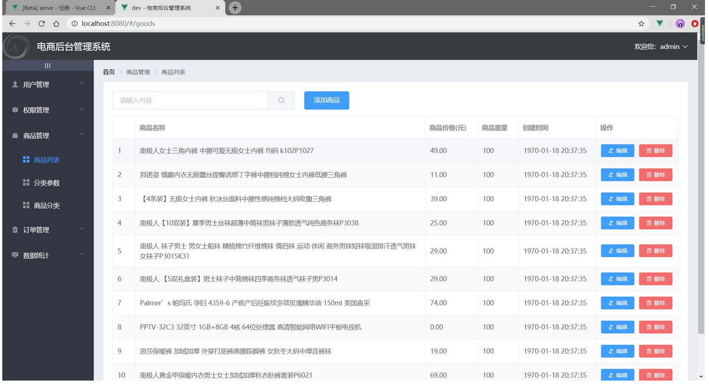

# 第五天：ReactRouter

## 回顾

useReducer/useRef 

组件中的DOM操作 current

类组件 lifeCycle

render()  至少执行一次 n+1

componentDidMount   componentDidUpdate  componentWillUnmount

函数组件 ====》 useEffect

## 本章内容 

- 理解路由的作用
- 掌握一级路由的配置方法
- 掌握二级路由(嵌套路由)的配置方法
- 掌握路由传参的使用方法 

## 一、路由 

举个栗子：


对来说路由器：路由就是 一个路由接口对应一台终端设备。key===value

< component  :is='aaa'>aaa  ===   AAA.vue 

< iframe  name='aaa' >  < a  href="独立的 html 页面" target='aaa'>

### 1.1 什么是路由

React Router 是react 官方的路由管理器。react 路由允许我们通过不同的 URL 访问不同的内容。根据 url 锚点路径，在容器中加载不同的模块，本质作用是做页面导航。 hash #/ 模式 history  /stu

路由的本质就是一种对应关系，比如说我们在url地址中输入我们要访问的url地址之后，浏览器要去请求这个url地址对应的资源。
 那么url地址和真实的资源之间就有一种对应的关系，就是路由。

#### 路由分为前端路由和后端路由

1. 后端路由是由服务器端进行实现，并完成资源的分发.
   					概念: 根据不同的URL请求,返回不同的内容
     				**本质: URL请求地址与服务器资源之间的对应关系**
2. 前端路由是依靠hash值(锚链接)的变化进行实现 
   					概念: 根据不同的事件显示不同的页面内容,即事件与事件处理函数之间的对应关系.
      					前端路由主要做监听事件并分发执行事件处理函数

**路由：实际上就是一组对应关系。** 

​		**一个路径对应一个路由组件。**   这个路径表示的仅仅是纯前端级 组件跳转。类似于锚点。

### 1.2 为什么要用路由

**主要目的：就是为了开发SPA应用** 

SPA: single page web application。单页[Web](https://baike.baidu.com/item/Web/150564)应用（single page web application，SPA），就是只有一张Web页面的应用。单页应用程序 (SPA) 是加载单个HTML 页面并在用户与应用程序交互时动态更新该页面的Web应用程序。 [1] 浏览器一开始会加载必需的HTML、CSS和JavaScript，所有的操作都在这张页面上完成，都由JavaScript来控制。因此，对单页应用来说模块化的开发和设计显得相当重要。

速度：更好的用户体验，让用户在web app感受native app的速度和流畅，

·MVVM：经典MVVM开发模式，前后端各负其责。

·ajax：重前端，业务逻辑全部在本地操作，数据都需要通过AJAX同步、提交。

·路由：在URL中采用#号来作为当前视图的地址,改变#号后的参数，页面并不会重载。

通过 react 可以实现多视图的单页Web应用（single page web application，SPA）（单页面应用开发）

- 一种特殊的Web应用。它将所有的活动局限于一个Web页面中，仅在该Web页面初始化时加载相应的HTML、JavaScript、CSS。
- 一旦页面加载完成，SPA不会因为用户的操作而进行页面的重新加载或跳转，而是利用JavaScript动态的变换HTML（采用的是div切换显示和隐藏），从而实现UI与用户的交互



### 1.3 路由的工作原理

路由渲染的本质其实是超链接锚点：通过`location.href`可以获取到当前的路径地址，通过`location.hash`可以获得锚点的名字内容，也就是`#name` 。

当用户点击了页面中的路由链接时，会使链接的地址发生改变，相当于点击页面中的超链接时，链接的锚点发生改变，也叫做hash值 。路由会监听这个地址的变化，从而把这个地址对应的组件渲染到页面上。

这就意味着，我们要实时的监听浏览器地址栏中的内容，只要地址栏的内容发生了改变，我们就要获取到 地址栏中末尾位置的**路径地址** 然后根据这个路径地址 来渲染出不同的组件。需要监听事件`onhashChange` 只要地址发生改变 这个事件就可以触发。

### 1.4 路由的使用和配置


react路由官网地址：https://v5.reactrouter.com 

请参考印记中文：https://docschina.org/ 

 **安装：** 

```js
注意：这里安装react路由的5版本
npm install react-router-dom@5  
```

#### 1.4.1 react路由的基本使用 


- **了解react中路由的两种模式**
  
- `<BrowserRouter/> `  h5 history 模式 
  
- `<HashRouter/>  `       hash模式
  
  跟vue不同，vue中的路由模式需要在路由配置文件中定义mode设置，在react中 我们需要一开始就导入需要使用的路由模式，并且这个模式 就表示我们应用中的路由器对象。
  
- **了解react中的`<Route/>`** 

  - Route 表示定义路由的规则，在Route上，有两个比较重要的属性，path,component  
  - path就表示跳转的路径  component表示该路径对应得组件
  - 其中的exact属性 表示严格匹配，路径必须完全匹配才可以进行路由跳转
  - strict 属性 表示路径在匹配时 路径最后的斜线 是否参与匹配  为true 表示参与匹配
  - Route 除了是规则 还是占位符 类似于 vue中的 `<router-view/>`标签

- **了解`<Link/>`组件** 

  - `<Link/>`表示一个路由的链接
  - 类似于vue中的`<router-link to=""></router-link>`

#### 1.4.2 开始配置和使用react路由：

react路由是一个组件化的路由，内置组件

- **在组件中导入需要使用到的内置路由组件**，和需要使用路由跳转的自定义组件**

  ```react
  import {
    BrowserRouter as Router,
    Switch,
    HashRouter,
    Route,
    Link
  } from "react-router-dom";
  ```

  ```react
  //导入需要跳转的组件
  import Student from './components/Student/Student.jsx'
  import Subject from './components/Subject/Subject.jsx'
  ```

- 配置路由跳转

  ```jsx
  import logo from './logo.svg';
  import './App.css';
  
  import React, { Component } from 'react'
  //导入react-router中需要的组件
  import { BrowserRouter, HashRouter, Link, Route } from 'react-router-dom'
  //导入需要跳转的组件
  import Student from './components/Student/Student.jsx'
  import Subject from './components/Subject/Subject.jsx'
  export default class App extends Component {
    render() {
      return (
        <div className="App">
          <HashRouter>
            <div id="header">
              <h1>欢迎来到qy147班级管理系统</h1>
            </div>
            <div id='left'>
              <ul>
                {/* 编写路由链接 */}
                <li><Link to='/student'>学生管理</Link></li>
                <li><Link to='/subject'>学科管理</Link></li>
              </ul>
            </div>
            <div id='right'>
              {/* 注册路由 */}
              <Route path='/student' component={Student}></Route>
              <Route path='/subject' component={Subject}></Route>
            </div>
          </HashRouter>
        </div>
      )
    }
  }
  ```

#### 1.4.3 区分路由组件和普通组件

**路由组件：**经过路由导航跳转到的组件 ===》路由组件

```react
<Route path='/student' component={Student}></Route>
```

**普通组件：**我们直接通过标签形式定义到页面上的===》普通组件

```react
<Student />
```

**区别：** (路由组件之间的参数传递) 两者接收到的props是不同的。

- **路由组件的props：**

  

- **普同组件的props:**

  如果父组件传递了数据，那么props中就包含组件传递的数据，否则就是空的。

#### 1.4.4 react中路由`<NavLink/>`组件 

**解释：**一个特殊版本的 [`Link`](https://github.com/docschina/react-router.cn/blob/cn/packages/react-router-dom/docs/api/Link.md)，当它与当前 URL 匹配时，为其渲染元素添加样式属性。

- **activeClassName**: string

  要给出的元素的类处于活动状态时。默认的给定类是 `active`。它将与 `className` 属性一起使用。

  ```react
  <NavLink to='/student'>学生管理</NavLink>
  如果不设置activeClassName 值默认为active 如果设置了就按照我们自己设置的名字
  ```
  
- activeStyle:{} 对象类型  表示激活后的样式

  ```jsx
  <NavLink to='/sub/chinese' activeStyle={{backgroundColor:'red'}}>语文</NavLink>
  ```


#### 1.4.5 react路由中的`<Switch/>`组件 

React的路由在匹配路由链接时，如果遇到下边的情况：

```jsx
<Route path='/student' component={Student}></Route>
<Route path='/subject' component={Subject}></Route>
<Route path='/ssss' component={sss}></Route>
<Route path='/ssss' component={bbb}></Route>
```

上边路由在匹配时 会同时把sss组件和bbb组件的内容都进行展示，因为两个组件指定的是同一个路径，也就是说React路由在匹配到第一个/ssss时,并不会停止，而是会继续向下匹配，这样会导致效率太低，所以我们可以使用`<Switch/>`组件。

使用这个内置组件后，只要路由匹配到了一个链接，就不会接着向下匹配了，可以提高效率。

#### 1.4.6 react路由中的`<Redirect/>`组件

**解释：**渲染 `<Redirect>` 将使导航到一个新的地址。这个新的地址会覆盖 history 栈中的当前地址。类似于vue中的redirect。

可以设置页面打开时/路由跳转时，默认展示的路由组件。

```jsx
<Route path='/student' component={Student}></Route>
<Route path='/subject' component={Subject}></Route>
<Redirect  to='/subject'  />
表示当以上都不符合时 匹配到Redirect指向的路径展示


把该标签写在 某一个路由组件内时  在访问该组件时 会直接跳过要访问的当前组件 去到 redirect指向的组件。

把该标签写在跟组件配置时 可以配置  <Redirect from={'/stu'} to={'/sub'}>
    当访问/stu时  会重定向到/sub
```

#### 1.4.7 嵌套路由(二级路由)

用法跟一级路由类似。

**注意：**注册子路由时要添加上父路由的路径地址，路由的匹配是按照注册路由的顺序匹配的。

```jsx
import React, { Component } from 'react'
import {NavLink,Route} from 'react-router-dom'
import Chinese from './Chinese'
import English from './English'
export default class Subject extends Component {
  render() {
    return (
      <div>
          <h1>这里是学科组件信息</h1>
          <button><NavLink to='/sub/chinese'>语文</NavLink></button>
          <button><NavLink to='/sub/english'>英语</NavLink></button>
          <hr />
          <Route path='/sub/chinese' component={Chinese}></Route>
          <Route path='/sub/english' component={English}></Route>
      </div>
    )
  }
}
```


#### 1.4.8 路由的push和replace模式

push:向路由栈中压入一条记录  默认push 

replace：替换掉路由栈中最新的一条记录

跟vue一样。

### 1.5 路由组件传递参数

动态路由匹配

#### 1.5.1 **传递params参数**

需要使用到 props对象中的 match对象

match对象中有4个参数：

```react
match:{
	isExact: true,//判断当前访问的路径 跟Route指定的路经规则是否匹配  true/false
	params:{}//通过路径中 /stu/stuinfo/:id/:name   路径中的 参数 会进入params
	path: "/stu/stuinfo/:id/:name"
	url: "/stu/stuinfo/2/李四"
}
```

学生组件中：

```jsx
import React, { Component } from 'react'
//导入react-router中需要的组件
import { BrowserRouter, Redirect, HashRouter, Link, NavLink, Route } from 'react-router-dom'
//导入学生信息组件
import StudentInfo from './StudentInfo/'
export default class Student extends Component {
    state = {
        students: [
            {id: "001", name: '张三', address: '郑州'},
        	{id: "002", name: '李四', address: '北京'},
        	{id: "003", name: '王五', address: '上海'}]
    }
    render() {
        //console.log(this.props)
        return (
            <div>
                <h1>这里是Student学生组件</h1>
                <div>
                    <ul>
                        {
                            this.state.students.map(item => {
                                return (
                                    <li key={item.id}>
                                        {/* 携带params参数 */}
                                        <NavLink to={'/student/stuInfo/'+item.id+'/'+item.address+'/'+item.name} >{item.name}</NavLink>
                                    </li>
                                )
                            })
                        }
                    </ul>
                </div>
                <div>
                    {/* 声明接收路由组件的参数 */}
                    <Route path='/student/stuInfo/:id/:address/:name' component={StudentInfo}></Route>
                </div>
            </div>
        )
    }
}
学生组件中 向路由路径中携带参数
```

学生详情组件中：

```jsx
import React, { Component } from 'react'

export default class StudentInfo extends Component {
  render() {
    console.log(this.props)
    return (
      <div>
          <h2>这里是学生详情组件</h2>
          <h3>学生编号:{this.props.match.params.id}---学生姓名:{this.props.match.params.name}--学生地址：{this.props.match.params.address}</h3>
      </div>
    )
  }
}
从this.props.match.params中取出数据
```


**小结：** 注册路由时 路径中拼接要传递的参数，跳转到的目标组件中通过`this.props.match.params`取参数

#### 1.5.2 传递search参数

```js
传递时：通过&连接多个参数
<NavLink to={`/student/stuInfo?id=${item.id}&name=${item.name}&address=${item.address}`} >{item.name}</NavLink>

```

```js
接收时 正常接收即可，不需要做额外声明
<Route path='/student/stuInfo' component={StudentInfo}></Route>
通过this.props.location.search取到数据

但是此时取到的是一个字符串数据：search: "?id=001&name=张三&address=郑州"  URLencode格式
可以通过第三方的querystring库来对字符串数据进行解析

安装：
	npm i querystring
导入：
	import qs from 'querystring'
两个方法：
	qs.stringify(search)  	把对象转换成字符串
	qs.parse(search)		把字符串转换成对象
console.log(qs.parse(this.props.location.search))
```


#### 1.5.3 传递query参数

```JSX
传递时：
<NavLink to={
	{
		pathname:'/student/stuInfo',
		query:{
            id:item.id,
            name:item.name,
            address:item.address
         }
     }
}>
	{item.name}
</NavLink>

接收时：
接收时 正常接收即可，不需要做额外声明
<Route path='/student/stuInfo' component={StudentInfo}></Route>
this.props.location.query
```

#### 1.5.4 state传递参数

```jsx
传递时：
<NavLink to={
	{
		pathname:'/student/stuInfo',
		state:{
            id:item.id,
            name:item.name,
            address:item.address
        }
     }
}>
	{item.name}
</NavLink>

接收时：
接收时 正常接收即可，不需要做额外声明
<Route path='/student/stuInfo' component={StudentInfo}></Route>
this.props.location.state
```

### 1.6 编程式路由 


通过给组件中的标签，或者按钮添加点击事件触发编程式路由：

```react
this.props.history.go()        正数 前进  负数 后退
this.props.history.goBack()     后退
this.props.history.goForward()  前进
this.props.history.push()       带有历史的跳转
this.props.history.replace()    不带有历史的跳转
上述方法携带参数的方式跟使用<Link/>组件的方式是一样的。
如下所示：
```

##### 路由传参:

```
params:
<Route path='/path/:name' component={Path}/>
声明式：<link to="/path/2">xxx</Link>
编程式：this.props.history.push({pathname:"/path/" + name});
//读取参数用:this.props.match.params.name
```

```
query:
<Route path='/query' component={Query}/>
<Link to={{ pathname : ' /query' , query : { name : 'sunny' }}}>
this.props.history.push({pathname:"/query",query: { name : 'sunny' }});
//读取参数用: this.props.location.query.name
```

```
state:
<Route path='/sort ' component={Sort}/>
<Link to={{ path : ' /sort ' , state : { name : 'sunny' }}}> 
this.props.history.push({pathname:"/sort ",state : { name : 'sunny' }});
//读取参数用: this.props.location.state.name
```

```
search:
<Route path='/web/departManange ' component={DepartManange}/>
<link to="web/departManange?tenantId=12121212">xxx</Link>
this.props.history.push({pathname:"/web/departManange?tenantId" + row.tenantId});
//读取参数用: this.props.location.search
```

### 1.7 `<Route>`组件的另外两个参数

`<Route>`组件中的component属性用于指定一个需要渲染的组件，但是除了component属性之外，还有两个属性也可以用来做组件渲染。

**`render`属性：**

```
1.该属性需要一个回调函数作为参数，回调函数的返回值 最终会被挂载到组件中去。返回值是一个jsx元素
<Route to='/stu' render={()=><Student />}>
2.该属性渲染的路由组件的props属性中 不会自动含有{location,history,match}等属性，需要通过自己设置才可以
//该回调函数会接收一个routeProps属性 其中含有location,history,match等属性，我们需要手动的把这些属性传递给student组件。
<Route to='/stu' render={(routeProps)=><Student {...routeProps}/>}>
```

**`children`属性：**

```jsx
children属性有两种用法：
	1.用法与render属性类似。
	2.children属性可以直接设置为组件
		<Route to='/stu' children={<Student/>}>
		或者
		<Route to='/stu'>
			<Student/>//可以直接把组件写在Route标签内部
		</Route>
```

关于`location`,`match`, `history`三个参数的简易使用方式：

```jsx
let location = useLocation()
let match = useRouteMatch()
let history = useHistory()
let params = useParams()
```

### AntDesign 组件库

## 二、总结与作业

掌握今天有关react路由的知识点。